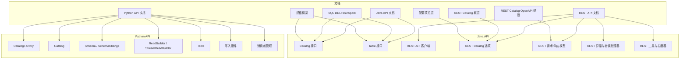
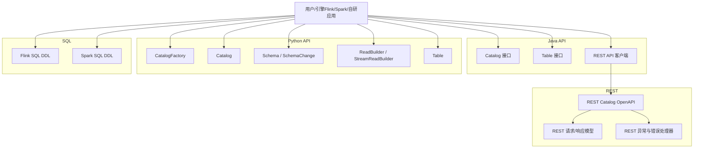
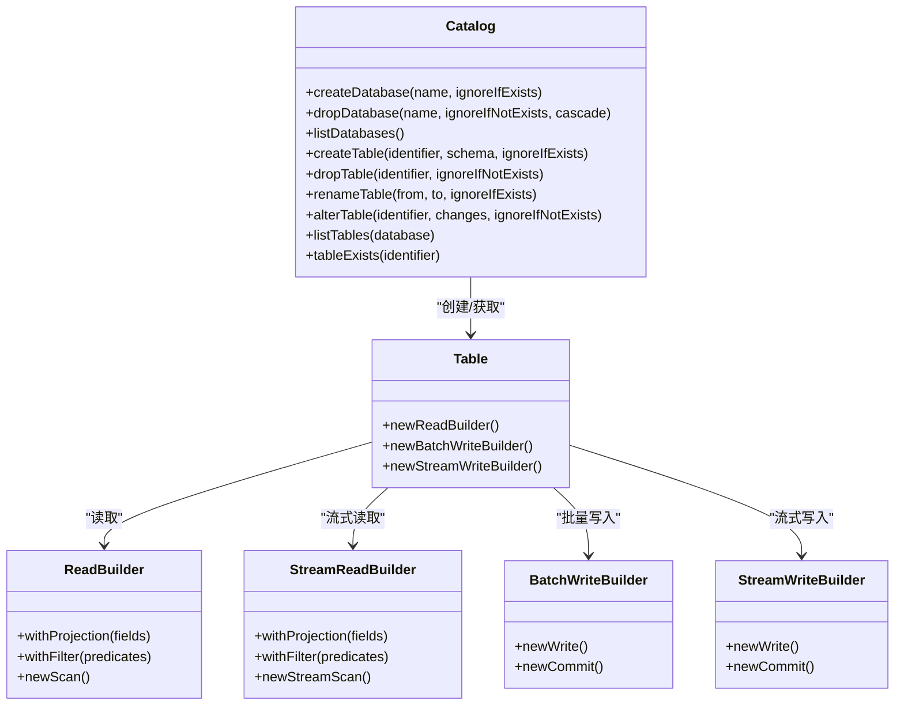
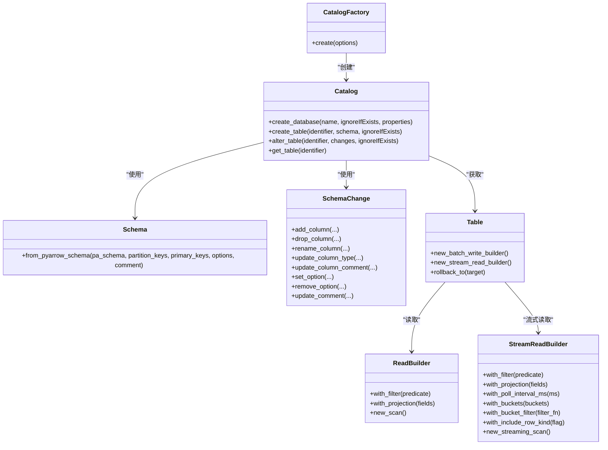
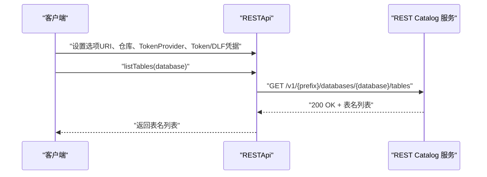
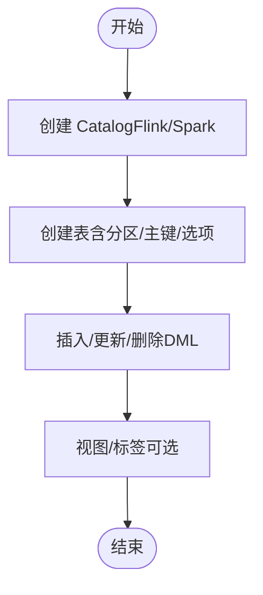
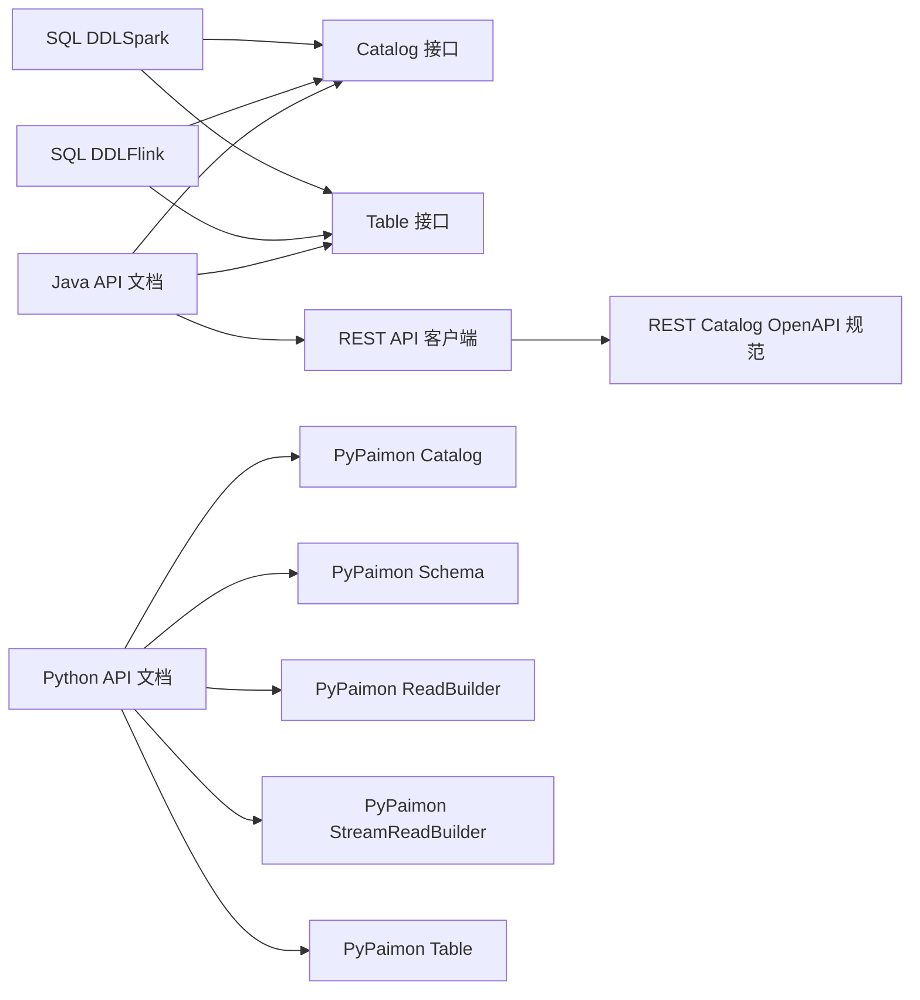

# API参考

<cite>
**本文引用的文件**
- [Java API 文档](file://docs/content/program-api/java-api.md)
- [REST API 文档](file://docs/content/program-api/rest-api.md)
- [Python API 文档](file://docs/content/pypaimon/python-api.md)
- [SQL DDL（Flink）](file://docs/content/flink/sql-ddl.md)
- [SQL DDL（Spark）](file://docs/content/spark/sql-ddl.md)
- [REST Catalog 概览](file://docs/content/concepts/rest/overview.md)
- [规格概览](file://docs/content/concepts/spec/overview.md)
- [配置项总览](file://docs/content/maintenance/configurations.md)
- [REST Catalog OpenAPI 规范](file://docs/static/rest-catalog-open-api.yaml)
- [Catalog 接口](file://paimon-core/src/main/java/org/apache/paimon/catalog/Catalog.java)
- [Table 接口](file://paimon-core/src/main/java/org/apache/paimon/table/Table.java)
- [REST API 客户端](file://paimon-api/src/main/java/org/apache/paimon/rest/RESTApi.java)
- [REST Catalog 选项](file://paimon-api/src/main/java/org/apache/paimon/rest/RESTCatalogOptions.java)
- [REST Catalog 内部选项](file://paimon-api/src/main/java/org/apache/paimon/rest/RESTCatalogInternalOptions.java)
- [REST 请求/响应模型](file://paimon-api/src/main/java/org/apache/paimon/rest/requests/)
- [REST 响应模型](file://paimon-api/src/main/java/org/apache/paimon/rest/responses/)
- [REST 异常与错误处理器](file://paimon-api/src/main/java/org/apache/paimon/rest/exceptions/)
- [REST 工具与拦截器](file://paimon-api/src/main/java/org/apache/paimon/rest/)
- [PyPaimon CatalogFactory](file://paimon-python/pypaimon/catalog/catalog_factory.py)
- [PyPaimon Catalog](file://paimon-python/pypaimon/catalog/catalog.py)
- [PyPaimon Schema](file://paimon-python/pypaimon/schema/schema.py)
- [PyPaimon SchemaChange](file://paimon-python/pypaimon/schema/schema_change.py)
- [PyPaimon ReadBuilder](file://paimon-python/pypaimon/read/read_builder.py)
- [PyPaimon StreamReadBuilder](file://paimon-python/pypaimon/read/stream_read_builder.py)
- [PyPaimon Table](file://paimon-python/pypaimon/table/table.py)
- [PyPaimon 写入组件](file://paimon-python/pypaimon/write/)
- [PyPaimon 消费者管理](file://paimon-python/pypaimon/consumer/consumer_manager.py)
</cite>

## 目录
1. [简介](#简介)
2. [项目结构](#项目结构)
3. [核心组件](#核心组件)
4. [架构总览](#架构总览)
5. [详细组件分析](#详细组件分析)
6. [依赖关系分析](#依赖关系分析)
7. [性能考虑](#性能考虑)
8. [故障排查指南](#故障排查指南)
9. [结论](#结论)
10. [附录](#附录)

## 简介
本文件为 Apache Paimon 的完整 API 参考，覆盖以下能力：
- Java 程序化 API：Catalog、Table、读写构建器、谓词与投影下推、流式扫描与提交、数据类型映射与谓词对照表。
- Python 程序化 API：CatalogFactory、Catalog、Schema、SchemaChange、ReadBuilder、StreamReadBuilder、Table 写入与读取、谓词与投影、分片读取、增量读取、消费者管理、回滚等。
- REST API：REST Catalog 的 OpenAPI 规范、认证方式、请求/响应模型、错误码与处理策略。
- SQL 接口：Flink 与 Spark 中的 DDL、DML、视图与标签操作语法与注意事项。
- 版本兼容性与迁移指南：基于仓库文档中的配置项与行为变更说明进行整理。
- 最佳实践与性能建议：结合仓库文档中的配置项与使用建议给出通用指导。
- 扩展与自定义：REST Catalog 的技术栈无关性、Token 提供器、客户端工具与拦截器。

## 项目结构
- 文档层：位于 docs/content 与 docs/static，涵盖 Java/Python/SQL/REST/API 规范与概念说明。
- 核心实现层：Java API 在 paimon-api 与 paimon-core；Python API 在 paimon-python；REST 相关在 paimon-api 的 rest 包。
- 配置与规格：docs/content/maintenance/configurations.md 与 concepts/spec/overview.md 提供配置项与文件格式规范。

图表来源
- [Java API 文档](file://docs/content/program-api/java-api.md)
- [REST API 文档](file://docs/content/program-api/rest-api.md)
- [Python API 文档](file://docs/content/pypaimon/python-api.md)
- [SQL DDL（Flink）](file://docs/content/flink/sql-ddl.md)
- [SQL DDL（Spark）](file://docs/content/spark/sql-ddl.md)
- [REST Catalog 概览](file://docs/content/concepts/rest/overview.md)
- [规格概览](file://docs/content/concepts/spec/overview.md)
- [配置项总览](file://docs/content/maintenance/configurations.md)
- [REST Catalog OpenAPI 规范](file://docs/static/rest-catalog-open-api.yaml)
- [Catalog 接口](file://paimon-core/src/main/java/org/apache/paimon/catalog/Catalog.java)
- [Table 接口](file://paimon-core/src/main/java/org/apache/paimon/table/Table.java)
- [REST API 客户端](file://paimon-api/src/main/java/org/apache/paimon/rest/RESTApi.java)
- [REST Catalog 选项](file://paimon-api/src/main/java/org/apache/paimon/rest/RESTCatalogOptions.java)
- [REST 请求/响应模型](file://paimon-api/src/main/java/org/apache/paimon/rest/requests/)
- [REST 响应模型](file://paimon-api/src/main/java/org/apache/paimon/rest/responses/)
- [REST 异常与错误处理器](file://paimon-api/src/main/java/org/apache/paimon/rest/exceptions/)
- [REST 工具与拦截器](file://paimon-api/src/main/java/org/apache/paimon/rest/)
- [PyPaimon CatalogFactory](file://paimon-python/pypaimon/catalog/catalog_factory.py)
- [PyPaimon Catalog](file://paimon-python/pypaimon/catalog/catalog.py)
- [PyPaimon Schema](file://paimon-python/pypaimon/schema/schema.py)
- [PyPaimon SchemaChange](file://paimon-python/pypaimon/schema/schema_change.py)
- [PyPaimon ReadBuilder](file://paimon-python/pypaimon/read/read_builder.py)
- [PyPaimon StreamReadBuilder](file://paimon-python/pypaimon/read/stream_read_builder.py)
- [PyPaimon Table](file://paimon-python/pypaimon/table/table.py)
- [PyPaimon 写入组件](file://paimon-python/pypaimon/write/)
- [PyPaimon 消费者管理](file://paimon-python/pypaimon/consumer/consumer_manager.py)

章节来源
- [Java API 文档](file://docs/content/program-api/java-api.md)
- [REST API 文档](file://docs/content/program-api/rest-api.md)
- [Python API 文档](file://docs/content/pypaimon/python-api.md)
- [SQL DDL（Flink）](file://docs/content/flink/sql-ddl.md)
- [SQL DDL（Spark）](file://docs/content/spark/sql-ddl.md)
- [REST Catalog 概览](file://docs/content/concepts/rest/overview.md)
- [规格概览](file://docs/content/concepts/spec/overview.md)
- [配置项总览](file://docs/content/maintenance/configurations.md)
- [REST Catalog OpenAPI 规范](file://docs/static/rest-catalog-open-api.yaml)

## 核心组件
- Java Catalog 与 Table：提供数据库与表的创建、列举、删除、重命名、变更等元数据操作，以及批式与流式读写入口。
- Java 数据类型与谓词：提供 Java 类型到 Paimon 类型的映射，以及谓词构建器与常见谓词对照。
- Python CatalogFactory 与 Catalog：支持 filesystem 与 rest 两种 Catalog 后端，提供数据库与表的创建、变更、读写与消费管理。
- Python Schema 与 SchemaChange：用于定义表结构、分区键、主键、选项与注释，并支持列增删改等变更。
- Python ReadBuilder/StreamReadBuilder：支持谓词与投影下推、分片生成、增量读取、分片读取、流式读取与并行消费。
- Python Table：封装两阶段提交的批量写入、回滚、快照与标签管理等。
- REST API：通过 OpenAPI 描述 REST Catalog 的配置、数据库、表、提交、回滚、鉴权、令牌等接口。
- SQL：Flink 与 Spark 中的 Catalog 创建、表创建、外部表、视图、标签等 DDL/DML 语法与注意事项。

章节来源
- [Java API 文档](file://docs/content/program-api/java-api.md)
- [REST API 文档](file://docs/content/program-api/rest-api.md)
- [Python API 文档](file://docs/content/pypaimon/python-api.md)
- [SQL DDL（Flink）](file://docs/content/flink/sql-ddl.md)
- [SQL DDL（Spark）](file://docs/content/spark/sql-ddl.md)
- [REST Catalog 概览](file://docs/content/concepts/rest/overview.md)
- [规格概览](file://docs/content/concepts/spec/overview.md)
- [配置项总览](file://docs/content/maintenance/configurations.md)
- [REST Catalog OpenAPI 规范](file://docs/static/rest-catalog-open-api.yaml)

## 架构总览
Paimon 的 API 分层清晰：文档层提供使用指南，Java/Python 层提供程序化接口，REST 层提供跨语言的 Catalog 访问，SQL 层提供声明式操作。核心对象包括 Catalog、Table、ReadBuilder、StreamReadBuilder、Schema、SchemaChange、写入组件与消费者管理。

图表来源
- [Java API 文档](file://docs/content/program-api/java-api.md)
- [REST API 文档](file://docs/content/program-api/rest-api.md)
- [Python API 文档](file://docs/content/pypaimon/python-api.md)
- [SQL DDL（Flink）](file://docs/content/flink/sql-ddl.md)
- [SQL DDL（Spark）](file://docs/content/spark/sql-ddl.md)
- [REST Catalog OpenAPI 规范](file://docs/static/rest-catalog-open-api.yaml)

## 详细组件分析

### Java API 组件
- Catalog：负责数据库与表的生命周期管理，支持创建、列举、删除、重命名、变更等。
- Table：提供读写入口，支持批式与流式扫描、谓词与投影下推、两阶段提交等。
- 读写流程：ReadBuilder/StreamReadBuilder 生成扫描计划，TableRead 读取 Split，Batch/Stream 写入组件完成提交或连续提交。
- 数据类型与谓词：提供 Java 类型到 Paimon 类型的映射，以及谓词构建器与常见谓词对照。

图表来源
- [Catalog 接口](file://paimon-core/src/main/java/org/apache/paimon/catalog/Catalog.java)
- [Table 接口](file://paimon-core/src/main/java/org/apache/paimon/table/Table.java)
- [Java API 文档](file://docs/content/program-api/java-api.md)

章节来源
- [Java API 文档](file://docs/content/program-api/java-api.md)
- [Catalog 接口](file://paimon-core/src/main/java/org/apache/paimon/catalog/Catalog.java)
- [Table 接口](file://paimon-core/src/main/java/org/apache/paimon/table/Table.java)

### Python API 组件
- CatalogFactory：根据配置创建 Catalog（filesystem 或 rest）。
- Catalog：数据库与表的创建、变更、读写与消费管理。
- Schema / SchemaChange：定义表结构、分区键、主键、选项与注释，支持列增删改等变更。
- ReadBuilder / StreamReadBuilder：谓词与投影下推、分片生成、增量读取、分片读取、流式读取与并行消费。
- Table：两阶段提交的批量写入、回滚、快照与标签管理。
- 消费者管理：跟踪消费进度、防止快照过期、断点续跑。

图表来源
- [PyPaimon CatalogFactory](file://paimon-python/pypaimon/catalog/catalog_factory.py)
- [PyPaimon Catalog](file://paimon-python/pypaimon/catalog/catalog.py)
- [PyPaimon Schema](file://paimon-python/pypaimon/schema/schema.py)
- [PyPaimon SchemaChange](file://paimon-python/pypaimon/schema/schema_change.py)
- [PyPaimon ReadBuilder](file://paimon-python/pypaimon/read/read_builder.py)
- [PyPaimon StreamReadBuilder](file://paimon-python/pypaimon/read/stream_read_builder.py)
- [PyPaimon Table](file://paimon-python/pypaimon/table/table.py)
- [Python API 文档](file://docs/content/pypaimon/python-api.md)

章节来源
- [Python API 文档](file://docs/content/pypaimon/python-api.md)
- [PyPaimon CatalogFactory](file://paimon-python/pypaimon/catalog/catalog_factory.py)
- [PyPaimon Catalog](file://paimon-python/pypaimon/catalog/catalog.py)
- [PyPaimon Schema](file://paimon-python/pypaimon/schema/schema.py)
- [PyPaimon SchemaChange](file://paimon-python/pypaimon/schema/schema_change.py)
- [PyPaimon ReadBuilder](file://paimon-python/pypaimon/read/read_builder.py)
- [PyPaimon StreamReadBuilder](file://paimon-python/pypaimon/read/stream_read_builder.py)
- [PyPaimon Table](file://paimon-python/pypaimon/table/table.py)

### REST API 组件
- RESTApi 客户端：封装 REST Catalog 的配置、数据库、表、提交、回滚、鉴权、令牌等调用。
- REST Catalog 选项：支持多种认证方式（Bear Token、DLF Token），以及服务端 URI、仓库标识等。
- 请求/响应模型：OpenAPI 定义了路径、参数、请求体、响应体与错误码。
- 错误处理：统一的错误处理器与重试策略，便于客户端稳定调用。

图表来源
- [REST API 文档](file://docs/content/program-api/rest-api.md)
- [REST API 客户端](file://paimon-api/src/main/java/org/apache/paimon/rest/RESTApi.java)
- [REST Catalog 选项](file://paimon-api/src/main/java/org/apache/paimon/rest/RESTCatalogOptions.java)
- [REST Catalog 内部选项](file://paimon-api/src/main/java/org/apache/paimon/rest/RESTCatalogInternalOptions.java)
- [REST 请求/响应模型](file://paimon-api/src/main/java/org/apache/paimon/rest/requests/)
- [REST 响应模型](file://paimon-api/src/main/java/org/apache/paimon/rest/responses/)
- [REST 异常与错误处理器](file://paimon-api/src/main/java/org/apache/paimon/rest/exceptions/)
- [REST 工具与拦截器](file://paimon-api/src/main/java/org/apache/paimon/rest/)
- [REST Catalog OpenAPI 规范](file://docs/static/rest-catalog-open-api.yaml)

章节来源
- [REST API 文档](file://docs/content/program-api/rest-api.md)
- [REST Catalog 概览](file://docs/content/concepts/rest/overview.md)
- [REST Catalog OpenAPI 规范](file://docs/static/rest-catalog-open-api.yaml)
- [REST API 客户端](file://paimon-api/src/main/java/org/apache/paimon/rest/RESTApi.java)
- [REST Catalog 选项](file://paimon-api/src/main/java/org/apache/paimon/rest/RESTCatalogOptions.java)
- [REST Catalog 内部选项](file://paimon-api/src/main/java/org/apache/paimon/rest/RESTCatalogInternalOptions.java)
- [REST 请求/响应模型](file://paimon-api/src/main/java/org/apache/paimon/rest/requests/)
- [REST 响应模型](file://paimon-api/src/main/java/org/apache/paimon/rest/responses/)
- [REST 异常与错误处理器](file://paimon-api/src/main/java/org/apache/paimon/rest/exceptions/)
- [REST 工具与拦截器](file://paimon-api/src/main/java/org/apache/paimon/rest/)

### SQL 接口（Flink 与 Spark）
- Flink SQL：支持 filesystem/hive/jdbc 三种元存储后端，提供 Catalog 创建、表创建（含分区与主键）、外部表、视图、标签等。
- Spark SQL：支持 filesystem/hive/jdbc/rest 元存储后端，提供 Catalog 创建、表创建、外部表、视图、标签等。

图表来源
- [SQL DDL（Flink）](file://docs/content/flink/sql-ddl.md)
- [SQL DDL（Spark）](file://docs/content/spark/sql-ddl.md)

章节来源
- [SQL DDL（Flink）](file://docs/content/flink/sql-ddl.md)
- [SQL DDL（Spark）](file://docs/content/spark/sql-ddl.md)

## 依赖关系分析
- Java API 依赖 paimon-core 的 Catalog 与 Table 接口，paimon-api 提供 REST 客户端与选项。
- Python API 依赖 paimon-python 包中的 CatalogFactory、Catalog、Schema、ReadBuilder、StreamReadBuilder、Table 等模块。
- REST API 依赖 OpenAPI 规范定义的路径与模型，配合请求/响应与错误处理模块。
- SQL 层依赖具体执行引擎（Flink/Spark）对 Catalog 的集成。

图表来源
- [Java API 文档](file://docs/content/program-api/java-api.md)
- [REST API 文档](file://docs/content/program-api/rest-api.md)
- [Python API 文档](file://docs/content/pypaimon/python-api.md)
- [SQL DDL（Flink）](file://docs/content/flink/sql-ddl.md)
- [SQL DDL（Spark）](file://docs/content/spark/sql-ddl.md)
- [REST Catalog OpenAPI 规范](file://docs/static/rest-catalog-open-api.yaml)
- [Catalog 接口](file://paimon-core/src/main/java/org/apache/paimon/catalog/Catalog.java)
- [Table 接口](file://paimon-core/src/main/java/org/apache/paimon/table/Table.java)
- [REST API 客户端](file://paimon-api/src/main/java/org/apache/paimon/rest/RESTApi.java)
- [REST Catalog 选项](file://paimon-api/src/main/java/org/apache/paimon/rest/RESTCatalogOptions.java)
- [REST 请求/响应模型](file://paimon-api/src/main/java/org/apache/paimon/rest/requests/)
- [REST 响应模型](file://paimon-api/src/main/java/org/apache/paimon/rest/responses/)
- [REST 异常与错误处理器](file://paimon-api/src/main/java/org/apache/paimon/rest/exceptions/)
- [REST 工具与拦截器](file://paimon-api/src/main/java/org/apache/paimon/rest/)
- [PyPaimon CatalogFactory](file://paimon-python/pypaimon/catalog/catalog_factory.py)
- [PyPaimon Catalog](file://paimon-python/pypaimon/catalog/catalog.py)
- [PyPaimon Schema](file://paimon-python/pypaimon/schema/schema.py)
- [PyPaimon SchemaChange](file://paimon-python/pypaimon/schema/schema_change.py)
- [PyPaimon ReadBuilder](file://paimon-python/pypaimon/read/read_builder.py)
- [PyPaimon StreamReadBuilder](file://paimon-python/pypaimon/read/stream_read_builder.py)
- [PyPaimon Table](file://paimon-python/pypaimon/table/table.py)

章节来源
- [Java API 文档](file://docs/content/program-api/java-api.md)
- [REST API 文档](file://docs/content/program-api/rest-api.md)
- [Python API 文档](file://docs/content/pypaimon/python-api.md)
- [SQL DDL（Flink）](file://docs/content/flink/sql-ddl.md)
- [SQL DDL（Spark）](file://docs/content/spark/sql-ddl.md)
- [REST Catalog OpenAPI 规范](file://docs/static/rest-catalog-open-api.yaml)
- [Catalog 接口](file://paimon-core/src/main/java/org/apache/paimon/catalog/Catalog.java)
- [Table 接口](file://paimon-core/src/main/java/org/apache/paimon/table/Table.java)
- [REST API 客户端](file://paimon-api/src/main/java/org/apache/paimon/rest/RESTApi.java)
- [REST Catalog 选项](file://paimon-api/src/main/java/org/apache/paimon/rest/RESTCatalogOptions.java)
- [REST 请求/响应模型](file://paimon-api/src/main/java/org/apache/paimon/rest/requests/)
- [REST 响应模型](file://paimon-api/src/main/java/org/apache/paimon/rest/responses/)
- [REST 异常与错误处理器](file://paimon-api/src/main/java/org/apache/paimon/rest/exceptions/)
- [REST 工具与拦截器](file://paimon-api/src/main/java/org/apache/paimon/rest/)
- [PyPaimon CatalogFactory](file://paimon-python/pypaimon/catalog/catalog_factory.py)
- [PyPaimon Catalog](file://paimon-python/pypaimon/catalog/catalog.py)
- [PyPaimon Schema](file://paimon-python/pypaimon/schema/schema.py)
- [PyPaimon SchemaChange](file://paimon-python/pypaimon/schema/schema_change.py)
- [PyPaimon ReadBuilder](file://paimon-python/pypaimon/read/read_builder.py)
- [PyPaimon StreamReadBuilder](file://paimon-python/pypaimon/read/stream_read_builder.py)
- [PyPaimon Table](file://paimon-python/pypaimon/table/table.py)

## 性能考虑
- 读取侧：优先使用谓词与投影下推减少数据传输；分片读取与并行消费提升吞吐；增量读取与分片读取适合大规模数据场景。
- 写入侧：批量写入采用两阶段提交，避免部分提交导致的数据不一致；流式写入需确保 commitIdentifier 递增与幂等提交。
- 配置项：依据仓库文档的 CoreOptions、CatalogOptions、Hive/Spark/JDBC/Flink/Spark 等选项进行调优，如统计收集模式、文件格式、RocksDB 参数等。
- 文件布局：遵循规格概览中的文件组织方式，有助于查询优化与维护。

章节来源
- [Python API 文档](file://docs/content/pypaimon/python-api.md)
- [Java API 文档](file://docs/content/program-api/java-api.md)
- [规格概览](file://docs/content/concepts/spec/overview.md)
- [配置项总览](file://docs/content/maintenance/configurations.md)

## 故障排查指南
- REST 认证失败：检查 Bear Token 或 DLF 凭据是否正确配置；确认 URI 与仓库标识。
- 资源不存在：表/快照/标签不存在时返回相应错误码，需先创建再操作。
- 权限不足：鉴权失败返回 401/403，需检查 TokenProvider 与权限。
- 写入异常：两阶段提交失败时使用 abort 或 filterAndCommit 进行清理与重试。
- 消费者管理：通过 ConsumerManager 获取/重置/删除消费者，防止快照过期影响消费进度。

章节来源
- [REST API 文档](file://docs/content/program-api/rest-api.md)
- [REST Catalog OpenAPI 规范](file://docs/static/rest-catalog-open-api.yaml)
- [REST 异常与错误处理器](file://paimon-api/src/main/java/org/apache/paimon/rest/exceptions/)
- [Python API 文档](file://docs/content/pypaimon/python-api.md)
- [PyPaimon 消费者管理](file://paimon-python/pypaimon/consumer/consumer_manager.py)

## 结论
本参考文档系统梳理了 Paimon 的 Java/Python 程序化 API、REST API、SQL 接口与核心组件，结合仓库文档中的配置项与规格说明，提供了从入门到进阶的参考路径。建议在生产环境中结合配置项与文件布局进行性能调优，并通过 REST Catalog 实现跨语言、跨技术栈的统一访问。

## 附录
- 版本兼容性与迁移指南：依据仓库文档中的配置项与行为变更说明进行迁移；注意不同引擎（Flink/Spark）的 Catalog 选项差异。
- 最佳实践：优先使用谓词与投影下推、分片读取与并行消费、两阶段提交与幂等提交、增量读取与分片读取、消费者管理与断点续跑。
- 扩展与自定义：REST Catalog 支持任意后端与语言实现，可通过 TokenProvider 与认证策略扩展；利用请求/响应模型与错误处理机制增强健壮性。

章节来源
- [配置项总览](file://docs/content/maintenance/configurations.md)
- [规格概览](file://docs/content/concepts/spec/overview.md)
- [REST Catalog 概览](file://docs/content/concepts/rest/overview.md)
- [REST Catalog OpenAPI 规范](file://docs/static/rest-catalog-open-api.yaml)
- [REST API 文档](file://docs/content/program-api/rest-api.md)
- [Python API 文档](file://docs/content/pypaimon/python-api.md)
- [SQL DDL（Flink）](file://docs/content/flink/sql-ddl.md)
- [SQL DDL（Spark）](file://docs/content/spark/sql-ddl.md)