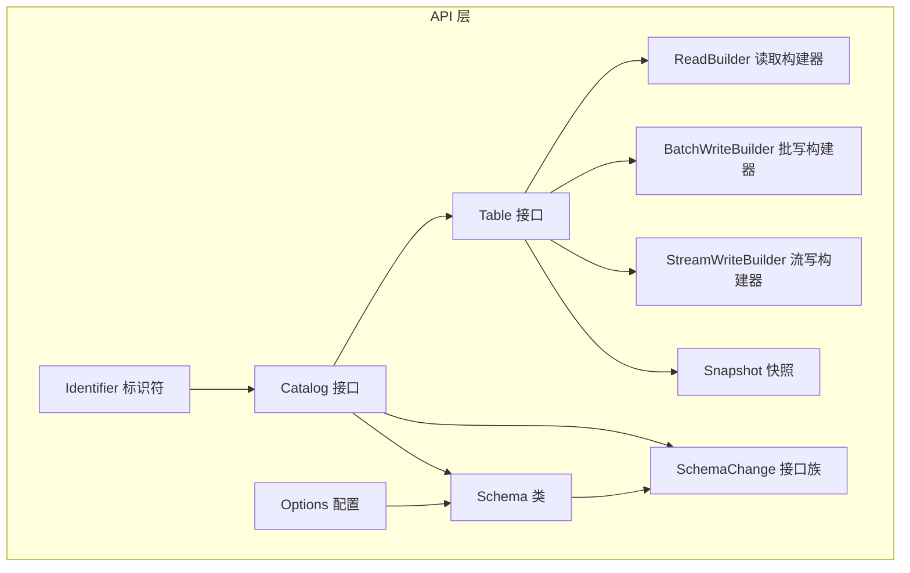
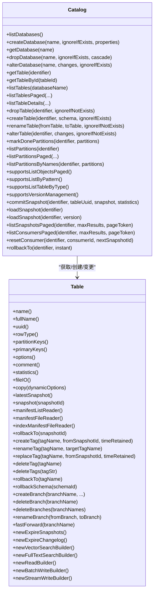
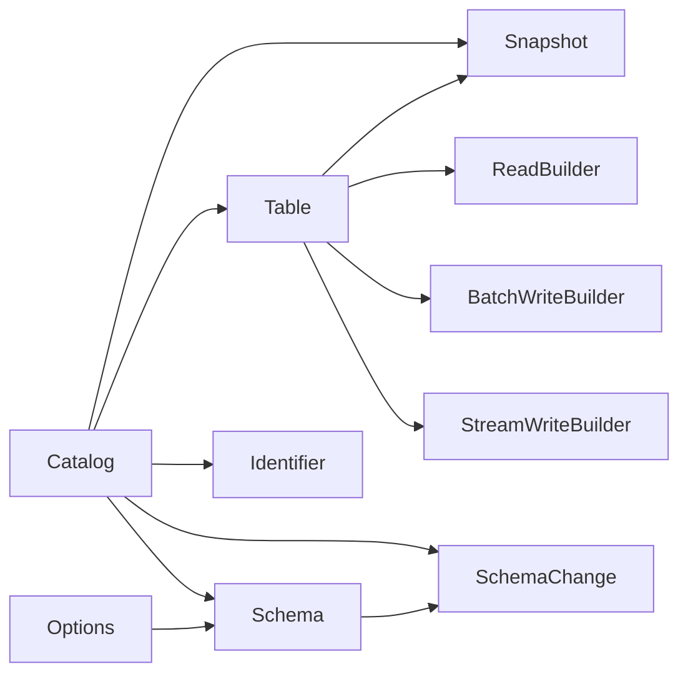
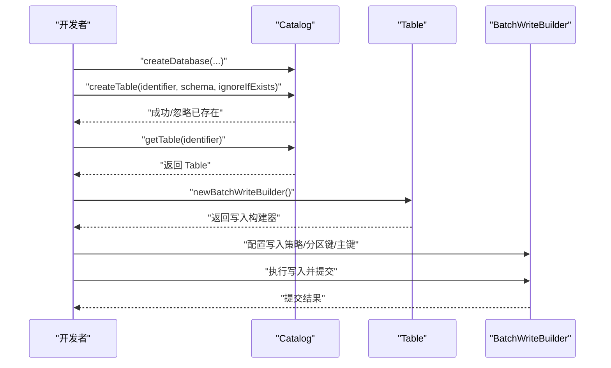

# Java API

<cite>
**本文引用的文件**
- [Catalog.java](file://paimon-core/src/main/java/org/apache/paimon/catalog/Catalog.java)
- [Table.java](file://paimon-core/src/main/java/org/apache/paimon/table/Table.java)
- [Schema.java](file://paimon-api/src/main/java/org/apache/paimon/schema/Schema.java)
- [SchemaChange.java](file://paimon-api/src/main/java/org/apache/paimon/schema/SchemaChange.java)
- [Options.java](file://paimon-api/src/main/java/org/apache/paimon/options/Options.java)
- [Snapshot.java](file://paimon-api/src/main/java/org/apache/paimon/Snapshot.java)
- [Identifier.java](file://paimon-api/src/main/java/org/apache/paimon/catalog/Identifier.java)
- [ReadBuilder.java](file://paimon-core/src/main/java/org/apache/paimon/table/source/ReadBuilder.java)
- [BatchWriteBuilder.java](file://paimon-core/src/main/java/org/apache/paimon/table/sink/BatchWriteBuilder.java)
- [StreamWriteBuilder.java](file://paimon-core/src/main/java/org/apache/paimon/table/sink/StreamWriteBuilder.java)
</cite>

## 目录
1. [简介](#简介)
2. [项目结构](#项目结构)
3. [核心组件](#核心组件)
4. [架构总览](#架构总览)
5. [详细组件分析](#详细组件分析)
6. [依赖分析](#依赖分析)
7. [性能考虑](#性能考虑)
8. [故障排查指南](#故障排查指南)
9. [结论](#结论)
10. [附录](#附录)

## 简介
本参考文档面向使用 Apache Paimon 的 Java 开发者，系统梳理 Catalog、Table、Schema、Snapshot、Options、Identifier 及读写构建器（ReadBuilder、BatchWriteBuilder、StreamWriteBuilder）等核心 API 的设计与用法。内容覆盖方法签名、参数类型、返回值、异常处理与典型使用场景，并给出基于仓库源码的路径级引用，便于快速定位实现细节。

## 项目结构
围绕 Java API 的关键模块与职责如下：
- Catalog：目录元数据与对象生命周期管理（数据库、表、视图、分区、版本/快照、消费者等）
- Table：表抽象与读写入口（读取快照、标签/分支管理、读写构建器）
- Schema：表结构定义与变更（字段、主键、分区键、选项、注释）
- SchemaChange：结构变更指令集合（新增/重命名/删除/修改列，更新类型/空值/默认值/位置等）
- Options：配置项容器（键值存储、类型转换、前缀映射、回退键）
- Snapshot：快照模型（提交类型、记录计数、清单列表、属性、时间戳等）
- Identifier：对象标识符（库名、对象名、分支、系统表后缀）
- 读写构建器：ReadBuilder、BatchWriteBuilder、StreamWriteBuilder（按需扩展）

图表来源
- [Catalog.java:56-804](file://paimon-core/src/main/java/org/apache/paimon/catalog/Catalog.java#L56-L804)
- [Table.java:52-236](file://paimon-core/src/main/java/org/apache/paimon/table/Table.java#L52-L236)
- [Schema.java:56-390](file://paimon-api/src/main/java/org/apache/paimon/schema/Schema.java#L56-L390)
- [SchemaChange.java:82-831](file://paimon-api/src/main/java/org/apache/paimon/schema/SchemaChange.java#L82-L831)
- [Options.java:47-287](file://paimon-api/src/main/java/org/apache/paimon/options/Options.java#L47-L287)
- [Snapshot.java:43-477](file://paimon-api/src/main/java/org/apache/paimon/Snapshot.java#L43-L477)
- [Identifier.java:49-239](file://paimon-api/src/main/java/org/apache/paimon/catalog/Identifier.java#L49-L239)
- [ReadBuilder.java](file://paimon-core/src/main/java/org/apache/paimon/table/source/ReadBuilder.java)
- [BatchWriteBuilder.java](file://paimon-core/src/main/java/org/apache/paimon/table/sink/BatchWriteBuilder.java)
- [StreamWriteBuilder.java](file://paimon-core/src/main/java/org/apache/paimon/table/sink/StreamWriteBuilder.java)

章节来源
- [Catalog.java:56-804](file://paimon-core/src/main/java/org/apache/paimon/catalog/Catalog.java#L56-L804)
- [Table.java:52-236](file://paimon-core/src/main/java/org/apache/paimon/table/Table.java#L52-L236)

## 核心组件
本节对各核心类进行要点归纳，帮助快速理解职责边界与常用能力。

- Catalog（目录）
  - 数据库：列出、创建、删除、修改、按模式分页列举
  - 表：获取、创建、删除、重命名、变更结构、分区标记、分区列举、按模式分页列举
  - 视图：创建、删除、重命名、变更、列举（默认不支持）
  - 版本/快照：提交快照、加载快照、按版本解析、分页列举快照、消费者管理、回滚到指定版本/分支
  - 元数据修复：整库/整表修复、注册表
  - 能力开关：是否支持分页列举、名称模式过滤、按类型过滤表
- Table（表）
  - 元数据：名称、全名、UUID、行类型、分区键、主键、选项、注释、统计
  - 快照：最新快照、按ID获取、回滚到快照、标签/分支管理、过期快照工具
  - 清单读取：manifest 列表、manifest 文件、索引清单文件
  - 读写：向量检索、全文检索、读取构建器、批量写入、流式写入
- Schema（表结构）
  - 字段、分区键、主键、选项、注释
  - 构建器：动态追加列、声明主键/分区键、设置选项/注释、构建 Schema
  - 校验：重复列检查、主键/分区键完整性、主键不可空
- SchemaChange（结构变更）
  - 指令族：设置/移除选项、更新注释、新增/重命名/删除列、更新类型/空值/默认值/位置
  - 支持多字段变更（数组），支持列移动（FIRST/AFTER/BEFORE/LAST）
- Options（配置）
  - 键值存储、类型安全读取（字符串/布尔/整型/长整型/双精度）、可选值、前缀映射、回退键
- Snapshot（快照）
  - 版本号、ID、schemaId、基础/增量/变更清单列表、索引清单、提交用户/标识/类型/时间
  - 记录总数/增量/变更日志数量、水位线、统计文件、属性、下一条行ID
  - 提交类型枚举：APPEND/COMPACT/OVERWRITE/ANALYZE
- Identifier（标识符）
  - 库名与对象名，支持分支与系统表后缀拼接，提供全名转义、拆分、系统表判定
- 读写构建器
  - ReadBuilder：扫描/过滤/谓词/投影等读取配置
  - BatchWriteBuilder：批式写入配置
  - StreamWriteBuilder：流式写入配置

章节来源
- [Catalog.java:56-804](file://paimon-core/src/main/java/org/apache/paimon/catalog/Catalog.java#L56-L804)
- [Table.java:52-236](file://paimon-core/src/main/java/org/apache/paimon/table/Table.java#L52-L236)
- [Schema.java:56-390](file://paimon-api/src/main/java/org/apache/paimon/schema/Schema.java#L56-L390)
- [SchemaChange.java:82-831](file://paimon-api/src/main/java/org/apache/paimon/schema/SchemaChange.java#L82-L831)
- [Options.java:47-287](file://paimon-api/src/main/java/org/apache/paimon/options/Options.java#L47-L287)
- [Snapshot.java:43-477](file://paimon-api/src/main/java/org/apache/paimon/Snapshot.java#L43-L477)
- [Identifier.java:49-239](file://paimon-api/src/main/java/org/apache/paimon/catalog/Identifier.java#L49-L239)

## 架构总览
下图展示 Catalog 与 Table 的交互关系，以及版本管理与快照相关能力：

图表来源
- [Catalog.java:56-804](file://paimon-core/src/main/java/org/apache/paimon/catalog/Catalog.java#L56-L804)
- [Table.java:52-236](file://paimon-core/src/main/java/org/apache/paimon/table/Table.java#L52-L236)

## 详细组件分析

### Catalog（目录）API
- 数据库管理
  - 列出数据库、分页列出、按模式过滤
  - 创建/删除/修改数据库，支持忽略已存在与级联删除
- 表管理
  - 获取表/按ID获取、创建/删除/重命名
  - 结构变更：支持单条或批量 SchemaChange；支持忽略不存在
  - 分区：标记完成分区、列举分区、按模式分页列举、按名称列表
- 视图管理（默认不支持，抛出异常或不支持异常）
- 版本/快照管理
  - 提交快照、加载快照（按ID或版本字符串）、分页列举快照
  - 消费者管理（分页列举、重置）
  - 回滚到指定快照/标签/分支
- 元数据修复与注册
  - 修复 Catalog/数据库/表
  - 注册表（异步）
- 能力探测
  - 是否支持分页列举、按模式过滤、按类型过滤表

常见异常
- DatabaseAlreadyExistException、DatabaseNotExistException、DatabaseNotEmptyException
- TableNotExistException、TableAlreadyExistException、TableIdNotExistException
- ViewNotExistException、ViewAlreadyExistException、DialectAlreadyExistException、DialectNotExistException
- SnapshotNotExistException
- 不支持的操作抛出 UnsupportedOperationException

章节来源
- [Catalog.java:56-804](file://paimon-core/src/main/java/org/apache/paimon/catalog/Catalog.java#L56-L804)

### Table（表）API
- 元数据访问
  - 名称、全名、UUID、行类型、分区键、主键、选项、注释、统计
- 快照与版本
  - 最新快照、按ID获取快照、回滚到快照
  - 标签：创建/重命名/替换/删除、按标签回滚、删除多个标签
  - 分支：创建/删除/重命名、从标签创建、合并到主分支
  - 过期策略：手动过期快照/变更日志
- 清单读取
  - Manifest 列表、Manifest 文件、索引清单文件读取器
- 读写入口
  - 向量检索、全文检索、读取构建器、批量写入、流式写入

章节来源
- [Table.java:52-236](file://paimon-core/src/main/java/org/apache/paimon/table/Table.java#L52-L236)

### Schema（表结构）API
- 字段与约束
  - 字段列表、分区键、主键、选项、注释
  - 行类型生成
- 校验规则
  - 重复列检测、主键/分区键完整性校验、主键不可空
- 构建器
  - 动态追加列（含描述与默认值）、声明主键/分区键、设置选项/注释、构建 Schema
- JSON 序列化
  - Jackson 注解支持序列化/反序列化

章节来源
- [Schema.java:56-390](file://paimon-api/src/main/java/org/apache/paimon/schema/Schema.java#L56-L390)

### SchemaChange（结构变更）API
- 指令族
  - 设置/移除选项、更新注释
  - 新增列（支持多字段、描述、默认值、位置移动）
  - 重命名列（支持多字段）
  - 删除列（支持多字段）
  - 更新类型（可选择保持空值语义）
  - 更新空值/注释/默认值/位置
- 移动（Move）
  - 支持 FIRST/AFTER/BEFORE/LAST 四种位置移动

章节来源
- [SchemaChange.java:82-831](file://paimon-api/src/main/java/org/apache/paimon/schema/SchemaChange.java#L82-L831)

### Options（配置）API
- 存储与读取
  - 键值存储、同步并发安全
  - 类型安全读取：字符串/布尔/整型/长整型/双精度、可选值
- 前缀映射与回退键
  - 支持前缀映射、回退键解析
- 工具方法
  - 转换为 Properties、移除前缀、移除键、判断包含

章节来源
- [Options.java:47-287](file://paimon-api/src/main/java/org/apache/paimon/options/Options.java#L47-L287)

### Snapshot（快照）API
- 字段
  - 版本、ID、schemaId、基础/增量/变更清单列表、索引清单、提交用户/标识/类型/时间
  - 记录总数/增量/变更日志数量、水位线、统计文件、属性、下一条行ID
- 提交类型
  - APPEND/COMPACT/OVERWRITE/ANALYZE
- 序列化
  - JSON 序列化/反序列化

章节来源
- [Snapshot.java:43-477](file://paimon-api/src/main/java/org/apache/paimon/Snapshot.java#L43-L477)

### Identifier（标识符）API
- 组成
  - 数据库名、对象名（表名/视图名等）
- 解析与拼接
  - 支持分支与系统表后缀拼接、拆分、系统表判定
- 转义
  - 全名转义（带反引号）

章节来源
- [Identifier.java:49-239](file://paimon-api/src/main/java/org/apache/paimon/catalog/Identifier.java#L49-L239)

### 读写构建器 API
- ReadBuilder（读取）
  - 用于构建读取计划（扫描、过滤、谓词、投影等）
- BatchWriteBuilder（批量写入）
  - 用于批式写入（提交、事务、桶/排序等策略）
- StreamWriteBuilder（流式写入）
  - 用于流式写入（提交策略、水位线、状态管理等）

章节来源
- [ReadBuilder.java](file://paimon-core/src/main/java/org/apache/paimon/table/source/ReadBuilder.java)
- [BatchWriteBuilder.java](file://paimon-core/src/main/java/org/apache/paimon/table/sink/BatchWriteBuilder.java)
- [StreamWriteBuilder.java](file://paimon-core/src/main/java/org/apache/paimon/table/sink/StreamWriteBuilder.java)

## 依赖分析
- Catalog 依赖 Table、Schema、SchemaChange、Identifier、Snapshot、Options 等
- Table 依赖 Snapshot、Options、读写构建器
- Schema 与 SchemaChange 共同构成结构定义与变更
- Options 作为通用配置容器被 Schema/Options 使用
- Identifier 作为 Catalog/表对象的统一标识

图表来源
- [Catalog.java:56-804](file://paimon-core/src/main/java/org/apache/paimon/catalog/Catalog.java#L56-L804)
- [Table.java:52-236](file://paimon-core/src/main/java/org/apache/paimon/table/Table.java#L52-L236)
- [Schema.java:56-390](file://paimon-api/src/main/java/org/apache/paimon/schema/Schema.java#L56-L390)
- [SchemaChange.java:82-831](file://paimon-api/src/main/java/org/apache/paimon/schema/SchemaChange.java#L82-L831)
- [Options.java:47-287](file://paimon-api/src/main/java/org/apache/paimon/options/Options.java#L47-L287)
- [Snapshot.java:43-477](file://paimon-api/src/main/java/org/apache/paimon/Snapshot.java#L43-L477)
- [Identifier.java:49-239](file://paimon-api/src/main/java/org/apache/paimon/catalog/Identifier.java#L49-L239)

## 性能考虑
- 分页列举：Catalog 支持分页列举数据库/表/视图/分区/快照，避免一次性加载全部对象导致内存压力
- 快照与清单：通过增量清单与索引清单减少扫描范围，提升读取与过期清理效率
- 写入策略：BatchWriteBuilder/StreamWriteBuilder 提供不同提交策略，结合分区键与主键优化写入吞吐
- 配置缓存：Options 支持前缀映射与回退键，减少重复解析成本

## 故障排查指南
- 目录能力未启用
  - 现象：调用分页/模式过滤/版本管理相关方法抛出不支持异常
  - 处理：确认 Catalog 实现是否支持对应能力（supportsListObjectsPaged/supportsListByPattern/supportsVersionManagement）
- 对象不存在
  - 现象：获取表/数据库/视图失败
  - 处理：先检查对象是否存在，或使用忽略不存在标志
- 结构变更冲突
  - 现象：新增列/重命名列/删除列失败
  - 处理：核对字段名、类型兼容性、主键约束与分区键完整性
- 快照回滚异常
  - 现象：回滚到指定快照/标签失败
  - 处理：确认目标快照/标签存在且 Catalog 支持版本管理

章节来源
- [Catalog.java:56-804](file://paimon-core/src/main/java/org/apache/paimon/catalog/Catalog.java#L56-L804)
- [Table.java:52-236](file://paimon-core/src/main/java/org/apache/paimon/table/Table.java#L52-L236)

## 结论
本文档系统梳理了 Paimon Java API 的核心接口与数据模型，覆盖目录管理、表抽象、结构定义与变更、配置、快照与标识符，并给出读写构建器的职责边界。建议在实际工程中：
- 明确 Catalog 能力边界，优先使用分页与模式过滤以降低开销
- 在变更结构时遵循 SchemaChange 指令族，确保主键/分区键一致性
- 合理利用快照与标签进行版本控制与回滚
- 通过 Options 进行配置管理，善用前缀映射与回退键

## 附录

### API 调用时序示例（概念流程）
以下为“创建表并写入数据”的典型流程示意（概念图，非特定源码映射）：

### 版本兼容性与迁移建议
- 快照版本：Snapshot 当前版本号为固定常量，JSON 字段包含版本字段，升级时注意字段兼容性
- Catalog 能力探测：通过 supportsListObjectsPaged/supportsListByPattern/supportsVersionManagement 判断能力，避免直接调用不支持的方法
- SchemaChange：新增列/重命名/删除列等变更需确保下游读取逻辑兼容

章节来源
- [Snapshot.java:43-477](file://paimon-api/src/main/java/org/apache/paimon/Snapshot.java#L43-L477)
- [Catalog.java:618-674](file://paimon-core/src/main/java/org/apache/paimon/catalog/Catalog.java#L618-L674)