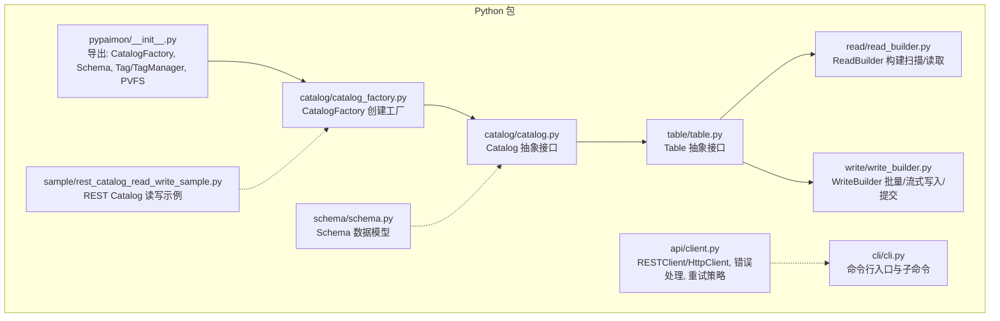
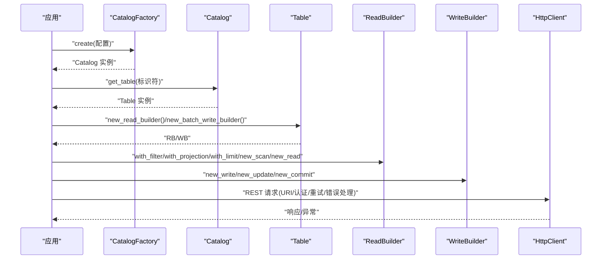
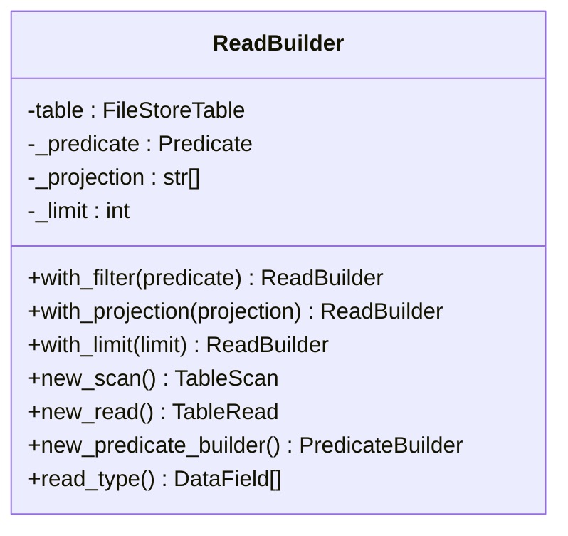
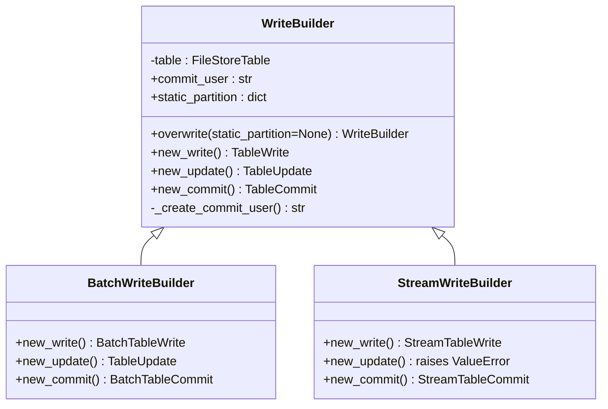
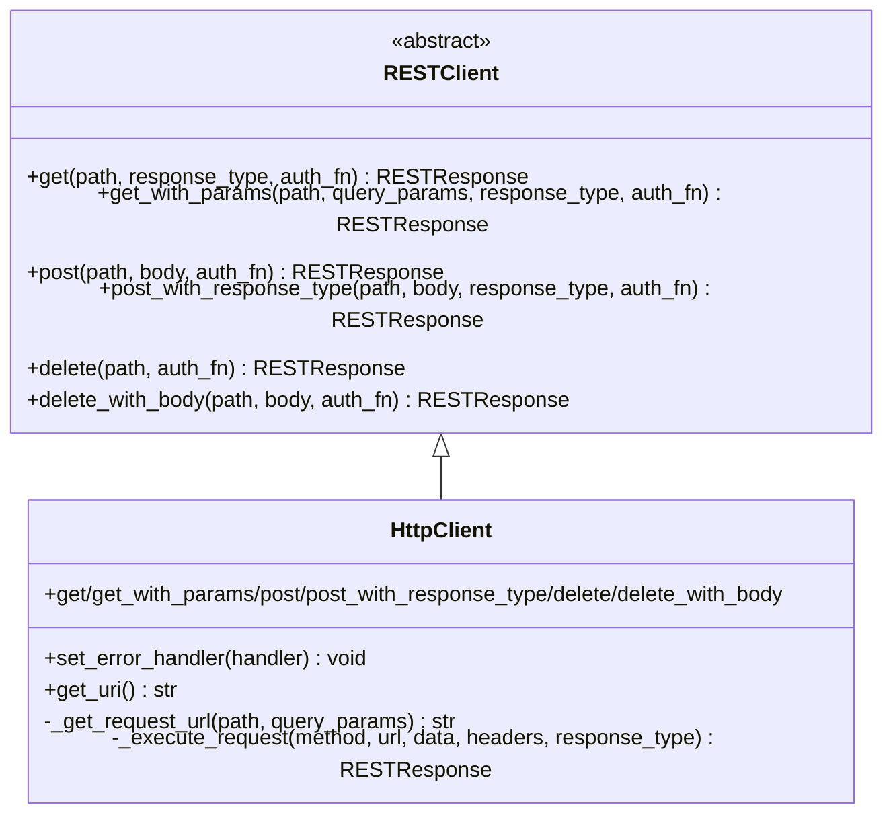
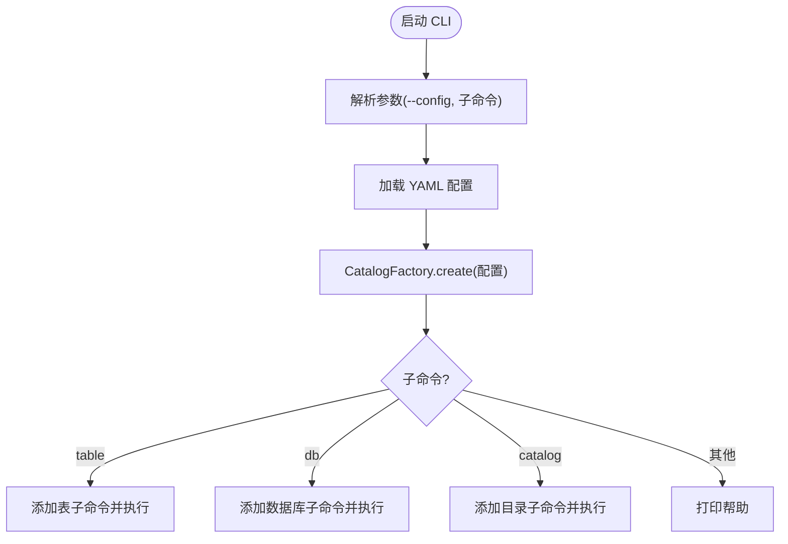
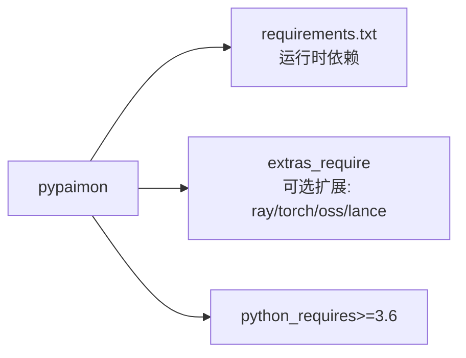

# Python API

<cite>
**本文引用的文件**
- [pypaimon/__init__.py](file://paimon-python/pypaimon/__init__.py)
- [client.py](file://paimon-python/pypaimon/api/client.py)
- [catalog.py](file://paimon-python/pypaimon/catalog/catalog.py)
- [catalog_factory.py](file://paimon-python/pypaimon/catalog/catalog_factory.py)
- [table.py](file://paimon-python/pypaimon/table/table.py)
- [read_builder.py](file://paimon-python/pypaimon/read/read_builder.py)
- [write_builder.py](file://paimon-python/pypaimon/write/write_builder.py)
- [cli.py](file://paimon-python/pypaimon/cli/cli.py)
- [setup.py](file://paimon-python/setup.py)
- [requirements.txt](file://paimon-python/dev/requirements.txt)
- [schema.py](file://paimon-python/pypaimon/schema/schema.py)
- [rest_catalog_read_write_sample.py](file://paimon-python/pypaimon/sample/rest_catalog_read_write_sample.py)
- [README.md](file://paimon-python/README.md)
</cite>

## 目录
1. [简介](#简介)
2. [项目结构](#项目结构)
3. [核心组件](#核心组件)
4. [架构总览](#架构总览)
5. [详细组件分析](#详细组件分析)
6. [依赖分析](#依赖分析)
7. [性能考虑](#性能考虑)
8. [故障排查指南](#故障排查指南)
9. [结论](#结论)
10. [附录](#附录)

## 简介
本文件为 Apache Paimon Python API 的完整参考文档，覆盖 Catalog、Table、Client、读写构建器、CLI 工具等核心能力，提供每个类与方法的职责、参数、返回值、使用示例与错误处理说明，并解释 Python API 与 Java API 的对应关系与差异。同时包含环境配置、安装方式、性能优化建议与最佳实践。

## 项目结构
- 根模块导出入口：通过包级 __init__.py 暴露 CatalogFactory、Schema、Tag/TagManager、虚拟文件系统等核心对象。
- API 层：封装 REST 客户端、认证参数、响应解析与异常体系。
- Catalog 层：抽象 Catalog 接口及工厂，支持本地文件系统与 REST 两种 Catalog 类型。
- Table 层：抽象 Table 接口，提供读写构建器。
- 读写层：读取构建器（过滤、投影、限制）与写入构建器（批量/流式写入、更新、提交）。
- CLI 层：命令行工具，支持从 YAML 配置创建 Catalog 并执行数据库/表/目录操作。
- 示例与测试：提供 REST Catalog 读写示例，演示路径方案与数据帧写入/读取流程。
- 安装与依赖：setup.py 声明版本、依赖与可选扩展；requirements.txt 列出运行时依赖。

**图表来源**
- [pypaimon/__init__.py:1-39](file://paimon-python/pypaimon/__init__.py#L1-L39)
- [client.py:262-395](file://paimon-python/pypaimon/api/client.py#L262-L395)
- [catalog.py:29-296](file://paimon-python/pypaimon/catalog/catalog.py#L29-L296)
- [catalog_factory.py:28-45](file://paimon-python/pypaimon/catalog/catalog_factory.py#L28-L45)
- [table.py:26-44](file://paimon-python/pypaimon/table/table.py#L26-L44)
- [read_builder.py:29-79](file://paimon-python/pypaimon/read/read_builder.py#L29-L79)
- [write_builder.py:30-83](file://paimon-python/pypaimon/write/write_builder.py#L30-L83)
- [cli.py:89-138](file://paimon-python/pypaimon/cli/cli.py#L89-L138)
- [schema.py:28-96](file://paimon-python/pypaimon/schema/schema.py#L28-L96)
- [rest_catalog_read_write_sample.py:39-109](file://paimon-python/pypaimon/sample/rest_catalog_read_write_sample.py#L39-L109)

**章节来源**
- [pypaimon/__init__.py:18-39](file://paimon-python/pypaimon/__init__.py#L18-L39)
- [setup.py:47-92](file://paimon-python/setup.py#L47-L92)
- [README.md:1-34](file://paimon-python/README.md#L1-L34)

## 核心组件
- CatalogFactory：根据配置选择 Catalog 实现（文件系统或 REST），并构造 CatalogContext 或直接传入选项。
- Catalog：抽象目录服务，提供数据库/表管理、模式变更、快照管理、分支/标签管理等能力。
- Table：抽象表，提供读写构建器以进行批处理/流式读取与写入。
- ReadBuilder：用于构建 TableScan/TableRead，支持谓词过滤、字段投影、限制条数。
- WriteBuilder：用于构建 Batch/Stream 写入、更新与提交，支持静态分区覆盖。
- RESTClient/HttpClient：封装 HTTP 请求、重试、错误映射与请求头生成。
- CLI：命令行入口，支持从 YAML 加载配置并执行数据库/表/目录相关操作。
- Schema：表模式定义，支持从 PyArrow Schema 转换并校验 Blob 类型约束。

**章节来源**
- [catalog_factory.py:28-45](file://paimon-python/pypaimon/catalog/catalog_factory.py#L28-L45)
- [catalog.py:29-296](file://paimon-python/pypaimon/catalog/catalog.py#L29-L296)
- [table.py:26-44](file://paimon-python/pypaimon/table/table.py#L26-L44)
- [read_builder.py:29-79](file://paimon-python/pypaimon/read/read_builder.py#L29-L79)
- [write_builder.py:30-83](file://paimon-python/pypaimon/write/write_builder.py#L30-L83)
- [client.py:262-395](file://paimon-python/pypaimon/api/client.py#L262-L395)
- [cli.py:89-138](file://paimon-python/pypaimon/cli/cli.py#L89-L138)
- [schema.py:28-96](file://paimon-python/pypaimon/schema/schema.py#L28-L96)

## 架构总览
下图展示了 Python API 的高层交互：应用通过 CatalogFactory 获取 Catalog，再通过 Catalog 获取 Table，Table 提供读写构建器完成数据读写；REST Catalog 通过 HttpClient 发起 HTTP 请求并与服务端交互。

**图表来源**
- [catalog_factory.py:35-45](file://paimon-python/pypaimon/catalog/catalog_factory.py#L35-L45)
- [catalog.py:90-131](file://paimon-python/pypaimon/catalog/catalog.py#L90-L131)
- [table.py:29-43](file://paimon-python/pypaimon/table/table.py#L29-L43)
- [read_builder.py:40-79](file://paimon-python/pypaimon/read/read_builder.py#L40-L79)
- [write_builder.py:42-83](file://paimon-python/pypaimon/write/write_builder.py#L42-L83)
- [client.py:262-395](file://paimon-python/pypaimon/api/client.py#L262-L395)

## 详细组件分析

### CatalogFactory
- 职责：根据配置中的元存储类型选择具体 Catalog 实现（文件系统或 REST），并构造 Catalog。
- 关键点：
  - 支持键值：metastore=filesystem 或 rest。
  - REST 模式需要 CatalogContext（由 Options 构造）。
  - 未知类型抛出异常。
- 使用示例：参见示例脚本中通过 CatalogFactory.create(...) 创建 REST Catalog 的用法。

**章节来源**
- [catalog_factory.py:28-45](file://paimon-python/pypaimon/catalog/catalog_factory.py#L28-L45)
- [rest_catalog_read_write_sample.py:56-62](file://paimon-python/pypaimon/sample/rest_catalog_read_write_sample.py#L56-L62)

### Catalog（抽象）
- 职责：提供数据库/表 CRUD、模式变更、快照管理、分支/标签管理等能力。
- 主要方法概览（含参数与返回值语义）：
  - list_databases() → List[str]
  - get_database(name) → Database
  - create_database(name, ignore_if_exists, properties=None)
  - drop_database(name, ignore_if_not_exists=False, cascade=False)
  - list_tables(database_name) → List[str]
  - get_table(identifier) → Table
  - create_table(identifier, schema, ignore_if_exists)
  - drop_table(identifier, ignore_if_not_exists=False)
  - alter_table(identifier, changes, ignore_if_not_exists=False)
  - load_snapshot(identifier) → TableSnapshot
  - commit_snapshot(identifier, table_uuid, snapshot, statistics) → bool
  - rollback_to(identifier, instant, from_snapshot=None)
  - 其他（分支/标签/分页列出分区等）默认未实现，抛出 NotImplementedError。
- 异常：部分方法在不支持时抛出 NotImplementedError；具体异常类型由实现类决定。

**章节来源**
- [catalog.py:42-296](file://paimon-python/pypaimon/catalog/catalog.py#L42-L296)

### Table（抽象）
- 职责：提供读写构建器，屏蔽底层读写细节。
- 方法：
  - new_read_builder() → ReadBuilder
  - new_stream_read_builder() → StreamReadBuilder
  - new_batch_write_builder() → BatchWriteBuilder
  - new_stream_write_builder() → StreamWriteBuilder

**章节来源**
- [table.py:26-44](file://paimon-python/pypaimon/table/table.py#L26-L44)

### ReadBuilder
- 职责：构建 TableScan 与 TableRead，支持谓词过滤、字段投影、限制条数。
- 关键方法：
  - with_filter(predicate) → ReadBuilder
  - with_projection(projection) → ReadBuilder
  - with_limit(limit) → ReadBuilder
  - new_scan() → TableScan
  - new_read() → TableRead
  - new_predicate_builder() → PredicateBuilder
  - read_type() → List[DataField]（根据投影与特殊字段计算）

**图表来源**
- [read_builder.py:29-79](file://paimon-python/pypaimon/read/read_builder.py#L29-L79)

**章节来源**
- [read_builder.py:29-79](file://paimon-python/pypaimon/read/read_builder.py#L29-L79)

### WriteBuilder（抽象）
- 职责：统一写入/更新/提交的构建器基类，派生出批量与流式两类。
- 关键方法：
  - overwrite(static_partition=None) → WriteBuilder
  - new_write() → TableWrite
  - new_update() → TableUpdate
  - new_commit() → TableCommit
  - _create_commit_user() → 生成提交用户标识
- 批量写入：BatchWriteBuilder
  - new_write() → BatchTableWrite
  - new_update() → TableUpdate
  - new_commit() → BatchTableCommit
- 流式写入：StreamWriteBuilder
  - new_write() → StreamTableWrite
  - new_update() → 抛出不支持异常
  - new_commit() → StreamTableCommit

**图表来源**
- [write_builder.py:30-83](file://paimon-python/pypaimon/write/write_builder.py#L30-L83)

**章节来源**
- [write_builder.py:30-83](file://paimon-python/pypaimon/write/write_builder.py#L30-L83)

### RESTClient/HttpClient
- 职责：封装 HTTP 请求、重试、错误映射与请求头生成。
- 关键点：
  - 支持 GET/POST/DELETE 及带/不带响应类型的请求。
  - 默认超时、指数退避重试（429/502/503/504）。
  - 错误处理器将 HTTP 状态码映射到具体异常类型（如 400/401/403/404/409/500/501/503）。
  - 统一日志输出请求 ID、方法、URL、状态码与耗时。
  - 支持自定义错误处理器与认证回调。

**图表来源**
- [client.py:176-207](file://paimon-python/pypaimon/api/client.py#L176-L207)
- [client.py:262-395](file://paimon-python/pypaimon/api/client.py#L262-L395)

**章节来源**
- [client.py:176-395](file://paimon-python/pypaimon/api/client.py#L176-L395)

### CLI
- 职责：命令行入口，支持从 YAML 配置加载 Catalog 并执行数据库/表/目录操作。
- 关键点：
  - --config/-c 指定配置文件，默认 paimon.yaml。
  - 子命令：table、db、catalog。
  - 加载配置后调用 CatalogFactory.create(...) 创建 Catalog。
  - 缺少配置文件或字段时抛出异常并提示示例。

**图表来源**
- [cli.py:89-138](file://paimon-python/pypaimon/cli/cli.py#L89-L138)

**章节来源**
- [cli.py:32-87](file://paimon-python/pypaimon/cli/cli.py#L32-L87)
- [cli.py:89-138](file://paimon-python/pypaimon/cli/cli.py#L89-L138)

### Schema
- 职责：表模式定义，支持从 PyArrow Schema 转换并校验 Blob 类型约束。
- 关键点：
  - 支持 fields/partitionKeys/primaryKeys/options/comment。
  - 从 PyArrow Schema 转换时，主键字段自动设为非空。
  - 含 Blob 类型时强制开启行跟踪与数据演进，并禁止主键。
  - 抛出 ValueError 指出缺失选项或不支持的组合。

**章节来源**
- [schema.py:28-96](file://paimon-python/pypaimon/schema/schema.py#L28-L96)

## 依赖分析
- 运行时依赖：来自 requirements.txt 的核心库（如 pandas、pyarrow、fastavro、fsspec、pyyaml 等）。
- 可选扩展：ray、torch、oss、lance 等，通过 extras_require 在安装时按需启用。
- 版本要求：Python >= 3.6；setup 中声明了多个 Python 版本兼容范围。

**图表来源**
- [setup.py:42-92](file://paimon-python/setup.py#L42-L92)
- [requirements.txt:18-39](file://paimon-python/dev/requirements.txt#L18-L39)

**章节来源**
- [setup.py:42-92](file://paimon-python/setup.py#L42-L92)
- [requirements.txt:18-39](file://paimon-python/dev/requirements.txt#L18-L39)

## 性能考虑
- 读取优化
  - 使用 ReadBuilder 的谓词下推与投影裁剪，减少网络与解析开销。
  - 限制结果集大小（with_limit）避免一次性拉取过多数据。
- 写入优化
  - 批量写入优先于小批次多次提交，降低提交成本。
  - 静态分区覆盖（overwrite）在需要全量替换时提升效率。
- 网络与重试
  - HttpClient 默认指数退避重试，适用于不稳定网络环境。
  - 合理设置超时与请求头，避免长连接阻塞。
- 文件系统与路径
  - 使用带方案的路径（如 s3://、oss://）可直接与 FileIO 交互，减少中间转换。
- 数据格式
  - PyArrow/Pandas 作为常用输入/输出格式，注意版本兼容性与内存占用。

[本节为通用指导，无需特定文件来源]

## 故障排查指南
- 认证与授权
  - REST Catalog 需要正确的令牌与认证提供者；若返回 401/403，请检查令牌与权限。
- 资源不存在
  - 404 表示资源不存在，确认数据库/表名称与仓库路径是否正确。
- 冲突与不可用
  - 409 表示资源已存在；503 表示服务不可用，检查服务端状态与重试策略。
- 请求构建失败
  - JSON 序列化/反序列化异常会包装为 RESTException，检查请求体与响应体格式。
- CLI 配置问题
  - 缺失配置文件或缺少必需字段（如 warehouse）会抛出异常并给出示例提示。

**章节来源**
- [client.py:81-145](file://paimon-python/pypaimon/api/client.py#L81-L145)
- [client.py:314-395](file://paimon-python/pypaimon/api/client.py#L314-L395)
- [cli.py:47-72](file://paimon-python/pypaimon/cli/cli.py#L47-L72)

## 结论
Apache Paimon Python API 提供了与 Java API 对应的目录、表、读写与 CLI 能力，具备清晰的抽象层次与良好的扩展性。通过 CatalogFactory 与 REST/文件系统 Catalog 的切换，可在不同部署形态间灵活适配；借助 ReadBuilder/WriteBuilder 的链式配置，能够高效完成数据读写任务；CLI 工具简化了日常运维与验证流程。配合合理的依赖与可选扩展，用户可在本地开发与云上部署中获得一致体验。

[本节为总结，无需特定文件来源]

## 附录

### 安装与环境配置
- Python 版本：3.6+
- 安装方式
  - 使用 pip 安装已发布的包。
  - 从源码构建：执行 setup.py sdist，在 dist/ 目录安装生成的包。
- 依赖
  - 运行时依赖：参见 requirements.txt。
  - 可选扩展：ray、torch、oss、lance，按需安装。
- CLI 安装
  - 安装后可通过命令 paimon 使用 CLI 工具。

**章节来源**
- [README.md:11-34](file://paimon-python/README.md#L11-L34)
- [setup.py:42-92](file://paimon-python/setup.py#L42-L92)
- [requirements.txt:18-39](file://paimon-python/dev/requirements.txt#L18-L39)

### 常见使用场景与示例
- REST Catalog 读写
  - 步骤：启动 REST 服务器 → 通过 CatalogFactory.create(...) 创建 Catalog → 创建数据库与表 → 使用 WriteBuilder 写入数据 → 使用 ReadBuilder 读取数据。
  - 参考示例脚本路径：[rest_catalog_read_write_sample.py:39-109](file://paimon-python/pypaimon/sample/rest_catalog_read_write_sample.py#L39-L109)

**章节来源**
- [rest_catalog_read_write_sample.py:39-109](file://paimon-python/pypaimon/sample/rest_catalog_read_write_sample.py#L39-L109)

### Python API 与 Java API 的对应关系与差异
- 对应关系
  - CatalogFactory ↔ CatalogFactory（工厂）
  - Catalog 接口 ↔ Catalog（目录服务）
  - Table 接口 ↔ Table（表）
  - ReadBuilder ↔ TableScan/TableRead（读取）
  - WriteBuilder/Batch/Stream → 对应 BatchTableWrite/StreamTableWrite 与相应提交类
  - RESTClient/HttpClient ↔ REST Catalog 客户端
- 差异
  - Python API 更偏向函数式与链式调用，易用性更高；Java API 更强调强类型与编译期约束。
  - Python API 在 Schema 转换、Blob 类型约束、CLI 工具等方面提供了更贴近数据科学生态的封装。
  - Python 版本兼容性与第三方库（pandas/pyarrow/ray/torch）集成更紧密。

[本节为概念性说明，无需特定文件来源]