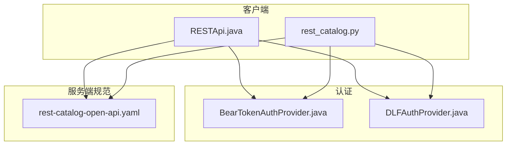
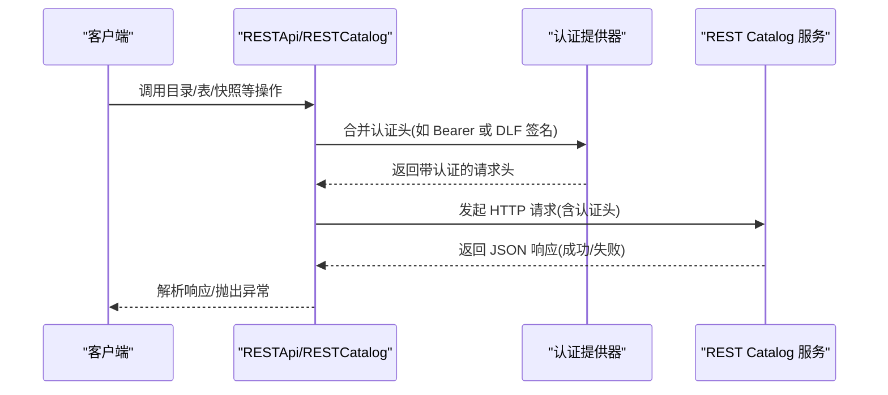
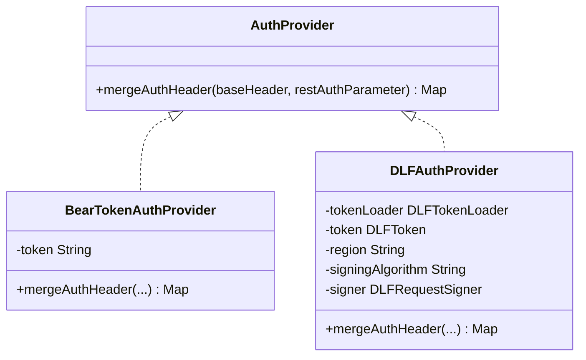
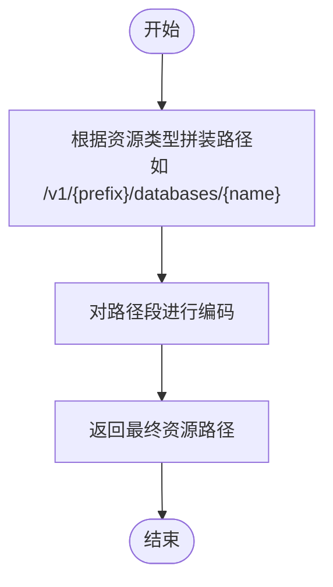
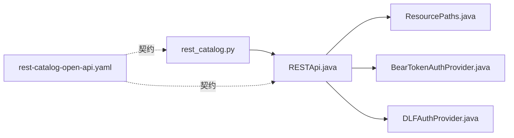

# REST API

<cite>
**本文引用的文件**
- [rest-catalog-open-api.yaml](file://docs/static/rest-catalog-open-api.yaml)
- [RESTApi.java](file://paimon-api/src/main/java/org/apache/paimon/rest/RESTApi.java)
- [ResourcePaths.java](file://paimon-api/src/main/java/org/apache/paimon/rest/ResourcePaths.java)
- [BearTokenAuthProvider.java](file://paimon-api/src/main/java/org/apache/paimon/rest/auth/BearTokenAuthProvider.java)
- [DLFAuthProvider.java](file://paimon-api/src/main/java/org/apache/paimon/rest/auth/DLFAuthProvider.java)
- [rest_catalog.py](file://paimon-python/pypaimon/catalog/rest/rest_catalog.py)
- [overview.md](file://docs/content/concepts/rest/overview.md)
</cite>

## 目录
1. [简介](#简介)
2. [项目结构](#项目结构)
3. [核心组件](#核心组件)
4. [架构总览](#架构总览)
5. [详细组件分析](#详细组件分析)
6. [依赖关系分析](#依赖关系分析)
7. [性能考虑](#性能考虑)
8. [故障排查指南](#故障排查指南)
9. [结论](#结论)
10. [附录](#附录)

## 简介
本文件为 Apache Paimon REST Catalog 的完整 REST API 文档，覆盖目录管理、表操作、快照与标签管理、消费者与分支/标签操作、视图与函数等端点，以及认证机制（Bearer Token、DLF 签名）、错误处理、分页与重试策略、性能优化建议，并提供 OpenAPI 规范引用与使用说明。

## 项目结构
- REST API 定义与规范：位于 OpenAPI 文件中，描述所有端点、请求/响应模型与状态码。
- 客户端 SDK（Java）：RESTApi 类封装了对 REST Catalog 的调用，包括资源路径拼装、分页查询、认证头注入、异常映射等。
- Python SDK：RESTCatalog 封装了数据库、表、快照、标签、分支、视图、函数等操作，统一异常转换。
- 认证模块：支持 Bearer Token 与 DLF 签名两种认证方式，自动注入 Authorization 头或生成 DLF 签名头。

图表来源
- [RESTApi.java:145-212](file://paimon-api/src/main/java/org/apache/paimon/rest/RESTApi.java#L145-L212)
- [rest_catalog.py:56-79](file://paimon-python/pypaimon/catalog/rest/rest_catalog.py#L56-L79)
- [BearTokenAuthProvider.java:25-44](file://paimon-api/src/main/java/org/apache/paimon/rest/auth/BearTokenAuthProvider.java#L25-L44)
- [DLFAuthProvider.java:37-90](file://paimon-api/src/main/java/org/apache/paimon/rest/auth/DLFAuthProvider.java#L37-L90)
- [rest-catalog-open-api.yaml:30-62](file://docs/static/rest-catalog-open-api.yaml#L30-L62)

章节来源
- [overview.md:27-68](file://docs/content/concepts/rest/overview.md#L27-L68)

## 核心组件
- RESTApi（Java 客户端）
  - 负责构建资源路径、发起 HTTP 请求、合并配置、注入认证头、分页查询、异常映射。
  - 支持数据库、表、分区、快照、标签、分支、视图、函数等全量 CRUD 与查询。
- ResourcePaths（资源路径拼装）
  - 统一生成 /v1/{prefix}/... 的 REST 路径，确保编码与前缀一致。
- RESTCatalog（Python 客户端）
  - 对 RESTApi 进行二次封装，提供更贴近 Catalog 的语义化方法，统一异常转换。
- 认证提供器
  - BearTokenAuthProvider：在 Authorization 头添加 Bearer Token。
  - DLFAuthProvider：按 DLF 签名算法生成 x-dlf-* 头并附加 Authorization。

章节来源
- [RESTApi.java:145-212](file://paimon-api/src/main/java/org/apache/paimon/rest/RESTApi.java#L145-L212)
- [ResourcePaths.java:28-61](file://paimon-api/src/main/java/org/apache/paimon/rest/ResourcePaths.java#L28-L61)
- [rest_catalog.py:56-79](file://paimon-python/pypaimon/catalog/rest/rest_catalog.py#L56-L79)
- [BearTokenAuthProvider.java:25-44](file://paimon-api/src/main/java/org/apache/paimon/rest/auth/BearTokenAuthProvider.java#L25-L44)
- [DLFAuthProvider.java:37-90](file://paimon-api/src/main/java/org/apache/paimon/rest/auth/DLFAuthProvider.java#L37-L90)

## 架构总览
下图展示客户端如何通过 REST API 与服务端交互，以及认证流程。

图表来源
- [RESTApi.java:176-212](file://paimon-api/src/main/java/org/apache/paimon/rest/RESTApi.java#L176-L212)
- [rest_catalog.py:56-79](file://paimon-python/pypaimon/catalog/rest/rest_catalog.py#L56-L79)
- [BearTokenAuthProvider.java:37-43](file://paimon-api/src/main/java/org/apache/paimon/rest/auth/BearTokenAuthProvider.java#L37-L43)
- [DLFAuthProvider.java:92-111](file://paimon-api/src/main/java/org/apache/paimon/rest/auth/DLFAuthProvider.java#L92-L111)

## 详细组件分析

### 认证机制
- Bearer Token
  - 在 Authorization 头中添加 Bearer 前缀的令牌字符串。
  - 适用于简单场景或自定义鉴权。
- DLF 签名
  - 自动计算 x-dlf-date、x-dlf-version、Content-Type、Content-MD5、x-dlf-content-sha256、x-dlf-security-token 等头。
  - 生成 Authorization 头，包含凭证与签名字段。
  - 支持默认签名器与 OpenAPI 签名器两种算法标识。

图表来源
- [BearTokenAuthProvider.java:25-44](file://paimon-api/src/main/java/org/apache/paimon/rest/auth/BearTokenAuthProvider.java#L25-L44)
- [DLFAuthProvider.java:37-90](file://paimon-api/src/main/java/org/apache/paimon/rest/auth/DLFAuthProvider.java#L37-L90)

章节来源
- [BearTokenAuthProvider.java:25-44](file://paimon-api/src/main/java/org/apache/paimon/rest/auth/BearTokenAuthProvider.java#L25-L44)
- [DLFAuthProvider.java:37-90](file://paimon-api/src/main/java/org/apache/paimon/rest/auth/DLFAuthProvider.java#L37-L90)

### 资源路径与端点映射
- ResourcePaths 统一生成 /v1/{prefix}/... 路径，支持数据库、表、快照、标签、分支、视图、函数等资源。
- OpenAPI 规范定义了各端点的 HTTP 方法、路径、查询参数、请求体、响应与状态码。

图表来源
- [ResourcePaths.java:53-61](file://paimon-api/src/main/java/org/apache/paimon/rest/ResourcePaths.java#L53-L61)
- [ResourcePaths.java:63-95](file://paimon-api/src/main/java/org/apache/paimon/rest/ResourcePaths.java#L63-L95)

章节来源
- [ResourcePaths.java:28-366](file://paimon-api/src/main/java/org/apache/paimon/rest/ResourcePaths.java#L28-L366)
- [rest-catalog-open-api.yaml:30-62](file://docs/static/rest-catalog-open-api.yaml#L30-L62)

### 数据库管理
- 列表、创建、获取、删除、修改数据库。
- 支持分页查询（maxResults、pageToken）与数据库名称模式过滤。

章节来源
- [RESTApi.java:225-323](file://paimon-api/src/main/java/org/apache/paimon/rest/RESTApi.java#L225-L323)
- [rest-catalog-open-api.yaml:63-119](file://docs/static/rest-catalog-open-api.yaml#L63-L119)

### 表管理
- 列表、详情列表、全局列表、创建、获取、重命名、删除、修改、注册外部表。
- 支持表名模式过滤与表类型过滤。

章节来源
- [RESTApi.java:334-491](file://paimon-api/src/main/java/org/apache/paimon/rest/RESTApi.java#L334-L491)
- [rest-catalog-open-api.yaml:244-444](file://docs/static/rest-catalog-open-api.yaml#L244-L444)

### 快照与标签管理
- 获取最新/指定版本快照、列出快照、回滚到快照/标签/时间点、提交快照、标记分区完成、按名列表分区。
- 标签管理：列出、创建、删除、按名获取。

章节来源
- [RESTApi.java:532-732](file://paimon-api/src/main/java/org/apache/paimon/rest/RESTApi.java#L532-L732)
- [rest-catalog-open-api.yaml:794-936](file://docs/static/rest-catalog-open-api.yaml#L794-L936)
- [rest-catalog-open-api.yaml:1270-1444](file://docs/static/rest-catalog-open-api.yaml#L1270-L1444)

### 分支与标签
- 分支：列出、创建、删除、重命名、前移。
- 标签：列出、创建、删除、按名获取。

章节来源
- [rest-catalog-open-api.yaml:1064-1270](file://docs/static/rest-catalog-open-api.yaml#L1064-L1270)
- [rest-catalog-open-api.yaml:1270-1444](file://docs/static/rest-catalog-open-api.yaml#L1270-L1444)

### 视图与函数
- 视图：列表、详情列表、全局列表、创建、获取、重命名、删除、修改。
- 函数：列表、详情列表、全局列表、创建、获取、重命名、删除、修改。

章节来源
- [rest-catalog-open-api.yaml:1525-1690](file://docs/static/rest-catalog-open-api.yaml#L1525-L1690)
- [rest-catalog-open-api.yaml:1821-2090](file://docs/static/rest-catalog-open-api.yaml#L1821-L2090)

### 消费者管理
- 列表消费者、重置消费者（支持删除或指定下一快照）。

章节来源
- [RESTApi.java:617-651](file://paimon-api/src/main/java/org/apache/paimon/rest/RESTApi.java#L617-L651)
- [rest-catalog-open-api.yaml:1445-1524](file://docs/static/rest-catalog-open-api.yaml#L1445-L1524)

### 认证与授权
- Bearer Token：Authorization: Bearer <token>
- DLF 签名：自动注入 x-dlf-date、x-dlf-version、Content-Type、Content-MD5、x-dlf-content-sha256、x-dlf-security-token 等头，并生成 Authorization。

章节来源
- [BearTokenAuthProvider.java:37-43](file://paimon-api/src/main/java/org/apache/paimon/rest/auth/BearTokenAuthProvider.java#L37-L43)
- [DLFAuthProvider.java:92-111](file://paimon-api/src/main/java/org/apache/paimon/rest/auth/DLFAuthProvider.java#L92-L111)

### 错误处理与状态码
- 通用错误响应：400（非法请求）、401（未认证）、403（无权限）、404（资源不存在）、409（资源已存在）、500（服务器内部错误）。
- 资源特定错误：数据库不存在、表不存在、快照不存在、分支不存在、标签不存在、视图不存在、函数不存在等。

章节来源
- [rest-catalog-open-api.yaml:2096-2342](file://docs/static/rest-catalog-open-api.yaml#L2096-L2342)

## 依赖关系分析
- RESTApi 依赖 ResourcePaths 生成路径，依赖 AuthProvider 注入认证头。
- Python SDK RESTCatalog 依赖 RESTApi 并做异常转换。
- OpenAPI 规范为客户端与服务端契约，约束端点、参数、响应与错误。

图表来源
- [RESTApi.java:145-212](file://paimon-api/src/main/java/org/apache/paimon/rest/RESTApi.java#L145-L212)
- [ResourcePaths.java:28-61](file://paimon-api/src/main/java/org/apache/paimon/rest/ResourcePaths.java#L28-L61)
- [rest_catalog.py:56-79](file://paimon-python/pypaimon/catalog/rest/rest_catalog.py#L56-L79)
- [rest-catalog-open-api.yaml:30-62](file://docs/static/rest-catalog-open-api.yaml#L30-L62)

## 性能考虑
- 分页查询：优先使用 maxResults 与 pageToken，避免一次性拉取大量数据。
- 批量操作：尽量合并请求，减少往返次数。
- 缓存与重用：复用 RESTApi 实例，避免重复配置与认证头计算。
- 并发控制：合理设置并发度，避免服务端限流。
- 传输优化：启用压缩（如服务端支持），减少大响应体传输。

## 故障排查指南
- 401 未认证：检查 Bearer Token 或 DLF 凭证是否正确、过期；确认 DLF 签名头是否完整。
- 403 无权限：确认用户对数据库/表的访问权限。
- 404 资源不存在：核对数据库名、表名、快照/标签/分支是否存在。
- 409 资源已存在：确认创建时是否允许忽略已存在。
- 500 服务器错误：重试并记录日志，必要时联系服务端管理员。

章节来源
- [rest-catalog-open-api.yaml:2096-2342](file://docs/static/rest-catalog-open-api.yaml#L2096-L2342)

## 结论
本文档基于 OpenAPI 规范与客户端实现，系统性梳理了 Paimon REST Catalog 的端点、认证、错误处理与最佳实践。建议在生产环境中结合分页、缓存与重试策略，确保稳定与高效。

## 附录

### OpenAPI 规范引用
- 规范文件：docs/static/rest-catalog-open-api.yaml
- 说明：该文件定义了所有端点、参数、请求体、响应与错误模型，是客户端与服务端契约。

章节来源
- [rest-catalog-open-api.yaml:18-69](file://docs/static/rest-catalog-open-api.yaml#L18-L69)

### curl 使用示例（示例思路）
- 获取配置
  - curl -H "Authorization: Bearer <token>" https://host:port/v1/config?warehouse=<实例名>
- 列表数据库
  - curl -H "Authorization: Bearer <token>" https://host:port/v1/{prefix}/databases
- 创建数据库
  - curl -X POST -H "Authorization: Bearer <token>" -H "Content-Type: application/json" -d '{"name":"db","options":{"k":"v"}}' https://host:port/v1/{prefix}/databases
- 获取表快照
  - curl -H "Authorization: Bearer <token>" https://host:port/v1/{prefix}/databases/{db}/tables/{table}/snapshot
- 提交快照
  - curl -X POST -H "Authorization: Bearer <token>" -H "Content-Type: application/json" -d '{"tableUuid":"...","snapshot":{...},"statistics":[]}' https://host:port/v1/{prefix}/databases/{db}/tables/{table}/commit

说明：以上为示例思路，具体参数请参考 OpenAPI 规范与客户端实现。

### SDK 使用方法（Java/Python）
- Java
  - 初始化 RESTApi，设置 URI、仓库名、认证提供器（bear/dlf）与可选头部。
  - 调用 listDatabases()/listTables()/loadSnapshot()/commitSnapshot() 等方法。
- Python
  - 使用 RESTCatalog，内部封装 RESTApi，提供更直观的方法名与异常转换。

章节来源
- [RESTApi.java:176-212](file://paimon-api/src/main/java/org/apache/paimon/rest/RESTApi.java#L176-L212)
- [rest_catalog.py:56-79](file://paimon-python/pypaimon/catalog/rest/rest_catalog.py#L56-L79)