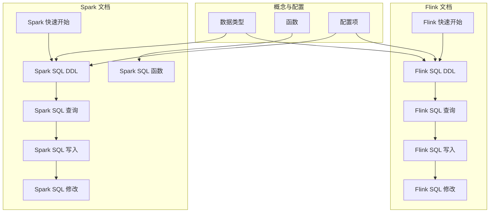
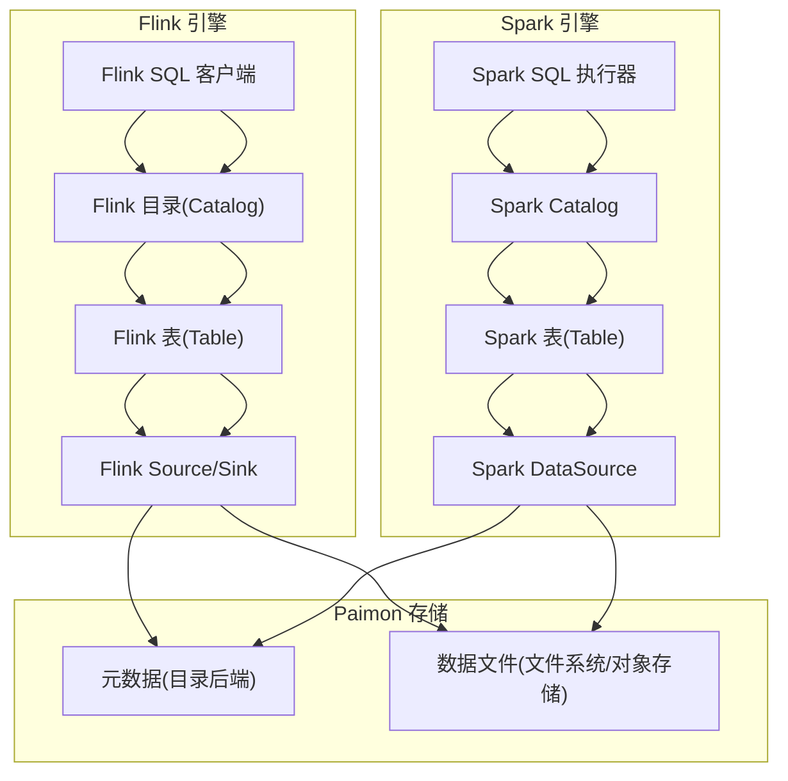
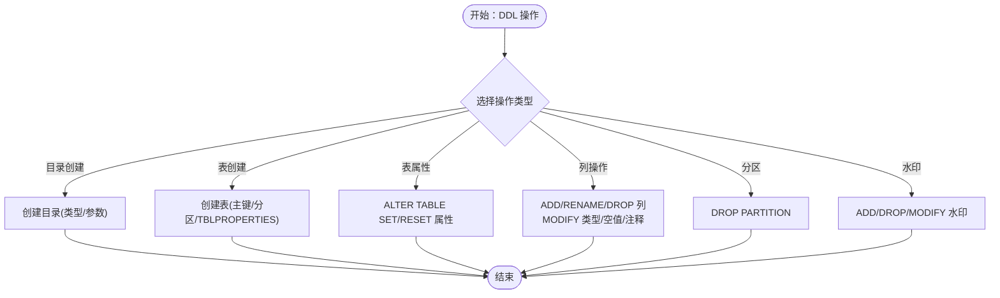
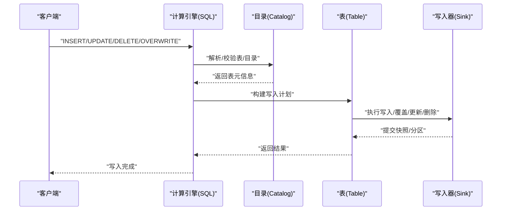
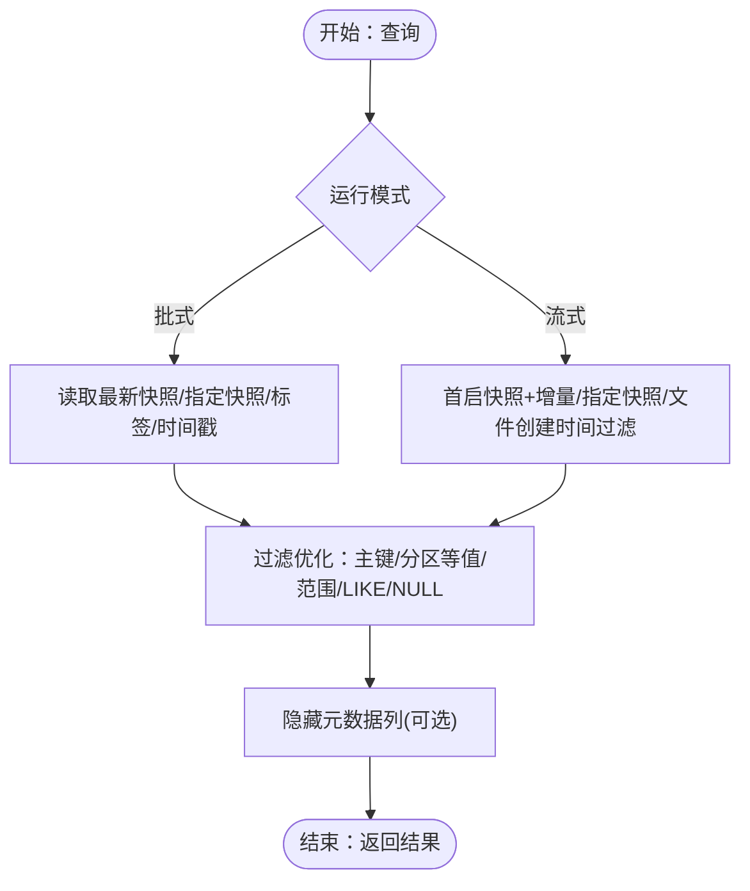
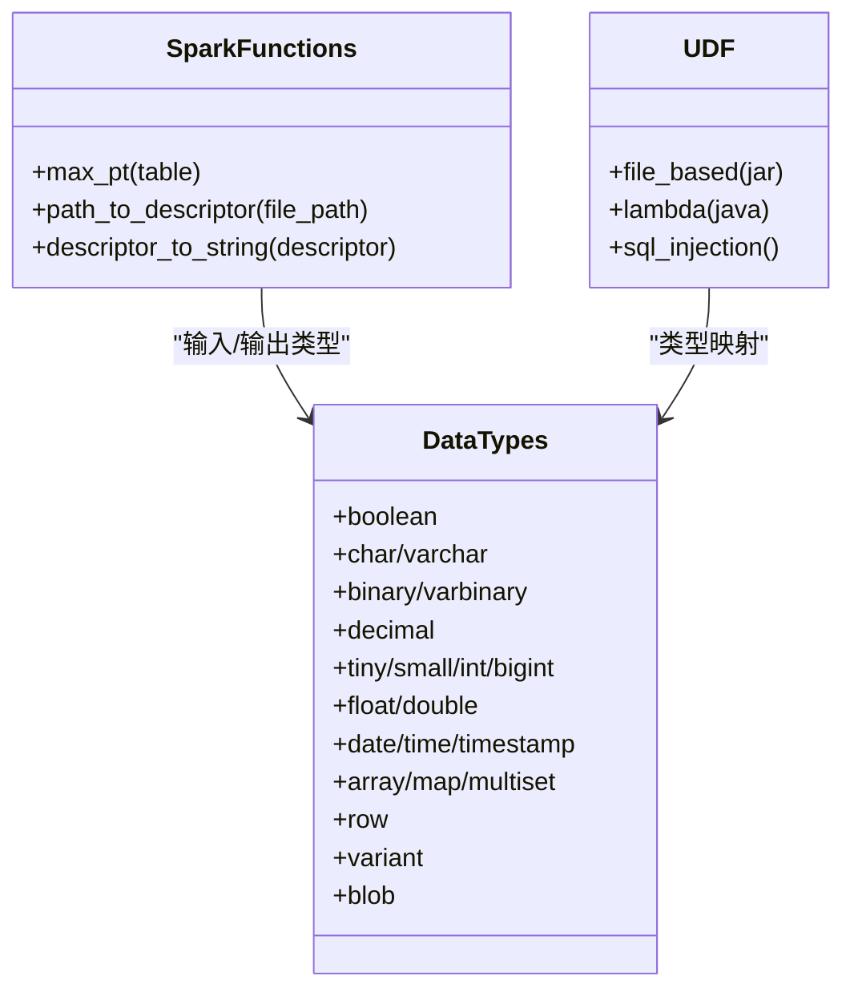
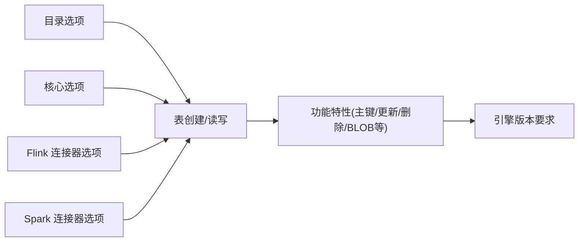

# SQL接口

<cite>
**本文引用的文件**   
- [sql-ddl.md（Flink）](file://docs/content/flink/sql-ddl.md)
- [sql-query.md（Flink）](file://docs/content/flink/sql-query.md)
- [sql-write.md（Flink）](file://docs/content/flink/sql-write.md)
- [sql-alter.md（Flink）](file://docs/content/flink/sql-alter.md)
- [quick-start.md（Flink）](file://docs/content/flink/quick-start.md)
- [sql-ddl.md（Spark）](file://docs/content/spark/sql-ddl.md)
- [sql-query.md（Spark）](file://docs/content/spark/sql-query.md)
- [sql-write.md（Spark）](file://docs/content/spark/sql-write.md)
- [sql-alter.md（Spark）](file://docs/content/spark/sql-alter.md)
- [sql-functions.md（Spark）](file://docs/content/spark/sql-functions.md)
- [data-types.md（概念）](file://docs/content/concepts/data-types.md)
- [functions.md（概念）](file://docs/content/concepts/functions.md)
- [configurations.md（维护）](file://docs/content/maintenance/configurations.md)
- [quick-start.md（Spark）](file://docs/content/spark/quick-start.md)
</cite>

## 目录
1. [简介](#简介)
2. [项目结构](#项目结构)
3. [核心组件](#核心组件)
4. [架构总览](#架构总览)
5. [详细组件分析](#详细组件分析)
6. [依赖分析](#依赖分析)
7. [性能考虑](#性能考虑)
8. [故障排除指南](#故障排除指南)
9. [结论](#结论)
10. [附录](#附录)

## 简介
本参考文档系统性梳理 Apache Paimon 在 Flink 与 Spark 计算引擎中的 SQL 接口能力，覆盖 DDL（创建/修改/删除）、DML（插入/更新/删除/覆盖/清空）、查询（批式/流式/时间旅行/增量）、函数与类型体系，并对比两引擎在语法与行为上的差异，提供性能优化建议与常见问题排查方法。

## 项目结构
围绕 SQL 接口的关键文档分布如下：
- Flink 文档：sql-ddl.md、sql-query.md、sql-write.md、sql-alter.md、quick-start.md
- Spark 文档：sql-ddl.md、sql-query.md、sql-write.md、sql-alter.md、sql-functions.md、quick-start.md
- 概念与维护：data-types.md、functions.md、configurations.md

**图表来源**
- [sql-ddl.md（Flink）](file://docs/content/flink/sql-ddl.md)
- [sql-query.md（Flink）](file://docs/content/flink/sql-query.md)
- [sql-write.md（Flink）](file://docs/content/flink/sql-write.md)
- [sql-alter.md（Flink）](file://docs/content/flink/sql-alter.md)
- [quick-start.md（Flink）](file://docs/content/flink/quick-start.md)
- [sql-ddl.md（Spark）](file://docs/content/spark/sql-ddl.md)
- [sql-query.md（Spark）](file://docs/content/spark/sql-query.md)
- [sql-write.md（Spark）](file://docs/content/spark/sql-write.md)
- [sql-alter.md（Spark）](file://docs/content/spark/sql-alter.md)
- [sql-functions.md（Spark）](file://docs/content/spark/sql-functions.md)
- [quick-start.md（Spark）](file://docs/content/spark/quick-start.md)
- [data-types.md（概念）](file://docs/content/concepts/data-types.md)
- [functions.md（概念）](file://docs/content/concepts/functions.md)
- [configurations.md（维护）](file://docs/content/maintenance/configurations.md)

**章节来源**
- [sql-ddl.md（Flink）](file://docs/content/flink/sql-ddl.md)
- [sql-query.md（Flink）](file://docs/content/flink/sql-query.md)
- [sql-write.md（Flink）](file://docs/content/flink/sql-write.md)
- [sql-alter.md（Flink）](file://docs/content/flink/sql-alter.md)
- [quick-start.md（Flink）](file://docs/content/flink/quick-start.md)
- [sql-ddl.md（Spark）](file://docs/content/spark/sql-ddl.md)
- [sql-query.md（Spark）](file://docs/content/spark/sql-query.md)
- [sql-write.md（Spark）](file://docs/content/spark/sql-write.md)
- [sql-alter.md（Spark）](file://docs/content/spark/sql-alter.md)
- [sql-functions.md（Spark）](file://docs/content/spark/sql-functions.md)
- [quick-start.md（Spark）](file://docs/content/spark/quick-start.md)
- [data-types.md（概念）](file://docs/content/concepts/data-types.md)
- [functions.md（概念）](file://docs/content/concepts/functions.md)
- [configurations.md（维护）](file://docs/content/maintenance/configurations.md)

## 核心组件
- 目录与仓库
  - 支持 filesystem、hive、jdbc、rest 等目录后端；可设置默认表选项、锁策略、分区同步等。
- 表管理
  - 支持主键表、分区表、外部表（Spark Hive 目录）、表属性变更、列变更、重命名、水印等。
- 读写模型
  - 批式/流式读取、时间旅行、增量读取、覆盖写、动态/静态分区覆盖、清空与删除、更新（部分引擎支持）。
- 查询优化
  - 主键/分区过滤加速、隐藏元数据列、并行度推断与限制、专用拆分生成。
- 函数与类型
  - 内置函数（如最大分区值、路径转描述符、描述符转字符串）、用户自定义函数（文件/lambda/SQL），以及全面的数据类型映射。

**章节来源**
- [sql-ddl.md（Flink）](file://docs/content/flink/sql-ddl.md)
- [sql-query.md（Flink）](file://docs/content/flink/sql-query.md)
- [sql-write.md（Flink）](file://docs/content/flink/sql-write.md)
- [sql-alter.md（Flink）](file://docs/content/flink/sql-alter.md)
- [sql-ddl.md（Spark）](file://docs/content/spark/sql-ddl.md)
- [sql-query.md（Spark）](file://docs/content/spark/sql-query.md)
- [sql-write.md（Spark）](file://docs/content/spark/sql-write.md)
- [sql-alter.md（Spark）](file://docs/content/spark/sql-alter.md)
- [sql-functions.md（Spark）](file://docs/content/spark/sql-functions.md)
- [data-types.md（概念）](file://docs/content/concepts/data-types.md)
- [functions.md（概念）](file://docs/content/concepts/functions.md)

## 架构总览
下图展示 Flink 与 Spark 中 Paimon SQL 的关键交互路径：目录注册 → 表创建/变更 → 读写执行 → 查询优化 → 结果返回。

**图表来源**
- [quick-start.md（Flink）](file://docs/content/flink/quick-start.md)
- [quick-start.md（Spark）](file://docs/content/spark/quick-start.md)
- [sql-ddl.md（Flink）](file://docs/content/flink/sql-ddl.md)
- [sql-ddl.md（Spark）](file://docs/content/spark/sql-ddl.md)

## 详细组件分析

### DDL：目录与表管理
- 目录类型
  - filesystem：默认，元数据与表文件均落盘。
  - hive：元数据落 Hive 元数据库，可直接从 Hive 访问表。
  - jdbc：元数据落关系型数据库（MySQL/Postgres 等）。
  - rest：元数据落远端服务。
- 表创建
  - 支持主键表、分区表、TBLPROPERTIES/WITH 选项、字段默认值、统计模式等。
  - Spark 外部表（指定 location）与继承已有元数据。
- 表属性与注释
  - 可通过 ALTER TABLE SET/RESET 修改或移除属性与注释。
- 列操作
  - 增加/重命名/删除列；位置 FIRST/AFTER；修改空值约束；修改列注释；修改列类型（含嵌套类型）。
- 分区操作
  - 删除分区（Flink 支持部分分区列指定，Spark 需全量分区列）。
- 水印
  - 增加/删除/修改水印策略。

**图表来源**
- [sql-ddl.md（Flink）](file://docs/content/flink/sql-ddl.md)
- [sql-alter.md（Flink）](file://docs/content/flink/sql-alter.md)
- [sql-ddl.md（Spark）](file://docs/content/spark/sql-ddl.md)
- [sql-alter.md（Spark）](file://docs/content/spark/sql-alter.md)

**章节来源**
- [sql-ddl.md（Flink）](file://docs/content/flink/sql-ddl.md)
- [sql-alter.md（Flink）](file://docs/content/flink/sql-alter.md)
- [sql-ddl.md（Spark）](file://docs/content/spark/sql-ddl.md)
- [sql-alter.md（Spark）](file://docs/content/spark/sql-alter.md)

### DML：写入与更新
- 插入
  - INSERT INTO 支持批量与流式；支持动态选项（如聚簇写入）。
- 覆盖写
  - INSERT OVERWRITE 支持整表覆盖与分区覆盖；Spark 支持动态/静态分区覆盖；Flink 支持动态分区覆盖开关。
- 清空与删除
  - TRUNCATE TABLE（Spark 2.4+）；Flink 使用条件覆盖模拟清空；删除分区可通过覆盖空集实现。
- 更新
  - Flink 1.17+ 支持 UPDATE（仅主键表、特定 MergeEngine）。
- 删除
  - Flink 1.17+ 支持 DELETE（仅主键表、特定 MergeEngine，且不支持流式）。
- 分区标记完成
  - 提供“分区标记完成”机制，结合时间解析与空闲时长触发下游调度。

**图表来源**
- [sql-write.md（Flink）](file://docs/content/flink/sql-write.md)
- [sql-write.md（Spark）](file://docs/content/spark/sql-write.md)

**章节来源**
- [sql-write.md（Flink）](file://docs/content/flink/sql-write.md)
- [sql-write.md（Spark）](file://docs/content/spark/sql-write.md)

### 查询：批式/流式/时间旅行/增量
- 批式查询
  - 默认读取最新快照；支持按快照 ID、时间戳、标签、水位进行时间旅行；支持增量区间与自动标签增量。
- 流式查询
  - 默认首启读取最新快照并持续追加；支持从指定快照起读取；支持基于文件创建时间的粗过滤。
- 隐藏元数据列
  - Spark 支持分区、桶、行索引、文件路径、行标识、序列号等列。
- 并行度与优化
  - 批式并行度由拆分数决定，流式由桶数决定；可禁用推断或手动指定；支持专用拆分生成以缓解初始化开销。

**图表来源**
- [sql-query.md（Flink）](file://docs/content/flink/sql-query.md)
- [sql-query.md（Spark）](file://docs/content/spark/sql-query.md)

**章节来源**
- [sql-query.md（Flink）](file://docs/content/flink/sql-query.md)
- [sql-query.md（Spark）](file://docs/content/spark/sql-query.md)

### 函数与类型
- 内置函数（Spark）
  - 最大分区值、路径转描述符、描述符转字符串等。
- 用户自定义函数
  - 文件函数（JAR）、Lambda 函数、SQL 函数（REST 目录支持）。
- 数据类型
  - 支持布尔、字符/变长字符、二进制/字节、十进制、整型、浮点、日期/时间/带时区时间、数组/映射/多集、行类型、变体、BLOB 等；不同引擎版本要求不同。

**图表来源**
- [sql-functions.md（Spark）](file://docs/content/spark/sql-functions.md)
- [functions.md（概念）](file://docs/content/concepts/functions.md)
- [data-types.md（概念）](file://docs/content/concepts/data-types.md)

**章节来源**
- [sql-functions.md（Spark）](file://docs/content/spark/sql-functions.md)
- [functions.md（概念）](file://docs/content/concepts/functions.md)
- [data-types.md（概念）](file://docs/content/concepts/data-types.md)

### 引擎差异：Flink vs Spark
- 目录与启动
  - Flink：使用 paimon-flink-* 包，SQL 客户端启动；支持 Generic Catalog（需 Hive）。
  - Spark：使用 paimon-spark-* 包，spark-sql 启动；支持 Generic Catalog（推荐 Hive）。
- 写入语法
  - INSERT/INSERT OVERWRITE 基本一致；Spark 支持动态/静态分区覆盖开关；Flink 支持动态分区覆盖开关与聚簇写入动态选项。
- 更新/删除
  - Flink 1.17+ 支持 UPDATE/DELETE；Spark 支持 UPDATE/DELETE/合并写（MERGE INTO）。
- 时间旅行
  - Flink：动态选项与 FOR SYSTEM_TIME AS OF（1.18+）。
  - Spark：VERSION AS OF / TIMESTAMP AS OF（3.3+），增量函数调用。
- 隐藏元数据列
  - 仅 Spark 支持。
- 类型转换
  - Spark 对时间类型映射有版本差异提示。

**章节来源**
- [quick-start.md（Flink）](file://docs/content/flink/quick-start.md)
- [quick-start.md（Spark）](file://docs/content/spark/quick-start.md)
- [sql-write.md（Flink）](file://docs/content/flink/sql-write.md)
- [sql-write.md（Spark）](file://docs/content/spark/sql-write.md)
- [sql-query.md（Flink）](file://docs/content/flink/sql-query.md)
- [sql-query.md（Spark）](file://docs/content/spark/sql-query.md)
- [sql-functions.md（Spark）](file://docs/content/spark/sql-functions.md)
- [data-types.md（概念）](file://docs/content/concepts/data-types.md)

## 依赖分析
- 目录与表选项
  - 目录选项（CatalogOptions）、核心选项（CoreOptions）、连接器选项（Flink/Spark Connector Options）影响表创建与读写行为。
- 功能依赖
  - 主键表与特定 MergeEngine 才支持 UPDATE/DELETE（Flink）。
  - BLOB 类型需要启用行跟踪与数据演进（概念文档说明）。
- 版本兼容
  - Variant/Blob 等类型对引擎版本有要求；Spark 对时间类型的映射存在版本差异。

**图表来源**
- [configurations.md（维护）](file://docs/content/maintenance/configurations.md)
- [sql-write.md（Flink）](file://docs/content/flink/sql-write.md)
- [data-types.md（概念）](file://docs/content/concepts/data-types.md)

**章节来源**
- [configurations.md（维护）](file://docs/content/maintenance/configurations.md)
- [sql-write.md（Flink）](file://docs/content/flink/sql-write.md)
- [data-types.md（概念）](file://docs/content/concepts/data-types.md)

## 性能考虑
- 过滤优化
  - 明确指定分区与主键过滤条件，利用等值/范围/LIKE/IS NULL 等函数加速数据跳过。
- 并行度
  - 批式：并行度通常等于拆分数；流式：并行度通常等于桶数，受最大推断并行度限制；可禁用推断或手动设置。
- 专用拆分生成
  - 大量拆分场景下启用专用拆分生成，避免 JobManager 初始化开销与 OOM 风险，但会改变作业拓扑与容错策略。
- 写入优化
  - Flink 支持聚簇写入（Append 表，批模式）；合理设置写缓冲与内存分配策略。

**章节来源**
- [sql-query.md（Flink）](file://docs/content/flink/sql-query.md)
- [sql-query.md（Spark）](file://docs/content/spark/sql-query.md)
- [sql-write.md（Flink）](file://docs/content/flink/sql-write.md)
- [quick-start.md（Flink）](file://docs/content/flink/quick-start.md)

## 故障排除指南
- Hive 目录列类型不兼容
  - 修改列类型时需关闭 Hive 不兼容列类型变更限制，或在目录中设置相应参数。
- 对象存储重命名风险
  - 非原子重命名可能导致部分文件移动失败，建议谨慎使用。
- 删除分区
  - Flink 支持部分分区列指定与多值删除；Spark 需全量分区列指定。
- 写入冲突与并发
  - 多作业写同一表时，建议使用专用整理任务或协调写入策略。
- 时间旅行与增量
  - 确认快照/标签/时间戳有效性；增量读取注意扫描模式与删除记录处理。

**章节来源**
- [sql-alter.md（Flink）](file://docs/content/flink/sql-alter.md)
- [sql-write.md（Flink）](file://docs/content/flink/sql-write.md)
- [sql-write.md（Spark）](file://docs/content/spark/sql-write.md)
- [sql-query.md（Flink）](file://docs/content/flink/sql-query.md)
- [sql-query.md（Spark）](file://docs/content/spark/sql-query.md)

## 结论
Paimon 在 Flink 与 Spark 上提供了完整的 SQL 接口能力，覆盖目录、表管理、读写、查询与函数类型体系。两引擎在语法与功能上各有侧重，用户应根据目标引擎与版本选择合适的语法与配置。遵循过滤优化、并行度与写入策略的最佳实践，可显著提升查询与写入性能。

## 附录
- 常用示例路径（请参见对应文档）
  - 创建目录与表（Flink）：[sql-ddl.md（Flink）](file://docs/content/flink/sql-ddl.md)
  - 创建目录与表（Spark）：[sql-ddl.md（Spark）](file://docs/content/spark/sql-ddl.md)
  - 插入/覆盖/更新/删除（Flink）：[sql-write.md（Flink）](file://docs/content/flink/sql-write.md)
  - 插入/覆盖/更新/删除（Spark）：[sql-write.md（Spark）](file://docs/content/spark/sql-write.md)
  - 查询与时间旅行（Flink）：[sql-query.md（Flink）](file://docs/content/flink/sql-query.md)
  - 查询与时间旅行（Spark）：[sql-query.md（Spark）](file://docs/content/spark/sql-query.md)
  - 列与属性变更（Flink）：[sql-alter.md（Flink）](file://docs/content/flink/sql-alter.md)
  - 列与属性变更（Spark）：[sql-alter.md（Spark）](file://docs/content/spark/sql-alter.md)
  - 内置函数（Spark）：[sql-functions.md（Spark）](file://docs/content/spark/sql-functions.md)
  - 数据类型（概念）：[data-types.md（概念）](file://docs/content/concepts/data-types.md)
  - 函数抽象（概念）：[functions.md（概念）](file://docs/content/concepts/functions.md)
  - 配置项（维护）：[configurations.md（维护）](file://docs/content/maintenance/configurations.md)
  - 快速开始（Flink）：[quick-start.md（Flink）](file://docs/content/flink/quick-start.md)
  - 快速开始（Spark）：[quick-start.md（Spark）](file://docs/content/spark/quick-start.md)