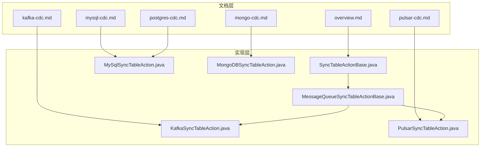
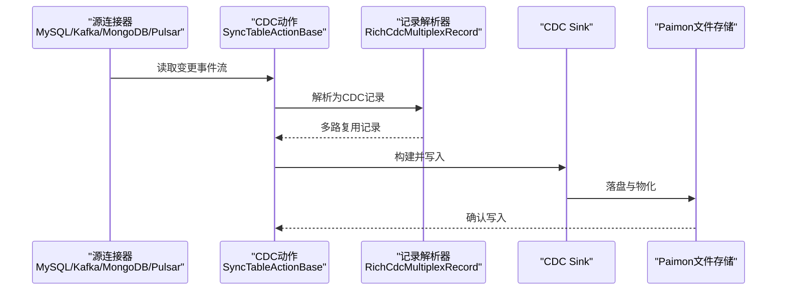
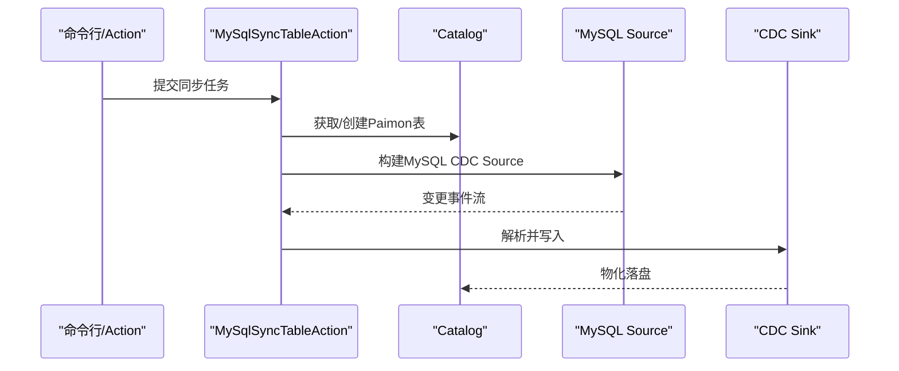
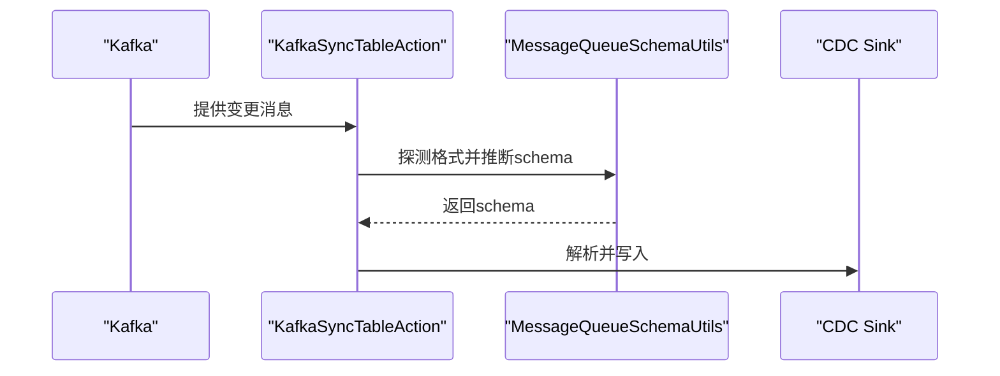
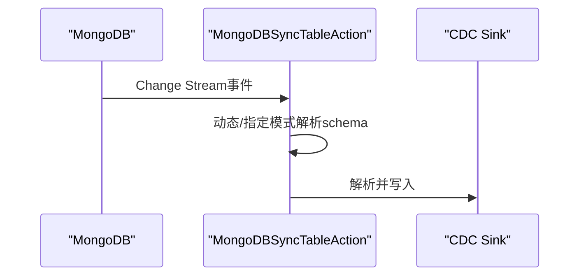
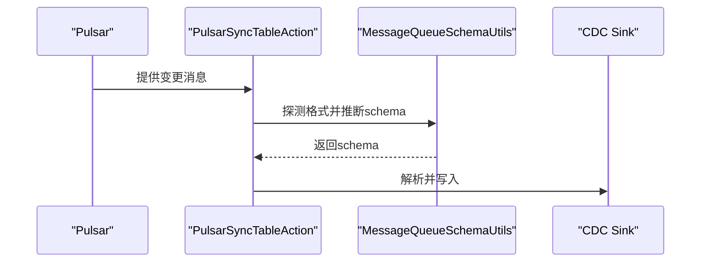
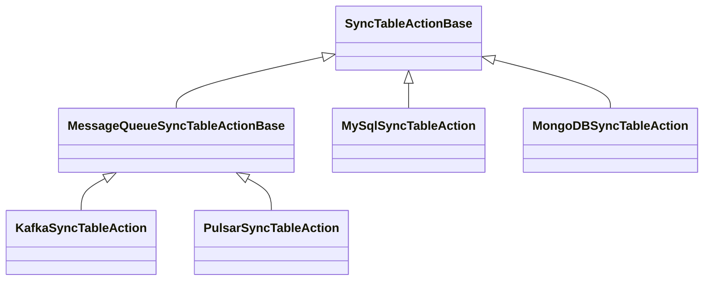

# CDC概述

<cite>
**本文引用的文件**
- [overview.md](file://docs/content/cdc-ingestion/overview.md)
- [mysql-cdc.md](file://docs/content/cdc-ingestion/mysql-cdc.md)
- [kafka-cdc.md](file://docs/content/cdc-ingestion/kafka-cdc.md)
- [mongo-cdc.md](file://docs/content/cdc-ingestion/mongo-cdc.md)
- [pulsar-cdc.md](file://docs/content/cdc-ingestion/pulsar-cdc.md)
- [postgres-cdc.md](file://docs/content/cdc-ingestion/postgres-cdc.md)
- [MySqlSyncTableAction.java](file://paimon-flink/paimon-flink-cdc/src/main/java/org/apache/paimon/flink/action/cdc/mysql/MySqlSyncTableAction.java)
- [KafkaSyncTableAction.java](file://paimon-flink/paimon-flink-cdc/src/main/java/org/apache/paimon/flink/action/cdc/kafka/KafkaSyncTableAction.java)
- [MongoDBSyncTableAction.java](file://paimon-flink/paimon-flink-cdc/src/main/java/org/apache/paimon/flink/action/cdc/mongodb/MongoDBSyncTableAction.java)
- [PulsarSyncTableAction.java](file://paimon-flink/paimon-flink-cdc/src/main/java/org/apache/paimon/flink/action/cdc/pulsar/PulsarSyncTableAction.java)
- [SyncTableActionBase.java](file://paimon-flink/paimon-flink-cdc/src/main/java/org/apache/paimon/flink/action/cdc/SyncTableActionBase.java)
- [MessageQueueSyncTableActionBase.java](file://paimon-flink/paimon-flink-cdc/src/main/java/org/apache/paimon/flink/action/cdc/MessageQueueSyncTableActionBase.java)
</cite>

## 目录
1. [引言](#引言)
2. [项目结构](#项目结构)
3. [核心组件](#核心组件)
4. [架构总览](#架构总览)
5. [详细组件分析](#详细组件分析)
6. [依赖分析](#依赖分析)
7. [性能考虑](#性能考虑)
8. [故障排查指南](#故障排查指南)
9. [结论](#结论)
10. [附录](#附录)

## 引言
本文件面向希望在Apache Paimon中实施变更数据捕获（CDC）的用户与工程师，系统性地介绍CDC的概念、在Paimon中的实现方式、支持的同步模式（MySQL表/库、Kafka表/库、MongoDB集合/库、Pulsar主题/库）、CDC数据的捕获、传输、处理与写入流程、schema evolution机制与限制、配置项与自定义方法、性能优化建议以及典型使用场景与配置示例。

## 项目结构
Paimon的CDC能力主要由“文档”和“Flink CDC Action实现”两部分组成：
- 文档层：位于docs/content/cdc-ingestion目录，覆盖概览、MySQL、Kafka、MongoDB、Pulsar、Postgres等子章节，提供功能说明、格式支持、参数清单、示例与FAQ。
- 实现层：位于paimon-flink/paimon-flink-cdc模块，提供各源的Action类（如MySqlSyncTableAction、KafkaSyncTableAction、MongoDBSyncTableAction、PulsarSyncTableAction），以及通用基类（SyncTableActionBase、MessageQueueSyncTableActionBase）和CDC通用工具。

**图表来源**
- [overview.md](file://docs/content/cdc-ingestion/overview.md)
- [mysql-cdc.md](file://docs/content/cdc-ingestion/mysql-cdc.md)
- [kafka-cdc.md](file://docs/content/cdc-ingestion/kafka-cdc.md)
- [mongo-cdc.md](file://docs/content/cdc-ingestion/mongo-cdc.md)
- [pulsar-cdc.md](file://docs/content/cdc-ingestion/pulsar-cdc.md)
- [postgres-cdc.md](file://docs/content/cdc-ingestion/postgres-cdc.md)
- [SyncTableActionBase.java](file://paimon-flink/paimon-flink-cdc/src/main/java/org/apache/paimon/flink/action/cdc/SyncTableActionBase.java)
- [MessageQueueSyncTableActionBase.java](file://paimon-flink/paimon-flink-cdc/src/main/java/org/apache/paimon/flink/action/cdc/MessageQueueSyncTableActionBase.java)
- [MySqlSyncTableAction.java](file://paimon-flink/paimon-flink-cdc/src/main/java/org/apache/paimon/flink/action/cdc/mysql/MySqlSyncTableAction.java)
- [KafkaSyncTableAction.java](file://paimon-flink/paimon-flink-cdc/src/main/java/org/apache/paimon/flink/action/cdc/kafka/KafkaSyncTableAction.java)
- [MongoDBSyncTableAction.java](file://paimon-flink/paimon-flink-cdc/src/main/java/org/apache/paimon/flink/action/cdc/mongodb/MongoDBSyncTableAction.java)
- [PulsarSyncTableAction.java](file://paimon-flink/paimon-flink-cdc/src/main/java/org/apache/paimon/flink/action/cdc/pulsar/PulsarSyncTableAction.java)

**章节来源**
- [overview.md](file://docs/content/cdc-ingestion/overview.md)
- [mysql-cdc.md](file://docs/content/cdc-ingestion/mysql-cdc.md)
- [kafka-cdc.md](file://docs/content/cdc-ingestion/kafka-cdc.md)
- [mongo-cdc.md](file://docs/content/cdc-ingestion/mongo-cdc.md)
- [pulsar-cdc.md](file://docs/content/cdc-ingestion/pulsar-cdc.md)
- [postgres-cdc.md](file://docs/content/cdc-ingestion/postgres-cdc.md)

## 核心组件
- 同步动作基类
  - SyncTableActionBase：统一处理“单表同步”的生命周期，包括表存在性检查、schema检索与兼容性校验、计算列构建、记录解析器与CDC Sink构建。
  - MessageQueueSyncTableActionBase：消息队列（Kafka/Pulsar）场景下的单表同步基类，负责从消息队列消费并推断schema。
- 源特定动作
  - MySqlSyncTableAction：MySQL表/库同步入口，基于Flink CDC MySQL Connector构建Source，支持有限schema变更。
  - KafkaSyncTableAction：Kafka表/库同步入口，支持多种格式（Canal/Debezium/Maxwell/Ogg/JSON/AWS-DMS/Debezium-BSON）。
  - MongoDBSyncTableAction：MongoDB集合/库同步入口，支持动态/指定两种schema起始模式与默认_id生成策略。
  - PulsarSyncTableAction：Pulsar表/库同步入口，支持多种格式与丰富的消费游标控制参数。
- 通用工具
  - CdcActionCommonUtils：构建Paimon Schema、计算列、类型映射与元数据转换。
  - RichCdcMultiplexRecord/EventParser：CDC事件解析与多路复用记录封装。
  - SyncJobHandler：封装Source构建、格式探测、时间戳提取器选择等。

**章节来源**
- [SyncTableActionBase.java](file://paimon-flink/paimon-flink-cdc/src/main/java/org/apache/paimon/flink/action/cdc/SyncTableActionBase.java)
- [MessageQueueSyncTableActionBase.java](file://paimon-flink/paimon-flink-cdc/src/main/java/org/apache/paimon/flink/action/cdc/MessageQueueSyncTableActionBase.java)
- [MySqlSyncTableAction.java](file://paimon-flink/paimon-flink-cdc/src/main/java/org/apache/paimon/flink/action/cdc/mysql/MySqlSyncTableAction.java)
- [KafkaSyncTableAction.java](file://paimon-flink/paimon-flink-cdc/src/main/java/org/apache/paimon/flink/action/cdc/kafka/KafkaSyncTableAction.java)
- [MongoDBSyncTableAction.java](file://paimon-flink/paimon-flink-cdc/src/main/java/org/apache/paimon/flink/action/cdc/mongodb/MongoDBSyncTableAction.java)
- [PulsarSyncTableAction.java](file://paimon-flink/paimon-flink-cdc/src/main/java/org/apache/paimon/flink/action/cdc/pulsar/PulsarSyncTableAction.java)

## 架构总览
下图展示了从上游数据源到Paimon表的端到端CDC流程：源连接器捕获变更、解析为CDC记录、应用类型映射与计算列、进入CDC Sink并写入Paimon文件存储。

**图表来源**
- [SyncTableActionBase.java](file://paimon-flink/paimon-flink-cdc/src/main/java/org/apache/paimon/flink/action/cdc/SyncTableActionBase.java)
- [MessageQueueSyncTableActionBase.java](file://paimon-flink/paimon-flink-cdc/src/main/java/org/apache/paimon/flink/action/cdc/MessageQueueSyncTableActionBase.java)
- [MySqlSyncTableAction.java](file://paimon-flink/paimon-flink-cdc/src/main/java/org/apache/paimon/flink/action/cdc/mysql/MySqlSyncTableAction.java)
- [KafkaSyncTableAction.java](file://paimon-flink/paimon-flink-cdc/src/main/java/org/apache/paimon/flink/action/cdc/kafka/KafkaSyncTableAction.java)
- [MongoDBSyncTableAction.java](file://paimon-flink/paimon-flink-cdc/src/main/java/org/apache/paimon/flink/action/cdc/mongodb/MongoDBSyncTableAction.java)
- [PulsarSyncTableAction.java](file://paimon-flink/paimon-flink-cdc/src/main/java/org/apache/paimon/flink/action/cdc/pulsar/PulsarSyncTableAction.java)

## 详细组件分析

### MySQL CDC
- 支持模式
  - 表级同步：将一个或多个MySQL表合并到一个Paimon表。
  - 库级同步：将整个MySQL数据库同步到一个Paimon数据库。
- 关键特性
  - 通过Flink CDC MySQL Connector构建Source，支持正则表达式监控多表或多库。
  - 支持有限schema变更：新增列、部分类型变更（字符串长度扩展、二进制长度扩展、整数范围扩大、浮点精度扩大）。
  - 自动创建/对齐Paimon表schema，并进行主键一致性校验。
- 典型流程
  - 参数解析与校验 → 检索MySQL schema → 合并schema → 构建CDC Source → 写入Paimon。

**图表来源**
- [MySqlSyncTableAction.java](file://paimon-flink/paimon-flink-cdc/src/main/java/org/apache/paimon/flink/action/cdc/mysql/MySqlSyncTableAction.java)
- [SyncTableActionBase.java](file://paimon-flink/paimon-flink-cdc/src/main/java/org/apache/paimon/flink/action/cdc/SyncTableActionBase.java)

**章节来源**
- [mysql-cdc.md](file://docs/content/cdc-ingestion/mysql-cdc.md)
- [MySqlSyncTableAction.java](file://paimon-flink/paimon-flink-cdc/src/main/java/org/apache/paimon/flink/action/cdc/mysql/MySqlSyncTableAction.java)
- [SyncTableActionBase.java](file://paimon-flink/paimon-flink-cdc/src/main/java/org/apache/paimon/flink/action/cdc/SyncTableActionBase.java)

### Kafka CDC
- 支持格式
  - Canal JSON、Debezium JSON/Avro/BSON、Ogg JSON、Maxwell JSON、Normal JSON、AWS-DMS JSON、Debezium BSON。
- 支持模式
  - 表级/库级同步；可从单topic或多个topic聚合。
- 关键特性
  - 若topic初始为空，需先手动建表并定义分区键/主键，否则无法推断schema。
  - 支持类型映射为字符串、计算列、元数据列等。
- 典型流程
  - 消费Kafka消息 → 探测数据格式 → 推断schema → 解析CDC记录 → 写入Paimon。

**图表来源**
- [KafkaSyncTableAction.java](file://paimon-flink/paimon-flink-cdc/src/main/java/org/apache/paimon/flink/action/cdc/kafka/KafkaSyncTableAction.java)
- [MessageQueueSyncTableActionBase.java](file://paimon-flink/paimon-flink-cdc/src/main/java/org/apache/paimon/flink/action/cdc/MessageQueueSyncTableActionBase.java)

**章节来源**
- [kafka-cdc.md](file://docs/content/cdc-ingestion/kafka-cdc.md)
- [KafkaSyncTableAction.java](file://paimon-flink/paimon-flink-cdc/src/main/java/org/apache/paimon/flink/action/cdc/kafka/KafkaSyncTableAction.java)
- [MessageQueueSyncTableActionBase.java](file://paimon-flink/paimon-flink-cdc/src/main/java/org/apache/paimon/flink/action/cdc/MessageQueueSyncTableActionBase.java)

### MongoDB CDC
- 支持模式
  - 集合级/库级同步；支持动态/指定两种schema起始模式；支持默认_id生成策略。
- 关键特性
  - Change Streams不携带字段类型，统一按字符串映射；主键必须为_id以支持UPSERT语义。
  - 支持指定字段映射与路径解析函数。
- 典型流程
  - 连接MongoDB → 选择schema模式 → 解析文档 → 写入Paimon。

**图表来源**
- [MongoDBSyncTableAction.java](file://paimon-flink/paimon-flink-cdc/src/main/java/org/apache/paimon/flink/action/cdc/mongodb/MongoDBSyncTableAction.java)
- [mongo-cdc.md](file://docs/content/cdc-ingestion/mongo-cdc.md)

**章节来源**
- [mongo-cdc.md](file://docs/content/cdc-ingestion/mongo-cdc.md)
- [MongoDBSyncTableAction.java](file://paimon-flink/paimon-flink-cdc/src/main/java/org/apache/paimon/flink/action/cdc/mongodb/MongoDBSyncTableAction.java)

### Pulsar CDC
- 支持格式
  - Canal JSON、Debezium JSON/Avro、Ogg JSON、Maxwell JSON、Normal JSON。
- 支持模式
  - 表级/库级同步；支持topic列表与正则匹配；提供丰富的消费游标控制参数。
- 关键特性
  - 支持从指定消息ID或时间戳开始/停止消费；支持bounded/unbounded流。
- 典型流程
  - 订阅Pulsar主题 → 探测格式 → 推断schema → 解析CDC记录 → 写入Paimon。

**图表来源**
- [PulsarSyncTableAction.java](file://paimon-flink/paimon-flink-cdc/src/main/java/org/apache/paimon/flink/action/cdc/pulsar/PulsarSyncTableAction.java)
- [MessageQueueSyncTableActionBase.java](file://paimon-flink/paimon-flink-cdc/src/main/java/org/apache/paimon/flink/action/cdc/MessageQueueSyncTableActionBase.java)

**章节来源**
- [pulsar-cdc.md](file://docs/content/cdc-ingestion/pulsar-cdc.md)
- [PulsarSyncTableAction.java](file://paimon-flink/paimon-flink-cdc/src/main/java/org/apache/paimon/flink/action/cdc/pulsar/PulsarSyncTableAction.java)
- [MessageQueueSyncTableActionBase.java](file://paimon-flink/paimon-flink-cdc/src/main/java/org/apache/paimon/flink/action/cdc/MessageQueueSyncTableActionBase.java)

### Postgres CDC（补充）
- 支持模式：表级/库级同步，支持slot名称、schema正则与表正则。
- 与MySQL类似，支持有限schema变更与自动建表/对齐。

**章节来源**
- [postgres-cdc.md](file://docs/content/cdc-ingestion/postgres-cdc.md)

## 依赖分析
- 组件耦合
  - 各源的Action均继承自SyncTableActionBase，共享schema构建、解析器与Sink构建逻辑。
  - 消息队列源（Kafka/Pulsar）进一步继承MessageQueueSyncTableActionBase，复用schema推断与格式探测。
- 外部依赖
  - Flink CDC Connector（MySQL/Kafka/MongoDB/Pulsar/Postgres）用于构建Source。
  - Paimon Catalog/Flink Sink用于表管理与写入。
- 循环依赖
  - 未发现循环依赖迹象；Action仅向下依赖通用工具与Flink CDC Connector。

**图表来源**
- [SyncTableActionBase.java](file://paimon-flink/paimon-flink-cdc/src/main/java/org/apache/paimon/flink/action/cdc/SyncTableActionBase.java)
- [MessageQueueSyncTableActionBase.java](file://paimon-flink/paimon-flink-cdc/src/main/java/org/apache/paimon/flink/action/cdc/MessageQueueSyncTableActionBase.java)
- [MySqlSyncTableAction.java](file://paimon-flink/paimon-flink-cdc/src/main/java/org/apache/paimon/flink/action/cdc/mysql/MySqlSyncTableAction.java)
- [KafkaSyncTableAction.java](file://paimon-flink/paimon-flink-cdc/src/main/java/org/apache/paimon/flink/action/cdc/kafka/KafkaSyncTableAction.java)
- [MongoDBSyncTableAction.java](file://paimon-flink/paimon-flink-cdc/src/main/java/org/apache/paimon/flink/action/cdc/mongodb/MongoDBSyncTableAction.java)
- [PulsarSyncTableAction.java](file://paimon-flink/paimon-flink-cdc/src/main/java/org/apache/paimon/flink/action/cdc/pulsar/PulsarSyncTableAction.java)

**章节来源**
- [SyncTableActionBase.java](file://paimon-flink/paimon-flink-cdc/src/main/java/org/apache/paimon/flink/action/cdc/SyncTableActionBase.java)
- [MessageQueueSyncTableActionBase.java](file://paimon-flink/paimon-flink-cdc/src/main/java/org/apache/paimon/flink/action/cdc/MessageQueueSyncTableActionBase.java)
- [MySqlSyncTableAction.java](file://paimon-flink/paimon-flink-cdc/src/main/java/org/apache/paimon/flink/action/cdc/mysql/MySqlSyncTableAction.java)
- [KafkaSyncTableAction.java](file://paimon-flink/paimon-flink-cdc/src/main/java/org/apache/paimon/flink/action/cdc/kafka/KafkaSyncTableAction.java)
- [MongoDBSyncTableAction.java](file://paimon-flink/paimon-flink-cdc/src/main/java/org/apache/paimon/flink/action/cdc/mongodb/MongoDBSyncTableAction.java)
- [PulsarSyncTableAction.java](file://paimon-flink/paimon-flink-cdc/src/main/java/org/apache/paimon/flink/action/cdc/pulsar/PulsarSyncTableAction.java)

## 性能考虑
- 并行度与吞吐
  - 通过表级配置项设置Sink并行度，平衡背压与写入吞吐。
- Checkpoint与状态
  - 默认启用Checkpoint（若未显式开启），建议根据数据量与SLA调整间隔。
- 类型映射与计算列
  - 使用类型映射减少不必要的类型转换；合理设计计算列，避免复杂表达式导致解析开销上升。
- 消息队列消费
  - Kafka/Pulsar可配置消费游标与bounded/unbounded，结合历史数据场景选择合适起点与终点，降低重复消费成本。
- 主键与分区键
  - 明确主键与分区键有助于Paimon高效写入与查询；避免频繁变更主键/分区键。

[本节为通用指导，无需具体文件引用]

## 故障排查指南
- MySQL中文乱码
  - 在Flink配置中设置字符编码参数。
- MySQL表/列注释同步
  - 通过配置项启用信息架构与Debezium注释采集。
- Kafka/Pulsar JSON缺字段类型
  - Debezium JSON应包含schema字段；否则按字符串处理；缺失库/表名时仅支持表级同步。
- MongoDB无字段类型
  - Change Streams不携带类型，统一按字符串映射；主键必须为_id。
- 建表前置
  - 若消息队列topic初始为空，需先手动建表并定义分区键/主键，否则无法推断schema。

**章节来源**
- [mysql-cdc.md](file://docs/content/cdc-ingestion/mysql-cdc.md)
- [kafka-cdc.md](file://docs/content/cdc-ingestion/kafka-cdc.md)
- [mongo-cdc.md](file://docs/content/cdc-ingestion/mongo-cdc.md)
- [pulsar-cdc.md](file://docs/content/cdc-ingestion/pulsar-cdc.md)

## 结论
Paimon的CDC能力以统一的Action基类为核心，针对不同源提供专用实现，既保证了跨源的一致性体验，又保留了各源特有的灵活性。通过有限且可控的schema evolution、完善的类型映射与计算列支持、以及丰富的配置项，用户可以在生产环境中稳定地完成从MySQL、Kafka、MongoDB、Pulsar到Paimon的数据同步与演进。

[本节为总结，无需具体文件引用]

## 附录

### 支持的同步方式与对应Action
- MySQL
  - 表级：MySqlSyncTableAction
  - 库级：MySqlSyncDatabaseAction（参见文档）
- Kafka
  - 表级：KafkaSyncTableAction
  - 库级：KafkaSyncDatabaseAction（参见文档）
- MongoDB
  - 集合级：MongoDBSyncTableAction
  - 库级：MongoDBSyncDatabaseAction（参见文档）
- Pulsar
  - 表级：PulsarSyncTableAction
  - 库级：PulsarSyncDatabaseAction（参见文档）

**章节来源**
- [overview.md](file://docs/content/cdc-ingestion/overview.md)
- [mysql-cdc.md](file://docs/content/cdc-ingestion/mysql-cdc.md)
- [kafka-cdc.md](file://docs/content/cdc-ingestion/kafka-cdc.md)
- [mongo-cdc.md](file://docs/content/cdc-ingestion/mongo-cdc.md)
- [pulsar-cdc.md](file://docs/content/cdc-ingestion/pulsar-cdc.md)

### schema evolution机制与限制
- 支持
  - 新增列
  - 部分类型变更：字符串长度扩展、二进制长度扩展、整数范围扩大、浮点精度扩大
- 不支持
  - 删除列、重命名列（重命名会被视为新增列）
- 行为说明
  - 对于不支持的变更，框架会忽略或抛出异常，需人工干预。

**章节来源**
- [overview.md](file://docs/content/cdc-ingestion/overview.md)

### 配置选项与自定义设置
- 通用配置
  - 仓库路径、数据库名、表名、分区键、主键、计算列、元数据列、类型映射、表级属性（如并行度、桶数、changelog-producer等）
- 源特定配置
  - MySQL：主机、用户名、密码、数据库名、表名（支持正则）、binlog位点等
  - Kafka：bootstrap.servers、group.id、topic、value.format、schema.registry.url等
  - MongoDB：hosts、username、password、database、collection、schema.start.mode、default.id.generation等
  - Pulsar：serviceUrl/adminUrl、subscriptionName、topic/topic-pattern、value.format、schema.registry.url、消费游标控制等
- 自定义
  - 通过type_mapping自定义类型映射规则
  - 通过computed_column定义计算列表达式
  - 通过table_conf覆盖表属性（不可修改不可变选项）

**章节来源**
- [overview.md](file://docs/content/cdc-ingestion/overview.md)
- [mysql-cdc.md](file://docs/content/cdc-ingestion/mysql-cdc.md)
- [kafka-cdc.md](file://docs/content/cdc-ingestion/kafka-cdc.md)
- [mongo-cdc.md](file://docs/content/cdc-ingestion/mongo-cdc.md)
- [pulsar-cdc.md](file://docs/content/cdc-ingestion/pulsar-cdc.md)

### 使用场景与配置示例（路径指引）
- MySQL表级同步
  - 示例命令与参数说明参见：[mysql-cdc.md](file://docs/content/cdc-ingestion/mysql-cdc.md)
- MySQL库级同步
  - 示例命令与参数说明参见：[mysql-cdc.md](file://docs/content/cdc-ingestion/mysql-cdc.md)
- Kafka表级同步
  - 示例命令与参数说明参见：[kafka-cdc.md](file://docs/content/cdc-ingestion/kafka-cdc.md)
- Kafka库级同步
  - 示例命令与参数说明参见：[kafka-cdc.md](file://docs/content/cdc-ingestion/kafka-cdc.md)
- MongoDB集合级同步
  - 示例命令与参数说明参见：[mongo-cdc.md](file://docs/content/cdc-ingestion/mongo-cdc.md)
- MongoDB库级同步
  - 示例命令与参数说明参见：[mongo-cdc.md](file://docs/content/cdc-ingestion/mongo-cdc.md)
- Pulsar表级同步
  - 示例命令与参数说明参见：[pulsar-cdc.md](file://docs/content/cdc-ingestion/pulsar-cdc.md)
- Pulsar库级同步
  - 示例命令与参数说明参见：[pulsar-cdc.md](file://docs/content/cdc-ingestion/pulsar-cdc.md)