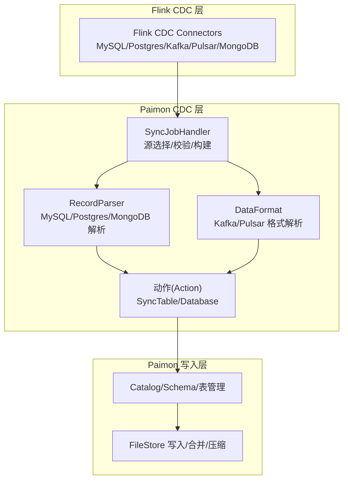
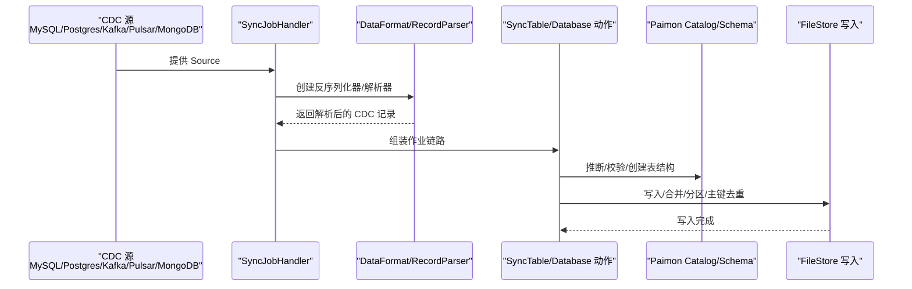
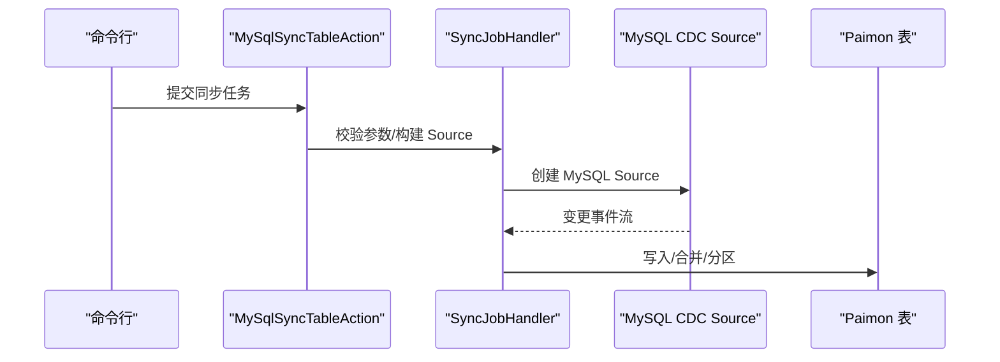
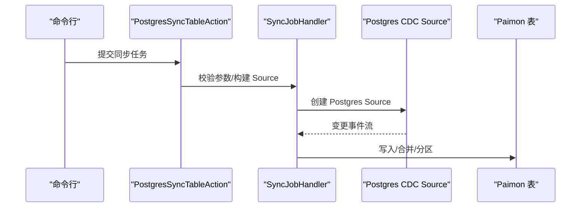
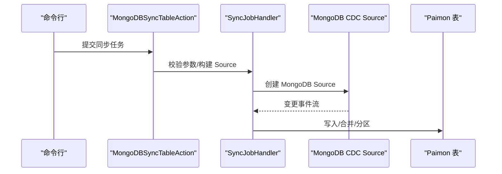
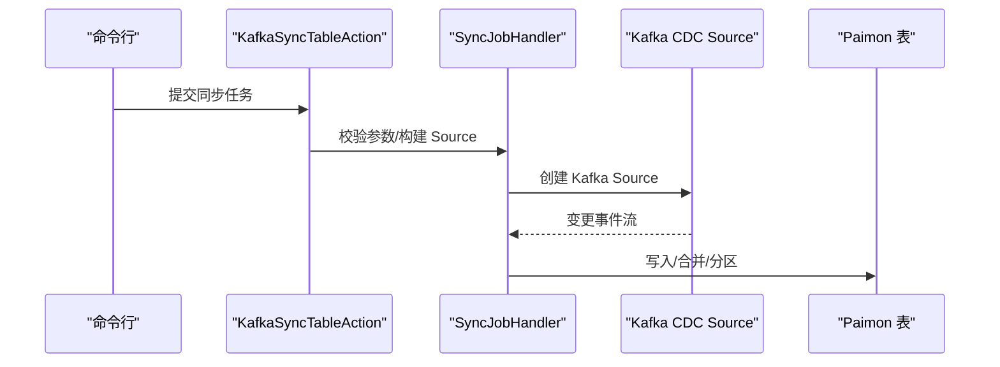
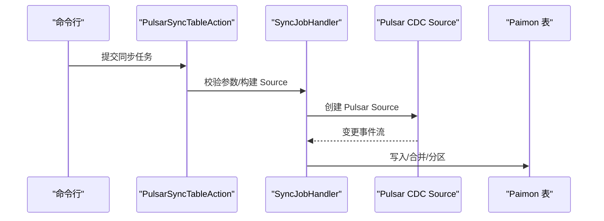
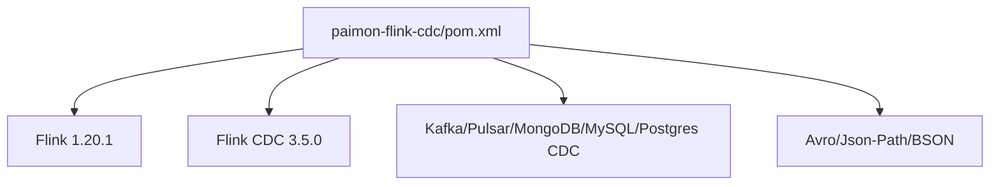
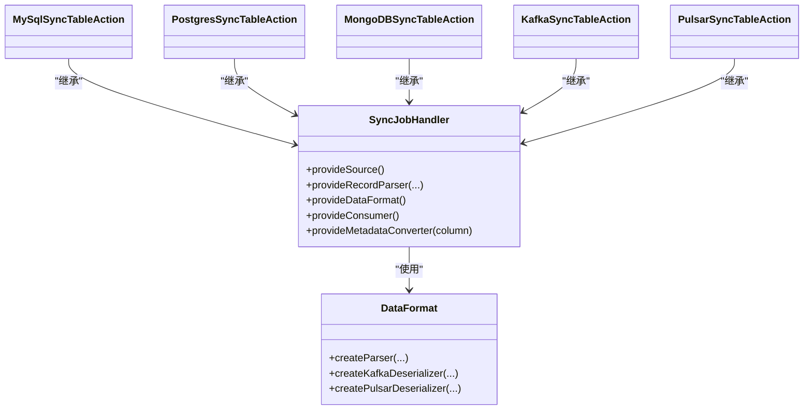

# CDC集成

<cite>
**本文引用的文件**
- [overview.md](file://docs/content/cdc-ingestion/overview.md)
- [mysql-cdc.md](file://docs/content/cdc-ingestion/mysql-cdc.md)
- [postgres-cdc.md](file://docs/content/cdc-ingestion/postgres-cdc.md)
- [mongo-cdc.md](file://docs/content/cdc-ingestion/mongo-cdc.md)
- [kafka-cdc.md](file://docs/content/cdc-ingestion/kafka-cdc.md)
- [pulsar-cdc.md](file://docs/content/cdc-ingestion/pulsar-cdc.md)
- [flink-cdc.md](file://docs/content/cdc-ingestion/flink-cdc.md)
- [pom.xml](file://paimon-flink/paimon-flink-cdc/pom.xml)
- [pom.xml](file://paimon-flink/paimon-flink-action/pom.xml)
- [MySqlSyncTableAction.java](file://paimon-flink/paimon-flink-cdc/src/main/java/org/apache/paimon/flink/action/cdc/mysql/MySqlSyncTableAction.java)
- [PostgresSyncTableAction.java](file://paimon-flink/paimon-flink-cdc/src/main/java/org/apache/paimon/flink/action/cdc/postgres/PostgresSyncTableAction.java)
- [MongoDBSyncTableAction.java](file://paimon-flink/paimon-flink-cdc/src/main/java/org/apache/paimon/flink/action/cdc/mongodb/MongoDBSyncTableAction.java)
- [SyncJobHandler.java](file://paimon-flink/paimon-flink-cdc/src/main/java/org/apache/paimon/flink/action/cdc/SyncJobHandler.java)
- [DataFormat.java](file://paimon-flink/paimon-flink-cdc/src/main/java/org/apache/paimon/flink/action/cdc/format/DataFormat.java)
- [PulsarSyncTableAction.java](file://paimon-flink/paimon-flink-cdc/src/main/java/org/apache/paimon/flink/action/cdc/pulsar/PulsarSyncTableAction.java)
- [KafkaSyncTableAction.java](file://paimon-flink/paimon-flink-cdc/src/main/java/org/apache/paimon/flink/action/cdc/kafka/KafkaSyncTableAction.java)
</cite>

## 目录
1. [简介](#简介)
2. [项目结构](#项目结构)
3. [核心组件](#核心组件)
4. [架构总览](#架构总览)
5. [详细组件分析](#详细组件分析)
6. [依赖分析](#依赖分析)
7. [性能考虑](#性能考虑)
8. [故障排除指南](#故障排除指南)
9. [结论](#结论)
10. [附录](#附录)

## 简介
本文件系统性阐述 Apache Paimon 的 CDC（变更数据捕获）集成能力，覆盖 MySQL、PostgreSQL、MongoDB、Kafka、Pulsar 等主流上游源的数据同步到 Paimon 表的完整流程。内容包括 CDC 基本概念、数据捕获与解析、传输与处理、写入策略、去重与排序、表结构映射、配置要点、性能优化与最佳实践，以及常见问题排查。

## 项目结构
Paimon 的 CDC 能力由“Flink CDC 连接器 + Paimon 动作(Action) + 数据格式(DataFormat) + 同步处理器(SyncJobHandler)”构成，核心模块位于 paimon-flink/paimon-flink-cdc 中，并通过 paimon-flink/paimon-flink-action 提供统一入口命令行工具。

- 模块分层
  - paimon-flink/paimon-flink-cdc：CDC 动作实现、数据格式定义、源适配器、记录解析器、作业处理器
  - paimon-flink/paimon-flink-action：打包为可执行 jar，提供 mysql_sync_table、kafka_sync_table 等子命令
  - 文档目录 docs/content/cdc-ingestion：各源的使用说明、参数与示例

图示来源
- [SyncJobHandler.java:182-251](file://paimon-flink/paimon-flink-cdc/src/main/java/org/apache/paimon/flink/action/cdc/SyncJobHandler.java#L182-L251)
- [DataFormat.java:36-70](file://paimon-flink/paimon-flink-cdc/src/main/java/org/apache/paimon/flink/action/cdc/format/DataFormat.java#L36-L70)

章节来源
- [pom.xml:36-48](file://paimon-flink/paimon-flink-cdc/pom.xml#L36-L48)
- [pom.xml:36-43](file://paimon-flink/paimon-flink-action/pom.xml#L36-L43)

## 核心组件
- SyncJobHandler：根据源类型提供 Source 构建、记录解析器、数据格式、消费者封装、元数据转换器等；负责必填参数校验与默认作业名生成。
- DataFormat：抽象消息队列数据格式接口，提供 Kafka/Pulsar 的反序列化器与记录解析器工厂。
- RecordParser：针对不同源（MySQL、Postgres、MongoDB）的 CDC 记录解析器，负责提取主键、时间戳、字段类型与计算列。
- 动作(Action)：如 MySqlSyncTableAction、PostgresSyncTableAction、MongoDBSyncTableAction、KafkaSyncTableAction、PulsarSyncTableAction 等，封装从源读取、Schema 推断、写入 Paimon 的完整作业逻辑。

章节来源
- [SyncJobHandler.java:53-270](file://paimon-flink/paimon-flink-cdc/src/main/java/org/apache/paimon/flink/action/cdc/SyncJobHandler.java#L53-L270)
- [DataFormat.java:30-70](file://paimon-flink/paimon-flink-cdc/src/main/java/org/apache/paimon/flink/action/cdc/format/DataFormat.java#L30-L70)
- [MySqlSyncTableAction.java:43-134](file://paimon-flink/paimon-flink-cdc/src/main/java/org/apache/paimon/flink/action/cdc/mysql/MySqlSyncTableAction.java#L43-L134)
- [PostgresSyncTableAction.java:44-134](file://paimon-flink/paimon-flink-cdc/src/main/java/org/apache/paimon/flink/action/cdc/postgres/PostgresSyncTableAction.java#L44-L134)
- [MongoDBSyncTableAction.java:32-81](file://paimon-flink/paimon-flink-cdc/src/main/java/org/apache/paimon/flink/action/cdc/mongodb/MongoDBSyncTableAction.java#L32-L81)
- [PulsarSyncTableAction.java:26-36](file://paimon-flink/paimon-flink-cdc/src/main/java/org/apache/paimon/flink/action/cdc/pulsar/PulsarSyncTableAction.java#L26-L36)
- [KafkaSyncTableAction.java:26-36](file://paimon-flink/paimon-flink-cdc/src/main/java/org/apache/paimon/flink/action/cdc/kafka/KafkaSyncTableAction.java#L26-L36)

## 架构总览
下图展示从上游 CDC 源到 Paimon 的端到端数据流：源连接器产生变更事件，经 SyncJobHandler 选择对应 DataFormat 或 RecordParser，解析为统一的 CDC 记录，再写入 Paimon 表。

图示来源
- [SyncJobHandler.java:182-251](file://paimon-flink/paimon-flink-cdc/src/main/java/org/apache/paimon/flink/action/cdc/SyncJobHandler.java#L182-L251)
- [DataFormat.java:36-70](file://paimon-flink/paimon-flink-cdc/src/main/java/org/apache/paimon/flink/action/cdc/format/DataFormat.java#L36-L70)

## 详细组件分析

### MySQL CDC 集成
- 支持表级与库级同步，自动推断/合并多表 Schema，支持有限的 Schema 变更（新增列、部分类型扩展）。
- 必填参数：主机、用户名、密码、数据库名；表级同步需指定表名。
- 主键约束：MySQL 同步任务要求源表具备主键，否则会直接失败。
- 典型流程：校验参数 → 推断 Schema → 构建 MySQL Source → 解析 CDC 记录 → 写入 Paimon。

图示来源
- [MySqlSyncTableAction.java:86-124](file://paimon-flink/paimon-flink-cdc/src/main/java/org/apache/paimon/flink/action/cdc/mysql/MySqlSyncTableAction.java#L86-L124)
- [SyncJobHandler.java:97-118](file://paimon-flink/paimon-flink-cdc/src/main/java/org/apache/paimon/flink/action/cdc/SyncJobHandler.java#L97-L118)

章节来源
- [mysql-cdc.md:29-124](file://docs/content/cdc-ingestion/mysql-cdc.md#L29-L124)
- [mysql-cdc.md:125-272](file://docs/content/cdc-ingestion/mysql-cdc.md#L125-L272)
- [MySqlSyncTableAction.java:43-134](file://paimon-flink/paimon-flink-cdc/src/main/java/org/apache/paimon/flink/action/cdc/mysql/MySqlSyncTableAction.java#L43-L134)

### PostgreSQL CDC 集成
- 支持表级同步，需指定数据库名、模式名、复制槽名等；表级同步要求源表具备主键。
- 典型流程：校验参数 → 推断 Schema → 构建 Postgres Source → 解析 CDC 记录 → 写入 Paimon。

图示来源
- [PostgresSyncTableAction.java:87-124](file://paimon-flink/paimon-flink-cdc/src/main/java/org/apache/paimon/flink/action/cdc/postgres/PostgresSyncTableAction.java#L87-L124)
- [SyncJobHandler.java:119-139](file://paimon-flink/paimon-flink-cdc/src/main/java/org/apache/paimon/flink/action/cdc/SyncJobHandler.java#L119-L139)

章节来源
- [postgres-cdc.md:29-128](file://docs/content/cdc-ingestion/postgres-cdc.md#L29-L128)
- [PostgresSyncTableAction.java:44-134](file://paimon-flink/paimon-flink-cdc/src/main/java/org/apache/paimon/flink/action/cdc/postgres/PostgresSyncTableAction.java#L44-L134)

### MongoDB CDC 集成
- 支持集合级同步，要求主键为 _id；Change Streams 不携带字段类型，统一映射为字符串类型。
- 支持动态/指定两种 schema.start.mode；支持 default.id.generation 控制 _id 处理方式。
- 典型流程：校验参数 → 获取集合 Schema → 构建 MongoDB Source → 解析 CDC 记录 → 写入 Paimon。

图示来源
- [MongoDBSyncTableAction.java:61-79](file://paimon-flink/paimon-flink-cdc/src/main/java/org/apache/paimon/flink/action/cdc/mongodb/MongoDBSyncTableAction.java#L61-L79)
- [SyncJobHandler.java:166-176](file://paimon-flink/paimon-flink-cdc/src/main/java/org/apache/paimon/flink/action/cdc/SyncJobHandler.java#L166-L176)

章节来源
- [mongo-cdc.md:29-252](file://docs/content/cdc-ingestion/mongo-cdc.md#L29-L252)
- [MongoDBSyncTableAction.java:32-81](file://paimon-flink/paimon-flink-cdc/src/main/java/org/apache/paimon/flink/action/cdc/mongodb/MongoDBSyncTableAction.java#L32-L81)

### Kafka CDC 集成
- 支持多种格式：Canal/Debezium/Maxwell/Ogg/JSON/AWS-DMS、Debezium-BSON 等。
- 支持单主题/多主题、单表/多表入库；当主题无历史消息时需先手动建表并声明主键与分区键。
- 典型流程：校验参数 → 选择 DataFormat → 构建 Kafka Source → 解析 CDC 记录 → 写入 Paimon。

图示来源
- [KafkaSyncTableAction.java:26-36](file://paimon-flink/paimon-flink-cdc/src/main/java/org/apache/paimon/flink/action/cdc/kafka/KafkaSyncTableAction.java#L26-L36)
- [SyncJobHandler.java:141-152](file://paimon-flink/paimon-flink-cdc/src/main/java/org/apache/paimon/flink/action/cdc/SyncJobHandler.java#L141-L152)

章节来源
- [kafka-cdc.md:29-569](file://docs/content/cdc-ingestion/kafka-cdc.md#L29-L569)
- [KafkaSyncTableAction.java:26-36](file://paimon-flink/paimon-flink-cdc/src/main/java/org/apache/paimon/flink/action/cdc/kafka/KafkaSyncTableAction.java#L26-L36)

### Pulsar CDC 集成
- 支持多种格式：Canal/Debezium/Maxwell/Ogg/JSON；支持单主题/多主题、单表/多表入库。
- 支持起止游标控制、Schema Registry 等高级配置。
- 典型流程：校验参数 → 选择 DataFormat → 构建 Pulsar Source → 解析 CDC 记录 → 写入 Paimon。

图示来源
- [PulsarSyncTableAction.java:26-36](file://paimon-flink/paimon-flink-cdc/src/main/java/org/apache/paimon/flink/action/cdc/pulsar/PulsarSyncTableAction.java#L26-L36)
- [SyncJobHandler.java:153-165](file://paimon-flink/paimon-flink-cdc/src/main/java/org/apache/paimon/flink/action/cdc/SyncJobHandler.java#L153-L165)

章节来源
- [pulsar-cdc.md:29-363](file://docs/content/cdc-ingestion/pulsar-cdc.md#L29-L363)
- [PulsarSyncTableAction.java:26-36](file://paimon-flink/paimon-flink-cdc/src/main/java/org/apache/paimon/flink/action/cdc/pulsar/PulsarSyncTableAction.java#L26-L36)

### Flink CDC 管道作为源
- Paimon 可作为 Flink CDC 管道的源，将 Paimon 仓库/数据库/表的数据导出到外部系统，支持自动发现新表、同步 Schema 变更。
- 注意：不支持删除表；主键表更新会被转为删除+插入。

章节来源
- [flink-cdc.md:27-172](file://docs/content/cdc-ingestion/flink-cdc.md#L27-L172)

## 依赖分析
- 版本与依赖
  - Flink 版本：1.20.1
  - Flink CDC 版本：3.5.0
  - 各源连接器版本：MySQL/Postgres/Kafka/Pulsar/MongoDB CDC
  - 依赖范围：provided，避免与用户环境冲突
- 关键依赖
  - flink-cdc-common/runtime：CDC 抽象与运行时
  - flink-connector-*：Kafka/Pulsar/MongoDB/MySQL/Postgres CDC 连接器
  - avro/json-path/bson：格式解析与工具

图示来源
- [pom.xml:36-48](file://paimon-flink/paimon-flink-cdc/pom.xml#L36-L48)

章节来源
- [pom.xml:57-193](file://paimon-flink/paimon-flink-cdc/pom.xml#L57-L193)
- [pom.xml:36-43](file://paimon-flink/paimon-flink-action/pom.xml#L36-L43)

## 性能考虑
- 并行度与分区
  - 使用 table_conf 设置 sink.parallelism，合理分配并行度以提升吞吐
  - 分区键设计应避免热点，结合业务维度（如日期、地域）
- 检查点与状态
  - 默认启用检查点（若未显式开启），建议根据延迟容忍度调整间隔
- 写入优化
  - 合理设置桶数量，避免小文件过多
  - 利用 Paimon 的合并/压缩机制降低存储与查询开销
- 源端限制
  - Kafka/Pulsar：确保消费者组/订阅名正确，避免重复消费
  - MySQL/Postgres：复制位点/槽位健康，避免长事务阻塞

## 故障排除指南
- MySQL 中文乱码
  - 在 flink-conf.yaml 中设置 JVM 编码选项（不同版本配置项略有差异）
- MySQL 表/列注释同步
  - 创建表注释：启用信息库属性
  - 修改表/列注释：启用 Debezium 的 schema 注释选项
- Kafka/Pulsar 无历史消息导致无法推断 Schema
  - 先手动建表，声明主键与分区键，再提交同步任务
- MongoDB 字段类型缺失
  - Change Streams 不携带类型，统一映射为字符串；如需精确类型，需自行解析或采用其他方案
- Postgres 主键缺失
  - 表级同步必须具备主键，否则直接失败
- Flink CDC 管道
  - 删除表需重启作业；主键表更新被转为删除+插入

章节来源
- [mysql-cdc.md:261-272](file://docs/content/cdc-ingestion/mysql-cdc.md#L261-L272)
- [kafka-cdc.md:140-147](file://docs/content/cdc-ingestion/kafka-cdc.md#L140-L147)
- [pulsar-cdc.md:129-136](file://docs/content/cdc-ingestion/pulsar-cdc.md#L129-L136)
- [flink-cdc.md:83-90](file://docs/content/cdc-ingestion/flink-cdc.md#L83-L90)

## 结论
Paimon 的 CDC 集成通过统一的 SyncJobHandler 与 DataFormat/RecordParser 抽象，屏蔽了不同上游源的差异，实现了从 MySQL、PostgreSQL、MongoDB、Kafka、Pulsar 到 Paimon 的高效同步。配合灵活的 Schema 变更、分区与主键去重策略，能够满足生产环境对一致性、性能与可运维性的要求。

## 附录
- 配置清单与示例
  - MySQL 表/库同步：参考文档中的命令行示例与参数说明
  - PostgreSQL 表同步：参考文档中的命令行示例与参数说明
  - MongoDB 集合/库同步：参考文档中的命令行示例与参数说明
  - Kafka 单/多主题同步：参考文档中的命令行示例与参数说明
  - Pulsar 单/多主题同步：参考文档中的命令行示例与参数说明
- 类关系图（代码级）

图示来源
- [SyncJobHandler.java:53-270](file://paimon-flink/paimon-flink-cdc/src/main/java/org/apache/paimon/flink/action/cdc/SyncJobHandler.java#L53-L270)
- [DataFormat.java:36-70](file://paimon-flink/paimon-flink-cdc/src/main/java/org/apache/paimon/flink/action/cdc/format/DataFormat.java#L36-L70)
- [MySqlSyncTableAction.java:74-84](file://paimon-flink/paimon-flink-cdc/src/main/java/org/apache/paimon/flink/action/cdc/mysql/MySqlSyncTableAction.java#L74-L84)
- [PostgresSyncTableAction.java:75-84](file://paimon-flink/paimon-flink-cdc/src/main/java/org/apache/paimon/flink/action/cdc/postgres/PostgresSyncTableAction.java#L75-L84)
- [MongoDBSyncTableAction.java:51-58](file://paimon-flink/paimon-flink-cdc/src/main/java/org/apache/paimon/flink/action/cdc/mongodb/MongoDBSyncTableAction.java#L51-L58)
- [KafkaSyncTableAction.java:27-34](file://paimon-flink/paimon-flink-cdc/src/main/java/org/apache/paimon/flink/action/cdc/kafka/KafkaSyncTableAction.java#L27-L34)
- [PulsarSyncTableAction.java:27-34](file://paimon-flink/paimon-flink-cdc/src/main/java/org/apache/paimon/flink/action/cdc/pulsar/PulsarSyncTableAction.java#L27-L34)