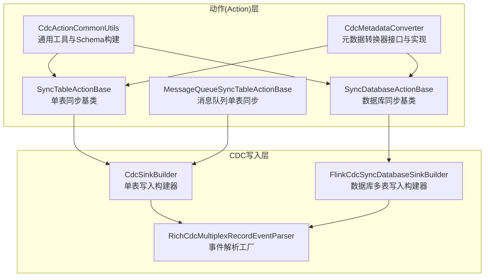
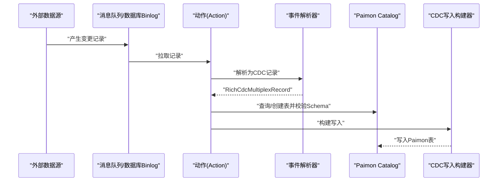
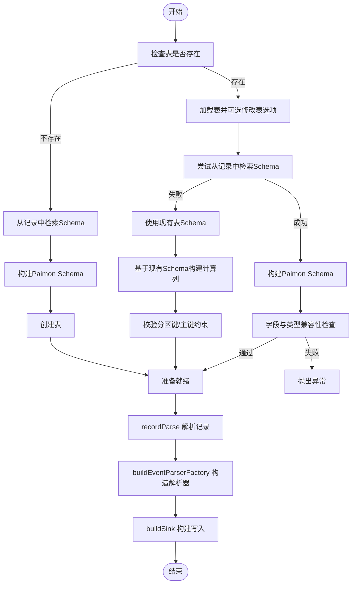
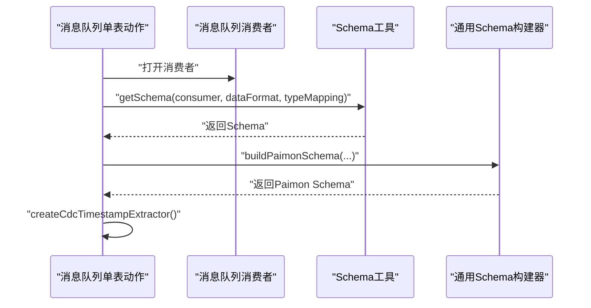
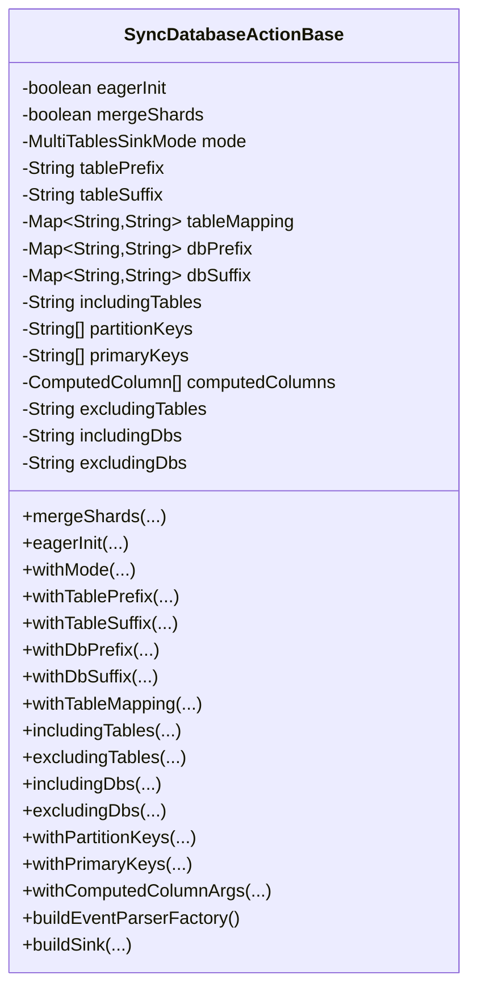
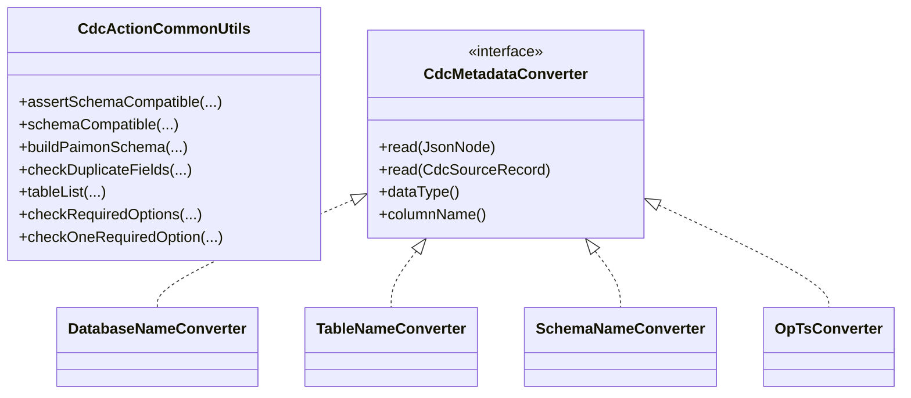
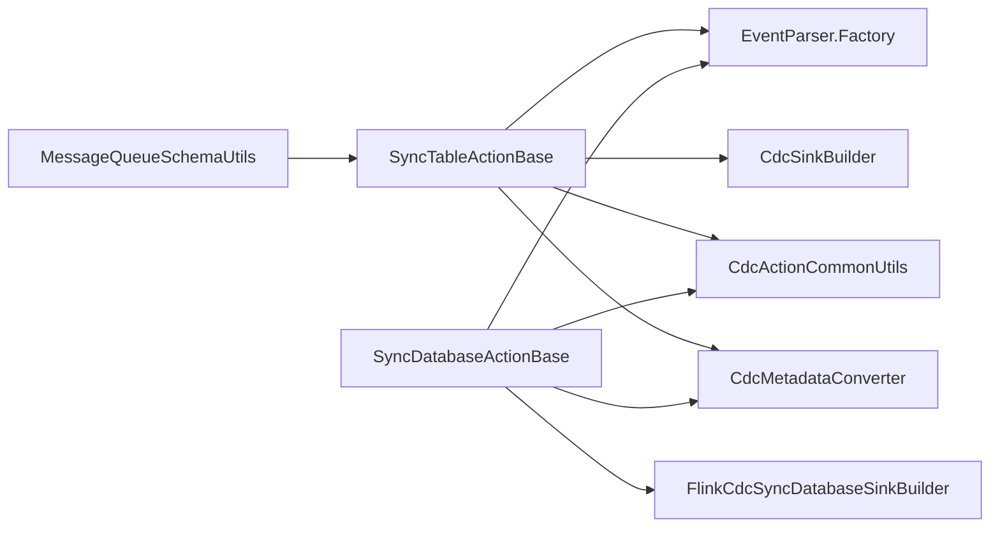

# Flink CDC

<cite>
**本文引用的文件**
- [flink-cdc.md](file://docs/content/cdc-ingestion/flink-cdc.md)
- [CdcActionCommonUtils.java](file://paimon-flink/paimon-flink-cdc/src/main/java/org/apache/paimon/flink/action/cdc/CdcActionCommonUtils.java)
- [CdcMetadataConverter.java](file://paimon-flink/paimon-flink-cdc/src/main/java/org/apache/paimon/flink/action/cdc/CdcMetadataConverter.java)
- [SyncDatabaseActionBase.java](file://paimon-flink/paimon-flink-cdc/src/main/java/org/apache/paimon/flink/action/cdc/SyncDatabaseActionBase.java)
- [MessageQueueSyncTableActionBase.java](file://paimon-flink/paimon-flink-cdc/src/main/java/org/apache/paimon/flink/action/cdc/MessageQueueSyncTableActionBase.java)
- [SyncTableActionBase.java](file://paimon-flink/paimon-flink-cdc/src/main/java/org/apache/paimon/flink/action/cdc/SyncTableActionBase.java)
- [MessageQueueSchemaUtils.java](file://paimon-flink/paimon-flink-cdc/src/main/java/org/apache/paimon/flink/action/cdc/MessageQueueSchemaUtils.java)
</cite>

## 目录
1. [简介](#简介)
2. [项目结构](#项目结构)
3. [核心组件](#核心组件)
4. [架构总览](#架构总览)
5. [详细组件分析](#详细组件分析)
6. [依赖分析](#依赖分析)
7. [性能考虑](#性能考虑)
8. [故障排除指南](#故障排除指南)
9. [结论](#结论)
10. [附录](#附录)

## 简介
本文件面向希望在Apache Paimon中使用Flink CDC进行数据同步与变更捕获（CDC）的用户与开发者。文档聚焦于：
- Flink CDC在Paimon中的集成方式与工作原理
- 基于DataStream的CDC同步任务构建流程
- 程序化API的使用方法与关键配置项
- 数据源配置、转换逻辑、类型映射、元数据列、计算列、分区键与主键策略
- 与Paimon表的写入集成、多表模式、表过滤与自动建表/兼容性检查
- 高级特性：窗口处理、状态管理、容错与重试策略
- 实战示例与最佳实践、性能优化建议与常见问题排查

## 项目结构
围绕Flink CDC与Paimon的集成，核心代码位于paimon-flink模块下的paimon-flink-cdc子目录，主要由“动作(Action)”层与“CDC写入”层组成：
- 动作(Action)层：负责从外部数据源读取变更记录，解析为统一的CDC记录，按数据库或单表模式构建Sink，完成Schema推断、兼容性校验与自动建表。
- CDC写入层：将CDC记录转换为Paimon写入操作，支持追加写、动态分桶、固定分桶、多表复用等。

图表来源
- [SyncTableActionBase.java:1-217](file://paimon-flink/paimon-flink-cdc/src/main/java/org/apache/paimon/flink/action/cdc/SyncTableActionBase.java#L1-L217)
- [MessageQueueSyncTableActionBase.java:1-93](file://paimon-flink/paimon-flink-cdc/src/main/java/org/apache/paimon/flink/action/cdc/MessageQueueSyncTableActionBase.java#L1-L93)
- [SyncDatabaseActionBase.java:1-273](file://paimon-flink/paimon-flink-cdc/src/main/java/org/apache/paimon/flink/action/cdc/SyncDatabaseActionBase.java#L1-L273)
- [CdcActionCommonUtils.java:1-344](file://paimon-flink/paimon-flink-cdc/src/main/java/org/apache/paimon/flink/action/cdc/CdcActionCommonUtils.java#L1-L344)
- [CdcMetadataConverter.java:1-147](file://paimon-flink/paimon-flink-cdc/src/main/java/org/apache/paimon/flink/action/cdc/CdcMetadataConverter.java#L1-L147)

章节来源
- [flink-cdc.md:1-172](file://docs/content/cdc-ingestion/flink-cdc.md#L1-L172)

## 核心组件
- 单表同步基类：负责单表Schema推断、兼容性检查、自动建表、解析与写入。
- 消息队列单表同步基类：基于消息队列Schema工具读取Schema，支持有限的类型演进。
- 数据库同步基类：支持多表模式（合并/拆分），表名前缀/后缀、白名单/黑名单、分区键/主键策略、表过滤。
- 通用工具：字段大小写处理、Schema兼容性检查、表名正则匹配、配置校验、主键/分区键设置。
- 元数据转换器：从CDC源记录中提取数据库名、表名、Schema名、操作时间戳等元信息。
- 写入构建器：将解析后的CDC记录写入Paimon表，支持并行度配置与类型映射。

章节来源
- [SyncTableActionBase.java:1-217](file://paimon-flink/paimon-flink-cdc/src/main/java/org/apache/paimon/flink/action/cdc/SyncTableActionBase.java#L1-L217)
- [MessageQueueSyncTableActionBase.java:1-93](file://paimon-flink/paimon-flink-cdc/src/main/java/org/apache/paimon/flink/action/cdc/MessageQueueSyncTableActionBase.java#L1-L93)
- [SyncDatabaseActionBase.java:1-273](file://paimon-flink/paimon-flink-cdc/src/main/java/org/apache/paimon/flink/action/cdc/SyncDatabaseActionBase.java#L1-L273)
- [CdcActionCommonUtils.java:1-344](file://paimon-flink/paimon-flink-cdc/src/main/java/org/apache/paimon/flink/action/cdc/CdcActionCommonUtils.java#L1-L344)
- [CdcMetadataConverter.java:1-147](file://paimon-flink/paimon-flink-cdc/src/main/java/org/apache/paimon/flink/action/cdc/CdcMetadataConverter.java#L1-L147)

## 架构总览
下图展示了从外部数据源到Paimon表的端到端CDC同步路径，涵盖Schema推断、记录解析、事件过滤与写入阶段。

图表来源
- [SyncTableActionBase.java:114-179](file://paimon-flink/paimon-flink-cdc/src/main/java/org/apache/paimon/flink/action/cdc/SyncTableActionBase.java#L114-L179)
- [MessageQueueSyncTableActionBase.java:64-91](file://paimon-flink/paimon-flink-cdc/src/main/java/org/apache/paimon/flink/action/cdc/MessageQueueSyncTableActionBase.java#L64-L91)
- [SyncDatabaseActionBase.java:196-271](file://paimon-flink/paimon-flink-cdc/src/main/java/org/apache/paimon/flink/action/cdc/SyncDatabaseActionBase.java#L196-L271)

## 详细组件分析

### 组件A：单表同步（SyncTableActionBase）
- 职责
  - 在构建前尝试获取或创建目标Paimon表，推断Schema并执行字段与类型兼容性检查。
  - 支持计算列、元数据列、分区键、主键等配置；若表已存在且无法推断Schema，则以现有Schema为准并校验约束。
  - 将CDC记录解析为统一格式并写入Paimon表，支持通过表配置设置Sink并行度。
- 关键流程
  - beforeBuildingSourceSink：根据是否存在表决定Schema推断或兼容性检查路径。
  - recordParse：提供记录解析函数。
  - buildEventParserFactory：构造事件解析工厂。
  - buildSink：构建并执行写入。

图表来源
- [SyncTableActionBase.java:114-179](file://paimon-flink/paimon-flink-cdc/src/main/java/org/apache/paimon/flink/action/cdc/SyncTableActionBase.java#L114-L179)

章节来源
- [SyncTableActionBase.java:1-217](file://paimon-flink/paimon-flink-cdc/src/main/java/org/apache/paimon/flink/action/cdc/SyncTableActionBase.java#L1-L217)

### 组件B：消息队列单表同步（MessageQueueSyncTableActionBase）
- 职责
  - 通过消息队列Schema工具从Topic消费样例记录，推断Schema。
  - 提供CDC时间戳提取器，支持消息队列语义的时间推进。
- 关键流程
  - retrieveSchema：打开消费者并调用Schema工具获取Schema。
  - createCdcTimestampExtractor：返回消息队列专用的时间戳提取器。
  - buildPaimonSchema：委托通用工具构建Schema。

图表来源
- [MessageQueueSyncTableActionBase.java:64-91](file://paimon-flink/paimon-flink-cdc/src/main/java/org/apache/paimon/flink/action/cdc/MessageQueueSyncTableActionBase.java#L64-L91)
- [MessageQueueSchemaUtils.java:56-89](file://paimon-flink/paimon-flink-cdc/src/main/java/org/apache/paimon/flink/action/cdc/MessageQueueSchemaUtils.java#L56-L89)

章节来源
- [MessageQueueSyncTableActionBase.java:1-93](file://paimon-flink/paimon-flink-cdc/src/main/java/org/apache/paimon/flink/action/cdc/MessageQueueSyncTableActionBase.java#L1-L93)
- [MessageQueueSchemaUtils.java:1-107](file://paimon-flink/paimon-flink-cdc/src/main/java/org/apache/paimon/flink/action/cdc/MessageQueueSchemaUtils.java#L1-L107)

### 组件C：数据库同步（SyncDatabaseActionBase）
- 职责
  - 支持多表模式（合并/拆分），提供表名前缀/后缀、映射、白名单/黑名单、分区键/主键策略。
  - 构造事件解析工厂时，结合数据库/表的包含/排除规则与表名转换器。
  - 通过数据库写入构建器将记录写入多个Paimon表。
- 关键流程
  - withXxx系列配置：设置表/库前缀/后缀、映射、包含/排除规则、分区键/主键、计算列等。
  - buildEventParserFactory：构造RichCdcMultiplexRecordEventParser。
  - buildSink：使用FlinkCdcSyncDatabaseSinkBuilder构建数据库级写入。

图表来源
- [SyncDatabaseActionBase.java:50-273](file://paimon-flink/paimon-flink-cdc/src/main/java/org/apache/paimon/flink/action/cdc/SyncDatabaseActionBase.java#L50-L273)

章节来源
- [SyncDatabaseActionBase.java:1-273](file://paimon-flink/paimon-flink-cdc/src/main/java/org/apache/paimon/flink/action/cdc/SyncDatabaseActionBase.java#L1-L273)

### 组件D：通用工具与元数据转换（CdcActionCommonUtils、CdcMetadataConverter）
- CdcActionCommonUtils
  - 字段大小写处理、Schema兼容性检查、重复字段检测。
  - 构建Paimon Schema：合并源Schema、计算列、元数据列；设置主键/分区键；严格/宽松校验策略。
  - 表名列表生成：根据多表模式生成正则表达式以监控表集合。
  - 配置校验：要求必须提供的选项与互斥选项。
- CdcMetadataConverter
  - 定义元数据转换接口，默认不支持从记录读取，具体实现提供数据库名、表名、Schema名、操作时间戳等转换。

图表来源
- [CdcActionCommonUtils.java:77-184](file://paimon-flink/paimon-flink-cdc/src/main/java/org/apache/paimon/flink/action/cdc/CdcActionCommonUtils.java#L77-L184)
- [CdcMetadataConverter.java:40-146](file://paimon-flink/paimon-flink-cdc/src/main/java/org/apache/paimon/flink/action/cdc/CdcMetadataConverter.java#L40-L146)

章节来源
- [CdcActionCommonUtils.java:1-344](file://paimon-flink/paimon-flink-cdc/src/main/java/org/apache/paimon/flink/action/cdc/CdcActionCommonUtils.java#L1-L344)
- [CdcMetadataConverter.java:1-147](file://paimon-flink/paimon-flink-cdc/src/main/java/org/apache/paimon/flink/action/cdc/CdcMetadataConverter.java#L1-L147)

## 依赖分析
- 组件耦合
  - 单表/数据库动作均依赖事件解析器工厂与写入构建器，解耦了数据源与写入细节。
  - 通用工具被动作层广泛使用，承担Schema构建与校验职责，提升复用性。
  - 元数据转换器作为扩展点，允许不同源提供不同的元信息。
- 外部依赖
  - 消息队列Schema工具依赖消费者包装器与数据格式解析器，用于从Topic中抽取Schema。
  - 写入层依赖Paimon Catalog与FileStoreTable，确保表存在与Schema一致性。

图表来源
- [SyncTableActionBase.java:151-179](file://paimon-flink/paimon-flink-cdc/src/main/java/org/apache/paimon/flink/action/cdc/SyncTableActionBase.java#L151-L179)
- [SyncDatabaseActionBase.java:242-271](file://paimon-flink/paimon-flink-cdc/src/main/java/org/apache/paimon/flink/action/cdc/SyncDatabaseActionBase.java#L242-L271)
- [MessageQueueSchemaUtils.java:34-107](file://paimon-flink/paimon-flink-cdc/src/main/java/org/apache/paimon/flink/action/cdc/MessageQueueSchemaUtils.java#L34-L107)
- [CdcActionCommonUtils.java:118-184](file://paimon-flink/paimon-flink-cdc/src/main/java/org/apache/paimon/flink/action/cdc/CdcActionCommonUtils.java#L118-L184)
- [CdcMetadataConverter.java:40-146](file://paimon-flink/paimon-flink-cdc/src/main/java/org/apache/paimon/flink/action/cdc/CdcMetadataConverter.java#L40-L146)

## 性能考虑
- 并行度与分桶
  - 通过表配置设置Sink并行度，平衡背压与吞吐。
  - 使用动态/固定分桶策略，结合分区键与主键，提升写入与查询效率。
- 数据倾斜与监控
  - 不同表数据量差异可能导致倾斜，应合理设置并行度与分区键。
  - 对于持续发现新表的场景，注意监控间隔与增量快照的等待时间。
- 类型映射与Schema演进
  - 合理配置类型映射，避免频繁Schema变更导致的写入失败。
  - 仅支持有限的类型演进（如字符串长度扩大、整型范围扩大等），尽量在设计阶段确定Schema。
- 计算列与元数据列
  - 计算列与元数据列会增加解析与写入成本，建议在必要时启用并控制数量。

[本节为通用指导，无需列出章节来源]

## 故障排除指南
- 无法推断Schema
  - 消息队列场景下，若多次轮询仍无法获取Schema，需检查Topic是否为空或配置是否正确；可先手动创建Paimon表再运行作业。
- 主键/分区键不一致
  - 若指定的主键/分区键与现有表不一致，将触发状态校验失败；请移除参数或重建表。
- 表名/库名匹配问题
  - 多表模式下，包含/排除规则与表名转换器组合可能影响监控范围，建议先验证正则表达式。
- 类型不兼容
  - 当源Schema与Paimon表Schema不兼容时，需调整类型映射或重建表。
- 元数据列冲突
  - 计算列、元数据列与源字段重复会导致重复字段错误，需检查命名与大小写策略。

章节来源
- [MessageQueueSchemaUtils.java:76-89](file://paimon-flink/paimon-flink-cdc/src/main/java/org/apache/paimon/flink/action/cdc/MessageQueueSchemaUtils.java#L76-L89)
- [SyncTableActionBase.java:181-203](file://paimon-flink/paimon-flink-cdc/src/main/java/org/apache/paimon/flink/action/cdc/SyncTableActionBase.java#L181-L203)
- [CdcActionCommonUtils.java:252-262](file://paimon-flink/paimon-flink-cdc/src/main/java/org/apache/paimon/flink/action/cdc/CdcActionCommonUtils.java#L252-L262)

## 结论
Paimon Flink CDC通过“动作(Action)”层抽象外部数据源接入与Schema管理，借助“CDC写入”层实现对Paimon表的高效写入。该体系支持单表与多表同步、计算列与元数据列、有限的Schema演进以及灵活的表名与过滤策略。配合合理的并行度、分区键与类型映射，可在保证一致性的同时获得良好的吞吐表现。

[本节为总结性内容，无需列出章节来源]

## 附录

### A. 程序化API使用要点
- 单表同步
  - 选择消息队列单表动作基类，提供Catalog配置与消息队列配置，设置计算列、元数据列、分区键、主键等。
  - 在beforeBuildingSourceSink阶段完成Schema推断与兼容性检查，随后构建写入。
- 数据库同步
  - 选择数据库同步基类，设置多表模式、表/库前缀/后缀、映射、包含/排除规则。
  - 构造事件解析工厂与数据库写入构建器，完成多表写入。

章节来源
- [SyncTableActionBase.java:114-179](file://paimon-flink/paimon-flink-cdc/src/main/java/org/apache/paimon/flink/action/cdc/SyncTableActionBase.java#L114-L179)
- [MessageQueueSyncTableActionBase.java:64-91](file://paimon-flink/paimon-flink-cdc/src/main/java/org/apache/paimon/flink/action/cdc/MessageQueueSyncTableActionBase.java#L64-L91)
- [SyncDatabaseActionBase.java:196-271](file://paimon-flink/paimon-flink-cdc/src/main/java/org/apache/paimon/flink/action/cdc/SyncDatabaseActionBase.java#L196-L271)

### B. 配置选项与参数
- 通用配置
  - 必填项校验与互斥项校验：确保关键参数唯一且完整。
  - 大小写敏感与严格校验：影响字段名与约束的比较行为。
- 表/库前缀/后缀与映射
  - 通过前缀/后缀与映射改变目标表名，便于多租户或多源聚合。
- 包含/排除规则
  - 支持正则表达式匹配，结合数据库/表级别规则控制监控范围。
- 分区键/主键
  - 可从源Schema同步，或显式指定；严格/宽松策略影响错误抛出与默认行为。
- 计算列与元数据列
  - 计算列基于表达式生成；元数据列从CDC源记录中提取，如数据库名、表名、操作时间戳等。

章节来源
- [CdcActionCommonUtils.java:322-342](file://paimon-flink/paimon-flink-cdc/src/main/java/org/apache/paimon/flink/action/cdc/CdcActionCommonUtils.java#L322-L342)
- [CdcActionCommonUtils.java:186-250](file://paimon-flink/paimon-flink-cdc/src/main/java/org/apache/paimon/flink/action/cdc/CdcActionCommonUtils.java#L186-L250)
- [CdcMetadataConverter.java:61-146](file://paimon-flink/paimon-flink-cdc/src/main/java/org/apache/paimon/flink/action/cdc/CdcMetadataConverter.java#L61-L146)

### C. 数据类型映射与兼容性
- 文档提供了Paimon与CDC类型的映射参考，用于在Schema构建与兼容性检查时进行类型转换判断。
- 若类型不可转换，需调整类型映射或重建表。

章节来源
- [flink-cdc.md:91-170](file://docs/content/cdc-ingestion/flink-cdc.md#L91-L170)

### D. 最佳实践
- 设计阶段明确主键与分区键，减少后续Schema变更。
- 合理设置并行度与分桶策略，避免热点与倾斜。
- 使用计算列与元数据列增强可观测性与派生能力，但要控制复杂度。
- 对多表场景使用包含/排除规则与表名转换器，确保监控范围可控。
- 在生产环境启用严格的Schema兼容性检查与必要的重试策略。

[本节为通用指导，无需列出章节来源]