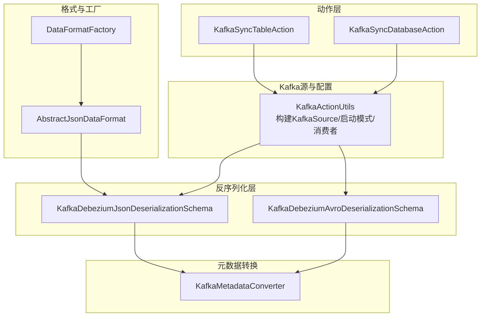
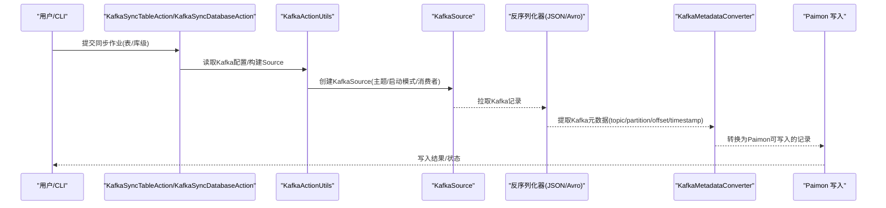
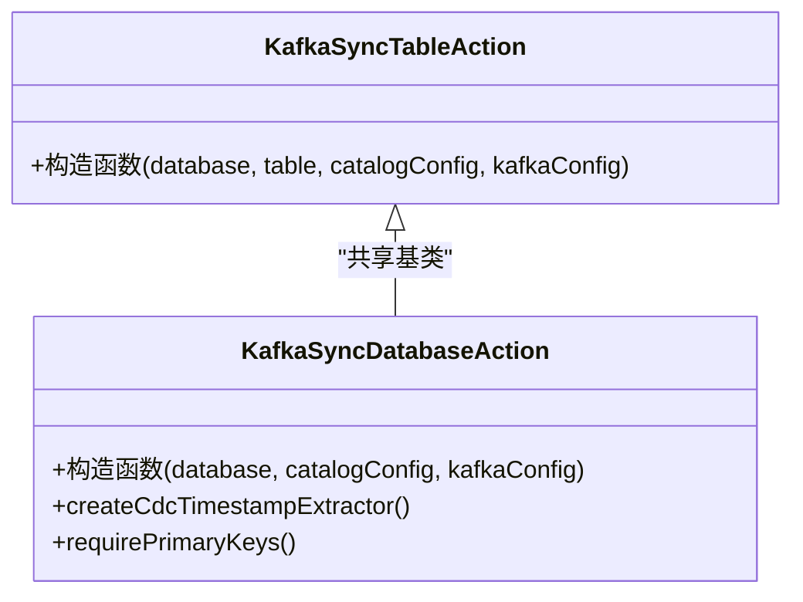
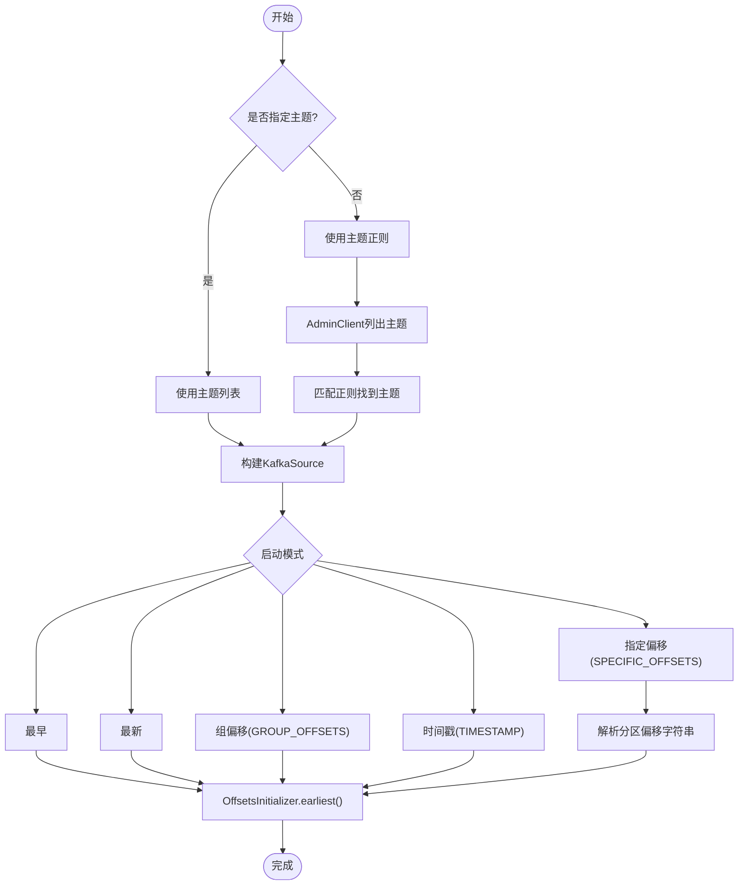
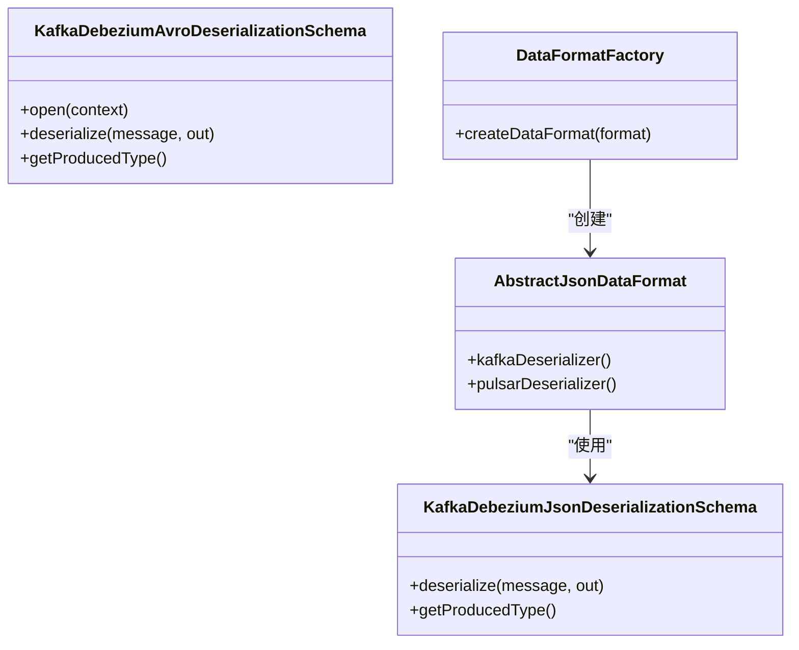
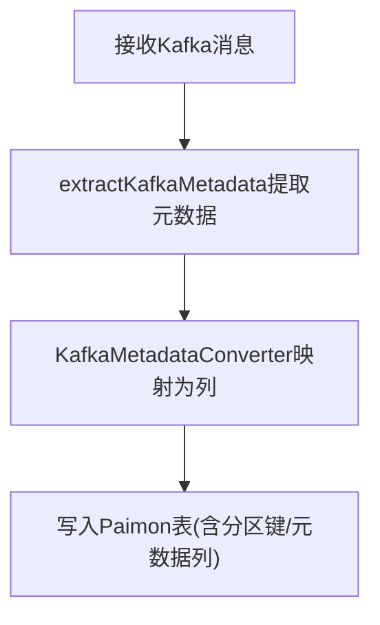
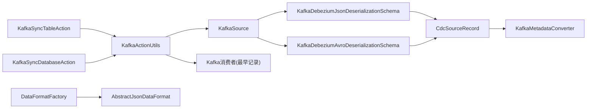

# Kafka CDC

<cite>
**本文引用的文件**   
- [kafka-cdc.md](file://docs/content/cdc-ingestion/kafka-cdc.md)
- [KafkaSyncTableAction.java](file://paimon-flink/paimon-flink-cdc/src/main/java/org/apache/paimon/flink/action/cdc/kafka/KafkaSyncTableAction.java)
- [KafkaSyncDatabaseAction.java](file://paimon-flink/paimon-flink-cdc/src/main/java/org/apache/paimon/flink/action/cdc/kafka/KafkaSyncDatabaseAction.java)
- [KafkaActionUtils.java](file://paimon-flink/paimon-flink-cdc/src/main/java/org/apache/paimon/flink/action/cdc/kafka/KafkaActionUtils.java)
- [KafkaDebeziumJsonDeserializationSchema.java](file://paimon-flink/paimon-flink-cdc/src/main/java/org/apache/paimon/flink/action/cdc/kafka/KafkaDebeziumJsonDeserializationSchema.java)
- [KafkaDebeziumAvroDeserializationSchema.java](file://paimon-flink/paimon-flink-cdc/src/main/java/org/apache/paimon/flink/action/cdc/kafka/KafkaDebeziumAvroDeserializationSchema.java)
- [KafkaMetadataConverter.java](file://paimon-flink/paimon-flink-cdc/src/main/java/org/apache/paimon/flink/action/cdc/kafka/KafkaMetadataConverter.java)
- [AbstractJsonDataFormat.java](file://paimon-flink/paimon-flink-cdc/src/main/java/org/apache/paimon/flink/action/cdc/format/AbstractJsonDataFormat.java)
- [DataFormatFactory.java](file://paimon-flink/paimon-flink-cdc/src/main/java/org/apache/paimon/flink/action/cdc/format/DataFormatFactory.java)
</cite>

## 目录
1. [简介](#简介)
2. [项目结构](#项目结构)
3. [核心组件](#核心组件)
4. [架构总览](#架构总览)
5. [详细组件分析](#详细组件分析)
6. [依赖分析](#依赖分析)
7. [性能考虑](#性能考虑)
8. [故障排除指南](#故障排除指南)
9. [结论](#结论)
10. [附录：完整配置参数与示例](#附录完整配置参数与示例)

## 简介
本文件系统性阐述 Apache Paimon 的 Kafka CDC 集成方案，覆盖从 Kafka 主题到 Paimon 表的数据流处理机制、表级与库级同步策略、消息格式与 schema evolution 处理、元数据提取与分区策略、容错与重试策略，以及完整的配置参数说明与性能调优建议。内容基于仓库中的官方文档与核心实现代码进行提炼与整合，帮助读者快速理解并落地 Kafka CDC 同步。

## 项目结构
围绕 Kafka CDC 的实现，主要涉及以下模块与文件：
- 动作入口：KafkaSyncTableAction、KafkaSyncDatabaseAction
- Kafka 源构建与启动模式：KafkaActionUtils
- 消息反序列化：KafkaDebeziumJsonDeserializationSchema、KafkaDebeziumAvroDeserializationSchema
- 元数据转换：KafkaMetadataConverter
- 格式工厂与抽象：AbstractJsonDataFormat、DataFormatFactory
- 官方文档：docs/content/cdc-ingestion/kafka-cdc.md

**图表来源**
- [KafkaSyncTableAction.java:27-36](file://paimon-flink/paimon-flink-cdc/src/main/java/org/apache/paimon/flink/action/cdc/kafka/KafkaSyncTableAction.java#L27-L36)
- [KafkaSyncDatabaseAction.java:29-45](file://paimon-flink/paimon-flink-cdc/src/main/java/org/apache/paimon/flink/action/cdc/kafka/KafkaSyncDatabaseAction.java#L29-L45)
- [KafkaActionUtils.java:73-143](file://paimon-flink/paimon-flink-cdc/src/main/java/org/apache/paimon/flink/action/cdc/kafka/KafkaActionUtils.java#L73-L143)
- [KafkaDebeziumJsonDeserializationSchema.java:41-96](file://paimon-flink/paimon-flink-cdc/src/main/java/org/apache/paimon/flink/action/cdc/kafka/KafkaDebeziumJsonDeserializationSchema.java#L41-L96)
- [KafkaDebeziumAvroDeserializationSchema.java:39-96](file://paimon-flink/paimon-flink-cdc/src/main/java/org/apache/paimon/flink/action/cdc/kafka/KafkaDebeziumAvroDeserializationSchema.java#L39-L96)
- [AbstractJsonDataFormat.java:35-47](file://paimon-flink/paimon-flink-cdc/src/main/java/org/apache/paimon/flink/action/cdc/format/AbstractJsonDataFormat.java#L35-L47)
- [DataFormatFactory.java:26-45](file://paimon-flink/paimon-flink-cdc/src/main/java/org/apache/paimon/flink/action/cdc/format/DataFormatFactory.java#L26-L45)
- [KafkaMetadataConverter.java:32-137](file://paimon-flink/paimon-flink-cdc/src/main/java/org/apache/paimon/flink/action/cdc/kafka/KafkaMetadataConverter.java#L32-L137)

**章节来源**
- [kafka-cdc.md:29-88](file://docs/content/cdc-ingestion/kafka-cdc.md#L29-L88)
- [KafkaSyncTableAction.java:27-36](file://paimon-flink/paimon-flink-cdc/src/main/java/org/apache/paimon/flink/action/cdc/kafka/KafkaSyncTableAction.java#L27-L36)
- [KafkaSyncDatabaseAction.java:29-45](file://paimon-flink/paimon-flink-cdc/src/main/java/org/apache/paimon/flink/action/cdc/kafka/KafkaSyncDatabaseAction.java#L29-L45)

## 核心组件
- KafkaSyncTableAction：封装表级同步动作，继承自通用的消息队列同步基类，指定数据源类型为 KAFKA。
- KafkaSyncDatabaseAction：封装库级同步动作，支持多主题/单主题聚合写入，指定数据源类型为 KAFKA；同时提供时间戳提取器与主键要求策略。
- KafkaActionUtils：负责构建 KafkaSource、解析启动模式（最早/最新/组偏移/GROUP_OFFSETS/指定偏移/TIMESTAMP）、构造消费者以获取最早记录、抽取 Kafka 元数据（topic/partition/offset/timestamp）。
- 反序列化器：
  - KafkaDebeziumJsonDeserializationSchema：针对 Debezium/Canal/Ogg/Maxwell/Normal JSON 等 JSON 格式，将 Kafka 记录反序列化为 CDC 源记录。
  - KafkaDebeziumAvroDeserializationSchema：针对 Debezium Avro 格式，结合 Confluent Schema Registry 进行反序列化。
- 元数据转换：KafkaMetadataConverter 提供 topic、partition、offset、timestamp、timestamp_type 等字段的提取与类型映射。
- 格式工厂与抽象：AbstractJsonDataFormat 统一 JSON 类格式的 Kafka 反序列化器选择；DataFormatFactory 基于格式标识动态发现工厂并创建对应 DataFormat 实例。

**章节来源**
- [KafkaSyncTableAction.java:27-36](file://paimon-flink/paimon-flink-cdc/src/main/java/org/apache/paimon/flink/action/cdc/kafka/KafkaSyncTableAction.java#L27-L36)
- [KafkaSyncDatabaseAction.java:29-45](file://paimon-flink/paimon-flink-cdc/src/main/java/org/apache/paimon/flink/action/cdc/kafka/KafkaSyncDatabaseAction.java#L29-L45)
- [KafkaActionUtils.java:73-143](file://paimon-flink/paimon-flink-cdc/src/main/java/org/apache/paimon/flink/action/cdc/kafka/KafkaActionUtils.java#L73-L143)
- [KafkaDebeziumJsonDeserializationSchema.java:41-96](file://paimon-flink/paimon-flink-cdc/src/main/java/org/apache/paimon/flink/action/cdc/kafka/KafkaDebeziumJsonDeserializationSchema.java#L41-L96)
- [KafkaDebeziumAvroDeserializationSchema.java:39-96](file://paimon-flink/paimon-flink-cdc/src/main/java/org/apache/paimon/flink/action/cdc/kafka/KafkaDebeziumAvroDeserializationSchema.java#L39-L96)
- [KafkaMetadataConverter.java:32-137](file://paimon-flink/paimon-flink-cdc/src/main/java/org/apache/paimon/flink/action/cdc/kafka/KafkaMetadataConverter.java#L32-L137)
- [AbstractJsonDataFormat.java:35-47](file://paimon-flink/paimon-flink-cdc/src/main/java/org/apache/paimon/flink/action/cdc/format/AbstractJsonDataFormat.java#L35-L47)
- [DataFormatFactory.java:26-45](file://paimon-flink/paimon-flink-cdc/src/main/java/org/apache/paimon/flink/action/cdc/format/DataFormatFactory.java#L26-L45)

## 架构总览
下图展示从 Kafka 到 Paimon 的端到端数据流：KafkaSyncTableAction/KafkaSyncDatabaseAction 通过 KafkaActionUtils 构建 KafkaSource，使用反序列化器将 Kafka 消息转为 CDC 源记录，再经由元数据转换与格式工厂完成 schema 解析与写入。

**图表来源**
- [KafkaSyncTableAction.java:27-36](file://paimon-flink/paimon-flink-cdc/src/main/java/org/apache/paimon/flink/action/cdc/kafka/KafkaSyncTableAction.java#L27-L36)
- [KafkaSyncDatabaseAction.java:29-45](file://paimon-flink/paimon-flink-cdc/src/main/java/org/apache/paimon/flink/action/cdc/kafka/KafkaSyncDatabaseAction.java#L29-L45)
- [KafkaActionUtils.java:73-143](file://paimon-flink/paimon-flink-cdc/src/main/java/org/apache/paimon/flink/action/cdc/kafka/KafkaActionUtils.java#L73-L143)
- [KafkaDebeziumJsonDeserializationSchema.java:61-89](file://paimon-flink/paimon-flink-cdc/src/main/java/org/apache/paimon/flink/action/cdc/kafka/KafkaDebeziumJsonDeserializationSchema.java#L61-L89)
- [KafkaDebeziumAvroDeserializationSchema.java:60-85](file://paimon-flink/paimon-flink-cdc/src/main/java/org/apache/paimon/flink/action/cdc/kafka/KafkaDebeziumAvroDeserializationSchema.java#L60-L85)
- [KafkaMetadataConverter.java:54-74](file://paimon-flink/paimon-flink-cdc/src/main/java/org/apache/paimon/flink/action/cdc/kafka/KafkaMetadataConverter.java#L54-L74)

## 详细组件分析

### 表级同步与库级同步
- 表级同步（KafkaSyncTableAction）
  - 将一个或多个 Kafka 主题的变更事件写入单个 Paimon 表。
  - 支持自动建表与 schema 推断，若目标表已存在则进行 schema 对比与演进。
- 库级同步（KafkaSyncDatabaseAction）
  - 将多主题/单主题的变更事件写入同一 Paimon 数据库下的多个表。
  - 使用统一的 Sink 写入，按表映射规则创建或更新目标表。
  - 提供时间戳提取器与主键要求策略（库级默认不要求主键）。

**图表来源**
- [KafkaSyncTableAction.java:27-36](file://paimon-flink/paimon-flink-cdc/src/main/java/org/apache/paimon/flink/action/cdc/kafka/KafkaSyncTableAction.java#L27-L36)
- [KafkaSyncDatabaseAction.java:29-45](file://paimon-flink/paimon-flink-cdc/src/main/java/org/apache/paimon/flink/action/cdc/kafka/KafkaSyncDatabaseAction.java#L29-L45)

**章节来源**
- [kafka-cdc.md:89-116](file://docs/content/cdc-ingestion/kafka-cdc.md#L89-L116)
- [kafka-cdc.md:195-233](file://docs/content/cdc-ingestion/kafka-cdc.md#L195-L233)

### Kafka 源构建与启动模式
- 主题选择：支持显式主题列表或正则匹配模式。
- 启动模式：EARLIEST/LATEST/GROUP_OFFSETS/SPECIFIC_OFFSETS/TIMESTAMP。
- 偏移初始化：根据启动模式设置 OffsetsInitializer；SPECIFIC_OFFSETS 支持按分区指定起始偏移。
- 消费者工具：提供“获取最早可用记录”的消费者包装器，用于在无历史消息时推断 schema。

**图表来源**
- [KafkaActionUtils.java:73-143](file://paimon-flink/paimon-flink-cdc/src/main/java/org/apache/paimon/flink/action/cdc/kafka/KafkaActionUtils.java#L73-L143)
- [KafkaActionUtils.java:196-233](file://paimon-flink/paimon-flink-cdc/src/main/java/org/apache/paimon/flink/action/cdc/kafka/KafkaActionUtils.java#L196-L233)
- [KafkaActionUtils.java:249-289](file://paimon-flink/paimon-flink-cdc/src/main/java/org/apache/paimon/flink/action/cdc/kafka/KafkaActionUtils.java#L249-L289)

**章节来源**
- [KafkaActionUtils.java:73-143](file://paimon-flink/paimon-flink-cdc/src/main/java/org/apache/paimon/flink/action/cdc/kafka/KafkaActionUtils.java#L73-L143)
- [KafkaActionUtils.java:196-233](file://paimon-flink/paimon-flink-cdc/src/main/java/org/apache/paimon/flink/action/cdc/kafka/KafkaActionUtils.java#L196-L233)
- [KafkaActionUtils.java:249-289](file://paimon-flink/paimon-flink-cdc/src/main/java/org/apache/paimon/flink/action/cdc/kafka/KafkaActionUtils.java#L249-L289)

### 消息格式与反序列化
- JSON 格式：统一由 KafkaDebeziumJsonDeserializationSchema 反序列化，忽略无效 key，跳过墓碑消息，提取 Kafka 元数据。
- Avro 格式：KafkaDebeziumAvroDeserializationSchema 结合 Confluent Avro 反序列化器，需要配置 schema registry URL。
- 抽象 JSON 格式：AbstractJsonDataFormat 统一 JSON 类格式的 Kafka 反序列化器选择。
- 工厂模式：DataFormatFactory 基于 value.format 标识动态发现并创建对应格式实例。

**图表来源**
- [KafkaDebeziumJsonDeserializationSchema.java:41-96](file://paimon-flink/paimon-flink-cdc/src/main/java/org/apache/paimon/flink/action/cdc/kafka/KafkaDebeziumJsonDeserializationSchema.java#L41-L96)
- [KafkaDebeziumAvroDeserializationSchema.java:39-96](file://paimon-flink/paimon-flink-cdc/src/main/java/org/apache/paimon/flink/action/cdc/kafka/KafkaDebeziumAvroDeserializationSchema.java#L39-L96)
- [AbstractJsonDataFormat.java:35-47](file://paimon-flink/paimon-flink-cdc/src/main/java/org/apache/paimon/flink/action/cdc/format/AbstractJsonDataFormat.java#L35-L47)
- [DataFormatFactory.java:26-45](file://paimon-flink/paimon-flink-cdc/src/main/java/org/apache/paimon/flink/action/cdc/format/DataFormatFactory.java#L26-L45)

**章节来源**
- [kafka-cdc.md:35-87](file://docs/content/cdc-ingestion/kafka-cdc.md#L35-L87)
- [KafkaDebeziumJsonDeserializationSchema.java:61-89](file://paimon-flink/paimon-flink-cdc/src/main/java/org/apache/paimon/flink/action/cdc/kafka/KafkaDebeziumJsonDeserializationSchema.java#L61-L89)
- [KafkaDebeziumAvroDeserializationSchema.java:60-85](file://paimon-flink/paimon-flink-cdc/src/main/java/org/apache/paimon/flink/action/cdc/kafka/KafkaDebeziumAvroDeserializationSchema.java#L60-L85)
- [AbstractJsonDataFormat.java:35-47](file://paimon-flink/paimon-flink-cdc/src/main/java/org/apache/paimon/flink/action/cdc/format/AbstractJsonDataFormat.java#L35-L47)
- [DataFormatFactory.java:30-44](file://paimon-flink/paimon-flink-cdc/src/main/java/org/apache/paimon/flink/action/cdc/format/DataFormatFactory.java#L30-L44)

### 元数据提取与分区策略
- 元数据字段：topic、partition、offset、timestamp、timestamp_type，通过 KafkaMetadataConverter 提供读取与类型映射。
- 分区策略：KafkaSyncDatabaseAction 默认不要求主键；当使用库级同步时，可通过 computed_column 等方式定义分区键。
- 元数据列：支持通过 metadata_column 选项将 Kafka 元数据注入到表中，便于审计与排障。

**图表来源**
- [KafkaActionUtils.java:322-332](file://paimon-flink/paimon-flink-cdc/src/main/java/org/apache/paimon/flink/action/cdc/kafka/KafkaActionUtils.java#L322-L332)
- [KafkaMetadataConverter.java:39-137](file://paimon-flink/paimon-flink-cdc/src/main/java/org/apache/paimon/flink/action/cdc/kafka/KafkaMetadataConverter.java#L39-L137)

**章节来源**
- [KafkaActionUtils.java:322-332](file://paimon-flink/paimon-flink-cdc/src/main/java/org/apache/paimon/flink/action/cdc/kafka/KafkaActionUtils.java#L322-L332)
- [KafkaMetadataConverter.java:39-137](file://paimon-flink/paimon-flink-cdc/src/main/java/org/apache/paimon/flink/action/cdc/kafka/KafkaMetadataConverter.java#L39-L137)
- [kafka-cdc.md:275-297](file://docs/content/cdc-ingestion/kafka-cdc.md#L275-L297)

### schema evolution 与缺失字段处理
- 缺失字段类型：JSON 格式可能缺少字段类型，Paimon 会尝试从 debezium-json 的 schema 字段提取类型，否则退化为 STRING。
- 缺失数据库/表名：仅能做表级同步，无法做库级同步。
- 缺失主键：可能创建非主键表，可在提交作业时显式指定主键。
- 库级同步：当目标表存在且 schema 不一致时，尝试执行 schema 演进。

**章节来源**
- [kafka-cdc.md:77-87](file://docs/content/cdc-ingestion/kafka-cdc.md#L77-L87)
- [kafka-cdc.md:229-233](file://docs/content/cdc-ingestion/kafka-cdc.md#L229-L233)

## 依赖分析
- 组件耦合
  - KafkaSyncTableAction/KafkaSyncDatabaseAction 依赖 KafkaActionUtils 构建 KafkaSource 与消费者。
  - 反序列化器依赖 KafkaRecordDeserializationSchema 接口，统一输出 CdcSourceRecord。
  - 元数据转换器依赖 CdcSourceRecord 的元数据映射。
  - 格式工厂通过标识符动态发现具体格式实现，降低硬编码耦合。
- 外部依赖
  - Flink Kafka Connector、Confluent Avro、Jackson、Kafka AdminClient 等。

**图表来源**
- [KafkaSyncTableAction.java:27-36](file://paimon-flink/paimon-flink-cdc/src/main/java/org/apache/paimon/flink/action/cdc/kafka/KafkaSyncTableAction.java#L27-L36)
- [KafkaSyncDatabaseAction.java:29-45](file://paimon-flink/paimon-flink-cdc/src/main/java/org/apache/paimon/flink/action/cdc/kafka/KafkaSyncDatabaseAction.java#L29-L45)
- [KafkaActionUtils.java:73-143](file://paimon-flink/paimon-flink-cdc/src/main/java/org/apache/paimon/flink/action/cdc/kafka/KafkaActionUtils.java#L73-L143)
- [KafkaDebeziumJsonDeserializationSchema.java:41-96](file://paimon-flink/paimon-flink-cdc/src/main/java/org/apache/paimon/flink/action/cdc/kafka/KafkaDebeziumJsonDeserializationSchema.java#L41-L96)
- [KafkaDebeziumAvroDeserializationSchema.java:39-96](file://paimon-flink/paimon-flink-cdc/src/main/java/org/apache/paimon/flink/action/cdc/kafka/KafkaDebeziumAvroDeserializationSchema.java#L39-L96)
- [KafkaMetadataConverter.java:39-137](file://paimon-flink/paimon-flink-cdc/src/main/java/org/apache/paimon/flink/action/cdc/kafka/KafkaMetadataConverter.java#L39-L137)
- [AbstractJsonDataFormat.java:35-47](file://paimon-flink/paimon-flink-cdc/src/main/java/org/apache/paimon/flink/action/cdc/format/AbstractJsonDataFormat.java#L35-L47)
- [DataFormatFactory.java:26-45](file://paimon-flink/paimon-flink-cdc/src/main/java/org/apache/paimon/flink/action/cdc/format/DataFormatFactory.java#L26-L45)

**章节来源**
- [KafkaSyncTableAction.java:27-36](file://paimon-flink/paimon-flink-cdc/src/main/java/org/apache/paimon/flink/action/cdc/kafka/KafkaSyncTableAction.java#L27-L36)
- [KafkaSyncDatabaseAction.java:29-45](file://paimon-flink/paimon-flink-cdc/src/main/java/org/apache/paimon/flink/action/cdc/kafka/KafkaSyncDatabaseAction.java#L29-L45)
- [KafkaActionUtils.java:73-143](file://paimon-flink/paimon-flink-cdc/src/main/java/org/apache/paimon/flink/action/cdc/kafka/KafkaActionUtils.java#L73-L143)
- [DataFormatFactory.java:30-44](file://paimon-flink/paimon-flink-cdc/src/main/java/org/apache/paimon/flink/action/cdc/format/DataFormatFactory.java#L30-L44)

## 性能考虑
- 并行度与吞吐
  - 通过 catalog_conf 或 table_conf 设置 sink 并行度，提升写入吞吐。
  - 合理设置 Kafka 消费超时与批大小，平衡延迟与吞吐。
- 偏移管理
  - 启动模式选择 EARLIEST/LATEST/TIMESTAMP/SPECIFIC_OFFSETS，避免重复消费或漏消费。
  - GROUP_OFFSETS 模式需关注 AUTO_OFFSET_RESET_CONFIG 的重置策略。
- schema 与序列化
  - Avro 格式配合 Schema Registry 可减少字段冗余，但需关注注册中心可用性。
  - JSON 格式简单易用，但需确保包含 schema 字段或提供类型映射策略。
- 元数据列
  - 开启 metadata_column 可增强可观测性，但会增加写入列数与存储开销。

[本节为通用建议，不直接分析具体文件]

## 故障排除指南
- 无法解析 JSON
  - 检查消息体是否为有效 JSON；无效 JSON 会被记录错误日志。
  - 若 key 非 JSON，将被忽略，不影响 value 的解析。
- 未找到主题或分区
  - 确认 topic 或 topic-pattern 正确；若使用正则，需确保 AdminClient 可访问 Kafka。
  - 当消费者无法获取分区信息时，会抛出异常提示检查配置。
- 缺失字段类型或主键
  - JSON 格式可能缺失类型，Paimon 会退化为 STRING；必要时在建表时显式指定类型。
  - 缺失主键可能导致非主键表，可在提交作业时指定主键。
- Avro 反序列化失败
  - 确保配置 schema.registry.url；首次反序列化时初始化 Confluent Avro 反序列化器。
- 偏移重置策略
  - GROUP_OFFSETS 模式下，AUTO_OFFSET_RESET_CONFIG 必须为允许值，否则抛出非法参数异常。

**章节来源**
- [KafkaDebeziumJsonDeserializationSchema.java:85-88](file://paimon-flink/paimon-flink-cdc/src/main/java/org/apache/paimon/flink/action/cdc/kafka/KafkaDebeziumJsonDeserializationSchema.java#L85-L88)
- [KafkaActionUtils.java:274-280](file://paimon-flink/paimon-flink-cdc/src/main/java/org/apache/paimon/flink/action/cdc/kafka/KafkaActionUtils.java#L274-L280)
- [KafkaActionUtils.java:168-183](file://paimon-flink/paimon-flink-cdc/src/main/java/org/apache/paimon/flink/action/cdc/kafka/KafkaActionUtils.java#L168-L183)
- [KafkaDebeziumAvroDeserializationSchema.java:92-94](file://paimon-flink/paimon-flink-cdc/src/main/java/org/apache/paimon/flink/action/cdc/kafka/KafkaDebeziumAvroDeserializationSchema.java#L92-L94)
- [kafka-cdc.md:77-87](file://docs/content/cdc-ingestion/kafka-cdc.md#L77-L87)

## 结论
Apache Paimon 的 Kafka CDC 集成通过明确的动作层、Kafka 源构建、反序列化与元数据转换，实现了从 Kafka 到 Paimon 的高效、可扩展的数据同步。表级与库级同步满足不同业务场景，JSON/Avro 多格式支持覆盖主流 CDC 工具链。借助 schema evolution、元数据列与灵活的启动模式，系统在可靠性与易用性之间取得良好平衡。

[本节为总结性内容，不直接分析具体文件]

## 附录：完整配置参数与示例

### 表级同步（kafka_sync_table）
- 关键参数
  - warehouse、database、table：目标仓库、数据库与表
  - partition_keys、primary_keys：分区键与主键
  - type_mapping：类型映射策略
  - computed_column：计算列表达式
  - metadata_column、metadata_column_prefix：元数据列与前缀
  - kafka_conf：Kafka 源配置（如 bootstrap.servers、group.id、topic、value.format 等）
  - catalog_conf：目录配置（如 metastore、uri 等）
  - table_conf：表级写入配置（如 bucket、changelog-producer、sink.parallelism 等）

- 示例
  - 表级同步（含分区键与计算列）
  - 仅 JSON 格式追加日志数据

**章节来源**
- [kafka-cdc.md:95-113](file://docs/content/cdc-ingestion/kafka-cdc.md#L95-L113)
- [kafka-cdc.md:117-194](file://docs/content/cdc-ingestion/kafka-cdc.md#L117-L194)

### 库级同步（kafka_sync_database）
- 关键参数
  - database：目标数据库
  - table_mapping：主题到表的映射
  - table_prefix、table_suffix：表名前后缀
  - table_prefix_db、table_suffix_db：按数据库设置表名前后缀
  - including_tables/excluding_tables、including_dbs/excluding_dbs：过滤规则
  - 其他同表级同步参数

- 示例
  - 单主题到库
  - 多主题到库

**章节来源**
- [kafka-cdc.md:201-225](file://docs/content/cdc-ingestion/kafka-cdc.md#L201-L225)
- [kafka-cdc.md:234-274](file://docs/content/cdc-ingestion/kafka-cdc.md#L234-L274)

### Kafka 源配置要点
- 主题与模式
  - topic 或 topic-pattern 二选一；topic 支持逗号分隔多主题。
- 启动模式
  - scan.startup.mode：EARLIEST_OFFSET/LATEST_OFFSET/GROUP_OFFSETS/SPECIFIC_OFFSETS/TIMESTAMP
  - GROUP_OFFSETS：需设置 AUTO_OFFSET_RESET_CONFIG
  - SPECIFIC_OFFSETS：格式为 partition:x,offset:y;...
- 消费者属性
  - properties.bootstrap.servers、properties.group.id 等
- Schema Registry（Avro）
  - schema.registry.url：配置 Confluent Schema Registry 地址

**章节来源**
- [kafka-cdc.md:275-297](file://docs/content/cdc-ingestion/kafka-cdc.md#L275-L297)
- [KafkaActionUtils.java:78-87](file://paimon-flink/paimon-flink-cdc/src/main/java/org/apache/paimon/flink/action/cdc/kafka/KafkaActionUtils.java#L78-L87)
- [KafkaActionUtils.java:95-138](file://paimon-flink/paimon-flink-cdc/src/main/java/org/apache/paimon/flink/action/cdc/kafka/KafkaActionUtils.java#L95-L138)
- [KafkaActionUtils.java:196-233](file://paimon-flink/paimon-flink-cdc/src/main/java/org/apache/paimon/flink/action/cdc/kafka/KafkaActionUtils.java#L196-L233)

### 消息格式与 schema evolution
- 支持格式
  - Canal JSON、Debezium JSON、Debezium Avro、Ogg JSON、Maxwell JSON、Normal JSON、aws-dms-json、debezium-bson
- schema evolution
  - JSON 缺失类型时退化为 STRING；缺失数据库/表名时仅支持表级同步；缺失主键时可能创建非主键表
- 特殊说明
  - debezium-bson 需要全量文档与更新前状态；MongoDB 6.0 之前需利用 Kafka Key 作为“更新前”信息

**章节来源**
- [kafka-cdc.md:35-87](file://docs/content/cdc-ingestion/kafka-cdc.md#L35-L87)
- [kafka-cdc.md:298-317](file://docs/content/cdc-ingestion/kafka-cdc.md#L298-L317)
- [kafka-cdc.md:318-384](file://docs/content/cdc-ingestion/kafka-cdc.md#L318-L384)

### 元数据列与分区策略
- 元数据列
  - 支持 topic、partition、offset、timestamp、timestamp_type 注入表中
- 分区策略
  - 库级默认不要求主键；可通过 computed_column 定义分区键

**章节来源**
- [KafkaActionUtils.java:322-332](file://paimon-flink/paimon-flink-cdc/src/main/java/org/apache/paimon/flink/action/cdc/kafka/KafkaActionUtils.java#L322-L332)
- [KafkaMetadataConverter.java:76-137](file://paimon-flink/paimon-flink-cdc/src/main/java/org/apache/paimon/flink/action/cdc/kafka/KafkaMetadataConverter.java#L76-L137)
- [KafkaSyncDatabaseAction.java:42-44](file://paimon-flink/paimon-flink-cdc/src/main/java/org/apache/paimon/flink/action/cdc/kafka/KafkaSyncDatabaseAction.java#L42-L44)