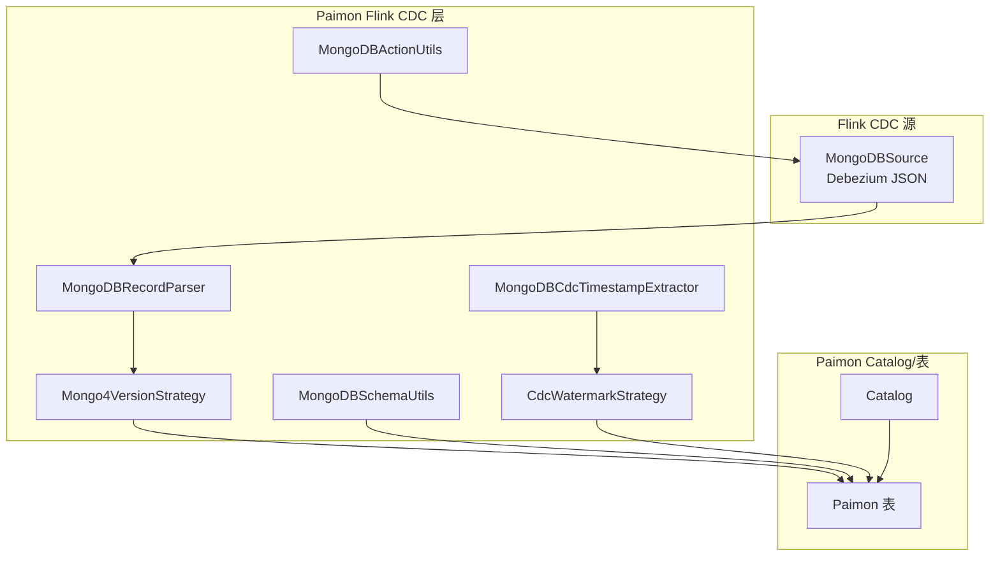
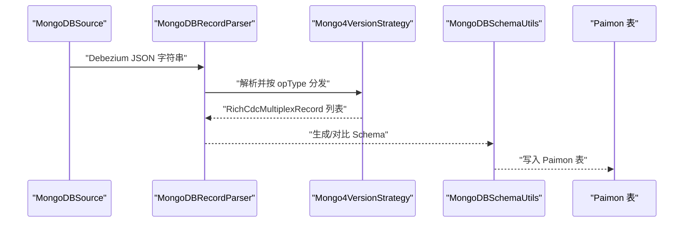
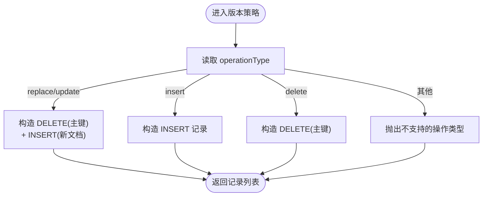
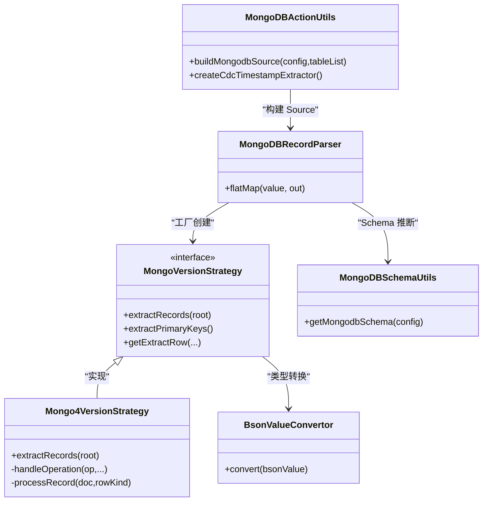

# MongoDB CDC

<cite>
**本文引用的文件**
- [mongo-cdc.md](file://docs/content/cdc-ingestion/mongo-cdc.md)
- [MongoDBSyncTableAction.java](file://paimon-flink/paimon-flink-cdc/src/main/java/org/apache/paimon/flink/action/cdc/mongodb/MongoDBSyncTableAction.java)
- [MongoDBSyncDatabaseAction.java](file://paimon-flink/paimon-flink-cdc/src/main/java/org/apache/paimon/flink/action/cdc/mongodb/MongoDBSyncDatabaseAction.java)
- [MongoDBActionUtils.java](file://paimon-flink/paimon-flink-cdc/src/main/java/org/apache/paimon/flink/action/cdc/mongodb/MongoDBActionUtils.java)
- [MongoDBSchemaUtils.java](file://paimon-flink/paimon-flink-cdc/src/main/java/org/apache/paimon/flink/action/cdc/mongodb/MongoDBSchemaUtils.java)
- [MongoDBRecordParser.java](file://paimon-flink/paimon-flink-cdc/src/main/java/org/apache/paimon/flink/action/cdc/mongodb/MongoDBRecordParser.java)
- [Mongo4VersionStrategy.java](file://paimon-flink/paimon-flink-cdc/src/main/java/org/apache/paimon/flink/action/cdc/mongodb/strategy/Mongo4VersionStrategy.java)
- [MongoVersionStrategy.java](file://paimon-flink/paimon-flink-cdc/src/main/java/org/apache/paimon/flink/action/cdc/mongodb/strategy/MongoVersionStrategy.java)
- [BsonValueConvertor.java](file://paimon-flink/paimon-flink-cdc/src/main/java/org/apache/paimon/flink/action/cdc/mongodb/BsonValueConvertor.java)
- [MongoDBCdcTimestampExtractor.java](file://paimon-flink/paimon-flink-cdc/src/main/java/org/apache/paimon/flink/action/cdc/mongodb/MongoDBCdcTimestampExtractor.java)
- [CdcWatermarkStrategy.java](file://paimon-flink/paimon-flink-cdc/src/main/java/org/apache/paimon/flink/action/cdc/watermark/CdcWatermarkStrategy.java)
- [MongoDBSchemaITCase.java](file://paimon-flink/paimon-flink-cdc/src/test/java/org/apache/paimon/flink/action/cdc/mongodb/MongoDBSchemaITCase.java)
- [MongoDBSyncTableActionITCase.java](file://paimon-flink/paimon-flink-cdc/src/test/java/org/apache/paimon/flink/action/cdc/mongodb/MongoDBSyncTableActionITCase.java)
</cite>

## 目录
1. [简介](#简介)
2. [项目结构](#项目结构)
3. [核心组件](#核心组件)
4. [架构总览](#架构总览)
5. [详细组件分析](#详细组件分析)
6. [依赖分析](#依赖分析)
7. [性能考虑](#性能考虑)
8. [故障排查指南](#故障排查指南)
9. [结论](#结论)
10. [附录](#附录)

## 简介
本文件系统化梳理 Apache Paimon 的 MongoDB CDC 集成实现，围绕以下目标展开：
- 深入解释 MongoDB CDC 的实现原理与 oplog（变更流）解析机制
- 详解“集合级同步”和“数据库级同步”两种模式的配置与使用
- 阐述 MongoDB 文档结构到关系表的映射关系及 schema evolution 处理
- 提供完整的配置参数说明（连接参数、数据库/集合过滤、字段映射等）
- 解释 MongoDB 特殊数据类型的转换与处理逻辑
- 说明增量同步策略与一致性保障
- 给出实际配置示例与性能优化建议，并提供常见问题与监控方法

## 项目结构
MongoDB CDC 功能主要位于 paimon-flink-cdc 模块中，核心代码组织如下：
- 同步动作：MongoDBSyncTableAction、MongoDBSyncDatabaseAction
- 工具与配置：MongoDBActionUtils、MongoDBSchemaUtils
- 记录解析与版本策略：MongoDBRecordParser、Mongo4VersionStrategy、MongoVersionStrategy
- 类型转换：BsonValueConvertor
- 时间水位：MongoDBCdcTimestampExtractor、CdcWatermarkStrategy
- 文档与示例：mongo-cdc.md 及相关 IT 测试用例

图表来源
- [MongoDBRecordParser.java:55-101](file://paimon-flink/paimon-flink-cdc/src/main/java/org/apache/paimon/flink/action/cdc/mongodb/MongoDBRecordParser.java#L55-L101)
- [Mongo4VersionStrategy.java:40-112](file://paimon-flink/paimon-flink-cdc/src/main/java/org/apache/paimon/flink/action/cdc/mongodb/strategy/Mongo4VersionStrategy.java#L40-L112)
- [MongoDBSchemaUtils.java:75-132](file://paimon-flink/paimon-flink-cdc/src/main/java/org/apache/paimon/flink/action/cdc/mongodb/MongoDBSchemaUtils.java#L75-L132)
- [MongoDBActionUtils.java:90-149](file://paimon-flink/paimon-flink-cdc/src/main/java/org/apache/paimon/flink/action/cdc/mongodb/MongoDBActionUtils.java#L90-L149)
- [MongoDBCdcTimestampExtractor.java:29-31](file://paimon-flink/paimon-flink-cdc/src/main/java/org/apache/paimon/flink/action/cdc/mongodb/MongoDBCdcTimestampExtractor.java#L29-L31)
- [CdcWatermarkStrategy.java:35-74](file://paimon-flink/paimon-flink-cdc/src/main/java/org/apache/paimon/flink/action/cdc/watermark/CdcWatermarkStrategy.java#L35-L74)

章节来源
- [mongo-cdc.md:40-252](file://docs/content/cdc-ingestion/mongo-cdc.md#L40-L252)
- [MongoDBSyncTableAction.java:51-80](file://paimon-flink/paimon-flink-cdc/src/main/java/org/apache/paimon/flink/action/cdc/mongodb/MongoDBSyncTableAction.java#L51-L80)
- [MongoDBSyncDatabaseAction.java:52-79](file://paimon-flink/paimon-flink-cdc/src/main/java/org/apache/paimon/flink/action/cdc/mongodb/MongoDBSyncDatabaseAction.java#L52-L79)

## 核心组件
- 同步动作
  - MongoDBSyncTableAction：将单个 MongoDB 集合同步为一个 Paimon 表
  - MongoDBSyncDatabaseAction：将整个 MongoDB 数据库同步为 Paimon 数据库（支持表名前缀/后缀、包含/排除规则）
- 工具与配置
  - MongoDBActionUtils：构建 MongoDBSource、启动模式、时间戳提取器
  - MongoDBSchemaUtils：根据配置动态或显式生成 Paimon Schema
- 记录解析与版本策略
  - MongoDBRecordParser：将 Debezium JSON 转换为多路复用记录
  - MongoVersionStrategy 接口与 Mongo4VersionStrategy 实现：按 opType 分发 INSERT/UPDATE/REPLACE/DELETE，并兼容旧版 MongoDB 的“先删后插”语义
- 类型转换
  - BsonValueConvertor：将 BSON 值转为 Java 对象（字符串、数值、二进制、正则等）
- 时间水位
  - MongoDBCdcTimestampExtractor：从 Debezium ts_ms 提取事件时间
  - CdcWatermarkStrategy：基于时间戳生成水位线

章节来源
- [MongoDBSyncTableAction.java:51-80](file://paimon-flink/paimon-flink-cdc/src/main/java/org/apache/paimon/flink/action/cdc/mongodb/MongoDBSyncTableAction.java#L51-L80)
- [MongoDBSyncDatabaseAction.java:52-79](file://paimon-flink/paimon-flink-cdc/src/main/java/org/apache/paimon/flink/action/cdc/mongodb/MongoDBSyncDatabaseAction.java#L52-L79)
- [MongoDBActionUtils.java:57-154](file://paimon-flink/paimon-flink-cdc/src/main/java/org/apache/paimon/flink/action/cdc/mongodb/MongoDBActionUtils.java#L57-L154)
- [MongoDBSchemaUtils.java:55-177](file://paimon-flink/paimon-flink-cdc/src/main/java/org/apache/paimon/flink/action/cdc/mongodb/MongoDBSchemaUtils.java#L55-L177)
- [MongoDBRecordParser.java:55-101](file://paimon-flink/paimon-flink-cdc/src/main/java/org/apache/paimon/flink/action/cdc/mongodb/MongoDBRecordParser.java#L55-L101)
- [Mongo4VersionStrategy.java:40-132](file://paimon-flink/paimon-flink-cdc/src/main/java/org/apache/paimon/flink/action/cdc/mongodb/strategy/Mongo4VersionStrategy.java#L40-L132)
- [MongoVersionStrategy.java:46-168](file://paimon-flink/paimon-flink-cdc/src/main/java/org/apache/paimon/flink/action/cdc/mongodb/strategy/MongoVersionStrategy.java#L46-L168)
- [BsonValueConvertor.java:59-230](file://paimon-flink/paimon-flink-cdc/src/main/java/org/apache/paimon/flink/action/cdc/mongodb/BsonValueConvertor.java#L59-L230)
- [MongoDBCdcTimestampExtractor.java:29-31](file://paimon-flink/paimon-flink-cdc/src/main/java/org/apache/paimon/flink/action/cdc/mongodb/MongoDBCdcTimestampExtractor.java#L29-L31)
- [CdcWatermarkStrategy.java:35-74](file://paimon-flink/paimon-flink-cdc/src/main/java/org/apache/paimon/flink/action/cdc/watermark/CdcWatermarkStrategy.java#L35-L74)

## 架构总览
MongoDB CDC 在 Paimon 中采用“源解析—策略分发—Schema 推断/校验—写入”的流水线式架构。核心流程：
- 使用 Flink CDC MongoDBSource 读取变更流（Debezium JSON），通过自定义反序列化器解析
- 通过 MongoDBRecordParser 将 JSON 转为内部记录模型，再由版本策略处理 opType
- 根据 schema.start.mode 决定是“动态推断”还是“指定字段映射”
- 生成 Paimon Schema 并写入表；若表不存在则自动创建，已存在则进行 schema evolution 对比
- 基于 ts_ms 生成水位线，确保事件时间与延迟控制

图表来源
- [MongoDBRecordParser.java:72-81](file://paimon-flink/paimon-flink-cdc/src/main/java/org/apache/paimon/flink/action/cdc/mongodb/MongoDBRecordParser.java#L72-L81)
- [Mongo4VersionStrategy.java:72-112](file://paimon-flink/paimon-flink-cdc/src/main/java/org/apache/paimon/flink/action/cdc/mongodb/strategy/Mongo4VersionStrategy.java#L72-L112)
- [MongoDBSchemaUtils.java:75-132](file://paimon-flink/paimon-flink-cdc/src/main/java/org/apache/paimon/flink/action/cdc/mongodb/MongoDBSchemaUtils.java#L75-L132)

## 详细组件分析

### 同步模式与入口
- 集合同步（单表）
  - 入口类：MongoDBSyncTableAction
  - 自动推断/创建 Paimon 表 Schema，主键固定为 _id
- 数据库同步（整库）
  - 入口类：MongoDBSyncDatabaseAction
  - 支持表前缀/后缀、包含/排除正则表达式，自动为每个集合创建/对齐 Paimon 表

章节来源
- [mongo-cdc.md:40-183](file://docs/content/cdc-ingestion/mongo-cdc.md#L40-L183)
- [MongoDBSyncTableAction.java:51-80](file://paimon-flink/paimon-flink-cdc/src/main/java/org/apache/paimon/flink/action/cdc/mongodb/MongoDBSyncTableAction.java#L51-L80)
- [MongoDBSyncDatabaseAction.java:52-79](file://paimon-flink/paimon-flink-cdc/src/main/java/org/apache/paimon/flink/action/cdc/mongodb/MongoDBSyncDatabaseAction.java#L52-L79)

### oplog/变更流解析与版本策略
- 记录解析
  - MongoDBRecordParser 将 Debezium JSON 反序列化为 JsonNode，抽取命名空间（db/coll），并选择对应版本策略
- 版本策略
  - MongoVersionStrategy 接口定义统一抽象
  - Mongo4VersionStrategy 实现：
    - 依据 operationType 分发：insert/replace/update/delete
    - 兼容旧版 MongoDB：无法获取 Update Before 时，采用“先删后插”策略（DELETE + INSERT）
    - 默认主键为 _id
- 字段提取与映射
  - DYNAMIC 模式：从首个文档推断字段名，全部映射为 STRING
  - SPECIFIED 模式：通过 field.name 与 parser.path 显式映射 JSON 路径到列名

图表来源
- [Mongo4VersionStrategy.java:89-112](file://paimon-flink/paimon-flink-cdc/src/main/java/org/apache/paimon/flink/action/cdc/mongodb/strategy/Mongo4VersionStrategy.java#L89-L112)
- [MongoVersionStrategy.java:79-113](file://paimon-flink/paimon-cdc/src/main/java/org/apache/paimon/flink/action/cdc/mongodb/strategy/MongoVersionStrategy.java#L79-L113)

章节来源
- [MongoDBRecordParser.java:55-101](file://paimon-flink/paimon-flink-cdc/src/main/java/org/apache/paimon/flink/action/cdc/mongodb/MongoDBRecordParser.java#L55-L101)
- [Mongo4VersionStrategy.java:40-132](file://paimon-flink/paimon-flink-cdc/src/main/java/org/apache/paimon/flink/action/cdc/mongodb/strategy/Mongo4VersionStrategy.java#L40-L132)
- [MongoVersionStrategy.java:46-168](file://paimon-flink/paimon-flink-cdc/src/main/java/org/apache/paimon/flink/action/cdc/mongodb/strategy/MongoVersionStrategy.java#L46-L168)

### Schema 推断与演进
- 获取方式
  - getMongodbSchema：根据 schema.start.mode 选择 SPECIFIED 或 DYNAMIC
  - DYNAMIC：连接 MongoDB 读取首个文档，以字段名为列名，类型为 STRING
  - SPECIFIED：由用户显式提供 field.name 与 parser.path
- 主键约束
  - 固定主键为 _id，因为 MongoDB 变更事件仅包含 _id 和分片键
- 演进与校验
  - 若 Paimon 表已存在，需与 MongoDB 集合/文档结构进行对比（测试覆盖）

章节来源
- [MongoDBSchemaUtils.java:75-177](file://paimon-flink/paimon-flink-cdc/src/main/java/org/apache/paimon/flink/action/cdc/mongodb/MongoDBSchemaUtils.java#L75-L177)
- [mongo-cdc.md:126-136](file://docs/content/cdc-ingestion/mongo-cdc.md#L126-L136)
- [MongoDBSchemaITCase.java:114-137](file://paimon-flink/paimon-flink-cdc/src/test/java/org/apache/paimon/flink/action/cdc/mongodb/MongoDBSchemaITCase.java#L114-L137)

### 数据类型与特殊值处理
- 统一映射策略
  - 由于 MongoDB 变更流无类型信息，所有字段在同步时映射为 STRING
- BSON 类型转换
  - BsonValueConvertor 将 ObjectId、Decimal128、Binary、正则、数组/文档等转换为字符串或结构化对象表示，便于后续 JSON 序列化
- _id 默认生成策略
  - default.id.generation=true：去除外层 $oid 包装，直接输出 ObjectId 字符串
  - default.id.generation=false：保留原始 _id 结构

章节来源
- [mongo-cdc.md:132-134](file://docs/content/cdc-ingestion/mongo-cdc.md#L132-L134)
- [MongoVersionStrategy.java:95-99](file://paimon-flink/paimon-flink-cdc/src/main/java/org/apache/paimon/flink/action/cdc/mongodb/strategy/MongoVersionStrategy.java#L95-L99)
- [BsonValueConvertor.java:178-230](file://paimon-flink/paimon-flink-cdc/src/main/java/org/apache/paimon/flink/action/cdc/mongodb/BsonValueConvertor.java#L178-L230)
- [MongoDBActionUtils.java:83-88](file://paimon-flink/paimon-flink-cdc/src/main/java/org/apache/paimon/flink/action/cdc/mongodb/MongoDBActionUtils.java#L83-L88)

### 增量同步策略与一致性
- 启动模式
  - initial、latest-offset、timestamp、snapshot，分别对应初始快照、从最新偏移、指定时间戳、仅快照
- 事件时间与水位线
  - 从 Debezium ts_ms 提取事件时间，结合 CdcWatermarkStrategy 生成水位线，避免乱序与延迟影响
- 一致性
  - 由于旧版 MongoDB 不提供 Update Before，采用“DELETE + INSERT”模拟更新，配合 _id 主键保证 UPSERT 语义

章节来源
- [MongoDBActionUtils.java:120-141](file://paimon-flink/paimon-flink-cdc/src/main/java/org/apache/paimon/flink/action/cdc/mongodb/MongoDBActionUtils.java#L120-L141)
- [MongoDBCdcTimestampExtractor.java:29-31](file://paimon-flink/paimon-flink-cdc/src/main/java/org/apache/paimon/flink/action/cdc/mongodb/MongoDBCdcTimestampExtractor.java#L29-L31)
- [CdcWatermarkStrategy.java:35-74](file://paimon-flink/paimon-flink-cdc/src/main/java/org/apache/paimon/flink/action/cdc/watermark/CdcWatermarkStrategy.java#L35-L74)
- [Mongo4VersionStrategy.java:99-104](file://paimon-flink/paimon-flink-cdc/src/main/java/org/apache/paimon/flink/action/cdc/mongodb/strategy/Mongo4VersionStrategy.java#L99-L104)

### 配置参数总览
- 连接与认证
  - hosts、username、password、connection-options、scheme、poll-max-batch-size、poll-await-time-millis、batch-size、heartbeat-interval-millis
- 启动模式
  - scan.startup.mode（initial、latest-offset、timestamp、snapshot），scan.startup.timestamp.millis（当 mode=timestamp）
- Schema 获取模式
  - schema.start.mode（dynamic、specified）
  - field.name（SPECIFIED 必填，逗号分隔列名）
  - parser.path（SPECIFIED 必填，与 field.name 对应的 JSON 路径）
- _id 默认生成策略
  - default.id.generation（true/false）
- 数据库/集合过滤（数据库同步）
  - table_prefix、table_suffix、including_tables（正则）、excluding_tables（正则）
- 其他
  - catalog_conf、table_conf（如 bucket、changelog-producer、sink.parallelism 等）

章节来源
- [mongo-cdc.md:46-251](file://docs/content/cdc-ingestion/mongo-cdc.md#L46-L251)
- [MongoDBActionUtils.java:90-149](file://paimon-flink/paimon-flink-cdc/src/main/java/org/apache/paimon/flink/action/cdc/mongodb/MongoDBActionUtils.java#L90-L149)
- [MongoDBSyncDatabaseAction.java:64-73](file://paimon-flink/paimon-flink-cdc/src/main/java/org/apache/paimon/flink/action/cdc/mongodb/MongoDBSyncDatabaseAction.java#L64-L73)

### 完整配置示例与最佳实践
- 单集合同步（动态模式）
  - 参考示例命令与参数说明
- 单集合同步（指定字段映射）
  - 指定 field.name 与 parser.path，将嵌套 JSON 字段映射为扁平列
- 整库同步
  - 指定 database，可选 including_tables/excluding_tables 正则过滤
- 性能优化建议
  - 合理设置 poll-max-batch-size、poll-await-time-millis、batch-size
  - 适当增加 sink 并行度（table_conf sink.parallelism）
  - 使用合适的 bucket 数量（table_conf bucket）
  - 优先使用 latest-offset 启动模式以减少初始扫描压力

章节来源
- [mongo-cdc.md:137-251](file://docs/content/cdc-ingestion/mongo-cdc.md#L137-L251)

## 依赖分析
- 组件耦合
  - MongoDBRecordParser 依赖 MongoVersionStrategy 工厂选择策略
  - MongoDBSchemaUtils 依赖 MongoDB 连接以动态推断 Schema
  - MongoDBActionUtils 统一封装源构建与启动模式
- 外部依赖
  - Flink CDC MongoDBSource（Debezium JSON）
  - Jackson（JSON 解析）
  - Bson（BSON 类型转换）

图表来源
- [MongoDBRecordParser.java:55-101](file://paimon-flink/paimon-flink-cdc/src/main/java/org/apache/paimon/flink/action/cdc/mongodb/MongoDBRecordParser.java#L55-L101)
- [MongoVersionStrategy.java:46-168](file://paimon-flink/paimon-flink-cdc/src/main/java/org/apache/paimon/flink/action/cdc/mongodb/strategy/MongoVersionStrategy.java#L46-L168)
- [Mongo4VersionStrategy.java:40-132](file://paimon-flink/paimon-flink-cdc/src/main/java/org/apache/paimon/flink/action/cdc/mongodb/strategy/Mongo4VersionStrategy.java#L40-L132)
- [MongoDBSchemaUtils.java:75-177](file://paimon-flink/paimon-flink-cdc/src/main/java/org/apache/paimon/flink/action/cdc/mongodb/MongoDBSchemaUtils.java#L75-L177)
- [MongoDBActionUtils.java:90-149](file://paimon-flink/paimon-flink-cdc/src/main/java/org/apache/paimon/flink/action/cdc/mongodb/MongoDBActionUtils.java#L90-L149)
- [BsonValueConvertor.java:178-230](file://paimon-flink/paimon-flink-cdc/src/main/java/org/apache/paimon/flink/action/cdc/mongodb/BsonValueConvertor.java#L178-L230)

## 性能考虑
- Source 参数调优
  - poll-max-batch-size：增大批次可提升吞吐，但会增加内存占用
  - poll-await-time-millis：延长等待时间可降低空轮询开销
  - batch-size：批拉取大小
  - heartbeat-interval-millis：心跳间隔，影响变更检测灵敏度
- Sink 并行度
  - table_conf sink.parallelism：根据下游存储能力与 CPU 核数设置
- 存储与分桶
  - table_conf bucket：合理分桶有助于写放大控制与并发写入
- 启动模式
  - production 建议使用 latest-offset，避免全量快照带来的瞬时压力

## 故障排查指南
- 启动模式非法
  - 当 scan.startup.mode 非法时抛出异常，检查配置是否为 initial/latest-offset/timestamp/snapshot
- 缺少 _id 字段
  - SPECIFIED 模式下必须包含 _id；否则抛出异常
- 动态推断无文档
  - DYNAMIC 模式下集合为空会导致异常，需确认集合存在数据
- 更新语义不一致
  - 旧版 MongoDB 无法获取 Update Before，采用“先删后插”，确保 UPSERT 语义正确
- 时间戳提取异常
  - schema-change 事件 ts_ms 为 null，水位线策略会忽略该事件；若持续出现，检查源端配置

章节来源
- [MongoDBActionUtils.java:136-141](file://paimon-flink/paimon-flink-cdc/src/main/java/org/apache/paimon/flink/action/cdc/mongodb/MongoDBActionUtils.java#L136-L141)
- [MongoVersionStrategy.java:90-93](file://paimon-flink/paimon-flink-cdc/src/main/java/org/apache/paimon/flink/action/cdc/mongodb/strategy/MongoVersionStrategy.java#L90-L93)
- [MongoDBSchemaUtils.java:119-122](file://paimon-flink/paimon-flink-cdc/src/main/java/org/apache/paimon/flink/action/cdc/mongodb/MongoDBSchemaUtils.java#L119-L122)
- [CdcWatermarkStrategy.java:50-64](file://paimon-flink/paimon-flink-cdc/src/main/java/org/apache/paimon/flink/action/cdc/watermark/CdcWatermarkStrategy.java#L50-L64)

## 结论
Paimon 的 MongoDB CDC 集成通过 Debezium JSON 解析、版本策略适配、Schema 动态/显式推断以及统一的类型转换与水位线策略，实现了对 MongoDB 变更流的稳定、可扩展的增量同步。在生产环境中，建议结合业务需求选择合适的同步模式与启动模式，并通过合理的并行度与分桶策略提升整体性能。

## 附录
- 示例命令与参数参考
  - 单集合同步（动态/指定字段映射）
  - 整库同步（含包含/排除规则）
- 测试用例参考
  - 动态推断 Schema 的 IT 用例
  - 同步结果校验与 schema evolution 的 IT 用例

章节来源
- [mongo-cdc.md:137-251](file://docs/content/cdc-ingestion/mongo-cdc.md#L137-L251)
- [MongoDBSchemaITCase.java:114-137](file://paimon-flink/paimon-flink-cdc/src/test/java/org/apache/paimon/flink/action/cdc/mongodb/MongoDBSchemaITCase.java#L114-L137)
- [MongoDBSyncTableActionITCase.java:62-83](file://paimon-flink/paimon-flink-cdc/src/test/java/org/apache/paimon/flink/action/cdc/mongodb/MongoDBSyncTableActionITCase.java#L62-L83)