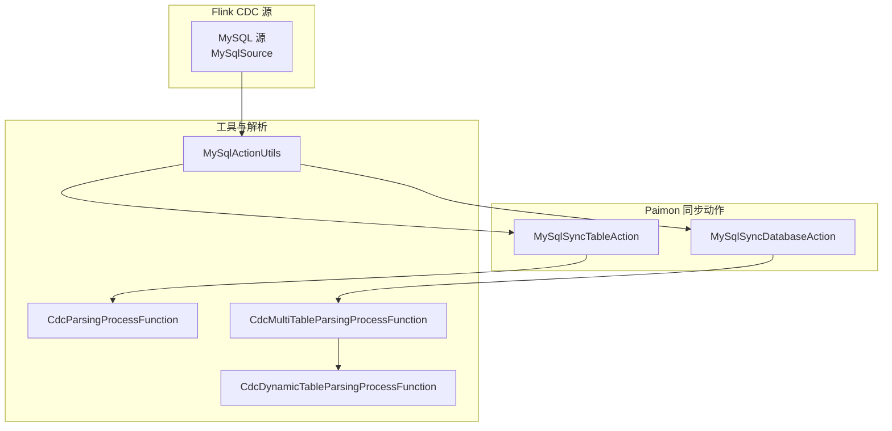
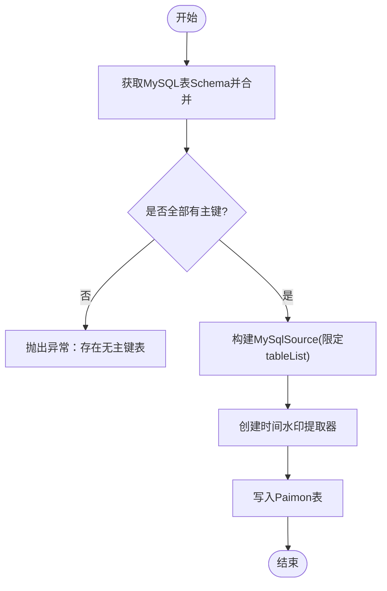
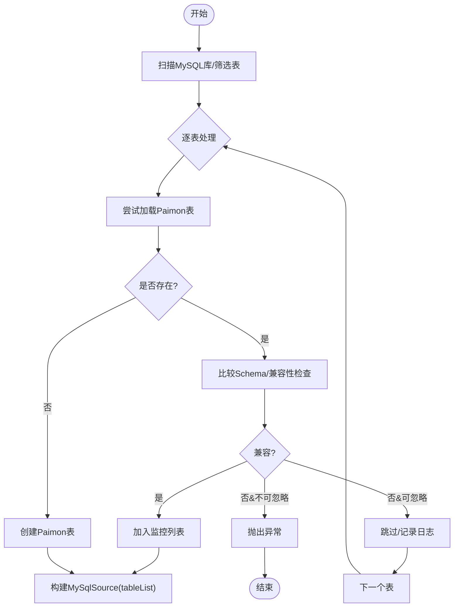
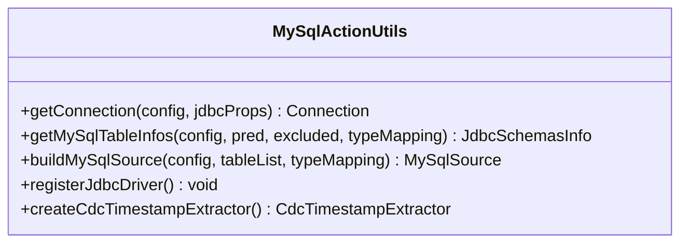
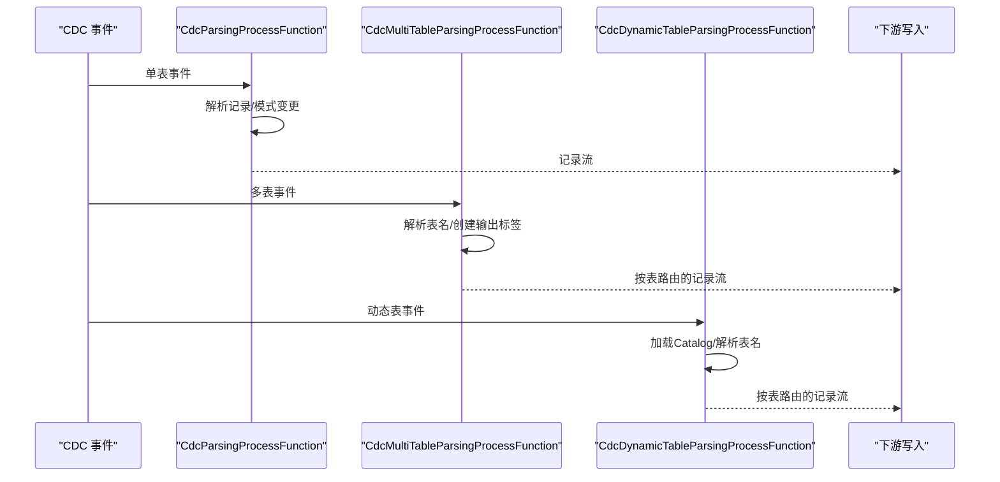
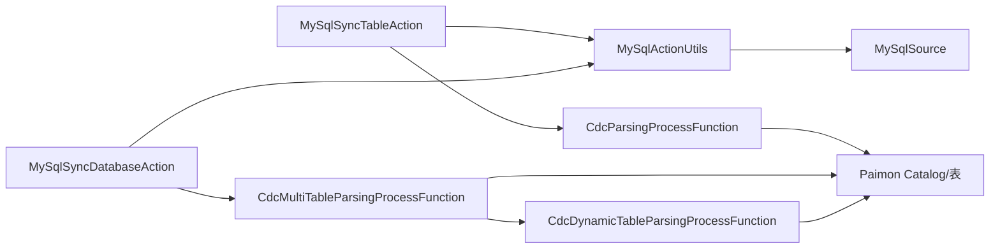

# MySQL CDC

<cite>
**本文引用的文件**
- [mysql-cdc.md](file://docs/content/cdc-ingestion/mysql-cdc.md)
- [MySqlSyncTableAction.java](file://paimon-flink/paimon-flink-cdc/src/main/java/org/apache/paimon/flink/action/cdc/mysql/MySqlSyncTableAction.java)
- [MySqlSyncDatabaseAction.java](file://paimon-flink/paimon-flink-cdc/src/main/java/org/apache/paimon/flink/action/cdc/mysql/MySqlSyncDatabaseAction.java)
- [MySqlActionUtils.java](file://paimon-flink/paimon-flink-cdc/src/main/java/org/apache/paimon/flink/action/cdc/mysql/MySqlActionUtils.java)
- [CdcParsingProcessFunction.java](file://paimon-flink/paimon-flink-cdc/src/main/java/org/apache/paimon/flink/sink/cdc/CdcParsingProcessFunction.java)
- [CdcMultiTableParsingProcessFunction.java](file://paimon-flink/paimon-flink-cdc/src/main/java/org/apache/paimon/flink/sink/cdc/CdcMultiTableParsingProcessFunction.java)
- [CdcDynamicTableParsingProcessFunction.java](file://paimon-flink/paimon-flink-cdc/src/main/java/org/apache/paimon/flink/sink/cdc/CdcDynamicTableParsingProcessFunction.java)
</cite>

## 目录
1. [简介](#简介)
2. [项目结构](#项目结构)
3. [核心组件](#核心组件)
4. [架构总览](#架构总览)
5. [详细组件分析](#详细组件分析)
6. [依赖关系分析](#依赖关系分析)
7. [性能考量](#性能考量)
8. [故障排除指南](#故障排除指南)
9. [结论](#结论)
10. [附录](#附录)

## 简介
本文件系统性阐述 Apache Paimon 的 MySQL CDC 集成方案，覆盖以下主题：
- 原理与工作机制：基于 Flink CDC Connector 捕获 MySQL 变更，解析为统一事件模型，写入 Paimon 表存储。
- 两种同步模式：表级同步（将多个 MySQL 表合并到一个 Paimon 表）与库级同步（将整个 MySQL 数据库映射到 Paimon 数据库）。
- 完整配置参数说明：连接参数、过滤规则、类型映射、启动策略、元数据列等。
- 特殊数据类型映射：如 TINYINT(1)、BIGINT UNSIGNED 等的处理策略。
- 性能优化与故障排除：连接池、快照分片、增量回填、启动模式选择等。

## 项目结构
与 MySQL CDC 相关的关键模块位于 paimon-flink/paimon-flink-cdc 中，主要包含：
- 动作类：负责构建并执行同步作业（表级与库级）
- 工具类：封装 MySQL 连接、源构建、类型映射与反向工程
- 解析器：将 CDC 事件解析为记录或模式变更，并输出到下游



图表来源
- [MySqlSyncTableAction.java:74-134](file://paimon-flink/paimon-flink-cdc/src/main/java/org/apache/paimon/flink/action/cdc/mysql/MySqlSyncTableAction.java#L74-L134)
- [MySqlSyncDatabaseAction.java:94-269](file://paimon-flink/paimon-flink-cdc/src/main/java/org/apache/paimon/flink/action/cdc/mysql/MySqlSyncDatabaseAction.java#L94-L269)
- [MySqlActionUtils.java:63-312](file://paimon-flink/paimon-flink-cdc/src/main/java/org/apache/paimon/flink/action/cdc/mysql/MySqlActionUtils.java#L63-L312)
- [CdcParsingProcessFunction.java:28-74](file://paimon-flink/paimon-flink-cdc/src/main/java/org/apache/paimon/flink/sink/cdc/CdcParsingProcessFunction.java#L28-L74)
- [CdcMultiTableParsingProcessFunction.java:67-97](file://paimon-flink/paimon-flink-cdc/src/main/java/org/apache/paimon/flink/sink/cdc/CdcMultiTableParsingProcessFunction.java#L67-L97)
- [CdcDynamicTableParsingProcessFunction.java:63-98](file://paimon-flink/paimon-flink-cdc/src/main/java/org/apache/paimon/flink/sink/cdc/CdcDynamicTableParsingProcessFunction.java#L63-L98)

章节来源
- [mysql-cdc.md:29-124](file://docs/content/cdc-ingestion/mysql-cdc.md#L29-L124)
- [MySqlSyncTableAction.java:74-134](file://paimon-flink/paimon-flink-cdc/src/main/java/org/apache/paimon/flink/action/cdc/mysql/MySqlSyncTableAction.java#L74-L134)
- [MySqlSyncDatabaseAction.java:94-269](file://paimon-flink/paimon-flink-cdc/src/main/java/org/apache/paimon/flink/action/cdc/mysql/MySqlSyncDatabaseAction.java#L94-L269)
- [MySqlActionUtils.java:63-312](file://paimon-flink/paimon-flink-cdc/src/main/java/org/apache/paimon/flink/action/cdc/mysql/MySqlActionUtils.java#L63-L312)

## 核心组件
- MySqlSyncTableAction：将一个或多个 MySQL 表合并到一个 Paimon 表中，自动推断并校验主键，支持有限的模式变更。
- MySqlSyncDatabaseAction：将整个 MySQL 数据库映射到 Paimon 数据库，按表粒度创建/更新目标表，支持包含/排除规则与分片合并。
- MySqlActionUtils：封装 JDBC 连接、反向工程获取表结构、构建 MySqlSource、处理类型映射与 JDBC/Debezium 参数。
- CDC 解析器：将 CDC 事件解析为记录或模式变更，多表场景下按表路由输出。

章节来源
- [MySqlSyncTableAction.java:43-74](file://paimon-flink/paimon-flink-cdc/src/main/java/org/apache/paimon/flink/action/cdc/mysql/MySqlSyncTableAction.java#L43-L74)
- [MySqlSyncDatabaseAction.java:58-94](file://paimon-flink/paimon-flink-cdc/src/main/java/org/apache/paimon/flink/action/cdc/mysql/MySqlSyncDatabaseAction.java#L58-L94)
- [MySqlActionUtils.java:100-145](file://paimon-flink/paimon-flink-cdc/src/main/java/org/apache/paimon/flink/action/cdc/mysql/MySqlActionUtils.java#L100-L145)
- [CdcParsingProcessFunction.java:28-74](file://paimon-flink/paimon-flink-cdc/src/main/java/org/apache/paimon/flink/sink/cdc/CdcParsingProcessFunction.java#L28-L74)

## 架构总览
MySQL CDC 在 Paimon 中的整体流程如下：
- 使用 Flink CDC Connector 的 MySqlSource 从 MySQL 捕获变更（含快照与增量）。
- 通过 CdcDebeziumDeserializationSchema 将变更事件反序列化为统一事件模型。
- 解析器将事件拆分为“记录流”和“模式变更流”，分别进入写入与模式演进路径。
- 写入阶段根据目标表结构进行类型转换与落盘。

```mermaid
sequenceDiagram
participant U as "用户/CLI"
participant MST as "MySqlSyncTableAction"
participant MSD as "MySqlSyncDatabaseAction"
participant MAU as "MySqlActionUtils"
participant SRC as "MySqlSource"
participant PAR as "CDC 解析器"
participant CAT as "Paimon Catalog/表"
U->>MST : 提交同步任务表级
MST->>MAU : 获取MySQL表结构/构建源
MAU->>SRC : 构建MySqlSource(含启动模式/参数)
MST->>SRC : 订阅变更事件
SRC-->>PAR : 变更事件流
PAR-->>CAT : 写入记录/模式变更
note over MST,PAR : 表级模式合并与校验
U->>MSD : 提交同步任务库级
MSD->>MAU : 扫描MySQL库/构建源
MAU->>SRC : 构建MySqlSource(含包含/排除/分片)
MSD->>SRC : 订阅变更事件
SRC-->>PAR : 变更事件流
PAR-->>CAT : 写入记录/模式变更
note over MSD,PAR : 多表路由与兼容性检查
```

图表来源
- [MySqlSyncTableAction.java:86-110](file://paimon-flink/paimon-flink-cdc/src/main/java/org/apache/paimon/flink/action/cdc/mysql/MySqlSyncTableAction.java#L86-L110)
- [MySqlSyncDatabaseAction.java:115-201](file://paimon-flink/paimon-flink-cdc/src/main/java/org/apache/paimon/flink/action/cdc/mysql/MySqlSyncDatabaseAction.java#L115-L201)
- [MySqlActionUtils.java:147-269](file://paimon-flink/paimon-flink-cdc/src/main/java/org/apache/paimon/flink/action/cdc/mysql/MySqlActionUtils.java#L147-L269)
- [CdcParsingProcessFunction.java:64-74](file://paimon-flink/paimon-flink-cdc/src/main/java/org/apache/paimon/flink/sink/cdc/CdcParsingProcessFunction.java#L64-L74)

## 详细组件分析

### 组件A：表级同步（MySqlSyncTableAction）
- 职责：将多个 MySQL 表合并到一个 Paimon 表；自动推断并校验主键；支持有限模式变更。
- 关键流程：
  - 通过 MySqlActionUtils 获取所有匹配表的 Schema 并合并为单一 Schema。
  - 构建 MySqlSource，限定 tableList 为 “database.table” 正则。
  - 创建时间水印提取器，用于后续处理。
- 限制与约束：
  - 源表必须具备主键，否则抛出异常。
  - 支持的模式变更包括新增列、部分类型扩大（字符串/二进制/整数/浮点）。



图表来源
- [MySqlSyncTableAction.java:86-124](file://paimon-flink/paimon-flink-cdc/src/main/java/org/apache/paimon/flink/action/cdc/mysql/MySqlSyncTableAction.java#L86-L124)

章节来源
- [MySqlSyncTableAction.java:43-74](file://paimon-flink/paimon-flink-cdc/src/main/java/org/apache/paimon/flink/action/cdc/mysql/MySqlSyncTableAction.java#L43-L74)
- [MySqlSyncTableAction.java:86-124](file://paimon-flink/paimon-flink-cdc/src/main/java/org/apache/paimon/flink/action/cdc/mysql/MySqlSyncTableAction.java#L86-L124)

### 组件B：库级同步（MySqlSyncDatabaseAction）
- 职责：将 MySQL 数据库映射到 Paimon 数据库，逐表创建/更新目标表；支持包含/排除规则、分片合并、兼容性检查。
- 关键流程：
  - 基于包含/排除正则筛选待监控表。
  - 对每个表尝试加载/创建对应 Paimon 表，若不兼容且允许忽略则跳过。
  - 构建 MySqlSource，tableList 由数据库名、包含/排除规则与已监控表集合生成。
- 重要选项：
  - ignore_incompatible：当表结构不兼容时是否忽略。
  - including_tables/excluding_tables：表名正则过滤。
  - merge_shards：是否将同名表跨库合并到同一 Paimon 表。



图表来源
- [MySqlSyncDatabaseAction.java:115-182](file://paimon-flink/paimon-flink-cdc/src/main/java/org/apache/paimon/flink/action/cdc/mysql/MySqlSyncDatabaseAction.java#L115-L182)
- [MySqlSyncDatabaseAction.java:189-201](file://paimon-flink/paimon-flink-cdc/src/main/java/org/apache/paimon/flink/action/cdc/mysql/MySqlSyncDatabaseAction.java#L189-L201)

章节来源
- [MySqlSyncDatabaseAction.java:58-94](file://paimon-flink/paimon-flink-cdc/src/main/java/org/apache/paimon/flink/action/cdc/mysql/MySqlSyncDatabaseAction.java#L58-L94)
- [MySqlSyncDatabaseAction.java:115-182](file://paimon-flink/paimon-flink-cdc/src/main/java/org/apache/paimon/flink/action/cdc/mysql/MySqlSyncDatabaseAction.java#L115-L182)
- [MySqlSyncDatabaseAction.java:189-201](file://paimon-flink/paimon-flink-cdc/src/main/java/org/apache/paimon/flink/action/cdc/mysql/MySqlSyncDatabaseAction.java#L189-L201)

### 组件C：源构建与类型映射（MySqlActionUtils）
- JDBC 连接与反向工程：通过 JDBC 获取数据库/表/列信息，结合类型映射构建 Schema。
- MySqlSource 构建：设置主机、端口、用户名、密码、数据库/表列表、启动模式、连接参数、JDBC/Debezium 属性。
- 类型映射与冲突处理：对 TINYINT(1) 等特殊类型提供独立映射开关，并与 JDBC tinyInt1isBit 冲突检测。
- 时间戳提取器：提供 MySQL CDC 的时间戳提取器。



图表来源
- [MySqlActionUtils.java:74-98](file://paimon-flink/paimon-flink-cdc/src/main/java/org/apache/paimon/flink/action/cdc/mysql/MySqlActionUtils.java#L74-L98)
- [MySqlActionUtils.java:100-145](file://paimon-flink/paimon-flink-cdc/src/main/java/org/apache/paimon/flink/action/cdc/mysql/MySqlActionUtils.java#L100-L145)
- [MySqlActionUtils.java:147-269](file://paimon-flink/paimon-flink-cdc/src/main/java/org/apache/paimon/flink/action/cdc/mysql/MySqlActionUtils.java#L147-L269)
- [MySqlActionUtils.java:293-306](file://paimon-flink/paimon-flink-cdc/src/main/java/org/apache/paimon/flink/action/cdc/mysql/MySqlActionUtils.java#L293-L306)
- [MySqlActionUtils.java:308-310](file://paimon-flink/paimon-flink-cdc/src/main/java/org/apache/paimon/flink/action/cdc/mysql/MySqlActionUtils.java#L308-L310)

章节来源
- [MySqlActionUtils.java:63-312](file://paimon-flink/paimon-flink-cdc/src/main/java/org/apache/paimon/flink/action/cdc/mysql/MySqlActionUtils.java#L63-L312)

### 组件D：CDC 事件解析（CdcParsingProcessFunction 系列）
- 单表解析：将事件解析为记录或模式变更，输出到下游。
- 多表解析：按表名动态创建输出标签，分别输出不同表的记录与模式变更。
- 动态表解析：在运行期加载 Catalog，按表名路由事件，当前仅支持单数据库。



图表来源
- [CdcParsingProcessFunction.java:28-74](file://paimon-flink/paimon-flink-cdc/src/main/java/org/apache/paimon/flink/sink/cdc/CdcParsingProcessFunction.java#L28-L74)
- [CdcMultiTableParsingProcessFunction.java:67-97](file://paimon-flink/paimon-flink-cdc/src/main/java/org/apache/paimon/flink/sink/cdc/CdcMultiTableParsingProcessFunction.java#L67-L97)
- [CdcDynamicTableParsingProcessFunction.java:63-98](file://paimon-flink/paimon-flink-cdc/src/main/java/org/apache/paimon/flink/sink/cdc/CdcDynamicTableParsingProcessFunction.java#L63-L98)

章节来源
- [CdcParsingProcessFunction.java:28-74](file://paimon-flink/paimon-flink-cdc/src/main/java/org/apache/paimon/flink/sink/cdc/CdcParsingProcessFunction.java#L28-L74)
- [CdcMultiTableParsingProcessFunction.java:67-97](file://paimon-flink/paimon-flink-cdc/src/main/java/org/apache/paimon/flink/sink/cdc/CdcMultiTableParsingProcessFunction.java#L67-L97)
- [CdcDynamicTableParsingProcessFunction.java:63-98](file://paimon-flink/paimon-flink-cdc/src/main/java/org/apache/paimon/flink/sink/cdc/CdcDynamicTableParsingProcessFunction.java#L63-L98)

## 依赖关系分析
- MySqlSyncTableAction 与 MySqlSyncDatabaseAction 共同依赖：
  - MySqlActionUtils：JDBC 连接、反向工程、MySqlSource 构建、类型映射与参数处理。
  - CDC 解析器：事件解析与多路输出。
- 两者均依赖 Flink CDC Connector 的 MySqlSource 与 Debezium 反序列化器。
- 写入阶段依赖 Paimon Catalog 与 FileStoreTable。



图表来源
- [MySqlSyncTableAction.java:74-110](file://paimon-flink/paimon-flink-cdc/src/main/java/org/apache/paimon/flink/action/cdc/mysql/MySqlSyncTableAction.java#L74-L110)
- [MySqlSyncDatabaseAction.java:115-201](file://paimon-flink/paimon-flink-cdc/src/main/java/org/apache/paimon/flink/action/cdc/mysql/MySqlSyncDatabaseAction.java#L115-L201)
- [MySqlActionUtils.java:147-269](file://paimon-flink/paimon-flink-cdc/src/main/java/org/apache/paimon/flink/action/cdc/mysql/MySqlActionUtils.java#L147-L269)
- [CdcParsingProcessFunction.java:28-74](file://paimon-flink/paimon-flink-cdc/src/main/java/org/apache/paimon/flink/sink/cdc/CdcParsingProcessFunction.java#L28-L74)
- [CdcMultiTableParsingProcessFunction.java:67-97](file://paimon-flink/paimon-flink-cdc/src/main/java/org/apache/paimon/flink/sink/cdc/CdcMultiTableParsingProcessFunction.java#L67-L97)
- [CdcDynamicTableParsingProcessFunction.java:63-98](file://paimon-flink/paimon-flink-cdc/src/main/java/org/apache/paimon/flink/sink/cdc/CdcDynamicTableParsingProcessFunction.java#L63-L98)

章节来源
- [MySqlSyncTableAction.java:74-110](file://paimon-flink/paimon-flink-cdc/src/main/java/org/apache/paimon/flink/action/cdc/mysql/MySqlSyncTableAction.java#L74-L110)
- [MySqlSyncDatabaseAction.java:115-201](file://paimon-flink/paimon-flink-cdc/src/main/java/org/apache/paimon/flink/action/cdc/mysql/MySqlSyncDatabaseAction.java#L115-L201)
- [MySqlActionUtils.java:147-269](file://paimon-flink/paimon-flink-cdc/src/main/java/org/apache/paimon/flink/action/cdc/mysql/MySqlActionUtils.java#L147-L269)

## 性能考量
- 快照分片与回填
  - 使用增量快照分片参数控制分片大小，提升大表快照效率。
  - 可配置跳过历史回填以减少初始压力。
- 连接与心跳
  - 设置连接超时、最大重试次数与连接池大小，降低网络抖动影响。
  - 合理配置心跳间隔，避免长事务导致的 binlog 积压。
- 启动模式
  - initial/snapshot：首次全量+增量，适合新接入。
  - latest-offset/timestamp：从最新或指定时间点开始，适合追加场景。
  - specific-offset：从指定位置精确恢复，适合故障恢复。
- 并行度与分区
  - 适当提高下游写入并行度，结合分区键提升吞吐。
- 类型映射与反序列化
  - 保持 JSON 数值格式一致，避免不必要的类型转换开销。

章节来源
- [MySqlActionUtils.java:163-207](file://paimon-flink/paimon-flink-cdc/src/main/java/org/apache/paimon/flink/action/cdc/mysql/MySqlActionUtils.java#L163-L207)
- [MySqlActionUtils.java:208-245](file://paimon-flink/paimon-flink-cdc/src/main/java/org/apache/paimon/flink/action/cdc/mysql/MySqlActionUtils.java#L208-L245)
- [mysql-cdc.md:43-124](file://docs/content/cdc-ingestion/mysql-cdc.md#L43-L124)

## 故障排除指南
- 字符集乱码
  - 在 Flink 配置中设置字符集选项，确保 UTF-8 编码正确传递。
- 表注释同步
  - 创建表注释：启用信息库属性。
  - 修改注释：启用 Debezium 的 schema comments 选项。
- TINYINT(1) 映射冲突
  - 若使用 Paimon 的 TINYINT(1) 不当作布尔映射，需确保 JDBC tinyInt1isBit 未设为 true，避免冲突。
- 无主键表被忽略
  - 库级同步默认仅同步带主键的表；可在兼容模式下忽略不兼容表或补充主键。
- 新增表与分片合并
  - 支持在库级模式下动态扫描新增表；可通过合并分片将同名表合并到同一 Paimon 表。

章节来源
- [mysql-cdc.md:261-272](file://docs/content/cdc-ingestion/mysql-cdc.md#L261-L272)
- [MySqlActionUtils.java:274-291](file://paimon-flink/paimon-flink-cdc/src/main/java/org/apache/paimon/flink/action/cdc/mysql/MySqlActionUtils.java#L274-L291)
- [MySqlSyncDatabaseAction.java:203-213](file://paimon-flink/paimon-flink-cdc/src/main/java/org/apache/paimon/flink/action/cdc/mysql/MySqlSyncDatabaseAction.java#L203-L213)

## 结论
Paimon 的 MySQL CDC 集成以 Flink CDC Connector 为核心，结合统一的 CDC 事件解析与 Paimon 表写入能力，提供了灵活高效的增量数据同步方案。通过表级与库级两种模式，满足从单表到多库多表的复杂同步需求；借助完善的参数体系与类型映射机制，兼顾易用性与稳定性。

## 附录

### 配置参数速查（表级同步）
- 连接与源参数
  - 主机/端口/用户名/密码/数据库名/表名
  - 启动模式：initial、earliest-offset、latest-offset、specific-offset、timestamp、snapshot
  - 连接与快照参数：超时、重试、连接池、心跳、分片大小、回填策略等
  - JDBC/Debezium 参数前缀透传
- 目标表参数
  - 分区键、主键、桶数量、写入并行度、Changelog 生产者等
- 元数据与计算列
  - 元数据列、计算列定义

章节来源
- [mysql-cdc.md:47-92](file://docs/content/cdc-ingestion/mysql-cdc.md#L47-L92)
- [MySqlActionUtils.java:147-269](file://paimon-flink/paimon-flink-cdc/src/main/java/org/apache/paimon/flink/action/cdc/mysql/MySqlActionUtils.java#L147-L269)

### 配置参数速查（库级同步）
- 包含/排除表正则
- 是否忽略不兼容表
- 是否合并分片
- 表名前缀/后缀/映射
- 其余与表级同步相同的源与表参数

章节来源
- [mysql-cdc.md:129-151](file://docs/content/cdc-ingestion/mysql-cdc.md#L129-L151)
- [MySqlSyncDatabaseAction.java:115-182](file://paimon-flink/paimon-flink-cdc/src/main/java/org/apache/paimon/flink/action/cdc/mysql/MySqlSyncDatabaseAction.java#L115-L182)

### 特殊数据类型映射要点
- TINYINT(1)
  - 默认行为可能映射为布尔；若需映射为整型，需在类型映射中开启相应模式，并确保 JDBC tinyInt1isBit 未冲突。
- BIGINT UNSIGNED
  - 通常映射为更大范围整型或十进制，具体取决于类型映射策略与目标类型精度。

章节来源
- [MySqlActionUtils.java:274-291](file://paimon-flink/paimon-flink-cdc/src/main/java/org/apache/paimon/flink/action/cdc/mysql/MySqlActionUtils.java#L274-L291)