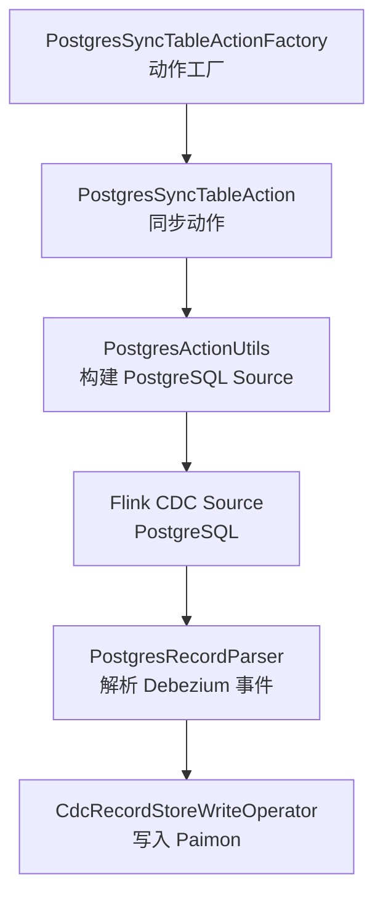
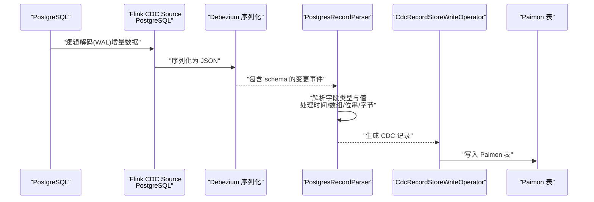
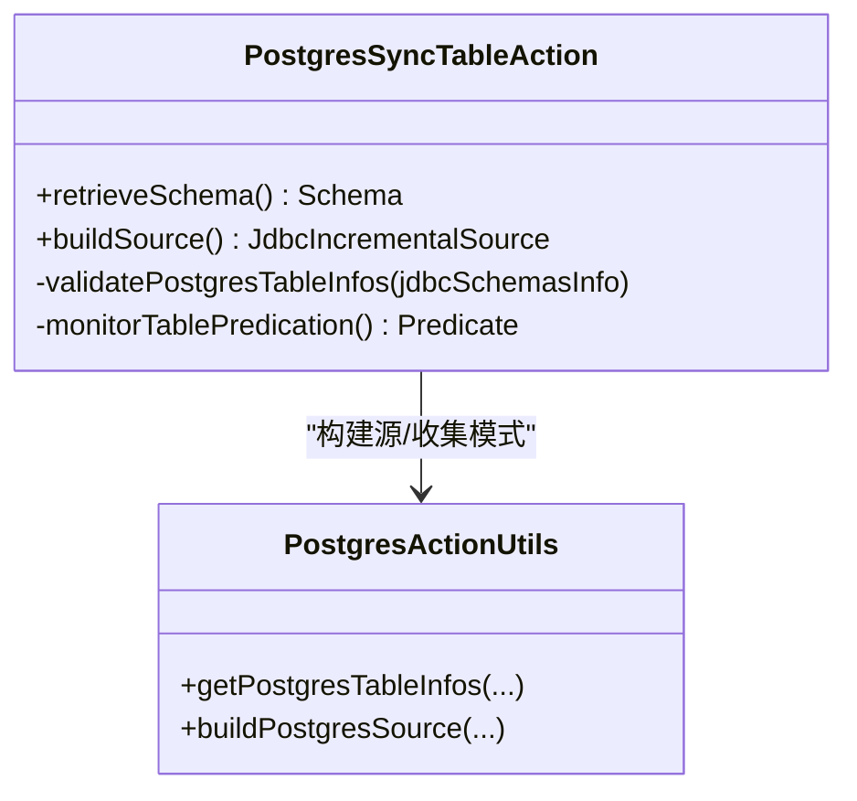
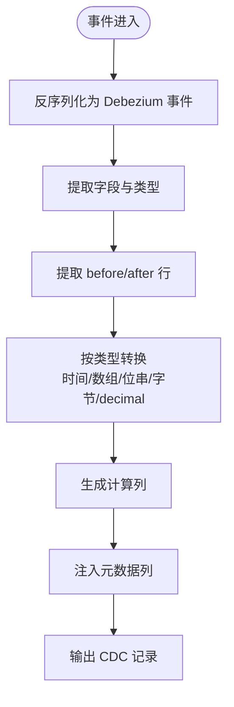

# PostgreSQL CDC

<cite>
**本文引用的文件**
- [postgres-cdc.md](file://docs/content/cdc-ingestion/postgres-cdc.md)
- [PostgresSyncTableAction.java](file://paimon-flink/paimon-flink-cdc/src/main/java/org/apache/paimon/flink/action/cdc/postgres/PostgresSyncTableAction.java)
- [PostgresRecordParser.java](file://paimon-flink/paimon-flink-cdc/src/main/java/org/apache/paimon/flink/action/cdc/postgres/PostgresRecordParser.java)
- [PostgresTypeUtils.java](file://paimon-flink/paimon-flink-cdc/src/main/java/org/apache/paimon/flink/action/cdc/postgres/PostgresTypeUtils.java)
- [PostgresActionUtils.java](file://paimon-flink/paimon-flink-cdc/src/main/java/org/apache/paimon/flink/action/cdc/postgres/PostgresActionUtils.java)
- [PostgresSyncTableActionFactory.java](file://paimon-flink/paimon-flink-cdc/src/main/java/org/apache/paimon/flink/action/cdc/postgres/PostgresSyncTableActionFactory.java)
- [PostgresSyncTableActionITCase.java](file://paimon-flink/paimon-flink-cdc/src/test/java/org/apache/paimon/flink/action/cdc/postgres/PostgresSyncTableActionITCase.java)
- [PostgresContainer.java](file://paimon-flink/paimon-flink-cdc/src/test/java/org/apache/paimon/flink/action/cdc/postgres/PostgresContainer.java)
- [CdcRecordStoreWriteOperator.java](file://paimon-flink/paimon-flink-cdc/src/main/java/org/apache/paimon/flink/sink/cdc/CdcRecordStoreWriteOperator.java)
</cite>

## 目录
1. [简介](#简介)
2. [项目结构](#项目结构)
3. [核心组件](#核心组件)
4. [架构总览](#架构总览)
5. [详细组件分析](#详细组件分析)
6. [依赖关系分析](#依赖关系分析)
7. [性能考量](#性能考量)
8. [故障排除指南](#故障排除指南)
9. [结论](#结论)
10. [附录](#附录)

## 简介
本文件面向使用 Apache Paimon 进行 PostgreSQL CDC 同步的用户与工程师，系统性阐述基于 Flink CDC 的 PostgreSQL 变更数据捕获（CDC）实现原理与操作流程。内容涵盖：
- 基于 Debezium 的逻辑解码（Logical Replication）与增量快照（Incremental Snapshot）机制
- WAL 日志解析与变更事件转换为 Paimon 写入记录的过程
- 表级同步与分片/多模式同步（按 schema 或表正则匹配）的配置与使用场景
- 完整配置参数说明（连接参数、复制槽、启动模式、增量快照参数、过滤规则等）
- 特殊数据类型的映射与兼容处理
- 性能优化策略与监控建议
- 实际配置示例与常见问题排查

## 项目结构
围绕 PostgreSQL CDC 的关键代码位于 paimon-flink-cdc 模块中，主要由以下层次构成：
- 动作工厂与入口：负责解析命令行参数并构造同步任务
- 数据源构建：封装 Flink CDC PostgreSQL Source 的构建与配置
- 记录解析：将 Debezium JSON 转换为 Paimon 可用的 CDC 记录
- 类型映射：将 PostgreSQL 类型映射到 Paimon 数据类型
- 集成测试：覆盖多类型、分片、计算列、元数据列、模式演进等场景

图表来源
- [PostgresSyncTableActionFactory.java:26-44](file://paimon-flink/paimon-flink-cdc/src/main/java/org/apache/paimon/flink/action/cdc/postgres/PostgresSyncTableActionFactory.java#L26-L44)
- [PostgresSyncTableAction.java:75-110](file://paimon-flink/paimon-flink-cdc/src/main/java/org/apache/paimon/flink/action/cdc/postgres/PostgresSyncTableAction.java#L75-L110)
- [PostgresActionUtils.java:120-210](file://paimon-flink/paimon-flink-cdc/src/main/java/org/apache/paimon/flink/action/cdc/postgres/PostgresActionUtils.java#L120-L210)
- [PostgresRecordParser.java:78-122](file://paimon-flink/paimon-flink-cdc/src/main/java/org/apache/paimon/flink/action/cdc/postgres/PostgresRecordParser.java#L78-L122)
- [CdcRecordStoreWriteOperator.java:57-83](file://paimon-flink/paimon-flink-cdc/src/main/java/org/apache/paimon/flink/sink/cdc/CdcRecordStoreWriteOperator.java#L57-L83)

章节来源
- [PostgresSyncTableActionFactory.java:26-131](file://paimon-flink/paimon-flink-cdc/src/main/java/org/apache/paimon/flink/action/cdc/postgres/PostgresSyncTableActionFactory.java#L26-L131)
- [PostgresSyncTableAction.java:75-133](file://paimon-flink/paimon-flink-cdc/src/main/java/org/apache/paimon/flink/action/cdc/postgres/PostgresSyncTableAction.java#L75-L133)
- [PostgresActionUtils.java:54-221](file://paimon-flink/paimon-flink-cdc/src/main/java/org/apache/paimon/flink/action/cdc/postgres/PostgresActionUtils.java#L54-L221)
- [PostgresRecordParser.java:78-367](file://paimon-flink/paimon-flink-cdc/src/main/java/org/apache/paimon/flink/action/cdc/postgres/PostgresRecordParser.java#L78-L367)
- [PostgresTypeUtils.java:32-194](file://paimon-flink/paimon-flink-cdc/src/main/java/org/apache/paimon/flink/action/cdc/postgres/PostgresTypeUtils.java#L32-L194)
- [PostgresSyncTableActionITCase.java:47-818](file://paimon-flink/paimon-flink-cdc/src/test/java/org/apache/paimon/flink/action/cdc/postgres/PostgresSyncTableActionITCase.java#L47-L818)
- [PostgresContainer.java:24-51](file://paimon-flink/paimon-flink-cdc/src/test/java/org/apache/paimon/flink/action/cdc/postgres/PostgresContainer.java#L24-L51)
- [CdcRecordStoreWriteOperator.java:57-83](file://paimon-flink/paimon-flink-cdc/src/main/java/org/apache/paimon/flink/sink/cdc/CdcRecordStoreWriteOperator.java#L57-L83)

## 核心组件
- 动作工厂与入口
  - 提供命令行入口与帮助输出，定义必需与可选配置键，校验输入并创建同步动作实例。
- 同步动作
  - 收集目标 PostgreSQL 表的模式信息，合并为 Paimon 表的最终模式；构建增量源并执行同步。
- 源构建工具
  - 封装 Flink CDC PostgreSQL Source 的构建，设置主机、端口、数据库、用户名、密码、复制槽、启动模式、增量快照参数、Debezium 属性等。
- 记录解析器
  - 解析 Debezium JSON 事件，提取字段类型与值，处理时间戳、数组、位串、字节等特殊类型，并支持计算列与元数据列。
- 类型映射工具
  - 将 PostgreSQL 类型映射到 Paimon 数据类型，支持数组、数值精度、时间类型等。
- 集成测试与容器
  - 提供 PostgreSQL 测试容器与大量端到端测试，覆盖多类型、分片、模式演进、计算列、元数据列等。

章节来源
- [PostgresSyncTableActionFactory.java:26-131](file://paimon-flink/paimon-flink-cdc/src/main/java/org/apache/paimon/flink/action/cdc/postgres/PostgresSyncTableActionFactory.java#L26-L131)
- [PostgresSyncTableAction.java:75-133](file://paimon-flink/paimon-flink-cdc/src/main/java/org/apache/paimon/flink/action/cdc/postgres/PostgresSyncTableAction.java#L75-L133)
- [PostgresActionUtils.java:54-221](file://paimon-flink/paimon-flink-cdc/src/main/java/org/apache/paimon/flink/action/cdc/postgres/PostgresActionUtils.java#L54-L221)
- [PostgresRecordParser.java:78-367](file://paimon-flink/paimon-flink-cdc/src/main/java/org/apache/paimon/flink/action/cdc/postgres/PostgresRecordParser.java#L78-L367)
- [PostgresTypeUtils.java:32-194](file://paimon-flink/paimon-flink-cdc/src/main/java/org/apache/paimon/flink/action/cdc/postgres/PostgresTypeUtils.java#L32-L194)
- [PostgresSyncTableActionITCase.java:47-818](file://paimon-flink/paimon-flink-cdc/src/test/java/org/apache/paimon/flink/action/cdc/postgres/PostgresSyncTableActionITCase.java#L47-L818)
- [PostgresContainer.java:24-51](file://paimon-flink/paimon-flink-cdc/src/test/java/org/apache/paimon/flink/action/cdc/postgres/PostgresContainer.java#L24-L51)

## 架构总览
下图展示从 PostgreSQL 到 Paimon 的 CDC 数据流：Flink CDC PostgreSQL Source 通过逻辑解码拉取变更，经 Debezium 序列化后交由解析器转换为 Paimon 记录，再写入 Paimon 表。

图表来源
- [PostgresActionUtils.java:120-210](file://paimon-flink/paimon-flink-cdc/src/main/java/org/apache/paimon/flink/action/cdc/postgres/PostgresActionUtils.java#L120-L210)
- [PostgresRecordParser.java:114-122](file://paimon-flink/paimon-flink-cdc/src/main/java/org/apache/paimon/flink/action/cdc/postgres/PostgresRecordParser.java#L114-L122)
- [CdcRecordStoreWriteOperator.java:57-83](file://paimon-flink/paimon-flink-cdc/src/main/java/org/apache/paimon/flink/sink/cdc/CdcRecordStoreWriteOperator.java#L57-L83)

## 详细组件分析

### 组件一：PostgresSyncTableAction（表级同步主流程）
- 责任
  - 收集目标 PostgreSQL 表的模式信息并合并为 Paimon 表模式；构建增量源；校验源表是否具备主键；根据正则表达式筛选表。
- 关键点
  - 仅支持有主键的表；不支持无主键表混入同一 Paimon 表。
  - 使用增量快照与正则过滤，支持多表/多 schema 合并为单表。
- 典型调用链
  - retrieveSchema → getPostgresTableInfos → buildSource → buildPostgresSource

图表来源
- [PostgresSyncTableAction.java:75-133](file://paimon-flink/paimon-flink-cdc/src/main/java/org/apache/paimon/flink/action/cdc/postgres/PostgresSyncTableAction.java#L75-L133)
- [PostgresActionUtils.java:70-118](file://paimon-flink/paimon-flink-cdc/src/main/java/org/apache/paimon/flink/action/cdc/postgres/PostgresActionUtils.java#L70-L118)
- [PostgresActionUtils.java:120-210](file://paimon-flink/paimon-flink-cdc/src/main/java/org/apache/paimon/flink/action/cdc/postgres/PostgresActionUtils.java#L120-L210)

章节来源
- [PostgresSyncTableAction.java:75-133](file://paimon-flink/paimon-flink-cdc/src/main/java/org/apache/paimon/flink/action/cdc/postgres/PostgresSyncTableAction.java#L75-L133)

### 组件二：PostgresActionUtils（源构建与配置）
- 负责
  - 构建 PostgreSQL Source，设置主机、端口、数据库、用户名、密码、复制槽、启动模式、增量快照参数、Debezium 属性。
  - 通过 JDBC 获取目标库/模式/表的元信息，用于模式推断与合并。
- 关键配置项
  - 必填：hostname、username、password、database-name、schema-name、table-name、slot.name
  - 启动模式：initial、latest-offset、snapshot
  - 增量快照：splitSize、fetchSize、splitMetaGroupSize、分布因子上下界、首未bounded chunk 分配等
  - 连接与心跳：connectTimeout、connectMaxRetries、connectionPoolSize、heartbeatInterval
  - 其他：scanNewlyAddedTableEnabled、skipSnapshotBackfill 等
- 注意
  - 若 scan.startup.mode 不在允许集合内会抛出异常

章节来源
- [PostgresActionUtils.java:56-68](file://paimon-flink/paimon-flink-cdc/src/main/java/org/apache/paimon/flink/action/cdc/postgres/PostgresActionUtils.java#L56-L68)
- [PostgresActionUtils.java:70-118](file://paimon-flink/paimon-flink-cdc/src/main/java/org/apache/paimon/flink/action/cdc/postgres/PostgresActionUtils.java#L70-L118)
- [PostgresActionUtils.java:120-210](file://paimon-flink/paimon-flink-cdc/src/main/java/org/apache/paimon/flink/action/cdc/postgres/PostgresActionUtils.java#L120-L210)
- [PostgresSyncTableActionFactory.java:92-107](file://paimon-flink/paimon-flink-cdc/src/main/java/org/apache/paimon/flink/action/cdc/postgres/PostgresSyncTableActionFactory.java#L92-L107)

### 组件三：PostgresRecordParser（事件解析与类型转换）
- 负责
  - 解析 Debezium JSON 事件，提取 schema 与字段值；对时间类型、数组、位串、字节、decimal 等进行转换；支持计算列与元数据列。
- 类型处理要点
  - 时间类型：date、timestamp、timestamptz、time（含微秒/纳秒），统一格式化为字符串或本地时间
  - 数组：转为 JSON 字符串
  - 位串（bit/varbit）：按长度映射布尔或二进制
  - 字节（bytes）：二进制/变长二进制；numeric decimal 通过自定义转换器以“numeric”格式解析
- 兼容性
  - 仅支持带 schema 的 Debezium JSON；否则抛错
  - decimal 非法值会抛出异常并提示设置 DECIMAL_FORMAT_CONFIG 为 numeric

图表来源
- [PostgresRecordParser.java:114-122](file://paimon-flink/paimon-flink-cdc/src/main/java/org/apache/paimon/flink/action/cdc/postgres/PostgresRecordParser.java#L114-L122)
- [PostgresRecordParser.java:148-205](file://paimon-flink/paimon-flink-cdc/src/main/java/org/apache/paimon/flink/action/cdc/postgres/PostgresRecordParser.java#L148-L205)
- [PostgresRecordParser.java:230-361](file://paimon-flink/paimon-flink-cdc/src/main/java/org/apache/paimon/flink/action/cdc/postgres/PostgresRecordParser.java#L230-L361)

章节来源
- [PostgresRecordParser.java:78-367](file://paimon-flink/paimon-flink-cdc/src/main/java/org/apache/paimon/flink/action/cdc/postgres/PostgresRecordParser.java#L78-L367)

### 组件四：PostgresTypeUtils（PostgreSQL 类型到 Paimon 映射）
- 负责
  - 将 PostgreSQL 类型名、精度、刻度映射到 Paimon 数据类型；支持数组类型、数值精度、时间类型等。
- 支持的关键类型族
  - 整数：smallint、int、bigint、serial、bigserial
  - 浮点：real、double precision
  - 数值：numeric/decimal（含数组）
  - 文本：char、varchar、text、json、enum
  - 日期时间：date、time、timestamp、timestamptz（含数组）
  - 二进制：bytea、bit/varbit（1 映射布尔，其他映射二进制）
- 异常
  - 未支持的类型会抛出不支持异常

章节来源
- [PostgresTypeUtils.java:32-194](file://paimon-flink/paimon-flink-cdc/src/main/java/org/apache/paimon/flink/action/cdc/postgres/PostgresTypeUtils.java#L32-L194)

### 组件五：PostgresSyncTableActionFactory（命令行入口与帮助）
- 负责
  - 定义动作标识与参数语法；打印帮助信息；说明必需与可选配置键；给出示例。
- 关键点
  - 必需键：hostname、username、password、database-name、schema-name、table-name、slot.name
  - 可选键：启动模式、增量快照、连接池、心跳间隔、Debezium 自定义属性等

章节来源
- [PostgresSyncTableActionFactory.java:26-131](file://paimon-flink/paimon-flink-cdc/src/main/java/org/apache/paimon/flink/action/cdc/postgres/PostgresSyncTableActionFactory.java#L26-L131)

### 组件六：集成测试与容器（验证与示例）
- 测试覆盖
  - 多类型全量覆盖、分片/多 schema 同步、模式演进（新增列、列类型扩大）、计算列、元数据列、选项变更、错误场景等
- 容器
  - 提供 PostgreSQL 测试容器，支持初始化 SQL 注入

章节来源
- [PostgresSyncTableActionITCase.java:47-818](file://paimon-flink/paimon-flink-cdc/src/test/java/org/apache/paimon/flink/action/cdc/postgres/PostgresSyncTableActionITCase.java#L47-L818)
- [PostgresContainer.java:24-51](file://paimon-flink/paimon-flink-cdc/src/test/java/org/apache/paimon/flink/action/cdc/postgres/PostgresContainer.java#L24-L51)

## 依赖关系分析
- 组件耦合
  - PostgresSyncTableAction 依赖 PostgresActionUtils 进行源构建与模式收集
  - PostgresRecordParser 依赖 Debezium 事件模型与 Jackson 进行 JSON 解析
  - 类型映射独立于具体源，便于扩展新类型
- 外部依赖
  - Flink CDC PostgreSQL Connector（逻辑解码、增量快照）
  - Debezium JSON 序列化与自定义转换器
  - PostgreSQL JDBC 驱动（用于获取元信息）

图表来源
- [PostgresSyncTableAction.java:75-110](file://paimon-flink/paimon-flink-cdc/src/main/java/org/apache/paimon/flink/action/cdc/postgres/PostgresSyncTableAction.java#L75-L110)
- [PostgresActionUtils.java:120-210](file://paimon-flink/paimon-flink-cdc/src/main/java/org/apache/paimon/flink/action/cdc/postgres/PostgresActionUtils.java#L120-L210)
- [PostgresRecordParser.java:78-122](file://paimon-flink/paimon-flink-cdc/src/main/java/org/apache/paimon/flink/action/cdc/postgres/PostgresRecordParser.java#L78-L122)
- [PostgresTypeUtils.java:32-194](file://paimon-flink/paimon-flink-cdc/src/main/java/org/apache/paimon/flink/action/cdc/postgres/PostgresTypeUtils.java#L32-L194)

章节来源
- [PostgresSyncTableAction.java:75-133](file://paimon-flink/paimon-flink-cdc/src/main/java/org/apache/paimon/flink/action/cdc/postgres/PostgresSyncTableAction.java#L75-L133)
- [PostgresActionUtils.java:54-221](file://paimon-flink/paimon-flink-cdc/src/main/java/org/apache/paimon/flink/action/cdc/postgres/PostgresActionUtils.java#L54-L221)
- [PostgresRecordParser.java:78-367](file://paimon-flink/paimon-flink-cdc/src/main/java/org/apache/paimon/flink/action/cdc/postgres/PostgresRecordParser.java#L78-L367)
- [PostgresTypeUtils.java:32-194](file://paimon-flink/paimon-flink-cdc/src/main/java/org/apache/paimon/flink/action/cdc/postgres/PostgresTypeUtils.java#L32-L194)

## 性能考量
- 增量快照参数
  - splitSize：快照分片大小，影响并行度与内存占用
  - fetchSize：快照阶段的抓取大小
  - distributionFactorUpper/Lower：键分布均匀性因子上下界，控制分片均衡
  - assignUnboundedChunkFirst：是否优先分配无界 chunk
  - skipSnapshotBackfill：跳过快照回填，减少重复数据
- 连接与心跳
  - connectTimeout、connectMaxRetries、connectionPoolSize 控制连接稳定性与并发
  - heartbeatInterval 用于维持复制槽活跃
- 并行度与分区
  - sink.parallelism、bucket 数量影响写入吞吐
  - 分区键选择应避免热点，提升写入均衡
- 类型与序列化
  - 数组/JSON 字段序列化开销较大，建议按需启用
  - decimal 使用 numeric 格式可避免精度丢失

章节来源
- [PostgresActionUtils.java:139-183](file://paimon-flink/paimon-flink-cdc/src/main/java/org/apache/paimon/flink/action/cdc/postgres/PostgresActionUtils.java#L139-L183)
- [PostgresRecordParser.java:290-343](file://paimon-flink/paimon-flink-cdc/src/main/java/org/apache/paimon/flink/action/cdc/postgres/PostgresRecordParser.java#L290-L343)
- [CdcRecordStoreWriteOperator.java:57-83](file://paimon-flink/paimon-flink-cdc/src/main/java/org/apache/paimon/flink/sink/cdc/CdcRecordStoreWriteOperator.java#L57-L83)

## 故障排除指南
- 常见错误与定位
  - “未包含主键的表不可参与同步”：确保所有源表均具备主键
  - “未找到满足条件的表”：检查 database-name/schema-name/table-name 正则表达式
  - “未知 scan.startup.mode”：仅支持 initial、latest-offset、snapshot
  - “decimal 值非法”：确认 Debezium 自定义转换器 DECIMAL_FORMAT_CONFIG 设置为 numeric
  - “类型不支持”：对应 PostgreSQL 类型尚未映射到 Paimon，需扩展映射或调整源类型
- 排查步骤
  - 校验复制槽名称与权限
  - 检查网络连通与 JDBC 驱动注册
  - 查看源构建参数与增量快照配置
  - 开启日志与重试策略，观察写入失败与跳过记录行为
- 监控建议
  - 关注 CDC 写入重试次数、跳过记录开关、日志记录开关
  - 观察快照分片与并行度对吞吐的影响

章节来源
- [PostgresSyncTableAction.java:112-124](file://paimon-flink/paimon-flink-cdc/src/main/java/org/apache/paimon/flink/action/cdc/postgres/PostgresSyncTableAction.java#L112-L124)
- [PostgresActionUtils.java:184-197](file://paimon-flink/paimon-flink-cdc/src/main/java/org/apache/paimon/flink/action/cdc/postgres/PostgresActionUtils.java#L184-L197)
- [PostgresRecordParser.java:276-287](file://paimon-flink/paimon-flink-cdc/src/main/java/org/apache/paimon/flink/action/cdc/postgres/PostgresRecordParser.java#L276-L287)
- [CdcRecordStoreWriteOperator.java:57-83](file://paimon-flink/paimon-flink-cdc/src/main/java/org/apache/paimon/flink/sink/cdc/CdcRecordStoreWriteOperator.java#L57-L83)

## 结论
Paimon 的 PostgreSQL CDC 基于 Flink CDC 与 Debezium，采用逻辑解码与增量快照相结合的方式，实现了对 PostgreSQL 变更的高效捕获与转换。通过严格的主键约束、灵活的正则过滤、完善的类型映射与计算/元数据列支持，能够满足多种同步场景。配合可调的增量快照与并行参数，可在保证一致性的前提下获得良好性能。建议在生产环境中结合监控与重试策略，持续优化参数与拓扑结构。

## 附录

### A. PostgreSQL CDC 同步模式与配置要点
- 表级同步
  - 适用于单表或多表合并为一张 Paimon 表的场景；通过 table-name 正则匹配多表；要求所有表具备主键。
- 分片/多模式同步
  - 通过 schema-name 正则匹配多个 schema，或将多个同名表（如按日期拆分）合并为一张表；适合水平分片或按命名空间拆分的数据。

章节来源
- [postgres-cdc.md:43-128](file://docs/content/cdc-ingestion/postgres-cdc.md#L43-L128)
- [PostgresSyncTableAction.java:126-132](file://paimon-flink/paimon-flink-cdc/src/main/java/org/apache/paimon/flink/action/cdc/postgres/PostgresSyncTableAction.java#L126-L132)
- [PostgresSyncTableActionITCase.java:631-677](file://paimon-flink/paimon-flink-cdc/src/test/java/org/apache/paimon/flink/action/cdc/postgres/PostgresSyncTableActionITCase.java#L631-L677)

### B. 完整配置参数说明（节选）
- 必填参数
  - hostname、username、password、database-name、schema-name、table-name、slot.name
- 启动模式
  - scan.startup.mode：initial、latest-offset、snapshot
- 增量快照
  - scan.incremental.snapshot.chunk.size、scan.snapshot.fetch.size、chunk.meta.group.size、split-key.even-distribution.factor.upper/bound、split-key.even-distribution.factor.lower.bound、scan.incremental.snapshot.unbounded-chunk.first.enabled
- 连接与心跳
  - connect.timeout、connect.max.retries、connection.pool.size、heartbeat.interval
- 其他
  - scan.newly.added.table.enabled、scan.incremental.close.idle.reader.enabled、scan.incremental.snapshot.backfill.skip
- Debezium 自定义属性
  - 通过前缀传递至 DebeziumProperties

章节来源
- [PostgresSyncTableActionFactory.java:92-107](file://paimon-flink/paimon-flink-cdc/src/main/java/org/apache/paimon/flink/action/cdc/postgres/PostgresSyncTableActionFactory.java#L92-L107)
- [PostgresActionUtils.java:184-203](file://paimon-flink/paimon-flink-cdc/src/main/java/org/apache/paimon/flink/action/cdc/postgres/PostgresActionUtils.java#L184-L203)

### C. 特殊数据类型支持与映射
- 位串（bit/varbit）
  - 长度为 1 映射布尔；其他映射二进制
- 数值（numeric/decimal）
  - 通过 numeric 格式解析；支持数组
- 日期时间
  - date、time、timestamp、timestamptz；含微秒/纳秒时间类型
- 数组/结构体
  - 转为 JSON 字符串
- 字节（bytea、binary、varbinary）
  - 二进制/变长二进制；numeric decimal 通过自定义转换器解析

章节来源
- [PostgresTypeUtils.java:84-172](file://paimon-flink/paimon-flink-cdc/src/main/java/org/apache/paimon/flink/action/cdc/postgres/PostgresTypeUtils.java#L84-L172)
- [PostgresRecordParser.java:148-205](file://paimon-flink/paimon-flink-cdc/src/main/java/org/apache/paimon/flink/action/cdc/postgres/PostgresRecordParser.java#L148-L205)
- [PostgresRecordParser.java:257-343](file://paimon-flink/paimon-flink-cdc/src/main/java/org/apache/paimon/flink/action/cdc/postgres/PostgresRecordParser.java#L257-L343)

### D. 实际配置示例（来自官方文档与测试）
- 表级同步示例
  - 包含复制槽、分区键、主键、计算列、Catalog 与表配置等
- 分片/多 schema 同步示例
  - 使用 schema-name 正则匹配多个 schema 下的同名表

章节来源
- [postgres-cdc.md:70-127](file://docs/content/cdc-ingestion/postgres-cdc.md#L70-L127)
- [PostgresSyncTableActionITCase.java:631-677](file://paimon-flink/paimon-flink-cdc/src/test/java/org/apache/paimon/flink/action/cdc/postgres/PostgresSyncTableActionITCase.java#L631-L677)