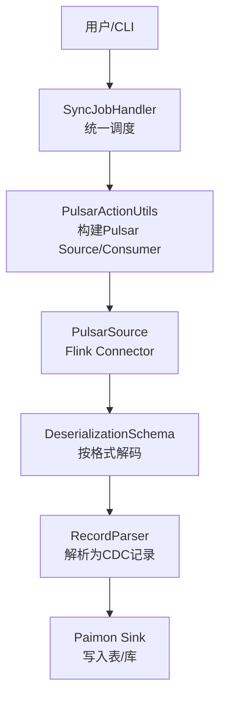
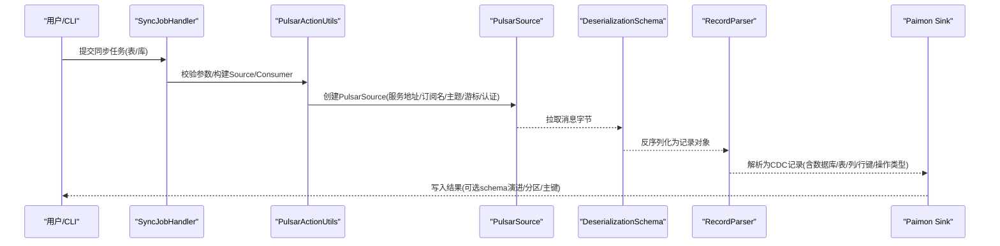
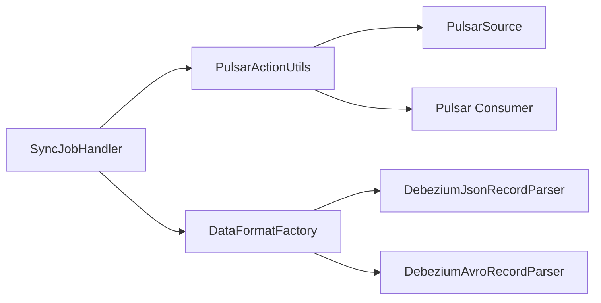
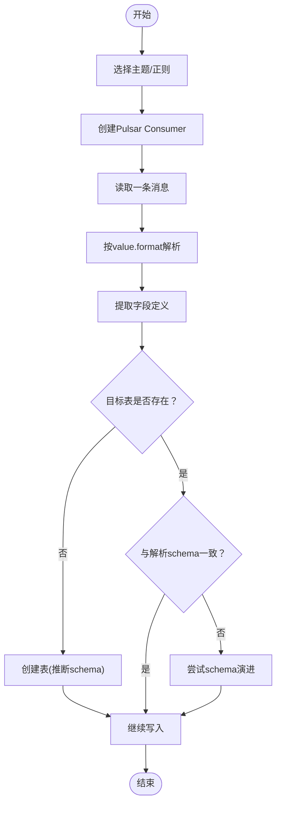

# Pulsar CDC

<cite>
**本文引用的文件**
- [pulsar-cdc.md](file://docs/content/cdc-ingestion/pulsar-cdc.md)
- [PulsarSyncTableAction.java](file://paimon-flink/paimon-flink-cdc/src/main/java/org/apache/paimon/flink/action/cdc/pulsar/PulsarSyncTableAction.java)
- [PulsarSyncDatabaseAction.java](file://paimon-flink/paimon-flink-cdc/src/main/java/org/apache/paimon/flink/action/cdc/pulsar/PulsarSyncDatabaseAction.java)
- [PulsarActionUtils.java](file://paimon-flink/paimon-flink-cdc/src/main/java/org/apache/paimon/flink/action/cdc/pulsar/PulsarActionUtils.java)
- [SyncJobHandler.java](file://paimon-flink/paimon-flink-cdc/src/main/java/org/apache/paimon/flink/action/cdc/SyncJobHandler.java)
- [DebeziumAvroDataFormat.java](file://paimon-flink/paimon-flink-cdc/src/main/java/org/apache/paimon/flink/action/cdc/format/debezium/DebeziumAvroDataFormat.java)
- [DebeziumAvroRecordParser.java](file://paimon-flink/paimon-flink-cdc/src/main/java/org/apache/paimon/flink/action/cdc/format/debezium/DebeziumAvroRecordParser.java)
- [PulsarSchemaITCase.java](file://paimon-flink/paimon-flink-cdc/src/test/java/org/apache/paimon/flink/action/cdc/pulsar/PulsarSchemaITCase.java)
- [PulsarActionITCaseBase.java](file://paimon-flink/paimon-flink-cdc/src/test/java/org/apache/paimon/flink/action/cdc/pulsar/PulsarActionITCaseBase.java)
- [write-performance.md](file://docs/content/maintenance/write-performance.md)
- [metrics.md](file://docs/content/maintenance/metrics.md)
</cite>

## 目录
1. [简介](#简介)
2. [项目结构](#项目结构)
3. [核心组件](#核心组件)
4. [架构总览](#架构总览)
5. [详细组件分析](#详细组件分析)
6. [依赖分析](#依赖分析)
7. [性能考虑](#性能考虑)
8. [故障排除指南](#故障排除指南)
9. [结论](#结论)
10. [附录](#附录)

## 简介
本文件系统性阐述 Apache Paimon 在 Flink CDC 中对 Apache Pulsar 的集成与使用，覆盖以下关键主题：
- Pulsar CDC 的实现原理与消息流处理机制
- Pulsar 主题到 Paimon 表的映射关系与同步策略（表同步与数据库同步）
- 配置参数详解（连接参数、命名空间与主题选择、起止游标、认证、格式与模式演进）
- 消息格式与 schema evolution 处理逻辑
- 容错与重试策略
- 实际配置示例与性能调优建议
- 常见问题排查与监控方法

## 项目结构
围绕 Pulsar CDC 的实现，主要涉及以下模块与文件：
- 文档：Pulsar CDC 使用与参数说明
- 同步动作：表级同步与数据库级同步
- 工具类：构建 Pulsar Source、消费者与数据格式解析
- 核心调度器：根据源类型提供 Source、反序列化器、解析器与消费者
- 测试用例：验证 schema 提取与基本行为
- 性能与监控：写入性能与指标体系

图表来源
- [SyncJobHandler.java:182-196](file://paimon-flink/paimon-flink-cdc/src/main/java/org/apache/paimon/flink/action/cdc/SyncJobHandler.java#L182-L196)
- [PulsarActionUtils.java:177-282](file://paimon-flink/paimon-flink-cdc/src/main/java/org/apache/paimon/flink/action/cdc/pulsar/PulsarActionUtils.java#L177-L282)

章节来源
- [pulsar-cdc.md:79-257](file://docs/content/cdc-ingestion/pulsar-cdc.md#L79-L257)
- [PulsarSyncTableAction.java:27-36](file://paimon-flink/paimon-flink-cdc/src/main/java/org/apache/paimon/flink/action/cdc/pulsar/PulsarSyncTableAction.java#L27-L36)
- [PulsarSyncDatabaseAction.java:29-44](file://paimon-flink/paimon-flink-cdc/src/main/java/org/apache/paimon/flink/action/cdc/pulsar/PulsarSyncDatabaseAction.java#L29-L44)
- [PulsarActionUtils.java:78-102](file://paimon-flink/paimon-flink-cdc/src/main/java/org/apache/paimon/flink/action/cdc/pulsar/PulsarActionUtils.java#L78-L102)
- [SyncJobHandler.java:153-165](file://paimon-flink/paimon-flink-cdc/src/main/java/org/apache/paimon/flink/action/cdc/SyncJobHandler.java#L153-L165)

## 核心组件
- PulsarSyncTableAction：面向单表同步，将一个或多个主题中的变更事件写入 Paimon 单表。
- PulsarSyncDatabaseAction：面向数据库同步，将多主题或多表的变更事件写入 Paimon 数据库，内部采用联合 sink。
- PulsarActionUtils：负责构建 Pulsar Source 与 Consumer，解析配置项（如 topic/topic-pattern、起止游标、认证、value.format 等），并支持从主题推断 schema。
- SyncJobHandler：根据源类型（Pulsar）提供 Source、反序列化器、解析器与消费者；校验必填参数。

章节来源
- [PulsarSyncTableAction.java:27-36](file://paimon-flink/paimon-flink-cdc/src/main/java/org/apache/paimon/flink/action/cdc/pulsar/PulsarSyncTableAction.java#L27-L36)
- [PulsarSyncDatabaseAction.java:29-44](file://paimon-flink/paimon-flink-cdc/src/main/java/org/apache/paimon/flink/action/cdc/pulsar/PulsarSyncDatabaseAction.java#L29-L44)
- [PulsarActionUtils.java:78-102](file://paimon-flink/paimon-flink-cdc/src/main/java/org/apache/paimon/flink/action/cdc/pulsar/PulsarActionUtils.java#L78-L102)
- [SyncJobHandler.java:153-165](file://paimon-flink/paimon-flink-cdc/src/main/java/org/apache/paimon/flink/action/cdc/SyncJobHandler.java#L153-L165)

## 架构总览
下图展示从 Pulsar 到 Paimon 的端到端流程：Source 读取消息 → 反序列化 → 解析为 CDC 记录 → 写入 Paimon。

图表来源
- [SyncJobHandler.java:182-196](file://paimon-flink/paimon-flink-cdc/src/main/java/org/apache/paimon/flink/action/cdc/SyncJobHandler.java#L182-L196)
- [PulsarActionUtils.java:177-282](file://paimon-flink/paimon-flink-cdc/src/main/java/org/apache/paimon/flink/action/cdc/pulsar/PulsarActionUtils.java#L177-L282)

## 详细组件分析

### 组件一：PulsarSyncTableAction（表同步）
- 角色：封装单表同步入口，继承自消息队列同步基类，指定源类型为 Pulsar。
- 关键点：
  - 自动推断/创建 Paimon 表（若不存在），schema 来自主题中最早非 DDL 数据的解析。
  - 支持分区键、主键、计算列、类型映射等表级配置。
  - 若主题为空，需先手动建表再提交作业。

章节来源
- [PulsarSyncTableAction.java:27-36](file://paimon-flink/paimon-flink-cdc/src/main/java/org/apache/paimon/flink/action/cdc/pulsar/PulsarSyncTableAction.java#L27-L36)
- [pulsar-cdc.md:79-136](file://docs/content/cdc-ingestion/pulsar-cdc.md#L79-L136)

### 组件二：PulsarSyncDatabaseAction（数据库同步）
- 角色：将多主题或多表的变更事件写入 Paimon 数据库，内部使用单一联合 sink。
- 关键点：
  - 仅同步带主键的表。
  - 对每个目标表进行 schema 演进尝试（若已存在且与解析 schema 不同）。
  - 支持表前缀/后缀、包含/排除规则、分区键、主键、类型映射等。

章节来源
- [PulsarSyncDatabaseAction.java:29-44](file://paimon-flink/paimon-flink-cdc/src/main/java/org/apache/paimon/flink/action/cdc/pulsar/PulsarSyncDatabaseAction.java#L29-L44)
- [pulsar-cdc.md:184-257](file://docs/content/cdc-ingestion/pulsar-cdc.md#L184-L257)

### 组件三：PulsarActionUtils（Source/Consumer/配置）
- 功能：
  - 构建 PulsarSource：设置服务地址、订阅名、主题/正则、起止游标、认证、未绑定/停止条件等。
  - 构建 Consumer：用于早期消费与 schema 推断。
  - 解析 value.format 并选择对应数据格式（如 canal-json、debezium-json、maxwell-json、ogg-json、json、debezium-avro）。
  - 支持从 topic 或 topic-pattern 推断一个可用主题，便于 schema 提取。
- 关键配置项（节选）：
  - value.format：值编码格式标识
  - topic/topic-pattern：主题或正则匹配
  - pulsar.startCursor.fromMessageId / fromPublishTime / fromMessageIdInclusive
  - pulsar.stopCursor.atMessageId / afterMessageId / atEventTime / afterEventTime
  - pulsar.source.unbounded：是否为无界流
  - schema.registry.url：当使用 debezium-avro 时的模式注册中心
  - pulsar.admin.adminUrl：兼容旧版 adminUrl（新版本由 connector 内部处理）

章节来源
- [PulsarActionUtils.java:78-102](file://paimon-flink/paimon-flink-cdc/src/main/java/org/apache/paimon/flink/action/cdc/pulsar/PulsarActionUtils.java#L78-L102)
- [PulsarActionUtils.java:177-282](file://paimon-flink/paimon-flink-cdc/src/main/java/org/apache/paimon/flink/action/cdc/pulsar/PulsarActionUtils.java#L177-L282)
- [pulsar-cdc.md:259-363](file://docs/content/cdc-ingestion/pulsar-cdc.md#L259-L363)

### 组件四：SyncJobHandler（统一调度）
- 功能：
  - 根据源类型提供 Source、反序列化器、解析器与消费者。
  - 校验 Pulsar 必填参数：value.format、服务地址、订阅名、topic/topic-pattern 二选一。
  - 为不同源类型提供默认作业名、驱动注册（如 JDBC）等。

章节来源
- [SyncJobHandler.java:153-165](file://paimon-flink/paimon-flink-cdc/src/main/java/org/apache/paimon/flink/action/cdc/SyncJobHandler.java#L153-L165)
- [SyncJobHandler.java:182-196](file://paimon-flink/paimon-flink-cdc/src/main/java/org/apache/paimon/flink/action/cdc/SyncJobHandler.java#L182-L196)

### 组件五：消息格式与 Schema Evolution
- 支持格式：canal-json、debezium-json、maxwell-json、ogg-json、json、debezium-avro。
- Schema 提取：
  - 通过 Pulsar Consumer 读取一条消息，结合 value.format 与反序列化器提取字段定义。
  - 测试用例验证了从 canal-json 主题提取 schema 的正确性。
- Schema 演进：
  - 数据库同步模式下，若目标表已存在且与解析 schema 不一致，会尝试执行 schema 演进。
  - 表同步模式下，首次运行会基于主题中最早非 DDL 数据推断 schema；若主题为空需先建表。

章节来源
- [pulsar-cdc.md:35-77](file://docs/content/cdc-ingestion/pulsar-cdc.md#L35-L77)
- [PulsarActionUtils.java:307-347](file://paimon-flink/paimon-flink-cdc/src/main/java/org/apache/paimon/flink/action/cdc/pulsar/PulsarActionUtils.java#L307-L347)
- [PulsarSchemaITCase.java:44-69](file://paimon-flink/paimon-flink-cdc/src/test/java/org/apache/paimon/flink/action/cdc/pulsar/PulsarSchemaITCase.java#L44-L69)
- [pulsar-cdc.md:103-104](file://docs/content/cdc-ingestion/pulsar-cdc.md#L103-L104)

### 组件六：Debezium Avro（可选高级格式）
- 当使用 debezium-avro 时，需要提供 schema.registry.url。
- 解析器会从 source 字段中提取数据库/表名等元信息，并对 union 类型进行清洗处理。

章节来源
- [DebeziumAvroDataFormat.java:37-54](file://paimon-flink/paimon-flink-cdc/src/main/java/org/apache/paimon/flink/action/cdc/format/debezium/DebeziumAvroDataFormat.java#L37-L54)
- [DebeziumAvroRecordParser.java:167-211](file://paimon-flink/paimon-flink-cdc/src/main/java/org/apache/paimon/flink/action/cdc/format/debezium/DebeziumAvroRecordParser.java#L167-L211)
- [pulsar-cdc.md:355-360](file://docs/content/cdc-ingestion/pulsar-cdc.md#L355-L360)

## 依赖分析
- Pulsar CDC 依赖 Flink Pulsar Connector 构建 Source 与 Consumer。
- 数据格式依赖 DataFormatFactory 与具体 RecordParser（如 DebeziumJsonRecordParser、DebeziumAvroRecordParser 等）。
- SyncJobHandler 将源类型与工具类解耦，便于扩展其他消息队列源。

图表来源
- [SyncJobHandler.java:221-231](file://paimon-flink/paimon-flink-cdc/src/main/java/org/apache/paimon/flink/action/cdc/SyncJobHandler.java#L221-L231)
- [PulsarActionUtils.java:302-304](file://paimon-flink/paimon-flink-cdc/src/main/java/org/apache/paimon/flink/action/cdc/pulsar/PulsarActionUtils.java#L302-L304)

章节来源
- [SyncJobHandler.java:221-231](file://paimon-flink/paimon-flink-cdc/src/main/java/org/apache/paimon/flink/action/cdc/SyncJobHandler.java#L221-L231)
- [PulsarActionUtils.java:302-304](file://paimon-flink/paimon-flink-cdc/src/main/java/org/apache/paimon/flink/action/cdc/pulsar/PulsarActionUtils.java#L302-L304)

## 性能考虑
- 写入性能与检查点密切相关，建议：
  - 增大检查点间隔、限制并发检查点数量，或在批量模式下运行
  - 调整写缓冲大小与可溢出策略
  - 在固定桶模式下合理调整桶数
- 指标体系：
  - Paimon 提供 Gauge/Counter/Histogram 指标，涵盖提交、扫描、写入、合并等维度，可对接 Flink/Spark 引擎
- 具体参数与建议参见“写入性能”文档。

章节来源
- [write-performance.md:29-44](file://docs/content/maintenance/write-performance.md#L29-L44)
- [metrics.md:27-38](file://docs/content/maintenance/metrics.md#L27-L38)

## 故障排除指南
- 参数校验失败：
  - 缺少必填项：value.format、服务地址、订阅名、topic 或 topic-pattern 二选一
  - 同时设置多个游标选项或冲突的游标配置
- 主题为空导致无法推断 schema：
  - 表同步模式：需先手动建表再提交作业
- JSON 格式缺失字段类型/库名/表名/主键：
  - Paimon 默认使用字符串类型；数据库/表名缺失时无法做数据库同步；主键缺失可能创建非主键表
- Avro 格式缺少 schema.registry.url：
  - 使用 debezium-avro 时必须提供注册中心地址
- 运行期异常：
  - 检查 Pulsar 连接、认证参数与网络连通性
  - 关注 Paimon 指标与日志定位瓶颈

章节来源
- [SyncJobHandler.java:153-165](file://paimon-flink/paimon-flink-cdc/src/main/java/org/apache/paimon/flink/action/cdc/SyncJobHandler.java#L153-L165)
- [PulsarActionUtils.java:200-244](file://paimon-flink/paimon-flink-cdc/src/main/java/org/apache/paimon/flink/action/cdc/pulsar/PulsarActionUtils.java#L200-L244)
- [pulsar-cdc.md:69-77](file://docs/content/cdc-ingestion/pulsar-cdc.md#L69-L77)
- [pulsar-cdc.md:355-360](file://docs/content/cdc-ingestion/pulsar-cdc.md#L355-L360)

## 结论
Pulsar CDC 在 Paimon 中通过统一的调度器与工具类，实现了对多种消息格式的支持与灵活的同步模式（表/库）。其配置项覆盖连接、主题选择、游标控制、认证与格式等关键方面；在 schema 提取与演进方面具备良好能力。配合 Paimon 的指标体系与写入性能调优建议，可在生产环境中稳定高效地完成数据同步。

## 附录

### A. 配置参数速查（Pulsar）
- 必填项
  - value.format：值编码格式标识
  - pulsar.client.serviceUrl：Pulsar 服务地址
  - pulsar.consumer.subscriptionName：订阅名称
  - topic 或 topic-pattern：二选一
- 可选项（节选）
  - pulsar.startCursor.fromMessageId / fromPublishTime / fromMessageIdInclusive
  - pulsar.stopCursor.atMessageId / afterMessageId / atEventTime / afterEventTime
  - pulsar.source.unbounded：是否为无界流
  - schema.registry.url：当使用 debezium-avro 时的模式注册中心
  - pulsar.admin.adminUrl：兼容旧版 adminUrl（新版本由 connector 内部处理）

章节来源
- [pulsar-cdc.md:259-363](file://docs/content/cdc-ingestion/pulsar-cdc.md#L259-L363)
- [SyncJobHandler.java:153-165](file://paimon-flink/paimon-flink-cdc/src/main/java/org/apache/paimon/flink/action/cdc/SyncJobHandler.java#L153-L165)

### B. 表同步与数据库同步对比
- 表同步（pulsar_sync_table）
  - 适用：单表或少量主题到单表
  - 特点：自动/手动建表、支持分区键/主键/计算列
- 数据库同步（pulsar_sync_database）
  - 适用：多主题/多表到同一数据库
  - 特点：单一联合 sink、仅同步有主键的表、尝试 schema 演进

章节来源
- [pulsar-cdc.md:79-136](file://docs/content/cdc-ingestion/pulsar-cdc.md#L79-L136)
- [pulsar-cdc.md:184-257](file://docs/content/cdc-ingestion/pulsar-cdc.md#L184-L257)

### C. Schema 提取与演进流程

图表来源
- [PulsarActionUtils.java:307-347](file://paimon-flink/paimon-flink-cdc/src/main/java/org/apache/paimon/flink/action/cdc/pulsar/PulsarActionUtils.java#L307-L347)
- [PulsarSchemaITCase.java:44-69](file://paimon-flink/paimon-flink-cdc/src/test/java/org/apache/paimon/flink/action/cdc/pulsar/PulsarSchemaITCase.java#L44-L69)
- [pulsar-cdc.md:103-104](file://docs/content/cdc-ingestion/pulsar-cdc.md#L103-L104)