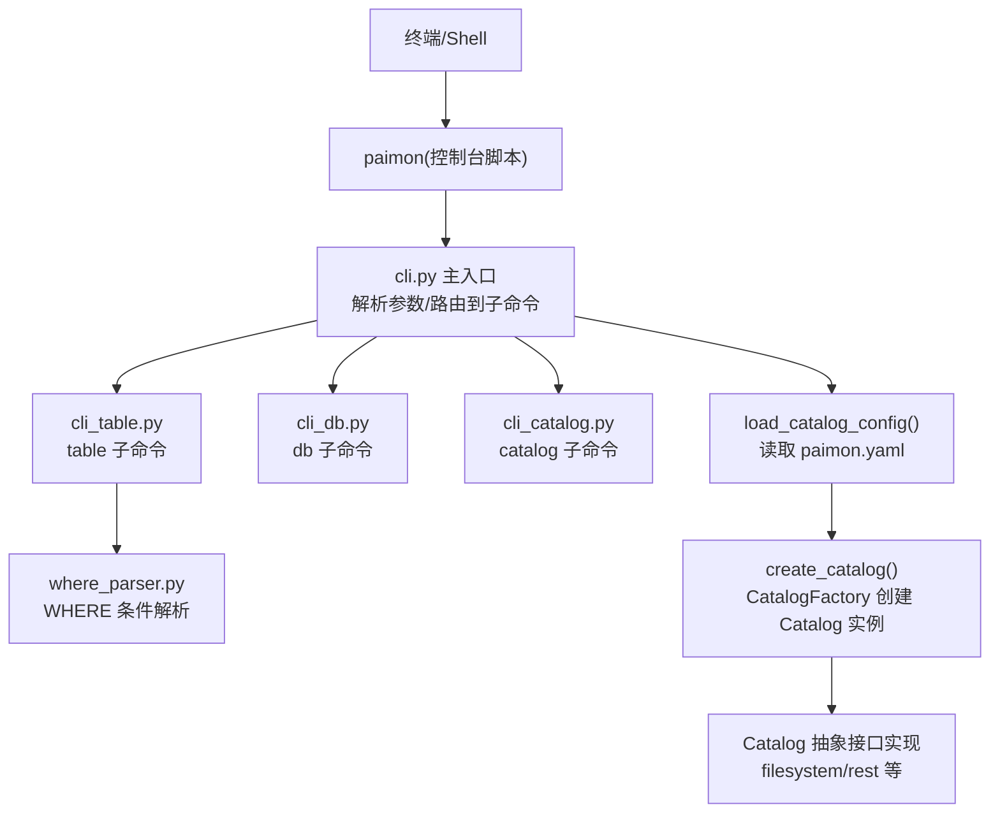
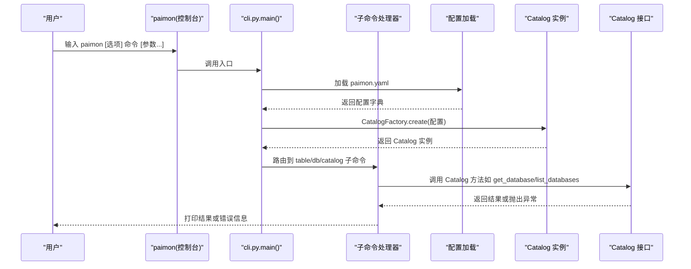
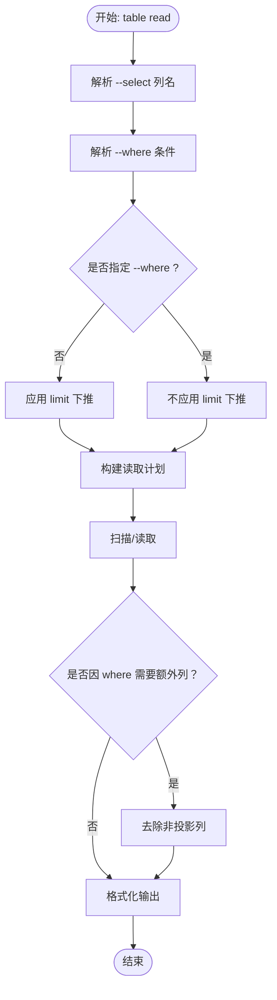
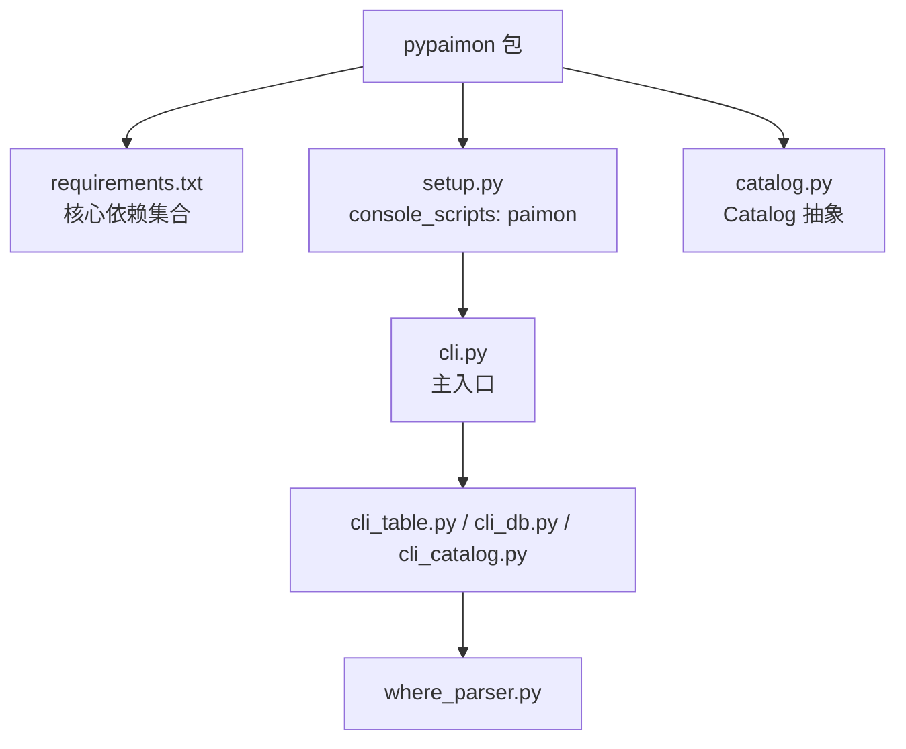

# CLI工具

<cite>
**本文引用的文件**
- [cli.py](file://paimon-python/pypaimon/cli/cli.py)
- [cli_catalog.py](file://paimon-python/pypaimon/cli/cli_catalog.py)
- [cli_db.py](file://paimon-python/pypaimon/cli/cli_db.py)
- [cli_table.py](file://paimon-python/pypaimon/cli/cli_table.py)
- [where_parser.py](file://paimon-python/pypaimon/cli/where_parser.py)
- [setup.py](file://paimon-python/setup.py)
- [requirements.txt](file://paimon-python/dev/requirements.txt)
- [cli.md](file://docs/content/pypaimon/cli.md)
- [README.md](file://paimon-python/README.md)
- [catalog.py](file://paimon-python/pypaimon/catalog/catalog.py)
- [cli_db_test.py](file://paimon-python/pypaimon/tests/cli_db_test.py)
- [cli_table_test.py](file://paimon-python/pypaimon/tests/cli_table_test.py)
</cite>

## 目录
1. [简介](#简介)
2. [项目结构](#项目结构)
3. [核心组件](#核心组件)
4. [架构总览](#架构总览)
5. [详细组件分析](#详细组件分析)
6. [依赖分析](#依赖分析)
7. [性能考虑](#性能考虑)
8. [故障排查指南](#故障排查指南)
9. [结论](#结论)
10. [附录](#附录)

## 简介
本指南面向使用 Apache Paimon 的 Python CLI 工具（命令：paimon）的用户，涵盖安装、配置、命令详解、使用场景与最佳实践，以及与 Python API 的关系与选型建议。CLI 提供 catalog、database、table 三大类命令，支持从配置文件加载元数据目录、对数据库与表进行增删改查、读取数据、导入导出、模式变更与分区列表等操作。

## 项目结构
- CLI 入口与分发：通过 setuptools 的 console_scripts 将 paimon 命令指向模块入口。
- 子命令模块：按功能拆分为 catalog、db、table 三个子模块，每个模块负责解析自身子命令并调用 Catalog 接口执行。
- 配置与运行时：默认从当前目录读取 paimon.yaml；支持 filesystem 与 rest 两种目录类型。
- 文档与测试：官方文档提供详尽的命令说明与示例；单元测试覆盖关键命令的集成行为。

图表来源
- [cli.py:89-138](file://paimon-python/pypaimon/cli/cli.py#L89-L138)
- [cli_table.py:650-772](file://paimon-python/pypaimon/cli/cli_table.py#L650-L772)
- [cli_db.py:201-280](file://paimon-python/pypaimon/cli/cli_db.py#L201-L280)
- [cli_catalog.py:54-66](file://paimon-python/pypaimon/cli/cli_catalog.py#L54-L66)
- [where_parser.py:72-99](file://paimon-python/pypaimon/cli/where_parser.py#L72-L99)
- [setup.py:53-57](file://paimon-python/setup.py#L53-L57)

章节来源
- [setup.py:53-57](file://paimon-python/setup.py#L53-L57)
- [cli.py:89-138](file://paimon-python/pypaimon/cli/cli.py#L89-L138)

## 核心组件
- paimon 命令入口：解析全局参数（如配置文件路径）、注册 catalog/db/table 三类子命令，并根据子命令路由到对应处理函数。
- 配置加载：默认读取 paimon.yaml，校验必需字段（metastore、warehouse 或 uri），并据此创建 Catalog 实例。
- Catalog 抽象：统一的数据库与表管理接口，具体实现由 CatalogFactory 基于配置选择（如 filesystem 或 rest）。
- 表读取与过滤：table read 支持列投影、WHERE 过滤、limit 控制、输出格式切换；WHERE 解析器支持常见比较、IN/BETWEEN/LIKE/IS NULL 等。
- 数据导入：table import 支持 CSV/JSON 文件批量写入现有表。
- 模式变更：table alter 支持选项设置/移除、列新增/删除/重命名、列类型/注释/位置变更等。
- 分区列表：table list-partitions 支持按模式筛选与表格/JSON 输出。
- 数据库操作：db get/create/drop/alter/list-tables；catalog list-dbs 列举目录内所有数据库。

章节来源
- [cli.py:32-87](file://paimon-python/pypaimon/cli/cli.py#L32-L87)
- [catalog.py:29-131](file://paimon-python/pypaimon/catalog/catalog.py#L29-L131)
- [cli_table.py:650-845](file://paimon-python/pypaimon/cli/cli_table.py#L650-L845)
- [cli_db.py:201-280](file://paimon-python/pypaimon/cli/cli_db.py#L201-L280)
- [cli_catalog.py:54-66](file://paimon-python/pypaimon/cli/cli_catalog.py#L54-L66)

## 架构总览
下图展示了 CLI 的调用链路：命令行参数经主入口解析后，按子命令分发至各模块；模块通过配置加载 Catalog 实例，再调用 Catalog 接口完成元数据与数据操作。

图表来源
- [cli.py:89-138](file://paimon-python/pypaimon/cli/cli.py#L89-L138)
- [cli_table.py:28-148](file://paimon-python/pypaimon/cli/cli_table.py#L28-L148)
- [cli_db.py:28-118](file://paimon-python/pypaimon/cli/cli_db.py#L28-L118)
- [cli_catalog.py:27-52](file://paimon-python/pypaimon/cli/cli_catalog.py#L27-L52)

## 详细组件分析

### 安装与配置
- 安装：通过 pip 安装 pypaimon 后，系统会自动注册 paimon 命令。
- 配置文件：默认读取当前目录下的 paimon.yaml。支持 filesystem 与 rest 两类目录：
  - filesystem：需要指定 warehouse 路径。
  - rest：需要指定 uri 与 warehouse（目录名）。
- 环境变量：CLI 未定义专用环境变量；可通过 shell alias 或 PATH 将 paimon 固定为常用别名，便于在多项目中复用。

章节来源
- [cli.md:32-72](file://docs/content/pypaimon/cli.md#L32-L72)
- [cli.py:32-72](file://paimon-python/pypaimon/cli/cli.py#L32-L72)
- [setup.py:53-57](file://paimon-python/setup.py#L53-L57)

### CLI 入口与参数解析
- 全局参数
  - --config/-c：指定配置文件路径，默认 paimon.yaml。
  - --help：打印帮助。
- 子命令
  - table：表级操作（读取、获取模式、快照、创建、导入、删除、重命名、变更、分区列表等）。
  - db：数据库级操作（获取、创建、删除、变更属性、列出表）。
  - catalog：目录级操作（列举数据库）。

章节来源
- [cli.py:89-138](file://paimon-python/pypaimon/cli/cli.py#L89-L138)
- [cli_table.py:650-772](file://paimon-python/pypaimon/cli/cli_table.py#L650-L772)
- [cli_db.py:201-280](file://paimon-python/pypaimon/cli/cli_db.py#L201-L280)
- [cli_catalog.py:54-66](file://paimon-python/pypaimon/cli/cli_catalog.py#L54-L66)

### 表命令（table）
- table read
  - 功能：读取表数据，支持列投影、WHERE 过滤、limit 控制、输出格式（table/json）。
  - 关键点：当同时指定 select 与 where 时，会自动将 where 引用的列加入投影，确保过滤正确性；limit 在无 where 时可下推，避免提前截断导致结果不足。
  - WHERE 解析：支持 =、!=、<、<=、>、>=、IS NULL/NOT NULL、IN/NOT IN、BETWEEN、LIKE、AND/OR 及括号分组；字段类型自动匹配。
- table get
  - 功能：输出表模式的 JSON，可用于备份/复用。
- table snapshot
  - 功能：输出最新快照元数据 JSON；仅对 FileStoreTable 类型有效。
- table create
  - 功能：基于 JSON 模式文件创建表；支持忽略已存在。
- table import
  - 功能：从 CSV/JSON 导入数据到现有表；自动转换为 PyArrow Schema 并写入。
- table drop/rename
  - 功能：删除/重命名表；重命名需源目标均为 database.table 格式。
- table alter
  - 功能：支持设置/移除表选项、新增/删除/重命名列、修改列类型/注释/位置、更新表注释等。
- table list-partitions
  - 功能：列出分区并支持按模式筛选；支持表格/JSON 输出。

图表来源
- [cli_table.py:28-148](file://paimon-python/pypaimon/cli/cli_table.py#L28-L148)
- [where_parser.py:72-99](file://paimon-python/pypaimon/cli/where_parser.py#L72-L99)

章节来源
- [cli_table.py:28-845](file://paimon-python/pypaimon/cli/cli_table.py#L28-L845)
- [where_parser.py:51-377](file://paimon-python/pypaimon/cli/where_parser.py#L51-L377)

### 数据库命令（db）
- db get：输出数据库信息 JSON（名称、选项、可选注释）。
- db create：创建数据库，支持传入属性 JSON 与忽略已存在标志。
- db drop：删除数据库，支持忽略不存在与级联删除（先清空表）。
- db alter：设置/移除数据库属性；部分目录实现可能不支持。
- db list-tables：列出数据库内所有表。

章节来源
- [cli_db.py:28-280](file://paimon-python/pypaimon/cli/cli_db.py#L28-L280)

### 目录命令（catalog）
- catalog list-dbs：列出目录中的所有数据库。

章节来源
- [cli_catalog.py:27-66](file://paimon-python/pypaimon/cli/cli_catalog.py#L27-L66)

### Python API 关系与选型建议
- CLI 与 API 的关系：CLI 是对 Catalog 接口的命令行封装，底层仍使用 CatalogFactory 创建 Catalog 实例并调用其方法。
- 何时选 CLI：
  - 快速验证/调试：直接在终端执行读取、导入、列出等操作。
  - 自动化脚本：结合 shell 脚本或 CI/CD 流水线，无需引入 Python 环境。
  - 大批量离线任务：适合批处理、定时任务。
- 何时选 Python API：
  - 复杂业务逻辑：需要在代码中组合多次操作、事务控制、条件分支。
  - 与现有 Python 生态集成：如 Pandas、Airflow、Spark 等。
  - 需要细粒度错误处理与可观测性。

章节来源
- [catalog.py:29-131](file://paimon-python/pypaimon/catalog/catalog.py#L29-L131)
- [cli.py:75-87](file://paimon-python/pypaimon/cli/cli.py#L75-L87)

## 依赖分析
- 安装依赖：pypaimon 包含 pandas、pyarrow、fastavro、pyyaml 等核心依赖，用于数据读写与配置解析。
- 可选依赖：ray、torch、lance 等，用于特定场景扩展。
- CLI 依赖：argparse、yaml、sys/os 等标准库；where_parser 依赖 predicate/predicate_builder 与数据类型模块。

图表来源
- [setup.py:26-42](file://paimon-python/setup.py#L26-L42)
- [requirements.txt:18-39](file://paimon-python/dev/requirements.txt#L18-L39)
- [cli.py:24-29](file://paimon-python/pypaimon/cli/cli.py#L24-L29)

章节来源
- [setup.py:26-42](file://paimon-python/setup.py#L26-L42)
- [requirements.txt:18-39](file://paimon-python/dev/requirements.txt#L18-L39)

## 性能考虑
- table read
  - limit 下推：仅在无 where 条件时启用，避免过滤前截断导致结果不足。
  - 列投影：减少读取字段数量，降低 IO 与内存占用。
  - where 解析：仅支持原子类型字段参与过滤；复杂表达式建议在上游预处理。
- table import
  - 使用 PyArrow Schema 对齐数据类型，减少转换成本。
  - 大文件建议分批导入，避免单次提交过大。
- where 条件
  - 字段类型自动匹配，避免字符串与数值比较引发的隐式转换开销。
  - IN/BETWEEN/LIKE 等操作在大规模数据上应谨慎使用，优先考虑分区裁剪。

章节来源
- [cli_table.py:96-148](file://paimon-python/pypaimon/cli/cli_table.py#L96-L148)
- [where_parser.py:117-133](file://paimon-python/pypaimon/cli/where_parser.py#L117-L133)

## 故障排查指南
- 配置文件缺失或格式错误
  - 现象：提示找不到配置文件或配置为空。
  - 处理：确认 paimon.yaml 存在且包含必需字段（filesystem 需 warehouse；rest 需 uri 与 warehouse）。
- 表标识符格式错误
  - 现象：提示 table identifier 格式不正确。
  - 处理：确保使用 database.table 格式。
- WHERE 条件无效
  - 现象：提示 WHERE 条件无法解析或字段不存在。
  - 处理：检查字段名拼写、类型是否为原子类型、运算符是否受支持。
- 数据库/表不存在
  - 现象：执行 get/drop/alter 等时报错。
  - 处理：确认对象是否存在；必要时添加忽略标志（如 --ignore-if-not-exists）。
- 目录不支持某些操作
  - 现象：alter_database 或 rename_table 抛出 not supported。
  - 处理：更换支持该能力的目录实现（如 rest）。

章节来源
- [cli.py:32-72](file://paimon-python/pypaimon/cli/cli.py#L32-L72)
- [cli_table.py:28-148](file://paimon-python/pypaimon/cli/cli_table.py#L28-L148)
- [cli_db.py:28-118](file://paimon-python/pypaimon/cli/cli_db.py#L28-L118)
- [cli_catalog.py:27-52](file://paimon-python/pypaimon/cli/cli_catalog.py#L27-L52)

## 结论
Paimon 的 Python CLI 为日常运维与快速验证提供了高效工具，覆盖了从数据读取、导入到模式变更与分区管理的完整链路。对于简单场景与自动化脚本，CLI 是首选；对于复杂业务与深度集成，Python API 更具灵活性。通过合理的配置与命令组合，可显著提升数据管理工作效率。

## 附录

### 常见命令组合与工作流示例
- 快速读取与导出
  - 读取限制结果并以 JSON 输出，便于后续脚本处理。
  - 组合列投影与 WHERE 过滤，提升查询效率。
- 批量数据导入
  - 将 CSV/JSON 文件导入现有表，支持增量追加。
- 模式迁移
  - 先 table get 导出模式，再 table create 基于同一模式重建表，保证一致性。
- 分区管理
  - 使用 table list-partitions 与模式筛选定位目标分区，辅助清理与归档。

章节来源
- [cli_table.py:650-845](file://paimon-python/pypaimon/cli/cli_table.py#L650-L845)
- [cli_db.py:201-280](file://paimon-python/pypaimon/cli/cli_db.py#L201-L280)
- [cli_catalog.py:54-66](file://paimon-python/pypaimon/cli/cli_catalog.py#L54-L66)
- [cli.md:73-582](file://docs/content/pypaimon/cli.md#L73-L582)