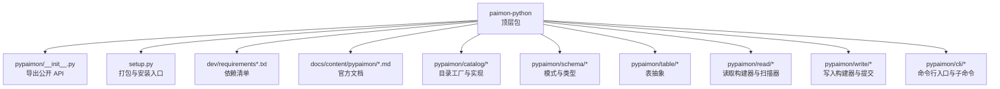
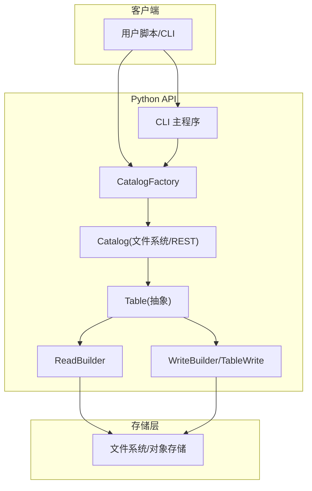
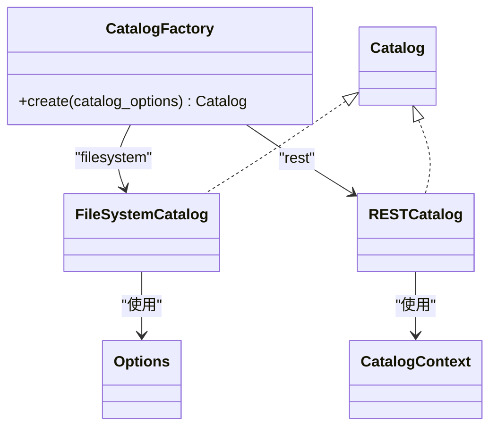
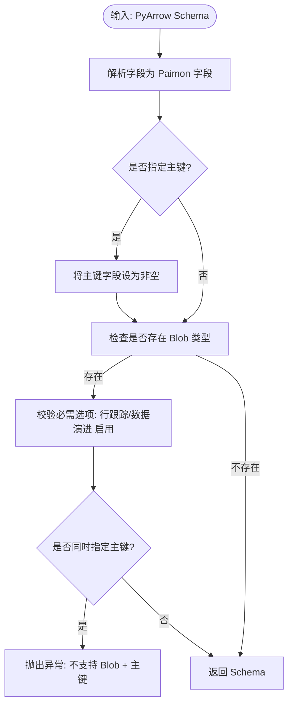
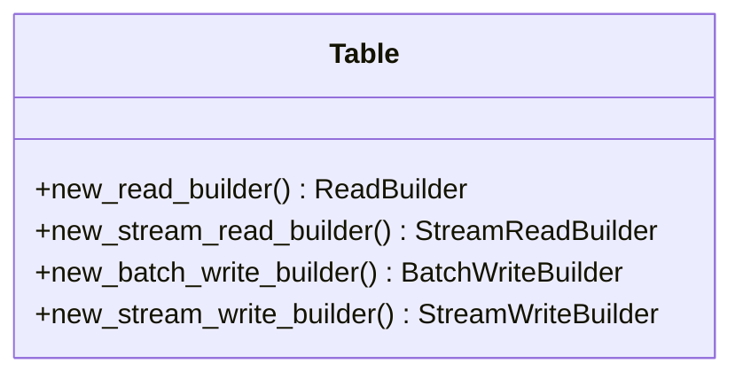
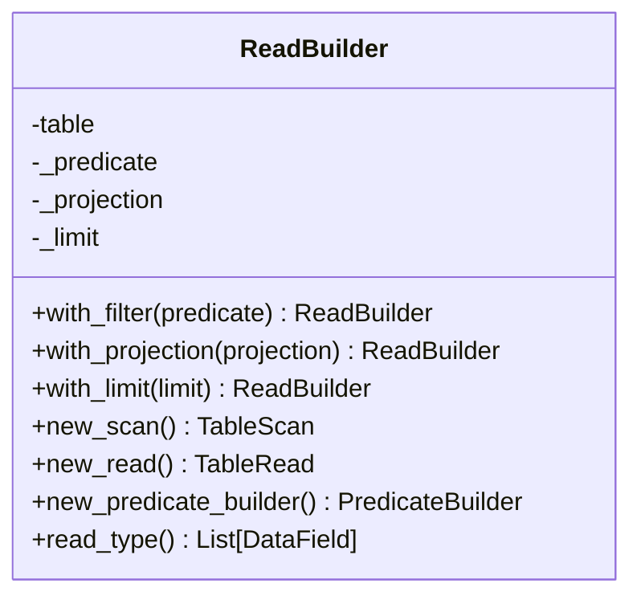
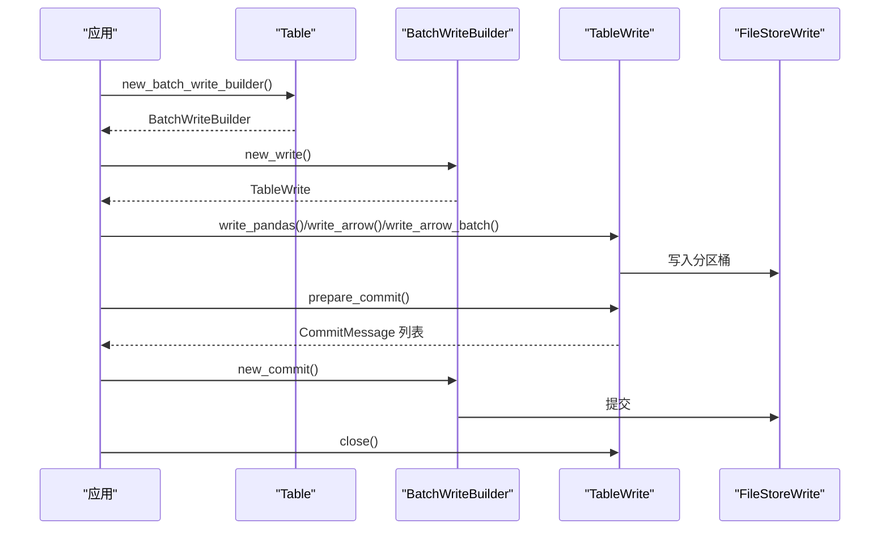
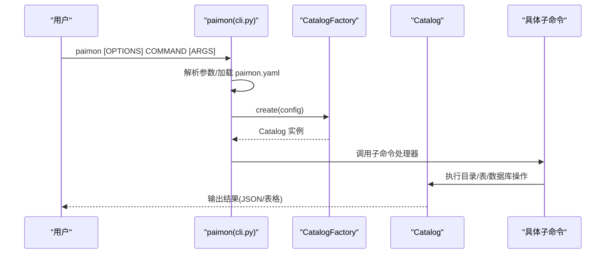
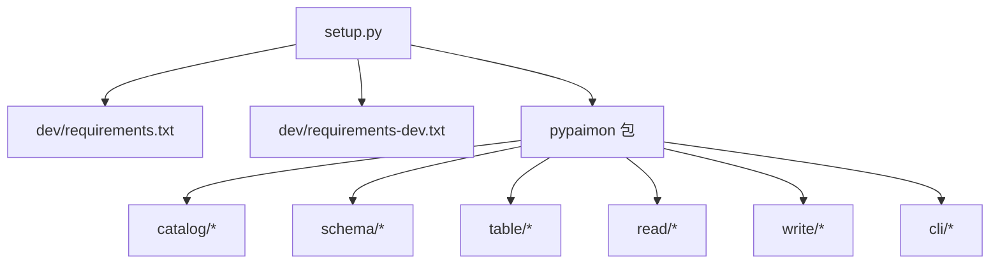

# Python API

<cite>
**本文引用的文件**
- [README.md](file://paimon-python/README.md)
- [setup.py](file://paimon-python/setup.py)
- [__init__.py](file://paimon-python/pypaimon/__init__.py)
- [requirements.txt](file://paimon-python/dev/requirements.txt)
- [requirements-dev.txt](file://paimon-python/dev/requirements-dev.txt)
- [python-api.md](file://docs/content/pypaimon/python-api.md)
- [cli.md](file://docs/content/pypaimon/cli.md)
- [catalog_factory.py](file://paimon-python/pypaimon/catalog/catalog_factory.py)
- [schema.py](file://paimon-python/pypaimon/schema/schema.py)
- [cli.py](file://paimon-python/pypaimon/cli/cli.py)
- [table.py](file://paimon-python/pypaimon/table/table.py)
- [read_builder.py](file://paimon-python/pypaimon/read/read_builder.py)
- [table_write.py](file://paimon-python/pypaimon/write/table_write.py)
</cite>

## 目录
1. [简介](#简介)
2. [项目结构](#项目结构)
3. [核心组件](#核心组件)
4. [架构总览](#架构总览)
5. [详细组件分析](#详细组件分析)
6. [依赖关系分析](#依赖关系分析)
7. [性能考虑](#性能考虑)
8. [故障排查指南](#故障排查指南)
9. [结论](#结论)
10. [附录](#附录)

## 简介
本文件为 Apache Paimon 的 Python API 文档，面向希望在 Python 环境中使用 Paimon 进行表管理、数据读写与流式消费的开发者。内容涵盖：
- 安装与环境配置（含依赖与可选扩展）
- Python API 参考（类、方法与参数说明）
- 常用操作示例（创建目录、数据库、表；批量读写；流式读取；回滚与快照）
- CLI 工具使用（命令、参数与典型场景）
- 与 Java API 的对应关系，帮助 Java 用户快速上手
- 与 Pandas、PyArrow 等生态库的集成方式
- 性能优化建议与最佳实践

## 项目结构
paimon-python 模块位于仓库的 paimon-python 目录下，包含核心 API、CLI、目录与表抽象、读写实现、类型系统、文件系统适配等子模块。顶层 setup.py 提供打包与安装入口，README.md 提供基本使用说明。

图表来源
- [__init__.py:26-38](file://paimon-python/pypaimon/__init__.py#L26-L38)
- [setup.py:47-57](file://paimon-python/setup.py#L47-L57)
- [requirements.txt:18-39](file://paimon-python/dev/requirements.txt#L18-L39)
- [requirements-dev.txt:20-28](file://paimon-python/dev/requirements-dev.txt#L20-L28)

章节来源
- [README.md:1-34](file://paimon-python/README.md#L1-L34)
- [setup.py:18-92](file://paimon-python/setup.py#L18-L92)
- [__init__.py:18-39](file://paimon-python/pypaimon/__init__.py#L18-L39)

## 核心组件
- 目录工厂：根据配置创建不同类型的目录（文件系统目录、REST 目录）
- 模式 Schema：从 PyArrow Schema 转换为 Paimon 字段定义，并校验 Blob 类型约束
- 表抽象 Table：统一读写接口，提供批处理与流式读写构建器
- 读取构建器 ReadBuilder：支持谓词下推、投影下推、分片规划与多种输出格式
- 写入构建器 TableWrite：支持 PyArrow/Pandas/Ray 数据源写入，两阶段提交
- CLI：命令行工具，支持表读取、Schema 获取、快照查看、表创建/导入/重命名/删除、数据库管理、目录级操作

章节来源
- [catalog_factory.py:28-45](file://paimon-python/pypaimon/catalog/catalog_factory.py#L28-L45)
- [schema.py:28-96](file://paimon-python/pypaimon/schema/schema.py#L28-L96)
- [table.py:26-44](file://paimon-python/pypaimon/table/table.py#L26-L44)
- [read_builder.py:29-79](file://paimon-python/pypaimon/read/read_builder.py#L29-L79)
- [table_write.py:32-148](file://paimon-python/pypaimon/write/table_write.py#L32-L148)
- [cli.py:89-138](file://paimon-python/pypaimon/cli/cli.py#L89-L138)

## 架构总览
下图展示了 Python API 的高层架构：客户端通过 CatalogFactory 创建目录，Catalog 提供数据库与表的生命周期管理；Table 抽象提供统一的读写接口；ReadBuilder/WriteBuilder 将谓词与投影下推到存储层；CLI 作为命令行入口对接 Catalog。

图表来源
- [catalog_factory.py:35-45](file://paimon-python/pypaimon/catalog/catalog_factory.py#L35-L45)
- [table.py:26-44](file://paimon-python/pypaimon/table/table.py#L26-L44)
- [read_builder.py:52-64](file://paimon-python/pypaimon/read/read_builder.py#L52-L64)
- [table_write.py:42-63](file://paimon-python/pypaimon/write/table_write.py#L42-L63)
- [cli.py:89-138](file://paimon-python/pypaimon/cli/cli.py#L89-L138)

## 详细组件分析

### 目录工厂 CatalogFactory
- 支持目录类型注册与动态创建
- 依据配置中的元存储类型选择具体目录实现
- 对 REST 目录传入 CatalogContext，对文件系统目录直接传入 Options

图表来源
- [catalog_factory.py:28-45](file://paimon-python/pypaimon/catalog/catalog_factory.py#L28-L45)

章节来源
- [catalog_factory.py:28-45](file://paimon-python/pypaimon/catalog/catalog_factory.py#L28-L45)

### 模式 Schema
- 从 PyArrow Schema 转换为 Paimon 字段列表
- 主键字段自动设为非空
- 若包含 Blob 类型，强制开启行跟踪与数据演进，并禁止主键

图表来源
- [schema.py:52-96](file://paimon-python/pypaimon/schema/schema.py#L52-L96)

章节来源
- [schema.py:28-96](file://paimon-python/pypaimon/schema/schema.py#L28-L96)

### 表抽象 Table
- 统一的读写接口：批处理读写、流式读写
- 通过构建器暴露高级能力（谓词/投影/限制/分片）

图表来源
- [table.py:26-44](file://paimon-python/pypaimon/table/table.py#L26-L44)

章节来源
- [table.py:19-44](file://paimon-python/pypaimon/table/table.py#L19-L44)

### 读取构建器 ReadBuilder
- 支持谓词下推、投影下推、限制
- 生成 TableScan 与 TableRead，用于后续分片规划与结果输出

图表来源
- [read_builder.py:29-79](file://paimon-python/pypaimon/read/read_builder.py#L29-L79)

章节来源
- [read_builder.py:29-79](file://paimon-python/pypaimon/read/read_builder.py#L29-L79)

### 写入构建器与提交 TableWrite
- 支持 PyArrow 表/记录批次/Pandas 写入
- 支持 Ray Dataset 写入
- 批量写入采用两阶段提交，一次提交后不可再写

图表来源
- [table_write.py:42-148](file://paimon-python/pypaimon/write/table_write.py#L42-L148)

章节来源
- [table_write.py:32-148](file://paimon-python/pypaimon/write/table_write.py#L32-L148)

### CLI 工具
- 入口命令 paimon，支持 table/db/catalog 子命令
- 通过 paimon.yaml 加载目录配置
- 支持表读取、Schema 导出、快照查看、表创建/导入/重命名/删除、数据库管理、目录级操作

图表来源
- [cli.py:89-138](file://paimon-python/pypaimon/cli/cli.py#L89-L138)
- [cli.md:64-107](file://docs/content/pypaimon/cli.md#L64-L107)

章节来源
- [cli.py:32-87](file://paimon-python/pypaimon/cli/cli.py#L32-L87)
- [cli.py:89-138](file://paimon-python/pypaimon/cli/cli.py#L89-L138)
- [cli.md:1-582](file://docs/content/pypaimon/cli.md#L1-L582)

## 依赖关系分析
- 安装入口 setup.py 中定义了核心依赖与可选扩展
- requirements.txt 与 requirements-dev.txt 分别列出运行时与测试/开发依赖
- Python 版本兼容性在 setup.py 与 requirements.txt 中均有体现

图表来源
- [setup.py:26-42](file://paimon-python/setup.py#L26-L42)
- [requirements.txt:18-39](file://paimon-python/dev/requirements.txt#L18-L39)
- [requirements-dev.txt:20-28](file://paimon-python/dev/requirements-dev.txt#L20-L28)

章节来源
- [setup.py:26-92](file://paimon-python/setup.py#L26-L92)
- [requirements.txt:18-39](file://paimon-python/dev/requirements.txt#L18-L39)
- [requirements-dev.txt:20-28](file://paimon-python/dev/requirements-dev.txt#L20-L28)

## 性能考虑
- 读取侧
  - 使用谓词下推与投影下推减少传输与解析开销
  - 使用分片/分桶过滤（如 with_shard、with_bucket_filter）提升并行度
  - 流式读取配合 poll 间隔与行种类控制，平衡延迟与吞吐
- 写入侧
  - 批量写入采用两阶段提交，避免中间态可见
  - Ray 写入支持并发与远程任务参数，按资源动态调度
- 存储侧
  - 合理设置分桶数与分区键，避免热点与小文件过多
  - 使用压缩与列式格式（PyArrow）提升 IO 效率

## 故障排查指南
- 目录配置错误
  - 确认 paimon.yaml 中的 metastore 与 warehouse 正确
  - REST 目录需提供 uri、token.provider 等必要项
- Schema 校验失败
  - Blob 类型必须启用行跟踪与数据演进，且不能有主键
  - 输入数据的 PyArrow Schema 必须与表 Schema 兼容（允许二进制族互换）
- 写入异常
  - 批量写入仅支持一次性提交，重复 prepare_commit 会报错
  - 写入列集合与表 Schema 不一致会触发校验失败
- CLI 使用
  - 缺少配置文件或字段不完整会触发提示
  - WHERE 条件语法遵循 SQL-like 规则，注意优先级与括号

章节来源
- [schema.py:72-96](file://paimon-python/pypaimon/schema/schema.py#L72-L96)
- [table_write.py:137-148](file://paimon-python/pypaimon/write/table_write.py#L137-L148)
- [table_write.py:127-126](file://paimon-python/pypaimon/write/table_write.py#L127-L126)
- [cli.py:47-72](file://paimon-python/pypaimon/cli/cli.py#L47-L72)
- [cli.md:109-148](file://docs/content/pypaimon/cli.md#L109-L148)

## 结论
本文档系统梳理了 Apache Paimon Python API 的安装、配置、核心组件与使用方式，并结合官方文档提供了可操作的示例路径与 CLI 使用说明。通过合理利用谓词/投影下推、分片/分桶并行、两阶段提交与流式消费等特性，可在 Python 生态中高效地完成表管理与数据读写任务。

## 附录

### 安装与环境配置
- Python 版本要求：3.6 及以上
- 安装方式：通过 pip 安装已发布的包，或本地构建源码包
- 依赖管理：核心依赖与可选扩展在 requirements.txt 与 setup.py 中定义
- 可选扩展：ray、torch、oss、lance 等，按需安装

章节来源
- [README.md:11-34](file://paimon-python/README.md#L11-L34)
- [setup.py:58-73](file://paimon-python/setup.py#L58-L73)
- [requirements.txt:18-39](file://paimon-python/dev/requirements.txt#L18-L39)

### Python API 参考（概览）
- 目录与工厂
  - CatalogFactory.create(options) → Catalog
- 模式与类型
  - Schema.from_pyarrow_schema(...) → Schema
- 表与读写
  - Table.new_read_builder() → ReadBuilder
  - Table.new_batch_write_builder() → TableWrite
  - Table.new_stream_read_builder() → StreamReadBuilder
- 读取
  - ReadBuilder.with_filter(...) / with_projection(...) / with_limit(...)
  - ReadBuilder.new_scan() → TableScan
  - ReadBuilder.new_read() → TableRead
- 写入
  - TableWrite.write_pandas()/write_arrow()/write_arrow_batch()
  - TableWrite.prepare_commit() → CommitMessage 列表
  - TableWrite.close()

章节来源
- [catalog_factory.py:35-45](file://paimon-python/pypaimon/catalog/catalog_factory.py#L35-L45)
- [schema.py:52-96](file://paimon-python/pypaimon/schema/schema.py#L52-L96)
- [table.py:29-44](file://paimon-python/pypaimon/table/table.py#L29-L44)
- [read_builder.py:40-79](file://paimon-python/pypaimon/read/read_builder.py#L40-L79)
- [table_write.py:42-103](file://paimon-python/pypaimon/write/table_write.py#L42-L103)

### 常用操作示例（路径）
- 创建目录与数据库
  - [python-api.md:34-81](file://docs/content/pypaimon/python-api.md#L34-L81)
- 创建表（PyArrow/Pandas）
  - [python-api.md:88-154](file://docs/content/pypaimon/python-api.md#L88-L154)
- 批量写入（两阶段提交）
  - [python-api.md:184-232](file://docs/content/pypaimon/python-api.md#L184-L232)
- 批量读取（谓词/投影/分片/多格式输出）
  - [python-api.md:233-370](file://docs/content/pypaimon/python-api.md#L233-L370)
- 增量读取与分片读取
  - [python-api.md:371-523](file://docs/content/pypaimon/python-api.md#L371-L523)
- 回滚到快照/标签
  - [python-api.md:524-553](file://docs/content/pypaimon/python-api.md#L524-L553)
- 流式读取（异步/同步/位置控制/行种类）
  - [python-api.md:554-687](file://docs/content/pypaimon/python-api.md#L554-L687)
- 消费者管理
  - [python-api.md:728-800](file://docs/content/pypaimon/python-api.md#L728-L800)

### CLI 使用（路径）
- 基本用法与配置
  - [cli.md:32-107](file://docs/content/pypaimon/cli.md#L32-L107)
- 表命令：读取、获取 Schema、快照、创建、导入、列出分区、重命名、删除、变更
  - [cli.md:73-582](file://docs/content/pypaimon/cli.md#L73-L582)
- 数据库命令：获取、创建、删除、变更、列出表
  - [cli.md:488-564](file://docs/content/pypaimon/cli.md#L488-L564)
- 目录命令：列出数据库
  - [cli.md:566-582](file://docs/content/pypaimon/cli.md#L566-L582)

### 与 Java API 对应关系（要点）
- 目录与表：CatalogFactory → Catalog；Table 抽象对应 Java 的 Catalog/Table
- 读写：ReadBuilder/ReadPipeline 对应 Java 的 TableRead/Scan；TableWrite 对应 Java 的 FileStoreWrite
- 流式：StreamReadBuilder 对应 Java 的 StreamingRead
- CLI：命令行工具与 Java REST Catalog 的交互方式一致

章节来源
- [python-api.md:30-67](file://docs/content/pypaimon/python-api.md#L30-L67)
- [cli.md:29-41](file://docs/content/pypaimon/cli.md#L29-L41)

### 与 Pandas/PyArrow 集成
- 写入：支持 write_pandas、write_arrow、write_arrow_batch
- 读取：支持 to_arrow、to_arrow_batch_reader、to_pandas、to_iterator、to_duckdb
- Schema：Schema.from_pyarrow_schema 将 PyArrow Schema 转换为 Paimon Schema

章节来源
- [table_write.py:42-63](file://paimon-python/pypaimon/write/table_write.py#L42-L63)
- [read_builder.py:59-64](file://paimon-python/pypaimon/read/read_builder.py#L59-L64)
- [schema.py:52-56](file://paimon-python/pypaimon/schema/schema.py#L52-L56)
- [python-api.md:281-370](file://docs/content/pypaimon/python-api.md#L281-L370)