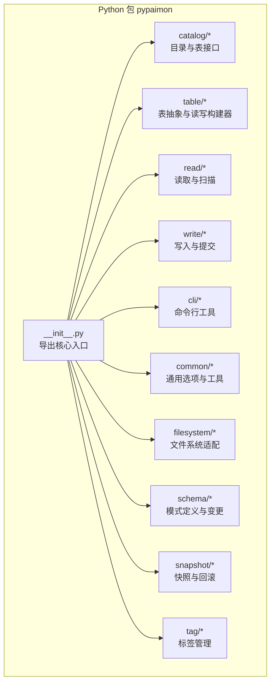
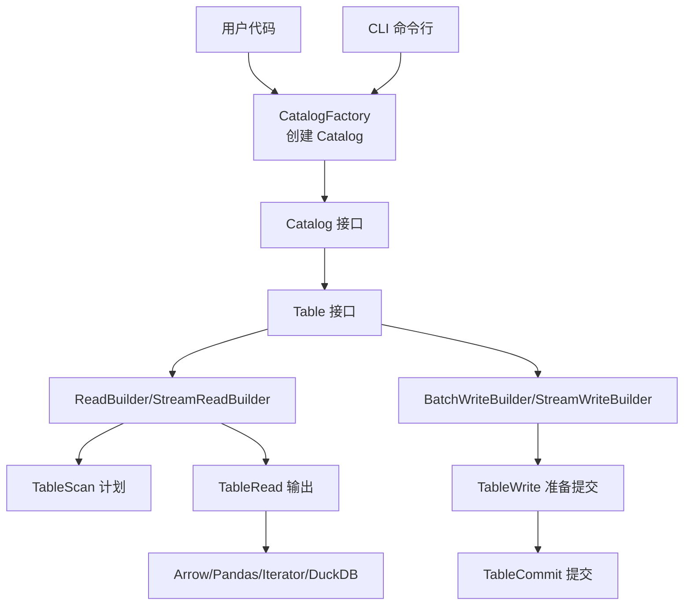
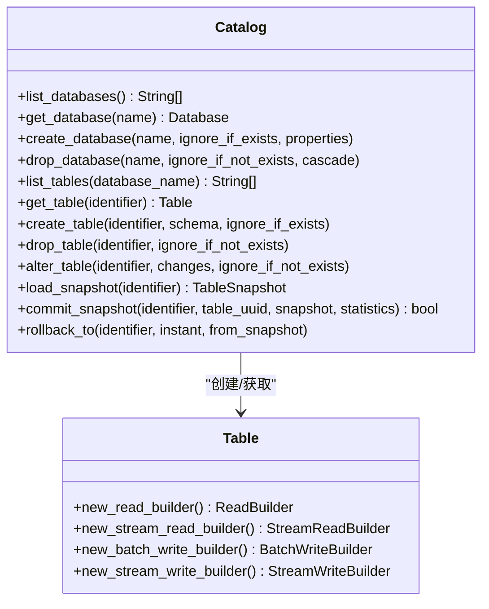
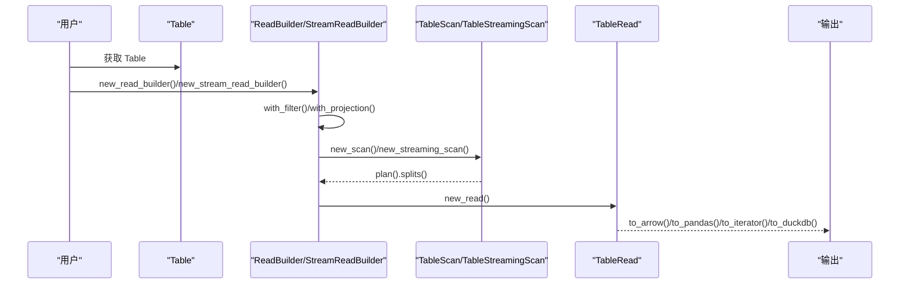
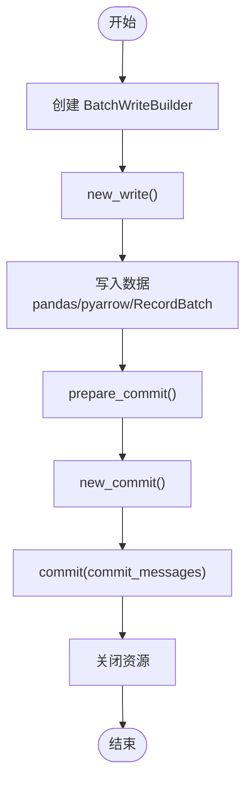
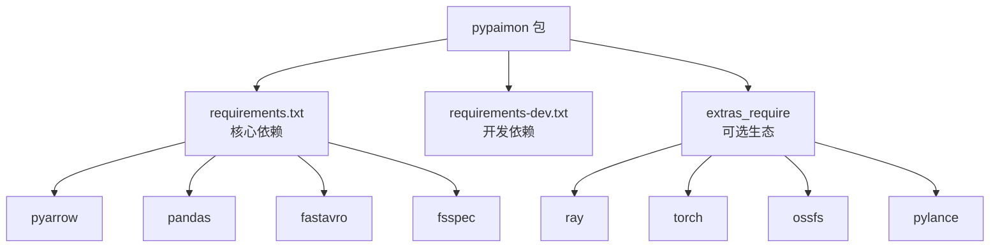

# Python API概述

<cite>
**本文引用的文件**
- [README.md](file://paimon-python/README.md)
- [setup.py](file://paimon-python/setup.py)
- [__init__.py](file://paimon-python/pypaimon/__init__.py)
- [requirements.txt](file://paimon-python/dev/requirements.txt)
- [requirements-dev.txt](file://paimon-python/dev/requirements-dev.txt)
- [python-api.md](file://docs/content/pypaimon/python-api.md)
- [overview.md](file://docs/content/pypaimon/overview.md)
- [java-api.md](file://docs/content/program-api/java-api.md)
- [catalog.py](file://paimon-python/pypaimon/catalog/catalog.py)
- [table.py](file://paimon-python/pypaimon/table/table.py)
- [cli.py](file://paimon-python/pypaimon/cli/cli.py)
</cite>

## 目录
1. [引言](#引言)
2. [项目结构](#项目结构)
3. [核心组件](#核心组件)
4. [架构总览](#架构总览)
5. [详细组件分析](#详细组件分析)
6. [依赖分析](#依赖分析)
7. [性能考虑](#性能考虑)
8. [故障排查指南](#故障排查指南)
9. [结论](#结论)
10. [附录](#附录)

## 引言
本文件为 Apache Paimon Python API 的概览文档，面向希望在 Python 环境中使用 Paimon 进行表管理、数据读写与查询的开发者。文档涵盖：
- Python API 的整体架构与设计理念
- 与 Java API 的对应关系与差异点
- 主要功能模块与典型使用场景
- 版本兼容性与安装前环境准备
- 基本使用示例与最佳实践

## 项目结构
PyPaimon 作为独立的 Python 包，提供对 Paimon 元数据目录（Catalog）与表（Table）的访问能力，并支持批式与流式读写、谓词下推、分片读取、增量读取、消费者管理等高级特性。

图表来源
- [__init__.py:26-38](file://paimon-python/pypaimon/__init__.py#L26-L38)
- [catalog.py:29-193](file://paimon-python/pypaimon/catalog/catalog.py#L29-L193)
- [table.py:26-44](file://paimon-python/pypaimon/table/table.py#L26-L44)

章节来源
- [README.md:1-34](file://paimon-python/README.md#L1-L34)
- [setup.py:18-91](file://paimon-python/setup.py#L18-L91)
- [__init__.py:18-38](file://paimon-python/pypaimon/__init__.py#L18-L38)

## 核心组件
- Catalog 抽象：负责数据库与表的元数据管理，提供创建、删除、修改、重命名、版本管理（快照/标签）等能力。
- Table 抽象：提供读写构建器，支持批式与流式读写、谓词下推、投影下推、分片读取、增量读取等。
- 读取子系统：ReadBuilder/StreamReadBuilder 提供扫描计划生成、谓词与投影下推、多种输出格式（Arrow/Pandas/Iterator/DuckDB）。
- 写入子系统：BatchWriteBuilder/StreamWriteBuilder 支持两阶段提交，覆盖写与追加写。
- CLI 工具：提供基于 YAML 配置的 catalog/db/table 操作命令行入口。
- 文件系统与虚拟文件系统：适配本地与远程存储，支持 PVFS 虚拟文件系统。
- 模式与类型：Schema 定义与 PyArrow 类型映射，SchemaChange 支持列增删改等变更。
- 快照与标签：支持回滚到指定快照或标签，配合消费者管理实现断点续跑。

章节来源
- [catalog.py:29-193](file://paimon-python/pypaimon/catalog/catalog.py#L29-L193)
- [table.py:26-44](file://paimon-python/pypaimon/table/table.py#L26-L44)
- [python-api.md:30-180](file://docs/content/pypaimon/python-api.md#L30-L180)

## 架构总览
PyPaimon 的设计以“Catalog → Table → Read/Write”为主线，围绕 Builder 模式组织读写流程，结合谓词与投影下推提升性能；同时提供 CLI 与多种输出格式适配，便于在不同生态中使用。

图表来源
- [catalog.py:29-193](file://paimon-python/pypaimon/catalog/catalog.py#L29-L193)
- [table.py:26-44](file://paimon-python/pypaimon/table/table.py#L26-L44)
- [python-api.md:233-410](file://docs/content/pypaimon/python-api.md#L233-L410)
- [cli.py:89-137](file://paimon-python/pypaimon/cli/cli.py#L89-L137)

## 详细组件分析

### Catalog 与 Table 抽象
- Catalog 负责数据库与表的生命周期管理，支持 alter_database、rename_table（部分实现）、alter_table（SchemaChange 列表）等。
- Table 提供读写构建器，屏蔽底层存储细节，统一批式与流式读写体验。

图表来源
- [catalog.py:29-193](file://paimon-python/pypaimon/catalog/catalog.py#L29-L193)
- [table.py:26-44](file://paimon-python/pypaimon/table/table.py#L26-L44)

章节来源
- [catalog.py:29-193](file://paimon-python/pypaimon/catalog/catalog.py#L29-L193)
- [table.py:26-44](file://paimon-python/pypaimon/table/table.py#L26-L44)

### 读取流程（批式/流式）
- 批式读取：ReadBuilder 生成 TableScan，规划 splits，TableRead 将 splits 转换为 Arrow/Pandas/Iterator/DuckDB。
- 流式读取：StreamReadBuilder 支持轮询新快照、位置控制、谓词与投影下推、并行消费（按桶过滤/分配）。

图表来源
- [python-api.md:233-410](file://docs/content/pypaimon/python-api.md#L233-L410)

章节来源
- [python-api.md:233-410](file://docs/content/pypaimon/python-api.md#L233-L410)

### 写入流程（两阶段提交）
- BatchWriteBuilder 创建 TableWrite 与 TableCommit，支持多次写入后一次性 prepare_commit 并 commit。
- 支持 overwrite（全表或分区级）。

图表来源
- [python-api.md:184-232](file://docs/content/pypaimon/python-api.md#L184-L232)

章节来源
- [python-api.md:184-232](file://docs/content/pypaimon/python-api.md#L184-L232)

### 增量读取与分片读取
- 增量读取：通过复制表设置时间戳区间选项，读取两个快照之间的变更。
- 分片读取：将数据按 shard index 与 total_shards 切分，适合分布式处理与并行计算。

章节来源
- [python-api.md:371-523](file://docs/content/pypaimon/python-api.md#L371-L523)

### 消费者管理
- 支持创建/重置/删除/列举消费者，跟踪消费进度，防止快照过期，实现断点续跑。

章节来源
- [python-api.md:728-800](file://docs/content/pypaimon/python-api.md#L728-L800)

## 依赖分析
- Python 版本要求：3.6 及以上。
- 核心依赖：通过 dev/requirements.txt 维护，包含缓存、数据类型、压缩、文件系统抽象、Arrow/Pandas/Polars、YAML 等。
- 开发依赖：测试框架、静态检查、Ray、请求库等。
- 可选依赖：Ray、Torch、OSS、Lance 等生态扩展，按 Python 版本条件安装。

图表来源
- [setup.py:58-73](file://paimon-python/setup.py#L58-L73)
- [requirements.txt:18-39](file://paimon-python/dev/requirements.txt#L18-L39)
- [requirements-dev.txt:20-27](file://paimon-python/dev/requirements-dev.txt#L20-L27)

章节来源
- [setup.py:18-91](file://paimon-python/setup.py#L18-L91)
- [requirements.txt:18-39](file://paimon-python/dev/requirements.txt#L18-L39)
- [requirements-dev.txt:20-27](file://paimon-python/dev/requirements-dev.txt#L20-L27)

## 性能考虑
- 谓词与投影下推：减少网络与解析开销，建议在 ReadBuilder/StreamReadBuilder 中尽早下推过滤与投影。
- 分片读取：将大表切分为多个 shard，提高并行度与吞吐。
- 流式读取：合理设置轮询间隔与并行消费者（按桶过滤），避免过度轮询造成资源浪费。
- 两阶段提交：批式写入尽量合并多次写入，减少提交次数。
- 输出格式选择：Arrow/Pandas 适合交互与分析，Iterator 适合自定义处理逻辑。

## 故障排查指南
- CLI 配置文件缺失：确保当前目录存在 paimon.yaml 或通过 --config 指定路径；filesystem catalog 必须提供 warehouse。
- 版本不匹配：确认 Python 版本满足 >=3.6；可选依赖按版本条件安装。
- 依赖冲突：优先使用官方维护的 requirements.txt；如需扩展，请参考 extras_require 条件。
- 快照/标签回滚：确保目标快照或标签存在，注意回滚对下游消费者的影响。

章节来源
- [cli.py:32-72](file://paimon-python/pypaimon/cli/cli.py#L32-L72)
- [setup.py:80-91](file://paimon-python/setup.py#L80-L91)

## 结论
PyPaimon 在 Python 生态中提供了与 Java API 对应且一致的表管理与读写能力，通过 Builder 模式与下推优化实现高性能与易用性。其 CLI、多输出格式与可选生态扩展，使其适用于从单机脚本到分布式任务的广泛场景。

## 附录

### 与 Java API 的对应关系与差异
- 对应关系：Catalog/Database/Table、Schema、ReadBuilder/StreamReadBuilder、BatchWriteBuilder/StreamWriteBuilder、Snapshot/Tag 等概念一一对应。
- 差异点：
  - Python 版本要求：无需 JDK，直接运行于 Python 环境。
  - 依赖生态：通过 PyArrow/Pandas/Polars 等生态适配读写；Java 版本依赖 Hadoop 环境。
  - CLI 与配置：Python 使用 YAML 配置文件；Java 使用 Options/CatalogContext。
  - 可选生态：Python 通过 extras_require 提供 Ray/Torch/OSS/Lance 等扩展。

章节来源
- [java-api.md:51-82](file://docs/content/program-api/java-api.md#L51-L82)
- [overview.md:29-38](file://docs/content/pypaimon/overview.md#L29-L38)

### 安装与环境准备
- Python 版本：3.6 及以上。
- 安装方式：可通过 pip 安装发布包，或从源码构建后安装。
- 依赖要求：核心依赖与可选依赖见 requirements.txt 与 extras_require。

章节来源
- [README.md:11-32](file://paimon-python/README.md#L11-L32)
- [setup.py:26-42](file://paimon-python/setup.py#L26-L42)
- [requirements.txt:18-39](file://paimon-python/dev/requirements.txt#L18-L39)

### 基本使用示例（步骤化）
- 创建 Catalog：使用 CatalogFactory.create，支持 filesystem 与 rest catalog。
- 创建数据库与表：先创建数据库，再创建表（Schema 由 PyArrow 定义）。
- 批式写入：创建 BatchWriteBuilder，多次写入后 prepare_commit 并 commit。
- 批式读取：使用 ReadBuilder 下推过滤与投影，生成 splits 并转换为 Arrow/Pandas/Iterator/DuckDB。
- 流式读取：使用 StreamReadBuilder 轮询新快照，支持谓词/投影/并行消费。
- 回滚与标签：支持回滚到快照或标签，配合消费者管理实现断点续跑。

章节来源
- [python-api.md:30-180](file://docs/content/pypaimon/python-api.md#L30-L180)
- [python-api.md:184-410](file://docs/content/pypaimon/python-api.md#L184-L410)
- [python-api.md:554-680](file://docs/content/pypaimon/python-api.md#L554-L680)
- [python-api.md:524-553](file://docs/content/pypaimon/python-api.md#L524-L553)