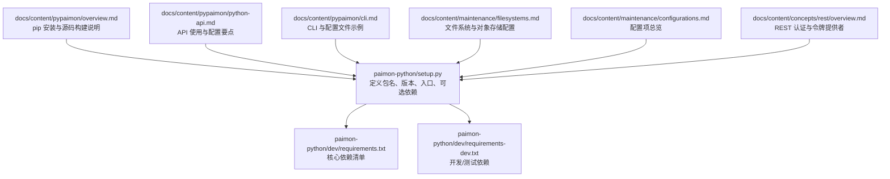
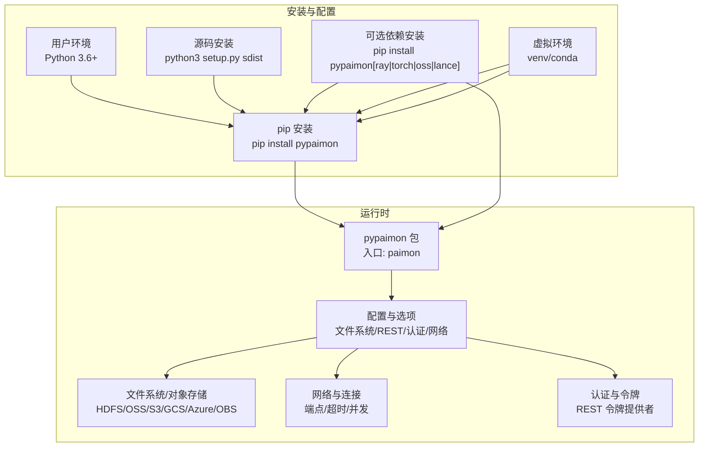
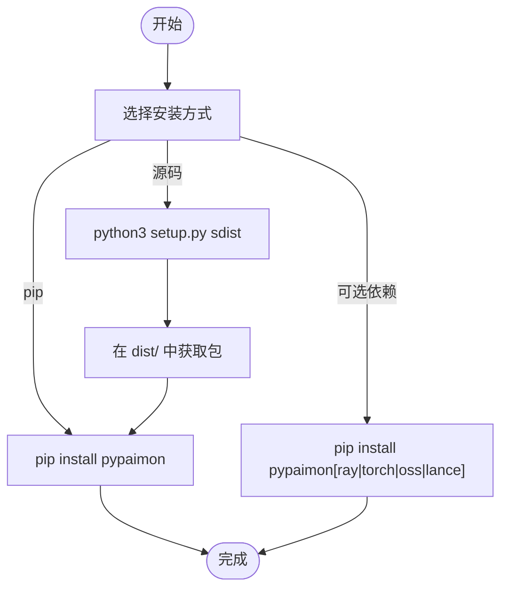
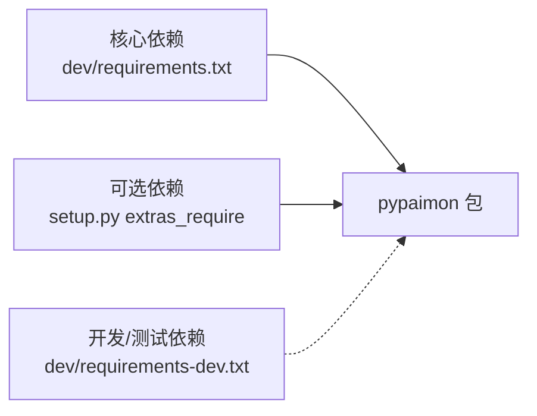

# 安装与配置

<cite>
**本文引用的文件**
- [paimon-python/README.md](file://paimon-python/README.md)
- [paimon-python/setup.py](file://paimon-python/setup.py)
- [paimon-python/dev/requirements.txt](file://paimon-python/dev/requirements.txt)
- [paimon-python/dev/requirements-dev.txt](file://paimon-python/dev/requirements-dev.txt)
- [docs/content/pypaimon/overview.md](file://docs/content/pypaimon/overview.md)
- [docs/content/pypaimon/python-api.md](file://docs/content/pypaimon/python-api.md)
- [docs/content/pypaimon/cli.md](file://docs/content/pypaimon/cli.md)
- [docs/content/pypaimon/pytorch.md](file://docs/content/pypaimon/pytorch.md)
- [docs/content/pypaimon/ray-data.md](file://docs/content/pypaimon/ray-data.md)
- [docs/content/maintenance/filesystems.md](file://docs/content/maintenance/filesystems.md)
- [docs/content/maintenance/configurations.md](file://docs/content/maintenance/configurations.md)
- [docs/content/concepts/rest/overview.md](file://docs/content/concepts/rest/overview.md)
- [paimon-python/pypaimon/common/options/config.py](file://paimon-python/pypaimon/common/options/config.py)
</cite>

## 目录
1. [简介](#简介)
2. [项目结构](#项目结构)
3. [核心组件](#核心组件)
4. [架构总览](#架构总览)
5. [详细组件分析](#详细组件分析)
6. [依赖关系分析](#依赖关系分析)
7. [性能考虑](#性能考虑)
8. [故障排查指南](#故障排查指南)
9. [结论](#结论)
10. [附录](#附录)

## 简介
本指南面向使用 Python API 的用户，覆盖以下内容：
- 多种安装方式：pip 安装、从源码构建安装、可选扩展安装（ray、torch、lance 等）
- 可选依赖与扩展功能支持说明
- 虚拟环境最佳实践，避免依赖冲突
- 配置项说明：文件系统、认证、网络等
- 常见安装问题排查与解决方案
- 不同操作系统下的注意事项与特殊配置

## 项目结构
与 Python 安装与配置直接相关的关键位置：
- 包定义与可选依赖：setup.py
- 核心依赖清单：dev/requirements.txt
- 开发与测试依赖：dev/requirements-dev.txt
- 官方文档：docs/content/pypaimon/* 与 docs/content/maintenance/*

图表来源
- [paimon-python/setup.py:1-92](file://paimon-python/setup.py#L1-L92)
- [paimon-python/dev/requirements.txt:1-39](file://paimon-python/dev/requirements.txt#L1-L39)
- [paimon-python/dev/requirements-dev.txt:1-28](file://paimon-python/dev/requirements-dev.txt#L1-L28)
- [docs/content/pypaimon/overview.md:1-55](file://docs/content/pypaimon/overview.md#L1-L55)
- [docs/content/pypaimon/python-api.md:1-800](file://docs/content/pypaimon/python-api.md#L1-L800)
- [docs/content/pypaimon/cli.md:1-582](file://docs/content/pypaimon/cli.md#L1-L582)
- [docs/content/maintenance/filesystems.md:1-595](file://docs/content/maintenance/filesystems.md#L1-L595)
- [docs/content/maintenance/configurations.md:1-92](file://docs/content/maintenance/configurations.md#L1-L92)
- [docs/content/concepts/rest/overview.md:1-69](file://docs/content/concepts/rest/overview.md#L1-L69)

章节来源
- [paimon-python/README.md:1-34](file://paimon-python/README.md#L1-L34)
- [paimon-python/setup.py:1-92](file://paimon-python/setup.py#L1-L92)
- [paimon-python/dev/requirements.txt:1-39](file://paimon-python/dev/requirements.txt#L1-L39)
- [paimon-python/dev/requirements-dev.txt:1-28](file://paimon-python/dev/requirements-dev.txt#L1-L28)
- [docs/content/pypaimon/overview.md:1-55](file://docs/content/pypaimon/overview.md#L1-L55)
- [docs/content/pypaimon/python-api.md:1-800](file://docs/content/pypaimon/python-api.md#L1-L800)
- [docs/content/pypaimon/cli.md:1-582](file://docs/content/pypaimon/cli.md#L1-L582)
- [docs/content/maintenance/filesystems.md:1-595](file://docs/content/maintenance/filesystems.md#L1-L595)
- [docs/content/maintenance/configurations.md:1-92](file://docs/content/maintenance/configurations.md#L1-L92)
- [docs/content/concepts/rest/overview.md:1-69](file://docs/content/concepts/rest/overview.md#L1-L69)

## 核心组件
- 包与入口
  - 包名与版本：通过 setup.py 定义
  - 控制台入口：paimon=pypaimon.cli:main
- 可选依赖
  - ray：用于分布式读写与处理
  - torch：用于 PyTorch 数据集读取
  - oss：对象存储访问（兼容多 Python 版本）
  - lance：向量检索扩展（按 Python 版本限制）
- 核心依赖
  - 由 dev/requirements.txt 统一声明，包含缓存、序列化、数据类型、压缩、YAML 等

章节来源
- [paimon-python/setup.py:47-91](file://paimon-python/setup.py#L47-L91)
- [paimon-python/dev/requirements.txt:18-39](file://paimon-python/dev/requirements.txt#L18-L39)

## 架构总览
下图展示 Python 安装与配置在仓库中的映射关系，以及与官方文档的对应。

图表来源
- [paimon-python/setup.py:47-91](file://paimon-python/setup.py#L47-L91)
- [docs/content/pypaimon/overview.md:32-54](file://docs/content/pypaimon/overview.md#L32-L54)
- [docs/content/pypaimon/cli.md:32-40](file://docs/content/pypaimon/cli.md#L32-L40)
- [docs/content/maintenance/filesystems.md:29-48](file://docs/content/maintenance/filesystems.md#L29-L48)
- [docs/content/concepts/rest/overview.md:59-68](file://docs/content/concepts/rest/overview.md#L59-L68)

## 详细组件分析

### 安装方式与流程
- pip 安装
  - 直接安装：pip install pypaimon
  - 安装后自动包含 CLI 入口 paimon
- 源码安装
  - 构建源码包：python3 setup.py sdist
  - 在 dist/ 目录中找到打包产物并安装
- 可选依赖安装
  - pip install pypaimon[ray]
  - pip install pypaimon[torch]
  - pip install pypaimon[oss]
  - pip install pypaimon[lance]

图表来源
- [docs/content/pypaimon/overview.md:34-54](file://docs/content/pypaimon/overview.md#L34-L54)
- [paimon-python/README.md:20-32](file://paimon-python/README.md#L20-L32)
- [paimon-python/setup.py:58-73](file://paimon-python/setup.py#L58-L73)

章节来源
- [docs/content/pypaimon/overview.md:32-54](file://docs/content/pypaimon/overview.md#L32-L54)
- [paimon-python/README.md:18-32](file://paimon-python/README.md#L18-L32)
- [paimon-python/setup.py:47-91](file://paimon-python/setup.py#L47-L91)

### 可选依赖与扩展功能
- ray
  - 用途：分布式读取/写入、数据集转换、并行任务控制
  - 安装：pip install pypaimon[ray]
  - 注意：不同 Python 版本对 ray 版本有约束
- torch
  - 用途：将读取结果转为 PyTorch Dataset/DataLoader
  - 安装：pip install pypaimon[torch]
- oss
  - 用途：对象存储访问（兼容多 Python 版本）
  - 安装：pip install pypaimon[oss]
- lance
  - 用途：向量检索与读取
  - 安装：pip install pypaimon[lance]
  - 注意：对 Python 版本有限制

章节来源
- [paimon-python/setup.py:58-73](file://paimon-python/setup.py#L58-L73)
- [docs/content/pypaimon/ray-data.md:28-100](file://docs/content/pypaimon/ray-data.md#L28-L100)
- [docs/content/pypaimon/pytorch.md:28-63](file://docs/content/pypaimon/pytorch.md#L28-L63)

### 虚拟环境最佳实践
- 推荐使用 venv 或 conda 创建隔离环境，避免与系统或其他项目依赖冲突
- 在虚拟环境中执行 pip 安装，确保安装路径与解释器一致
- 对于需要 ray/torch/lance 的场景，建议在统一的虚拟环境中一次性安装所有可选依赖，减少版本不匹配风险

[本节为通用实践说明，无需特定文件引用]

### 配置选项与集成点
- 文件系统与对象存储
  - 支持本地、HDFS、OSS、S3、GCS、Azure、OBS 等
  - 通过仓库文档了解各存储的配置要点与依赖包
- 认证与令牌
  - REST Catalog 支持多种令牌提供者（如 Bear Token、DLF Token）
  - 令牌提供者需在 catalog 选项中指定
- 网络与连接
  - S3、OSS、GCS、Azure 等对象存储可通过 endpoint、access key、secret key 等参数配置
  - 如遇连接池超时等问题，可调整相关连接参数

章节来源
- [docs/content/maintenance/filesystems.md:29-48](file://docs/content/maintenance/filesystems.md#L29-L48)
- [docs/content/concepts/rest/overview.md:59-68](file://docs/content/concepts/rest/overview.md#L59-L68)
- [paimon-python/pypaimon/common/options/config.py:34-122](file://paimon-python/pypaimon/common/options/config.py#L34-L122)

### CLI 与配置文件
- CLI 自动随包安装，命令为 paimon
- 默认从当前目录读取 paimon.yaml
- 支持 filesystem 与 rest 两种 catalog 类型的配置示例

章节来源
- [docs/content/pypaimon/cli.md:32-72](file://docs/content/pypaimon/cli.md#L32-L72)
- [docs/content/pypaimon/cli.md:48-62](file://docs/content/pypaimon/cli.md#L48-L62)

### API 使用与配置要点
- Catalog 创建：支持 filesystem 与 rest
- 表读写：批式与流式读取、谓词下推、投影下推、分片读取
- 增量读取、分片读取、消费者管理等高级特性

章节来源
- [docs/content/pypaimon/python-api.md:30-67](file://docs/content/pypaimon/python-api.md#L30-L67)
- [docs/content/pypaimon/python-api.md:233-523](file://docs/content/pypaimon/python-api.md#L233-L523)

## 依赖关系分析
- 核心依赖来自 dev/requirements.txt，涵盖缓存、序列化、数据类型、压缩、YAML 等
- 可选依赖在 setup.py 的 extras_require 中定义，按 Python 版本条件选择
- 测试与开发依赖来自 dev/requirements-dev.txt

图表来源
- [paimon-python/dev/requirements.txt:18-39](file://paimon-python/dev/requirements.txt#L18-L39)
- [paimon-python/setup.py:58-73](file://paimon-python/setup.py#L58-L73)
- [paimon-python/dev/requirements-dev.txt:18-28](file://paimon-python/dev/requirements-dev.txt#L18-L28)

章节来源
- [paimon-python/dev/requirements.txt:18-39](file://paimon-python/dev/requirements.txt#L18-L39)
- [paimon-python/dev/requirements-dev.txt:18-28](file://paimon-python/dev/requirements-dev.txt#L18-L28)
- [paimon-python/setup.py:26-39](file://paimon-python/setup.py#L26-L39)

## 性能考虑
- 对象存储读写性能调优可参考文件系统文档中的 S3A 性能调优与连接池参数
- Ray 写入时可通过并发参数与远程任务参数提升吞吐
- PyTorch DataLoader 的并发与预取参数可按数据规模与资源进行调节

[本节为通用指导，无需特定文件引用]

## 故障排查指南
- 依赖版本冲突
  - 使用虚拟环境隔离依赖
  - 明确可选依赖版本范围（如 ray、lance 的 Python 版本限制）
- 编译或安装失败
  - 确认 Python 版本满足要求（3.6+）
  - 按需安装可选依赖，避免缺失导致的功能不可用
- 连接对象存储失败
  - 核对 endpoint、access key、secret key 等参数
  - 如遇连接池超时，参考文件系统文档调整连接参数
- REST 认证问题
  - 确认令牌提供者配置正确
  - 检查令牌有效性与权限

章节来源
- [docs/content/maintenance/filesystems.md:410-419](file://docs/content/maintenance/filesystems.md#L410-L419)
- [docs/content/concepts/rest/overview.md:59-68](file://docs/content/concepts/rest/overview.md#L59-L68)
- [paimon-python/setup.py:58-73](file://paimon-python/setup.py#L58-L73)

## 结论
- 优先使用 pip 安装；如需定制或调试，采用源码安装
- 按需安装可选依赖，注意 Python 版本与第三方库版本约束
- 使用虚拟环境隔离依赖，避免冲突
- 通过官方文档配置文件系统、认证与网络参数，结合 CLI 与 API 快速上手

[本节为总结性内容，无需特定文件引用]

## 附录
- 安装命令与示例
  - pip install pypaimon
  - pip install pypaimon[ray|torch|oss|lance]
  - python3 setup.py sdist
- 配置文件示例
  - paimon.yaml（默认读取路径）
- 相关文档
  - Python API 使用与配置
  - CLI 使用与表操作
  - 文件系统与对象存储配置
  - REST 认证与令牌提供者
  - 配置项总览

章节来源
- [docs/content/pypaimon/overview.md:32-54](file://docs/content/pypaimon/overview.md#L32-L54)
- [docs/content/pypaimon/cli.md:48-62](file://docs/content/pypaimon/cli.md#L48-L62)
- [docs/content/maintenance/filesystems.md:29-48](file://docs/content/maintenance/filesystems.md#L29-L48)
- [docs/content/concepts/rest/overview.md:59-68](file://docs/content/concepts/rest/overview.md#L59-L68)
- [docs/content/maintenance/configurations.md:29-92](file://docs/content/maintenance/configurations.md#L29-L92)