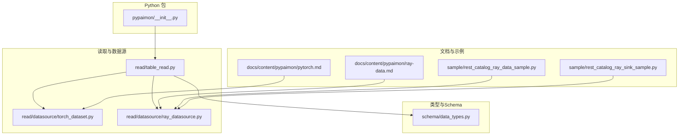
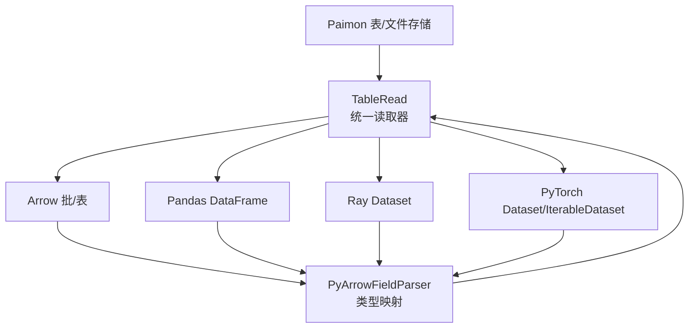
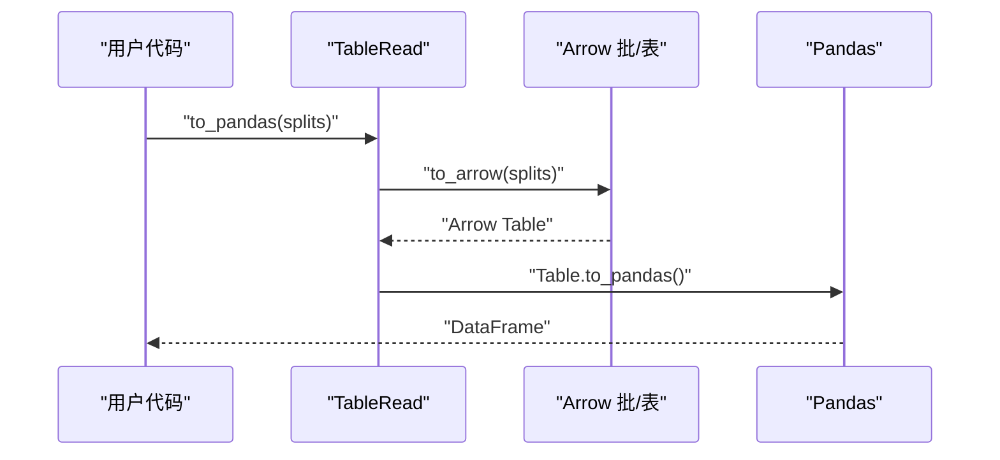
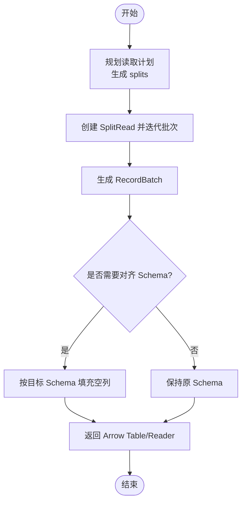
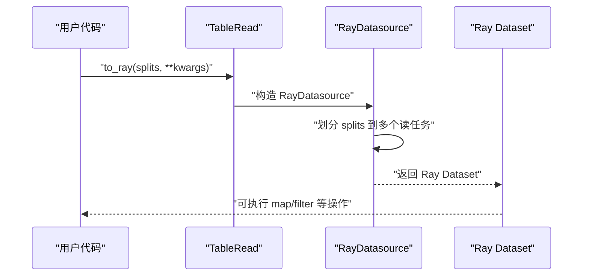
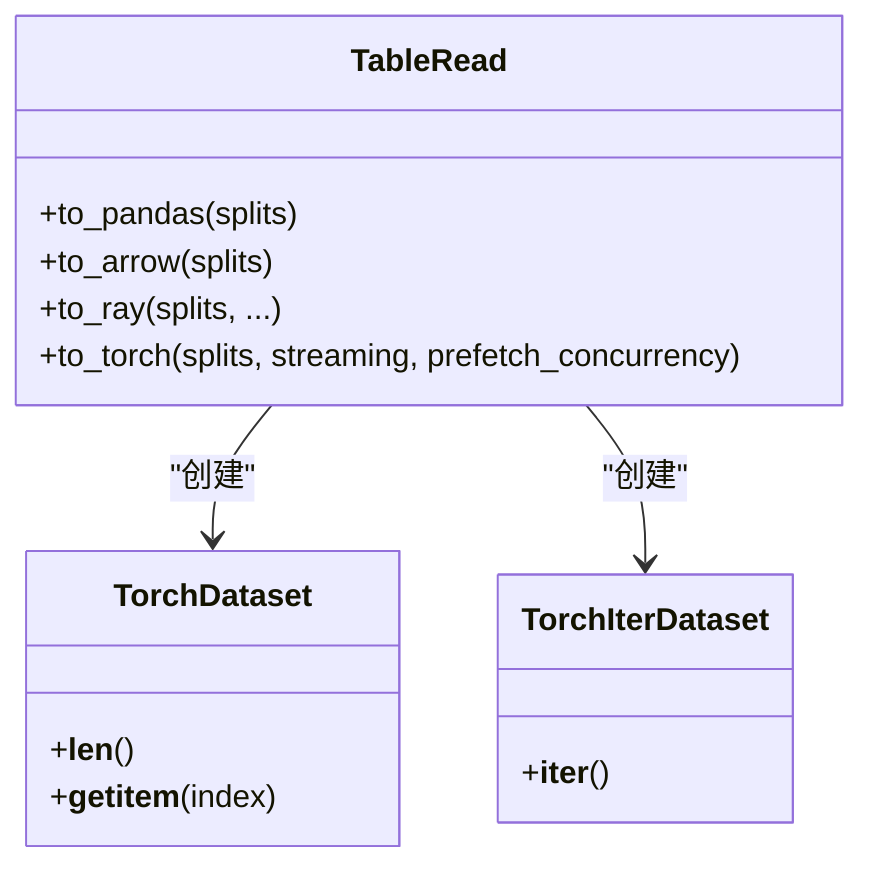
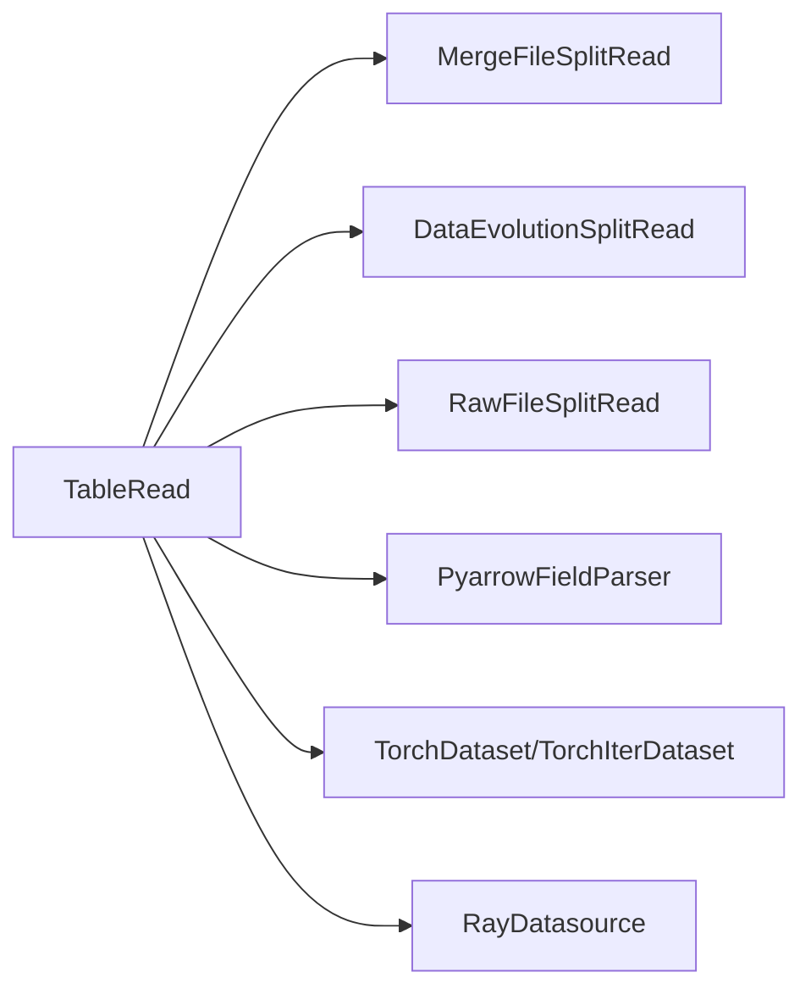

# 数据科学库集成

<cite>
**本文引用的文件**
- [pypaimon/__init__.py](file://paimon-python/pypaimon/__init__.py)
- [pytorch.md](file://docs/content/pypaimon/pytorch.md)
- [ray-data.md](file://docs/content/pypaimon/ray-data.md)
- [rest_catalog_ray_data_sample.py](file://paimon-python/pypaimon/sample/rest_catalog_ray_data_sample.py)
- [rest_catalog_ray_sink_sample.py](file://paimon-python/pypaimon/sample/rest_catalog_ray_sink_sample.py)
- [table_read.py](file://paimon-python/pypaimon/read/table_read.py)
- [torch_dataset.py](file://paimon-python/pypaimon/read/datasource/torch_dataset.py)
- [ray_datasource.py](file://paimon-python/pypaimon/read/datasource/ray_datasource.py)
- [data_types.py](file://paimon-python/pypaimon/schema/data_types.py)
</cite>

## 目录
1. [引言](#引言)
2. [项目结构](#项目结构)
3. [核心组件](#核心组件)
4. [架构总览](#架构总览)
5. [详细组件分析](#详细组件分析)
6. [依赖分析](#依赖分析)
7. [性能考虑](#性能考虑)
8. [故障排查指南](#故障排查指南)
9. [结论](#结论)
10. [附录](#附录)

## 引言
本指南面向使用 Python API 的数据科学家与工程师，系统讲解如何将 Paimon Python API 与主流数据科学生态进行深度集成，覆盖以下主题：
- 与 Pandas 的互操作：DataFrame 读写、类型转换、内存与性能优化
- 与 PyArrow 的互操作：Arrow 格式数据传输、Schema 映射与内存管理
- 与 Ray 的集成：分布式数据处理、并行读取、Ray Dataset 操作与写入
- 与 PyTorch 的集成：Dataset 类实现、训练数据加载、流式读取与批处理
- 与 NumPy 的互操作：数组化数据的高效转换与最佳实践
- 实战示例：数据预处理、特征工程、模型训练等典型场景

本指南以仓库中的 Python API 实现为依据，结合官方文档与示例脚本，提供可直接落地的集成路径与性能建议。

## 项目结构
围绕 Python API 与数据科学库的集成，关键模块分布如下：
- Python 包导出与入口：pypaimon/__init__.py
- 读取器与数据源适配：paimon-python/pypaimon/read/table_read.py、paimon-python/pypaimon/read/datasource/torch_dataset.py、paimon-python/pypaimon/read/datasource/ray_datasource.py
- 类型映射与 Schema 转换：paimon-python/pypaimon/schema/data_types.py
- 官方文档与示例：docs/content/pypaimon/ray-data.md、docs/content/pypaimon/pytorch.md、paimon-python/pypaimon/sample/rest_catalog_ray_data_sample.py、paimon-python/pypaimon/sample/rest_catalog_ray_sink_sample.py

**图表来源**
- [pypaimon/__init__.py:26-38](file://paimon-python/pypaimon/__init__.py#L26-L38)
- [table_read.py:35-291](file://paimon-python/pypaimon/read/table_read.py#L35-L291)
- [torch_dataset.py:32-224](file://paimon-python/pypaimon/read/datasource/torch_dataset.py#L32-L224)
- [ray_datasource.py:43-231](file://paimon-python/pypaimon/read/datasource/ray_datasource.py#L43-L231)
- [data_types.py:457-706](file://paimon-python/pypaimon/schema/data_types.py#L457-L706)
- [ray-data.md:1-143](file://docs/content/pypaimon/ray-data.md#L1-L143)
- [pytorch.md:1-63](file://docs/content/pypaimon/pytorch.md#L1-L63)
- [rest_catalog_ray_data_sample.py:1-246](file://paimon-python/pypaimon/sample/rest_catalog_ray_data_sample.py#L1-L246)
- [rest_catalog_ray_sink_sample.py:1-154](file://paimon-python/pypaimon/sample/rest_catalog_ray_sink_sample.py#L1-L154)

**章节来源**
- [pypaimon/__init__.py:26-38](file://paimon-python/pypaimon/__init__.py#L26-L38)
- [table_read.py:35-291](file://paimon-python/pypaimon/read/table_read.py#L35-L291)
- [torch_dataset.py:32-224](file://paimon-python/pypaimon/read/datasource/torch_dataset.py#L32-L224)
- [ray_datasource.py:43-231](file://paimon-python/pypaimon/read/datasource/ray_datasource.py#L43-L231)
- [data_types.py:457-706](file://paimon-python/pypaimon/schema/data_types.py#L457-L706)
- [ray-data.md:1-143](file://docs/content/pypaimon/ray-data.md#L1-L143)
- [pytorch.md:1-63](file://docs/content/pypaimon/pytorch.md#L1-L63)
- [rest_catalog_ray_data_sample.py:1-246](file://paimon-python/pypaimon/sample/rest_catalog_ray_data_sample.py#L1-L246)
- [rest_catalog_ray_sink_sample.py:1-154](file://paimon-python/pypaimon/sample/rest_catalog_ray_sink_sample.py#L1-L154)

## 核心组件
- TableRead：统一的表读取器，支持 Arrow、Pandas、Ray Dataset、PyTorch Dataset 等多种输出形态，并内置谓词下推、投影、行键列注入等能力。
- TorchDataset/TorchIterDataset：将 Paimon 表数据封装为 PyTorch Dataset/IterableDataset，支持全量加载与流式分片并行预取。
- RayDatasource：基于 Ray Datasource API 的分布式读取实现，自动均衡切分 splits 并估算元信息，兼容多版本 Ray。
- PyArrow/Pandas 互操作：通过 Arrow 作为中间层，实现零拷贝或低拷贝的数据传输与类型映射。
- Schema/类型映射：PyarrowFieldParser 提供 Paimon 类型到 PyArrow 类型的双向映射，确保跨库一致性。

**章节来源**
- [table_read.py:35-291](file://paimon-python/pypaimon/read/table_read.py#L35-L291)
- [torch_dataset.py:32-224](file://paimon-python/pypaimon/read/datasource/torch_dataset.py#L32-L224)
- [ray_datasource.py:43-231](file://paimon-python/pypaimon/read/datasource/ray_datasource.py#L43-L231)
- [data_types.py:457-706](file://paimon-python/pypaimon/schema/data_types.py#L457-L706)

## 架构总览
下图展示了从 Paimon 表到数据科学库的端到端数据通路：TableRead 作为核心枢纽，根据目标库选择合适的输出路径；类型映射保证 Schema 一致；RayDatasource 和 TorchDataset 分别支撑分布式读取与训练数据加载。

**图表来源**
- [table_read.py:64-291](file://paimon-python/pypaimon/read/table_read.py#L64-L291)
- [torch_dataset.py:32-224](file://paimon-python/pypaimon/read/datasource/torch_dataset.py#L32-L224)
- [ray_datasource.py:43-231](file://paimon-python/pypaimon/read/datasource/ray_datasource.py#L43-L231)
- [data_types.py:457-706](file://paimon-python/pypaimon/schema/data_types.py#L457-L706)

## 详细组件分析

### 与 Pandas 的集成
- 读取路径：TableRead.to_pandas 将 Arrow 表转为 Pandas DataFrame，适合中等规模数据与交互式分析。
- 类型转换：PyArrowFieldParser 支持 Paimon 到 Arrow 的类型映射，再由 Arrow 转 Pandas，避免显式逐字段转换。
- 性能优化建议：
  - 使用谓词下推与投影减少扫描数据量（见“依赖分析”中的谓词构建）。
  - 对大表采用分块读取与 Arrow 批处理，降低内存峰值。
  - 在需要时将字符串、数值等列转为类别类型以节省内存。

**图表来源**
- [table_read.py:185-195](file://paimon-python/pypaimon/read/table_read.py#L185-L195)

**章节来源**
- [table_read.py:185-195](file://paimon-python/pypaimon/read/table_read.py#L185-L195)
- [data_types.py:457-706](file://paimon-python/pypaimon/schema/data_types.py#L457-L706)

### 与 PyArrow 的集成
- 读取路径：TableRead.to_arrow 或 to_arrow_batch_reader 直接生成 Arrow 表/RecordBatchReader，便于进一步转换或写入其他系统。
- 内存管理：
  - 使用 RecordBatchReader 进行流式消费，避免一次性加载至内存。
  - 可通过 _try_to_pad_batch_by_schema 对齐不同来源的批次 Schema。
- 行键列支持：当 include_row_kind 为真时，自动在 Schema 首列插入 _row_kind 字段，便于变更数据识别。

**图表来源**
- [table_read.py:78-110](file://paimon-python/pypaimon/read/table_read.py#L78-L110)
- [table_read.py:112-151](file://paimon-python/pypaimon/read/table_read.py#L112-L151)

**章节来源**
- [table_read.py:64-151](file://paimon-python/pypaimon/read/table_read.py#L64-L151)
- [data_types.py:457-706](file://paimon-python/pypaimon/schema/data_types.py#L457-L706)

### 与 Ray 的集成
- 分布式读取：TableRead.to_ray 将 splits 转为 Ray Dataset，支持 override_num_blocks、ray_remote_args、并发度控制等参数。
- RayDatasource：内部实现读任务拆分与负载均衡，自动估算行数与大小，兼容不同 Ray 版本的 API 差异。
- 写入 Paimon：示例脚本演示了使用 Ray Dataset 写入 Paimon 表，包含 Schema 对齐、类型转换与并发写入。

**图表来源**
- [table_read.py:197-242](file://paimon-python/pypaimon/read/table_read.py#L197-L242)
- [ray_datasource.py:101-231](file://paimon-python/pypaimon/read/datasource/ray_datasource.py#L101-L231)

**章节来源**
- [table_read.py:197-242](file://paimon-python/pypaimon/read/table_read.py#L197-L242)
- [ray_datasource.py:43-231](file://paimon-python/pypaimon/read/datasource/ray_datasource.py#L43-L231)
- [ray-data.md:1-143](file://docs/content/pypaimon/ray-data.md#L1-L143)
- [rest_catalog_ray_data_sample.py:1-246](file://paimon-python/pypaimon/sample/rest_catalog_ray_data_sample.py#L1-L246)
- [rest_catalog_ray_sink_sample.py:1-154](file://paimon-python/pypaimon/sample/rest_catalog_ray_sink_sample.py#L1-L154)

### 与 PyTorch 的集成
- Dataset 实现：
  - TorchDataset：一次性将 Arrow 表转为 Python 列表，适合小到中等规模数据。
  - TorchIterDataset：流式迭代 OffsetRow，支持多进程 DataLoader 分片与线程级并行预取。
- 训练流水线：结合 DataLoader 的 num_workers 与 shuffle 参数，实现高吞吐训练数据加载。

**图表来源**
- [table_read.py:244-259](file://paimon-python/pypaimon/read/table_read.py#L244-L259)
- [torch_dataset.py:32-224](file://paimon-python/pypaimon/read/datasource/torch_dataset.py#L32-L224)

**章节来源**
- [table_read.py:244-259](file://paimon-python/pypaimon/read/table_read.py#L244-L259)
- [torch_dataset.py:32-224](file://paimon-python/pypaimon/read/datasource/torch_dataset.py#L32-L224)
- [pytorch.md:1-63](file://docs/content/pypaimon/pytorch.md#L1-L63)

### 与 NumPy 的互操作
- 间接路径：通过 Arrow 作为桥梁，先将 Paimon 数据转为 Arrow 表，再调用 Table.to_numpy() 获取 NumPy 数组。
- 最佳实践：
  - 优先使用 Arrow 批次流式处理，避免整表复制。
  - 对数值列直接转为合适 dtype，减少类型转换开销。
  - 对大型数组采用视图或分块处理，降低内存占用。

**章节来源**
- [table_read.py:185-195](file://paimon-python/pypaimon/read/table_read.py#L185-L195)
- [data_types.py:457-706](file://paimon-python/pypaimon/schema/data_types.py#L457-L706)

## 依赖分析
- 组件耦合：
  - TableRead 与 SplitRead 实现解耦，依据表类型与选项选择具体读取策略（主键合并、数据演进、原始文件等）。
  - TorchDataset/TorchIterDataset 与 TableRead 解耦，通过 splits 与 Schema 交互。
  - RayDatasource 与 Ray 版本差异通过条件分支处理，保证兼容性。
- 外部依赖：
  - Ray、PyArrow、Pandas、PyTorch 为可选依赖，TableRead 在相应方法被调用时才导入。
- 谓词与投影：
  - 读取器支持谓词下推与列投影，显著减少 IO 与内存压力。

**图表来源**
- [table_read.py:260-284](file://paimon-python/pypaimon/read/table_read.py#L260-L284)
- [data_types.py:457-706](file://paimon-python/pypaimon/schema/data_types.py#L457-L706)

**章节来源**
- [table_read.py:260-284](file://paimon-python/pypaimon/read/table_read.py#L260-L284)
- [data_types.py:457-706](file://paimon-python/pypaimon/schema/data_types.py#L457-L706)

## 性能考虑
- 流式处理优先：使用 Arrow RecordBatchReader 与 TorchIterDataset，避免全量加载。
- 并行与分区：
  - Ray：合理设置 override_num_blocks 与并发度，平衡任务粒度与资源占用。
  - Torch：prefetch_concurrency 与 DataLoader num_workers 协同提升吞吐。
- 元信息与估算：RayDatasource 基于 splits 文件大小进行贪心分配，尽量均衡各任务负载。
- 类型映射与内存：Arrow 作为中间层可减少重复转换；必要时对齐 Schema，避免额外填充。

[本节为通用指导，无需特定文件引用]

## 故障排查指南
- Ray 写入失败：
  - 确认 Ray 初始化状态与资源可用性；检查 write_ray 的并发参数与 ray_remote_args。
  - 示例参考：[rest_catalog_ray_sink_sample.py:119-124](file://paimon-python/pypaimon/sample/rest_catalog_ray_sink_sample.py#L119-L124)
- Ray 块大小问题：
  - 当 Paimon splits 超过默认块大小时，需在调用前配置 DataContext 的 target_max_block_size。
  - 参考：[ray-data.md:87-98](file://docs/content/pypaimon/ray-data.md#L87-L98)
- Torch 数据加载卡顿：
  - 检查 num_workers 与 prefetch_concurrency 设置；确认 splits 分配到各 worker 的均衡性。
  - 参考：[torch_dataset.py:130-154](file://paimon-python/pypaimon/read/datasource/torch_dataset.py#L130-L154)
- 类型不匹配导致写入异常：
  - 使用示例中的 map_batches 对 Ray Dataset 的批次进行字段类型对齐后再写入。
  - 参考：[rest_catalog_ray_sink_sample.py:98-114](file://paimon-python/pypaimon/sample/rest_catalog_ray_sink_sample.py#L98-L114)

**章节来源**
- [rest_catalog_ray_sink_sample.py:119-124](file://paimon-python/pypaimon/sample/rest_catalog_ray_sink_sample.py#L119-L124)
- [ray-data.md:87-98](file://docs/content/pypaimon/ray-data.md#L87-L98)
- [torch_dataset.py:130-154](file://paimon-python/pypaimon/read/datasource/torch_dataset.py#L130-L154)
- [rest_catalog_ray_sink_sample.py:98-114](file://paimon-python/pypaimon/sample/rest_catalog_ray_sink_sample.py#L98-L114)

## 结论
通过 TableRead 与各类数据源适配器，Paimon Python API 能够无缝对接 Pandas、PyArrow、Ray、PyTorch 等主流数据科学工具。结合谓词下推、投影、流式处理与并行读取，可在保证类型一致性的同时获得优异的性能表现。示例脚本与官方文档提供了可复用的集成模板，建议在生产环境中结合业务数据规模与集群资源，动态调整并发与块大小参数以达到最优效果。

[本节为总结，无需特定文件引用]

## 附录
- 实战示例清单：
  - Ray 分布式读取与操作：[rest_catalog_ray_data_sample.py:1-246](file://paimon-python/pypaimon/sample/rest_catalog_ray_data_sample.py#L1-L246)
  - Ray 写入 Paimon 表：[rest_catalog_ray_sink_sample.py:1-154](file://paimon-python/pypaimon/sample/rest_catalog_ray_sink_sample.py#L1-L154)
  - PyTorch 训练数据加载：[pytorch.md:1-63](file://docs/content/pypaimon/pytorch.md#L1-L63)
  - Ray 数据集参数与块大小配置：[ray-data.md:77-100](file://docs/content/pypaimon/ray-data.md#L77-L100)

[本节为补充材料，无需特定文件引用]