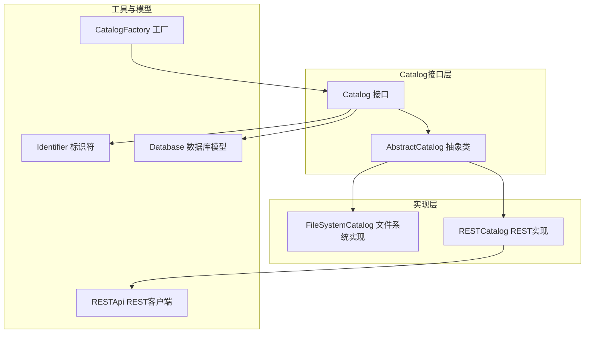
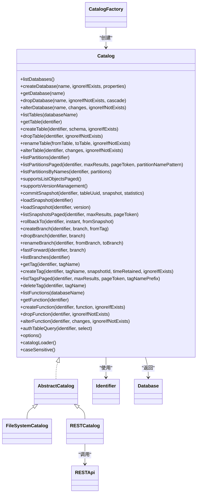
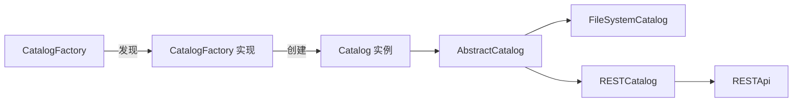

# Catalog类API

<cite>
**本文引用的文件**
- [Catalog.java](file://paimon-core/src/main/java/org/apache/paimon/catalog/Catalog.java)
- [AbstractCatalog.java](file://paimon-core/src/main/java/org/apache/paimon/catalog/AbstractCatalog.java)
- [FileSystemCatalog.java](file://paimon-core/src/main/java/org/apache/paimon/catalog/FileSystemCatalog.java)
- [RESTCatalog.java](file://paimon-core/src/main/java/org/apache/paimon/rest/RESTCatalog.java)
- [CatalogFactory.java](file://paimon-core/src/main/java/org/apache/paimon/catalog/CatalogFactory.java)
- [Identifier.java](file://paimon-api/src/main/java/org/apache/paimon/catalog/Identifier.java)
- [Database.java](file://paimon-core/src/main/java/org/apache/paimon/catalog/Database.java)
- [RESTApi.java](file://paimon-api/src/main/java/org/apache/paimon/rest/RESTApi.java)
- [RESTCatalogTest.java](file://paimon-core/src/test/java/org/apache/paimon/rest/RESTCatalogTest.java)
- [rest_catalog_loader.py](file://paimon-python/pypaimon/catalog/rest/rest_catalog_loader.py)
</cite>

## 目录
1. [简介](#简介)
2. [项目结构](#项目结构)
3. [核心组件](#核心组件)
4. [架构总览](#架构总览)
5. [详细组件分析](#详细组件分析)
6. [依赖关系分析](#依赖关系分析)
7. [性能考量](#性能考量)
8. [故障排查指南](#故障排查指南)
9. [结论](#结论)
10. [附录](#附录)

## 简介
本文件为 Catalog 抽象类的完整 API 参考文档，覆盖数据库与表管理、分区与视图、函数、版本管理（分支、标签、快照回滚）、权限控制等能力，并对比 FileSystemCatalog 与 RESTCatalog 的实现差异与特性。文档同时给出参数类型、返回值、异常处理与使用示例路径，帮助开发者正确创建与使用 Catalog 实例。

## 项目结构
围绕 Catalog 的关键文件组织如下：
- 接口与抽象实现：Catalog、AbstractCatalog
- 具体实现：FileSystemCatalog、RESTCatalog
- 工厂与加载器：CatalogFactory、CatalogLoader（在具体实现中体现）
- 标识符与数据库模型：Identifier、Database
- REST 客户端：RESTApi
- 测试与示例：RESTCatalogTest、Python REST Catalog Loader

图表来源
- [Catalog.java](file://paimon-core/src/main/java/org/apache/paimon/catalog/Catalog.java)
- [AbstractCatalog.java](file://paimon-core/src/main/java/org/apache/paimon/catalog/AbstractCatalog.java)
- [FileSystemCatalog.java](file://paimon-core/src/main/java/org/apache/paimon/catalog/FileSystemCatalog.java)
- [RESTCatalog.java](file://paimon-core/src/main/java/org/apache/paimon/rest/RESTCatalog.java)
- [CatalogFactory.java](file://paimon-core/src/main/java/org/apache/paimon/catalog/CatalogFactory.java)
- [Identifier.java](file://paimon-api/src/main/java/org/apache/paimon/catalog/Identifier.java)
- [Database.java](file://paimon-core/src/main/java/org/apache/paimon/catalog/Database.java)
- [RESTApi.java](file://paimon-api/src/main/java/org/apache/paimon/rest/RESTApi.java)

章节来源
- [Catalog.java](file://paimon-core/src/main/java/org/apache/paimon/catalog/Catalog.java)
- [AbstractCatalog.java](file://paimon-core/src/main/java/org/apache/paimon/catalog/AbstractCatalog.java)
- [FileSystemCatalog.java](file://paimon-core/src/main/java/org/apache/paimon/catalog/FileSystemCatalog.java)
- [RESTCatalog.java](file://paimon-core/src/main/java/org/apache/paimon/rest/RESTCatalog.java)
- [CatalogFactory.java](file://paimon-core/src/main/java/org/apache/paimon/catalog/CatalogFactory.java)
- [Identifier.java](file://paimon-api/src/main/java/org/apache/paimon/catalog/Identifier.java)
- [Database.java](file://paimon-core/src/main/java/org/apache/paimon/catalog/Database.java)
- [RESTApi.java](file://paimon-api/src/main/java/org/apache/paimon/rest/RESTApi.java)

## 核心组件
- Catalog 接口：定义 Catalog 的统一能力边界，包含数据库与表管理、分区、视图、函数、版本管理、权限控制、分页列举、支持能力查询等。
- AbstractCatalog 抽象类：提供通用实现骨架，封装系统库校验、默认选项复制、文件系统元数据读写、锁机制接入、分页与模式校验等。
- FileSystemCatalog：基于文件系统的 Catalog 实现，直接操作文件系统进行数据库/表的创建、删除、重命名、模式变更等。
- RESTCatalog：通过 REST API 访问远端 Catalog 服务，适合多语言、多后端场景；其客户端逻辑由 RESTApi 提供。
- CatalogFactory：工厂入口，负责根据配置选择并创建 Catalog 实例，支持缓存与权限包装。
- Identifier：对象标识符，支持数据库、表、分支、系统表的组合表达。
- Database：数据库模型，包含名称、选项与注释。

章节来源
- [Catalog.java](file://paimon-core/src/main/java/org/apache/paimon/catalog/Catalog.java)
- [AbstractCatalog.java](file://paimon-core/src/main/java/org/apache/paimon/catalog/AbstractCatalog.java)
- [FileSystemCatalog.java](file://paimon-core/src/main/java/org/apache/paimon/catalog/FileSystemCatalog.java)
- [RESTCatalog.java](file://paimon-core/src/main/java/org/apache/paimon/rest/RESTCatalog.java)
- [CatalogFactory.java](file://paimon-core/src/main/java/org/apache/paimon/catalog/CatalogFactory.java)
- [Identifier.java](file://paimon-api/src/main/java/org/apache/paimon/catalog/Identifier.java)
- [Database.java](file://paimon-core/src/main/java/org/apache/paimon/catalog/Database.java)

## 架构总览
下图展示了 Catalog 的接口与实现关系、以及 RESTCatalog 的远程调用链路。

图表来源
- [Catalog.java](file://paimon-core/src/main/java/org/apache/paimon/catalog/Catalog.java)
- [AbstractCatalog.java](file://paimon-core/src/main/java/org/apache/paimon/catalog/AbstractCatalog.java)
- [FileSystemCatalog.java](file://paimon-core/src/main/java/org/apache/paimon/catalog/FileSystemCatalog.java)
- [RESTCatalog.java](file://paimon-core/src/main/java/org/apache/paimon/rest/RESTCatalog.java)
- [CatalogFactory.java](file://paimon-core/src/main/java/org/apache/paimon/catalog/CatalogFactory.java)
- [Identifier.java](file://paimon-api/src/main/java/org/apache/paimon/catalog/Identifier.java)
- [Database.java](file://paimon-core/src/main/java/org/apache/paimon/catalog/Database.java)
- [RESTApi.java](file://paimon-api/src/main/java/org/apache/paimon/rest/RESTApi.java)

## 详细组件分析

### Catalog 接口方法总览与规范
- 数据库管理
  - 列举数据库：listDatabases()
  - 分页列举数据库：listDatabasesPaged(maxResults, pageToken, databaseNamePattern)
  - 创建数据库：createDatabase(name, ignoreIfExists, properties)
  - 获取数据库：getDatabase(name)
  - 删除数据库：dropDatabase(name, ignoreIfNotExists, cascade)
  - 修改数据库：alterDatabase(name, changes, ignoreIfNotExists)
- 表管理
  - 列举表：listTables(databaseName)
  - 分页列举表：listTablesPaged(...)
  - 列举表详情：listTableDetails(...)、listTableDetailsPaged(...)
  - 获取表：getTable(identifier)
  - 创建表：createTable(identifier, schema, ignoreIfExists)
  - 删除表：dropTable(identifier, ignoreIfNotExists)
  - 重命名表：renameTable(fromTable, toTable, ignoreIfNotExists)
  - 修改表结构：alterTable(identifier, changes, ignoreIfNotExists)
  - 无效化缓存：invalidateTable(identifier)
  - 按ID获取表：getTableById(tableId)
- 分区管理
  - 标记分区完成：markDonePartitions(identifier, partitions)
  - 列举分区：listPartitions(identifier)
  - 分页列举分区：listPartitionsPaged(identifier, ...)
  - 按分区名列举：listPartitionsByNames(identifier, partitions)
- 视图管理（默认不支持，需实现）
  - getView、dropView、createView、listViews、listViewsPaged、listViewDetailsPaged、listViewsPagedGlobally、renameView、alterView
- 函数管理
  - 列举函数：listFunctions(databaseName)
  - 分页列举函数：listFunctionsPaged(...)
  - 获取函数：getFunction(identifier)
  - 创建函数：createFunction(identifier, function, ignoreIfExists)
  - 删除函数：dropFunction(identifier, ignoreIfNotExists)
  - 修改函数：alterFunction(identifier, changes, ignoreIfNotExists)
- 权限控制
  - 查询授权过滤：authTableQuery(identifier, select)
- 版本管理（分支、标签、快照）
  - 支持检测：supportsVersionManagement()
  - 提交快照：commitSnapshot(identifier, tableUuid, snapshot, statistics)
  - 加载快照：loadSnapshot(identifier)、loadSnapshot(identifier, version)
  - 分页列举快照：listSnapshotsPaged(identifier, ...)
  - 回滚到指定时间点：rollbackTo(identifier, instant, fromSnapshot)
  - 分支：createBranch、dropBranch、renameBranch、fastForward、listBranches
  - 标签：getTag、createTag、listTagsPaged、deleteTag
- 能力与信息
  - 支持分页列举：supportsListObjectsPaged()
  - 支持按模式过滤：supportsListByPattern()
  - 支持按类型过滤表：supportsListTableByType()
  - 支持分区修改：supportsPartitionModification()
  - Catalog 配置与序列化加载器：options()、catalogLoader()
  - 大小写敏感：caseSensitive()

章节来源
- [Catalog.java](file://paimon-core/src/main/java/org/apache/paimon/catalog/Catalog.java)

### AbstractCatalog 抽象实现要点
- 统一的系统库/系统表校验、默认表选项复制、文件 IO 注入、锁工厂与上下文注入。
- 提供分页列表的默认实现（无分页时回退到全量列表）。
- 提供文件系统下的数据库/表列举与存在性判断的通用实现。
- 对版本管理、分支/标签、权限控制等方法提供默认未实现抛出异常，具体实现类可选择性覆盖。

章节来源
- [AbstractCatalog.java](file://paimon-core/src/main/java/org/apache/paimon/catalog/AbstractCatalog.java)

### FileSystemCatalog 实现特性
- 基于文件系统的数据库/表管理，直接操作目录与文件。
- 不支持数据库属性存储（alterDatabase 抛出不支持），不支持自定义表路径（若显式设置则抛出不支持）。
- 使用 SchemaManager 进行表模式管理，支持表重命名与模式变更提交。
- 支持大小写敏感配置（来自 CatalogContext）。
- 提供 CatalogLoader 以复用配置重建 Catalog。

章节来源
- [FileSystemCatalog.java](file://paimon-core/src/main/java/org/apache/paimon/catalog/FileSystemCatalog.java)
- [AbstractCatalog.java](file://paimon-core/src/main/java/org/apache/paimon/catalog/AbstractCatalog.java)

### RESTCatalog 实现特性
- 通过 RESTApi 远程访问 Catalog 服务，支持多种认证方式（如 Bearer、DLF Token）。
- 支持分页列举数据库、表、分区、标签等，遵循 Catalog 接口约定。
- 通过 RESTCatalogTest 验证分页与排序行为。
- Python 端提供 RESTCatalogLoader 用于构建 RESTCatalog 实例。

章节来源
- [RESTCatalog.java](file://paimon-core/src/main/java/org/apache/paimon/rest/RESTCatalog.java)
- [RESTApi.java](file://paimon-api/src/main/java/org/apache/paimon/rest/RESTApi.java)
- [RESTCatalogTest.java](file://paimon-core/src/test/java/org/apache/paimon/rest/RESTCatalogTest.java)
- [rest_catalog_loader.py](file://paimon-python/pypaimon/catalog/rest/rest_catalog_loader.py)

### CatalogFactory 工厂与加载器
- 根据 CatalogContext 中的元存储类型选择具体 CatalogFactory 实现。
- 自动创建缓存包装与权限包装的 Catalog 实例。
- 若未显式实现 create(context)，则回退到 create(fileIO, warehouse, context) 并确保仓库存在。

章节来源
- [CatalogFactory.java](file://paimon-core/src/main/java/org/apache/paimon/catalog/CatalogFactory.java)

### Identifier 与 Database 模型
- Identifier 支持数据库、表、分支、系统表的组合表达，提供解析与转义能力。
- Database 提供名称、选项与注释的只读模型。

章节来源
- [Identifier.java](file://paimon-api/src/main/java/org/apache/paimon/catalog/Identifier.java)
- [Database.java](file://paimon-core/src/main/java/org/apache/paimon/catalog/Database.java)

## 依赖关系分析
- CatalogFactory 依赖 FactoryUtil 发现 CatalogFactory 实现，并根据 CatalogContext 选择创建策略。
- AbstractCatalog 依赖 FileIO、SchemaManager、CatalogLockFactory 等组件。
- RESTCatalog 依赖 RESTApi 完成远程调用。
- FileSystemCatalog 依赖 SchemaManager 与文件系统 IO。

图表来源
- [CatalogFactory.java](file://paimon-core/src/main/java/org/apache/paimon/catalog/CatalogFactory.java)
- [AbstractCatalog.java](file://paimon-core/src/main/java/org/apache/paimon/catalog/AbstractCatalog.java)
- [FileSystemCatalog.java](file://paimon-core/src/main/java/org/apache/paimon/catalog/FileSystemCatalog.java)
- [RESTCatalog.java](file://paimon-core/src/main/java/org/apache/paimon/rest/RESTCatalog.java)
- [RESTApi.java](file://paimon-api/src/main/java/org/apache/paimon/rest/RESTApi.java)

章节来源
- [CatalogFactory.java](file://paimon-core/src/main/java/org/apache/paimon/catalog/CatalogFactory.java)
- [AbstractCatalog.java](file://paimon-core/src/main/java/org/apache/paimon/catalog/AbstractCatalog.java)
- [FileSystemCatalog.java](file://paimon-core/src/main/java/org/apache/paimon/catalog/FileSystemCatalog.java)
- [RESTCatalog.java](file://paimon-core/src/main/java/org/apache/paimon/rest/RESTCatalog.java)
- [RESTApi.java](file://paimon-api/src/main/java/org/apache/paimon/rest/RESTApi.java)

## 性能考量
- 分页列举：优先使用 listXxxPaged 系列方法以避免一次性加载全部对象，降低内存与网络压力。
- 缓存与失效：合理使用 invalidateTable 以避免陈旧元数据影响查询。
- 锁与并发：FileSystemCatalog 可通过 CatalogLockFactory 获取锁，避免对象存储上的非原子重命名导致部分失败。
- 远程调用：RESTCatalog 的请求应结合分页与模式过滤，减少响应体积与往返次数。

## 故障排查指南
- 数据库/表不存在：捕获对应异常（如 DatabaseNotExistException、TableNotExistException）并检查 Identifier 与数据库名大小写。
- 权限问题：DatabaseNoPermissionException、TableNoPermissionException、TableIdNoPermissionException，确认用户与资源权限映射。
- 不支持能力：当调用版本管理或分区修改等方法时抛出 UnsupportedOperationException，需确认 Catalog 实现是否支持相应能力。
- REST 认证：若 RESTCatalog 请求失败，检查 Token 提供者与请求头合并逻辑。

章节来源
- [Catalog.java](file://paimon-core/src/main/java/org/apache/paimon/catalog/Catalog.java)
- [RESTApi.java](file://paimon-api/src/main/java/org/apache/paimon/rest/RESTApi.java)

## 结论
Catalog 抽象提供了统一的元数据管理能力，FileSystemCatalog 适用于本地文件系统场景，RESTCatalog 适用于分布式与多后端场景。通过 CatalogFactory 与 CatalogLoader，可以灵活地创建与复用 Catalog 实例，并结合分页、权限与版本管理能力实现高效稳定的元数据治理。

## 附录

### API 方法详解与使用示例路径

- 数据库管理
  - listDatabases：返回数据库名称列表
  - listDatabasesPaged：分页列举数据库
  - createDatabase：创建数据库（支持 ignoreIfExists 与 properties）
  - getDatabase：获取数据库对象
  - dropDatabase：删除数据库（支持 cascade）
  - alterDatabase：修改数据库属性（默认不支持）

  示例路径
  - [RESTCatalogTest.java](file://paimon-core/src/test/java/org/apache/paimon/rest/RESTCatalogTest.java)
  - [FileSystemCatalog.java](file://paimon-core/src/main/java/org/apache/paimon/catalog/FileSystemCatalog.java)

- 表管理
  - listTables、listTablesPaged、listTableDetails、listTableDetailsPaged：列举表与详情
  - getTable：按标识符获取表
  - createTable：创建表（支持 ignoreIfExists）
  - dropTable：删除表（支持 ignoreIfExists）
  - renameTable：重命名表（注意对象存储非原子性风险）
  - alterTable：按 SchemaChange 列表修改表结构
  - getTableById：按表 ID 获取表（默认不支持）

  示例路径
  - [Catalog.java](file://paimon-core/src/main/java/org/apache/paimon/catalog/Catalog.java)
  - [FileSystemCatalog.java](file://paimon-core/src/main/java/org/apache/paimon/catalog/FileSystemCatalog.java)

- 分区管理
  - markDonePartitions：标记分区完成
  - listPartitions、listPartitionsPaged、listPartitionsByNames：分区列举

  示例路径
  - [AbstractCatalog.java](file://paimon-core/src/main/java/org/apache/paimon/catalog/AbstractCatalog.java)

- 视图管理（默认不支持）
  - getView、dropView、createView、listViews、listViewsPaged、listViewDetailsPaged、listViewsPagedGlobally、renameView、alterView

  示例路径
  - [Catalog.java](file://paimon-core/src/main/java/org/apache/paimon/catalog/Catalog.java)

- 函数管理
  - listFunctions、listFunctionsPaged、getFunction、createFunction、dropFunction、alterFunction

  示例路径
  - [Catalog.java](file://paimon-core/src/main/java/org/apache/paimon/catalog/Catalog.java)

- 权限控制
  - authTableQuery：返回查询授权结果

  示例路径
  - [Catalog.java](file://paimon-core/src/main/java/org/apache/paimon/catalog/Catalog.java)

- 版本管理（分支、标签、快照）
  - supportsVersionManagement：能力检测
  - commitSnapshot：提交快照
  - loadSnapshot、loadSnapshot(identifier, version)：加载快照
  - listSnapshotsPaged：分页列举快照
  - rollbackTo：回滚到指定时间点
  - createBranch、dropBranch、renameBranch、fastForward、listBranches：分支管理
  - getTag、createTag、listTagsPaged、deleteTag：标签管理

  示例路径
  - [Catalog.java](file://paimon-core/src/main/java/org/apache/paimon/catalog/Catalog.java)

- 能力与信息
  - supportsListObjectsPaged、supportsListByPattern、supportsListTableByType、supportsPartitionModification
  - options、catalogLoader、caseSensitive

  示例路径
  - [Catalog.java](file://paimon-core/src/main/java/org/apache/paimon/catalog/Catalog.java)

### 创建与使用 Catalog 实例

- 使用 CatalogFactory 创建 Catalog
  - 通过 CatalogContext 设置仓库路径与元存储类型，工厂自动选择实现并创建 Catalog
  - 可选启用缓存与权限包装

  示例路径
  - [CatalogFactory.java](file://paimon-core/src/main/java/org/apache/paimon/catalog/CatalogFactory.java)

- 使用 CatalogLoader 复用配置
  - FileSystemCatalog 提供 catalogLoader 以重建实例
  - Python 端提供 RESTCatalogLoader 用于构建 RESTCatalog

  示例路径
  - [FileSystemCatalog.java](file://paimon-core/src/main/java/org/apache/paimon/catalog/FileSystemCatalog.java)
  - [rest_catalog_loader.py](file://paimon-python/pypaimon/catalog/rest/rest_catalog_loader.py)

- 连接配置与最佳实践
  - 仓库路径必须存在且可写
  - 对对象存储建议开启锁机制以保证重命名一致性
  - 优先使用分页列举与模式过滤，减少网络与内存开销
  - 在 REST 场景下，合理配置认证头与超时参数

  示例路径
  - [CatalogFactory.java](file://paimon-core/src/main/java/org/apache/paimon/catalog/CatalogFactory.java)
  - [RESTApi.java](file://paimon-api/src/main/java/org/apache/paimon/rest/RESTApi.java)