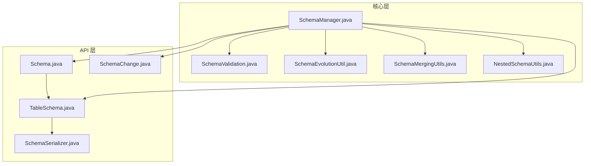
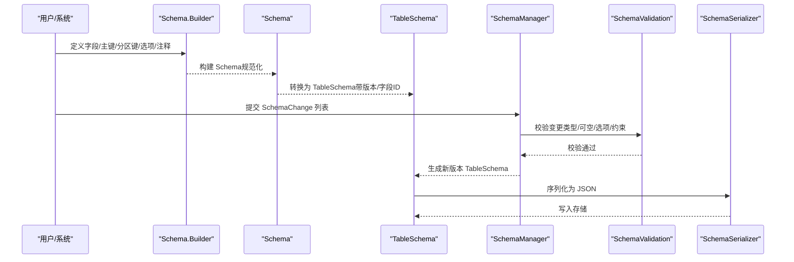
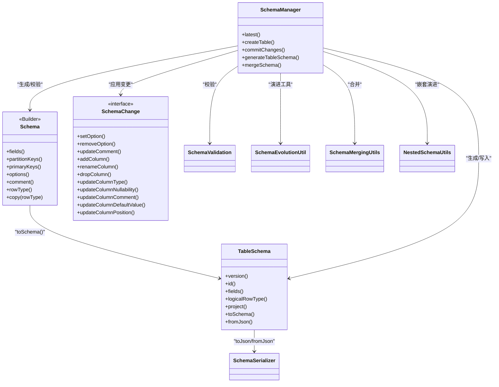

# Schema类API

<cite>
**本文引用的文件**
- [Schema.java](file://paimon-api/src/main/java/org/apache/paimon/schema/Schema.java)
- [SchemaChange.java](file://paimon-api/src/main/java/org/apache/paimon/schema/SchemaChange.java)
- [TableSchema.java](file://paimon-api/src/main/java/org/apache/paimon/schema/TableSchema.java)
- [SchemaSerializer.java](file://paimon-api/src/main/java/org/apache/paimon/schema/SchemaSerializer.java)
- [SchemaManager.java](file://paimon-core/src/main/java/org/apache/paimon/schema/SchemaManager.java)
- [SchemaValidation.java](file://paimon-core/src/main/java/org/apache/paimon/schema/SchemaValidation.java)
- [SchemaEvolutionUtil.java](file://paimon-core/src/main/java/org/apache/paimon/schema/SchemaEvolutionUtil.java)
- [SchemaMergingUtils.java](file://paimon-core/src/main/java/org/apache/paimon/schema/SchemaMergingUtils.java)
- [NestedSchemaUtils.java](file://paimon-core/src/main/java/org/apache/paimon/schema/NestedSchemaUtils.java)
- [DataField.java](file://paimon-api/src/main/java/org/apache/paimon/types/DataField.java)
</cite>

## 目录
1. [简介](#简介)
2. [项目结构](#项目结构)
3. [核心组件](#核心组件)
4. [架构总览](#架构总览)
5. [详细组件分析](#详细组件分析)
6. [依赖关系分析](#依赖关系分析)
7. [性能考量](#性能考量)
8. [故障排查指南](#故障排查指南)
9. [结论](#结论)
10. [附录](#附录)

## 简介
本文件为 Paimon 中 Schema 类的完整 API 参考文档，覆盖以下主题：
- Schema 类的构造方法与字段定义
- 类型系统与数据类型映射
- 约束定义（主键、分区键）与默认值设置
- 模式演进能力与 SchemaChange 的使用
- 验证、序列化与反序列化机制
- 最佳实践与常见陷阱

Schema 在 Paimon 中用于描述表的结构，包含字段、主键、分区键、选项与注释等；TableSchema 则在 Schema 基础上增加版本、字段 ID、桶键等运行时信息；SchemaManager 负责提交与管理 Schema 版本；SchemaChange 描述具体的模式变更操作；SchemaValidation 提供一致性与合法性校验；SchemaSerializer 负责 JSON 序列化/反序列化。

## 项目结构
围绕 Schema 的关键文件组织如下：
- API 层：Schema、SchemaChange、TableSchema、SchemaSerializer
- 核心层：SchemaManager（提交与生成新版本）、SchemaValidation（校验）、SchemaEvolutionUtil（演进工具）、SchemaMergingUtils（合并与差异）、NestedSchemaUtils（嵌套类型演进）

图表来源
- [Schema.java](file://paimon-api/src/main/java/org/apache/paimon/schema/Schema.java)
- [SchemaChange.java](file://paimon-api/src/main/java/org/apache/paimon/schema/SchemaChange.java)
- [TableSchema.java](file://paimon-api/src/main/java/org/apache/paimon/schema/TableSchema.java)
- [SchemaSerializer.java](file://paimon-api/src/main/java/org/apache/paimon/schema/SchemaSerializer.java)
- [SchemaManager.java](file://paimon-core/src/main/java/org/apache/paimon/schema/SchemaManager.java)
- [SchemaValidation.java](file://paimon-core/src/main/java/org/apache/paimon/schema/SchemaValidation.java)
- [SchemaEvolutionUtil.java](file://paimon-core/src/main/java/org/apache/paimon/schema/SchemaEvolutionUtil.java)
- [SchemaMergingUtils.java](file://paimon-core/src/main/java/org/apache/paimon/schema/SchemaMergingUtils.java)
- [NestedSchemaUtils.java](file://paimon-core/src/main/java/org/apache/paimon/schema/NestedSchemaUtils.java)

章节来源
- [Schema.java](file://paimon-api/src/main/java/org/apache/paimon/schema/Schema.java)
- [SchemaChange.java](file://paimon-api/src/main/java/org/apache/paimon/schema/SchemaChange.java)
- [TableSchema.java](file://paimon-api/src/main/java/org/apache/paimon/schema/TableSchema.java)
- [SchemaSerializer.java](file://paimon-api/src/main/java/org/apache/paimon/schema/SchemaSerializer.java)
- [SchemaManager.java](file://paimon-core/src/main/java/org/apache/paimon/schema/SchemaManager.java)
- [SchemaValidation.java](file://paimon-core/src/main/java/org/apache/paimon/schema/SchemaValidation.java)
- [SchemaEvolutionUtil.java](file://paimon-core/src/main/java/org/apache/paimon/schema/SchemaEvolutionUtil.java)
- [SchemaMergingUtils.java](file://paimon-core/src/main/java/org/apache/paimon/schema/SchemaMergingUtils.java)
- [NestedSchemaUtils.java](file://paimon-core/src/main/java/org/apache/paimon/schema/NestedSchemaUtils.java)

## 核心组件
- Schema：不可变表结构定义，包含字段列表、分区键、主键、选项与注释；提供 Builder 构建器与规范化逻辑（去重、包含性、主键非空等）。
- TableSchema：带版本与字段 ID 的表结构，扩展了桶键、分桶数、时间戳等信息，并提供投影、逻辑类型转换等能力。
- SchemaChange：模式变更接口及多种实现（设置/移除选项、更新注释、新增/重命名/删除字段、更新类型/可空性/注释/默认值、调整位置），支持嵌套路径。
- SchemaManager：提交 Schema 变更、生成新版本、合并 Schema、校验选项与约束。
- SchemaValidation：对表结构与选项进行严格校验（主键/分区键类型限制、分桶、启动模式、向量/外部存储等）。
- SchemaEvolutionUtil：演进过程中的索引映射、过滤下推回退、类型转换执行器。
- SchemaMergingUtils：自动合并两个 RowType，生成 SchemaChange 差异。
- NestedSchemaUtils：嵌套类型（ROW/ARRAY/MAP/MULTISET）演进的通用逻辑。
- SchemaSerializer：TableSchema 的 JSON 序列化/反序列化。

章节来源
- [Schema.java](file://paimon-api/src/main/java/org/apache/paimon/schema/Schema.java)
- [TableSchema.java](file://paimon-api/src/main/java/org/apache/paimon/schema/TableSchema.java)
- [SchemaChange.java](file://paimon-api/src/main/java/org/apache/paimon/schema/SchemaChange.java)
- [SchemaManager.java](file://paimon-core/src/main/java/org/apache/paimon/schema/SchemaManager.java)
- [SchemaValidation.java](file://paimon-core/src/main/java/org/apache/paimon/schema/SchemaValidation.java)
- [SchemaEvolutionUtil.java](file://paimon-core/src/main/java/org/apache/paimon/schema/SchemaEvolutionUtil.java)
- [SchemaMergingUtils.java](file://paimon-core/src/main/java/org/apache/paimon/schema/SchemaMergingUtils.java)
- [NestedSchemaUtils.java](file://paimon-core/src/main/java/org/apache/paimon/schema/NestedSchemaUtils.java)
- [SchemaSerializer.java](file://paimon-api/src/main/java/org/apache/paimon/schema/SchemaSerializer.java)

## 架构总览
Schema 的生命周期从定义到演进再到持久化与验证，整体流程如下：

图表来源
- [Schema.java](file://paimon-api/src/main/java/org/apache/paimon/schema/Schema.java)
- [TableSchema.java](file://paimon-api/src/main/java/org/apache/paimon/schema/TableSchema.java)
- [SchemaManager.java](file://paimon-core/src/main/java/org/apache/paimon/schema/SchemaManager.java)
- [SchemaValidation.java](file://paimon-core/src/main/java/org/apache/paimon/schema/SchemaValidation.java)
- [SchemaSerializer.java](file://paimon-api/src/main/java/org/apache/paimon/schema/SchemaSerializer.java)

## 详细组件分析

### Schema 类 API
- 字段与属性
  - fields(): 字段列表（DataField）
  - partitionKeys(): 分区键列表
  - primaryKeys(): 主键列表
  - options(): 表选项映射
  - comment(): 注释
  - rowType(): 对应的 RowType
- 构造与规范化
  - 构造函数：接收字段、分区键、主键、选项与注释；内部进行重复检查、包含性检查、主键非空处理
  - normalizeFields：确保字段名唯一、分区键/主键均存在于字段中、主键字段不可为空
  - normalizePartitionKeys/normalizePrimaryKeys：从选项中解析分区键与主键
  - duplicateFields：检测重复字段名
  - copy(RowType): 基于新的 RowType 复制 Schema
- Builder
  - column(name, type[, description][, default]): 追加列，自动分配字段 ID 并重分配嵌套类型 ID
  - partitionKeys(...)/primaryKey(...): 设置分区键与主键
  - options(map)/option(key, value): 设置选项
  - comment(text): 设置注释
  - build(): 生成不可变 Schema

章节来源
- [Schema.java](file://paimon-api/src/main/java/org/apache/paimon/schema/Schema.java)
- [DataField.java](file://paimon-api/src/main/java/org/apache/paimon/types/DataField.java)

### TableSchema 类 API
- 核心字段
  - version/id/fields/highestFieldId/partitionKeys/primaryKeys/bucketKeys/numBucket/options/comment/timeMillis
- 访问与投影
  - logicalRowType()/logicalPartitionType()/logicalBucketKeyType()/logicalTrimmedPrimaryKeysType()/logicalPrimaryKeysType()
  - fieldNames()/nameToFieldMap()/idToFieldMap()
  - projection()/project()
  - trimmedPrimaryKeys(): 过滤掉与分区键重叠的主键
  - bucketKeys()/crossPartitionUpdate(): 桶键与跨分区更新判断
- 转换与序列化
  - toSchema(): 转为 Schema
  - fromJson()/toJson()/create(): JSON 序列化/反序列化与创建

章节来源
- [TableSchema.java](file://paimon-api/src/main/java/org/apache/paimon/schema/TableSchema.java)

### SchemaChange 接口与变更操作
- 动作标识
  - Actions：定义 action 字段与各变更动作名称（如 setOption、addColumn、updateColumnType 等）
- 变更类型
  - SetOption/RemoveOption：设置/移除选项
  - UpdateComment：更新表注释
  - AddColumn/RenameColumn/DropColumn：新增/重命名/删除字段（支持嵌套路径）
  - UpdateColumnType：更新字段类型（支持保持或改变可空性）
  - UpdateColumnNullability：更新字段可空性
  - UpdateColumnComment：更新字段注释
  - UpdateColumnDefaultValue：更新字段默认值
  - UpdateColumnPosition：调整字段位置（Move：FIRST/AFTER/BEFORE/LAST）
- Move：字段移动的枚举与工厂方法

章节来源
- [SchemaChange.java](file://paimon-api/src/main/java/org/apache/paimon/schema/SchemaChange.java)

### SchemaManager：提交与生成新版本
- latest()/listAll()/listAllIds()/earliestCreationTime()
- createTable()/commitChanges()
- generateTableSchema：根据旧版本与变更列表生成新版本，执行：
  - 选项变更校验（含快照存在性）
  - 新增字段：校验可空性、分配字段 ID、支持按 Move 插入或插入到分区键前
  - 重命名字段：校验不存在/不覆盖分区键
  - 删除字段：校验安全性（不能删光）
  - 更新类型/可空性/注释/默认值：支持嵌套路径与类型兼容性检查
  - 位置调整：applyMove
  - 合并 Schema：mergeSchema（调用 SchemaMergingUtils）
- applyMove：基于 FIRST/AFTER/BEFOR/LAST 的位置调整
- applyRenameColumnsToOptions：重命名字段时同步更新相关选项

章节来源
- [SchemaManager.java](file://paimon-core/src/main/java/org/apache/paimon/schema/SchemaManager.java)

### SchemaValidation：验证规则
- 主键/分区键仅允许基本类型（排除 Map/Array/Row/Multiset）
- 互斥与组合规则：upsert-key 与 primary-key 互斥；无主键时 changelog-producer 不支持某些值
- 分桶与向量/外部存储/增量聚簇等配置的约束
- 启动模式与相关参数的互斥/必选/不可共存
- 时间字段类型限制与记录级过期字段校验
- 删除向量模式的限制与 pk-clustering-override 的要求

章节来源
- [SchemaValidation.java](file://paimon-core/src/main/java/org/apache/paimon/schema/SchemaValidation.java)

### SchemaEvolutionUtil：演进工具
- createIndexMapping/createIndexCastMapping：构建字段 ID 映射与类型转换映射
- devolveFilters：将谓词从新类型回退到旧类型（保留/丢弃新字段谓词）
- 类型转换执行器：行、数组、映射的元素/键值转换

章节来源
- [SchemaEvolutionUtil.java](file://paimon-core/src/main/java/org/apache/paimon/schema/SchemaEvolutionUtil.java)

### SchemaMergingUtils：合并与差异
- mergeSchemas：合并当前 TableSchema 与目标 RowType，返回新版本
- merge：递归合并基础类型与复杂类型（Row/Map/Array/Multiset/Decimal/标量），支持显式类型转换
- diffSchemaChanges：比较旧/新 TableSchema，生成 SchemaChange 列表（新增列、类型变化）

章节来源
- [SchemaMergingUtils.java](file://paimon-core/src/main/java/org/apache/paimon/schema/SchemaMergingUtils.java)

### NestedSchemaUtils：嵌套类型演进
- generateNestedColumnUpdates：针对 ROW/ARRAY/MAP/MULTISET/标量，生成嵌套演进所需的 SchemaChange 列表
- 保持现有字段顺序、新增字段按位置插入、键类型不变、可空性单独处理

章节来源
- [NestedSchemaUtils.java](file://paimon-core/src/main/java/org/apache/paimon/schema/NestedSchemaUtils.java)

### SchemaSerializer：序列化/反序列化
- serialize：输出 version、id、fields、highestFieldId、partitionKeys、primaryKeys、options、comment、timeMillis
- deserialize：解析 JSON 并补全历史版本默认选项（如分桶、文件格式），构建 TableSchema

章节来源
- [SchemaSerializer.java](file://paimon-api/src/main/java/org/apache/paimon/schema/SchemaSerializer.java)

## 依赖关系分析

图表来源
- [Schema.java](file://paimon-api/src/main/java/org/apache/paimon/schema/Schema.java)
- [TableSchema.java](file://paimon-api/src/main/java/org/apache/paimon/schema/TableSchema.java)
- [SchemaChange.java](file://paimon-api/src/main/java/org/apache/paimon/schema/SchemaChange.java)
- [SchemaManager.java](file://paimon-core/src/main/java/org/apache/paimon/schema/SchemaManager.java)
- [SchemaValidation.java](file://paimon-core/src/main/java/org/apache/paimon/schema/SchemaValidation.java)
- [SchemaEvolutionUtil.java](file://paimon-core/src/main/java/org/apache/paimon/schema/SchemaEvolutionUtil.java)
- [SchemaMergingUtils.java](file://paimon-core/src/main/java/org/apache/paimon/schema/SchemaMergingUtils.java)
- [NestedSchemaUtils.java](file://paimon-core/src/main/java/org/apache/paimon/schema/NestedSchemaUtils.java)
- [SchemaSerializer.java](file://paimon-api/src/main/java/org/apache/paimon/schema/SchemaSerializer.java)

## 性能考量
- 字段 ID 分配与重分配：Builder 与 SchemaManager 在新增/合并时会重分配字段 ID，避免冲突，但需注意 ID 变更带来的映射成本。
- 类型转换：SchemaManager 在更新类型时会检查 DataTypeCasts 兼容性并选择 CastExecutors，避免数据丢失。
- 嵌套类型演进：NestedSchemaUtils 通过“element/value”占位符定位嵌套子类型，减少复杂度。
- 过滤下推回退：SchemaEvolutionUtil 的 devolveFilters 将谓词回退到旧类型，避免无效过滤。
- 序列化开销：SchemaSerializer 输出 fields 与 options 等大对象，建议在批量提交时合并变更以减少写入次数。

## 故障排查指南
- 主键/分区键类型错误
  - 现象：抛出不支持的类型异常
  - 排查：确认主键/分区键字段为基本类型
  - 参考：SchemaValidation
- 从可空到非空转换被禁用
  - 现象：抛出不支持异常
  - 排查：检查 alter-column-null-to-not-null 配置
  - 参考：SchemaManager.assertNullabilityChange
- 删除字段导致表无字段
  - 现象：抛出非法参数异常
  - 排查：确保删除后仍有至少一个字段
  - 参考：SchemaManager.DropColumn
- 嵌套类型键类型变更
  - 现象：抛出不支持异常
  - 排查：Map 键类型必须保持一致
  - 参考：NestedSchemaUtils.handleMapTypeUpdate
- 位置移动自身
  - 现象：抛出不支持异常
  - 排查：避免将字段移动到自身位置
  - 参考：SchemaManager.applyMove
- 选项冲突
  - 现象：抛出非法参数异常
  - 排查：依据 SchemaValidation 的互斥/必选规则调整
  - 参考：SchemaValidation.validateStartupMode

章节来源
- [SchemaManager.java](file://paimon-core/src/main/java/org/apache/paimon/schema/SchemaManager.java)
- [SchemaValidation.java](file://paimon-core/src/main/java/org/apache/paimon/schema/SchemaValidation.java)
- [NestedSchemaUtils.java](file://paimon-core/src/main/java/org/apache/paimon/schema/NestedSchemaUtils.java)

## 结论
Schema 类及其配套组件提供了完整的表结构定义、演进与验证能力。通过 SchemaChange 的细粒度操作与 SchemaManager 的事务式提交，可以安全地进行模式演进；SchemaValidation 保障了配置与结构的合法性；SchemaEvolutionUtil 与 SchemaMergingUtils 支持复杂的类型兼容与自动合并。结合 SchemaSerializer 的持久化机制，形成从定义到落地的一体化流程。

## 附录

### 数据类型映射与约束
- 数据类型映射：Schema 与 TableSchema 使用 RowType/DataType 体系，支持基本类型、数组、映射、多集与行类型；嵌套类型通过 NestedSchemaUtils 统一处理。
- 约束定义：主键与分区键需为基本类型；主键字段不可为空；桶键不得包含分区键；序列字段与合并引擎存在互斥关系。
- 默认值：字段支持默认值设置，更新默认值时会进行合法性校验。

章节来源
- [Schema.java](file://paimon-api/src/main/java/org/apache/paimon/schema/Schema.java)
- [TableSchema.java](file://paimon-api/src/main/java/org/apache/paimon/schema/TableSchema.java)
- [SchemaValidation.java](file://paimon-core/src/main/java/org/apache/paimon/schema/SchemaValidation.java)

### SchemaChange 使用示例（步骤说明）
- 添加字段
  - 使用 SchemaChange.addColumn 指定字段名、类型、注释与 Move（可选）
  - 通过 SchemaManager.commitChanges 提交
- 修改类型
  - 使用 SchemaChange.updateColumnType 指定字段路径与新类型，可选择保持可空性
  - 注意类型兼容性与可空性变更策略
- 删除字段
  - 使用 SchemaChange.dropColumn 指定字段路径
  - 确保删除后仍至少有一个字段
- 重命名字段
  - 使用 SchemaChange.renameColumn 指定旧名与新名
  - 不得覆盖分区键
- 更新可空性/注释/默认值
  - 使用对应 UpdateColumn* 方法
- 调整位置
  - 使用 SchemaChange.updateColumnPosition 与 Move（FIRST/AFTER/BEFORE/LAST）

章节来源
- [SchemaChange.java](file://paimon-api/src/main/java/org/apache/paimon/schema/SchemaChange.java)
- [SchemaManager.java](file://paimon-core/src/main/java/org/apache/paimon/schema/SchemaManager.java)

### 模式演进与兼容性
- 自动合并：使用 SchemaMergingUtils.mergeSchemas 将目标 RowType 与当前 Schema 合并，生成新版本
- 差异生成：使用 diffSchemaChanges 比较旧/新 Schema，生成 SchemaChange 列表
- 嵌套演进：NestedSchemaUtils 保证现有字段顺序、新增字段按位置插入、键类型不变

章节来源
- [SchemaMergingUtils.java](file://paimon-core/src/main/java/org/apache/paimon/schema/SchemaMergingUtils.java)
- [NestedSchemaUtils.java](file://paimon-core/src/main/java/org/apache/paimon/schema/NestedSchemaUtils.java)

### 验证、序列化与反序列化
- 验证：SchemaValidation.validateTableSchema 对主键/分区键、分桶、启动模式、向量/外部存储等进行严格校验
- 序列化：SchemaSerializer 将 TableSchema 输出为 JSON，包含版本、字段、选项等
- 反序列化：从 JSON 解析并补全历史默认选项，构建 TableSchema

章节来源
- [SchemaValidation.java](file://paimon-core/src/main/java/org/apache/paimon/schema/SchemaValidation.java)
- [SchemaSerializer.java](file://paimon-api/src/main/java/org/apache/paimon/schema/SchemaSerializer.java)