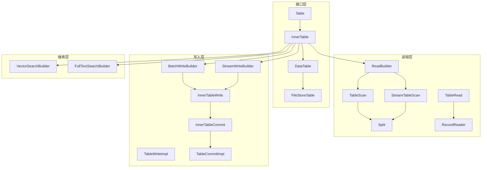
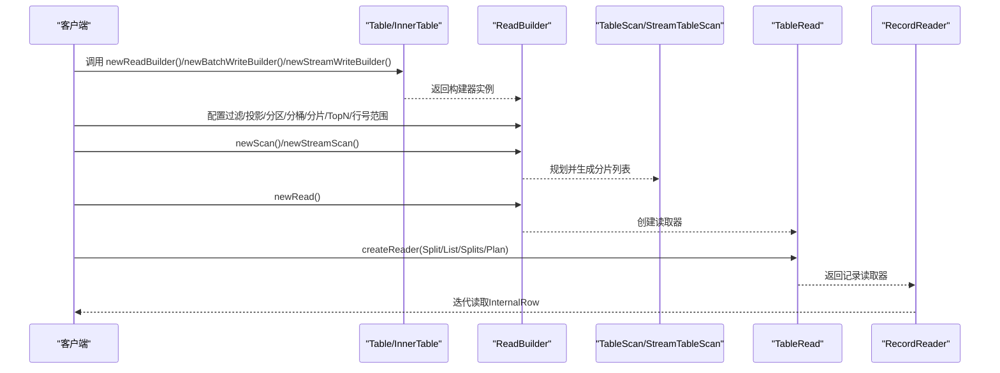
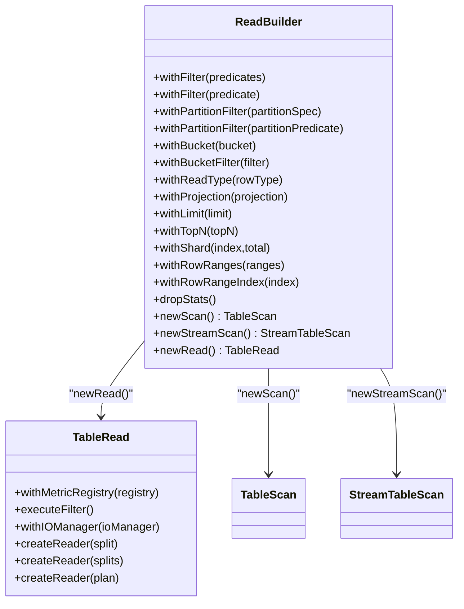
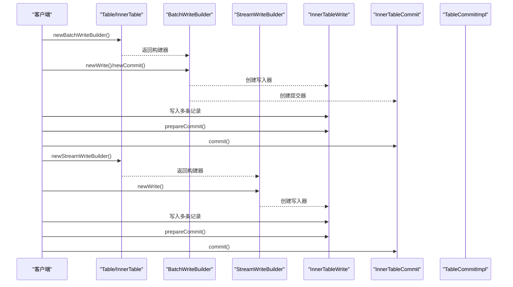
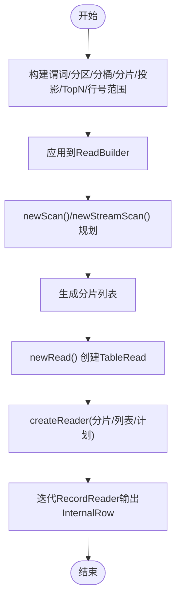
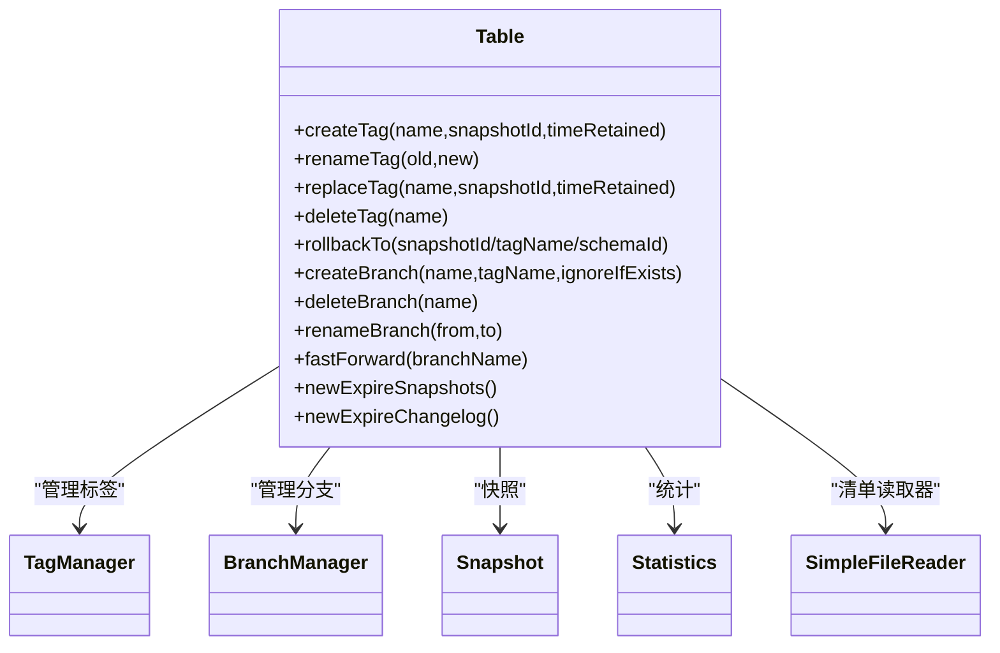
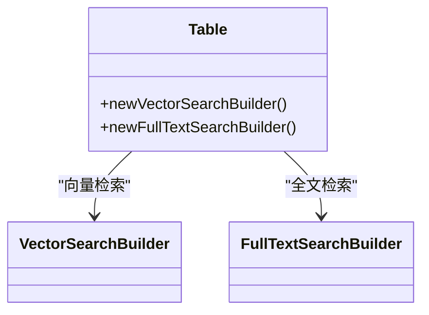
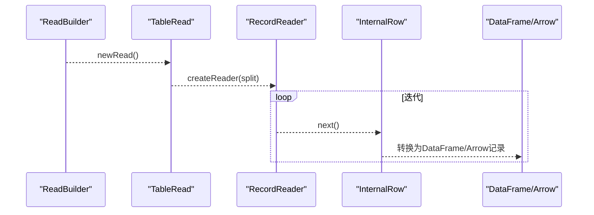
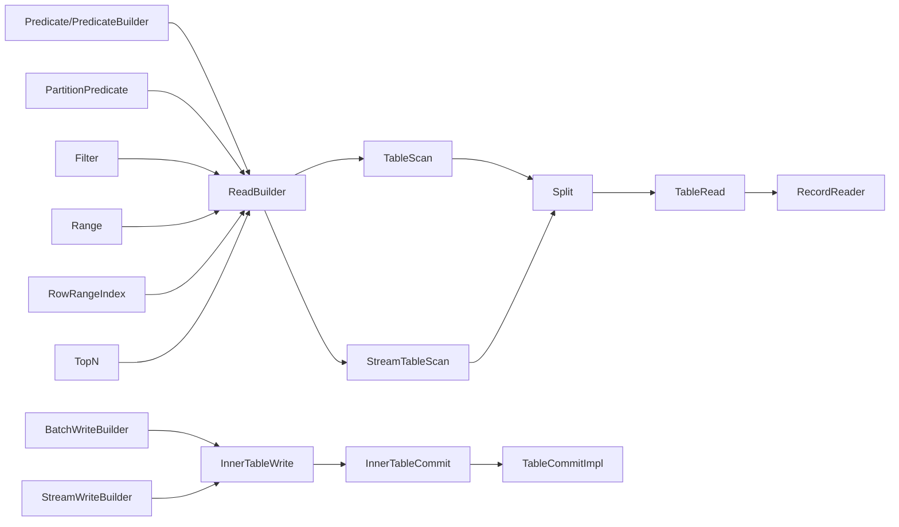

# Table类API

<cite>
**本文引用的文件**
- [Table.java](file://paimon-core/src/main/java/org/apache/paimon/table/Table.java)
- [FileStoreTable.java](file://paimon-core/src/main/java/org/apache/paimon/table/FileStoreTable.java)
- [DataTable.java](file://paimon-core/src/main/java/org/apache/paimon/table/DataTable.java)
- [InnerTable.java](file://paimon-core/src/main/java/org/apache/paimon/table/InnerTable.java)
- [ReadBuilder.java](file://paimon-core/src/main/java/org/apache/paimon/table/source/ReadBuilder.java)
- [TableRead.java](file://paimon-core/src/main/java/org/apache/paimon/table/source/TableRead.java)
- [BatchWriteBuilder.java](file://paimon-core/src/main/java/org/apache/paimon/table/sink/BatchWriteBuilder.java)
- [StreamWriteBuilder.java](file://paimon-core/src/main/java/org/apache/paimon/table/sink/StreamWriteBuilder.java)
- [InnerTableRead.java](file://paimon-core/src/main/java/org/apache/paimon/table/source/InnerTableRead.java)
- [InnerTableWrite.java](file://paimon-core/src/main/java/org/apache/paimon/table/sink/InnerTableWrite.java)
- [InnerTableCommit.java](file://paimon-core/src/main/java/org/apache/paimon/table/sink/InnerTableCommit.java)
- [VectorSearchBuilder.java](file://paimon-core/src/main/java/org/apache/paimon/table/source/VectorSearchBuilder.java)
- [FullTextSearchBuilder.java](file://paimon-core/src/main/java/org/apache/paimon/table/source/FullTextSearchBuilder.java)
- [SimpleFileReader.java](file://paimon-core/src/main/java/org/apache/paimon/utils/SimpleFileReader.java)
- [Snapshot.java](file://paimon-core/src/main/java/org/apache/paimon/Snapshot.java)
- [FileIO.java](file://paimon-core/src/main/java/org/apache/paimon/fs/FileIO.java)
- [RowType.java](file://paimon-core/src/main/java/org/apache/paimon/types/RowType.java)
- [Predicate.java](file://paimon-core/src/main/java/org/apache/paimon/predicate/Predicate.java)
- [PredicateBuilder.java](file://paimon-core/src/main/java/org/apache/paimon/predicate/PredicateBuilder.java)
- [PartitionPredicate.java](file://paimon-core/src/main/java/org/apache/paimon/partition/PartitionPredicate.java)
- [Filter.java](file://paimon-core/src/main/java/org/apache/paimon/utils/Filter.java)
- [Range.java](file://paimon-core/src/main/java/org/apache/paimon/utils/Range.java)
- [RowRangeIndex.java](file://paimon-core/src/main/java/org/apache/paimon/utils/RowRangeIndex.java)
- [TopN.java](file://paimon-core/src/main/java/org/apache/paimon/predicate/TopN.java)
- [TableScan.java](file://paimon-core/src/main/java/org/apache/paimon/table/source/TableScan.java)
- [StreamTableScan.java](file://paimon-core/src/main/java/org/apache/paimon/table/source/StreamTableScan.java)
- [Split.java](file://paimon-core/src/main/java/org/apache/paimon/table/source/Split.java)
- [RecordReader.java](file://paimon-core/src/main/java/org/apache/paimon/reader/RecordReader.java)
- [TableWriteImpl.java](file://paimon-core/src/main/java/org/apache/paimon/table/sink/TableWriteImpl.java)
- [TableCommitImpl.java](file://paimon-core/src/main/java/org/apache/paimon/table/sink/TableCommitImpl.java)
- [LocalTableQuery.java](file://paimon-core/src/main/java/org/apache/paimon/table/query/LocalTableQuery.java)
- [RowKeyExtractor.java](file://paimon-core/src/main/java/org/apache/paimon/table/sink/RowKeyExtractor.java)
- [ExpireSnapshots.java](file://paimon-core/src/main/java/org/apache/paimon/options/ExpireSnapshots.java)
- [TagManager.java](file://paimon-core/src/main/java/org/apache/paimon/utils/TagManager.java)
- [BranchManager.java](file://paimon-core/src/main/java/org/apache/paimon/utils/BranchManager.java)
- [ConsumerManager.java](file://paimon-core/src/main/java/org/apache/paimon/consumer/ConsumerManager.java)
- [ChangelogManager.java](file://paimon-core/src/main/java/org/apache/paimon/utils/ChangelogManager.java)
- [SnapshotManager.java](file://paimon-core/src/main/java/org/apache/paimon/utils/SnapshotManager.java)
- [SchemaManager.java](file://paimon-core/src/main/java/org/apache/paimon/schema/SchemaManager.java)
- [FileStore.java](file://paimon-core/src/main/java/org/apache/paimon/FileStore.java)
- [CatalogEnvironment.java](file://paimon-core/src/main/java/org/apache/paimon/table/FileStoreTable.java)
- [TableSchema.java](file://paimon-core/src/main/java/org/apache/paimon/schema/TableSchema.java)
- [InternalRow.java](file://paimon-core/src/main/java/org/apache/paimon/data/InternalRow.java)
- [Statistics.java](file://paimon-core/src/main/java/org/apache/paimon/stats/Statistics.java)
- [IndexManifestEntry.java](file://paimon-core/src/main/java/org/apache/paimon/manifest/IndexManifestEntry.java)
- [ManifestEntry.java](file://paimon-core/src/main/java/org/apache/paimon/manifest/ManifestEntry.java)
- [ManifestFileMeta.java](file://paimon-core/src/main/java/org/apache/paimon/manifest/ManifestFileMeta.java)
- [SegmentCache.java](file://paimon-core/src/main/java/org/apache/paimon/utils/SegmentsCache.java)
- [Cache.java](file://paimon-core/src/main/java/org/apache/paimon/shade/caffeine2/com/github/benmanes/caffeine/cache/Cache.java)
- [DVMetaCache.java](file://paimon-core/src/main/java/org/apache/paimon/utils/DVMetaCache.java)
- [LocalOrphanFilesClean.java](file://paimon-core/src/main/java/org/apache/paimon/operation/LocalOrphanFilesClean.java)
- [ExpireConfig.java](file://paimon-core/src/main/java/org/apache/paimon/options/ExpireConfig.java)
- [BinaryString.java](file://paimon-core/src/main/java/org/apache/paimon/data/BinaryString.java)
- [GenericRow.java](file://paimon-core/src/main/java/org/apache/paimon/data/GenericRow.java)
- [DataTypes.java](file://paimon-core/src/main/java/org/apache/paimon/types/DataTypes.java)
- [IntType.java](file://paimon-core/src/main/java/org/apache/paimon/types/IntType.java)
- [BigIntType.java](file://paimon-core/src/main/java/org/apache/paimon/types/BigIntType.java)
- [VarCharType.java](file://paimon-core/src/main/java/org/apache/paimon/types/VarCharType.java)
- [Options.java](file://paimon-core/src/main/java/org/apache/paimon/options/Options.java)
- [CoreOptions.java](file://paimon-core/src/main/java/org/apache/paimon/CoreOptions.java)
- [Schema.java](file://paimon-core/src/main/java/org/apache/paimon/schema/Schema.java)
- [SchemaManager.java](file://paimon-core/src/main/java/org/apache/paimon/schema/SchemaManager.java)
- [FileStoreTableFactory.java](file://paimon-core/src/main/java/org/apache/paimon/table/FileStoreTableFactory.java)
- [LocalFileIO.java](file://paimon-core/src/main/java/org/apache/paimon/fs/LocalFileIO.java)
- [Path.java](file://paimon-core/src/main/java/org/apache/paimon/fs/Path.java)
- [FileStoreTableStatisticsTestBase.java](file://paimon-flink/paimon-flink-common/src/test/java/org/apache/paimon/flink/source/statistics/FileStoreTableStatisticsTestBase.java)
- [CommitterOperatorTestBase.java](file://paimon-flink/paimon-flink-common/src/test/java/org/apache/paimon/flink/sink/CommitterOperatorTestBase.java)
- [TableTestBase.java](file://paimon-core/src/test/java/org/apache/paimon/table/TableTestBase.java)
</cite>

## 目录
1. [简介](#简介)
2. [项目结构](#项目结构)
3. [核心组件](#核心组件)
4. [架构总览](#架构总览)
5. [详细组件分析](#详细组件分析)
6. [依赖关系分析](#依赖关系分析)
7. [性能考量](#性能考量)
8. [故障排查指南](#故障排查指南)
9. [结论](#结论)
10. [附录](#附录)

## 简介
本文件为Table类的详细API参考文档，聚焦于数据读取、写入、查询与管理能力。基于仓库中的接口与实现，系统梳理了以下能力：
- 数据读取：通过ReadBuilder规划扫描与分片，TableRead读取分片；支持过滤、投影、分区裁剪、TopN、分桶/分片选择、行号范围读取等。
- 数据写入：通过BatchWriteBuilder与StreamWriteBuilder进行批量与流式写入，配合TableWriteImpl与TableCommitImpl完成提交。
- 查询操作：通过ReadBuilder组合谓词、投影、分区与分桶/分片过滤，实现高效过滤与裁剪。
- 元数据与管理：标签、分支、快照、统计信息、清单文件读取、过期策略等。
- 互操作性：与内部行类型InternalRow、谓词系统、分片Split、记录读取器RecordReader等协作。

## 项目结构
围绕Table类的API，涉及如下关键层次：
- 接口层：Table、InnerTable、DataTable、FileStoreTable定义表的基本元数据、读写构建器与管理能力。
- 读取层：ReadBuilder、TableRead、TableScan、StreamTableScan、Split、RecordReader负责扫描计划、分片与读取。
- 写入层：BatchWriteBuilder、StreamWriteBuilder、InnerTableWrite、InnerTableCommit、TableWriteImpl、TableCommitImpl负责写入与提交。
- 搜索层：VectorSearchBuilder、FullTextSearchBuilder提供向量检索与全文检索能力。
- 管理层：标签、分支、快照、统计、清单文件读取、过期策略等。

**图表来源**
- [Table.java:52-236](file://paimon-core/src/main/java/org/apache/paimon/table/Table.java#L52-L236)
- [InnerTable.java:41-79](file://paimon-core/src/main/java/org/apache/paimon/table/InnerTable.java#L41-L79)
- [DataTable.java:33-61](file://paimon-core/src/main/java/org/apache/paimon/table/DataTable.java#L33-L61)
- [FileStoreTable.java:56-180](file://paimon-core/src/main/java/org/apache/paimon/table/FileStoreTable.java#L56-L180)
- [ReadBuilder.java:76-181](file://paimon-core/src/main/java/org/apache/paimon/table/source/ReadBuilder.java#L76-L181)
- [TableRead.java:40-62](file://paimon-core/src/main/java/org/apache/paimon/table/source/TableRead.java#L40-L62)
- [BatchWriteBuilder.java](file://paimon-core/src/main/java/org/apache/paimon/table/sink/BatchWriteBuilder.java)
- [StreamWriteBuilder.java](file://paimon-core/src/main/java/org/apache/paimon/table/sink/StreamWriteBuilder.java)
- [InnerTableRead.java](file://paimon-core/src/main/java/org/apache/paimon/table/source/InnerTableRead.java)
- [InnerTableWrite.java](file://paimon-core/src/main/java/org/apache/paimon/table/sink/InnerTableWrite.java)
- [InnerTableCommit.java](file://paimon-core/src/main/java/org/apache/paimon/table/sink/InnerTableCommit.java)
- [TableWriteImpl.java](file://paimon-core/src/main/java/org/apache/paimon/table/sink/TableWriteImpl.java)
- [TableCommitImpl.java](file://paimon-core/src/main/java/org/apache/paimon/table/sink/TableCommitImpl.java)
- [VectorSearchBuilder.java](file://paimon-core/src/main/java/org/apache/paimon/table/source/VectorSearchBuilder.java)
- [FullTextSearchBuilder.java](file://paimon-core/src/main/java/org/apache/paimon/table/source/FullTextSearchBuilder.java)

**章节来源**
- [Table.java:52-236](file://paimon-core/src/main/java/org/apache/paimon/table/Table.java#L52-L236)
- [InnerTable.java:41-79](file://paimon-core/src/main/java/org/apache/paimon/table/InnerTable.java#L41-L79)
- [DataTable.java:33-61](file://paimon-core/src/main/java/org/apache/paimon/table/DataTable.java#L33-L61)
- [FileStoreTable.java:56-180](file://paimon-core/src/main/java/org/apache/paimon/table/FileStoreTable.java#L56-L180)

## 核心组件
- 表元数据与标识
  - 名称、全名、UUID、行类型、分区键、主键、选项、注释、统计信息等。
- 文件系统与快照
  - 文件IO、最新快照、指定快照、清单列表/文件/索引清单读取器、回滚到快照/标签/模式、标签/分支管理、过期快照/变更日志。
- 读取与写入构建器
  - 读取：ReadBuilder（过滤、分区过滤、分桶/分片过滤、投影、TopN、行号范围、读类型裁剪、流式扫描、批式扫描、读取器创建）。
  - 写入：BatchWriteBuilder、StreamWriteBuilder（批量与流式写入入口）。
- 搜索能力
  - 向量检索与全文检索构建器。
- 查询与本地查询
  - InnerTableRead、LocalTableQuery（本地查询）。

**章节来源**
- [Table.java:56-236](file://paimon-core/src/main/java/org/apache/paimon/table/Table.java#L56-L236)
- [ReadBuilder.java:78-181](file://paimon-core/src/main/java/org/apache/paimon/table/source/ReadBuilder.java#L78-L181)
- [TableRead.java:40-62](file://paimon-core/src/main/java/org/apache/paimon/table/source/TableRead.java#L40-L62)
- [InnerTable.java:55-78](file://paimon-core/src/main/java/org/apache/paimon/table/InnerTable.java#L55-L78)

## 架构总览
下图展示从Table到读取与写入的关键调用链路，体现“构建器—扫描/读取—分片—记录”的数据流。

**图表来源**
- [Table.java:228-235](file://paimon-core/src/main/java/org/apache/paimon/table/Table.java#L228-L235)
- [ReadBuilder.java:173-181](file://paimon-core/src/main/java/org/apache/paimon/table/source/ReadBuilder.java#L173-L181)
- [TableRead.java:49-61](file://paimon-core/src/main/java/org/apache/paimon/table/source/TableRead.java#L49-L61)

## 详细组件分析

### 读取API：ReadBuilder与TableRead
- ReadBuilder能力要点
  - 过滤：支持谓词集合合并与单个谓词设置；注意为推送过滤，需二次校验。
  - 分区过滤：按分区规范或分区谓词过滤。
  - 分桶/分片过滤：二选一，避免冲突；分桶过滤与分片分配逻辑不同。
  - 投影与读类型裁剪：支持列裁剪与嵌套字段裁剪。
  - TopN：推送TopN过滤。
  - 行号范围与索引：针对数据演进表的行ID范围读取。
  - 统计丢弃：在计划中丢弃统计信息以减少开销。
  - 扫描：newScan()用于批式规划；newStreamScan()用于持续规划。
  - 读取器：newRead()创建TableRead，用于分片读取。
- TableRead能力要点
  - 设置指标注册器、执行过滤、设置IO管理器。
  - createReader(Split)、createReader(List<Split>)、createReader(Plan)三种重载。
  - 多分片合并读取由ConcatRecordReader封装。

**图表来源**
- [ReadBuilder.java:76-181](file://paimon-core/src/main/java/org/apache/paimon/table/source/ReadBuilder.java#L76-L181)
- [TableRead.java:40-62](file://paimon-core/src/main/java/org/apache/paimon/table/source/TableRead.java#L40-L62)

**章节来源**
- [ReadBuilder.java:84-181](file://paimon-core/src/main/java/org/apache/paimon/table/source/ReadBuilder.java#L84-L181)
- [TableRead.java:42-62](file://paimon-core/src/main/java/org/apache/paimon/table/source/TableRead.java#L42-L62)

### 写入API：BatchWriteBuilder与StreamWriteBuilder
- 批量写入
  - 通过newBatchWriteBuilder()获取构建器，随后创建写入器与提交器，完成批量写入与提交。
- 流式写入
  - 通过newStreamWriteBuilder()获取构建器，创建流式写入器，准备提交后进行提交。
- 提交流程
  - 写入器生成待提交消息，提交器完成事务性提交。

**图表来源**
- [Table.java:231-235](file://paimon-core/src/main/java/org/apache/paimon/table/Table.java#L231-L235)
- [InnerTable.java:70-78](file://paimon-core/src/main/java/org/apache/paimon/table/InnerTable.java#L70-L78)
- [BatchWriteBuilder.java](file://paimon-core/src/main/java/org/apache/paimon/table/sink/BatchWriteBuilder.java)
- [StreamWriteBuilder.java](file://paimon-core/src/main/java/org/apache/paimon/table/sink/StreamWriteBuilder.java)
- [InnerTableWrite.java](file://paimon-core/src/main/java/org/apache/paimon/table/sink/InnerTableWrite.java)
- [InnerTableCommit.java](file://paimon-core/src/main/java/org/apache/paimon/table/sink/InnerTableCommit.java)
- [TableWriteImpl.java](file://paimon-core/src/main/java/org/apache/paimon/table/sink/TableWriteImpl.java)
- [TableCommitImpl.java](file://paimon-core/src/main/java/org/apache/paimon/table/sink/TableCommitImpl.java)

**章节来源**
- [Table.java:231-235](file://paimon-core/src/main/java/org/apache/paimon/table/Table.java#L231-L235)
- [InnerTable.java:70-78](file://paimon-core/src/main/java/org/apache/paimon/table/InnerTable.java#L70-L78)

### 查询与过滤：谓词、投影、分区与分桶/分片
- 谓词系统
  - Predicate与PredicateBuilder用于组合复杂过滤条件。
  - ReadBuilder支持将谓词推送到扫描层，减少输出数据量。
- 投影与读类型裁剪
  - withProjection支持列级投影；withReadType支持嵌套字段裁剪。
- 分区与分桶/分片
  - withPartitionFilter与withBucketFilter/withShard三者互斥，避免冲突。
- TopN与行号范围
  - withTopN推送TopN过滤；withRowRanges/withRowRangeIndex支持特定行ID范围读取。

**图表来源**
- [ReadBuilder.java:84-181](file://paimon-core/src/main/java/org/apache/paimon/table/source/ReadBuilder.java#L84-L181)
- [Predicate.java](file://paimon-core/src/main/java/org/apache/paimon/predicate/Predicate.java)
- [PredicateBuilder.java](file://paimon-core/src/main/java/org/apache/paimon/predicate/PredicateBuilder.java)
- [PartitionPredicate.java](file://paimon-core/src/main/java/org/apache/paimon/partition/PartitionPredicate.java)
- [Filter.java](file://paimon-core/src/main/java/org/apache/paimon/utils/Filter.java)
- [Range.java](file://paimon-core/src/main/java/org/apache/paimon/utils/Range.java)
- [RowRangeIndex.java](file://paimon-core/src/main/java/org/apache/paimon/utils/RowRangeIndex.java)
- [TopN.java](file://paimon-core/src/main/java/org/apache/paimon/predicate/TopN.java)

**章节来源**
- [ReadBuilder.java:84-181](file://paimon-core/src/main/java/org/apache/paimon/table/source/ReadBuilder.java#L84-L181)

### 元数据与管理：标签、分支、快照、统计与清单读取
- 标签与分支
  - 创建、重命名、替换、删除标签；创建/删除/重命名分支；快进分支。
- 快照与统计
  - 获取最新快照、指定快照；可选统计信息。
- 清单读取
  - 清单列表、清单文件、索引清单的文件元数据读取器。
- 过期策略
  - 手动配置过期快照与变更日志策略。

**图表来源**
- [Table.java:119-218](file://paimon-core/src/main/java/org/apache/paimon/table/Table.java#L119-L218)
- [TagManager.java](file://paimon-core/src/main/java/org/apache/paimon/utils/TagManager.java)
- [BranchManager.java](file://paimon-core/src/main/java/org/apache/paimon/utils/BranchManager.java)
- [Snapshot.java](file://paimon-core/src/main/java/org/apache/paimon/Snapshot.java)
- [Statistics.java](file://paimon-core/src/main/java/org/apache/paimon/stats/Statistics.java)
- [SimpleFileReader.java](file://paimon-core/src/main/java/org/apache/paimon/utils/SimpleFileReader.java)

**章节来源**
- [Table.java:119-218](file://paimon-core/src/main/java/org/apache/paimon/table/Table.java#L119-L218)

### 搜索能力：向量检索与全文检索
- 向量检索构建器：newVectorSearchBuilder()
- 全文检索构建器：newFullTextSearchBuilder()

**图表来源**
- [Table.java:222-227](file://paimon-core/src/main/java/org/apache/paimon/table/Table.java#L222-L227)
- [VectorSearchBuilder.java](file://paimon-core/src/main/java/org/apache/paimon/table/source/VectorSearchBuilder.java)
- [FullTextSearchBuilder.java](file://paimon-core/src/main/java/org/apache/paimon/table/source/FullTextSearchBuilder.java)

**章节来源**
- [Table.java:222-227](file://paimon-core/src/main/java/org/apache/paimon/table/Table.java#L222-L227)

### 与DataFrame、Arrow等数据结构的互操作性
- DataFrame互操作
  - 通过内部行类型InternalRow与RecordReader进行数据交换；读取时使用RecordReader迭代InternalRow，写入时通过TableWriteImpl/InnerTableWrite写入。
- Arrow互操作
  - 通过Arrow工具与转换器进行Arrow与内部行类型的互转（见Arrow模块），在读取侧可将Arrow记录转换为InternalRow，写入侧可将InternalRow转换为Arrow记录。
- 读取侧典型流程
  - ReadBuilder规划扫描—TableRead创建分片读取器—RecordReader迭代InternalRow，再由上层框架转换为DataFrame/Arrow等高层数据结构。

**图表来源**
- [ReadBuilder.java:173-181](file://paimon-core/src/main/java/org/apache/paimon/table/source/ReadBuilder.java#L173-L181)
- [TableRead.java:49-61](file://paimon-core/src/main/java/org/apache/paimon/table/source/TableRead.java#L49-L61)
- [RecordReader.java](file://paimon-core/src/main/java/org/apache/paimon/reader/RecordReader.java)
- [InternalRow.java](file://paimon-core/src/main/java/org/apache/paimon/data/InternalRow.java)

**章节来源**
- [TableRead.java:49-61](file://paimon-core/src/main/java/org/apache/paimon/table/source/TableRead.java#L49-L61)

## 依赖关系分析
- 接口继承关系
  - Table → InnerTable → DataTable → FileStoreTable，逐层扩展读写与管理能力。
- 读取依赖
  - ReadBuilder依赖谓词系统、分区谓词、过滤器、行号范围与索引、TopN等。
  - TableRead依赖Split与RecordReader，支持多分片合并读取。
- 写入依赖
  - 写入器依赖提交器，提交器依赖事务性提交机制。
- 管理依赖
  - 标签/分支/快照/统计/清单读取器依赖对应管理器与文件系统。

**图表来源**
- [ReadBuilder.java:84-181](file://paimon-core/src/main/java/org/apache/paimon/table/source/ReadBuilder.java#L84-L181)
- [TableRead.java:49-61](file://paimon-core/src/main/java/org/apache/paimon/table/source/TableRead.java#L49-L61)
- [InnerTable.java:55-78](file://paimon-core/src/main/java/org/apache/paimon/table/InnerTable.java#L55-L78)
- [BatchWriteBuilder.java](file://paimon-core/src/main/java/org/apache/paimon/table/sink/BatchWriteBuilder.java)
- [StreamWriteBuilder.java](file://paimon-core/src/main/java/org/apache/paimon/table/sink/StreamWriteBuilder.java)
- [InnerTableWrite.java](file://paimon-core/src/main/java/org/apache/paimon/table/sink/InnerTableWrite.java)
- [InnerTableCommit.java](file://paimon-core/src/main/java/org/apache/paimon/table/sink/InnerTableCommit.java)
- [TableCommitImpl.java](file://paimon-core/src/main/java/org/apache/paimon/table/sink/TableCommitImpl.java)

**章节来源**
- [ReadBuilder.java:84-181](file://paimon-core/src/main/java/org/apache/paimon/table/source/ReadBuilder.java#L84-L181)
- [TableRead.java:49-61](file://paimon-core/src/main/java/org/apache/paimon/table/source/TableRead.java#L49-L61)
- [InnerTable.java:55-78](file://paimon-core/src/main/java/org/apache/paimon/table/InnerTable.java#L55-L78)

## 性能考量
- 过滤与裁剪
  - 使用谓词与分区/分桶/分片过滤显著减少扫描数据量；优先使用Push Down过滤。
- 列裁剪
  - 使用withReadType或withProjection减少列数量，降低序列化与传输成本。
- TopN与限制
  - 使用withTopN与withLimit控制输出规模，避免全表扫描。
- 分片与并行
  - 在协调器端规划分片，任务端并行读取；合理设置并行度与分片大小。
- 缓存与统计
  - 利用快照与清单缓存、统计信息辅助计划优化。
- 写入批次
  - 批量写入时合并小文件，减少元数据压力；流式写入注意prepareCommit时机与提交粒度。

[本节为通用性能建议，无需具体文件分析]

## 故障排查指南
- 常见问题
  - 过滤未生效：确认使用Push Down过滤且二次校验记录；检查谓词是否正确构造。
  - 分桶/分片冲突：确保二者只选其一，避免同时设置。
  - 分片读取异常：检查Split生成与分发，确认TableRead与RecordReader使用方式正确。
  - 写入失败：检查写入器生成的待提交消息与提交器事务流程。
- 定位手段
  - 使用指标注册器与IO管理器辅助定位资源瓶颈。
  - 通过清单读取器检查Manifest/索引清单状态。
  - 使用过期策略清理历史快照与变更日志，释放空间。

**章节来源**
- [TableRead.java:42-47](file://paimon-core/src/main/java/org/apache/paimon/table/source/TableRead.java#L42-L47)
- [ReadBuilder.java:112-118](file://paimon-core/src/main/java/org/apache/paimon/table/source/ReadBuilder.java#L112-L118)
- [ReadBuilder.java:145-151](file://paimon-core/src/main/java/org/apache/paimon/table/source/ReadBuilder.java#L145-L151)
- [SimpleFileReader.java](file://paimon-core/src/main/java/org/apache/paimon/utils/SimpleFileReader.java)

## 结论
Table类提供了统一的表抽象，结合ReadBuilder/WriteBuilder与扫描/读取器，实现了高效的读写与过滤能力。通过谓词、分区、分桶/分片、投影与TopN等机制，可在大规模数据场景下实现高性能查询与写入。配合标签/分支/快照/统计与清单读取器，能够满足数据治理与运维需求。在与DataFrame/Arrow等高层数据结构互操作时，应关注InternalRow的生命周期与转换成本，确保内存安全与性能最优。

[本节为总结性内容，无需具体文件分析]

## 附录

### API速查：读取与写入常用方法
- 读取
  - newReadBuilder()：返回ReadBuilder实例。
  - withFilter(...)：设置过滤条件。
  - withPartitionFilter(...)：设置分区过滤。
  - withBucketFilter(...) / withShard(...)：设置分桶/分片过滤。
  - withReadType(...) / withProjection(...)：设置读类型裁剪与投影。
  - withTopN(...) / withLimit(...)：设置TopN与限制。
  - withRowRanges(...) / withRowRangeIndex(...)：设置行号范围。
  - newScan() / newStreamScan()：批式/流式扫描。
  - newRead()：创建TableRead。
  - createReader(...)：读取分片。
- 写入
  - newBatchWriteBuilder() / newStreamWriteBuilder()：批量/流式写入构建器。
  - newWrite(...)：创建写入器。
  - prepareCommit()：准备提交。
  - commit()：提交事务。

**章节来源**
- [ReadBuilder.java:76-181](file://paimon-core/src/main/java/org/apache/paimon/table/source/ReadBuilder.java#L76-L181)
- [TableRead.java:49-61](file://paimon-core/src/main/java/org/apache/paimon/table/source/TableRead.java#L49-L61)
- [Table.java:228-235](file://paimon-core/src/main/java/org/apache/paimon/table/Table.java#L228-L235)

### 示例场景参考（路径）
- 批量写入与提交
  - [TableTestBase.java:256-265](file://paimon-core/src/test/java/org/apache/paimon/table/TableTestBase.java#L256-L265)
- 流式写入与提交
  - [TableTestBase.java:257-264](file://paimon-core/src/test/java/org/apache/paimon/table/TableTestBase.java#L257-L264)
- 创建FileStoreTable并写入
  - [CommitterOperatorTestBase.java:98-114](file://paimon-flink/paimon-flink-common/src/test/java/org/apache/paimon/flink/sink/CommitterOperatorTestBase.java#L98-L114)
- 统计测试基类（含写入与提交）
  - [FileStoreTableStatisticsTestBase.java:390-394](file://paimon-flink/paimon-flink-common/src/test/java/org/apache/paimon/flink/source/statistics/FileStoreTableStatisticsTestBase.java#L390-L394)

**章节来源**
- [TableTestBase.java:256-265](file://paimon-core/src/test/java/org/apache/paimon/table/TableTestBase.java#L256-L265)
- [CommitterOperatorTestBase.java:98-114](file://paimon-flink/paimon-flink-common/src/test/java/org/apache/paimon/flink/sink/CommitterOperatorTestBase.java#L98-L114)
- [FileStoreTableStatisticsTestBase.java:390-394](file://paimon-flink/paimon-flink-common/src/test/java/org/apache/paimon/flink/source/statistics/FileStoreTableStatisticsTestBase.java#L390-L394)