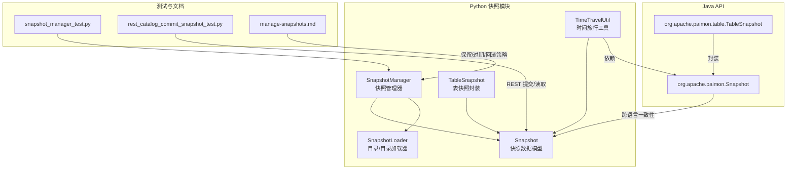
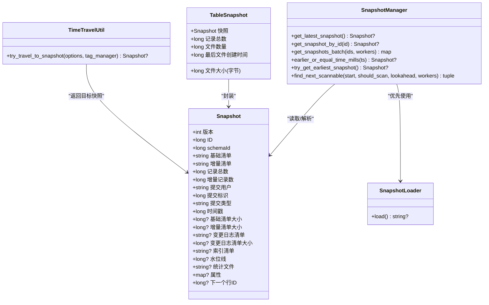
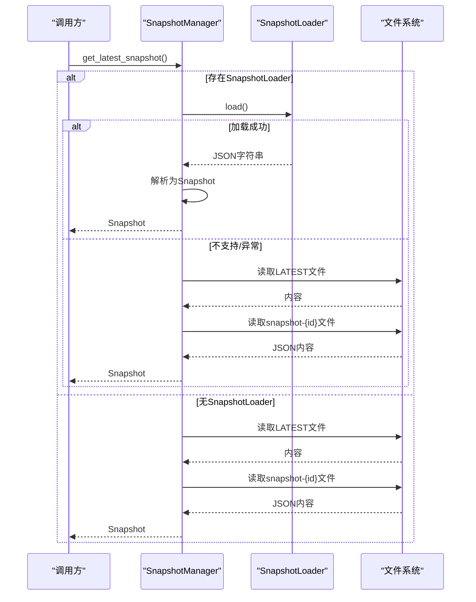
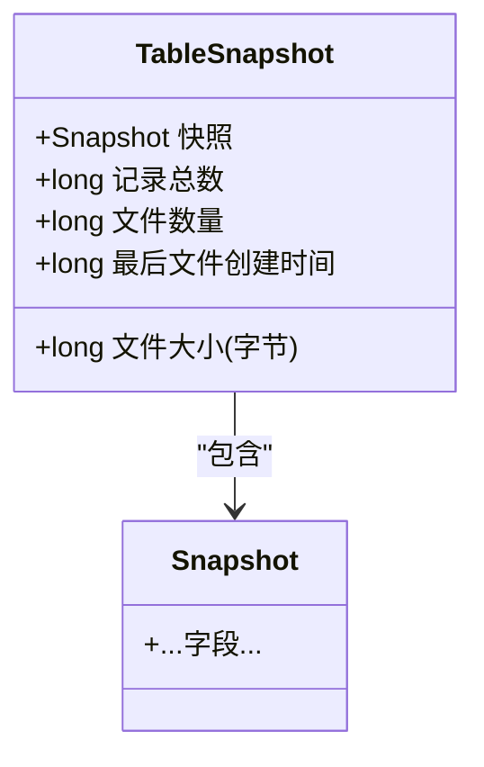
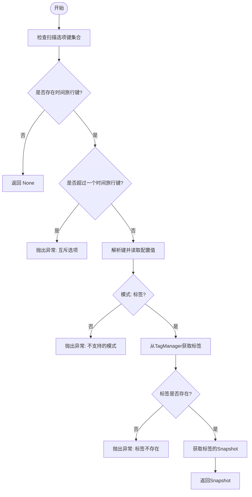
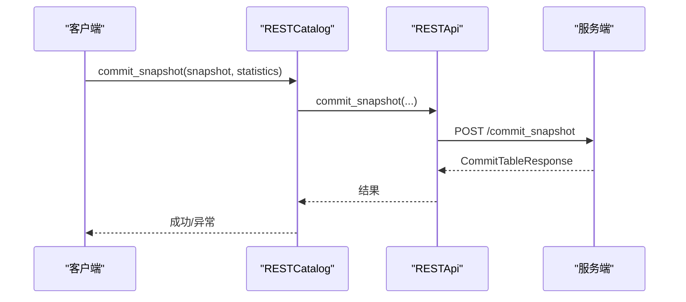
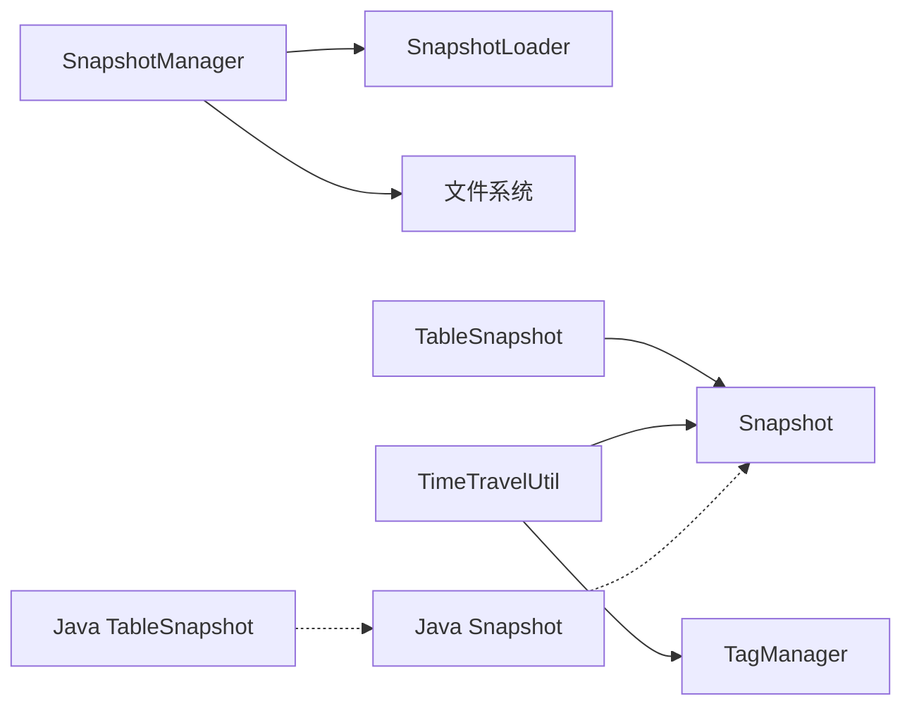

# 快照管理API

<cite>
**本文引用的文件**
- [paimon-python/pypaimon/snapshot/snapshot.py](file://paimon-python/pypaimon/snapshot/snapshot.py)
- [paimon-python/pypaimon/snapshot/snapshot_manager.py](file://paimon-python/pypaimon/snapshot/snapshot_manager.py)
- [paimon-python/pypaimon/snapshot/table_snapshot.py](file://paimon-python/pypaimon/snapshot/table_snapshot.py)
- [paimon-python/pypaimon/snapshot/time_travel_util.py](file://paimon-python/pypaimon/snapshot/time_travel_util.py)
- [paimon-python/pypaimon/snapshot/snapshot_loader.py](file://paimon-python/pypaimon/snapshot/snapshot_loader.py)
- [paimon-python/pypaimon/tests/snapshot_manager_test.py](file://paimon-python/pypaimon/tests/snapshot_manager_test.py)
- [paimon-python/pypaimon/tests/rest/rest_catalog_commit_snapshot_test.py](file://paimon-python/pypaimon/tests/rest/rest_catalog_commit_snapshot_test.py)
- [docs/content/maintenance/manage-snapshots.md](file://docs/content/maintenance/manage-snapshots.md)
- [paimon-api/src/main/java/org/apache/paimon/Snapshot.java](file://paimon-api/src/main/java/org/apache/paimon/Snapshot.java)
- [paimon-api/src/main/java/org/apache/paimon/table/TableSnapshot.java](file://paimon-api/src/main/java/org/apache/paimon/table/TableSnapshot.java)
</cite>

## 目录
1. [简介](#简介)
2. [项目结构](#项目结构)
3. [核心组件](#核心组件)
4. [架构总览](#架构总览)
5. [详细组件分析](#详细组件分析)
6. [依赖关系分析](#依赖关系分析)
7. [性能考量](#性能考量)
8. [故障排查指南](#故障排查指南)
9. [结论](#结论)
10. [附录](#附录)

## 简介
本文件系统性梳理并说明快照管理相关API，覆盖以下主题：
- Snapshot 类的属性与方法：字段语义、序列化/反序列化、状态检查与元数据访问
- SnapshotManager 的使用：快照列表、加载、删除（过期）等操作
- TableSnapshot 的API参考：表级统计信息与快照封装
- 时间旅行查询与版本回滚：基于标签的时间旅行工具
- 实际代码示例路径：展示快照生命周期管理、版本控制策略与数据恢复
- 性能优化与存储策略：保留窗口、并发读取、批拉取与故障恢复最佳实践

## 项目结构
围绕快照管理的核心文件组织如下：
- Python实现（paimon-python）：快照数据模型、管理器、时间旅行工具、加载器与测试
- Java API（paimon-api）：跨语言一致的快照与表快照定义
- 文档（docs）：快照保留策略、过期与回滚的操作指南

**图表来源**
- [paimon-python/pypaimon/snapshot/snapshot.py:27-52](file://paimon-python/pypaimon/snapshot/snapshot.py#L27-L52)
- [paimon-python/pypaimon/snapshot/snapshot_manager.py:29-42](file://paimon-python/pypaimon/snapshot/snapshot_manager.py#L29-L42)
- [paimon-python/pypaimon/snapshot/table_snapshot.py:25-39](file://paimon-python/pypaimon/snapshot/table_snapshot.py#L25-L39)
- [paimon-python/pypaimon/snapshot/time_travel_util.py:32-76](file://paimon-python/pypaimon/snapshot/time_travel_util.py#L32-L76)
- [paimon-python/pypaimon/snapshot/snapshot_loader.py:22-58](file://paimon-python/pypaimon/snapshot/snapshot_loader.py#L22-L58)
- [paimon-api/src/main/java/org/apache/paimon/Snapshot.java:43-274](file://paimon-api/src/main/java/org/apache/paimon/Snapshot.java#L43-L274)
- [paimon-api/src/main/java/org/apache/paimon/table/TableSnapshot.java:35-72](file://paimon-api/src/main/java/org/apache/paimon/table/TableSnapshot.java#L35-L72)
- [paimon-python/pypaimon/tests/snapshot_manager_test.py:36-140](file://paimon-python/pypaimon/tests/snapshot_manager_test.py#L36-L140)
- [paimon-python/pypaimon/tests/rest/rest_catalog_commit_snapshot_test.py:40-121](file://paimon-python/pypaimon/tests/rest/rest_catalog_commit_snapshot_test.py#L40-L121)
- [docs/content/maintenance/manage-snapshots.md:31-86](file://docs/content/maintenance/manage-snapshots.md#L31-L86)

**章节来源**
- [paimon-python/pypaimon/snapshot/snapshot.py:27-52](file://paimon-python/pypaimon/snapshot/snapshot.py#L27-L52)
- [paimon-python/pypaimon/snapshot/snapshot_manager.py:29-42](file://paimon-python/pypaimon/snapshot/snapshot_manager.py#L29-L42)
- [paimon-python/pypaimon/snapshot/table_snapshot.py:25-39](file://paimon-python/pypaimon/snapshot/table_snapshot.py#L25-L39)
- [paimon-python/pypaimon/snapshot/time_travel_util.py:32-76](file://paimon-python/pypaimon/snapshot/time_travel_util.py#L32-L76)
- [paimon-python/pypaimon/snapshot/snapshot_loader.py:22-58](file://paimon-python/pypaimon/snapshot/snapshot_loader.py#L22-L58)
- [paimon-api/src/main/java/org/apache/paimon/Snapshot.java:43-274](file://paimon-api/src/main/java/org/apache/paimon/Snapshot.java#L43-L274)
- [paimon-api/src/main/java/org/apache/paimon/table/TableSnapshot.java:35-72](file://paimon-api/src/main/java/org/apache/paimon/table/TableSnapshot.java#L35-L72)
- [docs/content/maintenance/manage-snapshots.md:31-86](file://docs/content/maintenance/manage-snapshots.md#L31-L86)

## 核心组件
- Snapshot（Python）
  - 字段涵盖版本、ID、schemaId、基础/增量清单、记录数、提交用户/标识、提交类型、时间戳、可选清单大小、变更日志清单、索引清单、水位线、统计文件、属性、行ID等
  - 支持JSON字段映射，便于序列化/反序列化
- Snapshot（Java）
  - 跨语言一致的字段与枚举（CommitKind），提供toJson/fromJson工具
- TableSnapshot（Python/Java）
  - 在Snapshot基础上增加表级统计：记录总数、文件大小、文件数量、最后文件创建时间
- SnapshotManager（Python）
  - 提供最新快照获取、按ID获取、批量获取、二分查找最近<=指定时间的快照、向前扫描下一可读快照等能力
- TimeTravelUtil（Python）
  - 基于选项解析时间旅行目标（当前支持标签名），返回对应快照
- SnapshotLoader（Python）
  - 从目录或目录加载器中加载最新快照（JSON字符串）

**章节来源**
- [paimon-python/pypaimon/snapshot/snapshot.py:27-52](file://paimon-python/pypaimon/snapshot/snapshot.py#L27-L52)
- [paimon-api/src/main/java/org/apache/paimon/Snapshot.java:43-274](file://paimon-api/src/main/java/org/apache/paimon/Snapshot.java#L43-L274)
- [paimon-python/pypaimon/snapshot/table_snapshot.py:25-39](file://paimon-python/pypaimon/snapshot/table_snapshot.py#L25-L39)
- [paimon-api/src/main/java/org/apache/paimon/table/TableSnapshot.java:35-72](file://paimon-api/src/main/java/org/apache/paimon/table/TableSnapshot.java#L35-L72)
- [paimon-python/pypaimon/snapshot/snapshot_manager.py:29-42](file://paimon-python/pypaimon/snapshot/snapshot_manager.py#L29-L42)
- [paimon-python/pypaimon/snapshot/time_travel_util.py:32-76](file://paimon-python/pypaimon/snapshot/time_travel_util.py#L32-L76)
- [paimon-python/pypaimon/snapshot/snapshot_loader.py:22-58](file://paimon-python/pypaimon/snapshot/snapshot_loader.py#L22-L58)

## 架构总览
下图展示了Python快照管理器与相关组件之间的交互关系。

**图表来源**
- [paimon-python/pypaimon/snapshot/snapshot.py:27-52](file://paimon-python/pypaimon/snapshot/snapshot.py#L27-L52)
- [paimon-python/pypaimon/snapshot/snapshot_manager.py:29-42](file://paimon-python/pypaimon/snapshot/snapshot_manager.py#L29-L42)
- [paimon-python/pypaimon/snapshot/table_snapshot.py:25-39](file://paimon-python/pypaimon/snapshot/table_snapshot.py#L25-L39)
- [paimon-python/pypaimon/snapshot/time_travel_util.py:32-76](file://paimon-python/pypaimon/snapshot/time_travel_util.py#L32-L76)
- [paimon-python/pypaimon/snapshot/snapshot_loader.py:22-58](file://paimon-python/pypaimon/snapshot/snapshot_loader.py#L22-L58)

## 详细组件分析

### Snapshot 类（Python）
- 字段语义
  - 版本/ID/schemaId：快照唯一标识与模式版本
  - 基础/增量清单：定位该快照对应的数据清单文件
  - 记录数：全量/增量记录数，用于统计与过期策略
  - 提交用户/标识/类型/时间戳：审计与排序依据
  - 可选字段：清单大小、变更日志清单、索引清单、水位线、统计文件、属性、下一个行ID
- 序列化/反序列化
  - 使用JSON字段映射，便于持久化与网络传输
- 典型用法
  - 作为快照管理器的返回值与输入参数
  - 与TableSnapshot组合提供表级统计

**章节来源**
- [paimon-python/pypaimon/snapshot/snapshot.py:27-52](file://paimon-python/pypaimon/snapshot/snapshot.py#L27-L52)

### SnapshotManager（Python）
- 主要职责
  - 获取最新快照：优先使用SnapshotLoader，失败时回退到文件系统
  - 读取LATEST/EARLIEST文件，解析快照ID并读取对应快照文件
  - 批量获取快照：存在性检查后并行读取，提升吞吐
  - 二分查找<=指定时间的快照：处理快照空洞（过期）
  - 向前扫描下一可读快照：带预读窗口的高效扫描
- 并发与容错
  - 批量读取使用线程池，限制最大并发
  - 重试机制读取LATEST文件，避免竞态
  - 对不存在的快照发出警告并继续推进

**图表来源**
- [paimon-python/pypaimon/snapshot/snapshot_manager.py:43-86](file://paimon-python/pypaimon/snapshot/snapshot_manager.py#L43-L86)
- [paimon-python/pypaimon/snapshot/snapshot_loader.py:39-57](file://paimon-python/pypaimon/snapshot/snapshot_loader.py#L39-L57)

**章节来源**
- [paimon-python/pypaimon/snapshot/snapshot_manager.py:29-284](file://paimon-python/pypaimon/snapshot/snapshot_manager.py#L29-L284)

### TableSnapshot（Python/Java）
- Python
  - 封装Snapshot，并追加表级统计字段（记录总数、文件大小、文件数量、最后文件创建时间）
- Java
  - 与Java API中的TableSnapshot保持字段一致，便于跨语言交互

**图表来源**
- [paimon-python/pypaimon/snapshot/table_snapshot.py:25-39](file://paimon-python/pypaimon/snapshot/table_snapshot.py#L25-L39)
- [paimon-api/src/main/java/org/apache/paimon/table/TableSnapshot.java:35-72](file://paimon-api/src/main/java/org/apache/paimon/table/TableSnapshot.java#L35-L72)

**章节来源**
- [paimon-python/pypaimon/snapshot/table_snapshot.py:25-39](file://paimon-python/pypaimon/snapshot/table_snapshot.py#L25-L39)
- [paimon-api/src/main/java/org/apache/paimon/table/TableSnapshot.java:35-72](file://paimon-api/src/main/java/org/apache/paimon/table/TableSnapshot.java#L35-L72)

### 时间旅行查询（TimeTravelUtil）
- 功能
  - 从扫描选项中解析时间旅行目标（当前支持“按标签”）
  - 校验互斥选项，确保仅设置一种时间旅行模式
  - 通过TagManager获取标签对应的Snapshot
- 错误处理
  - 未设置任何时间旅行选项时返回None
  - 设置多个互斥选项抛出异常
  - 标签不存在时抛出异常

**图表来源**
- [paimon-python/pypaimon/snapshot/time_travel_util.py:32-76](file://paimon-python/pypaimon/snapshot/time_travel_util.py#L32-L76)

**章节来源**
- [paimon-python/pypaimon/snapshot/time_travel_util.py:32-76](file://paimon-python/pypaimon/snapshot/time_travel_util.py#L32-L76)

### 快照生命周期与版本控制（REST 提交示例）
- 提交快照流程
  - 构造Snapshot与分区统计
  - 通过REST Catalog提交快照，验证响应
  - 异常场景：表不存在、API错误、客户端与服务端状态不一致时的行为
- 版本控制策略
  - 通过提交标识（commitIdentifier）保证幂等与顺序
  - 通过提交类型（commitKind）区分追加/合并/覆盖/分析

**图表来源**
- [paimon-python/pypaimon/tests/rest/rest_catalog_commit_snapshot_test.py:91-121](file://paimon-python/pypaimon/tests/rest/rest_catalog_commit_snapshot_test.py#L91-L121)

**章节来源**
- [paimon-python/pypaimon/tests/rest/rest_catalog_commit_snapshot_test.py:40-121](file://paimon-python/pypaimon/tests/rest/rest_catalog_commit_snapshot_test.py#L40-L121)

### 批量拉取与向前扫描（测试用例）
- 批量拉取
  - 使用exists_batch快速过滤不存在的快照，再并行读取存在的快照
- 向前扫描
  - 预读固定窗口（lookahead_size），逐个判定should_scan条件
  - 返回首个满足条件的快照及后续扫描起点

**章节来源**
- [paimon-python/pypaimon/tests/snapshot_manager_test.py:36-140](file://paimon-python/pypaimon/tests/snapshot_manager_test.py#L36-L140)
- [paimon-python/pypaimon/snapshot/snapshot_manager.py:254-284](file://paimon-python/pypaimon/snapshot/snapshot_manager.py#L254-L284)

## 依赖关系分析
- SnapshotManager 依赖 SnapshotLoader 与文件系统
- TableSnapshot 依赖 Snapshot
- TimeTravelUtil 依赖 TagManager 与 Snapshot
- Java API 中的 Snapshot 与 TableSnapshot 与 Python 实现字段对齐，便于跨语言交互

**图表来源**
- [paimon-python/pypaimon/snapshot/snapshot_manager.py:29-42](file://paimon-python/pypaimon/snapshot/snapshot_manager.py#L29-L42)
- [paimon-python/pypaimon/snapshot/snapshot_loader.py:22-58](file://paimon-python/pypaimon/snapshot/snapshot_loader.py#L22-L58)
- [paimon-python/pypaimon/snapshot/table_snapshot.py:25-39](file://paimon-python/pypaimon/snapshot/table_snapshot.py#L25-L39)
- [paimon-python/pypaimon/snapshot/time_travel_util.py:32-76](file://paimon-python/pypaimon/snapshot/time_travel_util.py#L32-L76)
- [paimon-api/src/main/java/org/apache/paimon/Snapshot.java:43-274](file://paimon-api/src/main/java/org/apache/paimon/Snapshot.java#L43-L274)
- [paimon-api/src/main/java/org/apache/paimon/table/TableSnapshot.java:35-72](file://paimon-api/src/main/java/org/apache/paimon/table/TableSnapshot.java#L35-L72)

**章节来源**
- [paimon-python/pypaimon/snapshot/snapshot_manager.py:29-42](file://paimon-python/pypaimon/snapshot/snapshot_manager.py#L29-L42)
- [paimon-python/pypaimon/snapshot/table_snapshot.py:25-39](file://paimon-python/pypaimon/snapshot/table_snapshot.py#L25-L39)
- [paimon-python/pypaimon/snapshot/time_travel_util.py:32-76](file://paimon-python/pypaimon/snapshot/time_travel_util.py#L32-L76)
- [paimon-api/src/main/java/org/apache/paimon/Snapshot.java:43-274](file://paimon-api/src/main/java/org/apache/paimon/Snapshot.java#L43-L274)
- [paimon-api/src/main/java/org/apache/paimon/table/TableSnapshot.java:35-72](file://paimon-api/src/main/java/org/apache/paimon/table/TableSnapshot.java#L35-L72)

## 性能考量
- 批量读取
  - 使用exists_batch减少无效IO，随后并行读取存在的快照
  - 并发度由max_workers限制，避免过度竞争
- 二分查找
  - 对时间旅行查询采用二分搜索，跳过缺失的快照ID，降低I/O次数
- 预读扫描
  - find_next_scannable使用lookahead窗口，提高流式扫描吞吐
- 过期与保留策略
  - 通过snapshot.time-retained、snapshot.num-retained.min/max、执行模式与限制，平衡空间占用与查询稳定性
  - 过期同步/异步模式影响背压与批作业完成率

**章节来源**
- [paimon-python/pypaimon/snapshot/snapshot_manager.py:219-252](file://paimon-python/pypaimon/snapshot/snapshot_manager.py#L219-L252)
- [paimon-python/pypaimon/snapshot/snapshot_manager.py:151-201](file://paimon-python/pypaimon/snapshot/snapshot_manager.py#L151-L201)
- [docs/content/maintenance/manage-snapshots.md:31-86](file://docs/content/maintenance/manage-snapshots.md#L31-L86)

## 故障排查指南
- 最新快照为空
  - 检查LATEST文件是否存在且非空；若不存在则扫描snapshot目录寻找最大ID
  - 若仍为空，确认表是否已写入数据或权限问题
- 快照缺失
  - 二分查找可能遇到过期导致的空洞；程序会向前查找下一个存在的快照
  - 若EARLIEST指向的快照消失，记录警告并尝试从ID=1开始
- 时间旅行异常
  - 互斥选项冲突：仅允许设置scan.tag-name之一
  - 标签名不存在：确认标签是否已创建
- 提交失败
  - 表不存在：先创建表再提交
  - API异常：检查网络与认证配置
  - 客户端与服务端状态不一致：遵循文档建议，服务端成功提交后客户端不再回滚

**章节来源**
- [paimon-python/pypaimon/snapshot/snapshot_manager.py:69-131](file://paimon-python/pypaimon/snapshot/snapshot_manager.py#L69-L131)
- [paimon-python/pypaimon/snapshot/snapshot_manager.py:137-201](file://paimon-python/pypaimon/snapshot/snapshot_manager.py#L137-L201)
- [paimon-python/pypaimon/snapshot/time_travel_util.py:56-76](file://paimon-python/pypaimon/snapshot/time_travel_util.py#L56-L76)
- [paimon-python/pypaimon/tests/rest/rest_catalog_commit_snapshot_test.py:122-166](file://paimon-python/pypaimon/tests/rest/rest_catalog_commit_snapshot_test.py#L122-L166)

## 结论
- 快照是Paimon表在某一时刻的完整镜像，承载数据清单、统计与审计信息
- SnapshotManager提供了从文件系统/目录加载器中稳定获取快照的能力，并支持批量与时间旅行查询
- TableSnapshot为上层应用提供表级统计信息，简化读取与监控
- TimeTravelUtil将“按标签”的时间旅行能力以统一接口暴露
- 结合保留策略与过期机制，可在存储成本与查询稳定性之间取得平衡

## 附录
- 快照保留与过期策略（表）
  - snapshot.time-retained：保留时长
  - snapshot.num-retained.min/max：最小/最大保留数量
  - snapshot.expire.execution-mode：过期执行模式（同步/异步）
  - snapshot.expire.limit：单次最多过期数量
- 回滚到快照
  - 通过SQL/动作/Java API回滚至指定快照ID，谨慎评估对下游的影响

**章节来源**
- [docs/content/maintenance/manage-snapshots.md:31-86](file://docs/content/maintenance/manage-snapshots.md#L31-L86)
- [docs/content/maintenance/manage-snapshots.md:283-353](file://docs/content/maintenance/manage-snapshots.md#L283-L353)