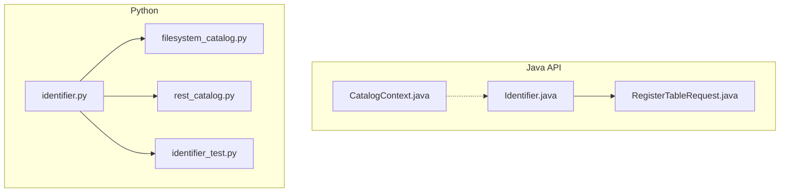
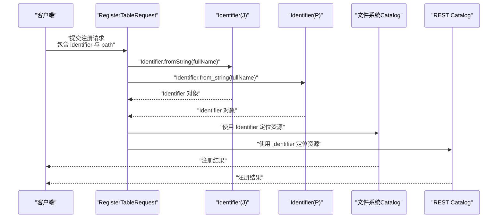
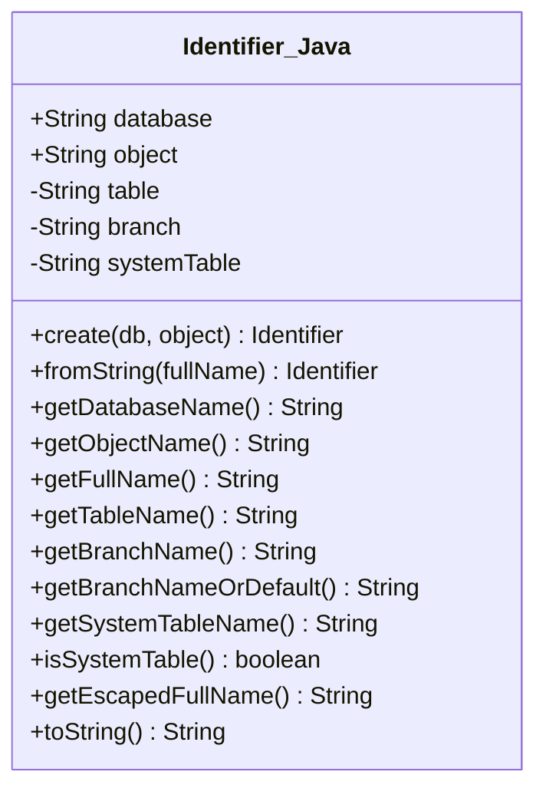
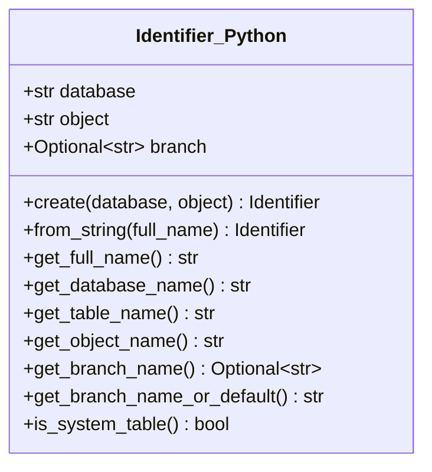
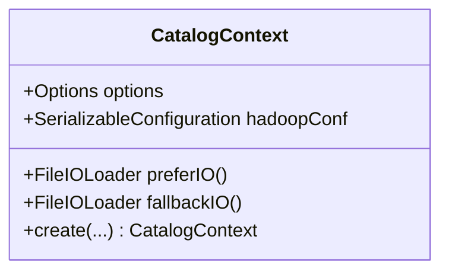
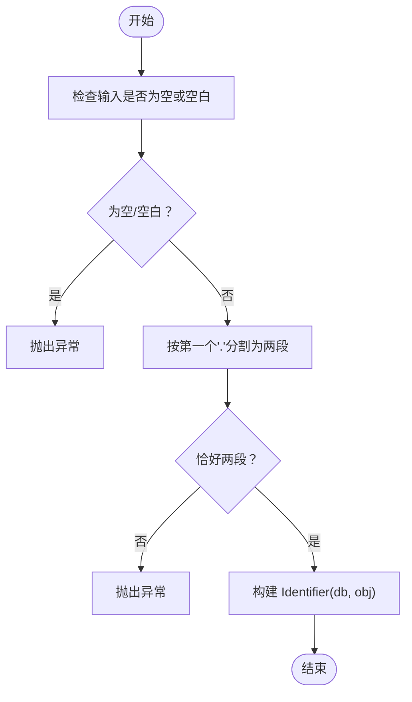
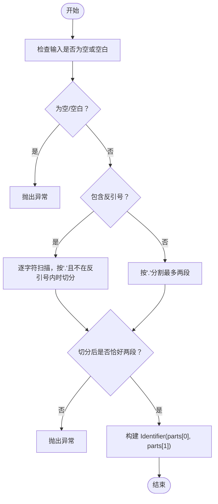
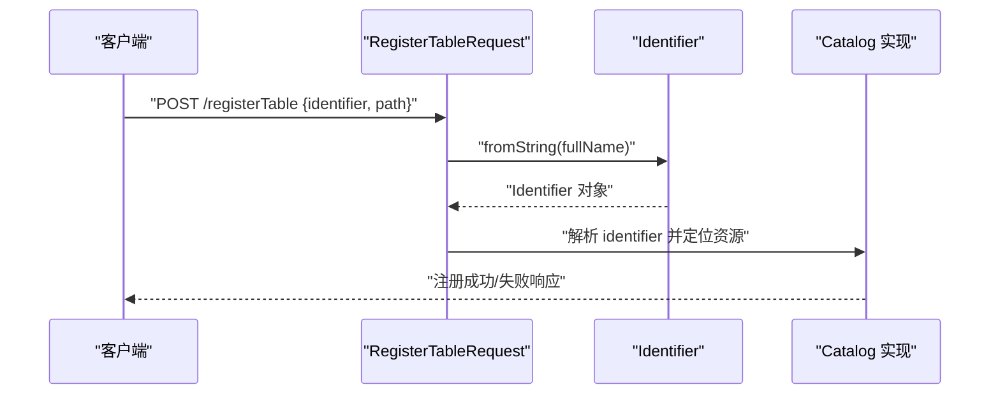
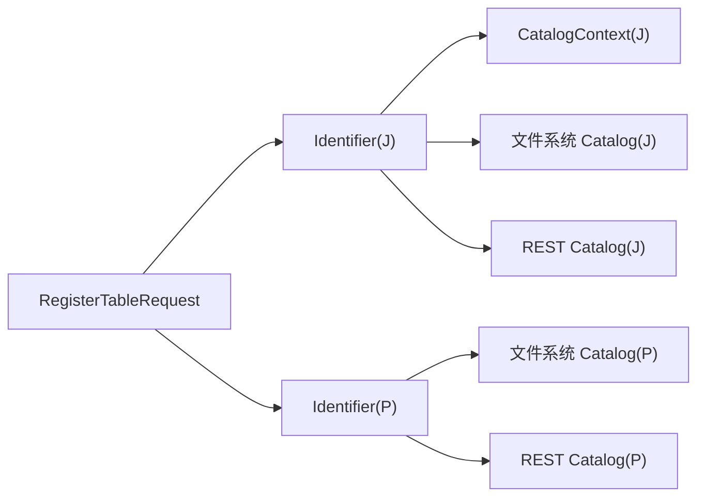

# 标识符管理API

<cite>
**本文引用的文件**
- [Identifier.java](file://paimon-api/src/main/java/org/apache/paimon/catalog/Identifier.java)
- [identifier.py](file://paimon-python/pypaimon/common/identifier.py)
- [identifier_test.py](file://paimon-python/pypaimon/tests/identifier_test.py)
- [CatalogContext.java](file://paimon-common/src/main/java/org/apache/paimon/catalog/CatalogContext.java)
- [filesystem_catalog.py](file://paimon-python/pypaimon/catalog/filesystem_catalog.py)
- [rest_catalog.py](file://paimon-python/pypaimon/catalog/rest/rest_catalog.py)
- [RegisterTableRequest.java](file://paimon-api/src/main/java/org/apache/paimon/rest/requests/RegisterTableRequest.java)
- [SparkUtils.java](file://paimon-spark/paimon-spark-common/src/main/java/org/apache/paimon/spark/SparkUtils.java)
</cite>

## 目录
1. [简介](#简介)
2. [项目结构](#项目结构)
3. [核心组件](#核心组件)
4. [架构总览](#架构总览)
5. [详细组件分析](#详细组件分析)
6. [依赖关系分析](#依赖关系分析)
7. [性能考量](#性能考量)
8. [故障排查指南](#故障排查指南)
9. [结论](#结论)
10. [附录](#附录)

## 简介
本文件系统化梳理并说明 Paimon 的标识符管理API，重点围绕 Identifier 类在 Java 与 Python 中的使用方式，涵盖数据库名与对象名（表名）的规范化处理、路径解析、分支与系统表标识、构造与比较、字符串表示等基础能力，并结合 CatalogContext 的上下文信息说明标识符解析与验证机制。同时提供资源定位与访问控制的实践建议，以及命名规范、特殊字符处理与大小写敏感性的注意事项。

## 项目结构
与标识符管理直接相关的代码分布在以下模块：
- Java API 层：org.apache.paimon.catalog.Identifier 提供标准的标识符模型与解析逻辑
- Python 公共层：pypaimon.common.identifier 提供与 Java 对齐的标识符解析与工具方法
- Catalog 上下文：org.apache.paimon.catalog.CatalogContext 提供仓库、Hadoop 配置与 IO 加载器等环境参数
- Catalog 实现：Python 文件系统与 REST Catalog 在实际调用中对标识符进行解析与验证
- 请求模型：org.apache.paimon.rest.requests.RegisterTableRequest 使用 Identifier 进行注册请求

图表来源
- [Identifier.java:49-239](file://paimon-api/src/main/java/org/apache/paimon/catalog/Identifier.java#L49-L239)
- [CatalogContext.java:43-114](file://paimon-common/src/main/java/org/apache/paimon/catalog/CatalogContext.java#L43-L114)
- [RegisterTableRequest.java:31-59](file://paimon-api/src/main/java/org/apache/paimon/rest/requests/RegisterTableRequest.java#L31-L59)
- [identifier.py:29-107](file://paimon-python/pypaimon/common/identifier.py#L29-L107)
- [filesystem_catalog.py:122-144](file://paimon-python/pypaimon/catalog/filesystem_catalog.py#L122-L144)
- [rest_catalog.py:214-235](file://paimon-python/pypaimon/catalog/rest/rest_catalog.py#L214-L235)

章节来源
- [Identifier.java:49-239](file://paimon-api/src/main/java/org/apache/paimon/catalog/Identifier.java#L49-L239)
- [identifier.py:29-107](file://paimon-python/pypaimon/common/identifier.py#L29-L107)
- [CatalogContext.java:43-114](file://paimon-common/src/main/java/org/apache/paimon/catalog/CatalogContext.java#L43-L114)
- [filesystem_catalog.py:122-144](file://paimon-python/pypaimon/catalog/filesystem_catalog.py#L122-L144)
- [rest_catalog.py:214-235](file://paimon-python/pypaimon/catalog/rest/rest_catalog.py#L214-L235)
- [RegisterTableRequest.java:31-59](file://paimon-api/src/main/java/org/apache/paimon/rest/requests/RegisterTableRequest.java#L31-L59)

## 核心组件
- Identifier（Java）
  - 字段：database、object；支持延迟拆分出 table、branch、systemTable
  - 构造：静态工厂 create、fromString；带分支与系统表的构造函数
  - 解析：从“db.object”字符串解析；支持转义全名
  - 查询：获取表名、分支名、系统表名；判断是否为系统表
  - 比较与序列化：基于 database 与 object 的相等性与哈希
- Identifier（Python）
  - 字段：database、object、branch
  - 构造：create、from_string；支持反引号（backtick）包裹的名称
  - 工具：get_full_name、get_database_name、get_table_name、get_branch_name_or_default、is_system_table
- CatalogContext（Java）
  - 提供仓库路径、Hadoop 配置、优先与回退的 FileIOLoader 等上下文参数

章节来源
- [Identifier.java:82-239](file://paimon-api/src/main/java/org/apache/paimon/catalog/Identifier.java#L82-L239)
- [identifier.py:29-107](file://paimon-python/pypaimon/common/identifier.py#L29-L107)
- [CatalogContext.java:52-114](file://paimon-common/src/main/java/org/apache/paimon/catalog/CatalogContext.java#L52-L114)

## 架构总览
标识符在系统中的流转路径如下：
- 输入：用户或客户端传入的“数据库.对象”字符串或对象
- 解析：Identifier.fromString 或 Python 的 Identifier.from_string 将字符串解析为结构化标识符
- 规范化：Java 侧通过 splitObjectName 延迟拆分 table/branch/systemTable；Python 侧通过 get_full_name 统一输出格式
- 使用：Catalog 实现（文件系统/REST）接收标识符，执行资源定位与访问控制
- 输出：返回表路径、元数据或执行结果

图表来源
- [RegisterTableRequest.java:31-59](file://paimon-api/src/main/java/org/apache/paimon/rest/requests/RegisterTableRequest.java#L31-L59)
- [Identifier.java:203-216](file://paimon-api/src/main/java/org/apache/paimon/catalog/Identifier.java#L203-L216)
- [identifier.py:40-58](file://paimon-python/pypaimon/common/identifier.py#L40-L58)
- [filesystem_catalog.py:122-144](file://paimon-python/pypaimon/catalog/filesystem_catalog.py#L122-L144)
- [rest_catalog.py:214-235](file://paimon-python/pypaimon/catalog/rest/rest_catalog.py#L214-L235)

## 详细组件分析

### Java Identifier 类
- 数据结构与字段
  - database：数据库名
  - object：对象名（可能包含表名、分支与系统表信息）
  - table、branch、systemTable：延迟拆分缓存
- 构造方式
  - create/db.object 构造
  - fromString：按“.”分割首段作为数据库名，剩余作为对象名
  - 带分支与系统表的构造：自动拼接分隔符
- 路径与转义
  - getFullName：未知数据库时仅返回对象名，否则返回“db.object”
  - getEscapedFullName：使用反引号包裹数据库与对象名
- 解析与验证
  - splitObjectName：根据“$”与“branch_”前缀拆分对象名，校验系统表格式
  - isSystemTable：判断是否存在系统表后缀
- 比较与序列化
  - 基于 database 与 object 的 equals/hashCode
  - toString：用于日志与调试

图表来源
- [Identifier.java:49-239](file://paimon-api/src/main/java/org/apache/paimon/catalog/Identifier.java#L49-L239)

章节来源
- [Identifier.java:82-239](file://paimon-api/src/main/java/org/apache/paimon/catalog/Identifier.java#L82-L239)

### Python Identifier 类
- 数据结构与字段
  - database、object、branch（可选）
- 构造方式
  - create：简化构造
  - from_string：支持反引号包裹的数据库或对象名，Java 兼容首点分割
- 工具方法
  - get_full_name：统一输出“db.object”或“db.object.branch”
  - get_database_name/get_table_name/get_object_name/get_branch_name/get_branch_name_or_default/is_system_table

图表来源
- [identifier.py:29-107](file://paimon-python/pypaimon/common/identifier.py#L29-L107)

章节来源
- [identifier.py:29-107](file://paimon-python/pypaimon/common/identifier.py#L29-L107)
- [identifier_test.py:27-94](file://paimon-python/pypaimon/tests/identifier_test.py#L27-L94)

### CatalogContext 上下文
- 提供仓库路径、Hadoop 配置、FileIOLoader（优先与回退）等环境参数
- 用于 Catalog 初始化与资源访问控制的上下文支撑

图表来源
- [CatalogContext.java:43-114](file://paimon-common/src/main/java/org/apache/paimon/catalog/CatalogContext.java#L43-L114)

章节来源
- [CatalogContext.java:52-114](file://paimon-common/src/main/java/org/apache/paimon/catalog/CatalogContext.java#L52-L114)

### 标识符解析与验证流程（Java）

图表来源
- [Identifier.java:203-216](file://paimon-api/src/main/java/org/apache/paimon/catalog/Identifier.java#L203-L216)

章节来源
- [Identifier.java:203-216](file://paimon-api/src/main/java/org/apache/paimon/catalog/Identifier.java#L203-L216)

### 标识符解析与验证流程（Python）

图表来源
- [identifier.py:40-83](file://paimon-python/pypaimon/common/identifier.py#L40-L83)

章节来源
- [identifier.py:40-83](file://paimon-python/pypaimon/common/identifier.py#L40-L83)

### API 调用序列（注册表）

图表来源
- [RegisterTableRequest.java:31-59](file://paimon-api/src/main/java/org/apache/paimon/rest/requests/RegisterTableRequest.java#L31-L59)
- [Identifier.java:203-216](file://paimon-api/src/main/java/org/apache/paimon/catalog/Identifier.java#L203-L216)
- [identifier.py:40-58](file://paimon-python/pypaimon/common/identifier.py#L40-L58)

章节来源
- [RegisterTableRequest.java:31-59](file://paimon-api/src/main/java/org/apache/paimon/rest/requests/RegisterTableRequest.java#L31-L59)
- [filesystem_catalog.py:122-144](file://paimon-python/pypaimon/catalog/filesystem_catalog.py#L122-L144)
- [rest_catalog.py:214-235](file://paimon-python/pypaimon/catalog/rest/rest_catalog.py#L214-L235)

## 依赖关系分析
- Identifier 与 Catalog 的耦合
  - Java：Identifier 由 CatalogContext 提供的仓库与配置驱动，用于定位表路径与执行访问控制
  - Python：Catalog 实现（文件系统/REST）在内部将字符串标识符转换为 Identifier 后再执行资源定位
- 请求模型对 Identifier 的依赖
  - RegisterTableRequest 直接持有 Identifier 字段，确保注册接口的标识符一致性

图表来源
- [Identifier.java:49-239](file://paimon-api/src/main/java/org/apache/paimon/catalog/Identifier.java#L49-L239)
- [CatalogContext.java:43-114](file://paimon-common/src/main/java/org/apache/paimon/catalog/CatalogContext.java#L43-L114)
- [RegisterTableRequest.java:31-59](file://paimon-api/src/main/java/org/apache/paimon/rest/requests/RegisterTableRequest.java#L31-L59)
- [identifier.py:29-107](file://paimon-python/pypaimon/common/identifier.py#L29-L107)
- [filesystem_catalog.py:122-144](file://paimon-python/pypaimon/catalog/filesystem_catalog.py#L122-L144)
- [rest_catalog.py:214-235](file://paimon-python/pypaimon/catalog/rest/rest_catalog.py#L214-L235)

章节来源
- [RegisterTableRequest.java:31-59](file://paimon-api/src/main/java/org/apache/paimon/rest/requests/RegisterTableRequest.java#L31-L59)
- [filesystem_catalog.py:122-144](file://paimon-python/pypaimon/catalog/filesystem_catalog.py#L122-L144)
- [rest_catalog.py:214-235](file://paimon-python/pypaimon/catalog/rest/rest_catalog.py#L214-L235)

## 性能考量
- 延迟拆分：Java Identifier 在首次访问表名/分支/系统表时才拆分对象名，避免不必要的字符串处理
- 缓存字段：table、branch、systemTable 作为延迟拆分的缓存，减少重复计算
- 字符串拼接：构造含分支与系统表的对象名时采用 StringBuilder，降低多次拼接开销
- 解析策略：Java 严格按首个点分割，Python 支持反引号包裹，两者在复杂命名场景下各有优势

## 故障排查指南
- 常见错误与原因
  - 空字符串或空白：解析前需校验输入
  - 缺少分隔符：无法拆分为“数据库.对象”
  - 反引号未闭合或格式不合法：Python 解析会拒绝非法 backtick 格式
  - 对象名格式非法：Java splitObjectName 校验系统表分隔符数量与前缀
- 排查步骤
  - 确认输入字符串是否符合“db.object”格式
  - 若包含特殊字符或点号，使用反引号包裹对应部分
  - 检查是否误用多个“$”或“branch_”前缀
  - 对照单元测试用例验证边界行为

章节来源
- [identifier_test.py:70-94](file://paimon-python/pypaimon/tests/identifier_test.py#L70-L94)
- [identifier.py:40-83](file://paimon-python/pypaimon/common/identifier.py#L40-L83)
- [Identifier.java:157-186](file://paimon-api/src/main/java/org/apache/paimon/catalog/Identifier.java#L157-L186)

## 结论
Identifier 是 Paimon 标识资源的核心抽象，Java 与 Python 两端提供了高度一致的解析与工具能力。通过 CatalogContext 提供的上下文参数，标识符在文件系统与 REST Catalog 中得以正确解析与验证，从而完成资源定位与访问控制。遵循本文的命名规范与注意事项，可在多端保持一致的行为与可预期的结果。

## 附录

### 使用示例（路径指引）
- Java
  - 从字符串创建标识符：[Identifier.fromString:203-216](file://paimon-api/src/main/java/org/apache/paimon/catalog/Identifier.java#L203-L216)
  - 获取表名/分支/系统表：[Identifier.getTableName/getBranchName/getSystemTableName:129-150](file://paimon-api/src/main/java/org/apache/paimon/catalog/Identifier.java#L129-L150)
  - 注册表请求携带标识符：[RegisterTableRequest:31-59](file://paimon-api/src/main/java/org/apache/paimon/rest/requests/RegisterTableRequest.java#L31-L59)
- Python
  - 从字符串创建标识符：[Identifier.from_string:40-58](file://paimon-python/pypaimon/common/identifier.py#L40-L58)
  - 获取完整名称与分支默认值：[Identifier.get_full_name/get_branch_name_or_default:85-104](file://paimon-python/pypaimon/common/identifier.py#L85-L104)
  - Catalog 实现中的解析调用示例：[filesystem_catalog.py:122-144](file://paimon-python/pypaimon/catalog/filesystem_catalog.py#L122-L144)、[rest_catalog.py:214-235](file://paimon-python/pypaimon/catalog/rest/rest_catalog.py#L214-L235)

### 命名规范与注意事项
- 分隔符
  - 数据库与对象使用“.”分隔；对象内部可包含点号（Java 首点分割；Python 支持反引号包裹）
- 特殊字符
  - 反引号用于包裹包含点号或保留字符的名称；注意成对出现与位置
- 大小写敏感性
  - 标识符在解析与比较中区分大小写；请确保输入与存储一致
- 系统表与分支
  - 系统表使用“$”分隔；分支使用“branch_”前缀；二者组合时顺序与数量受严格校验
- 访问控制
  - CatalogContext 提供仓库与配置上下文，结合 Identifier 的表名/分支/系统表信息进行权限判定与资源定位