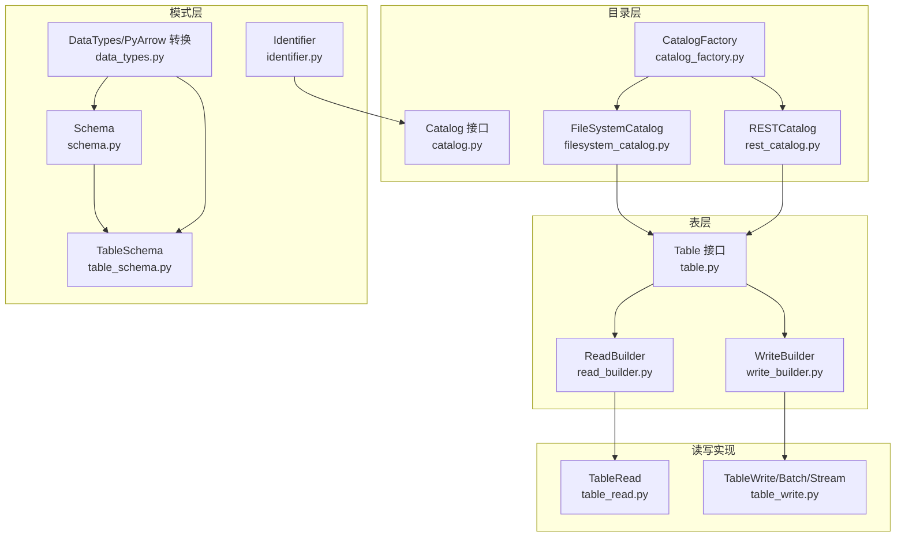
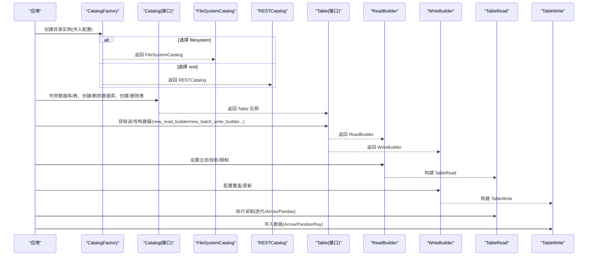
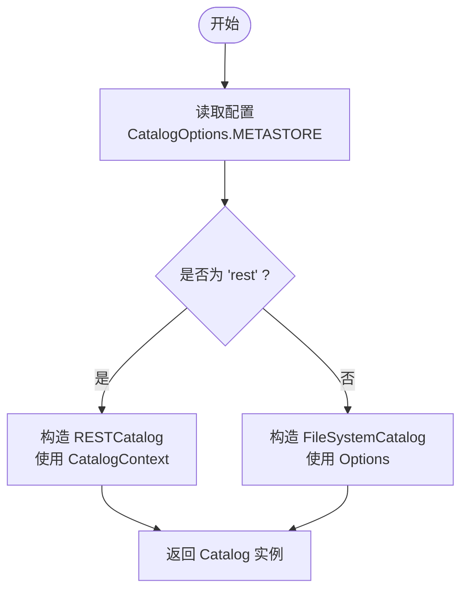
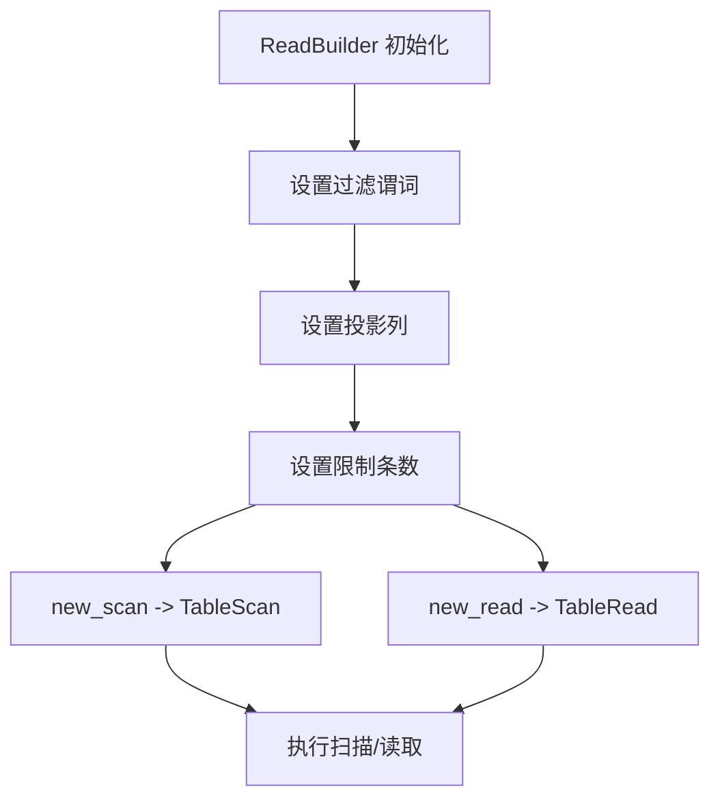
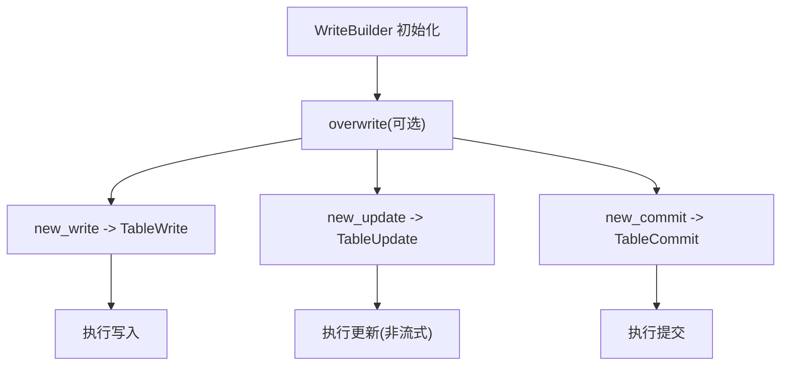
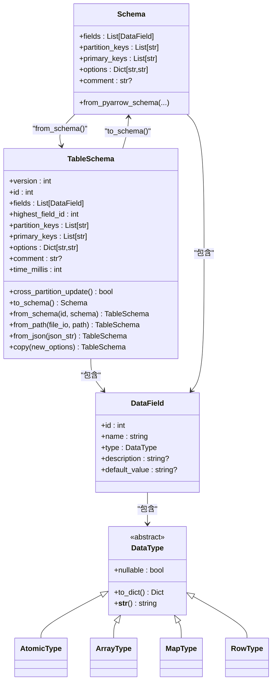
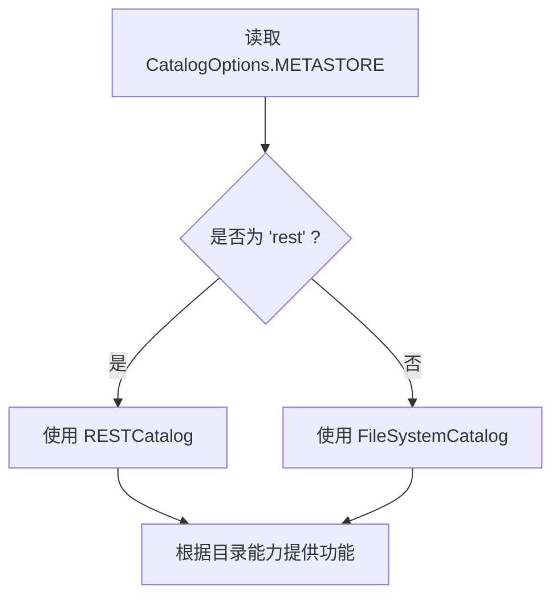
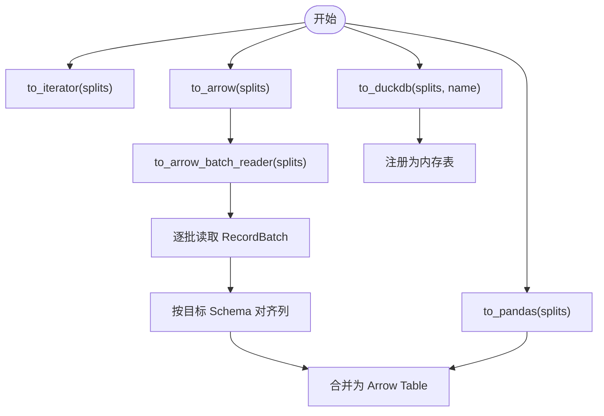
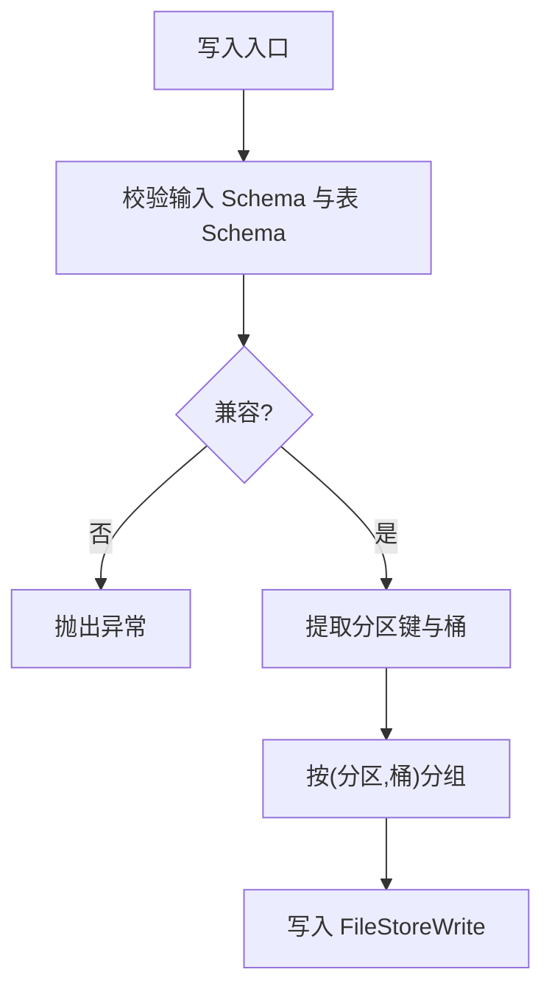
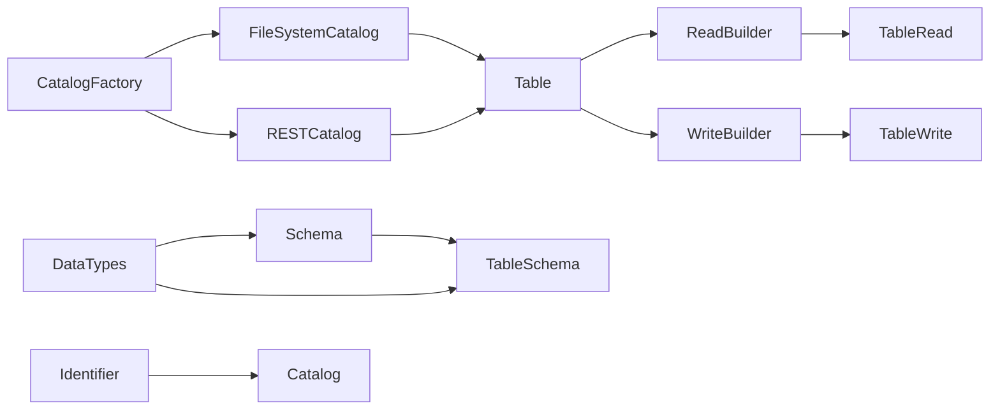

# 核心API参考

<cite>
**本文引用的文件**
- [pypaimon/__init__.py](file://paimon-python/pypaimon/__init__.py)
- [catalog.py](file://paimon-python/pypaimon/catalog/catalog.py)
- [table.py](file://paimon-python/pypaimon/table/table.py)
- [schema.py](file://paimon-python/pypaimon/schema/schema.py)
- [table_schema.py](file://paimon-python/pypaimon/schema/table_schema.py)
- [catalog_factory.py](file://paimon-python/pypaimon/catalog/catalog_factory.py)
- [read_builder.py](file://paimon-python/pypaimon/read/read_builder.py)
- [write_builder.py](file://paimon-python/pypaimon/write/write_builder.py)
- [data_types.py](file://paimon-python/pypaimon/schema/data_types.py)
- [identifier.py](file://paimon-python/pypaimon/common/identifier.py)
- [table_read.py](file://paimon-python/pypaimon/read/table_read.py)
- [table_write.py](file://paimon-python/pypaimon/write/table_write.py)
- [filesystem_catalog.py](file://paimon-python/pypaimon/catalog/filesystem_catalog.py)
- [rest_catalog.py](file://paimon-python/pypaimon/catalog/rest/rest_catalog.py)
</cite>

## 目录
1. [简介](#简介)
2. [项目结构](#项目结构)
3. [核心组件](#核心组件)
4. [架构总览](#架构总览)
5. [详细组件分析](#详细组件分析)
6. [依赖分析](#依赖分析)
7. [性能考虑](#性能考虑)
8. [故障排查指南](#故障排查指南)
9. [结论](#结论)
10. [附录](#附录)

## 简介
本参考文档面向使用 Paimon Python API 的开发者，系统性介绍以下核心类与方法：
- Catalog 抽象接口及其实现（文件系统目录与 REST 目录）
- Table 抽象接口及其读写构建器
- Schema 与 TableSchema 的字段定义、类型转换与模式演进
- 关键 API 的参数说明、返回值类型、异常处理与最佳实践

文档以“从抽象到实现”的方式组织，先给出高层架构与组件关系，再深入到具体类与方法，并辅以流程图与时序图帮助理解。

## 项目结构
围绕 Python API 的核心模块如下：
- catalog：目录接口与工厂，以及文件系统与 REST 实现
- table：表抽象与读写构建器
- schema：Schema 与 TableSchema 定义、字段与类型转换
- read / write：读取与写入的构建器与执行器
- common：通用工具（如标识符解析）

**图表来源**
- [catalog.py:29-296](file://paimon-python/pypaimon/catalog/catalog.py#L29-L296)
- [filesystem_catalog.py:43-346](file://paimon-python/pypaimon/catalog/filesystem_catalog.py#L43-L346)
- [rest_catalog.py:56-509](file://paimon-python/pypaimon/catalog/rest/rest_catalog.py#L56-L509)
- [catalog_factory.py:28-45](file://paimon-python/pypaimon/catalog/catalog_factory.py#L28-L45)
- [table.py:26-44](file://paimon-python/pypaimon/table/table.py#L26-L44)
- [read_builder.py:29-79](file://paimon-python/pypaimon/read/read_builder.py#L29-L79)
- [write_builder.py:30-83](file://paimon-python/pypaimon/write/write_builder.py#L30-L83)
- [schema.py:28-96](file://paimon-python/pypaimon/schema/schema.py#L28-L96)
- [table_schema.py:31-147](file://paimon-python/pypaimon/schema/table_schema.py#L31-L147)
- [data_types.py:55-706](file://paimon-python/pypaimon/schema/data_types.py#L55-L706)
- [identifier.py:28-108](file://paimon-python/pypaimon/common/identifier.py#L28-L108)
- [table_read.py:35-291](file://paimon-python/pypaimon/read/table_read.py#L35-L291)
- [table_write.py:32-148](file://paimon-python/pypaimon/write/table_write.py#L32-L148)

**章节来源**
- [pypaimon/__init__.py:26-38](file://paimon-python/pypaimon/__init__.py#L26-L38)

## 核心组件
本节概述三个关键抽象与它们在 Python API 中的角色：
- Catalog：负责数据库与表的元数据管理（创建、删除、修改、版本管理等），并返回 Table 实例
- Table：提供读写构建器，屏蔽底层存储细节
- Schema/TableSchema：描述表结构、主键、分区键、选项与注释；支持从 PyArrow Schema 转换与反向转换

要点：
- CatalogFactory 基于配置选择具体目录实现（filesystem 或 rest）
- Table 通过构建器暴露统一的读写入口
- Schema 支持 Blob 类型与行追踪、数据演进等高级特性

**章节来源**
- [catalog.py:29-296](file://paimon-python/pypaimon/catalog/catalog.py#L29-L296)
- [table.py:26-44](file://paimon-python/pypaimon/table/table.py#L26-L44)
- [schema.py:28-96](file://paimon-python/pypaimon/schema/schema.py#L28-L96)
- [table_schema.py:31-147](file://paimon-python/pypaimon/schema/table_schema.py#L31-L147)
- [catalog_factory.py:28-45](file://paimon-python/pypaimon/catalog/catalog_factory.py#L28-L45)

## 架构总览
下图展示了从应用到目录、再到表与读写执行的整体调用链：

**图表来源**
- [catalog_factory.py:35-45](file://paimon-python/pypaimon/catalog/catalog_factory.py#L35-L45)
- [catalog.py:42-131](file://paimon-python/pypaimon/catalog/catalog.py#L42-L131)
- [filesystem_catalog.py:121-138](file://paimon-python/pypaimon/catalog/filesystem_catalog.py#L121-L138)
- [rest_catalog.py:123-190](file://paimon-python/pypaimon/catalog/rest/rest_catalog.py#L123-L190)
- [table.py:29-43](file://paimon-python/pypaimon/table/table.py#L29-L43)
- [read_builder.py:32-79](file://paimon-python/pypaimon/read/read_builder.py#L32-L79)
- [write_builder.py:30-83](file://paimon-python/pypaimon/write/write_builder.py#L30-L83)
- [table_read.py:52-111](file://paimon-python/pypaimon/read/table_read.py#L52-L111)
- [table_write.py:42-103](file://paimon-python/pypaimon/write/table_write.py#L42-L103)

## 详细组件分析

### Catalog 类与工厂
- Catalog 抽象接口定义了数据库与表的管理能力，包括：
  - 数据库：列举、获取、创建、删除、修改属性
  - 表：获取、创建、删除、重命名、变更模式
  - 版本管理：加载快照、提交快照、回滚
  - 分支管理：创建分支、删除分支、快速前进、列举分支
  - 分页列出分区
- CatalogFactory 提供基于配置的目录实例化，支持 filesystem 与 rest 两种类型

使用建议：
- 在本地开发或小规模场景优先使用 filesystem 目录
- 在分布式或多客户端共享场景使用 REST 目录
- 对需要版本管理与分支功能的表，确保目录实现支持相应能力

**章节来源**
- [catalog.py:42-296](file://paimon-python/pypaimon/catalog/catalog.py#L42-L296)
- [catalog_factory.py:28-45](file://paimon-python/pypaimon/catalog/catalog_factory.py#L28-L45)

#### CatalogFactory 工作流

**图表来源**
- [catalog_factory.py:35-45](file://paimon-python/pypaimon/catalog/catalog_factory.py#L35-L45)

### Table 类与读写构建器
- Table 抽象提供两类构建器：
  - 读取：new_read_builder、new_stream_read_builder
  - 写入：new_batch_write_builder、new_stream_write_builder
- 读取构建器支持过滤谓词、投影列、限制条数，并可生成 TableRead
- 写入构建器支持静态分区覆盖、批量/流式写入与提交

最佳实践：
- 读取时尽量使用投影与过滤减少数据传输
- 写入前校验输入 Schema 与表 Schema 兼容
- 流式写入不支持更新，仅支持追加/覆盖

**章节来源**
- [table.py:26-44](file://paimon-python/pypaimon/table/table.py#L26-L44)
- [read_builder.py:29-79](file://paimon-python/pypaimon/read/read_builder.py#L29-L79)
- [write_builder.py:30-83](file://paimon-python/pypaimon/write/write_builder.py#L30-L83)

#### 读取构建器工作流

**图表来源**
- [read_builder.py:32-79](file://paimon-python/pypaimon/read/read_builder.py#L32-L79)

#### 写入构建器工作流

**图表来源**
- [write_builder.py:30-83](file://paimon-python/pypaimon/write/write_builder.py#L30-L83)
- [table_write.py:32-148](file://paimon-python/pypaimon/write/table_write.py#L32-L148)

### Schema 与 TableSchema
- Schema：包含字段列表、分区键、主键、选项与注释
- TableSchema：带版本号、表 ID、最高字段 ID、时间戳等，支持从 Schema 转换与从路径/JSON 解析
- 支持从 PyArrow Schema 转换为 Paimon 字段，自动处理 NOT NULL、BLOB、行追踪与数据演进等约束

注意事项：
- 含 BLOB 类型时必须启用行追踪与数据演进，并且不能设置主键
- 主键字段会强制 NOT NULL
- 从 JSON 恢复时会补全旧版本默认选项

**章节来源**
- [schema.py:28-96](file://paimon-python/pypaimon/schema/schema.py#L28-L96)
- [table_schema.py:31-147](file://paimon-python/pypaimon/schema/table_schema.py#L31-L147)
- [data_types.py:457-706](file://paimon-python/pypaimon/schema/data_types.py#L457-L706)

#### Schema 与 TableSchema 类关系

**图表来源**
- [schema.py:28-96](file://paimon-python/pypaimon/schema/schema.py#L28-L96)
- [table_schema.py:31-147](file://paimon-python/pypaimon/schema/table_schema.py#L31-L147)
- [data_types.py:55-311](file://paimon-python/pypaimon/schema/data_types.py#L55-L311)

### 目录实现：文件系统目录与 REST 目录
- FileSystemCatalog
  - 基于文件系统路径管理数据库与表
  - 不支持版本管理（默认不支持）
  - 支持数据库/表的创建、删除、模式变更
- RESTCatalog
  - 通过 REST API 管理数据库与表
  - 支持版本管理、权限控制、分页列表、快照提交与回滚
  - 支持 FUSE 路径解析（可选）

使用建议：
- 文件系统目录适合单机或小团队协作
- REST 目录适合多客户端、权限控制与版本管理需求

**章节来源**
- [filesystem_catalog.py:43-346](file://paimon-python/pypaimon/catalog/filesystem_catalog.py#L43-L346)
- [rest_catalog.py:56-509](file://paimon-python/pypaimon/catalog/rest/rest_catalog.py#L56-L509)

#### 目录实现选择

**图表来源**
- [catalog_factory.py:35-45](file://paimon-python/pypaimon/catalog/catalog_factory.py#L35-L45)
- [rest_catalog.py:81-88](file://paimon-python/pypaimon/catalog/rest/rest_catalog.py#L81-L88)
- [filesystem_catalog.py:129-136](file://paimon-python/pypaimon/catalog/filesystem_catalog.py#L129-L136)

### 读取执行：TableRead
- 支持多种输出格式：迭代器、Arrow RecordBatchReader、Arrow Table、Pandas DataFrame、DuckDB 连接注册
- 可选包含 _row_kind 列用于变更日志
- 支持按 Split 并行读取与批处理

最佳实践：
- 大量数据读取优先使用 Arrow 输出
- 需要变更日志时启用 include_row_kind

**章节来源**
- [table_read.py:35-291](file://paimon-python/pypaimon/read/table_read.py#L35-L291)

#### TableRead 输出流程

**图表来源**
- [table_read.py:64-195](file://paimon-python/pypaimon/read/table_read.py#L64-L195)

### 写入执行：TableWrite
- 支持 Arrow、Arrow Batch、Pandas 写入
- 自动按分区键与桶进行分组写入
- 支持指定写入列（write_cols）以优化写入路径
- 支持 Ray Dataset 写入（分布式）

异常与兼容性：
- 输入 Schema 必须与表 Schema 兼容，二进制类型家族可互换
- 流式写入不支持更新

**章节来源**
- [table_write.py:32-148](file://paimon-python/pypaimon/write/table_write.py#L32-L148)

#### 写入校验与分组

**图表来源**
- [table_write.py:42-103](file://paimon-python/pypaimon/write/table_write.py#L42-L103)

### 标识符与选项
- Identifier：支持数据库.对象与带分支的全名解析，支持反引号转义
- CoreOptions/ CatalogOptions：贯穿目录与表的配置项，影响行为（如文件格式、桶数量、行追踪、数据演进等）

**章节来源**
- [identifier.py:28-108](file://paimon-python/pypaimon/common/identifier.py#L28-L108)
- [data_types.py:339-455](file://paimon-python/pypaimon/schema/data_types.py#L339-L455)

## 依赖分析
- 组件耦合
  - CatalogFactory 与 Catalog 实现解耦，通过配置选择具体实现
  - Table 与读写构建器解耦，读写逻辑由构建器封装
  - Schema/TableSchema 与数据类型解析解耦，便于扩展新类型
- 外部依赖
  - PyArrow 用于类型映射与数据读写
  - 可选 DuckDB、Ray 用于下游集成

**图表来源**
- [catalog_factory.py:28-45](file://paimon-python/pypaimon/catalog/catalog_factory.py#L28-L45)
- [filesystem_catalog.py:121-138](file://paimon-python/pypaimon/catalog/filesystem_catalog.py#L121-L138)
- [rest_catalog.py:123-190](file://paimon-python/pypaimon/catalog/rest/rest_catalog.py#L123-L190)
- [table.py:29-43](file://paimon-python/pypaimon/table/table.py#L29-L43)
- [read_builder.py:29-79](file://paimon-python/pypaimon/read/read_builder.py#L29-L79)
- [write_builder.py:30-83](file://paimon-python/pypaimon/write/write_builder.py#L30-L83)
- [schema.py:28-96](file://paimon-python/pypaimon/schema/schema.py#L28-L96)
- [table_schema.py:31-147](file://paimon-python/pypaimon/schema/table_schema.py#L31-L147)
- [data_types.py:55-311](file://paimon-python/pypaimon/schema/data_types.py#L55-L311)
- [identifier.py:28-108](file://paimon-python/pypaimon/common/identifier.py#L28-L108)

## 性能考虑
- 读取
  - 使用投影与过滤减少数据传输
  - Arrow 输出适合大规模数据，Pandas 适合交互式分析
  - 合理设置批大小（内部默认批大小为 65536）
- 写入
  - 尽量保持输入 Schema 与表 Schema 一致，避免不必要的转换
  - 使用 Ray 写入进行分布式并行
  - 指定 write_cols 可减少写入列集
- 目录
  - REST 目录在网络开销与权限控制之间权衡
  - 文件系统目录简单直接，适合本地或小规模部署

## 故障排查指南
常见异常与定位：
- 目录/表不存在
  - FileSystemCatalog/RESTCatalog 在对应操作中抛出相应异常
- 权限不足
  - RESTCatalog 在访问受限资源时抛出权限异常
- Schema 不兼容
  - TableWrite 校验失败时抛出异常，检查输入 Schema 与表 Schema 是否一致
- BLOB 类型限制
  - 含 BLOB 时必须启用行追踪与数据演进，且不可设置主键
- 分区/分支/版本管理
  - 非支持目录会抛出未实现异常；确认目录实现能力

**章节来源**
- [filesystem_catalog.py:62-102](file://paimon-python/pypaimon/catalog/filesystem_catalog.py#L62-L102)
- [rest_catalog.py:130-190](file://paimon-python/pypaimon/catalog/rest/rest_catalog.py#L130-L190)
- [table_write.py:104-126](file://paimon-python/pypaimon/write/table_write.py#L104-L126)
- [schema.py:71-95](file://paimon-python/pypaimon/schema/schema.py#L71-L95)

## 结论
本文档梳理了 Paimon Python API 的核心抽象与实现，重点覆盖：
- 目录接口与工厂，支持文件系统与 REST 两种后端
- 表的读写构建器与执行器，提供统一的读写体验
- Schema 与 TableSchema 的字段定义、类型转换与模式演进
- 关键 API 的参数、返回值与异常处理
- 最佳实践与常见问题排查

建议在实际项目中：
- 明确目录后端与权限策略
- 合理设计表 Schema，特别是涉及 BLOB、主键与分区键
- 使用构建器进行读写配置，结合下游生态（Arrow/Pandas/DuckDB/Ray）提升效率

## 附录
- API 一览（按模块）
  - 目录：list_databases, get_database, create_database, drop_database, alter_database
  - 表：get_table, create_table, drop_table, rename_table, alter_table
  - 版本管理：supports_version_management, load_snapshot, commit_snapshot, rollback_to
  - 分支管理：create_branch, drop_branch, fast_forward, list_branches
  - 读取：new_read_builder, new_stream_read_builder, with_filter, with_projection, with_limit
  - 写入：new_batch_write_builder, new_stream_write_builder, overwrite, new_write, new_update, new_commit
  - 模式：Schema.from_pyarrow_schema, TableSchema.from_path/from_json, cross_partition_update