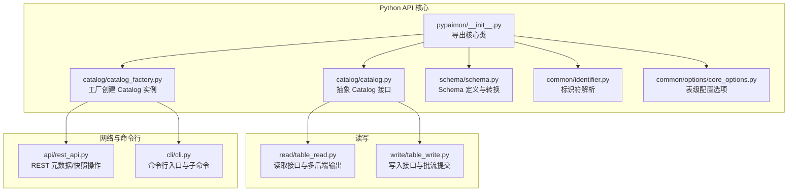
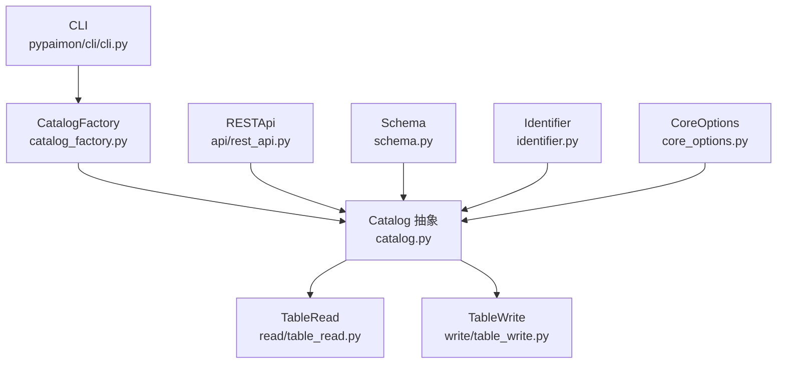
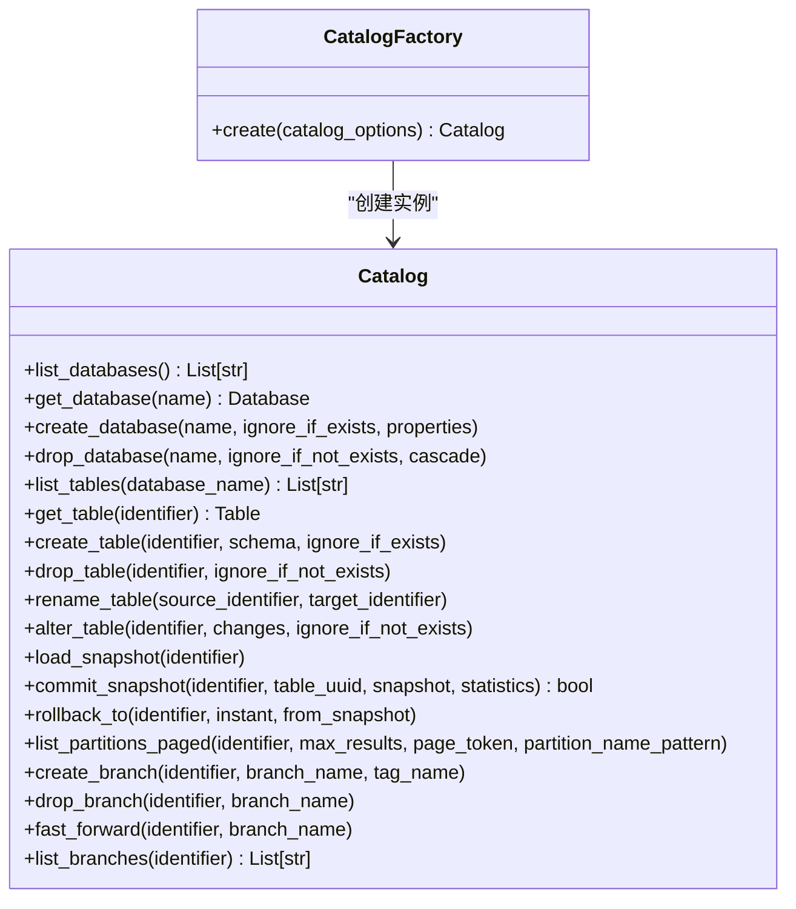
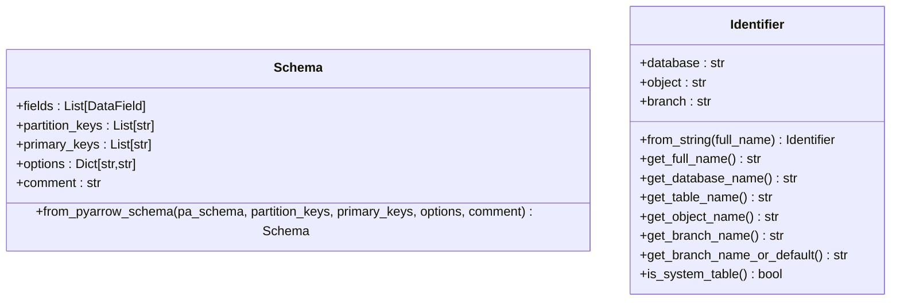
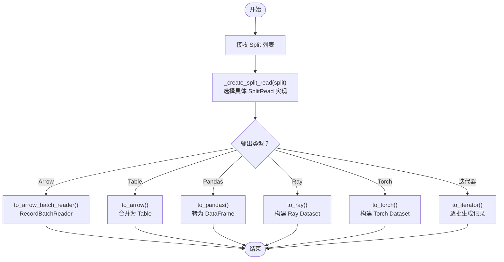
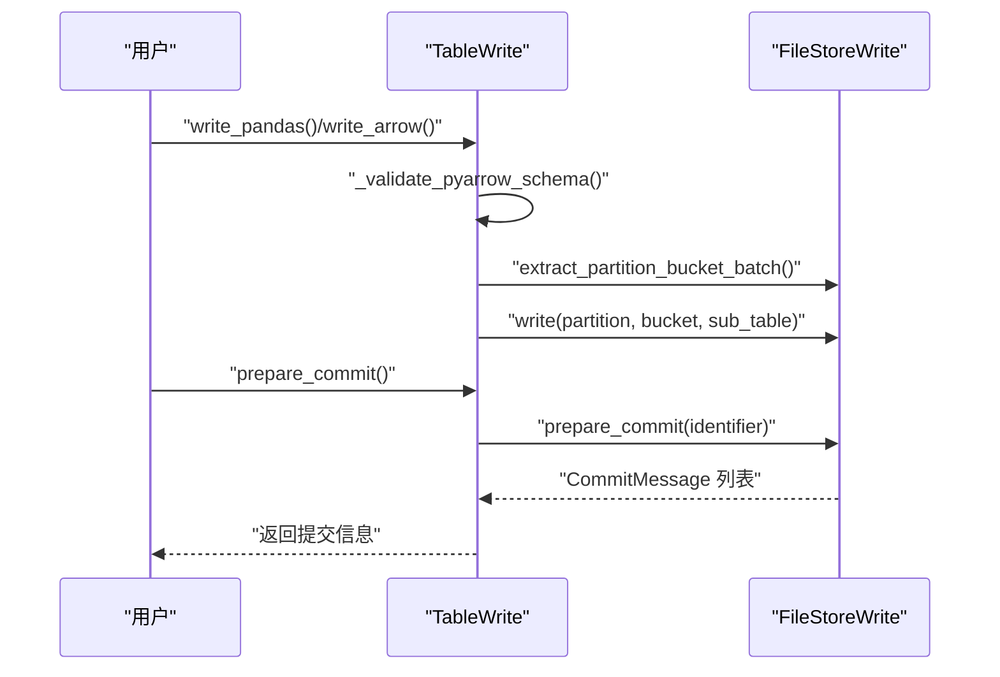
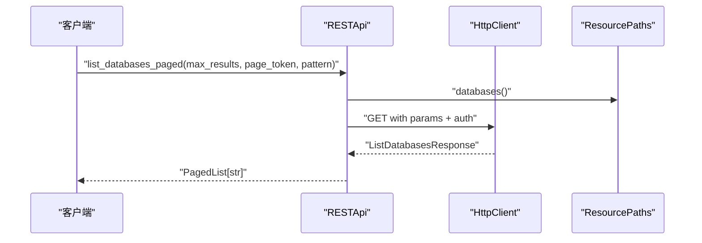
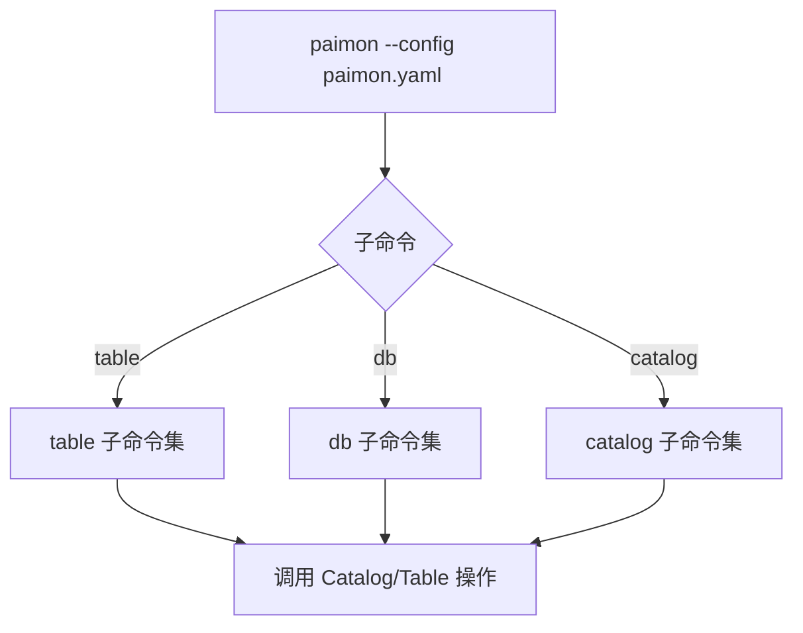
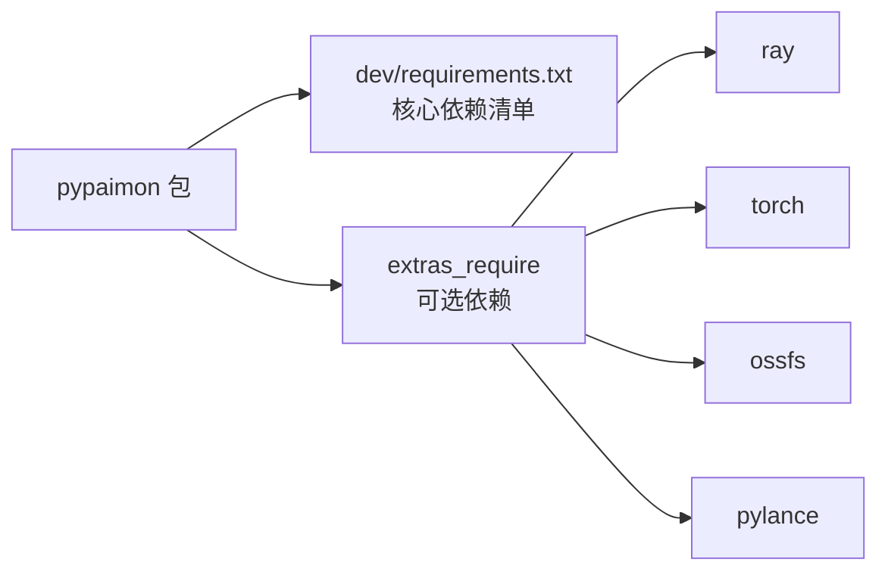

# 示例与教程

<cite>
**本文引用的文件**   
- [paimon-python/README.md](file://paimon-python/README.md)
- [paimon-python/setup.py](file://paimon-python/setup.py)
- [paimon-python/pypaimon/__init__.py](file://paimon-python/pypaimon/__init__.py)
- [paimon-python/pypaimon/api/rest_api.py](file://paimon-python/pypaimon/api/rest_api.py)
- [paimon-python/pypaimon/catalog/catalog.py](file://paimon-python/pypaimon/catalog/catalog.py)
- [paimon-python/pypaimon/catalog/catalog_factory.py](file://paimon-python/pypaimon/catalog/catalog_factory.py)
- [paimon-python/pypaimon/schema/schema.py](file://paimon-python/pypaimon/schema/schema.py)
- [paimon-python/pypaimon/cli/cli.py](file://paimon-python/pypaimon/cli/cli.py)
- [paimon-python/pypaimon/read/table_read.py](file://paimon-python/pypaimon/read/table_read.py)
- [paimon-python/pypaimon/write/table_write.py](file://paimon-python/pypaimon/write/table_write.py)
- [paimon-python/pypaimon/common/options/core_options.py](file://paimon-python/pypaimon/common/options/core_options.py)
- [paimon-python/pypaimon/common/identifier.py](file://paimon-python/pypaimon/common/identifier.py)
- [paimon-python/dev/requirements.txt](file://paimon-python/dev/requirements.txt)
</cite>

## 目录
1. [简介](#简介)
2. [项目结构](#项目结构)
3. [核心组件](#核心组件)
4. [架构总览](#架构总览)
5. [详细组件分析](#详细组件分析)
6. [依赖分析](#依赖分析)
7. [性能考虑](#性能考虑)
8. [故障排查指南](#故障排查指南)
9. [结论](#结论)
10. [附录](#附录)

## 简介
本教程面向希望系统掌握 Apache Paimon Python API 的开发者，提供从环境搭建、第一个程序、常见操作到实战案例的完整学习路径。你将学会：
- 安装与配置 Python 包与依赖
- 使用 Catalog 进行数据库与表管理
- 基于 Schema 定义表结构
- 通过 TableRead/ TableWrite 实现数据读写
- 使用 CLI 快速完成常用任务
- 结合 REST API 在远程 Catalog 上进行元数据与快照管理
- 面向数据仓库、实时分析与机器学习的实践案例与最佳实践

## 项目结构
paimon-python 模块提供了 Python 端的 Catalog、Schema、读写、CLI 以及 REST API 封装，便于在本地或远程环境中以 Python 方式管理 Paimon 表。

图表来源
- [paimon-python/pypaimon/__init__.py:26-38](file://paimon-python/pypaimon/__init__.py#L26-L38)
- [paimon-python/pypaimon/catalog/catalog.py:29-296](file://paimon-python/pypaimon/catalog/catalog.py#L29-L296)
- [paimon-python/pypaimon/catalog/catalog_factory.py:28-45](file://paimon-python/pypaimon/catalog/catalog_factory.py#L28-L45)
- [paimon-python/pypaimon/schema/schema.py:28-96](file://paimon-python/pypaimon/schema/schema.py#L28-L96)
- [paimon-python/pypaimon/common/identifier.py:28-108](file://paimon-python/pypaimon/common/identifier.py#L28-L108)
- [paimon-python/pypaimon/common/options/core_options.py:59-588](file://paimon-python/pypaimon/common/options/core_options.py#L59-L588)
- [paimon-python/pypaimon/read/table_read.py:35-291](file://paimon-python/pypaimon/read/table_read.py#L35-L291)
- [paimon-python/pypaimon/write/table_write.py:32-148](file://paimon-python/pypaimon/write/table_write.py#L32-L148)
- [paimon-python/pypaimon/api/rest_api.py:46-442](file://paimon-python/pypaimon/api/rest_api.py#L46-L442)
- [paimon-python/pypaimon/cli/cli.py:89-138](file://paimon-python/pypaimon/cli/cli.py#L89-L138)

章节来源
- [paimon-python/README.md:1-34](file://paimon-python/README.md#L1-L34)
- [paimon-python/setup.py:18-92](file://paimon-python/setup.py#L18-L92)
- [paimon-python/pypaimon/__init__.py:18-39](file://paimon-python/pypaimon/__init__.py#L18-L39)

## 核心组件
- Catalog 抽象与工厂：统一管理数据库、表、分支、快照等元数据操作，支持本地文件系统与 REST 两种 Catalog 类型。
- Schema：定义字段、分区键、主键、选项与注释，并提供从 PyArrow Schema 转换能力。
- Identifier：解析数据库.表（含可选分支）格式，支持带反引号的标识符。
- TableRead/TableWrite：读取为 Arrow/Pandas/Ray/Torch，写入支持批与流模式。
- RESTApi：对 REST Catalog 的封装，提供分页列表、建库建表、提交快照、回滚等操作。
- CLI：命令行工具，支持数据库、表、目录等子命令，简化日常运维。

章节来源
- [paimon-python/pypaimon/catalog/catalog.py:29-296](file://paimon-python/pypaimon/catalog/catalog.py#L29-L296)
- [paimon-python/pypaimon/catalog/catalog_factory.py:28-45](file://paimon-python/pypaimon/catalog/catalog_factory.py#L28-L45)
- [paimon-python/pypaimon/schema/schema.py:28-96](file://paimon-python/pypaimon/schema/schema.py#L28-L96)
- [paimon-python/pypaimon/common/identifier.py:28-108](file://paimon-python/pypaimon/common/identifier.py#L28-L108)
- [paimon-python/pypaimon/read/table_read.py:35-291](file://paimon-python/pypaimon/read/table_read.py#L35-L291)
- [paimon-python/pypaimon/write/table_write.py:32-148](file://paimon-python/pypaimon/write/table_write.py#L32-L148)
- [paimon-python/pypaimon/api/rest_api.py:46-442](file://paimon-python/pypaimon/api/rest_api.py#L46-L442)
- [paimon-python/pypaimon/cli/cli.py:89-138](file://paimon-python/pypaimon/cli/cli.py#L89-L138)

## 架构总览
下图展示了 Python API 的高层交互关系：CLI 与 CatalogFactory 创建 Catalog；Catalog 提供读写接口；TableRead/TableWrite 承载数据读写；RESTApi 用于远程 Catalog 的元数据与快照管理。

图表来源
- [paimon-python/pypaimon/cli/cli.py:89-138](file://paimon-python/pypaimon/cli/cli.py#L89-L138)
- [paimon-python/pypaimon/catalog/catalog_factory.py:28-45](file://paimon-python/pypaimon/catalog/catalog_factory.py#L28-L45)
- [paimon-python/pypaimon/catalog/catalog.py:29-296](file://paimon-python/pypaimon/catalog/catalog.py#L29-L296)
- [paimon-python/pypaimon/read/table_read.py:35-291](file://paimon-python/pypaimon/read/table_read.py#L35-L291)
- [paimon-python/pypaimon/write/table_write.py:32-148](file://paimon-python/pypaimon/write/table_write.py#L32-L148)
- [paimon-python/pypaimon/api/rest_api.py:46-442](file://paimon-python/pypaimon/api/rest_api.py#L46-L442)
- [paimon-python/pypaimon/schema/schema.py:28-96](file://paimon-python/pypaimon/schema/schema.py#L28-L96)
- [paimon-python/pypaimon/common/identifier.py:28-108](file://paimon-python/pypaimon/common/identifier.py#L28-L108)
- [paimon-python/pypaimon/common/options/core_options.py:59-588](file://paimon-python/pypaimon/common/options/core_options.py#L59-L588)

## 详细组件分析

### 组件一：Catalog 工厂与抽象接口
- CatalogFactory 支持 filesystem 与 rest 两种 Catalog 类型，根据配置自动选择。
- Catalog 抽象定义了数据库/表 CRUD、重命名、变更、版本管理（快照/回滚）、分区列表等通用能力。

图表来源
- [paimon-python/pypaimon/catalog/catalog.py:29-296](file://paimon-python/pypaimon/catalog/catalog.py#L29-L296)
- [paimon-python/pypaimon/catalog/catalog_factory.py:28-45](file://paimon-python/pypaimon/catalog/catalog_factory.py#L28-L45)

章节来源
- [paimon-python/pypaimon/catalog/catalog.py:29-296](file://paimon-python/pypaimon/catalog/catalog.py#L29-L296)
- [paimon-python/pypaimon/catalog/catalog_factory.py:28-45](file://paimon-python/pypaimon/catalog/catalog_factory.py#L28-L45)

### 组件二：Schema 与 Identifier
- Schema 支持从 PyArrow Schema 转换，自动处理主键非空约束、Blob 类型的必需选项校验等。
- Identifier 解析数据库.表（可带分支），兼容带反引号的标识符。

图表来源
- [paimon-python/pypaimon/schema/schema.py:28-96](file://paimon-python/pypaimon/schema/schema.py#L28-L96)
- [paimon-python/pypaimon/common/identifier.py:28-108](file://paimon-python/pypaimon/common/identifier.py#L28-L108)

章节来源
- [paimon-python/pypaimon/schema/schema.py:28-96](file://paimon-python/pypaimon/schema/schema.py#L28-L96)
- [paimon-python/pypaimon/common/identifier.py:28-108](file://paimon-python/pypaimon/common/identifier.py#L28-L108)

### 组件三：读取接口 TableRead
- 支持迭代器、Arrow RecordBatchReader、Arrow Table、Pandas DataFrame、Ray Dataset、Torch Dataset 等多种输出形态。
- 可按 Split 并行读取，支持包含 _row_kind 列的变更日志列。
- 内置 RowKind 处理与批量补齐逻辑，保证输出一致性。

图表来源
- [paimon-python/pypaimon/read/table_read.py:52-291](file://paimon-python/pypaimon/read/table_read.py#L52-L291)

章节来源
- [paimon-python/pypaimon/read/table_read.py:35-291](file://paimon-python/pypaimon/read/table_read.py#L35-L291)

### 组件四：写入接口 TableWrite
- 支持 Arrow/Pandas/Ray 写入，自动按分区键/桶键分组并写入对应文件。
- 批写入支持 prepare_commit，流写入支持自定义 commit 标识符。
- 写入前进行 Schema 兼容性校验（含二进制族类型兼容）。

图表来源
- [paimon-python/pypaimon/write/table_write.py:42-148](file://paimon-python/pypaimon/write/table_write.py#L42-L148)

章节来源
- [paimon-python/pypaimon/write/table_write.py:32-148](file://paimon-python/pypaimon/write/table_write.py#L32-L148)

### 组件五：REST API 与远程 Catalog
- RESTApi 封装了远程 Catalog 的数据库/表/分区/快照等操作，支持分页查询与鉴权头注入。
- 提供提交快照、回滚、加载快照等能力，适合与远端服务集成。

图表来源
- [paimon-python/pypaimon/api/rest_api.py:152-172](file://paimon-python/pypaimon/api/rest_api.py#L152-L172)

章节来源
- [paimon-python/pypaimon/api/rest_api.py:46-442](file://paimon-python/pypaimon/api/rest_api.py#L46-L442)

### 组件六：CLI 命令行工具
- 支持加载 YAML 配置，创建 Catalog，执行数据库/表/目录相关子命令。
- 通过子模块扩展表与数据库操作，便于自动化与运维。

图表来源
- [paimon-python/pypaimon/cli/cli.py:89-138](file://paimon-python/pypaimon/cli/cli.py#L89-L138)

章节来源
- [paimon-python/pypaimon/cli/cli.py:18-138](file://paimon-python/pypaimon/cli/cli.py#L18-L138)

## 依赖分析
- Python 版本要求：3.6+
- 核心依赖：cachetools、fastavro、fsspec、packaging、pandas、polars、pyarrow、pyroaring、readerwriterlock、zstandard、cramjam、pyyaml 等。
- 可选依赖：ray、torch、ossfs、pylance（按功能启用）

图表来源
- [paimon-python/dev/requirements.txt:18-39](file://paimon-python/dev/requirements.txt#L18-L39)
- [paimon-python/setup.py:58-73](file://paimon-python/setup.py#L58-L73)

章节来源
- [paimon-python/dev/requirements.txt:18-39](file://paimon-python/dev/requirements.txt#L18-L39)
- [paimon-python/setup.py:18-92](file://paimon-python/setup.py#L18-L92)

## 性能考虑
- 读取批次大小：可通过 CoreOptions.READ_BATCH_SIZE 控制读取批次大小，平衡吞吐与内存占用。
- 分区与桶：合理设置分区键与桶数，避免热点与小文件过多；动态桶模式下可参考 CoreOptions.DYNAMIC_BUCKET_* 参数。
- 文件格式与压缩：默认文件格式与压缩策略可在 CoreOptions 中配置；大体量数据建议使用 Parquet/Lance 等高效格式。
- 并行度：读取时按 Split 并行；写入时按分区/桶分发；Ray/Torch 输出时可传入并发参数以提升吞吐。
- 压缩级别：ZSTD 压缩等级影响读写速度与存储空间，需结合业务权衡。
- 外部路径策略：当数据文件需要跨存储访问时，可配置外部路径策略与选择策略。

章节来源
- [paimon-python/pypaimon/common/options/core_options.py:140-190](file://paimon-python/pypaimon/common/options/core_options.py#L140-L190)
- [paimon-python/pypaimon/common/options/core_options.py:391-416](file://paimon-python/pypaimon/common/options/core_options.py#L391-L416)
- [paimon-python/pypaimon/common/options/core_options.py:577-588](file://paimon-python/pypaimon/common/options/core_options.py#L577-L588)

## 故障排查指南
- 空 URI 或仓库名：初始化 RESTApi 时若缺少 URI 或仓库名会抛出异常，检查配置项。
- Schema 不一致：写入前会对输入 Schema 进行严格校验，若不一致会报错；确保字段名与类型匹配。
- Blob 类型限制：Schema 含 Blob 类型时必须开启行追踪与数据演进，并且不能设置主键。
- 权限与资源：RESTApi 的提交快照/回滚可能因权限或资源不存在而失败，注意捕获相应异常并核对表/快照状态。
- CLI 配置缺失：未找到配置文件或缺少必要字段（如 filesystem 的 warehouse）会导致初始化失败。

章节来源
- [paimon-python/pypaimon/api/rest_api.py:56-94](file://paimon-python/pypaimon/api/rest_api.py#L56-L94)
- [paimon-python/pypaimon/write/table_write.py:104-126](file://paimon-python/pypaimon/write/table_write.py#L104-L126)
- [paimon-python/pypaimon/schema/schema.py:72-95](file://paimon-python/pypaimon/schema/schema.py#L72-L95)
- [paimon-python/pypaimon/cli/cli.py:32-72](file://paimon-python/pypaimon/cli/cli.py#L32-L72)

## 结论
通过本教程，你可以从零开始掌握 Paimon 的 Python API：安装与配置、Schema 设计、Catalog 管理、读写数据、CLI 使用与远程 REST 集成。结合性能配置与最佳实践，能够在数据仓库、实时分析与机器学习等场景中高效落地。

## 附录

### A. 环境搭建与安装
- Python 版本：3.6+
- 依赖安装：参考 requirements.txt；可选安装 ray/torch/oss/pylance
- 构建与安装：使用 setup.py 构建源码包并安装至本地环境

章节来源
- [paimon-python/README.md:11-32](file://paimon-python/README.md#L11-L32)
- [paimon-python/dev/requirements.txt:18-39](file://paimon-python/dev/requirements.txt#L18-L39)
- [paimon-python/setup.py:26-42](file://paimon-python/setup.py#L26-L42)

### B. 第一个程序：创建 Catalog 与表
- 步骤概览
  1) 准备 Catalog 配置（YAML）
  2) 通过 CatalogFactory 创建 Catalog
  3) 使用 Schema 定义表结构
  4) 创建数据库与表
  5) 写入数据（Pandas/Arrow/Ray）
  6) 读取数据（Arrow/Pandas/Ray/Torch）

章节来源
- [paimon-python/pypaimon/cli/cli.py:32-87](file://paimon-python/pypaimon/cli/cli.py#L32-L87)
- [paimon-python/pypaimon/catalog/catalog_factory.py:36-44](file://paimon-python/pypaimon/catalog/catalog_factory.py#L36-L44)
- [paimon-python/pypaimon/schema/schema.py:52-96](file://paimon-python/pypaimon/schema/schema.py#L52-L96)
- [paimon-python/pypaimon/catalog/catalog.py:90-131](file://paimon-python/pypaimon/catalog/catalog.py#L90-L131)
- [paimon-python/pypaimon/write/table_write.py:42-63](file://paimon-python/pypaimon/write/table_write.py#L42-L63)
- [paimon-python/pypaimon/read/table_read.py:94-111](file://paimon-python/pypaimon/read/table_read.py#L94-L111)

### C. 常见操作与最佳实践
- 数据库/表管理：优先使用 Catalog 抽象接口，避免直接依赖具体实现
- Schema 设计：主键字段应为非空；含 Blob 字段时需开启行追踪与数据演进
- 写入策略：按分区键/桶键分组写入；批写入使用 prepare_commit 提交
- 读取策略：按 Split 并行读取；需要变更日志时启用 _row_kind
- CLI 使用：通过子命令快速完成日常运维任务

章节来源
- [paimon-python/pypaimon/schema/schema.py:52-96](file://paimon-python/pypaimon/schema/schema.py#L52-L96)
- [paimon-python/pypaimon/write/table_write.py:137-142](file://paimon-python/pypaimon/write/table_write.py#L137-L142)
- [paimon-python/pypaimon/read/table_read.py:64-111](file://paimon-python/pypaimon/read/table_read.py#L64-L111)
- [paimon-python/pypaimon/cli/cli.py:104-123](file://paimon-python/pypaimon/cli/cli.py#L104-L123)

### D. 实战案例（场景化）
- 数据仓库
  - 使用 Catalog 创建数据库与表，按分区键组织数据
  - 使用 TableWrite 写入批量数据，使用 TableRead 导出为 Arrow/Pandas
- 实时分析
  - 使用 RESTApi 提交快照，配合回滚与分支管理
  - 使用 Ray/Torch 输出进行流式处理与模型训练
- 机器学习
  - 使用 Ray Dataset 加载大规模特征数据
  - 使用 Torch Dataset 进行增量训练

章节来源
- [paimon-python/pypaimon/api/rest_api.py:326-404](file://paimon-python/pypaimon/api/rest_api.py#L326-L404)
- [paimon-python/pypaimon/read/table_read.py:197-258](file://paimon-python/pypaimon/read/table_read.py#L197-L258)
- [paimon-python/pypaimon/write/table_write.py:74-99](file://paimon-python/pypaimon/write/table_write.py#L74-L99)