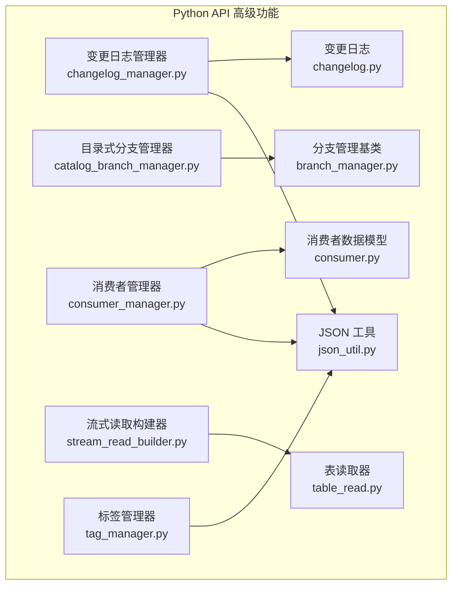
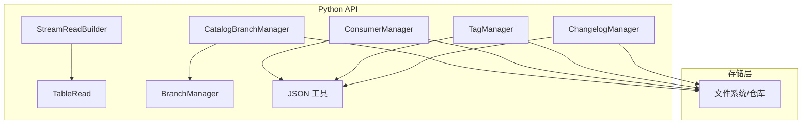
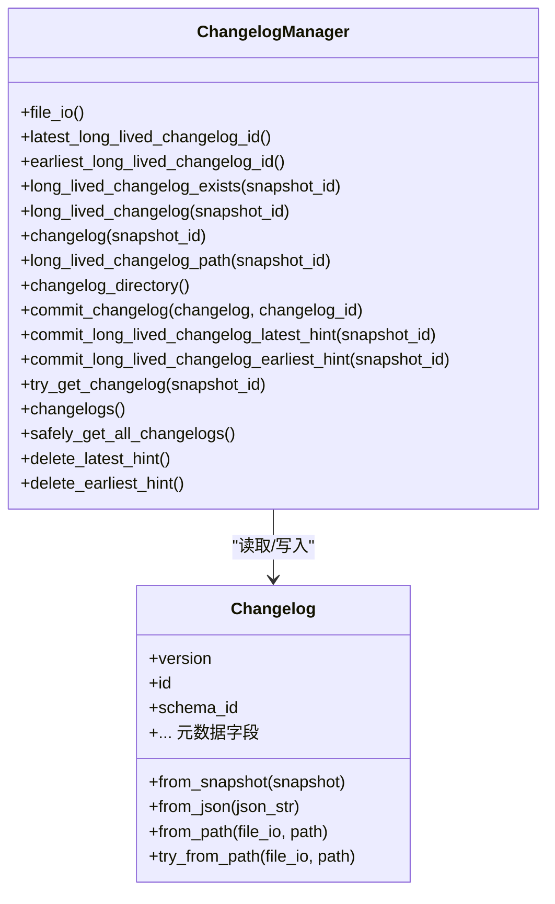
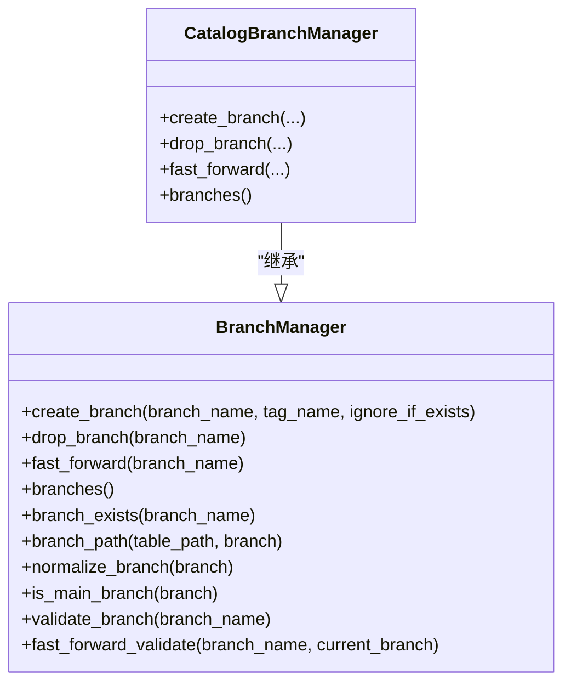
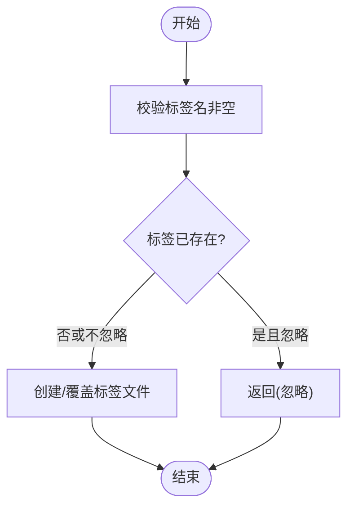
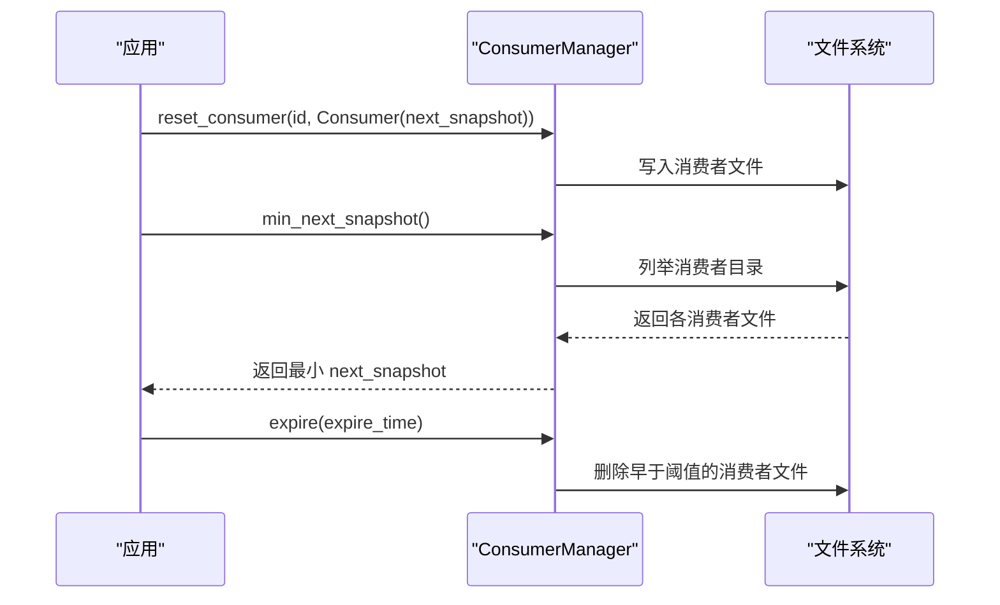
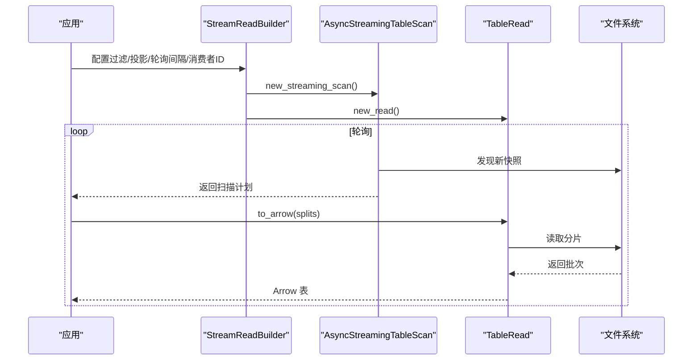
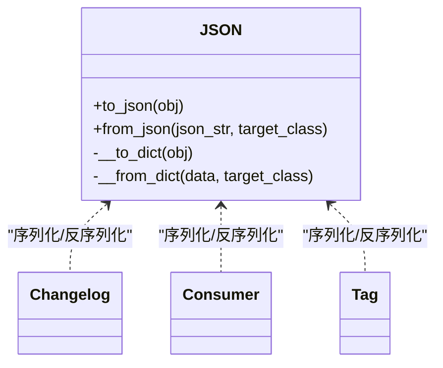
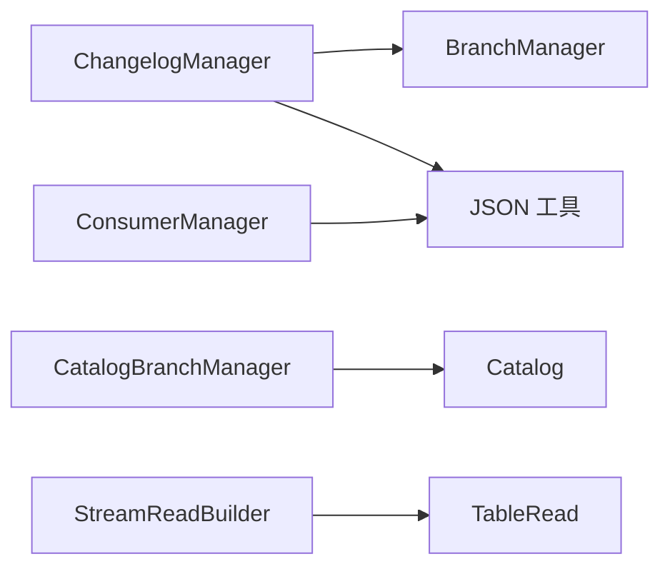
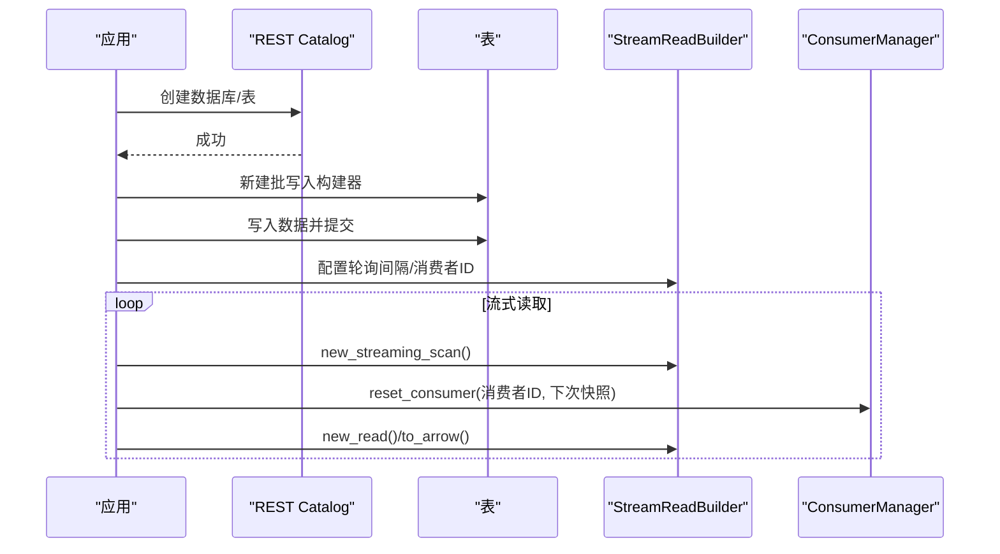

# 高级功能

<cite>
**本文引用的文件**
- [pypaimon/__init__.py](file://paimon-python/pypaimon/__init__.py)
- [changelog.py](file://paimon-python/pypaimon/changelog/changelog.py)
- [changelog_manager.py](file://paimon-python/pypaimon/changelog/changelog_manager.py)
- [branch_manager.py](file://paimon-python/pypaimon/branch/branch_manager.py)
- [catalog_branch_manager.py](file://paimon-python/pypaimon/branch/catalog_branch_manager.py)
- [tag_manager.py](file://paimon-python/pypaimon/tag/tag_manager.py)
- [consumer.py](file://paimon-python/pypaimon/consumer/consumer.py)
- [consumer_manager.py](file://paimon-python/pypaimon/consumer/consumer_manager.py)
- [stream_read_builder.py](file://paimon-python/pypaimon/read/stream_read_builder.py)
- [table_read.py](file://paimon-python/pypaimon/read/table_read.py)
- [json_util.py](file://paimon-python/pypaimon/common/json_util.py)
- [changelog_manager_test.py](file://paimon-python/pypaimon/tests/changelog_manager_test.py)
- [branch_manager_test.py](file://paimon-python/pypaimon/tests/branch_manager_test.py)
- [consumer_manager_test.py](file://paimon-python/pypaimon/tests/consumer_manager_test.py)
- [rest_catalog_read_write_sample.py](file://paimon-python/pypaimon/sample/rest_catalog_read_write_sample.py)
</cite>

## 目录
1. [简介](#简介)
2. [项目结构](#项目结构)
3. [核心组件](#核心组件)
4. [架构总览](#架构总览)
5. [详细组件分析](#详细组件分析)
6. [依赖分析](#依赖分析)
7. [性能考虑](#性能考虑)
8. [故障排查指南](#故障排查指南)
9. [结论](#结论)
10. [附录](#附录)

## 简介
本指南聚焦于 Paimon Python API 的高级功能，围绕以下主题展开：
- 变更日志（Changelog）：长生命周期变更记录、增量读取、CDC 集成与数据同步场景
- 分支管理：分支创建、切换、快进、列举与校验
- 标签管理：标签创建、删除、查询、重命名与目录组织
- 消费者管理：消费组状态持久化、偏移量跟踪、最小下次快照、过期清理与模式匹配清理
- 自定义序列化与反序列化：基于 JSON 工具类的通用编解码机制
- 性能优化：批量读取、并发读取、缓存策略与并发控制
- 实战案例：结合 REST Catalog 与批写入/读取流程，演示高级功能在生产环境的应用

## 项目结构
Python API 的高级功能主要分布在如下模块：
- 变更日志：changelog 与 changelog_manager
- 分支管理：branch_manager 与 catalog_branch_manager
- 标签管理：tag_manager
- 消费者管理：consumer 与 consumer_manager
- 流式读取：stream_read_builder 与 table_read
- 序列化工具：json_util
- 示例与测试：rest_catalog_read_write_sample 与各类单元测试

图表来源
- [changelog_manager.py:32-354](file://paimon-python/pypaimon/changelog/changelog_manager.py#L32-L354)
- [branch_manager.py:28-192](file://paimon-python/pypaimon/branch/branch_manager.py#L28-L192)
- [catalog_branch_manager.py:31-152](file://paimon-python/pypaimon/branch/catalog_branch_manager.py#L31-L152)
- [tag_manager.py:32-234](file://paimon-python/pypaimon/tag/tag_manager.py#L32-L234)
- [consumer.py:26-77](file://paimon-python/pypaimon/consumer/consumer.py#L26-L77)
- [consumer_manager.py:49-196](file://paimon-python/pypaimon/consumer/consumer_manager.py#L49-L196)
- [stream_read_builder.py:35-150](file://paimon-python/pypaimon/read/stream_read_builder.py#L35-L150)
- [table_read.py:35-291](file://paimon-python/pypaimon/read/table_read.py#L35-L291)
- [json_util.py:35-134](file://paimon-python/pypaimon/common/json_util.py#L35-L134)

章节来源
- [pypaimon/__init__.py:26-38](file://paimon-python/pypaimon/__init__.py#L26-L38)

## 核心组件
- 变更日志（Changelog）：从快照生成变更元数据，支持从路径或 JSON 加载，用于长生命周期变更记录
- 变更日志管理器（ChangelogManager）：提供变更日志的路径、提交、提示文件（LATEST/EARLIEST）管理与并行安全读取
- 分支管理（BranchManager/CatalogBranchManager）：统一的分支抽象与目录式分支实现，支持创建、删除、快进、列举与参数校验
- 标签管理（TagManager）：以标签文件形式保存命名快照，支持存在性检查、创建、删除、重命名与列表
- 消费者（Consumer/ConsumerManager）：持久化“下一个快照”偏移，支持最小值聚合、过期清理与正则模式清理
- 流式读取（StreamReadBuilder/TableRead）：构建流式扫描与读取，支持轮询间隔、过滤、投影、包含行类型、桶过滤与消费者 ID
- JSON 工具（JSON）：通用的序列化/反序列化工具，支持数据类字段映射与嵌套对象处理

章节来源
- [changelog.py:29-86](file://paimon-python/pypaimon/changelog/changelog.py#L29-L86)
- [changelog_manager.py:32-354](file://paimon-python/pypaimon/changelog/changelog_manager.py#L32-L354)
- [branch_manager.py:28-192](file://paimon-python/pypaimon/branch/branch_manager.py#L28-L192)
- [catalog_branch_manager.py:31-152](file://paimon-python/pypaimon/branch/catalog_branch_manager.py#L31-L152)
- [tag_manager.py:32-234](file://paimon-python/pypaimon/tag/tag_manager.py#L32-L234)
- [consumer.py:26-77](file://paimon-python/pypaimon/consumer/consumer.py#L26-L77)
- [consumer_manager.py:49-196](file://paimon-python/pypaimon/consumer/consumer_manager.py#L49-L196)
- [stream_read_builder.py:35-150](file://paimon-python/pypaimon/read/stream_read_builder.py#L35-L150)
- [table_read.py:35-291](file://paimon-python/pypaimon/read/table_read.py#L35-L291)
- [json_util.py:35-134](file://paimon-python/pypaimon/common/json_util.py#L35-L134)

## 架构总览
下图展示了高级功能模块之间的交互关系与职责划分。

图表来源
- [changelog_manager.py:32-354](file://paimon-python/pypaimon/changelog/changelog_manager.py#L32-L354)
- [branch_manager.py:28-192](file://paimon-python/pypaimon/branch/branch_manager.py#L28-L192)
- [catalog_branch_manager.py:31-152](file://paimon-python/pypaimon/branch/catalog_branch_manager.py#L31-L152)
- [tag_manager.py:32-234](file://paimon-python/pypaimon/tag/tag_manager.py#L32-L234)
- [consumer_manager.py:49-196](file://paimon-python/pypaimon/consumer/consumer_manager.py#L49-L196)
- [stream_read_builder.py:35-150](file://paimon-python/pypaimon/read/stream_read_builder.py#L35-L150)
- [table_read.py:35-291](file://paimon-python/pypaimon/read/table_read.py#L35-L291)
- [json_util.py:35-134](file://paimon-python/pypaimon/common/json_util.py#L35-L134)

## 详细组件分析

### 变更日志（Changelog）
- 能力概述
  - 从快照构造变更元数据，支持从 JSON 字符串与文件路径加载
  - 提供长生命周期变更记录的路径与存在性判断
  - 支持 LATEST/EARLIEST 提示文件的读取与提交
  - 并发安全地批量读取所有变更记录
- 关键接口
  - from_snapshot/from_json/from_path/try_from_path
  - long_lived_changelog_exists/long_lived_changelog/long_lived_changelog_path
  - commit_long_lived_changelog_latest_hint/earliest_hint
  - changelogs/safely_get_all_changelogs
- 典型用法
  - 将最新快照转换为变更记录并持久化
  - 基于提示文件快速定位最早/最晚可用变更
  - 并行读取所有变更记录进行增量同步

图表来源
- [changelog.py:29-86](file://paimon-python/pypaimon/changelog/changelog.py#L29-L86)
- [changelog_manager.py:32-354](file://paimon-python/pypaimon/changelog/changelog_manager.py#L32-L354)

章节来源
- [changelog.py:29-86](file://paimon-python/pypaimon/changelog/changelog.py#L29-L86)
- [changelog_manager.py:32-354](file://paimon-python/pypaimon/changelog/changelog_manager.py#L32-L354)
- [changelog_manager_test.py:31-138](file://paimon-python/pypaimon/tests/changelog_manager_test.py#L31-L138)

### 分支管理（BranchManager 与 CatalogBranchManager）
- 能力概述
  - 统一的分支抽象：创建、删除、快进、列举、存在性检查、路径拼接与规范化
  - 目录式分支实现：通过 Catalog 执行分支操作，支持异常映射与参数校验
- 关键接口
  - create_branch/drop_branch/fast_forward/branches
  - branch_path/normalize_branch/is_main_branch/validate_branch/fast_forward_validate
  - CatalogBranchManager 基于 Catalog 的实现，负责异常转换与执行
- 典型用法
  - 在主干与特性分支之间进行快进同步
  - 对分支名称进行严格校验，避免非法命名
  - 通过 CatalogBranchManager 在 REST Catalog 场景中管理分支

图表来源
- [branch_manager.py:28-192](file://paimon-python/pypaimon/branch/branch_manager.py#L28-L192)
- [catalog_branch_manager.py:31-152](file://paimon-python/pypaimon/branch/catalog_branch_manager.py#L31-L152)

章节来源
- [branch_manager.py:28-192](file://paimon-python/pypaimon/branch/branch_manager.py#L28-L192)
- [catalog_branch_manager.py:31-152](file://paimon-python/pypaimon/branch/catalog_branch_manager.py#L31-L152)
- [branch_manager_test.py:27-184](file://paimon-python/pypaimon/tests/branch_manager_test.py#L27-L184)

### 标签管理（TagManager）
- 能力概述
  - 以文件形式保存命名快照，支持存在性检查、创建、删除、重命名与列表
  - 标签目录按分支隔离，路径规范统一
- 关键接口
  - tag_exists/get/get_or_throw/create_tag/list_tags/delete_tag/rename_tag
  - tag_directory/tag_path/_branch_path/_normalize_branch/_create_or_replace_tag
- 典型用法
  - 基于快照创建标签，用于时间旅行查询
  - 删除或重命名标签以维护版本语义
  - 列出标签辅助运维与审计

图表来源
- [tag_manager.py:117-179](file://paimon-python/pypaimon/tag/tag_manager.py#L117-L179)

章节来源
- [tag_manager.py:32-234](file://paimon-python/pypaimon/tag/tag_manager.py#L32-L234)

### 消费者管理（Consumer 与 ConsumerManager）
- 能力概述
  - 持久化“下一个快照”偏移，支持最小值聚合、过期清理、按正则模式清理
  - 路径隔离不同分支下的消费者状态
- 关键接口
  - consumer/reset_consumer/delete_consumer/min_next_snapshot
  - expire/list_all_ids/consumers/clear_consumers/with_branch
  - Consumer 数据模型：next_snapshot 的序列化/反序列化与文件加载重试
- 典型用法
  - 流式读取时设置消费者 ID，自动跟踪进度
  - 多消费者场景下，通过最小下次快照协调并发读取
  - 清理长时间未更新的消费者文件

图表来源
- [consumer_manager.py:49-196](file://paimon-python/pypaimon/consumer/consumer_manager.py#L49-L196)
- [consumer.py:26-77](file://paimon-python/pypaimon/consumer/consumer.py#L26-L77)

章节来源
- [consumer_manager.py:49-196](file://paimon-python/pypaimon/consumer/consumer_manager.py#L49-L196)
- [consumer.py:26-77](file://paimon-python/pypaimon/consumer/consumer.py#L26-L77)
- [consumer_manager_test.py:30-316](file://paimon-python/pypaimon/tests/consumer_manager_test.py#L30-L316)

### 流式读取与批量读取（StreamReadBuilder 与 TableRead）
- 能力概述
  - StreamReadBuilder：配置轮询间隔、过滤、投影、包含行类型、桶过滤与消费者 ID
  - TableRead：将分片读取结果转为 Arrow、Pandas、Ray、Torch 等格式；支持批处理与行类型列注入
- 关键接口
  - StreamReadBuilder.with_* 与 new_streaming_scan/new_read/new_predicate_builder
  - TableRead.to_arrow/to_pandas/to_ray/to_torch/to_iterator/to_arrow_batch_reader
- 典型用法
  - 流式持续拉取新快照，结合消费者 ID 实现断点续读
  - 批量读取时按需投影列，减少传输与解析开销

图表来源
- [stream_read_builder.py:35-150](file://paimon-python/pypaimon/read/stream_read_builder.py#L35-L150)
- [table_read.py:35-291](file://paimon-python/pypaimon/read/table_read.py#L35-L291)

章节来源
- [stream_read_builder.py:35-150](file://paimon-python/pypaimon/read/stream_read_builder.py#L35-L150)
- [table_read.py:35-291](file://paimon-python/pypaimon/read/table_read.py#L35-L291)

### 自定义序列化与反序列化（JSON 工具）
- 能力概述
  - 通用 JSON 编解码：支持数据类字段名映射、可选字段、嵌套对象与列表
  - 适配自定义对象的 to_dict/from_dict 接口
- 典型用法
  - Changelog/Tag/Consumer 等对象的 JSON 存储与恢复
  - 与 FileIO 结合实现文件级持久化

图表来源
- [json_util.py:35-134](file://paimon-python/pypaimon/common/json_util.py#L35-L134)
- [changelog.py:29-86](file://paimon-python/pypaimon/changelog/changelog.py#L29-L86)
- [consumer.py:26-77](file://paimon-python/pypaimon/consumer/consumer.py#L26-L77)
- [tag_manager.py:32-234](file://paimon-python/pypaimon/tag/tag_manager.py#L32-L234)

章节来源
- [json_util.py:35-134](file://paimon-python/pypaimon/common/json_util.py#L35-L134)

## 依赖分析
- 组件耦合
  - ChangelogManager 依赖 BranchManager 进行分支路径拼接，依赖 JSON 工具进行持久化
  - CatalogBranchManager 依赖 Catalog 与异常类型，向上提供分支操作
  - ConsumerManager 依赖 JSON 工具与文件系统进行消费者状态持久化
  - StreamReadBuilder 依赖 TableRead 与谓词构建器，形成读取链路
- 外部依赖
  - 文件系统抽象（FileIO）贯穿多个模块，作为 IO 层统一入口
  - 第三方库：Arrow、Pandas、Ray、DuckDB、Torch 等，由 TableRead 条件引入

图表来源
- [changelog_manager.py:25-47](file://paimon-python/pypaimon/changelog/changelog_manager.py#L25-L47)
- [catalog_branch_manager.py:20-48](file://paimon-python/pypaimon/branch/catalog_branch_manager.py#L20-L48)
- [consumer_manager.py:24-56](file://paimon-python/pypaimon/consumer/consumer_manager.py#L24-L56)
- [stream_read_builder.py:25-55](file://paimon-python/pypaimon/read/stream_read_builder.py#L25-L55)
- [table_read.py:18-49](file://paimon-python/pypaimon/read/table_read.py#L18-L49)

## 性能考虑
- 批量与并发
  - 并行读取变更记录：ChangelogManager 使用线程池并发读取，提升大规模变更集的加载效率
  - 流式读取批处理：TableRead 采用大批次（如 65536）读取，降低协议开销
  - Ray/DuckDB/Torch 输出：利用各自生态的并行能力，按需设置并发度与块数
- 缓存策略
  - 消费者状态缓存：ConsumerManager 维护最小下次快照，避免重复扫描
  - 提示文件缓存：ChangelogManager 通过 LATEST/EARLIEST 提示文件快速定位范围
- 并发控制
  - 消费者 ID 校验：防止路径穿越与非法字符
  - 快进参数校验：避免对主分支与同源分支执行快进
- I/O 优化
  - 仅在需要时进行文件存在性检查与列表遍历
  - 使用条件导入第三方库，避免不必要的依赖加载

章节来源
- [changelog_manager.py:182-220](file://paimon-python/pypaimon/changelog/changelog_manager.py#L182-L220)
- [table_read.py:112-150](file://paimon-python/pypaimon/read/table_read.py#L112-L150)
- [consumer_manager.py:61-72](file://paimon-python/pypaimon/consumer/consumer_manager.py#L61-L72)
- [branch_manager.py:171-191](file://paimon-python/pypaimon/branch/branch_manager.py#L171-L191)

## 故障排查指南
- 变更日志
  - 无法读取变更文件：检查路径是否存在、文件是否为空、权限是否正确
  - 并行读取失败：确认线程池大小与磁盘 I/O 能力匹配，关注空文件警告
- 分支管理
  - 分支名非法：遵循非空白、非纯数字、非主分支名的规则
  - 快进失败：确保目标分支与当前分支不同，且不指向主分支
- 标签管理
  - 标签名为空：确保标签名非空且去除空白
  - 重命名冲突：新旧标签均需存在性检查
- 消费者管理
  - 消费者文件损坏：内置重试机制，若多次失败需检查存储一致性
  - 过期清理无效：确认时间戳比较逻辑与文件修改时间一致
- 流式读取
  - 轮询间隔过大：根据数据到达频率调整轮询间隔
  - 投影列缺失：确认投影列存在于表结构中

章节来源
- [changelog_manager.py:194-206](file://paimon-python/pypaimon/changelog/changelog_manager.py#L194-L206)
- [branch_manager.py:149-168](file://paimon-python/pypaimon/branch/branch_manager.py#L149-L168)
- [branch_manager.py:171-191](file://paimon-python/pypaimon/branch/branch_manager.py#L171-L191)
- [tag_manager.py:134-142](file://paimon-python/pypaimon/tag/tag_manager.py#L134-L142)
- [tag_manager.py:202-231](file://paimon-python/pypaimon/tag/tag_manager.py#L202-L231)
- [consumer.py:57-76](file://paimon-python/pypaimon/consumer/consumer.py#L57-L76)
- [consumer_manager.py:128-143](file://paimon-python/pypaimon/consumer/consumer_manager.py#L128-L143)

## 结论
Paimon Python API 的高级功能围绕“变更日志、分支、标签、消费者、读取与序列化”构建了完整的数据生命周期管理能力。通过统一的文件系统抽象与 JSON 工具，这些模块既保持低耦合，又能在生产环境中实现高可靠与高性能的数据同步与消费。

## 附录

### 实战案例：REST Catalog 读写与流式消费
- 概述
  - 使用 REST Catalog 创建数据库与表，进行批写入与读取
  - 结合流式读取构建器与消费者 ID，实现断点续读与多消费者协调
- 关键步骤
  - 初始化 REST Catalog，创建数据库与表
  - 批量写入数据后，使用读取构建器读取
  - 启动流式扫描，设置消费者 ID，按轮询间隔持续读取
  - 使用消费者管理器清理过期消费者或按正则模式清理

图表来源
- [rest_catalog_read_write_sample.py:39-109](file://paimon-python/pypaimon/sample/rest_catalog_read_write_sample.py#L39-L109)
- [stream_read_builder.py:116-133](file://paimon-python/pypaimon/read/stream_read_builder.py#L116-L133)
- [consumer_manager.py:104-107](file://paimon-python/pypaimon/consumer/consumer_manager.py#L104-L107)

章节来源
- [rest_catalog_read_write_sample.py:39-109](file://paimon-python/pypaimon/sample/rest_catalog_read_write_sample.py#L39-L109)