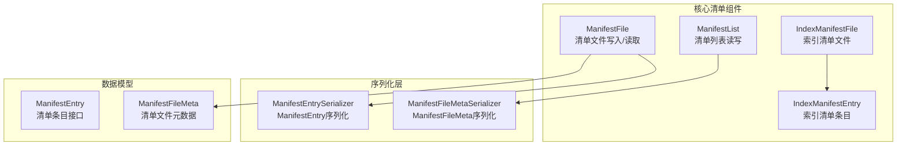
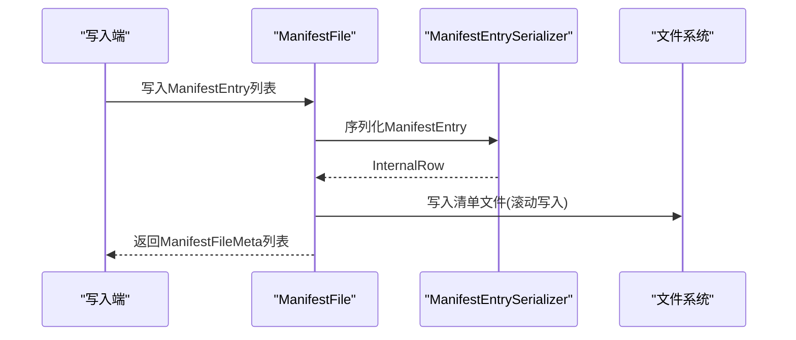
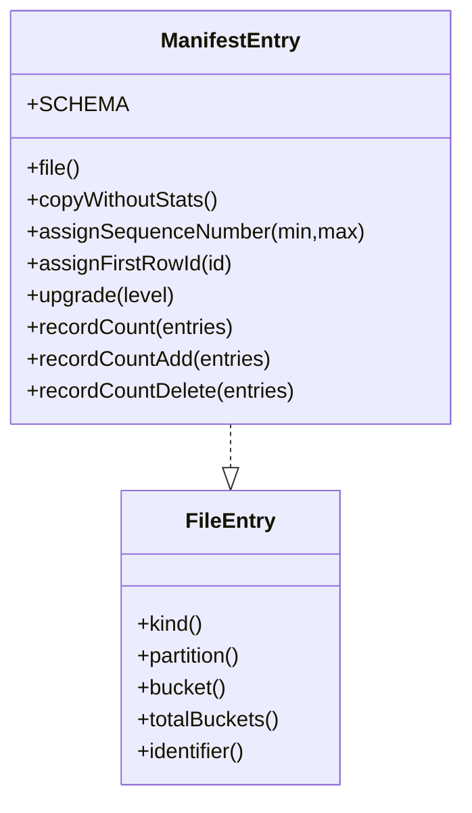
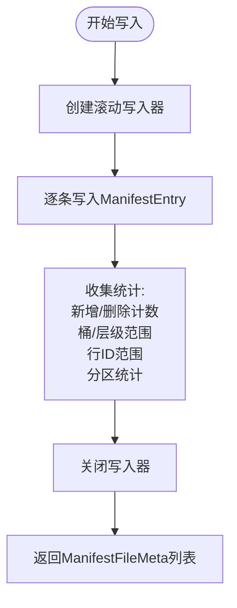
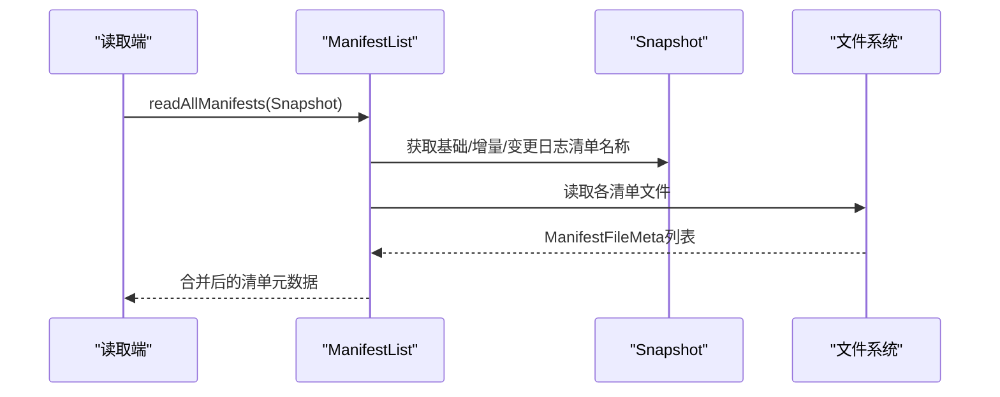
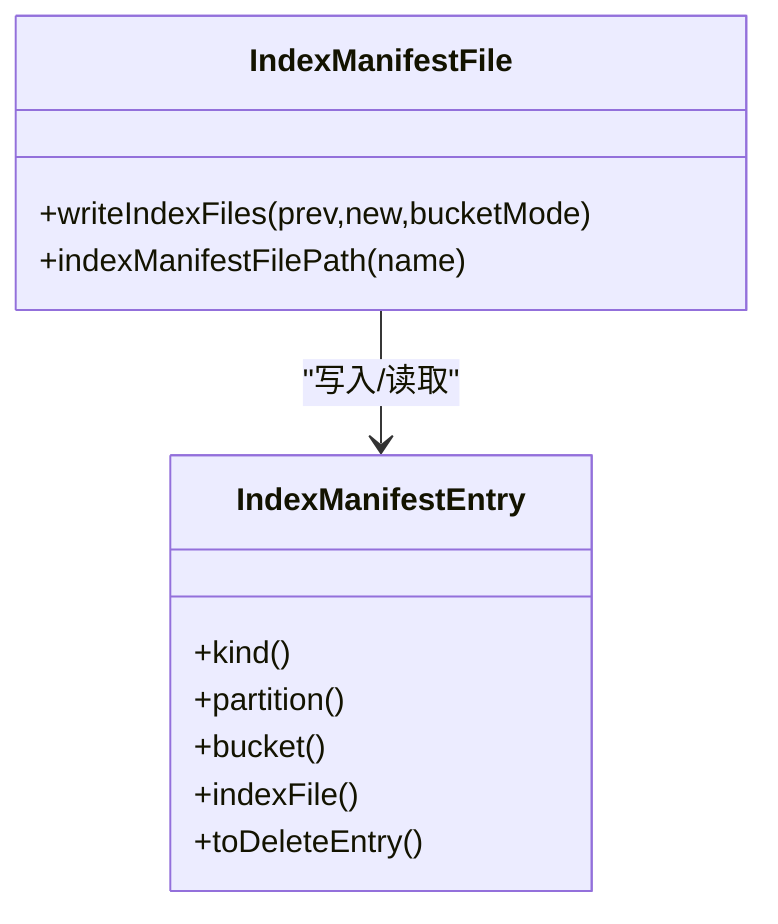
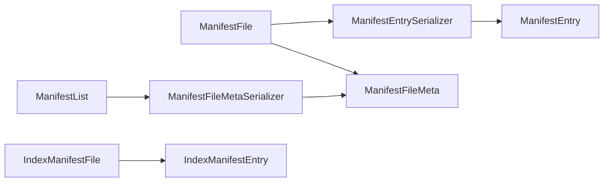

# Manifest清单管理

<cite>
**本文引用的文件**
- [ManifestFile.java](file://paimon-core/src/main/java/org/apache/paimon/manifest/ManifestFile.java)
- [ManifestList.java](file://paimon-core/src/main/java/org/apache/paimon/manifest/ManifestList.java)
- [ManifestEntry.java](file://paimon-core/src/main/java/org/apache/paimon/manifest/ManifestEntry.java)
- [ManifestFileMeta.java](file://paimon-core/src/main/java/org/apache/paimon/manifest/ManifestFileMeta.java)
- [ManifestEntrySerializer.java](file://paimon-core/src/main/java/org/apache/paimon/manifest/ManifestEntrySerializer.java)
- [ManifestFileMetaSerializer.java](file://paimon-core/src/main/java/org/apache/paimon/manifest/ManifestFileMetaSerializer.java)
- [IndexManifestEntry.java](file://paimon-core/src/main/java/org/apache/paimon/manifest/IndexManifestEntry.java)
- [IndexManifestFile.java](file://paimon-core/src/main/java/org/apache/paimon/manifest/IndexManifestFile.java)
- [CopyFilesUtil.java](file://paimon-flink/paimon-flink-common/src/main/java/org/apache/paimon/flink/copy/CopyFilesUtil.java)
- [ManifestFileTest.java](file://paimon-core/src/test/java/org/apache/paimon/manifest/ManifestFileTest.java)
- [ManifestListTest.java](file://paimon-core/src/test/java/org/apache/paimon/manifest/ManifestListTest.java)
- [PartitionEntry.java](file://paimon-core/src/main/java/org/apache/paimon/manifest/PartitionEntry.java)
- [FileEntry.java](file://paimon-core/src/main/java/org/apache/paimon/manifest/FileEntry.java)
- [IcebergCompatibilityTest.java](file://paimon-core/src/test/java/org/apache/paimon/iceberg/IcebergCompatibilityTest.java)
</cite>

## 目录
1. [简介](#简介)
2. [项目结构](#项目结构)
3. [核心组件](#核心组件)
4. [架构总览](#架构总览)
5. [详细组件分析](#详细组件分析)
6. [依赖关系分析](#依赖关系分析)
7. [性能考量](#性能考量)
8. [故障排查指南](#故障排查指南)
9. [结论](#结论)
10. [附录](#附录)

## 简介
Manifest清单管理是Paimon表存储体系中用于维护“数据文件与快照”的元数据索引机制。它通过三类文件协同工作：
- Manifest文件：记录单个清单文件内包含的数据文件变更（新增/删除）及其统计信息。
- Manifest清单列表（ManifestList）：记录某个快照下所有Manifest文件的元数据，便于快速定位和扫描。
- 索引清单文件（IndexManifestFile）：记录全局或嵌入式索引文件的元数据，支持基于索引的高效查询。

其作用与重要性体现在：
- 元数据记录：记录每个数据文件的路径、统计信息、分区键、桶号、层级等关键字段，支撑查询裁剪与执行计划优化。
- 快照信息维护：通过ManifestList聚合各Manifest文件元数据，确保快照一致性与可恢复性。
- 索引文件跟踪：通过IndexManifestFile跟踪索引文件，提升检索效率并支持向量检索等高级能力。

## 项目结构
本主题涉及的核心代码位于paimon-core模块的manifest包，以及与之协作的序列化器、测试用例与跨模块使用场景（如Flink复制工具）。

图表来源
- [ManifestFile.java:55-307](file://paimon-core/src/main/java/org/apache/paimon/manifest/ManifestFile.java#L55-L307)
- [ManifestList.java:47-160](file://paimon-core/src/main/java/org/apache/paimon/manifest/ManifestList.java#L47-L160)
- [ManifestEntry.java:42-95](file://paimon-core/src/main/java/org/apache/paimon/manifest/ManifestEntry.java#L42-L95)
- [ManifestFileMeta.java:42-223](file://paimon-core/src/main/java/org/apache/paimon/manifest/ManifestFileMeta.java#L42-L223)
- [ManifestEntrySerializer.java:34-104](file://paimon-core/src/main/java/org/apache/paimon/manifest/ManifestEntrySerializer.java#L34-L104)
- [ManifestFileMetaSerializer.java:28-85](file://paimon-core/src/main/java/org/apache/paimon/manifest/ManifestFileMetaSerializer.java#L28-L85)
- [IndexManifestEntry.java:46-134](file://paimon-core/src/main/java/org/apache/paimon/manifest/IndexManifestEntry.java#L46-L134)
- [IndexManifestFile.java:40-113](file://paimon-core/src/main/java/org/apache/paimon/manifest/IndexManifestFile.java#L40-L113)

章节来源
- [ManifestFile.java:55-307](file://paimon-core/src/main/java/org/apache/paimon/manifest/ManifestFile.java#L55-L307)
- [ManifestList.java:47-160](file://paimon-core/src/main/java/org/apache/paimon/manifest/ManifestList.java#L47-L160)
- [IndexManifestFile.java:40-113](file://paimon-core/src/main/java/org/apache/paimon/manifest/IndexManifestFile.java#L40-L113)

## 核心组件
- ManifestEntry：清单条目接口，表示对某个数据文件的新增或删除操作，包含文件类型、分区键、桶号、总桶数、数据文件元信息等字段。
- ManifestFileMeta：清单文件元数据，记录清单文件名、大小、新增/删除文件数量、分区统计、模式ID、桶范围、层级范围、行ID范围等。
- ManifestFile：清单文件读写器，负责将ManifestEntry写入滚动文件，同时收集统计信息生成ManifestFileMeta。
- ManifestList：清单列表读写器，按快照聚合ManifestFileMeta，支持读取基础清单与增量清单。
- IndexManifestEntry/IndexManifestFile：索引清单条目与文件，用于跟踪索引文件（如全局索引、删除向量等）。

章节来源
- [ManifestEntry.java:42-95](file://paimon-core/src/main/java/org/apache/paimon/manifest/ManifestEntry.java#L42-L95)
- [ManifestFileMeta.java:42-223](file://paimon-core/src/main/java/org/apache/paimon/manifest/ManifestFileMeta.java#L42-L223)
- [ManifestFile.java:55-307](file://paimon-core/src/main/java/org/apache/paimon/manifest/ManifestFile.java#L55-L307)
- [ManifestList.java:47-160](file://paimon-core/src/main/java/org/apache/paimon/manifest/ManifestList.java#L47-L160)
- [IndexManifestEntry.java:46-134](file://paimon-core/src/main/java/org/apache/paimon/manifest/IndexManifestEntry.java#L46-L134)
- [IndexManifestFile.java:40-113](file://paimon-core/src/main/java/org/apache/paimon/manifest/IndexManifestFile.java#L40-L113)

## 架构总览
Manifest清单管理在写入与读取流程中的交互如下：

图表来源
- [ManifestFile.java:145-160](file://paimon-core/src/main/java/org/apache/paimon/manifest/ManifestFile.java#L145-L160)
- [ManifestEntrySerializer.java:50-78](file://paimon-core/src/main/java/org/apache/paimon/manifest/ManifestEntrySerializer.java#L50-L78)

章节来源
- [ManifestFile.java:145-160](file://paimon-core/src/main/java/org/apache/paimon/manifest/ManifestFile.java#L145-L160)
- [ManifestEntrySerializer.java:50-78](file://paimon-core/src/main/java/org/apache/paimon/manifest/ManifestEntrySerializer.java#L50-L78)

## 详细组件分析

### ManifestEntry 数据结构与用途
- 字段说明
  - 文件类型：ADD/DELETE，标识新增或删除。
  - 分区键：二进制分区值，用于分区裁剪。
  - 桶号与总桶数：用于桶级过滤与并行扫描。
  - 数据文件元信息：包含文件路径、大小、行数、键值统计、层级、模式ID、行ID范围等。
- 统计与聚合
  - 提供记录总数、新增/删除记录数等聚合方法，便于快照层面的统计汇总。
- 版本兼容
  - 序列化器版本为2，旧版本不兼容时会抛出异常提示重建表。

图表来源
- [ManifestEntry.java:42-95](file://paimon-core/src/main/java/org/apache/paimon/manifest/ManifestEntry.java#L42-L95)
- [FileEntry.java:194-224](file://paimon-core/src/main/java/org/apache/paimon/manifest/FileEntry.java#L194-L224)

章节来源
- [ManifestEntry.java:42-95](file://paimon-core/src/main/java/org/apache/paimon/manifest/ManifestEntry.java#L42-L95)
- [FileEntry.java:194-224](file://paimon-core/src/main/java/org/apache/paimon/manifest/FileEntry.java#L194-L224)

### ManifestFile 清单文件写入与统计
- 写入特性
  - 原子写入：通过滚动写入器将多个ManifestEntry写入一个或多个清单文件。
  - 过滤支持：支持分区谓词、桶过滤、行级过滤与条目级过滤。
- 统计收集
  - 新增/删除文件计数、桶范围、层级范围、行ID范围、分区统计（SimpleStats）。
- 缓存与性能
  - 支持SegmentsCache缓存，减少重复读取开销；可通过Factory启用缓存。

图表来源
- [ManifestFile.java:145-160](file://paimon-core/src/main/java/org/apache/paimon/manifest/ManifestFile.java#L145-L160)
- [ManifestFile.java:167-242](file://paimon-core/src/main/java/org/apache/paimon/manifest/ManifestFile.java#L167-L242)

章节来源
- [ManifestFile.java:145-160](file://paimon-core/src/main/java/org/apache/paimon/manifest/ManifestFile.java#L145-L160)
- [ManifestFile.java:167-242](file://paimon-core/src/main/java/org/apache/paimon/manifest/ManifestFile.java#L167-L242)

### ManifestList 清单列表与快照生命周期
- 读取策略
  - 读取基础清单与增量清单，合并得到当前快照下的全部ManifestFileMeta。
  - 支持读取变更日志清单（可选）。
- 写入特性
  - 原子写入清单列表文件，保证快照一致性。
- 跨模块使用
  - Flink复制工具通过Snapshot获取基础/增量清单路径，统一纳入复制清单。

图表来源
- [ManifestList.java:76-113](file://paimon-core/src/main/java/org/apache/paimon/manifest/ManifestList.java#L76-L113)
- [CopyFilesUtil.java:193-216](file://paimon-flink/paimon-flink-common/src/main/java/org/apache/paimon/flink/copy/CopyFilesUtil.java#L193-L216)

章节来源
- [ManifestList.java:76-113](file://paimon-core/src/main/java/org/apache/paimon/manifest/ManifestList.java#L76-L113)
- [CopyFilesUtil.java:193-216](file://paimon-flink/paimon-flink-common/src/main/java/org/apache/paimon/flink/copy/CopyFilesUtil.java#L193-L216)

### IndexManifestEntry 与 IndexManifestFile
- 索引清单条目
  - 记录索引文件的类型、分区、桶、文件名、大小、行数、删除向量范围、外部路径、全局索引元信息等。
- 索引清单文件
  - 提供写入新索引文件的方法，结合桶模式进行处理，支持空输入时保持原清单不变。

图表来源
- [IndexManifestEntry.java:46-134](file://paimon-core/src/main/java/org/apache/paimon/manifest/IndexManifestEntry.java#L46-L134)
- [IndexManifestFile.java:40-113](file://paimon-core/src/main/java/org/apache/paimon/manifest/IndexManifestFile.java#L40-L113)

章节来源
- [IndexManifestEntry.java:46-134](file://paimon-core/src/main/java/org/apache/paimon/manifest/IndexManifestEntry.java#L46-L134)
- [IndexManifestFile.java:40-113](file://paimon-core/src/main/java/org/apache/paimon/manifest/IndexManifestFile.java#L40-L113)

### ManifestFileMeta 与序列化
- 字段覆盖
  - 文件名、大小、新增/删除文件数、分区统计、模式ID、桶/层级/行ID范围。
- 序列化
  - 使用VersionedObjectSerializer，版本为2，提供字节数组序列化/反序列化能力。
- 兼容性
  - 旧版本不兼容时抛出异常，提示重建表。

章节来源
- [ManifestFileMeta.java:42-223](file://paimon-core/src/main/java/org/apache/paimon/manifest/ManifestFileMeta.java#L42-L223)
- [ManifestFileMetaSerializer.java:28-85](file://paimon-core/src/main/java/org/apache/paimon/manifest/ManifestFileMetaSerializer.java#L28-L85)

### 分区统计与合并
- PartitionEntry
  - 将ManifestEntry转换为分区粒度的统计项，支持正负记录/文件/大小的合并。
- 场景应用
  - 在提交阶段或过期清理阶段，根据分区统计决定是否保留/删除文件。

章节来源
- [PartitionEntry.java:120-154](file://paimon-core/src/main/java/org/apache/paimon/manifest/PartitionEntry.java#L120-L154)

## 依赖关系分析
- 组件耦合
  - ManifestFile依赖ManifestEntrySerializer与DataFileMetaSerializer进行序列化。
  - ManifestList依赖ManifestFileMetaSerializer进行清单列表的序列化。
  - IndexManifestFile依赖IndexManifestEntry进行索引文件元数据的读写。
- 外部集成
  - Flink复制工具通过Snapshot提供的清单路径，统一纳入复制清单，体现跨模块协作。

图表来源
- [ManifestEntrySerializer.java:34-104](file://paimon-core/src/main/java/org/apache/paimon/manifest/ManifestEntrySerializer.java#L34-L104)
- [ManifestFileMetaSerializer.java:28-85](file://paimon-core/src/main/java/org/apache/paimon/manifest/ManifestFileMetaSerializer.java#L28-L85)
- [ManifestFile.java:55-307](file://paimon-core/src/main/java/org/apache/paimon/manifest/ManifestFile.java#L55-L307)
- [ManifestList.java:47-160](file://paimon-core/src/main/java/org/apache/paimon/manifest/ManifestList.java#L47-L160)
- [IndexManifestFile.java:40-113](file://paimon-core/src/main/java/org/apache/paimon/manifest/IndexManifestFile.java#L40-L113)

章节来源
- [ManifestEntrySerializer.java:34-104](file://paimon-core/src/main/java/org/apache/paimon/manifest/ManifestEntrySerializer.java#L34-L104)
- [ManifestFileMetaSerializer.java:28-85](file://paimon-core/src/main/java/org/apache/paimon/manifest/ManifestFileMetaSerializer.java#L28-L85)
- [ManifestFile.java:55-307](file://paimon-core/src/main/java/org/apache/paimon/manifest/ManifestFile.java#L55-L307)
- [ManifestList.java:47-160](file://paimon-core/src/main/java/org/apache/paimon/manifest/ManifestList.java#L47-L160)
- [IndexManifestFile.java:40-113](file://paimon-core/src/main/java/org/apache/paimon/manifest/IndexManifestFile.java#L40-L113)

## 性能考量
- 写入性能
  - 滚动写入：通过建议文件大小控制单个清单文件尺寸，避免过大导致读取与GC压力。
  - 缓存启用：在高并发读取场景下启用SegmentsCache，降低重复读取成本。
- 读取性能
  - 过滤下推：利用分区谓词、桶过滤、行级过滤减少无效数据读取。
  - 清单列表聚合：先读取ManifestList再定位具体Manifest文件，减少全表扫描。
- 序列化开销
  - 使用VersionedObjectSerializer，版本固定且稳定，避免频繁格式升级带来的额外开销。
- 索引文件管理
  - IndexManifestFile仅在存在索引文件时写入，避免冗余清单增加IO负担。

章节来源
- [ManifestFile.java:126-129](file://paimon-core/src/main/java/org/apache/paimon/manifest/ManifestFile.java#L126-L129)
- [ManifestFile.java:286-288](file://paimon-core/src/main/java/org/apache/paimon/manifest/ManifestFile.java#L286-L288)
- [ManifestList.java:76-113](file://paimon-core/src/main/java/org/apache/paimon/manifest/ManifestList.java#L76-L113)

## 故障排查指南
- 写入异常清理
  - ManifestFile在写入失败时会清理临时文件，确保文件系统整洁。
- 清单列表异常清理
  - ManifestList在写入失败时具备清理逻辑，避免残留中间状态。
- 版本不兼容
  - ManifestEntrySerializer与ManifestFileMetaSerializer版本为2，若遇到旧版本将抛出异常，需按提示重建表。
- 快照复制一致性
  - Flink复制工具会读取基础/增量/变更日志清单，确保复制完整性；若清单缺失会导致复制失败。

章节来源
- [ManifestFileTest.java:74-88](file://paimon-core/src/test/java/org/apache/paimon/manifest/ManifestFileTest.java#L74-L88)
- [ManifestListTest.java:63-69](file://paimon-core/src/test/java/org/apache/paimon/manifest/ManifestListTest.java#L63-L69)
- [ManifestEntrySerializer.java:63-71](file://paimon-core/src/main/java/org/apache/paimon/manifest/ManifestEntrySerializer.java#L63-L71)
- [ManifestFileMetaSerializer.java:60-68](file://paimon-core/src/main/java/org/apache/paimon/manifest/ManifestFileMetaSerializer.java#L60-L68)
- [CopyFilesUtil.java:193-216](file://paimon-flink/paimon-flink-common/src/main/java/org/apache/paimon/flink/copy/CopyFilesUtil.java#L193-L216)

## 结论
Manifest清单管理通过ManifestFile、ManifestList与IndexManifestFile形成完整的元数据索引闭环：前者记录单文件变更与统计，后者聚合快照级清单，索引清单则扩展到索引文件维度。配合序列化器的版本化设计与跨模块集成，既保障了性能与可靠性，也为后续优化（如分区裁剪、桶过滤、索引加速）提供了坚实基础。

## 附录
- 测试参考
  - 清单文件写读与异常清理：参见测试用例路径。
  - 清单列表写读与异常清理：参见测试用例路径。
  - 冰岛湖兼容性验证：参见测试用例路径，确认清单条目字段映射正确。

章节来源
- [ManifestFileTest.java:64-93](file://paimon-core/src/test/java/org/apache/paimon/manifest/ManifestFileTest.java#L64-L93)
- [ManifestListTest.java:53-69](file://paimon-core/src/test/java/org/apache/paimon/manifest/ManifestListTest.java#L53-L69)
- [IcebergCompatibilityTest.java:1409-1419](file://paimon-core/src/test/java/org/apache/paimon/iceberg/IcebergCompatibilityTest.java#L1409-L1419)