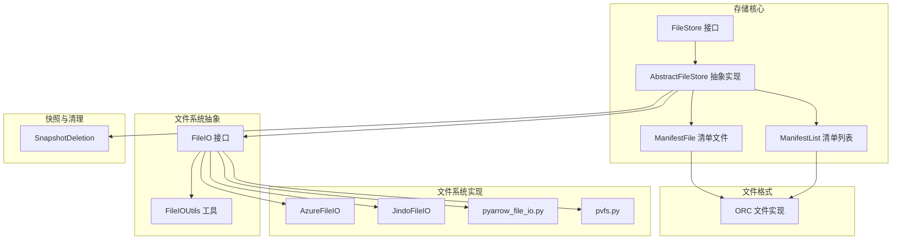
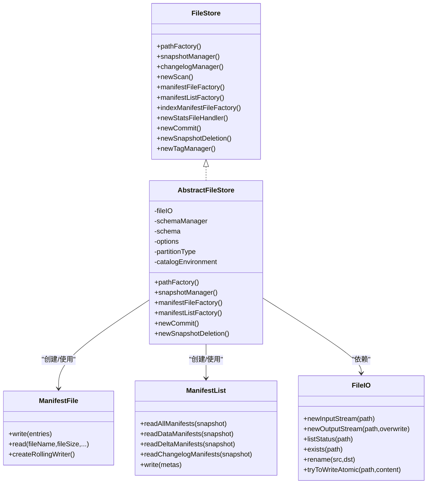
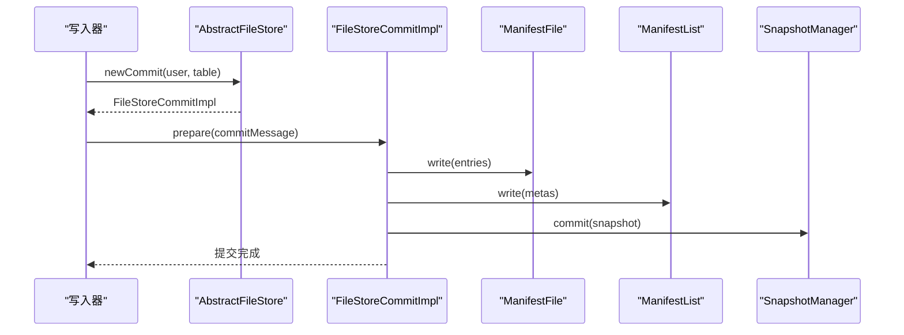
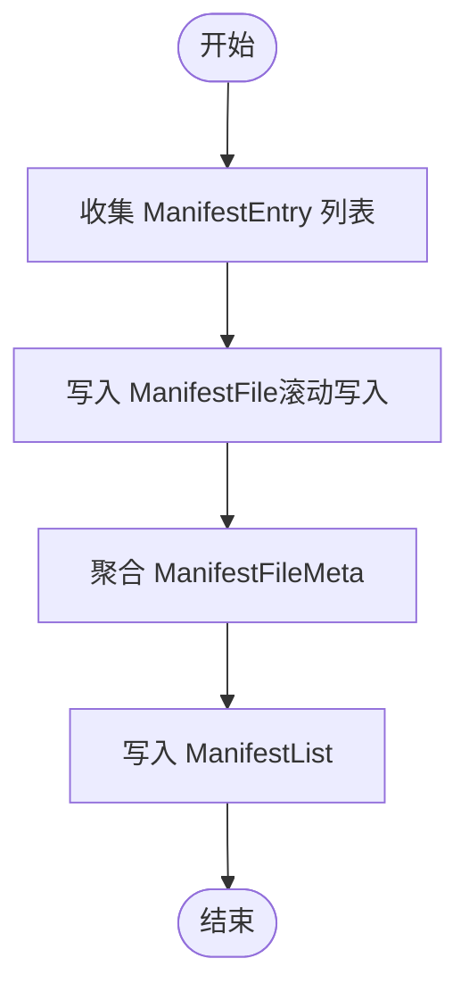
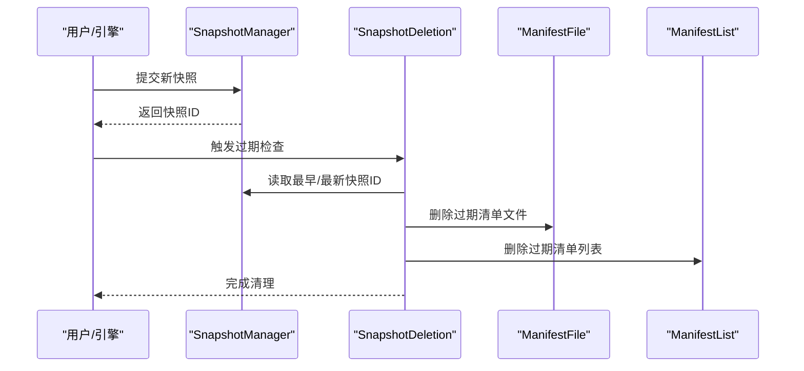
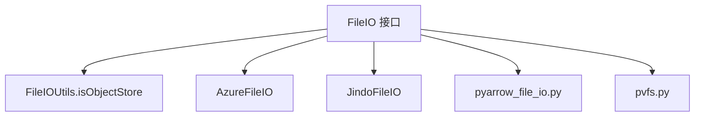
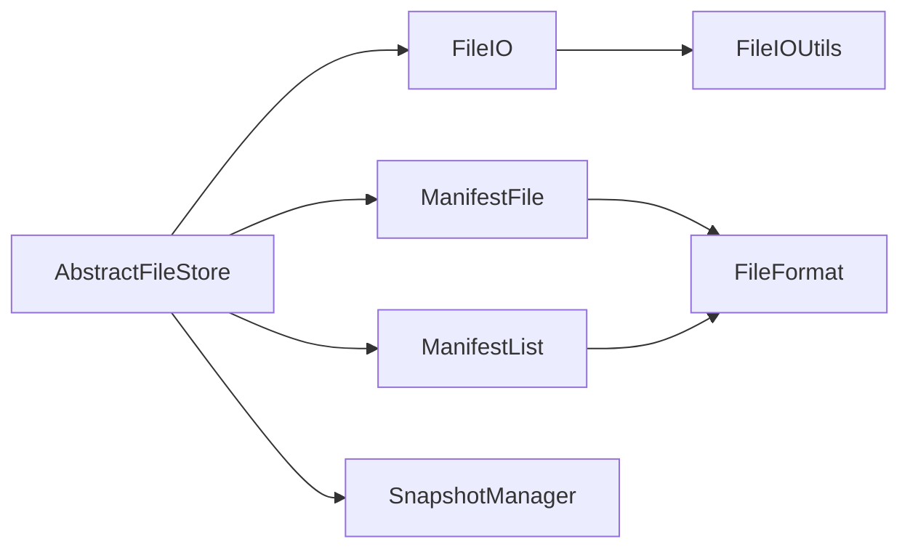

# 存储架构

<cite>
**本文引用的文件**
- [FileStore.java](file://paimon-core/src/main/java/org/apache/paimon/FileStore.java)
- [AbstractFileStore.java](file://paimon-core/src/main/java/org/apache/paimon/AbstractFileStore.java)
- [ManifestFile.java](file://paimon-core/src/main/java/org/apache/paimon/manifest/ManifestFile.java)
- [ManifestList.java](file://paimon-core/src/main/java/org/apache/paimon/manifest/ManifestList.java)
- [FileIO.java](file://paimon-common/src/main/java/org/apache/paimon/fs/FileIO.java)
- [FileIOUtils.java](file://paimon-common/src/main/java/org/apache/paimon/utils/FileIOUtils.java)
- [OrcFile.java](file://paimon-format/src/main/java/org/apache/orc/OrcFile.java)
- [TableReadBenchmark.java](file://paimon-benchmark/paimon-micro-benchmarks/src/test/java/org/apache/paimon/benchmark/TableReadBenchmark.java)
- [AzureFileIO.java](file://paimon-filesystems/paimon-azure-impl/src/main/java/org/apache/paimon/azure/AzureFileIO.java)
- [JindoFileIO.java](file://paimon-filesystems/paimon-jindo/src/main/java/org/apache/paimon/jindo/JindoFileIO.java)
- [pyarrow_file_io.py](file://paimon-python/pypaimon/filesystem/pyarrow_file_io.py)
- [pvfs.py](file://paimon-python/pypaimon/filesystem/pvfs.py)
- [SnapshotDeletion.java](file://paimon-core/src/main/java/org/apache/paimon/operation/SnapshotDeletion.java)
- [manage-snapshots.md](file://docs/content/maintenance/manage-snapshots.md)
- [filesystems.md](file://docs/content/maintenance/filesystems.md)
</cite>

## 目录
1. [简介](#简介)
2. [项目结构](#项目结构)
3. [核心组件](#核心组件)
4. [架构总览](#架构总览)
5. [组件详解](#组件详解)
6. [依赖关系分析](#依赖关系分析)
7. [性能考量](#性能考量)
8. [故障排查指南](#故障排查指南)
9. [结论](#结论)
10. [附录](#附录)

## 简介
本文件系统化梳理 Apache Paimon 的存储架构与实现，重点覆盖：
- 文件存储抽象层设计理念与实现机制
- 支持的文件格式（Parquet、ORC、Avro 等）及其特点与适用场景
- Manifest 清单文件的作用、结构、生成与维护策略
- 数据文件的组织方式与命名规则、元数据管理
- 快照机制的实现原理、创建与清理策略
- 文件系统抽象层设计与多后端支持（本地、HDFS、S3、Azure 等）
- 性能优化建议与最佳实践

## 项目结构
围绕存储架构的关键模块分布如下：
- 核心接口与抽象：FileStore、AbstractFileStore
- 清单与元数据：ManifestFile、ManifestList
- 文件系统抽象：FileIO 及其工具类
- 文件格式支持：ORC 等
- 文件系统实现：Azure、Jindo、PyArrow 等
- 快照与清理：SnapshotDeletion、维护文档

**图表来源**
- [FileStore.java:61-127](file://paimon-core/src/main/java/org/apache/paimon/FileStore.java#L61-L127)
- [AbstractFileStore.java:95-525](file://paimon-core/src/main/java/org/apache/paimon/AbstractFileStore.java#L95-L525)
- [ManifestFile.java:55-306](file://paimon-core/src/main/java/org/apache/paimon/manifest/ManifestFile.java#L55-L306)
- [ManifestList.java:47-159](file://paimon-core/src/main/java/org/apache/paimon/manifest/ManifestList.java#L47-L159)
- [FileIO.java:66-641](file://paimon-common/src/main/java/org/apache/paimon/fs/FileIO.java#L66-L641)
- [FileIOUtils.java:386-408](file://paimon-common/src/main/java/org/apache/paimon/utils/FileIOUtils.java#L386-L408)
- [OrcFile.java:119-159](file://paimon-format/src/main/java/org/apache/orc/OrcFile.java#L119-L159)
- [AzureFileIO.java:98-130](file://paimon-filesystems/paimon-azure-impl/src/main/java/org/apache/paimon/azure/AzureFileIO.java#L98-L130)
- [JindoFileIO.java:219-257](file://paimon-filesystems/paimon-jindo/src/main/java/org/apache/paimon/jindo/JindoFileIO.java#L219-L257)
- [pyarrow_file_io.py:176-211](file://paimon-python/pypaimon/filesystem/pyarrow_file_io.py#L176-L211)
- [pvfs.py:780-818](file://paimon-python/pypaimon/filesystem/pvfs.py#L780-L818)
- [SnapshotDeletion.java:41-65](file://paimon-core/src/main/java/org/apache/paimon/operation/SnapshotDeletion.java#L41-L65)

**章节来源**
- [FileStore.java:61-127](file://paimon-core/src/main/java/org/apache/paimon/FileStore.java#L61-L127)
- [AbstractFileStore.java:95-525](file://paimon-core/src/main/java/org/apache/paimon/AbstractFileStore.java#L95-L525)
- [ManifestFile.java:55-306](file://paimon-core/src/main/java/org/apache/paimon/manifest/ManifestFile.java#L55-L306)
- [ManifestList.java:47-159](file://paimon-core/src/main/java/org/apache/paimon/manifest/ManifestList.java#L47-L159)
- [FileIO.java:66-641](file://paimon-common/src/main/java/org/apache/paimon/fs/FileIO.java#L66-L641)
- [FileIOUtils.java:386-408](file://paimon-common/src/main/java/org/apache/paimon/utils/FileIOUtils.java#L386-L408)
- [OrcFile.java:119-159](file://paimon-format/src/main/java/org/apache/orc/OrcFile.java#L119-L159)
- [AzureFileIO.java:98-130](file://paimon-filesystems/paimon-azure-impl/src/main/java/org/apache/paimon/azure/AzureFileIO.java#L98-L130)
- [JindoFileIO.java:219-257](file://paimon-filesystems/paimon-jindo/src/main/java/org/apache/paimon/jindo/JindoFileIO.java#L219-L257)
- [pyarrow_file_io.py:176-211](file://paimon-python/pypaimon/filesystem/pyarrow_file_io.py#L176-L211)
- [pvfs.py:780-818](file://paimon-python/pypaimon/filesystem/pvfs.py#L780-L818)
- [SnapshotDeletion.java:41-65](file://paimon-core/src/main/java/org/apache/paimon/operation/SnapshotDeletion.java#L41-L65)

## 核心组件
- FileStore 接口：定义文件存储能力边界，包括扫描、写入、提交、清单工厂、快照管理、标签管理等。
- AbstractFileStore 抽象实现：统一构建路径工厂、清单工厂、快照管理器、索引与统计文件处理器；封装冲突检测、回滚、分区过期、自动标签等通用流程。
- ManifestFile/ManifestList：以对象文件形式管理清单条目与清单列表，支撑快照视图与增量变更追踪。
- FileIO：文件系统抽象接口，提供输入输出流、列举、重命名、原子写等能力，并通过服务发现加载具体实现。
- 文件格式：通过 FileFormat 与具体格式实现（如 ORC）支撑不同列存格式的读写与压缩。

**章节来源**
- [FileStore.java:61-127](file://paimon-core/src/main/java/org/apache/paimon/FileStore.java#L61-L127)
- [AbstractFileStore.java:95-525](file://paimon-core/src/main/java/org/apache/paimon/AbstractFileStore.java#L95-L525)
- [ManifestFile.java:55-306](file://paimon-core/src/main/java/org/apache/paimon/manifest/ManifestFile.java#L55-L306)
- [ManifestList.java:47-159](file://paimon-core/src/main/java/org/apache/paimon/manifest/ManifestList.java#L47-L159)
- [FileIO.java:66-641](file://paimon-common/src/main/java/org/apache/paimon/fs/FileIO.java#L66-L641)

## 架构总览
Paimon 的存储层以 FileStore 为核心，通过抽象工厂创建路径、清单、快照与统计文件处理器；FileIO 提供跨后端一致的文件操作接口；ManifestFile/ManifestList 组成快照的“目录索引”，记录数据文件的元信息；文件格式通过 FileFormat 适配 Parquet、ORC、Avro 等。

**图表来源**
- [FileStore.java:61-127](file://paimon-core/src/main/java/org/apache/paimon/FileStore.java#L61-L127)
- [AbstractFileStore.java:95-525](file://paimon-core/src/main/java/org/apache/paimon/AbstractFileStore.java#L95-L525)
- [ManifestFile.java:55-306](file://paimon-core/src/main/java/org/apache/paimon/manifest/ManifestFile.java#L55-L306)
- [ManifestList.java:47-159](file://paimon-core/src/main/java/org/apache/paimon/manifest/ManifestList.java#L47-L159)
- [FileIO.java:66-641](file://paimon-common/src/main/java/org/apache/paimon/fs/FileIO.java#L66-L641)

## 组件详解

### 文件存储抽象层（FileStore/AbstractFileStore）
- 设计理念
  - 将“表级存储”与“文件系统访问”解耦，通过工厂模式创建路径、清单、快照与统计文件处理器。
  - 统一冲突检测、回滚、分区过期、标签管理等通用流程，降低上层复杂度。
- 关键职责
  - 路径工厂：根据配置生成数据文件、清单文件、统计文件等的命名与目录结构。
  - 清单工厂：创建 ManifestFile 与 ManifestList，支持滚动写入与缓存。
  - 快照管理：提供 SnapshotManager，结合 SnapshotDeletion 实现快照清理。
  - 写入与提交：通过 FileStoreCommit 协调 Manifest 与数据文件的原子提交。
- 外部依赖
  - FileIO：统一文件系统访问。
  - SchemaManager：模式演进与合并。
  - CatalogEnvironment：快照提交策略、分区修改回调等。

**图表来源**
- [AbstractFileStore.java:275-321](file://paimon-core/src/main/java/org/apache/paimon/AbstractFileStore.java#L275-L321)
- [ManifestFile.java:145-154](file://paimon-core/src/main/java/org/apache/paimon/manifest/ManifestFile.java#L145-L154)
- [ManifestList.java:120-122](file://paimon-core/src/main/java/org/apache/paimon/manifest/ManifestList.java#L120-L122)

**章节来源**
- [AbstractFileStore.java:95-525](file://paimon-core/src/main/java/org/apache/paimon/AbstractFileStore.java#L95-L525)

### Manifest 清单文件
- 作用
  - 记录快照期间新增/删除的数据文件元信息，作为“目录索引”加速扫描与清理。
  - 支持 base/delta/changelog 三类清单，分别对应基础清单、增量清单与变更日志清单。
- 结构与生成
  - ManifestFile：按建议大小滚动写入，聚合统计（添加/删除文件数、桶范围、层级范围、行号范围等）。
  - ManifestList：按快照聚合多个 ManifestFileMeta，提供按快照读取所有清单的能力。
- 维护与优化
  - 建议启用清单缓存（SegmentsCache），减少小文件读取开销。
  - 合理设置清单目标大小，平衡小文件数量与单文件读取成本。

**图表来源**
- [ManifestFile.java:145-154](file://paimon-core/src/main/java/org/apache/paimon/manifest/ManifestFile.java#L145-L154)
- [ManifestList.java:120-122](file://paimon-core/src/main/java/org/apache/paimon/manifest/ManifestList.java#L120-L122)

**章节来源**
- [ManifestFile.java:55-306](file://paimon-core/src/main/java/org/apache/paimon/manifest/ManifestFile.java#L55-L306)
- [ManifestList.java:47-159](file://paimon-core/src/main/java/org/apache/paimon/manifest/ManifestList.java#L47-L159)

### 数据文件组织与命名规则
- 路径工厂
  - AbstractFileStore 依据配置构造 FileStorePathFactory，决定数据文件前缀、清单前缀、压缩后缀、外部路径策略等。
- 命名与目录
  - 数据文件命名包含 schema 版本、桶号、层级、压缩等信息；清单文件与统计文件采用独立前缀与目录。
- 元数据管理
  - ManifestFile 在写入时收集统计信息（桶范围、层级范围、行号范围、分区统计等），用于后续过滤与裁剪。

**章节来源**
- [AbstractFileStore.java:130-147](file://paimon-core/src/main/java/org/apache/paimon/AbstractFileStore.java#L130-L147)
- [ManifestFile.java:167-242](file://paimon-core/src/main/java/org/apache/paimon/manifest/ManifestFile.java#L167-L242)

### 快照机制
- 创建
  - 写入完成后，通过 SnapshotManager 提交快照，记录 base/delta 清单列表与当前 schema。
- 存储
  - 快照文件为纯文本 JSON，包含时间戳、清单列表、分支信息等。
- 清理策略
  - 基于保留时长与数量阈值进行过期检查与删除；支持并发安全地清理空目录。
  - 文档提供了快照过期示例表格，展示基于时间与数量的清理逻辑。

**图表来源**
- [SnapshotDeletion.java:41-65](file://paimon-core/src/main/java/org/apache/paimon/operation/SnapshotDeletion.java#L41-L65)
- [manage-snapshots.md:94-213](file://docs/content/maintenance/manage-snapshots.md#L94-L213)

**章节来源**
- [SnapshotDeletion.java:41-65](file://paimon-core/src/main/java/org/apache/paimon/operation/SnapshotDeletion.java#L41-L65)
- [manage-snapshots.md:94-213](file://docs/content/maintenance/manage-snapshots.md#L94-L213)

### 文件系统抽象层与多后端支持
- 抽象接口
  - FileIO 定义统一的文件操作接口，支持事务性写入、原子覆盖、迭代列举、状态查询等。
- 服务发现与加载
  - 通过 ServiceLoader 发现 FileIOLoader，按 URI scheme 选择具体实现；若未找到则回退到 Hadoop FileSystem。
- 对象存储识别
  - FileIOUtils.isObjectStore 用于区分对象存储（如 S3、OSS、Azure Blob、Google Cloud Storage）与分布式文件系统（如 HDFS）。
- 具体实现
  - AzureFileIO：基于 Hadoop 的 ABFS/WASB 文件系统，按 authority 缓存实例。
  - JindoFileIO：面向阿里云 OSS/DLS 等，按 scheme 初始化具体文件系统。
  - PyArrow FileIO：封装 S3/HDFS 等，提供 HADOOP_HOME/HADOOP_CONF_DIR 环境校验与初始化。
  - PVFS：Python 层的虚拟文件系统，支持 REST API 缓存与多存储类型切换。

**图表来源**
- [FileIO.java:66-641](file://paimon-common/src/main/java/org/apache/paimon/fs/FileIO.java#L66-L641)
- [FileIOUtils.java:386-408](file://paimon-common/src/main/java/org/apache/paimon/utils/FileIOUtils.java#L386-L408)
- [AzureFileIO.java:98-130](file://paimon-filesystems/paimon-azure-impl/src/main/java/org/apache/paimon/azure/AzureFileIO.java#L98-L130)
- [JindoFileIO.java:219-257](file://paimon-filesystems/paimon-jindo/src/main/java/org/apache/paimon/jindo/JindoFileIO.java#L219-L257)
- [pyarrow_file_io.py:176-211](file://paimon-python/pypaimon/filesystem/pyarrow_file_io.py#L176-L211)
- [pvfs.py:780-818](file://paimon-python/pypaimon/filesystem/pvfs.py#L780-L818)

**章节来源**
- [FileIO.java:66-641](file://paimon-common/src/main/java/org/apache/paimon/fs/FileIO.java#L66-L641)
- [FileIOUtils.java:386-408](file://paimon-common/src/main/java/org/apache/paimon/utils/FileIOUtils.java#L386-L408)
- [AzureFileIO.java:98-130](file://paimon-filesystems/paimon-azure-impl/src/main/java/org/apache/paimon/azure/AzureFileIO.java#L98-L130)
- [JindoFileIO.java:219-257](file://paimon-filesystems/paimon-jindo/src/main/java/org/apache/paimon/jindo/JindoFileIO.java#L219-L257)
- [pyarrow_file_io.py:176-211](file://paimon-python/pypaimon/filesystem/pyarrow_file_io.py#L176-L211)
- [pvfs.py:780-818](file://paimon-python/pypaimon/filesystem/pvfs.py#L780-L818)
- [filesystems.md:36-61](file://docs/content/maintenance/filesystems.md#L36-L61)

### 文件格式支持（Parquet、ORC、Avro 等）
- 统一入口
  - FileFormat 提供 manifestFormat 与数据文件格式选择，支持多种列存格式。
- ORC 示例
  - OrcFile 定义了 WriterImplementation 枚举，兼容多种写入器实现（Java/C++/Trino/CUDF 等）。
- 基准测试
  - TableReadBenchmark 演示了在 ORC/Parquet/Avro 下的读取基准配置方法。

**章节来源**
- [ManifestFile.java:204-208](file://paimon-core/src/main/java/org/apache/paimon/manifest/ManifestFile.java#L204-L208)
- [ManifestList.java:152-154](file://paimon-core/src/main/java/org/apache/paimon/manifest/ManifestList.java#L152-L154)
- [OrcFile.java:119-159](file://paimon-format/src/main/java/org/apache/orc/OrcFile.java#L119-L159)
- [TableReadBenchmark.java:138-165](file://paimon-benchmark/paimon-micro-benchmarks/src/test/java/org/apache/paimon/benchmark/TableReadBenchmark.java#L138-L165)

## 依赖关系分析
- 组件内聚与耦合
  - AbstractFileStore 将路径、清单、快照、统计、索引等模块整合，内聚度高；对 FileIO 的依赖清晰，便于替换后端。
- 外部依赖
  - FileIO 通过服务发现加载具体实现，避免硬编码后端；FileIOUtils 提供对象存储识别，辅助行为差异处理。
- 潜在循环依赖
  - 清单与快照管理相互配合，但通过 SnapshotManager 与 SnapshotDeletion 解耦，未见循环依赖迹象。

**图表来源**
- [AbstractFileStore.java:184-321](file://paimon-core/src/main/java/org/apache/paimon/AbstractFileStore.java#L184-L321)
- [ManifestFile.java:204-208](file://paimon-core/src/main/java/org/apache/paimon/manifest/ManifestFile.java#L204-L208)
- [ManifestList.java:152-154](file://paimon-core/src/main/java/org/apache/paimon/manifest/ManifestList.java#L152-L154)
- [FileIO.java:66-641](file://paimon-common/src/main/java/org/apache/paimon/fs/FileIO.java#L66-L641)
- [FileIOUtils.java:386-408](file://paimon-common/src/main/java/org/apache/paimon/utils/FileIOUtils.java#L386-L408)

**章节来源**
- [AbstractFileStore.java:184-321](file://paimon-core/src/main/java/org/apache/paimon/AbstractFileStore.java#L184-L321)
- [ManifestFile.java:204-208](file://paimon-core/src/main/java/org/apache/paimon/manifest/ManifestFile.java#L204-L208)
- [ManifestList.java:152-154](file://paimon-core/src/main/java/org/apache/paimon/manifest/ManifestList.java#L152-L154)
- [FileIO.java:66-641](file://paimon-common/src/main/java/org/apache/paimon/fs/FileIO.java#L66-L641)
- [FileIOUtils.java:386-408](file://paimon-common/src/main/java/org/apache/paimon/utils/FileIOUtils.java#L386-L408)

## 性能考量
- 清单缓存
  - 使用 SegmentsCache 加速 ManifestFile 读取，减少小文件 IO 开销。
- 清单大小与滚动写入
  - 合理设置清单目标大小，避免过多小文件；滚动写入提升写入吞吐。
- 文件系统选择
  - 对象存储（S3/OSS/Azure GS）与 HDFS 的行为差异较大，需结合 FileIOUtils 的判断选择合适策略。
- 并发与线程
  - SnapshotDeletion 支持多线程删除文件，提高清理效率。
- 读取优化
  - 利用 ManifestFile 中的桶、层级、行号统计进行谓词下推与裁剪，减少不必要的数据文件读取。

[本节为通用指导，无需特定文件引用]

## 故障排查指南
- 文件系统不可访问
  - 检查 URI scheme 是否正确，确认已引入对应 FileIOLoader 依赖；必要时启用回退 Hadoop FileSystem。
- HDFS/S3 异常
  - FileIO 提供针对 HDFS blocklist 变更与 S3 远端文件变更的重试策略；遇到异常可适当增加重试或检查网络与权限。
- 快照清理失败
  - 确认 SnapshotDeletion 的线程数与清理策略配置；检查是否启用了空目录清理选项。
- Python 层 PVFS 初始化问题
  - 确保 endpoint 与 catalog 设置正确；检查 REST API 缓存与锁机制是否正常。

**章节来源**
- [FileIO.java:400-435](file://paimon-common/src/main/java/org/apache/paimon/fs/FileIO.java#L400-L435)
- [SnapshotDeletion.java:41-65](file://paimon-core/src/main/java/org/apache/paimon/operation/SnapshotDeletion.java#L41-L65)
- [pvfs.py:780-818](file://paimon-python/pypaimon/filesystem/pvfs.py#L780-L818)

## 结论
Paimon 的存储架构通过 FileStore/AbstractFileStore 抽象出统一的文件存储能力，借助 ManifestFile/ManifestList 构建快照视图，结合 FileIO 的多后端支持与文件格式适配，实现了高性能、可扩展的数据湖存储方案。合理配置清单缓存、清单大小与清理策略，可显著提升读写性能与运维效率。

[本节为总结，无需特定文件引用]

## 附录
- 维护文档要点
  - 快照过期策略与示例表格，帮助理解基于时间与数量的清理逻辑。
  - 文件系统支持列表与依赖说明，便于选择合适的后端实现。

**章节来源**
- [manage-snapshots.md:94-213](file://docs/content/maintenance/manage-snapshots.md#L94-L213)
- [filesystems.md:36-61](file://docs/content/maintenance/filesystems.md#L36-L61)