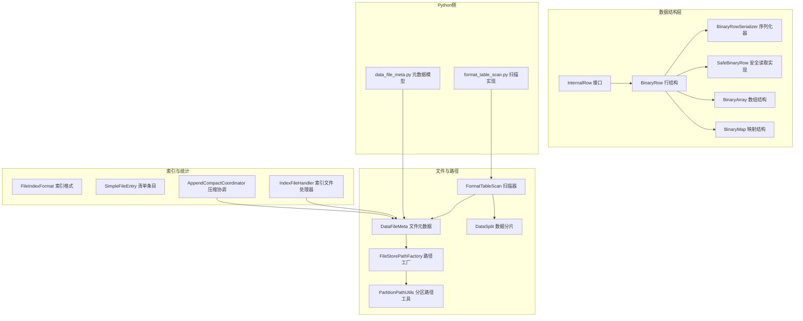
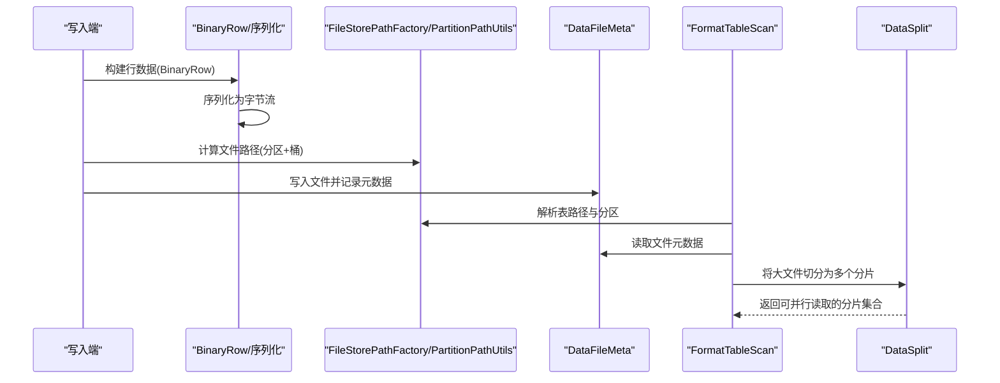
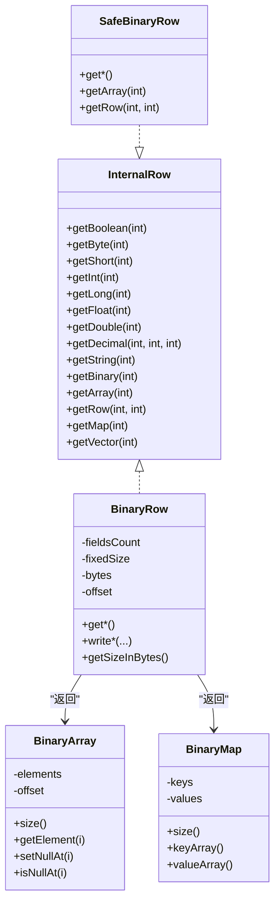
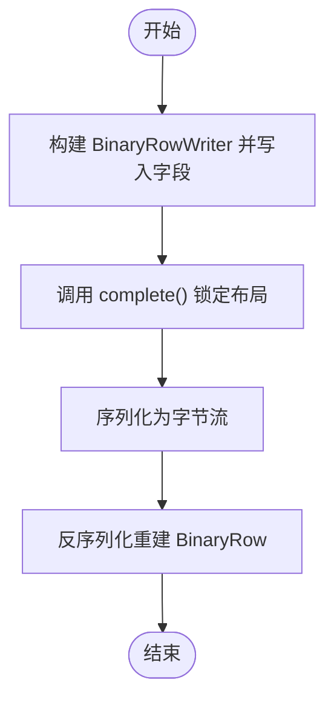
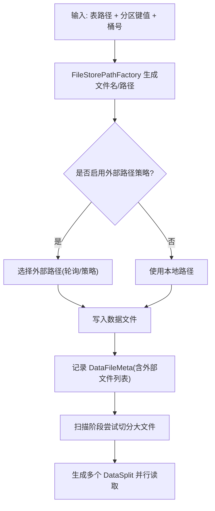
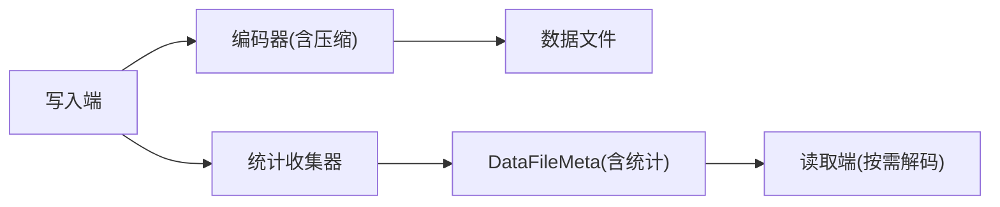
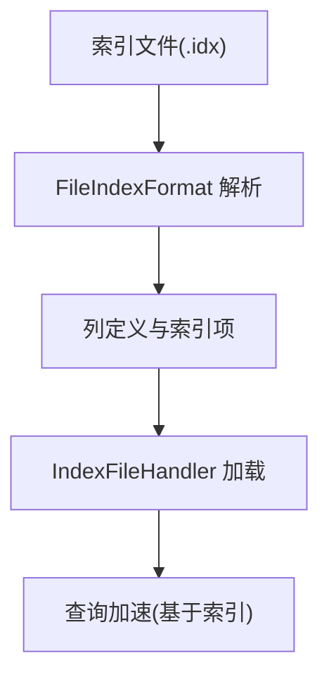
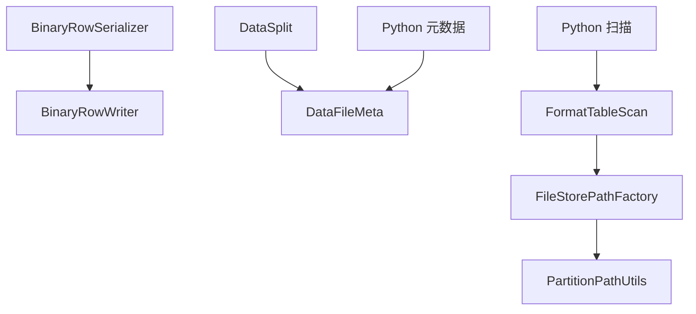

# 数据文件组织

<cite>
**本文引用的文件**
- [BinaryRow.java](file://paimon-common/src/main/java/org/apache/paimon/data/BinaryRow.java)
- [BinaryRowWriter.java](file://paimon-common/src/main/java/org/apache/paimon/data/BinaryRowWriter.java)
- [BinaryArray.java](file://paimon-common/src/main/java/org/apache/paimon/data/BinaryArray.java)
- [BinaryMap.java](file://paimon-common/src/main/java/org/apache/paimon/data/BinaryMap.java)
- [SafeBinaryRow.java](file://paimon-common/src/main/java/org/apache/paimon/data/safe/SafeBinaryRow.java)
- [InternalRow.java](file://paimon-common/src/main/java/org/apache/paimon/data/InternalRow.java)
- [BinaryRowSerializer.java](file://paimon-common/src/main/java/org/apache/paimon/data/serializer/BinaryRowSerializer.java)
- [DataFileMeta.java](file://paimon-core/src/main/java/org/apache/paimon/io/DataFileMeta.java)
- [PojoDataFileMeta.java](file://paimon-core/src/main/java/org/apache/paimon/io/PojoDataFileMeta.java)
- [FileStorePathFactory.java](file://paimon-core/src/main/java/org/apache/paimon/utils/FileStorePathFactory.java)
- [PartitionPathUtils.java](file://paimon-core/src/main/java/org/apache/paimon/utils/PartitionPathUtils.java)
- [FormatTableScan.java](file://paimon-core/src/main/java/org/apache/paimon/table/format/FormatTableScan.java)
- [DataSplit.java](file://paimon-core/src/main/java/org/apache/paimon/table/source/DataSplit.java)
- [FileIndexFormat.java](file://paimon-common/src/main/java/org/apache/paimon/fileindex/FileIndexFormat.java)
- [data_file_meta.py](file://paimon-python/pypaimon/manifest/schema/data_file_meta.py)
- [format_table_scan.py](file://paimon-python/pypaimon/table/format/format_table_scan.py)
- [SimpleFileEntry.java](file://paimon-core/src/main/java/org/apache/paimon/manifest/SimpleFileEntry.java)
- [ManifestCommittableSerializerCompatibilityTest.java](file://paimon-core/src/test/java/org/apache/paimon/manifest/ManifestCommittableSerializerCompatibilityTest.java)
- [FileStoreTestUtils.java](file://paimon-core/src/test/java/org/apache/paimon/operation/FileStoreTestUtils.java)
- [DataFileTestDataGenerator.java](file://paimon-core/src/test/java/org/apache/paimon/io/DataFileTestDataGenerator.java)
- [AppendCompactCoordinator.java](file://paimon-core/src/main/java/org/apache/paimon/append/AppendCompactCoordinator.java)
- [IndexFileHandler.java](file://paimon-core/src/main/java/org/apache/paimon/index/IndexFileHandler.java)
- [FileStorePathFactoryTest.java](file://paimon-core/src/test/java/org/apache/paimon/utils/FileStorePathFactoryTest.java)
</cite>

## 目录
1. [引言](#引言)
2. [项目结构](#项目结构)
3. [核心组件](#核心组件)
4. [架构总览](#架构总览)
5. [详细组件分析](#详细组件分析)
6. [依赖关系分析](#依赖关系分析)
7. [性能考量](#性能考量)
8. [故障排查指南](#故障排查指南)
9. [结论](#结论)
10. [附录](#附录)

## 引言
本文件聚焦于 Paimon 的“数据文件组织”，系统性阐述二进制数据结构（BinaryRow、BinaryArray、BinaryMap）与行数据接口（InternalRow）的设计与实现，解释数据文件的命名规则、目录结构与分片策略，说明压缩算法选择与统计信息收集机制，并给出性能优化与存储成本控制策略。内容面向不同技术背景读者，既提供高层概览，也包含代码级细节与可视化图示。

## 项目结构
围绕数据文件组织的关键模块分布如下：
- 数据结构层：BinaryRow、BinaryArray、BinaryMap、InternalRow 及其序列化器
- 文件元数据与路径：DataFileMeta、FileStorePathFactory、PartitionPathUtils
- 扫描与分片：FormatTableScan、DataSplit
- Python侧清单与扫描：data_file_meta.py、format_table_scan.py
- 索引与统计：FileIndexFormat、SimpleFileEntry、AppendCompactCoordinator
- 测试与兼容：ManifestCommittableSerializerCompatibilityTest、DataFileTestDataGenerator、FileStorePathFactoryTest

**图表来源**
- [InternalRow.java](file://paimon-common/src/main/java/org/apache/paimon/data/InternalRow.java)
- [BinaryRow.java](file://paimon-common/src/main/java/org/apache/paimon/data/BinaryRow.java)
- [BinaryRowSerializer.java](file://paimon-common/src/main/java/org/apache/paimon/data/serializer/BinaryRowSerializer.java)
- [SafeBinaryRow.java](file://paimon-common/src/main/java/org/apache/paimon/data/safe/SafeBinaryRow.java)
- [DataFileMeta.java](file://paimon-core/src/main/java/org/apache/paimon/io/DataFileMeta.java)
- [FileStorePathFactory.java](file://paimon-core/src/main/java/org/apache/paimon/utils/FileStorePathFactory.java)
- [PartitionPathUtils.java](file://paimon-core/src/main/java/org/apache/paimon/utils/PartitionPathUtils.java)
- [FormatTableScan.java](file://paimon-core/src/main/java/org/apache/paimon/table/format/FormatTableScan.java)
- [DataSplit.java](file://paimon-core/src/main/java/org/apache/paimon/table/source/DataSplit.java)
- [FileIndexFormat.java](file://paimon-common/src/main/java/org/apache/paimon/fileindex/FileIndexFormat.java)
- [SimpleFileEntry.java](file://paimon-core/src/main/java/org/apache/paimon/manifest/SimpleFileEntry.java)
- [AppendCompactCoordinator.java](file://paimon-core/src/main/java/org/apache/paimon/append/AppendCompactCoordinator.java)
- [IndexFileHandler.java](file://paimon-core/src/main/java/org/apache/paimon/index/IndexFileHandler.java)
- [data_file_meta.py](file://paimon-python/pypaimon/manifest/schema/data_file_meta.py)
- [format_table_scan.py](file://paimon-python/pypaimon/table/format/format_table_scan.py)

**章节来源**
- [BinaryRow.java](file://paimon-common/src/main/java/org/apache/paimon/data/BinaryRow.java)
- [BinaryRowSerializer.java](file://paimon-common/src/main/java/org/apache/paimon/data/serializer/BinaryRowSerializer.java)
- [DataFileMeta.java](file://paimon-core/src/main/java/org/apache/paimon/io/DataFileMeta.java)
- [FileStorePathFactory.java](file://paimon-core/src/main/java/org/apache/paimon/utils/FileStorePathFactory.java)
- [PartitionPathUtils.java](file://paimon-core/src/main/java/org/apache/paimon/utils/PartitionPathUtils.java)
- [FormatTableScan.java](file://paimon-core/src/main/java/org/apache/paimon/table/format/FormatTableScan.java)
- [DataSplit.java](file://paimon-core/src/main/java/org/apache/paimon/table/source/DataSplit.java)
- [FileIndexFormat.java](file://paimon-common/src/main/java/org/apache/paimon/fileindex/FileIndexFormat.java)
- [data_file_meta.py](file://paimon-python/pypaimon/manifest/schema/data_file_meta.py)
- [format_table_scan.py](file://paimon-python/pypaimon/table/format/format_table_scan.py)

## 核心组件
- BinaryRow：紧凑的二进制行表示，支持定长与变长字段混合布局，提供高效的序列化/反序列化与内存访问。
- BinaryArray：紧凑数组，包含长度前缀与元素数据，支持固定/可变长度元素类型。
- BinaryMap：键值对映射，由两个并行数组（键数组、值数组）组成，提供快速查找与迭代。
- InternalRow 接口：统一的行数据访问契约，定义字段读取、序列化、嵌套结构访问等能力。
- DataFileMeta：数据文件元信息，记录文件名、大小、行数、键值范围、统计信息、序列号范围、级别、外部文件列表等。
- FileStorePathFactory/PartitionPathUtils：生成数据文件路径与分区目录，遵循配置化的命名规则与后缀策略。
- FormatTableScan/DataSplit：扫描阶段将大文件切分为更小的分片，便于并行读取；DataSplit包含分区、桶、文件列表等信息。
- FileIndexFormat：索引文件格式，定义魔数、版本、头部长度、列数、索引项等字段的二进制布局。
- Python侧 data_file_meta.py/format_table_scan.py：在 Python 端对 DataFileMeta 进行序列化/反序列化与递归扫描。

**章节来源**
- [BinaryRow.java](file://paimon-common/src/main/java/org/apache/paimon/data/BinaryRow.java)
- [BinaryArray.java](file://paimon-common/src/main/java/org/apache/paimon/data/BinaryArray.java)
- [BinaryMap.java](file://paimon-common/src/main/java/org/apache/paimon/data/BinaryMap.java)
- [InternalRow.java](file://paimon-common/src/main/java/org/apache/paimon/data/InternalRow.java)
- [DataFileMeta.java](file://paimon-core/src/main/java/org/apache/paimon/io/DataFileMeta.java)
- [FileStorePathFactory.java](file://paimon-core/src/main/java/org/apache/paimon/utils/FileStorePathFactory.java)
- [PartitionPathUtils.java](file://paimon-core/src/main/java/org/apache/paimon/utils/PartitionPathUtils.java)
- [FormatTableScan.java](file://paimon-core/src/main/java/org/apache/paimon/table/format/FormatTableScan.java)
- [DataSplit.java](file://paimon-core/src/main/java/org/apache/paimon/table/source/DataSplit.java)
- [FileIndexFormat.java](file://paimon-common/src/main/java/org/apache/paimon/fileindex/FileIndexFormat.java)
- [data_file_meta.py](file://paimon-python/pypaimon/manifest/schema/data_file_meta.py)
- [format_table_scan.py](file://paimon-python/pypaimon/table/format/format_table_scan.py)

## 架构总览
下图展示从写入到读取的数据文件组织与处理链路，强调二进制行结构、文件元数据、路径与分片策略之间的关系。

**图表来源**
- [BinaryRowSerializer.java](file://paimon-common/src/main/java/org/apache/paimon/data/serializer/BinaryRowSerializer.java)
- [FileStorePathFactory.java](file://paimon-core/src/main/java/org/apache/paimon/utils/FileStorePathFactory.java)
- [PartitionPathUtils.java](file://paimon-core/src/main/java/org/apache/paimon/utils/PartitionPathUtils.java)
- [DataFileMeta.java](file://paimon-core/src/main/java/org/apache/paimon/io/DataFileMeta.java)
- [FormatTableScan.java](file://paimon-core/src/main/java/org/apache/paimon/table/format/FormatTableScan.java)
- [DataSplit.java](file://paimon-core/src/main/java/org/apache/paimon/table/source/DataSplit.java)

## 详细组件分析

### 二进制行结构：BinaryRow、BinaryArray、BinaryMap
- BinaryRow 设计要点
  - 定长部分与变长部分分离，通过偏移量与长度字段定位变长区域，减少指针开销。
  - 提供多种字段读取方法（整型、字符串、二进制、嵌套行、数组、映射），内部通过位运算与字节序处理提升性能。
  - 支持安全读取实现 SafeBinaryRow，用于只读场景与跨进程/网络传输后的解包。
- BinaryArray
  - 固定长度元素（如整型）直接按固定步长访问；可变长度元素（如字符串）通过偏移表定位。
  - 提供写入器 BinaryArrayWriter，完成写入后调用 complete() 锁定布局。
- BinaryMap
  - 由键数组与值数组组成，键值一一对应；支持空值与重复键的处理。
  - 与 InternalMapSerializer 配合进行序列化/反序列化。

**图表来源**
- [InternalRow.java](file://paimon-common/src/main/java/org/apache/paimon/data/InternalRow.java)
- [BinaryRow.java](file://paimon-common/src/main/java/org/apache/paimon/data/BinaryRow.java)
- [BinaryArray.java](file://paimon-common/src/main/java/org/apache/paimon/data/BinaryArray.java)
- [BinaryMap.java](file://paimon-common/src/main/java/org/apache/paimon/data/BinaryMap.java)
- [SafeBinaryRow.java](file://paimon-common/src/main/java/org/apache/paimon/data/safe/SafeBinaryRow.java)

**章节来源**
- [BinaryRow.java](file://paimon-common/src/main/java/org/apache/paimon/data/BinaryRow.java)
- [BinaryArray.java](file://paimon-common/src/main/java/org/apache/paimon/data/BinaryArray.java)
- [BinaryMap.java](file://paimon-common/src/main/java/org/apache/paimon/data/BinaryMap.java)
- [SafeBinaryRow.java](file://paimon-common/src/main/java/org/apache/paimon/data/safe/SafeBinaryRow.java)
- [InternalRow.java](file://paimon-common/src/main/java/org/apache/paimon/data/InternalRow.java)

### 行数据序列化与内存布局
- 序列化流程
  - 使用 BinaryRowWriter 写入字段，完成后 complete() 锁定布局。
  - BinaryRowSerializer 支持从输入流读取并重建 BinaryRow，或在多段内存中复用。
- 内存布局
  - 定长部分连续存放，变长部分位于尾部并通过偏移表定位。
  - 多段内存时，通过 AbstractPagedInputView 与 pointToMultiSegments 实现零拷贝访问。

**图表来源**
- [BinaryRowWriter.java](file://paimon-common/src/main/java/org/apache/paimon/data/BinaryRowWriter.java)
- [BinaryRowSerializer.java](file://paimon-common/src/main/java/org/apache/paimon/data/serializer/BinaryRowSerializer.java)

**章节来源**
- [BinaryRowWriter.java](file://paimon-common/src/main/java/org/apache/paimon/data/BinaryRowWriter.java)
- [BinaryRowSerializer.java](file://paimon-common/src/main/java/org/apache/paimon/data/serializer/BinaryRowSerializer.java)

### 文件命名规则、目录结构与分片策略
- 命名规则与后缀
  - FileStorePathFactory 根据表选项决定文件前缀、后缀是否包含压缩信息等。
  - 支持外部路径策略（如轮询），配合 DataFileMeta.external_path 字段使用。
- 目录结构
  - 分区目录遵循 key=value 或仅值形式，PartitionPathUtils 提供生成与解析逻辑。
  - 索引文件可置于数据文件目录内，由 indexFileFactory 控制。
- 分片策略
  - FormatTableScan 在扫描阶段根据目标分片大小将大文件拆分为多个 FormatDataSplit。
  - DataSplit 持有分区、桶、文件列表等信息，便于后续读取器并行处理。

**图表来源**
- [FileStorePathFactory.java](file://paimon-core/src/main/java/org/apache/paimon/utils/FileStorePathFactory.java)
- [PartitionPathUtils.java](file://paimon-core/src/main/java/org/apache/paimon/utils/PartitionPathUtils.java)
- [FormatTableScan.java](file://paimon-core/src/main/java/org/apache/paimon/table/format/FormatTableScan.java)
- [DataSplit.java](file://paimon-core/src/main/java/org/apache/paimon/table/source/DataSplit.java)
- [DataFileMeta.java](file://paimon-core/src/main/java/org/apache/paimon/io/DataFileMeta.java)

**章节来源**
- [FileStorePathFactory.java](file://paimon-core/src/main/java/org/apache/paimon/utils/FileStorePathFactory.java)
- [PartitionPathUtils.java](file://paimon-core/src/main/java/org/apache/paimon/utils/PartitionPathUtils.java)
- [FormatTableScan.java](file://paimon-core/src/main/java/org/apache/paimon/table/format/FormatTableScan.java)
- [DataSplit.java](file://paimon-core/src/main/java/org/apache/paimon/table/source/DataSplit.java)
- [DataFileMeta.java](file://paimon-core/src/main/java/org/apache/paimon/io/DataFileMeta.java)
- [FileStorePathFactoryTest.java](file://paimon-core/src/test/java/org/apache/paimon/utils/FileStorePathFactoryTest.java)

### 压缩算法选择与统计信息收集机制
- 压缩算法
  - 文件格式与压缩由表选项控制，写入端根据配置选择具体编码器；扫描端据此解码。
  - 文件后缀可包含压缩信息，便于读取端识别。
- 统计信息
  - DataFileMeta 记录 key_stats、value_stats、min/max key、row_count、file_size、序列号范围、级别等。
  - Python 侧 data_file_meta.py 提供复制/清理时不带值统计的 DataFileMeta 构造方法。
  - AppendCompactCoordinator 基于文件大小与删除比例触发压缩，避免过大的未压缩文件。

**图表来源**
- [DataFileMeta.java](file://paimon-core/src/main/java/org/apache/paimon/io/DataFileMeta.java)
- [PojoDataFileMeta.java](file://paimon-core/src/main/java/org/apache/paimon/io/PojoDataFileMeta.java)
- [data_file_meta.py](file://paimon-python/pypaimon/manifest/schema/data_file_meta.py)
- [AppendCompactCoordinator.java](file://paimon-core/src/main/java/org/apache/paimon/append/AppendCompactCoordinator.java)

**章节来源**
- [DataFileMeta.java](file://paimon-core/src/main/java/org/apache/paimon/io/DataFileMeta.java)
- [PojoDataFileMeta.java](file://paimon-core/src/main/java/org/apache/paimon/io/PojoDataFileMeta.java)
- [data_file_meta.py](file://paimon-python/pypaimon/manifest/schema/data_file_meta.py)
- [AppendCompactCoordinator.java](file://paimon-core/src/main/java/org/apache/paimon/append/AppendCompactCoordinator.java)

### 索引文件与索引格式
- FileIndexFormat 定义了索引文件的魔数、版本、头长度、列数、索引项等字段的二进制布局，确保跨版本兼容与扩展。
- IndexFileHandler 负责扫描与加载索引文件，结合 DataFileMeta 进行查询加速。

**图表来源**
- [FileIndexFormat.java](file://paimon-common/src/main/java/org/apache/paimon/fileindex/FileIndexFormat.java)
- [IndexFileHandler.java](file://paimon-core/src/main/java/org/apache/paimon/index/IndexFileHandler.java)

**章节来源**
- [FileIndexFormat.java](file://paimon-common/src/main/java/org/apache/paimon/fileindex/FileIndexFormat.java)
- [IndexFileHandler.java](file://paimon-core/src/main/java/org/apache/paimon/index/IndexFileHandler.java)

## 依赖关系分析
- 组件耦合
  - BinaryRowSerializer 依赖 BinaryRowWriter 以重建行结构；DataSplit 依赖 DataFileMeta 与路径工厂。
  - FileStorePathFactory 与 PartitionPathUtils 共同决定文件落盘位置；FormatTableScan 依赖这些信息进行分片。
- 外部依赖
  - Python 侧 format_table_scan.py 与 data_file_meta.py 作为跨语言桥接，负责清单与扫描的序列化/反序列化。

**图表来源**
- [BinaryRowSerializer.java](file://paimon-common/src/main/java/org/apache/paimon/data/serializer/BinaryRowSerializer.java)
- [BinaryRowWriter.java](file://paimon-common/src/main/java/org/apache/paimon/data/BinaryRowWriter.java)
- [DataSplit.java](file://paimon-core/src/main/java/org/apache/paimon/table/source/DataSplit.java)
- [DataFileMeta.java](file://paimon-core/src/main/java/org/apache/paimon/io/DataFileMeta.java)
- [FormatTableScan.java](file://paimon-core/src/main/java/org/apache/paimon/table/format/FormatTableScan.java)
- [FileStorePathFactory.java](file://paimon-core/src/main/java/org/apache/paimon/utils/FileStorePathFactory.java)
- [PartitionPathUtils.java](file://paimon-core/src/main/java/org/apache/paimon/utils/PartitionPathUtils.java)
- [format_table_scan.py](file://paimon-python/pypaimon/table/format/format_table_scan.py)
- [data_file_meta.py](file://paimon-python/pypaimon/manifest/schema/data_file_meta.py)

**章节来源**
- [BinaryRowSerializer.java](file://paimon-common/src/main/java/org/apache/paimon/data/serializer/BinaryRowSerializer.java)
- [BinaryRowWriter.java](file://paimon-common/src/main/java/org/apache/paimon/data/BinaryRowWriter.java)
- [DataSplit.java](file://paimon-core/src/main/java/org/apache/paimon/table/source/DataSplit.java)
- [DataFileMeta.java](file://paimon-core/src/main/java/org/apache/paimon/io/DataFileMeta.java)
- [FormatTableScan.java](file://paimon-core/src/main/java/org/apache/paimon/table/format/FormatTableScan.java)
- [FileStorePathFactory.java](file://paimon-core/src/main/java/org/apache/paimon/utils/FileStorePathFactory.java)
- [PartitionPathUtils.java](file://paimon-core/src/main/java/org/apache/paimon/utils/PartitionPathUtils.java)
- [format_table_scan.py](file://paimon-python/pypaimon/table/format/format_table_scan.py)
- [data_file_meta.py](file://paimon-python/pypaimon/manifest/schema/data_file_meta.py)

## 性能考量
- 二进制行结构
  - 使用定长+变长分离布局，减少随机访问开销；多段内存复用避免额外拷贝。
- 文件分片
  - 大文件切分为适配目标分片大小的块，提高并行度与局部性。
- 压缩与统计
  - 合理选择压缩算法与统计粒度，平衡 I/O 压缩比与 CPU 开销；利用统计信息进行裁剪与过滤。
- 存储成本控制
  - 基于文件大小与删除比例触发压缩，减少碎片与冗余；外部路径策略可分散热点与成本。

[本节为通用指导，无需特定文件来源]

## 故障排查指南
- 元数据不一致
  - 使用 ManifestCommittableSerializerCompatibilityTest 中的构造方法验证 DataFileMeta 字段一致性。
- 路径解析异常
  - 检查 FileStorePathFactory 与 PartitionPathUtils 的配置，确认分区目录命名与后缀策略。
- Python 侧扫描问题
  - 使用 format_table_scan.py 的递归扫描逻辑，确认目录层级与保留目录名过滤。
- 删除向量与外部文件
  - AppendCompactCoordinator 与 ExpireSnapshotsTest 展示了外部文件清理流程，注意 extra_files 列表与文件存在性。

**章节来源**
- [ManifestCommittableSerializerCompatibilityTest.java](file://paimon-core/src/test/java/org/apache/paimon/manifest/ManifestCommittableSerializerCompatibilityTest.java)
- [FileStorePathFactoryTest.java](file://paimon-core/src/test/java/org/apache/paimon/utils/FileStorePathFactoryTest.java)
- [format_table_scan.py](file://paimon-python/pypaimon/table/format/format_table_scan.py)
- [AppendCompactCoordinator.java](file://paimon-core/src/main/java/org/apache/paimon/append/AppendCompactCoordinator.java)
- [FileStoreTestUtils.java](file://paimon-core/src/test/java/org/apache/paimon/operation/FileStoreTestUtils.java)

## 结论
Paimon 的数据文件组织以 BinaryRow 为核心，结合 BinaryArray/BinaryMap 实现高效紧凑的行/列式存储；通过 DataFileMeta、FileStorePathFactory、PartitionPathUtils 与 FormatTableScan/DataSplit 形成完整的写入、落盘、元数据管理与读取分片链路；索引文件与统计信息进一步增强查询效率与运维能力。合理配置压缩与分片策略可在保证吞吐的同时有效控制存储成本。

[本节为总结，无需特定文件来源]

## 附录
- 关键类与方法速查
  - BinaryRow：字段读取、序列化、内存布局
  - BinaryArray/BinaryMap：数组/映射的紧凑表示与序列化
  - DataFileMeta：文件元数据字段与构造
  - FileStorePathFactory/PartitionPathUtils：路径生成与分区目录
  - FormatTableScan/DataSplit：扫描与分片
  - FileIndexFormat/IndexFileHandler：索引文件格式与加载
  - Python 侧 data_file_meta.py/format_table_scan.py：跨语言元数据与扫描

[本节为补充说明，无需特定文件来源]