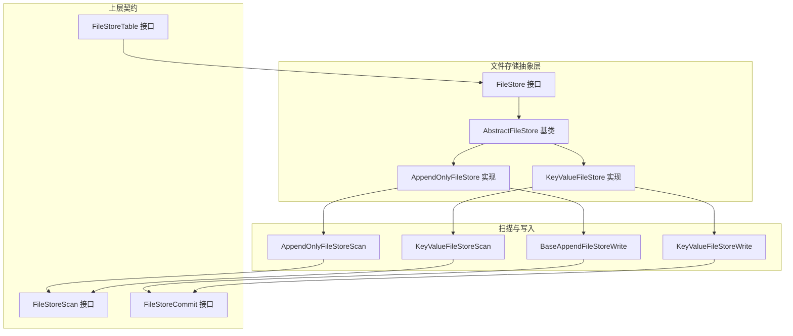
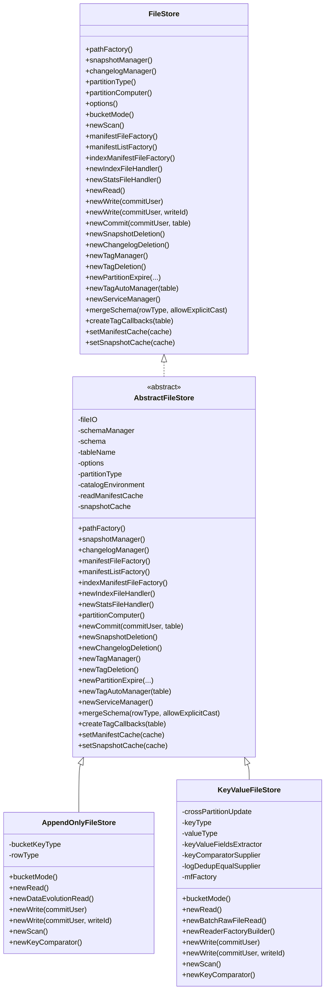
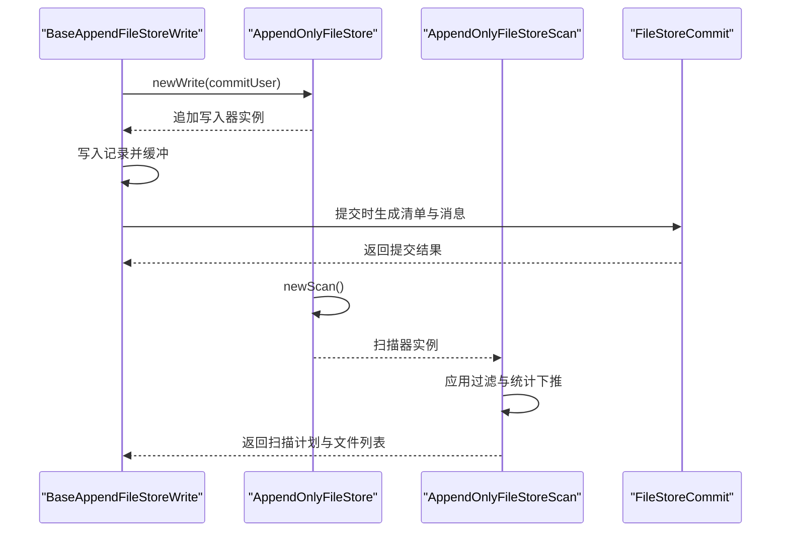
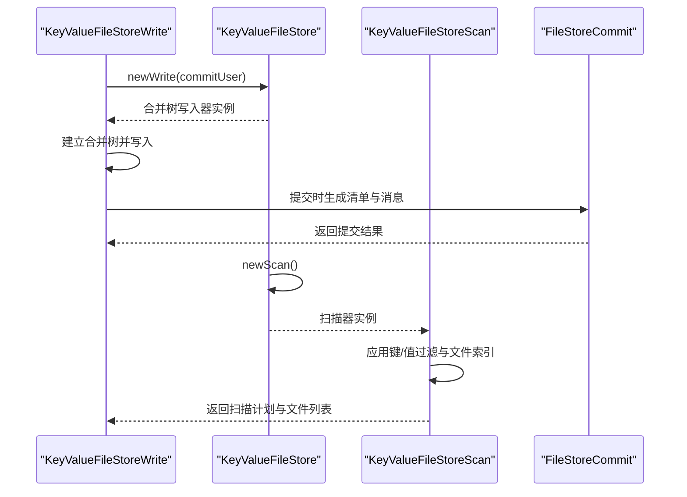
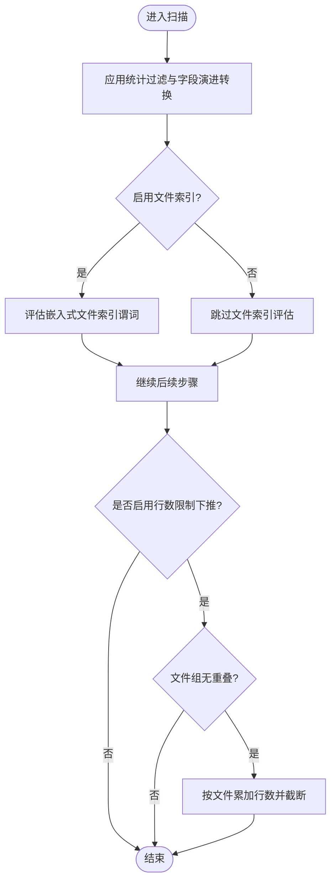
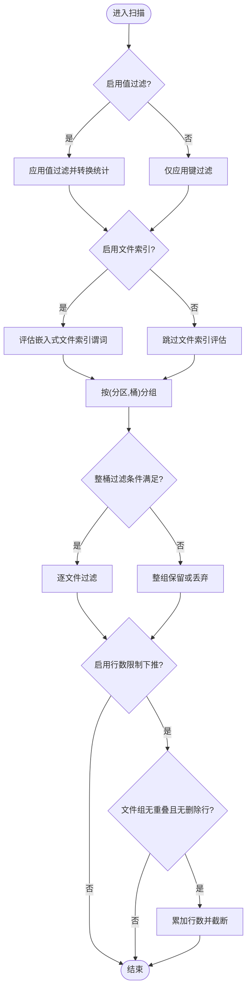
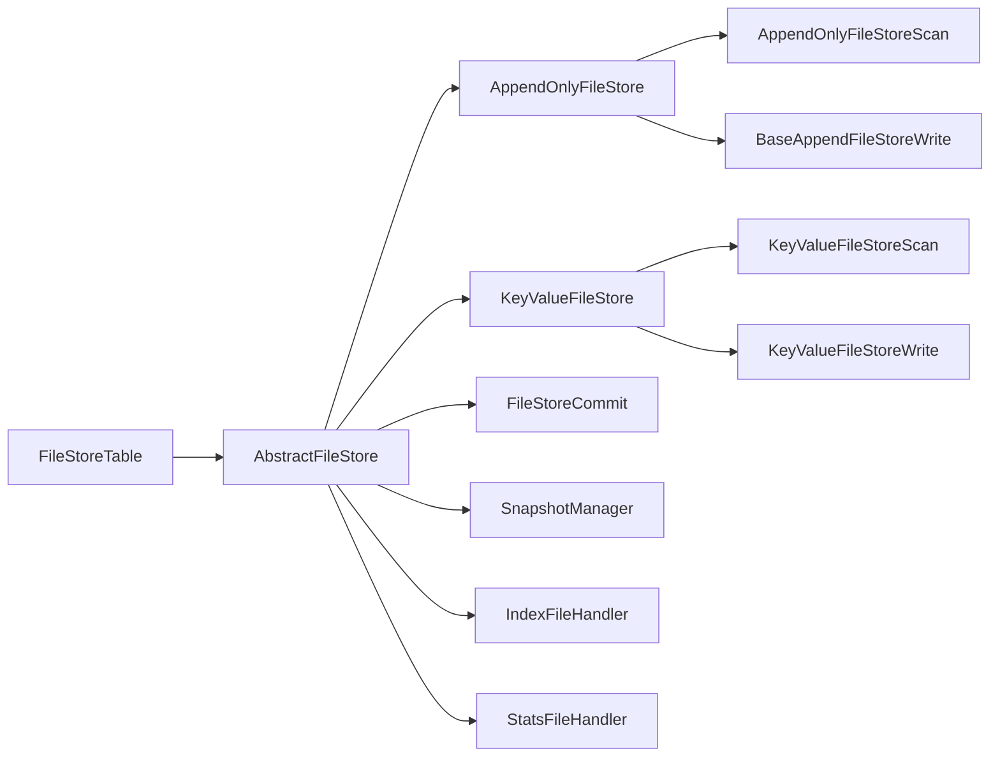

# 文件存储抽象层

<cite>
**本文引用的文件**
- [FileStore.java](file://paimon-core/src/main/java/org/apache/paimon/FileStore.java)
- [AbstractFileStore.java](file://paimon-core/src/main/java/org/apache/paimon/AbstractFileStore.java)
- [AppendOnlyFileStore.java](file://paimon-core/src/main/java/org/apache/paimon/AppendOnlyFileStore.java)
- [KeyValueFileStore.java](file://paimon-core/src/main/java/org/apache/paimon/KeyValueFileStore.java)
- [AppendOnlyFileStoreScan.java](file://paimon-core/src/main/java/org/apache/paimon/operation/AppendOnlyFileStoreScan.java)
- [KeyValueFileStoreScan.java](file://paimon-core/src/main/java/org/apache/paimon/operation/KeyValueFileStoreScan.java)
- [BaseAppendFileStoreWrite.java](file://paimon-core/src/main/java/org/apache/paimon/operation/BaseAppendFileStoreWrite.java)
- [KeyValueFileStoreWrite.java](file://paimon-core/src/main/java/org/apache/paimon/operation/KeyValueFileStoreWrite.java)
- [FileStoreScan.java](file://paimon-core/src/main/java/org/apache/paimon/operation/FileStoreScan.java)
- [FileStoreCommit.java](file://paimon-core/src/main/java/org/apache/paimon/operation/FileStoreCommit.java)
- [FileStoreTable.java](file://paimon-core/src/main/java/org/apache/paimon/table/FileStoreTable.java)
</cite>

## 目录
1. [引言](#引言)
2. [项目结构](#项目结构)
3. [核心组件](#核心组件)
4. [架构总览](#架构总览)
5. [详细组件分析](#详细组件分析)
6. [依赖分析](#依赖分析)
7. [性能考虑](#性能考虑)
8. [故障排查指南](#故障排查指南)
9. [结论](#结论)
10. [附录：扩展与自定义实现指南](#附录扩展与自定义实现指南)

## 引言
本文件存储抽象层文档系统性阐述了 Paimon 的文件存储抽象设计与实现，重点覆盖以下方面：
- FileStore 接口的设计理念与核心职责：统一抽象读写、扫描、提交、清理等能力，并与快照、变更日志、标签、分区过期等上层模块协作。
- AbstractFileStore 基类的实现要点：封装通用工厂方法、缓存配置、路径工厂、提交与删除器构建等，采用模板方法模式为子类提供可插拔的实现骨架。
- AppendOnlyFileStore 与 KeyValueFileStore 两类具体实现的差异与适用场景：前者面向只追加型数据模型，后者面向键值型数据模型并支持合并树、动态分桶、删除向量等高级特性。
- 与其他组件的交互关系：与表管理、快照管理、提交流程、索引与统计处理的集成方式。
- 扩展与自定义实现指南：如何基于现有抽象进行扩展或实现新的文件存储类型。

## 项目结构
围绕文件存储抽象层的关键文件组织如下：
- 抽象接口与基类：FileStore、AbstractFileStore
- 具体实现：AppendOnlyFileStore、KeyValueFileStore
- 扫描与写入：AppendOnlyFileStoreScan、KeyValueFileStoreScan、BaseAppendFileStoreWrite、KeyValueFileStoreWrite
- 上层契约：FileStoreScan、FileStoreCommit、FileStoreTable

图表来源
- [FileStore.java:61-127](file://paimon-core/src/main/java/org/apache/paimon/FileStore.java#L61-L127)
- [AbstractFileStore.java:95-525](file://paimon-core/src/main/java/org/apache/paimon/AbstractFileStore.java#L95-L525)
- [AppendOnlyFileStore.java:45-175](file://paimon-core/src/main/java/org/apache/paimon/AppendOnlyFileStore.java#L45-L175)
- [KeyValueFileStore.java:53-224](file://paimon-core/src/main/java/org/apache/paimon/KeyValueFileStore.java#L53-L224)
- [AppendOnlyFileStoreScan.java:44-181](file://paimon-core/src/main/java/org/apache/paimon/operation/AppendOnlyFileStoreScan.java#L44-L181)
- [KeyValueFileStoreScan.java:58-369](file://paimon-core/src/main/java/org/apache/paimon/operation/KeyValueFileStoreScan.java#L58-L369)
- [BaseAppendFileStoreWrite.java:69-321](file://paimon-core/src/main/java/org/apache/paimon/operation/BaseAppendFileStoreWrite.java#L69-L321)
- [KeyValueFileStoreWrite.java:68-224](file://paimon-core/src/main/java/org/apache/paimon/operation/KeyValueFileStoreWrite.java#L68-L224)
- [FileStoreScan.java:50-167](file://paimon-core/src/main/java/org/apache/paimon/operation/FileStoreScan.java#L50-L167)
- [FileStoreCommit.java:35-95](file://paimon-core/src/main/java/org/apache/paimon/operation/FileStoreCommit.java#L35-L95)
- [FileStoreTable.java:56-180](file://paimon-core/src/main/java/org/apache/paimon/table/FileStoreTable.java#L56-L180)

章节来源
- [FileStore.java:61-127](file://paimon-core/src/main/java/org/apache/paimon/FileStore.java#L61-L127)
- [AbstractFileStore.java:95-525](file://paimon-core/src/main/java/org/apache/paimon/AbstractFileStore.java#L95-L525)

## 核心组件
- FileStore 接口：定义文件存储对外能力，包括路径工厂、快照/变更日志/标签管理器、清单工厂、索引与统计处理器、读取器、写入器、提交器、分区过期、自动标签管理、服务管理、模式合并、回调注册以及缓存设置等。
- AbstractFileStore 基类：集中实现路径工厂、清单/清单列表/索引清单工厂、快照/变更日志/标签管理器、索引文件处理器、统计文件处理器、清单读取器、分区计算机、冲突检测工厂、提交器、删除器、标签管理器、分区过期器、自动标签管理器、服务管理器、回调装配、缓存注入等；通过抽象方法 newKeyComparator 为键值型存储提供键比较器。
- AppendOnlyFileStore：面向只追加场景，提供原始文件读取、数据演进读取、追加写入（含非分桶与分桶）、扫描（含数据演进与文件索引）等能力。
- KeyValueFileStore：面向键值场景，提供合并树读取、批式原始读取、键值读取器工厂、多种写入策略（含延迟分桶、动态分桶、删除向量维护）、扫描（含合并引擎、变更日志生产者、文件索引）等能力。

章节来源
- [FileStore.java:61-127](file://paimon-core/src/main/java/org/apache/paimon/FileStore.java#L61-L127)
- [AbstractFileStore.java:95-525](file://paimon-core/src/main/java/org/apache/paimon/AbstractFileStore.java#L95-L525)
- [AppendOnlyFileStore.java:45-175](file://paimon-core/src/main/java/org/apache/paimon/AppendOnlyFileStore.java#L45-L175)
- [KeyValueFileStore.java:53-224](file://paimon-core/src/main/java/org/apache/paimon/KeyValueFileStore.java#L53-L224)

## 架构总览
文件存储抽象层以“接口 + 模板方法”的方式向上提供统一能力，向下通过具体实现适配不同数据模型与写入策略。其与上层表管理、快照管理、提交流程、索引与统计处理形成清晰的职责边界。

图表来源
- [FileStore.java:61-127](file://paimon-core/src/main/java/org/apache/paimon/FileStore.java#L61-L127)
- [AbstractFileStore.java:95-525](file://paimon-core/src/main/java/org/apache/paimon/AbstractFileStore.java#L95-L525)
- [AppendOnlyFileStore.java:45-175](file://paimon-core/src/main/java/org/apache/paimon/AppendOnlyFileStore.java#L45-L175)
- [KeyValueFileStore.java:53-224](file://paimon-core/src/main/java/org/apache/paimon/KeyValueFileStore.java#L53-L224)

## 详细组件分析

### FileStore 接口与 AbstractFileStore 基类
- 设计理念
  - 统一抽象：将路径工厂、清单/清单列表/索引清单工厂、快照/变更日志/标签管理器、索引与统计处理器、读取器、写入器、提交器、删除器、分区过期、自动标签管理、服务管理、模式合并、回调装配、缓存注入等能力集中于接口与基类，屏蔽具体实现细节。
  - 可插拔：通过抽象方法 newKeyComparator 等为子类提供可替换点，结合模板方法模式在基类中完成通用逻辑，子类仅需关注差异化部分。
- 关键职责
  - 路径与清单工厂：根据选项生成文件路径工厂与清单相关工厂，确保文件命名、压缩、后缀、外部路径等策略一致。
  - 管理器与处理器：快照/变更日志/标签管理器、索引文件处理器、统计文件处理器，支撑元数据与索引的生命周期管理。
  - 提交与删除：冲突检测工厂、提交器、快照/变更日志/标签/分区删除器，保证事务一致性与资源清理。
  - 回调与缓存：提交前/后回调装配、外部路径策略、快照与清单缓存注入，提升性能与可扩展性。
- 与上层交互
  - 与表管理：FileStoreTable 通过 store() 获取 FileStore 实例，进而获取写入器、扫描器、提交器等。
  - 与快照管理：通过 SnapshotManager 与 SnapshotDeletion 协作，实现快照生命周期管理与清理。
  - 与索引与统计：IndexFileHandler 与 StatsFileHandler 配合文件索引与统计信息的生成与维护。

章节来源
- [FileStore.java:61-127](file://paimon-core/src/main/java/org/apache/paimon/FileStore.java#L61-L127)
- [AbstractFileStore.java:95-525](file://paimon-core/src/main/java/org/apache/paimon/AbstractFileStore.java#L95-L525)
- [FileStoreTable.java:56-180](file://paimon-core/src/main/java/org/apache/paimon/table/FileStoreTable.java#L56-L180)

### AppendOnlyFileStore（只追加）
- 场景定位
  - 适用于只追加型数据模型，无需主键与更新语义，强调高吞吐写入与简单扫描。
- 核心能力
  - 分桶模式：当未配置分桶时为无桶感知，否则为固定哈希分桶。
  - 读取：RawFileSplitRead 支持按文件直接读取；DataEvolutionSplitRead 支持字段演进读取。
  - 写入：非分桶使用 AppendFileStoreWrite；分桶使用 BucketedAppendFileStoreWrite，支持删除向量维护。
  - 扫描：AppendOnlyFileStoreScan 支持统计过滤、文件索引过滤、按行数限制下推等优化。
- 适用场景
  - 日志/事件流写入、审计数据、无需主键更新的数据湖表。

章节来源
- [AppendOnlyFileStore.java:45-175](file://paimon-core/src/main/java/org/apache/paimon/AppendOnlyFileStore.java#L45-L175)
- [AppendOnlyFileStoreScan.java:44-181](file://paimon-core/src/main/java/org/apache/paimon/operation/AppendOnlyFileStoreScan.java#L44-L181)
- [BaseAppendFileStoreWrite.java:69-321](file://paimon-core/src/main/java/org/apache/paimon/operation/BaseAppendFileStoreWrite.java#L69-L321)

### KeyValueFileStore（键值）
- 场景定位
  - 适用于需要主键、更新、合并与复杂查询的表，强调键值一致性与高效读写。
- 核心能力
  - 分桶模式：支持固定分桶、动态分桶（跨分区更新）、延迟分桶（Postpone）等模式。
  - 读取：MergeFileSplitRead 使用合并树读取；RawFileSplitRead 支持批式原始读取。
  - 写入：支持延迟分桶写入与动态分桶写入，结合删除向量维护与索引维护。
  - 扫描：KeyValueFileStoreScan 支持键/值过滤、合并引擎选择、变更日志生产者影响的过滤策略、文件索引与按桶聚合的后过滤优化。
- 适用场景
  - OLTP/OLAP 混合表、需要主键更新与合并的表、需要高效范围查询与聚合的场景。

章节来源
- [KeyValueFileStore.java:53-224](file://paimon-core/src/main/java/org/apache/paimon/KeyValueFileStore.java#L53-L224)
- [KeyValueFileStoreScan.java:58-369](file://paimon-core/src/main/java/org/apache/paimon/operation/KeyValueFileStoreScan.java#L58-L369)
- [KeyValueFileStoreWrite.java:68-224](file://paimon-core/src/main/java/org/apache/paimon/operation/KeyValueFileStoreWrite.java#L68-L224)

### 扫描与写入流程（序列图）
- AppendOnly 写入与扫描

图表来源
- [BaseAppendFileStoreWrite.java:69-321](file://paimon-core/src/main/java/org/apache/paimon/operation/BaseAppendFileStoreWrite.java#L69-L321)
- [AppendOnlyFileStore.java:45-175](file://paimon-core/src/main/java/org/apache/paimon/AppendOnlyFileStore.java#L45-L175)
- [AppendOnlyFileStoreScan.java:44-181](file://paimon-core/src/main/java/org/apache/paimon/operation/AppendOnlyFileStoreScan.java#L44-L181)
- [FileStoreCommit.java:35-95](file://paimon-core/src/main/java/org/apache/paimon/operation/FileStoreCommit.java#L35-L95)

- KeyValue 写入与扫描

图表来源
- [KeyValueFileStoreWrite.java:68-224](file://paimon-core/src/main/java/org/apache/paimon/operation/KeyValueFileStoreWrite.java#L68-L224)
- [KeyValueFileStore.java:53-224](file://paimon-core/src/main/java/org/apache/paimon/KeyValueFileStore.java#L53-L224)
- [KeyValueFileStoreScan.java:58-369](file://paimon-core/src/main/java/org/apache/paimon/operation/KeyValueFileStoreScan.java#L58-L369)
- [FileStoreCommit.java:35-95](file://paimon-core/src/main/java/org/apache/paimon/operation/FileStoreCommit.java#L35-L95)

### 复杂逻辑流程（算法流程图）
- AppendOnly 扫描过滤与限制下推

图表来源
- [AppendOnlyFileStoreScan.java:119-180](file://paimon-core/src/main/java/org/apache/paimon/operation/AppendOnlyFileStoreScan.java#L119-L180)

- KeyValue 扫描过滤与按桶后过滤

图表来源
- [KeyValueFileStoreScan.java:139-369](file://paimon-core/src/main/java/org/apache/paimon/operation/KeyValueFileStoreScan.java#L139-L369)

## 依赖分析
- 组件耦合与内聚
  - FileStore 接口与 AbstractFileStore 基类：高内聚、低耦合，基类封装通用工厂与管理器，子类仅关注差异化实现。
  - AppendOnlyFileStore 与 KeyValueFileStore：分别面向不同数据模型，内部依赖各自的扫描与写入实现，保持良好内聚。
  - 与上层契约：FileStoreScan、FileStoreCommit、FileStoreTable 形成稳定的契约边界，降低耦合度。
- 外部依赖与集成点
  - 路径工厂与清单工厂：统一受 CoreOptions 控制，确保文件命名与存储策略一致。
  - 快照/变更日志/标签管理器：与 CatalogEnvironment 协作，实现快照生命周期与标签管理。
  - 索引与统计：IndexFileHandler 与 StatsFileHandler 与扫描器协同，提升查询效率。
- 潜在循环依赖
  - 当前结构未见明显循环依赖；提交器与扫描器通过工厂与管理器间接协作，避免直接循环引用。

图表来源
- [AbstractFileStore.java:95-525](file://paimon-core/src/main/java/org/apache/paimon/AbstractFileStore.java#L95-L525)
- [AppendOnlyFileStore.java:45-175](file://paimon-core/src/main/java/org/apache/paimon/AppendOnlyFileStore.java#L45-L175)
- [KeyValueFileStore.java:53-224](file://paimon-core/src/main/java/org/apache/paimon/KeyValueFileStore.java#L53-L224)
- [AppendOnlyFileStoreScan.java:44-181](file://paimon-core/src/main/java/org/apache/paimon/operation/AppendOnlyFileStoreScan.java#L44-L181)
- [BaseAppendFileStoreWrite.java:69-321](file://paimon-core/src/main/java/org/apache/paimon/operation/BaseAppendFileStoreWrite.java#L69-L321)
- [KeyValueFileStoreScan.java:58-369](file://paimon-core/src/main/java/org/apache/paimon/operation/KeyValueFileStoreScan.java#L58-L369)
- [KeyValueFileStoreWrite.java:68-224](file://paimon-core/src/main/java/org/apache/paimon/operation/KeyValueFileStoreWrite.java#L68-L224)
- [FileStoreTable.java:56-180](file://paimon-core/src/main/java/org/apache/paimon/table/FileStoreTable.java#L56-L180)

章节来源
- [AbstractFileStore.java:95-525](file://paimon-core/src/main/java/org/apache/paimon/AbstractFileStore.java#L95-L525)
- [FileStoreTable.java:56-180](file://paimon-core/src/main/java/org/apache/paimon/table/FileStoreTable.java#L56-L180)

## 性能考虑
- 统计与索引下推：通过 SimpleStatsEvolution 与文件索引谓词评估，减少无效文件访问。
- 限制下推：在 AppendOnly 与 KeyValue 扫描中，针对无重叠文件组与特定合并引擎，按行数限制进行下推，减少读取与处理开销。
- 删除向量与文件索引：启用删除向量与文件索引可显著提升扫描与写入性能，但需权衡索引维护成本。
- 写入缓冲与异步写：AppendOnly 写入支持缓冲与异步写，提高写入吞吐；KeyValue 写入通过合并树与本地排序优化写入与读取性能。
- 并行扫描：扫描器支持清单读取并行度配置，提升大规模表扫描效率。

## 故障排查指南
- 提交冲突与回滚
  - 冲突检测：AbstractFileStore 在 newCommit 中构建 ConflictDetection 工厂，写入器在创建阶段检查冲突，必要时触发回滚。
  - 回滚路径：通过 CatalogEnvironment 注入的 TableRollback 或 CommitRollback 执行回滚。
- 清理与回收
  - 快照/变更日志/标签/分区删除器：通过对应的新建方法创建删除器，按配置清理空目录与过期对象。
- 缓存问题
  - 清单与快照缓存：通过 setManifestCache 与 setSnapshotCache 注入缓存，若出现缓存不一致，可调整缓存策略或禁用缓存进行验证。
- 扫描异常
  - 文件索引评估异常：在 KeyValue 扫描中，文件索引谓词评估失败会抛出运行时异常，需检查索引生成与文件格式兼容性。

章节来源
- [AbstractFileStore.java:275-321](file://paimon-core/src/main/java/org/apache/paimon/AbstractFileStore.java#L275-L321)
- [AbstractFileStore.java:337-347](file://paimon-core/src/main/java/org/apache/paimon/AbstractFileStore.java#L337-L347)
- [AbstractFileStore.java:355-366](file://paimon-core/src/main/java/org/apache/paimon/AbstractFileStore.java#L355-L366)
- [AbstractFileStore.java:517-524](file://paimon-core/src/main/java/org/apache/paimon/AbstractFileStore.java#L517-L524)
- [KeyValueFileStoreScan.java:175-193](file://paimon-core/src/main/java/org/apache/paimon/operation/KeyValueFileStoreScan.java#L175-L193)

## 结论
文件存储抽象层通过 FileStore 接口与 AbstractFileStore 基类实现了对读写、扫描、提交、清理等能力的高度抽象，结合 AppendOnlyFileStore 与 KeyValueFileStore 的差异化实现，覆盖从只追加到键值合并的广泛场景。其与上层表管理、快照管理、提交流程、索引与统计处理的清晰边界，既保证了可扩展性，也提升了整体系统的稳定性与性能表现。

## 附录：扩展与自定义实现指南
- 新增文件存储类型步骤
  - 定义接口实现：实现 FileStore 接口或继承 AbstractFileStore，至少实现 newKeyComparator、bucketMode、newRead、newWrite、newScan 等方法。
  - 扫描与写入适配：根据数据模型实现对应的扫描器与写入器，遵循现有 AppendOnlyFileStoreScan/KeyValueFileStoreScan 与 BaseAppendFileStoreWrite/KeyValueFileStoreWrite 的模式。
  - 工厂与管理器：复用 AbstractFileStore 中的路径工厂、清单工厂、快照/变更日志/标签管理器、索引/统计处理器等，确保行为一致。
  - 提交与删除：复用 newCommit/newSnapshotDeletion/newChangelogDeletion/newTagDeletion/newPartitionExpire/newTagAutoManager/newServiceManager 等工厂方法，保证事务一致性与资源清理。
  - 回调与缓存：通过 createTagCallbacks 与 setManifestCache/setSnapshotCache 注入回调与缓存，提升性能与可扩展性。
- 自定义实现建议
  - 明确数据模型：只追加或键值模型决定分桶策略、扫描与写入路径。
  - 性能优先：优先启用统计与文件索引下推、限制下推、删除向量与异步写等优化。
  - 稳定性保障：严格遵循冲突检测与回滚机制，确保提交一致性；合理配置清理策略，避免资源泄露。
  - 测试覆盖：针对扫描过滤、写入缓冲、合并树、删除向量等关键路径进行单元测试与集成测试。