# Arrow内存数据格式

<cite>
**本文引用的文件**
- [ArrowBundleRecords.java](file://paimon-arrow/src/main/java/org/apache/paimon/arrow/ArrowBundleRecords.java)
- [ArrowFieldTypeConversion.java](file://paimon-arrow/src/main/java/org/apache/paimon/arrow/ArrowFieldTypeConversion.java)
- [ArrowUtils.java](file://paimon-arrow/src/main/java/org/apache/paimon/arrow/ArrowUtils.java)
- [ArrowBatchConverter.java](file://paimon-arrow/src/main/java/org/apache/paimon/arrow/converter/ArrowBatchConverter.java)
- [ArrowPerRowBatchConverter.java](file://paimon-arrow/src/main/java/org/apache/paimon/arrow/converter/ArrowPerRowBatchConverter.java)
- [ArrowVectorizedBatchConverter.java](file://paimon-arrow/src/main/java/org/apache/paimon/arrow/converter/ArrowVectorizedBatchConverter.java)
- [Arrow2PaimonVectorConverter.java](file://paimon-arrow/src/main/java/org/apache/paimon/arrow/converter/Arrow2PaimonVectorConverter.java)
- [ArrowBatchReader.java](file://paimon-arrow/src/main/java/org/apache/paimon/arrow/reader/ArrowBatchReader.java)
- [ArrowFormatWriter.java](file://paimon-arrow/src/main/java/org/apache/paimon/arrow/vector/ArrowFormatWriter.java)
- [NativeWriter.java](file://paimon-arrow/src/main/java/org/apache/paimon/arrow/writer/NativeWriter.java)
- [ArrowFieldWriter.java](file://paimon-arrow/src/main/java/org/apache/paimon/arrow/writer/ArrowFieldWriter.java)
- [ArrowFieldWriterFactory.java](file://paimon-arrow/src/main/java/org/apache/paimon/arrow/writer/ArrowFieldWriterFactory.java)
- [ArrowFieldWriterFactoryVisitor.java](file://paimon-arrow/src/main/java/org/apache/paimon/arrow/writer/ArrowFieldWriterFactoryVisitor.java)
</cite>

## 目录
1. [引言](#引言)
2. [项目结构](#项目结构)
3. [核心组件](#核心组件)
4. [架构总览](#架构总览)
5. [详细组件分析](#详细组件分析)
6. [依赖关系分析](#依赖关系分析)
7. [性能考量](#性能考量)
8. [故障排查指南](#故障排查指南)
9. [结论](#结论)
10. [附录](#附录)

## 引言
本文件系统化阐述 Apache Arrow 在 Paimon 中的内存数据格式实现与应用，重点覆盖以下方面：
- 零拷贝内存共享与向量化操作：通过 Arrow 的列式内存布局与 FieldVector 实现批量数据的零拷贝传递与高效处理。
- 跨语言数据交换标准：以 Arrow IPC 格式为桥梁，实现不同运行时（Java/C++/Python 等）之间的数据互通。
- Paimon 内部实现：围绕 ArrowBundleRecords 批量记录、ArrowBatchConverter 批处理转换、ArrowFormatWriter 格式写入、以及 NativeWriter 原生写入优化展开。
- 类型系统与 RowType 转换：Arrow 字段类型与 Paimon 数据类型的双向映射，以及复杂类型（数组、映射、变体、向量）的拆解与重组。
- 性能优势与内存优化：批量写入、内存上限控制、字段写入器复用、IPC 序列化等策略带来的吞吐与内存效率提升。

## 项目结构
Paimon 的 Arrow 支持位于独立模块 paimon-arrow，采用按职责分层组织：
- converter：批处理转换器族，负责从 Paimon 的迭代器或向量化批次写入 Arrow。
- reader：Arrow 到 Paimon 行的读取器，支持投影与字段映射。
- vector：面向 Arrow 的写入器与工具类，如 ArrowFormatWriter、ArrowUtils、ArrowFieldTypeConversion。
- writer：字段级写入器与工厂，支撑不同 Arrow 类型的写入路径。
- 核心入口：ArrowBundleRecords 将 VectorSchemaRoot 包装为可迭代的批量记录。

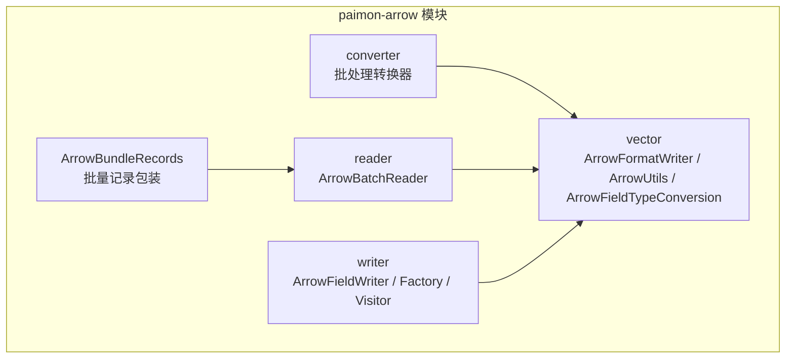

**图表来源**
- [ArrowBundleRecords.java:31-58](file://paimon-arrow/src/main/java/org/apache/paimon/arrow/ArrowBundleRecords.java#L31-L58)
- [ArrowBatchConverter.java:33-78](file://paimon-arrow/src/main/java/org/apache/paimon/arrow/converter/ArrowBatchConverter.java#L33-L78)
- [ArrowBatchReader.java:39-108](file://paimon-arrow/src/main/java/org/apache/paimon/arrow/reader/ArrowBatchReader.java#L39-L108)
- [ArrowFormatWriter.java:46-242](file://paimon-arrow/src/main/java/org/apache/paimon/arrow/vector/ArrowFormatWriter.java#L46-L242)
- [ArrowUtils.java:65-319](file://paimon-arrow/src/main/java/org/apache/paimon/arrow/ArrowUtils.java#L65-L319)
- [ArrowFieldWriter.java:30-97](file://paimon-arrow/src/main/java/org/apache/paimon/arrow/writer/ArrowFieldWriter.java#L30-L97)
- [ArrowFieldWriterFactoryVisitor.java:54-215](file://paimon-arrow/src/main/java/org/apache/paimon/arrow/writer/ArrowFieldWriterFactoryVisitor.java#L54-L215)

**章节来源**
- [ArrowBundleRecords.java:31-58](file://paimon-arrow/src/main/java/org/apache/paimon/arrow/ArrowBundleRecords.java#L31-L58)
- [ArrowBatchConverter.java:33-78](file://paimon-arrow/src/main/java/org/apache/paimon/arrow/converter/ArrowBatchConverter.java#L33-L78)
- [ArrowBatchReader.java:39-108](file://paimon-arrow/src/main/java/org/apache/paimon/arrow/reader/ArrowBatchReader.java#L39-L108)
- [ArrowFormatWriter.java:46-242](file://paimon-arrow/src/main/java/org/apache/paimon/arrow/vector/ArrowFormatWriter.java#L46-L242)
- [ArrowUtils.java:65-319](file://paimon-arrow/src/main/java/org/apache/paimon/arrow/ArrowUtils.java#L65-L319)
- [ArrowFieldWriter.java:30-97](file://paimon-arrow/src/main/java/org/apache/paimon/arrow/writer/ArrowFieldWriter.java#L30-L97)
- [ArrowFieldWriterFactoryVisitor.java:54-215](file://paimon-arrow/src/main/java/org/apache/paimon/arrow/writer/ArrowFieldWriterFactoryVisitor.java#L54-L215)

## 核心组件
- ArrowBundleRecords：将 Arrow 的 VectorSchemaRoot 包装为批量记录，提供行数统计与迭代器访问，内部委托 ArrowBatchReader 进行行级读取。
- ArrowBatchConverter 家族：抽象批处理器，支持逐行与向量化两种模式；子类分别适配 RecordIterator 与 VectorizedColumnBatch。
- ArrowBatchReader：将 Arrow 的 VectorSchemaRoot 投影为 Paimon 的列式向量，生成可迭代的 InternalRow。
- ArrowFormatWriter：面向 Paimon InternalRow 的 Arrow 写入器，负责批量写入、内存上限控制与字段写入器复用。
- ArrowUtils：创建 Arrow Schema/FieldVector、字段类型转换、序列化到 IPC、导出 C 结构等工具方法。
- ArrowFieldTypeConversion：Paimon DataType 到 Arrow FieldType 的转换器与访问者。
- Writer 子系统：ArrowFieldWriter 抽象写入器、工厂接口与工厂访问者，按数据类型生成具体写入器。

**章节来源**
- [ArrowBundleRecords.java:31-58](file://paimon-arrow/src/main/java/org/apache/paimon/arrow/ArrowBundleRecords.java#L31-L58)
- [ArrowBatchConverter.java:33-78](file://paimon-arrow/src/main/java/org/apache/paimon/arrow/converter/ArrowBatchConverter.java#L33-L78)
- [ArrowPerRowBatchConverter.java:31-77](file://paimon-arrow/src/main/java/org/apache/paimon/arrow/converter/ArrowPerRowBatchConverter.java#L31-L77)
- [ArrowVectorizedBatchConverter.java:38-117](file://paimon-arrow/src/main/java/org/apache/paimon/arrow/converter/ArrowVectorizedBatchConverter.java#L38-L117)
- [ArrowBatchReader.java:39-108](file://paimon-arrow/src/main/java/org/apache/paimon/arrow/reader/ArrowBatchReader.java#L39-L108)
- [ArrowFormatWriter.java:46-242](file://paimon-arrow/src/main/java/org/apache/paimon/arrow/vector/ArrowFormatWriter.java#L46-L242)
- [ArrowUtils.java:65-319](file://paimon-arrow/src/main/java/org/apache/paimon/arrow/ArrowUtils.java#L65-L319)
- [ArrowFieldTypeConversion.java:55-205](file://paimon-arrow/src/main/java/org/apache/paimon/arrow/ArrowFieldTypeConversion.java#L55-L205)
- [ArrowFieldWriter.java:30-97](file://paimon-arrow/src/main/java/org/apache/paimon/arrow/writer/ArrowFieldWriter.java#L30-L97)
- [ArrowFieldWriterFactory.java:24-28](file://paimon-arrow/src/main/java/org/apache/paimon/arrow/writer/ArrowFieldWriterFactory.java#L24-L28)
- [ArrowFieldWriterFactoryVisitor.java:54-215](file://paimon-arrow/src/main/java/org/apache/paimon/arrow/writer/ArrowFieldWriterFactoryVisitor.java#L54-L215)

## 架构总览
下图展示 Arrow 在 Paimon 中的端到端流程：从 Paimon 的 InternalRow/VectorizedColumnBatch 到 Arrow 的 VectorSchemaRoot，再到读取阶段的反向转换。

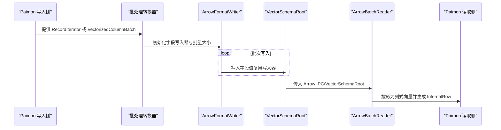

**图表来源**
- [ArrowBatchConverter.java:33-78](file://paimon-arrow/src/main/java/org/apache/paimon/arrow/converter/ArrowBatchConverter.java#L33-L78)
- [ArrowPerRowBatchConverter.java:31-77](file://paimon-arrow/src/main/java/org/apache/paimon/arrow/converter/ArrowPerRowBatchConverter.java#L31-L77)
- [ArrowVectorizedBatchConverter.java:38-117](file://paimon-arrow/src/main/java/org/apache/paimon/arrow/converter/ArrowVectorizedBatchConverter.java#L38-L117)
- [ArrowFormatWriter.java:46-242](file://paimon-arrow/src/main/java/org/apache/paimon/arrow/vector/ArrowFormatWriter.java#L46-L242)
- [ArrowBatchReader.java:39-108](file://paimon-arrow/src/main/java/org/apache/paimon/arrow/reader/ArrowBatchReader.java#L39-L108)

## 详细组件分析

### ArrowBundleRecords 批量记录包装
- 角色：将 Arrow 的 VectorSchemaRoot 包装为可迭代的批量记录，暴露行数与迭代器。
- 关键点：构造时保存 RowType 与大小写敏感标志；迭代器内部使用 ArrowBatchReader 将 Arrow 向量投影为 Paimon 的列式向量，再逐行返回 InternalRow。

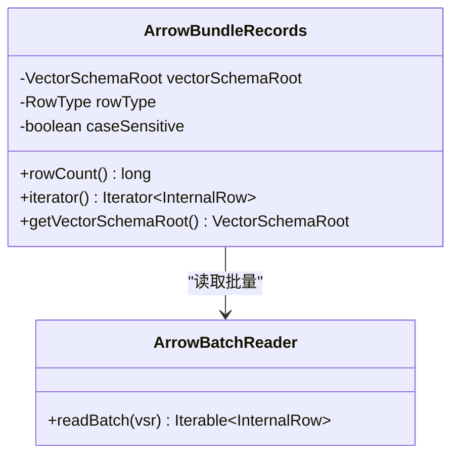

**图表来源**
- [ArrowBundleRecords.java:31-58](file://paimon-arrow/src/main/java/org/apache/paimon/arrow/ArrowBundleRecords.java#L31-L58)
- [ArrowBatchReader.java:39-108](file://paimon-arrow/src/main/java/org/apache/paimon/arrow/reader/ArrowBatchReader.java#L39-L108)

**章节来源**
- [ArrowBundleRecords.java:31-58](file://paimon-arrow/src/main/java/org/apache/paimon/arrow/ArrowBundleRecords.java#L31-L58)
- [ArrowBatchReader.java:39-108](file://paimon-arrow/src/main/java/org/apache/paimon/arrow/reader/ArrowBatchReader.java#L39-L108)

### ArrowBatchConverter 批处理转换器
- 抽象基类：维护 VectorSchemaRoot 与字段写入器数组，提供 next(maxBatchRows) 接口，重置写入器后执行 doWrite 并设置行数。
- 逐行转换器：ArrowPerRowBatchConverter 逐行写入，适合小批量或流式场景。
- 向量化转换器：ArrowVectorizedBatchConverter 从列式向量批量写入，支持删除向量过滤与起始偏移，适合高吞吐场景。

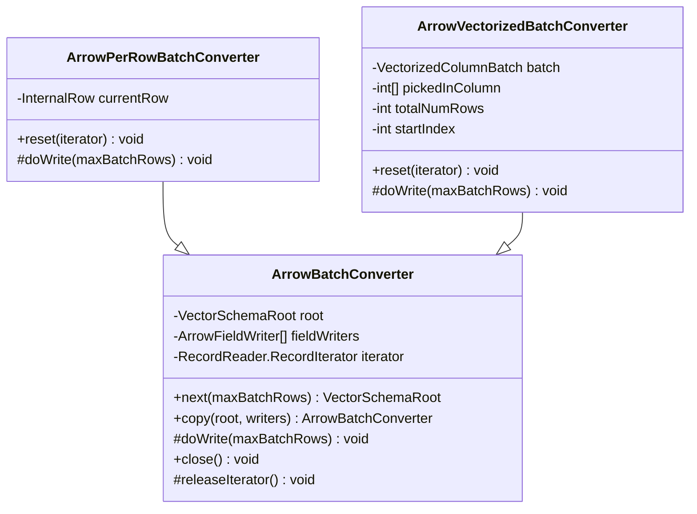

**图表来源**
- [ArrowBatchConverter.java:33-78](file://paimon-arrow/src/main/java/org/apache/paimon/arrow/converter/ArrowBatchConverter.java#L33-L78)
- [ArrowPerRowBatchConverter.java:31-77](file://paimon-arrow/src/main/java/org/apache/paimon/arrow/converter/ArrowPerRowBatchConverter.java#L31-L77)
- [ArrowVectorizedBatchConverter.java:38-117](file://paimon-arrow/src/main/java/org/apache/paimon/arrow/converter/ArrowVectorizedBatchConverter.java#L38-L117)

**章节来源**
- [ArrowBatchConverter.java:33-78](file://paimon-arrow/src/main/java/org/apache/paimon/arrow/converter/ArrowBatchConverter.java#L33-L78)
- [ArrowPerRowBatchConverter.java:31-77](file://paimon-arrow/src/main/java/org/apache/paimon/arrow/converter/ArrowPerRowBatchConverter.java#L31-L77)
- [ArrowVectorizedBatchConverter.java:38-117](file://paimon-arrow/src/main/java/org/apache/paimon/arrow/converter/ArrowVectorizedBatchConverter.java#L38-L117)

### ArrowBatchReader 读取器
- 功能：根据 RowType 对 Arrow Schema 进行字段映射（支持大小写敏感），将每个 Arrow 字段转换为 Paimon 的 ColumnVector，最终生成按行迭代的 InternalRow。
- 复用：预先构建 Arrow2PaimonVectorConverter 数组，避免每批重复创建。

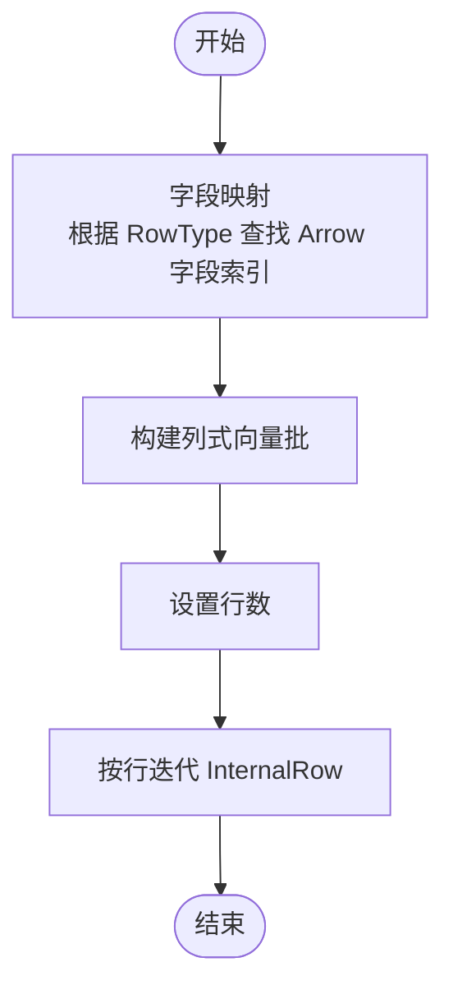

**图表来源**
- [ArrowBatchReader.java:69-107](file://paimon-arrow/src/main/java/org/apache/paimon/arrow/reader/ArrowBatchReader.java#L69-L107)

**章节来源**
- [ArrowBatchReader.java:39-108](file://paimon-arrow/src/main/java/org/apache/paimon/arrow/reader/ArrowBatchReader.java#L39-L108)

### ArrowFormatWriter 写入器
- 功能：面向 Paimon InternalRow 的批量写入器，负责：
  - 创建 VectorSchemaRoot 与字段写入器数组；
  - 写入单条记录并支持批量提交；
  - 内存使用监控与阈值控制；
  - 重置与关闭资源。
- 特性：支持可选的“削平”（shredding）模式，将 VariantType 拆分为指定 RowType；支持大小写敏感字段名；提供 flush/reset/close 等生命周期管理。

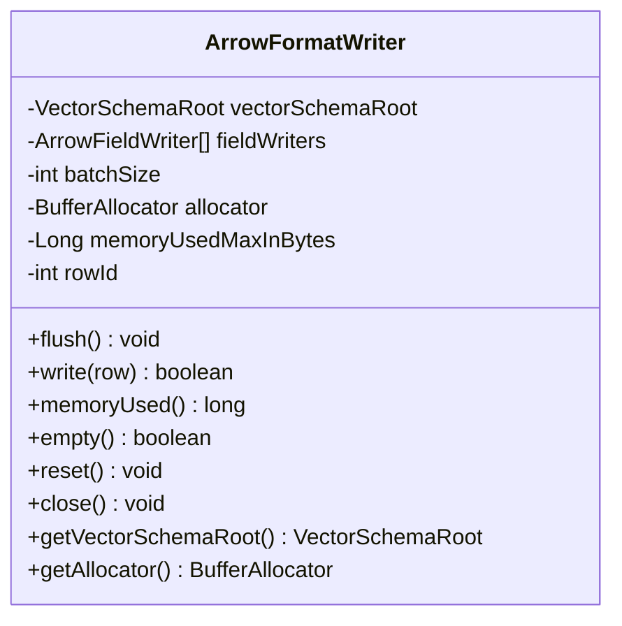

**图表来源**
- [ArrowFormatWriter.java:46-242](file://paimon-arrow/src/main/java/org/apache/paimon/arrow/vector/ArrowFormatWriter.java#L46-L242)

**章节来源**
- [ArrowFormatWriter.java:46-242](file://paimon-arrow/src/main/java/org/apache/paimon/arrow/vector/ArrowFormatWriter.java#L46-L242)

### ArrowUtils 工具集
- 功能：
  - 创建 VectorSchemaRoot 与 FieldVector；
  - 将 Paimon RowType/DataField/DataType 转换为 Arrow Field/Schema；
  - 序列化 VectorSchemaRoot 到 Arrow IPC；
  - 导出 C 结构（ArrowArray/ArrowSchema）用于原生交互；
  - 时间戳转换（含时区转换）。
- 设计：通过 ArrowFieldTypeConversion 访问者完成类型映射；对复杂类型（数组、映射、变体、结构体）递归构建子字段。

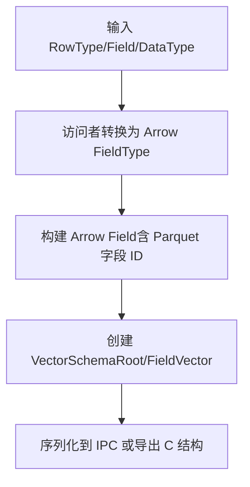

**图表来源**
- [ArrowUtils.java:69-319](file://paimon-arrow/src/main/java/org/apache/paimon/arrow/ArrowUtils.java#L69-L319)
- [ArrowFieldTypeConversion.java:55-205](file://paimon-arrow/src/main/java/org/apache/paimon/arrow/ArrowFieldTypeConversion.java#L55-L205)

**章节来源**
- [ArrowUtils.java:65-319](file://paimon-arrow/src/main/java/org/apache/paimon/arrow/ArrowUtils.java#L65-L319)
- [ArrowFieldTypeConversion.java:55-205](file://paimon-arrow/src/main/java/org/apache/paimon/arrow/ArrowFieldTypeConversion.java#L55-L205)

### ArrowFieldTypeConversion 类型转换
- 功能：DataTypeVisitor 实现，将 Paimon 的各种数据类型映射为 Arrow 的 FieldType/ArrowType，覆盖标量、数组、映射、结构体、向量等。
- 注意：部分类型不支持（如 Multiset、Blob），并在相应分支抛出异常。

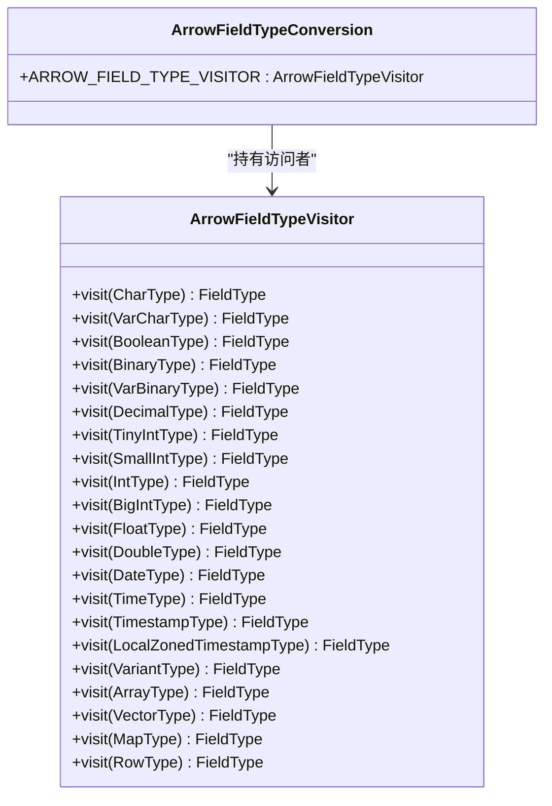

**图表来源**
- [ArrowFieldTypeConversion.java:55-205](file://paimon-arrow/src/main/java/org/apache/paimon/arrow/ArrowFieldTypeConversion.java#L55-L205)

**章节来源**
- [ArrowFieldTypeConversion.java:55-205](file://paimon-arrow/src/main/java/org/apache/paimon/arrow/ArrowFieldTypeConversion.java#L55-L205)

### Writer 子系统：字段写入器与工厂
- ArrowFieldWriter：抽象字段写入器，支持批量写入与逐行写入，提供 reset 与 null 值处理。
- ArrowFieldWriterFactory：工厂接口，按 Arrow FieldVector 与可空性创建具体写入器。
- ArrowFieldWriterFactoryVisitor：按 Paimon 数据类型生成对应工厂，覆盖标量、数组、映射、结构体、向量等。

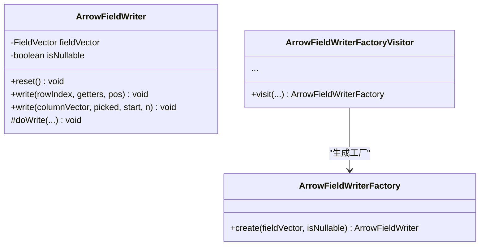

**图表来源**
- [ArrowFieldWriter.java:30-97](file://paimon-arrow/src/main/java/org/apache/paimon/arrow/writer/ArrowFieldWriter.java#L30-L97)
- [ArrowFieldWriterFactory.java:24-28](file://paimon-arrow/src/main/java/org/apache/paimon/arrow/writer/ArrowFieldWriterFactory.java#L24-L28)
- [ArrowFieldWriterFactoryVisitor.java:54-215](file://paimon-arrow/src/main/java/org/apache/paimon/arrow/writer/ArrowFieldWriterFactoryVisitor.java#L54-L215)

**章节来源**
- [ArrowFieldWriter.java:30-97](file://paimon-arrow/src/main/java/org/apache/paimon/arrow/writer/ArrowFieldWriter.java#L30-L97)
- [ArrowFieldWriterFactory.java:24-28](file://paimon-arrow/src/main/java/org/apache/paimon/arrow/writer/ArrowFieldWriterFactory.java#L24-L28)
- [ArrowFieldWriterFactoryVisitor.java:54-215](file://paimon-arrow/src/main/java/org/apache/paimon/arrow/writer/ArrowFieldWriterFactoryVisitor.java#L54-L215)

### Arrow2PaimonVectorConverter 反向转换
- 功能：将 Arrow 的 FieldVector 转换为 Paimon 的 ColumnVector，覆盖标量、数组、映射、结构体、向量等类型。
- 设计：通过访问者模式按 Paimon 数据类型生成对应的转换器，内部利用 Arrow 的具体向量类型（如 VarCharVector、ListVector、StructVector 等）进行读取。

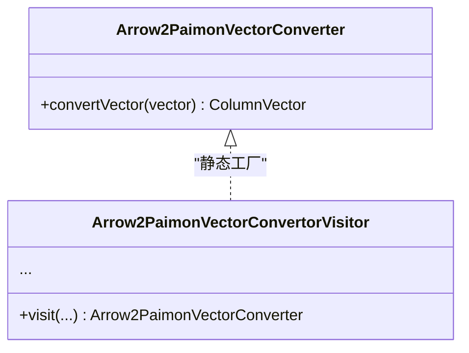

**图表来源**
- [Arrow2PaimonVectorConverter.java:97-709](file://paimon-arrow/src/main/java/org/apache/paimon/arrow/converter/Arrow2PaimonVectorConverter.java#L97-L709)

**章节来源**
- [Arrow2PaimonVectorConverter.java:97-709](file://paimon-arrow/src/main/java/org/apache/paimon/arrow/converter/Arrow2PaimonVectorConverter.java#L97-L709)

### NativeWriter 原生写入优化
- 角色：定义原生写入器接口，提供 nativeMemoryUsed、writeIpcBytes、close 等能力，便于与 Arrow C 数据结构对接，实现零拷贝或低拷贝的原生写入路径。

**章节来源**
- [NativeWriter.java:21-31](file://paimon-arrow/src/main/java/org/apache/paimon/arrow/writer/NativeWriter.java#L21-L31)

## 依赖关系分析
- 组件耦合：
  - ArrowBundleRecords 依赖 ArrowBatchReader 与 VectorSchemaRoot。
  - 批处理转换器依赖 ArrowFieldWriter 与 ArrowFieldWriterFactoryVisitor。
  - ArrowBatchReader 依赖 Arrow2PaimonVectorConverter 与 ArrowFieldTypeConversion。
  - ArrowFormatWriter 依赖 ArrowUtils 与 ArrowFieldTypeConversion。
- 外部依赖：
  - Arrow IPC、VectorSchemaRoot、FieldVector、时间戳与字节缓冲等 Arrow API。
  - Paimon 的 InternalRow、ColumnVector、VectorizedColumnBatch、RowType 等类型。

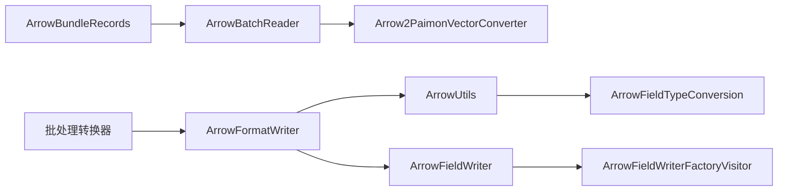

**图表来源**
- [ArrowBundleRecords.java:31-58](file://paimon-arrow/src/main/java/org/apache/paimon/arrow/ArrowBundleRecords.java#L31-L58)
- [ArrowBatchReader.java:39-108](file://paimon-arrow/src/main/java/org/apache/paimon/arrow/reader/ArrowBatchReader.java#L39-L108)
- [Arrow2PaimonVectorConverter.java:97-709](file://paimon-arrow/src/main/java/org/apache/paimon/arrow/converter/Arrow2PaimonVectorConverter.java#L97-L709)
- [ArrowBatchConverter.java:33-78](file://paimon-arrow/src/main/java/org/apache/paimon/arrow/converter/ArrowBatchConverter.java#L33-L78)
- [ArrowFormatWriter.java:46-242](file://paimon-arrow/src/main/java/org/apache/paimon/arrow/vector/ArrowFormatWriter.java#L46-L242)
- [ArrowUtils.java:65-319](file://paimon-arrow/src/main/java/org/apache/paimon/arrow/ArrowUtils.java#L65-L319)
- [ArrowFieldTypeConversion.java:55-205](file://paimon-arrow/src/main/java/org/apache/paimon/arrow/ArrowFieldTypeConversion.java#L55-L205)
- [ArrowFieldWriter.java:30-97](file://paimon-arrow/src/main/java/org/apache/paimon/arrow/writer/ArrowFieldWriter.java#L30-L97)
- [ArrowFieldWriterFactoryVisitor.java:54-215](file://paimon-arrow/src/main/java/org/apache/paimon/arrow/writer/ArrowFieldWriterFactoryVisitor.java#L54-L215)

**章节来源**
- [ArrowBundleRecords.java:31-58](file://paimon-arrow/src/main/java/org/apache/paimon/arrow/ArrowBundleRecords.java#L31-L58)
- [ArrowBatchReader.java:39-108](file://paimon-arrow/src/main/java/org/apache/paimon/arrow/reader/ArrowBatchReader.java#L39-L108)
- [Arrow2PaimonVectorConverter.java:97-709](file://paimon-arrow/src/main/java/org/apache/paimon/arrow/converter/Arrow2PaimonVectorConverter.java#L97-L709)
- [ArrowBatchConverter.java:33-78](file://paimon-arrow/src/main/java/org/apache/paimon/arrow/converter/ArrowBatchConverter.java#L33-L78)
- [ArrowFormatWriter.java:46-242](file://paimon-arrow/src/main/java/org/apache/paimon/arrow/vector/ArrowFormatWriter.java#L46-L242)
- [ArrowUtils.java:65-319](file://paimon-arrow/src/main/java/org/apache/paimon/arrow/ArrowUtils.java#L65-L319)
- [ArrowFieldTypeConversion.java:55-205](file://paimon-arrow/src/main/java/org/apache/paimon/arrow/ArrowFieldTypeConversion.java#L55-L205)
- [ArrowFieldWriter.java:30-97](file://paimon-arrow/src/main/java/org/apache/paimon/arrow/writer/ArrowFieldWriter.java#L30-L97)
- [ArrowFieldWriterFactoryVisitor.java:54-215](file://paimon-arrow/src/main/java/org/apache/paimon/arrow/writer/ArrowFieldWriterFactoryVisitor.java#L54-L215)

## 性能考量
- 批量写入与复用：
  - 批处理转换器复用 ArrowFieldWriter，减少对象分配与初始化开销。
  - ArrowFormatWriter 支持批量写入与 flush/reset，降低频繁分配成本。
- 内存上限控制：
  - 写入器周期性检查内存使用，超过阈值时提前返回，避免 OOM。
- 向量化读取：
  - ArrowBatchReader 将 Arrow 字段直接投影为 Paimon 列式向量，避免行式遍历的额外成本。
- IPC 序列化：
  - ArrowUtils 提供序列化到 Arrow IPC 的便捷方法，利于跨进程/跨语言传输。
- 删除向量适配：
  - ArrowVectorizedBatchConverter 支持删除向量过滤，仅写入未被标记删除的行，减少无效数据写入。

[本节为通用性能讨论，无需列出具体文件来源]

## 故障排查指南
- 写入失败与内存限制：
  - 当内存使用超过设定阈值或发生越界/超分配时，写入器会返回失败并记录警告日志，建议增大内存上限或减小批量大小。
- 非空字段写入：
  - 若写入非空字段却遇到空值，将抛出参数异常，提示可能由合并引擎导致的空值产生。
- 类型不支持：
  - 对于不支持的类型（如 Multiset、Blob、Variant），相关转换器或写入器会抛出异常，需调整表结构或使用支持的类型。

**章节来源**
- [ArrowFormatWriter.java:157-188](file://paimon-arrow/src/main/java/org/apache/paimon/arrow/vector/ArrowFormatWriter.java#L157-L188)
- [ArrowFieldWriter.java:70-86](file://paimon-arrow/src/main/java/org/apache/paimon/arrow/writer/ArrowFieldWriter.java#L70-L86)
- [Arrow2PaimonVectorConverter.java:441-448](file://paimon-arrow/src/main/java/org/apache/paimon/arrow/converter/Arrow2PaimonVectorConverter.java#L441-L448)
- [ArrowFieldWriterFactoryVisitor.java:155-157](file://paimon-arrow/src/main/java/org/apache/paimon/arrow/writer/ArrowFieldWriterFactoryVisitor.java#L155-L157)

## 结论
Paimon 通过 Arrow 实现了高性能、跨语言的内存数据格式与批处理转换链路。核心优势包括：
- 零拷贝与向量化：借助 Arrow 的列式内存与 IPC，实现高效的跨边界数据传输与处理。
- 类型完备映射：覆盖标量、数组、映射、结构体、向量与时间戳等复杂类型，保障与 Paimon RowType 的一致转换。
- 批处理优化：批量写入、内存上限控制、删除向量过滤与字段写入器复用，显著提升吞吐与稳定性。
- 可扩展设计：通过访问者与工厂模式，易于扩展新的数据类型与写入路径。

[本节为总结性内容，无需列出具体文件来源]

## 附录
- Arrow 内存布局要点：
  - 每个字段由 FieldVector 表示，包含值缓冲、可空位图与字节对齐信息。
  - VectorSchemaRoot 管理多个 FieldVector，并统一设置行数。
- 与传统文件格式对比（概念性说明）：
  - 行式格式（如 CSV/JSON）在大规模扫描时存在解析与装箱成本；Arrow 的列式与零拷贝特性在批量处理与跨语言传输中具备明显优势。
  - 与 Parquet 等列式文件相比，Arrow 更偏向内存态与中间态处理，适合流式与批处理混合场景。

[本节为概念性说明，无需列出具体文件来源]