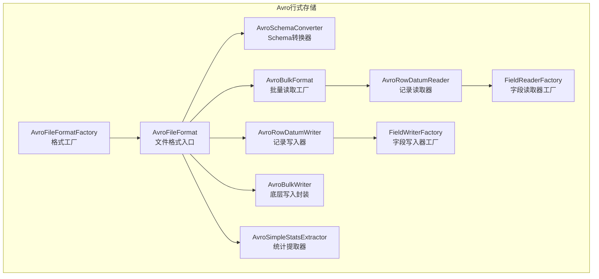
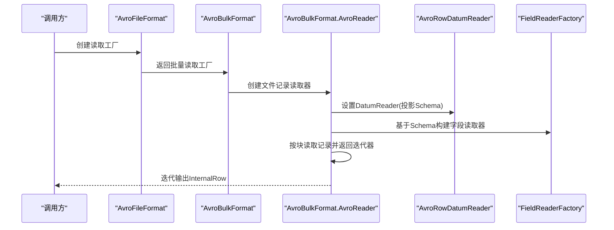
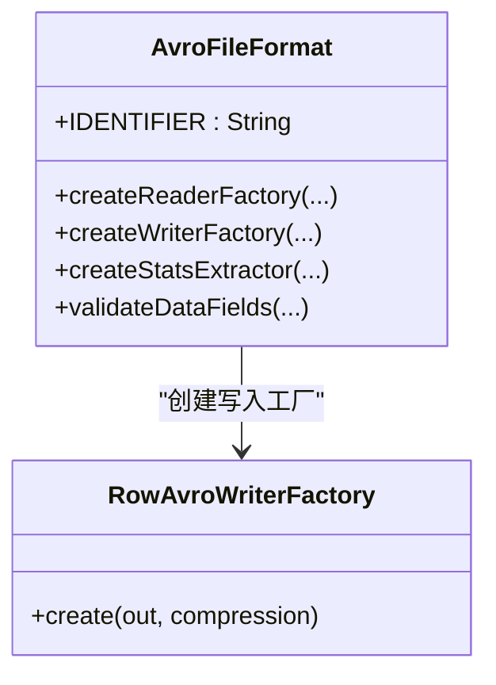
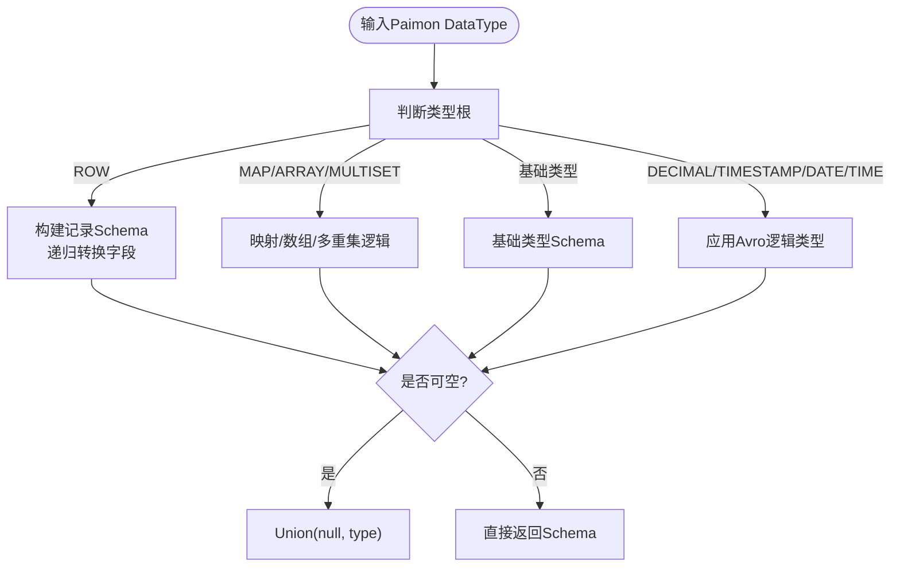
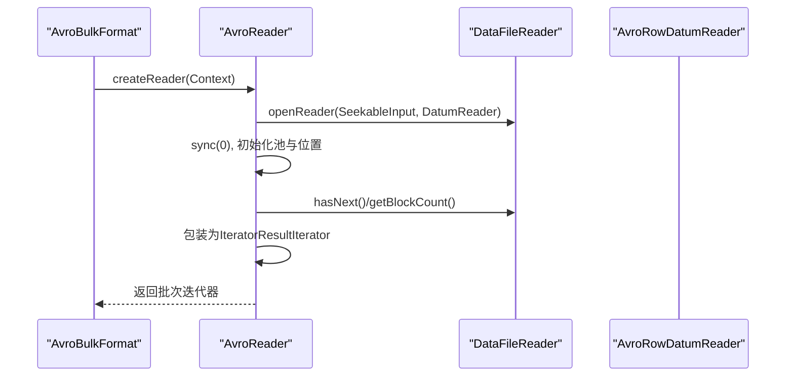
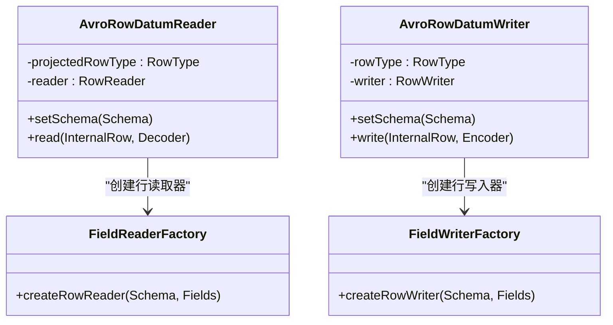
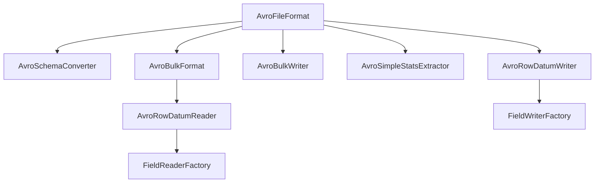

# Avro行式存储格式

<cite>
**本文引用的文件**
- [AvroFileFormat.java](file://paimon-format/src/main/java/org/apache/paimon/format/avro/AvroFileFormat.java)
- [AvroSchemaConverter.java](file://paimon-format/src/main/java/org/apache/paimon/format/avro/AvroSchemaConverter.java)
- [AvroBulkFormat.java](file://paimon-format/src/main/java/org/apache/paimon/format/avro/AvroBulkFormat.java)
- [AvroRowDatumReader.java](file://paimon-format/src/main/java/org/apache/paimon/format/avro/AvroRowDatumReader.java)
- [AvroRowDatumWriter.java](file://paimon-format/src/main/java/org/apache/paimon/format/avro/AvroRowDatumWriter.java)
- [FieldReaderFactory.java](file://paimon-format/src/main/java/org/apache/paimon/format/avro/FieldReaderFactory.java)
- [FieldWriterFactory.java](file://paimon-format/src/main/java/org/apache/paimon/format/avro/FieldWriterFactory.java)
- [AvroBulkWriter.java](file://paimon-format/src/main/java/org/apache/paimon/format/avro/AvroBulkWriter.java)
- [AvroSimpleStatsExtractor.java](file://paimon-format/src/main/java/org/apache/paimon/format/avro/AvroSimpleStatsExtractor.java)
- [AvroFileFormatFactory.java](file://paimon-format/src/main/java/org/apache/paimon/format/avro/AvroFileFormatFactory.java)
- [AvroFileFormatTest.java](file://paimon-format/src/test/java/org/apache/paimon/format/avro/AvroFileFormatTest.java)
- [IcebergManifestFile.java](file://paimon-core/src/main/java/org/apache/paimon/iceberg/manifest/IcebergManifestFile.java)
- [IcebergManifestList.java](file://paimon-core/src/main/java/org/apache/paimon/iceberg/manifest/IcebergManifestList.java)
- [HiveTableCloneExtractor.java](file://paimon-hive/paimon-hive-catalog/src/main/java/org/apache/paimon/hive/clone/HiveTableCloneExtractor.java)
</cite>

## 目录
1. [引言](#引言)
2. [项目结构](#项目结构)
3. [核心组件](#核心组件)
4. [架构总览](#架构总览)
5. [详细组件分析](#详细组件分析)
6. [依赖分析](#依赖分析)
7. [性能考量](#性能考量)
8. [故障排查指南](#故障排查指南)
9. [结论](#结论)
10. [附录](#附录)

## 引言
本文件面向希望在Paimon中使用Avro作为行式存储格式的工程师与架构师，系统性阐述Avro作为一种语言无关的序列化系统的核心特性（基于JSON的Schema定义、二进制数据编码、Schema演进能力），并深入解析Paimon中AvroFileFormat的实现机制：包括AvroSchemaConverter的Schema转换逻辑、AvroBulkFormat的记录读取流程、AvroRowDatumWriter的记录写入过程。同时，文档覆盖Avro格式与Schema注册中心的集成思路、向后兼容性保障策略、以及与Kafka、HDFS等大数据生态的对接方式；最后给出Paimon中Avro格式的配置项、性能特征分析与适用场景建议。

## 项目结构
Avro行式存储格式位于paimon-format模块的avro子包中，围绕FileFormat接口提供统一的读写抽象，并通过AvroSchemaConverter桥接Paimon类型系统与Avro Schema，配合DatumReader/DatumWriter完成序列化与反序列化。

图表来源
- [AvroFileFormat.java:51-163](file://paimon-format/src/main/java/org/apache/paimon/format/avro/AvroFileFormat.java#L51-L163)
- [AvroSchemaConverter.java:44-321](file://paimon-format/src/main/java/org/apache/paimon/format/avro/AvroSchemaConverter.java#L44-L321)
- [AvroBulkFormat.java:44-168](file://paimon-format/src/main/java/org/apache/paimon/format/avro/AvroBulkFormat.java#L44-L168)
- [AvroRowDatumReader.java:32-74](file://paimon-format/src/main/java/org/apache/paimon/format/avro/AvroRowDatumReader.java#L32-L74)
- [AvroRowDatumWriter.java:31-62](file://paimon-format/src/main/java/org/apache/paimon/format/avro/AvroRowDatumWriter.java#L31-L62)
- [FieldReaderFactory.java:55-691](file://paimon-format/src/main/java/org/apache/paimon/format/avro/FieldReaderFactory.java#L55-L691)
- [FieldWriterFactory.java:46-350](file://paimon-format/src/main/java/org/apache/paimon/format/avro/FieldWriterFactory.java#L46-L350)
- [AvroBulkWriter.java:26-54](file://paimon-format/src/main/java/org/apache/paimon/format/avro/AvroBulkWriter.java#L26-L54)
- [AvroSimpleStatsExtractor.java:38-95](file://paimon-format/src/main/java/org/apache/paimon/format/avro/AvroSimpleStatsExtractor.java#L38-L95)
- [AvroFileFormatFactory.java:24-37](file://paimon-format/src/main/java/org/apache/paimon/format/avro/AvroFileFormatFactory.java#L24-L37)

章节来源
- [AvroFileFormat.java:51-163](file://paimon-format/src/main/java/org/apache/paimon/format/avro/AvroFileFormat.java#L51-L163)
- [AvroFileFormatFactory.java:24-37](file://paimon-format/src/main/java/org/apache/paimon/format/avro/AvroFileFormatFactory.java#L24-L37)

## 核心组件
- AvroFileFormat：实现FileFormat接口，提供Avro格式的读写工厂、统计提取器与Schema校验入口。支持配置压缩编解码器与行名映射。
- AvroSchemaConverter：将Paimon的DataType（含嵌套）转换为Avro Schema，处理时间戳、日期、时间、十进制、数组、映射、行类型等，并支持Iceberg风格的字段ID以支持列裁剪。
- AvroBulkFormat：提供批量读取工厂，内部封装AvroReader，基于DataFileReader按块读取记录，支持位置信息回传与异常透传。
- AvroRowDatumReader/AvroRowDatumWriter：基于Avro DatumReader/DatumWriter，结合FieldReaderFactory/FieldWriterFactory将字节流映射到Paimon InternalRow。
- FieldReaderFactory/FieldWriterFactory：根据Avro Schema类型生成对应的字段读写器，覆盖基础类型、字符串、字节、数组、映射、记录等。
- AvroBulkWriter：对Avro DataFileWriter的轻量封装，提供追加元素、刷新与关闭能力。
- AvroSimpleStatsExtractor：从Avro文件头与块元数据中统计行数，其他统计值返回空（因Avro不内建字段级统计）。

章节来源
- [AvroFileFormat.java:51-163](file://paimon-format/src/main/java/org/apache/paimon/format/avro/AvroFileFormat.java#L51-L163)
- [AvroSchemaConverter.java:44-321](file://paimon-format/src/main/java/org/apache/paimon/format/avro/AvroSchemaConverter.java#L44-L321)
- [AvroBulkFormat.java:44-168](file://paimon-format/src/main/java/org/apache/paimon/format/avro/AvroBulkFormat.java#L44-L168)
- [AvroRowDatumReader.java:32-74](file://paimon-format/src/main/java/org/apache/paimon/format/avro/AvroRowDatumReader.java#L32-L74)
- [AvroRowDatumWriter.java:31-62](file://paimon-format/src/main/java/org/apache/paimon/format/avro/AvroRowDatumWriter.java#L31-L62)
- [FieldReaderFactory.java:55-691](file://paimon-format/src/main/java/org/apache/paimon/format/avro/FieldReaderFactory.java#L55-L691)
- [FieldWriterFactory.java:46-350](file://paimon-format/src/main/java/org/apache/paimon/format/avro/FieldWriterFactory.java#L46-L350)
- [AvroBulkWriter.java:26-54](file://paimon-format/src/main/java/org/apache/paimon/format/avro/AvroBulkWriter.java#L26-L54)
- [AvroSimpleStatsExtractor.java:38-95](file://paimon-format/src/main/java/org/apache/paimon/format/avro/AvroSimpleStatsExtractor.java#L38-L95)

## 架构总览
下图展示Avro在Paimon中的整体调用链：上层通过FileFormat接口选择AvroFileFormat，随后由Schema转换器生成Avro Schema，再由DatumReader/DatumWriter与字段工厂完成序列化/反序列化，最终落盘或读取。

图表来源
- [AvroFileFormat.java:75-86](file://paimon-format/src/main/java/org/apache/paimon/format/avro/AvroFileFormat.java#L75-L86)
- [AvroBulkFormat.java:52-129](file://paimon-format/src/main/java/org/apache/paimon/format/avro/AvroBulkFormat.java#L52-L129)
- [AvroRowDatumReader.java:50-72](file://paimon-format/src/main/java/org/apache/paimon/format/avro/AvroRowDatumReader.java#L50-L72)
- [FieldReaderFactory.java:617-689](file://paimon-format/src/main/java/org/apache/paimon/format/avro/FieldReaderFactory.java#L617-L689)

## 详细组件分析

### AvroFileFormat：格式入口与配置
- 身份标识：IDENTIFIER为"avro"，用于文件格式选择。
- 配置项：
  - avro.codec：输出压缩编解码器，默认SNAPPY；当上游传入压缩参数为"zstd"时，使用上下文提供的zstd级别。
  - avro.row-name-mapping：行名映射与Iceberg字段ID支持，用于列裁剪与兼容性。
- 工厂方法：
  - createReaderFactory：返回AvroBulkFormat，支持投影RowType与谓词过滤。
  - createWriterFactory：返回RowAvroWriterFactory，内部构造Avro Schema并创建DataFileWriter。
- 统计提取：返回AvroSimpleStatsExtractor，仅统计行数。
- 数据类型校验：遍历字段类型，调用AvroSchemaConverter进行Schema转换尝试，确保可序列化。

图表来源
- [AvroFileFormat.java:51-163](file://paimon-format/src/main/java/org/apache/paimon/format/avro/AvroFileFormat.java#L51-L163)

章节来源
- [AvroFileFormat.java:51-163](file://paimon-format/src/main/java/org/apache/paimon/format/avro/AvroFileFormat.java#L51-L163)

### AvroSchemaConverter：Schema转换逻辑
- 支持类型：
  - 基础类型：布尔、整型、浮点、字符串、二进制、字节流、Blob（通过逻辑类型bytes承载）。
  - 时间类：日期、时间（毫秒精度）、时间戳（毫秒/微秒）、带本地时区的时间戳。
  - 精度控制：Decimal使用逻辑类型decimal，精度与刻度由Paimon类型决定。
  - 复合类型：ROW（记录）、MAP（映射）、ARRAY（数组）、MULTISET（集合）、VECTOR（向量）。
- 特殊处理：
  - 数组映射：非字符串键的映射通过“键值对数组”表示，并标注逻辑类型为Map。
  - 字段ID：当row-name-mapping包含特定键时，为字段添加field-id属性，以支持Iceberg风格的列裁剪。
  - 可空性：为可空类型生成Union(null, type)。
- 不支持类型：抛出不支持异常，提示需要扩展。

图表来源
- [AvroSchemaConverter.java:62-287](file://paimon-format/src/main/java/org/apache/paimon/format/avro/AvroSchemaConverter.java#L62-L287)

章节来源
- [AvroSchemaConverter.java:44-321](file://paimon-format/src/main/java/org/apache/paimon/format/avro/AvroSchemaConverter.java#L44-L321)

### AvroBulkFormat：记录读取流程
- 读取器创建：基于FileIO与文件路径创建DataFileReader，设置DatumReader为AvroRowDatumReader（投影Schema）。
- 块读取：通过DataFileReader的块计数与同步标记，逐块读取记录，避免全文件扫描。
- 批次迭代：返回IteratorResultIterator，携带文件路径与起始行位置，便于后续定位与统计。
- 异常处理：捕获AvroRuntimeException并尝试从其Cause中恢复为IOException，提升错误可诊断性。

图表来源
- [AvroBulkFormat.java:52-129](file://paimon-format/src/main/java/org/apache/paimon/format/avro/AvroBulkFormat.java#L52-L129)

章节来源
- [AvroBulkFormat.java:44-168](file://paimon-format/src/main/java/org/apache/paimon/format/avro/AvroBulkFormat.java#L44-L168)

### AvroRowDatumReader/AvroRowDatumWriter：字段读写器
- DatumReader/DatumWriter：基于Avro的Decoder/Encoder，结合FieldReaderFactory/FieldWriterFactory生成的字段读写器。
- 联合类型：顶层Schema可能为Union(null, record)，读取时需跳过索引判断。
- 字段映射：RowReader/RowWriter根据Schema字段顺序与投影字段建立映射，支持缺失字段填充为null。

图表来源
- [AvroRowDatumReader.java:32-74](file://paimon-format/src/main/java/org/apache/paimon/format/avro/AvroRowDatumReader.java#L32-L74)
- [AvroRowDatumWriter.java:31-62](file://paimon-format/src/main/java/org/apache/paimon/format/avro/AvroRowDatumWriter.java#L31-L62)
- [FieldReaderFactory.java:617-689](file://paimon-format/src/main/java/org/apache/paimon/format/avro/FieldReaderFactory.java#L617-L689)
- [FieldWriterFactory.java:296-348](file://paimon-format/src/main/java/org/apache/paimon/format/avro/FieldWriterFactory.java#L296-L348)

章节来源
- [AvroRowDatumReader.java:32-74](file://paimon-format/src/main/java/org/apache/paimon/format/avro/AvroRowDatumReader.java#L32-L74)
- [AvroRowDatumWriter.java:31-62](file://paimon-format/src/main/java/org/apache/paimon/format/avro/AvroRowDatumWriter.java#L31-L62)
- [FieldReaderFactory.java:55-691](file://paimon-format/src/main/java/org/apache/paimon/format/avro/FieldReaderFactory.java#L55-L691)
- [FieldWriterFactory.java:46-350](file://paimon-format/src/main/java/org/apache/paimon/format/avro/FieldWriterFactory.java#L46-L350)

### FieldReaderFactory/FieldWriterFactory：字段读写器工厂
- 基础类型：字符串、字节、布尔、整型、浮点、双精度、时间戳（毫秒/微秒）、十进制。
- 容器类型：数组、映射、记录（行）、向量（内部数组转为向量）。
- Blob：BYTES类型且Paimon类型为BLOB时，使用BlobDescriptor序列化/反序列化。
- 列裁剪：通过Schema字段与投影字段的映射，仅读取/写出所需字段，未命中字段跳过。

章节来源
- [FieldReaderFactory.java:55-691](file://paimon-format/src/main/java/org/apache/paimon/format/avro/FieldReaderFactory.java#L55-L691)
- [FieldWriterFactory.java:46-350](file://paimon-format/src/main/java/org/apache/paimon/format/avro/FieldWriterFactory.java#L46-L350)

### AvroBulkWriter：底层写入封装
- 对Avro DataFileWriter的轻量封装，提供追加元素、刷新与关闭能力。
- 与RowAvroWriterFactory组合，后者负责Schema生成与编解码器选择。

章节来源
- [AvroBulkWriter.java:26-54](file://paimon-format/src/main/java/org/apache/paimon/format/avro/AvroBulkWriter.java#L26-L54)
- [AvroFileFormat.java:113-161](file://paimon-format/src/main/java/org/apache/paimon/format/avro/AvroFileFormat.java#L113-L161)

### AvroSimpleStatsExtractor：统计提取
- 仅统计行数：通过累加每个块的blockCount得到总行数。
- 其他统计值（最小/最大值、空值数）返回空，因为Avro不内建字段级统计。

章节来源
- [AvroSimpleStatsExtractor.java:38-95](file://paimon-format/src/main/java/org/apache/paimon/format/avro/AvroSimpleStatsExtractor.java#L38-L95)

## 依赖分析
- AvroFileFormat依赖AvroSchemaConverter生成Schema，依赖AvroBulkFormat提供读取器，依赖AvroBulkWriter/DataFileWriter进行写入。
- AvroRowDatumReader/Writer依赖FieldReaderFactory/FieldWriterFactory生成字段读写器。
- AvroBulkFormat依赖Avro的DataFileReader与DatumReader，结合Paimon的FileIO与Path。
- 配置项avro.row-name-mapping与Iceberg字段ID相关，影响Schema生成与列裁剪。

图表来源
- [AvroFileFormat.java:51-163](file://paimon-format/src/main/java/org/apache/paimon/format/avro/AvroFileFormat.java#L51-L163)
- [AvroBulkFormat.java:44-168](file://paimon-format/src/main/java/org/apache/paimon/format/avro/AvroBulkFormat.java#L44-L168)
- [AvroRowDatumReader.java:32-74](file://paimon-format/src/main/java/org/apache/paimon/format/avro/AvroRowDatumReader.java#L32-L74)
- [AvroRowDatumWriter.java:31-62](file://paimon-format/src/main/java/org/apache/paimon/format/avro/AvroRowDatumWriter.java#L31-L62)
- [FieldReaderFactory.java:55-691](file://paimon-format/src/main/java/org/apache/paimon/format/avro/FieldReaderFactory.java#L55-L691)
- [FieldWriterFactory.java:46-350](file://paimon-format/src/main/java/org/apache/paimon/format/avro/FieldWriterFactory.java#L46-L350)
- [AvroBulkWriter.java:26-54](file://paimon-format/src/main/java/org/apache/paimon/format/avro/AvroBulkWriter.java#L26-L54)
- [AvroSimpleStatsExtractor.java:38-95](file://paimon-format/src/main/java/org/apache/paimon/format/avro/AvroSimpleStatsExtractor.java#L38-L95)

章节来源
- [AvroFileFormat.java:51-163](file://paimon-format/src/main/java/org/apache/paimon/format/avro/AvroFileFormat.java#L51-L163)
- [AvroBulkFormat.java:44-168](file://paimon-format/src/main/java/org/apache/paimon/format/avro/AvroBulkFormat.java#L44-L168)
- [AvroRowDatumReader.java:32-74](file://paimon-format/src/main/java/org/apache/paimon/format/avro/AvroRowDatumReader.java#L32-L74)
- [AvroRowDatumWriter.java:31-62](file://paimon-format/src/main/java/org/apache/paimon/format/avro/AvroRowDatumWriter.java#L31-L62)
- [FieldReaderFactory.java:55-691](file://paimon-format/src/main/java/org/apache/paimon/format/avro/FieldReaderFactory.java#L55-L691)
- [FieldWriterFactory.java:46-350](file://paimon-format/src/main/java/org/apache/paimon/format/avro/FieldWriterFactory.java#L46-L350)
- [AvroBulkWriter.java:26-54](file://paimon-format/src/main/java/org/apache/paimon/format/avro/AvroBulkWriter.java#L26-L54)
- [AvroSimpleStatsExtractor.java:38-95](file://paimon-format/src/main/java/org/apache/paimon/format/avro/AvroSimpleStatsExtractor.java#L38-L95)

## 性能考量
- 压缩策略：默认SNAPPY，若上游指定"zstd"，则使用上下文提供的zstd级别；可通过avro.codec覆盖默认值。压缩比与CPU开销需结合业务数据分布权衡。
- 读取批大小：AvroBulkFormat按块读取，减少随机访问；具体批大小受底层块策略影响。
- 序列化成本：DatumReader/DatumWriter与字段工厂的反射/映射开销较低，但复杂嵌套类型（数组映射、记录）会增加遍历成本。
- 统计提取：仅统计行数，避免全表扫描；字段级统计缺失，如需精确统计需额外工具或外部统计。
- 写入目标大小：RowAvroWriterFactory通过PositionOutputStream长度判断是否达到目标大小，便于分片控制。

章节来源
- [AvroFileFormat.java:56-111](file://paimon-format/src/main/java/org/apache/paimon/format/avro/AvroFileFormat.java#L56-L111)
- [AvroBulkFormat.java:94-129](file://paimon-format/src/main/java/org/apache/paimon/format/avro/AvroBulkFormat.java#L94-L129)
- [AvroSimpleStatsExtractor.java:75-93](file://paimon-format/src/main/java/org/apache/paimon/format/avro/AvroSimpleStatsExtractor.java#L75-L93)

## 故障排查指南
- AvroRuntimeException转IOException：读取过程中捕获AvroRuntimeException并尝试从Cause中恢复为IOException，便于上层统一处理。
- 行位置一致性：测试用例验证了读取时行位置与实际行号一致，可用于定位问题。
- 文件I/O异常：通过FailingInputStream模拟读取异常，验证异常传播正确性。
- 写入约束：RowWriter在遇到必填字段为空时抛出明确异常，提示可能的聚合引擎导致的空值场景。

章节来源
- [AvroBulkFormat.java:157-166](file://paimon-format/src/main/java/org/apache/paimon/format/avro/AvroBulkFormat.java#L157-L166)
- [AvroFileFormatTest.java:112-135](file://paimon-format/src/test/java/org/apache/paimon/format/avro/AvroFileFormatTest.java#L112-L135)
- [AvroFileFormatTest.java:137-200](file://paimon-format/src/test/java/org/apache/paimon/format/avro/AvroFileFormatTest.java#L137-L200)
- [FieldWriterFactory.java:329-343](file://paimon-format/src/main/java/org/apache/paimon/format/avro/FieldWriterFactory.java#L329-L343)

## 结论
Paimon中的Avro行式存储格式通过AvroFileFormat统一封装，结合AvroSchemaConverter与DatumReader/DatumWriter，实现了对Paimon类型体系的完整映射与高效序列化。其具备良好的可配置性（压缩编解码器、行名映射）、可扩展性（Iceberg字段ID支持列裁剪）与可维护性（清晰的读写分离与异常处理）。在大数据生态中，Avro格式可与Kafka、HDFS等系统无缝对接，适合对Schema演进与跨语言兼容有较高要求的场景。

## 附录

### 配置选项
- avro.codec：输出压缩编解码器，默认SNAPPY；可覆盖为其他Avro支持的编解码器。
- avro.row-name-mapping：行名映射与Iceberg字段ID支持，用于列裁剪与兼容性。

章节来源
- [AvroFileFormat.java:56-63](file://paimon-format/src/main/java/org/apache/paimon/format/avro/AvroFileFormat.java#L56-L63)

### 与生态系统的集成
- Kafka：通过格式工厂与序列化/反序列化适配器（例如Debezium Avro相关组件）对接，实现CDC数据的Avro序列化与消费。
- HDFS：通过FileIO抽象访问文件系统，Avro文件可直接写入HDFS路径。
- Schema注册中心：可通过row-name-mapping与Iceberg字段ID实现Schema演进与版本管理，便于与外部注册中心协作。

章节来源
- [IcebergManifestFile.java:101-101](file://paimon-core/src/main/java/org/apache/paimon/iceberg/manifest/IcebergManifestFile.java#L101-L101)
- [IcebergManifestList.java:65-65](file://paimon-core/src/main/java/org/apache/paimon/iceberg/manifest/IcebergManifestList.java#L65-L65)
- [HiveTableCloneExtractor.java:213-213](file://paimon-hive/paimon-hive-catalog/src/main/java/org/apache/paimon/hive/clone/HiveTableCloneExtractor.java#L213-L213)

### 适用场景建议
- 需要跨语言、跨平台的数据交换与持久化。
- 对Schema演进与向后兼容有强需求，且希望利用Iceberg风格的字段ID进行列裁剪。
- 数据写入后主要进行批量分析与离线计算，对写入吞吐与压缩比有较高要求。
- 与Kafka、HDFS等生态组件协同，实现端到端的数据管道。