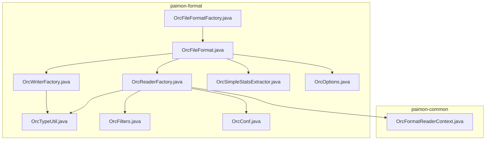
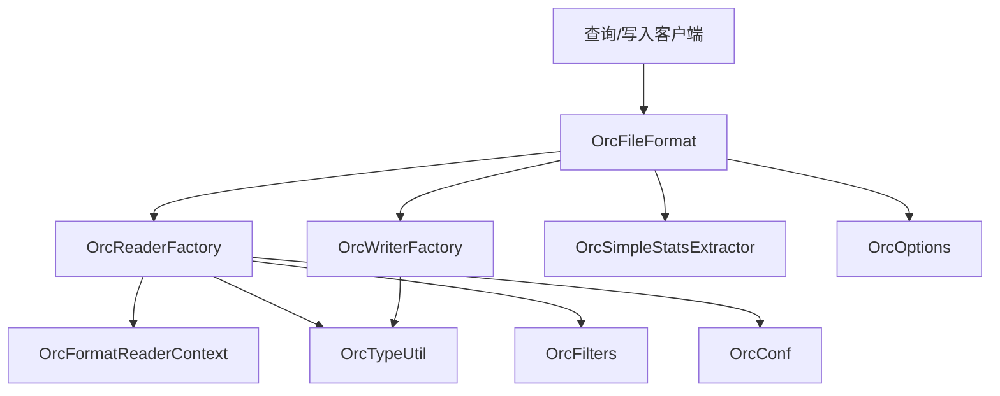
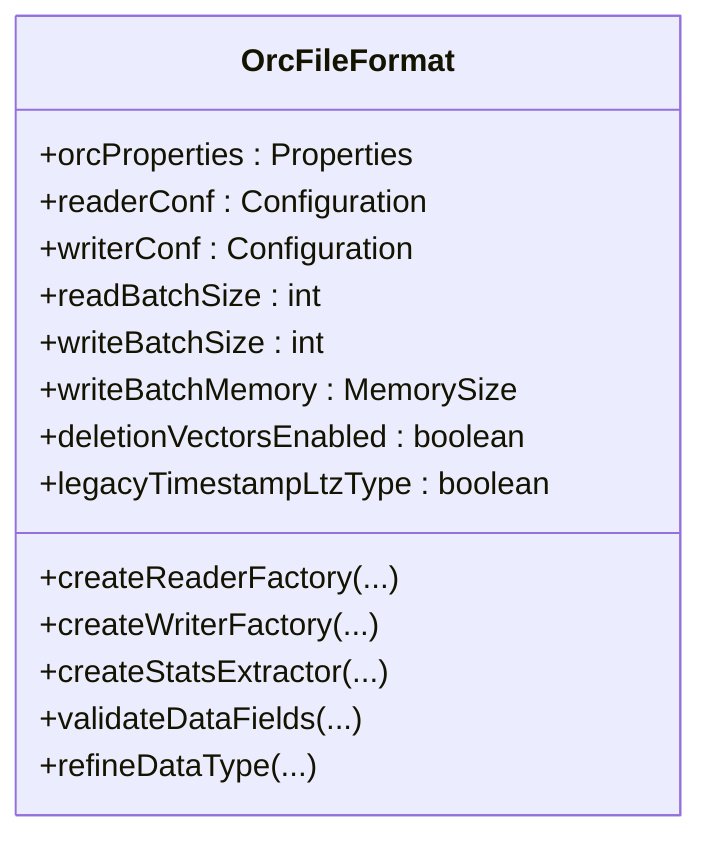
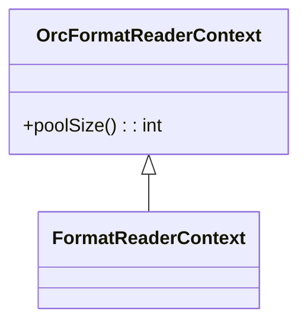
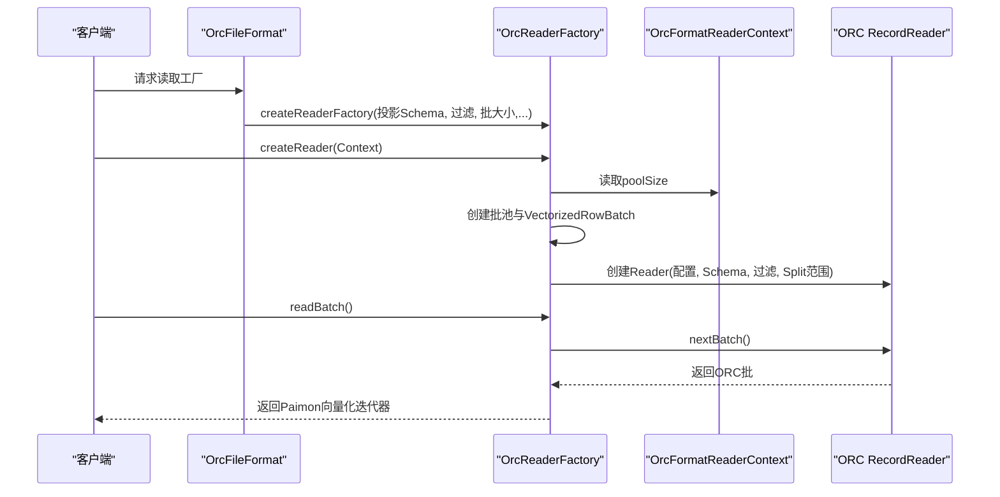
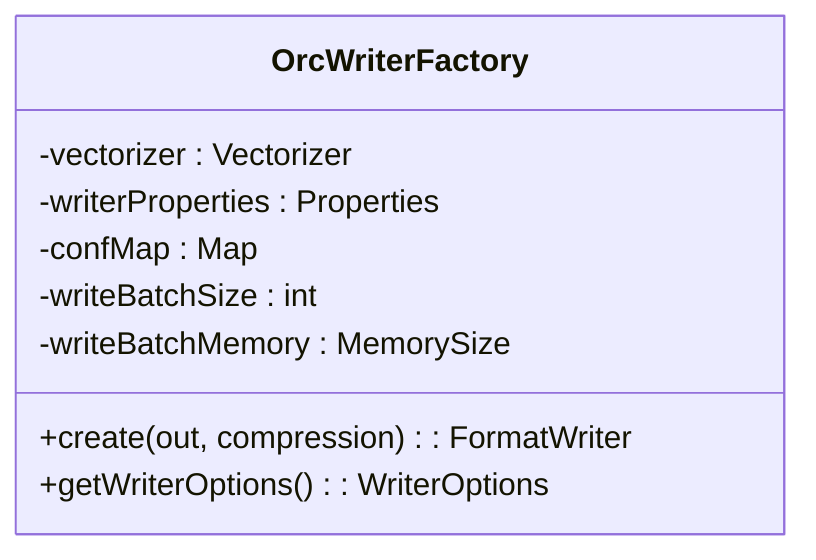
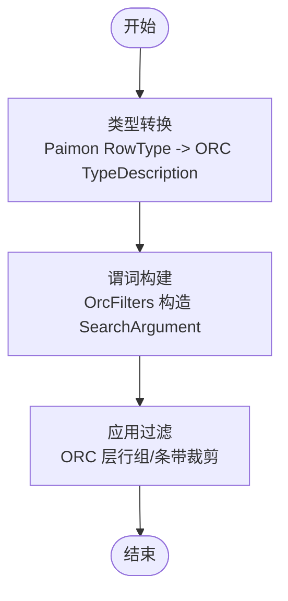
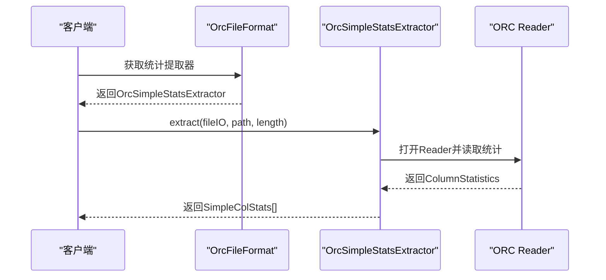
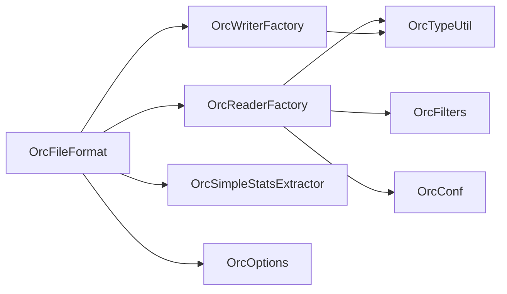

# ORC优化列式存储格式

<cite>
**本文引用的文件**   
- [OrcFileFormat.java](file://paimon-format/src/main/java/org/apache/paimon/format/orc/OrcFileFormat.java)
- [OrcFileFormatFactory.java](file://paimon-format/src/main/java/org/apache/paimon/format/orc/OrcFileFormatFactory.java)
- [OrcReaderFactory.java](file://paimon-format/src/main/java/org/apache/paimon/format/orc/OrcReaderFactory.java)
- [OrcWriterFactory.java](file://paimon-format/src/main/java/org/apache/paimon/format/orc/OrcWriterFactory.java)
- [OrcFormatReaderContext.java](file://paimon-common/src/main/java/org/apache/paimon/format/OrcFormatReaderContext.java)
- [OrcOptions.java](file://paimon-format/src/main/java/org/apache/paimon/format/OrcOptions.java)
- [OrcTypeUtil.java](file://paimon-format/src/main/java/org/apache/paimon/format/orc/OrcTypeUtil.java)
- [OrcFilters.java](file://paimon-format/src/main/java/org/apache/paimon/format/orc/filter/OrcFilters.java)
- [OrcSimpleStatsExtractor.java](file://paimon-format/src/main/java/org/apache/paimon/format/orc/filter/OrcSimpleStatsExtractor.java)
- [OrcConf.java](file://paimon-format/src/main/java/org/apache/orc/OrcConf.java)
- [FileFormatTest.java](file://paimon-core/src/test/java/org/apache/paimon/FileFormatTest.java)
- [OrcFileFormatTest.java](file://paimon-format/src/test/java/org/apache/paimon/format/orc/OrcFileFormatTest.java)
- [OrcZstdTest.java](file://paimon-format/src/test/java/org/apache/paimon/format/orc/writer/OrcZstdTest.java)
</cite>

## 目录
1. [简介](#简介)
2. [项目结构](#项目结构)
3. [核心组件](#核心组件)
4. [架构总览](#架构总览)
5. [详细组件分析](#详细组件分析)
6. [依赖分析](#依赖分析)
7. [性能考量](#性能考量)
8. [故障排查指南](#故障排查指南)
9. [结论](#结论)
10. [附录](#附录)

## 简介
本文件系统性梳理Paimon中对Apache ORC（Optimized Row Columnar）列式存储格式的实现与使用，重点覆盖以下方面：
- ORC格式的优势：内置行组索引、布隆过滤器、高效压缩算法、面向大规模数据分析的存储布局
- Paimon中ORC实现架构：OrcFileFormat的上下文与配置、OrcFormatReaderContext的读取上下文、OrcWriterFactory的写入工厂模式、OrcBatchData的批量数据处理机制（在Paimon中通过OrcReaderFactory与批池化实现）
- 内置索引系统：行组索引、布隆过滤器、统计信息收集
- 与Hive生态的集成：配置项映射、类型转换、时间戳兼容策略
- 在Paimon中的配置参数、性能调优建议与最佳实践

## 项目结构
围绕ORC格式的关键模块分布于paimon-format与paimon-common两个子模块：
- paimon-format：包含ORC文件格式的具体实现，如OrcFileFormat、OrcReaderFactory、OrcWriterFactory、OrcTypeUtil、OrcFilters等
- paimon-common：包含通用的读取上下文OrcFormatReaderContext，供OrcReaderFactory使用

**图表来源**
- [OrcFileFormat.java:62-88](file://paimon-format/src/main/java/org/apache/paimon/format/orc/OrcFileFormat.java#L62-L88)
- [OrcFileFormatFactory.java:24-36](file://paimon-format/src/main/java/org/apache/paimon/format/orc/OrcFileFormatFactory.java#L24-L36)
- [OrcReaderFactory.java:64-93](file://paimon-format/src/main/java/org/apache/paimon/format/orc/OrcReaderFactory.java#L64-L93)
- [OrcWriterFactory.java:53-98](file://paimon-format/src/main/java/org/apache/paimon/format/orc/OrcWriterFactory.java#L53-L98)
- [OrcFormatReaderContext.java:25-37](file://paimon-common/src/main/java/org/apache/paimon/format/OrcFormatReaderContext.java#L25-L37)
- [OrcTypeUtil.java:36-47](file://paimon-format/src/main/java/org/apache/paimon/format/orc/OrcTypeUtil.java#L36-L47)
- [OrcFilters.java:32-42](file://paimon-format/src/main/java/org/apache/paimon/format/orc/filter/OrcFilters.java#L32-L42)
- [OrcSimpleStatsExtractor.java:56-75](file://paimon-format/src/main/java/org/apache/paimon/format/orc/filter/OrcSimpleStatsExtractor.java#L56-L75)
- [OrcConf.java:39-66](file://paimon-format/src/main/java/org/apache/orc/OrcConf.java#L39-L66)
- [OrcOptions.java:26-51](file://paimon-format/src/main/java/org/apache/paimon/format/OrcOptions.java#L26-L51)

**章节来源**
- [OrcFileFormat.java:62-88](file://paimon-format/src/main/java/org/apache/paimon/format/orc/OrcFileFormat.java#L62-L88)
- [OrcFileFormatFactory.java:24-36](file://paimon-format/src/main/java/org/apache/paimon/format/orc/OrcFileFormatFactory.java#L24-L36)
- [OrcReaderFactory.java:64-93](file://paimon-format/src/main/java/org/apache/paimon/format/orc/OrcReaderFactory.java#L64-L93)
- [OrcWriterFactory.java:53-98](file://paimon-format/src/main/java/org/apache/paimon/format/orc/OrcWriterFactory.java#L53-L98)
- [OrcFormatReaderContext.java:25-37](file://paimon-common/src/main/java/org/apache/paimon/format/OrcFormatReaderContext.java#L25-L37)
- [OrcTypeUtil.java:36-47](file://paimon-format/src/main/java/org/apache/paimon/format/orc/OrcTypeUtil.java#L36-L47)
- [OrcFilters.java:32-42](file://paimon-format/src/main/java/org/apache/paimon/format/orc/filter/OrcFilters.java#L32-L42)
- [OrcSimpleStatsExtractor.java:56-75](file://paimon-format/src/main/java/org/apache/paimon/format/orc/filter/OrcSimpleStatsExtractor.java#L56-L75)
- [OrcConf.java:39-66](file://paimon-format/src/main/java/org/apache/orc/OrcConf.java#L39-L66)
- [OrcOptions.java:26-51](file://paimon-format/src/main/java/org/apache/paimon/format/OrcOptions.java#L26-L51)

## 核心组件
- OrcFileFormat：ORC文件格式的统一入口，负责读写工厂创建、属性配置、类型精炼、统计提取与过滤下推
- OrcFileFormatFactory：ORC格式工厂，标识符为“orc”，创建OrcFileFormat实例
- OrcFormatReaderContext：读取上下文，封装FileIO、路径、文件大小及线程池大小
- OrcReaderFactory：向量化读取工厂，基于ORC RecordReader与批池化实现高效批量读取
- OrcWriterFactory：写入工厂，基于Vectorizer将InternalRow转为VectorizedRowBatch并写入ORC
- OrcTypeUtil：Paimon类型到ORC类型的转换工具
- OrcFilters：谓词构建与下推工具，支持等值、比较、空值、IN、逻辑组合等
- OrcSimpleStatsExtractor：基于ORC统计信息的简单列统计提取器
- OrcOptions：ORC相关配置项定义（如字典编码、时间戳时区兼容）
- OrcConf：ORC配置枚举（如条带大小、索引stride、压缩级别等）

**章节来源**
- [OrcFileFormat.java:62-156](file://paimon-format/src/main/java/org/apache/paimon/format/orc/OrcFileFormat.java#L62-L156)
- [OrcFileFormatFactory.java:24-36](file://paimon-format/src/main/java/org/apache/paimon/format/orc/OrcFileFormatFactory.java#L24-L36)
- [OrcFormatReaderContext.java:25-37](file://paimon-common/src/main/java/org/apache/paimon/format/OrcFormatReaderContext.java#L25-L37)
- [OrcReaderFactory.java:64-119](file://paimon-format/src/main/java/org/apache/paimon/format/orc/OrcReaderFactory.java#L64-L119)
- [OrcWriterFactory.java:53-129](file://paimon-format/src/main/java/org/apache/paimon/format/orc/OrcWriterFactory.java#L53-L129)
- [OrcTypeUtil.java:36-149](file://paimon-format/src/main/java/org/apache/paimon/format/orc/OrcTypeUtil.java#L36-L149)
- [OrcFilters.java:32-336](file://paimon-format/src/main/java/org/apache/paimon/format/orc/filter/OrcFilters.java#L32-L336)
- [OrcSimpleStatsExtractor.java:56-94](file://paimon-format/src/main/java/org/apache/paimon/format/orc/filter/OrcSimpleStatsExtractor.java#L56-L94)
- [OrcOptions.java:26-51](file://paimon-format/src/main/java/org/apache/paimon/format/OrcOptions.java#L26-L51)
- [OrcConf.java:39-66](file://paimon-format/src/main/java/org/apache/orc/OrcConf.java#L39-L66)

## 架构总览
下图展示Paimon中ORC格式的高层架构与交互关系：

**图表来源**
- [OrcFileFormat.java:62-156](file://paimon-format/src/main/java/org/apache/paimon/format/orc/OrcFileFormat.java#L62-L156)
- [OrcReaderFactory.java:64-119](file://paimon-format/src/main/java/org/apache/paimon/format/orc/OrcReaderFactory.java#L64-L119)
- [OrcWriterFactory.java:53-129](file://paimon-format/src/main/java/org/apache/paimon/format/orc/OrcWriterFactory.java#L53-L129)
- [OrcFormatReaderContext.java:25-37](file://paimon-common/src/main/java/org/apache/paimon/format/OrcFormatReaderContext.java#L25-L37)
- [OrcTypeUtil.java:36-47](file://paimon-format/src/main/java/org/apache/paimon/format/orc/OrcTypeUtil.java#L36-L47)
- [OrcFilters.java:32-42](file://paimon-format/src/main/java/org/apache/paimon/format/orc/filter/OrcFilters.java#L32-L42)
- [OrcSimpleStatsExtractor.java:56-75](file://paimon-format/src/main/java/org/apache/paimon/format/orc/filter/OrcSimpleStatsExtractor.java#L56-L75)
- [OrcConf.java:39-66](file://paimon-format/src/main/java/org/apache/orc/OrcConf.java#L39-L66)
- [OrcOptions.java:26-51](file://paimon-format/src/main/java/org/apache/paimon/format/OrcOptions.java#L26-L51)

## 详细组件分析

### OrcFileFormat：格式适配与配置
- 职责
  - 统一管理ORC属性（从Options解析前缀配置，设置默认zstd级别、条带大小等）
  - 创建读取工厂（传入投影Schema、过滤条件、批大小、删除向量开关、时间戳兼容标志）
  - 创建写入工厂（基于Vectorizer与ORC Schema）
  - 类型精炼（将BINARY/VARBINARY统一为BYTES；MAP/MULTISET归一化；递归ROW类型）
  - 统计提取器（基于ORC统计信息）
- 关键点
  - 读/写Hadoop Configuration分别承载读取与写入配置
  - 删除向量与时间戳兼容标志来自全局Options
  - 默认zstd压缩级别由FormatContext注入

**图表来源**
- [OrcFileFormat.java:62-156](file://paimon-format/src/main/java/org/apache/paimon/format/orc/OrcFileFormat.java#L62-L156)

**章节来源**
- [OrcFileFormat.java:62-156](file://paimon-format/src/main/java/org/apache/paimon/format/orc/OrcFileFormat.java#L62-L156)

### OrcFormatReaderContext：读取上下文
- 职责
  - 承载FileIO、文件路径、文件大小
  - 暴露线程池大小，用于批池化复用
- 与OrcReaderFactory协作
  - 读取器根据上下文决定批池大小
  - 将FileIO传递给底层ORC Reader以适配Paimon文件系统抽象

**图表来源**
- [OrcFormatReaderContext.java:25-37](file://paimon-common/src/main/java/org/apache/paimon/format/OrcFormatReaderContext.java#L25-L37)

**章节来源**
- [OrcFormatReaderContext.java:25-37](file://paimon-common/src/main/java/org/apache/paimon/format/OrcFormatReaderContext.java#L25-L37)

### OrcReaderFactory：向量化读取与批池化
- 职责
  - 基于ORC RecordReader按批读取，返回向量化迭代器
  - 通过批池（Pool）复用VectorizedRowBatch与VectorizedColumnBatch，降低GC压力
  - 支持过滤下推（SearchArgument），在ORC层进行行组/条带裁剪
  - 支持删除向量与位图索引协同（当未启用删除向量时才允许行组过滤）
- 关键流程
  - 创建ORC Reader（支持自定义FileIO与Selection）
  - 计算Split对应的条带范围，仅读取必要范围
  - 构建SearchArgument并应用过滤
  - 读取批并转换为Paimon的VectorizedColumnBatch

**图表来源**
- [OrcReaderFactory.java:97-119](file://paimon-format/src/main/java/org/apache/paimon/format/orc/OrcReaderFactory.java#L97-L119)
- [OrcReaderFactory.java:267-322](file://paimon-format/src/main/java/org/apache/paimon/format/orc/OrcReaderFactory.java#L267-L322)
- [OrcReaderFactory.java:355-375](file://paimon-format/src/main/java/org/apache/paimon/format/orc/OrcReaderFactory.java#L355-L375)

**章节来源**
- [OrcReaderFactory.java:64-377](file://paimon-format/src/main/java/org/apache/paimon/format/orc/OrcReaderFactory.java#L64-L377)

### OrcWriterFactory：写入工厂与批写入
- 职责
  - 基于Vectorizer将InternalRow转换为VectorizedRowBatch
  - 配置WriterOptions（含Schema、压缩、属性）
  - 通过OrcBulkWriter执行批量写入
- 关键点
  - 若未显式设置压缩，则根据外部参数选择CompressionKind
  - 使用ThreadLocalClassLoaderConfiguration避免类加载器泄漏（注释说明）

**图表来源**
- [OrcWriterFactory.java:53-145](file://paimon-format/src/main/java/org/apache/paimon/format/orc/OrcWriterFactory.java#L53-L145)

**章节来源**
- [OrcWriterFactory.java:53-145](file://paimon-format/src/main/java/org/apache/paimon/format/orc/OrcWriterFactory.java#L53-L145)

### 类型系统与过滤下推
- 类型转换
  - OrcTypeUtil将Paimon RowType转换为ORC TypeDescription，保留字段ID元信息
  - 支持CHAR/VARCHAR/DECIMAL/TIMESTAMP/TIMESTAMP_INSTANT/ARRAY/MAP/ROW等
- 过滤下推
  - OrcFilters提供谓词构造（Equals/LessThan/LessThanEquals/IsNull/Not/Or/And/In）
  - 通过SearchArgument在ORC层进行早期过滤，减少上层处理

**图表来源**
- [OrcTypeUtil.java:40-149](file://paimon-format/src/main/java/org/apache/paimon/format/orc/OrcTypeUtil.java#L40-L149)
- [OrcFilters.java:134-335](file://paimon-format/src/main/java/org/apache/paimon/format/orc/filter/OrcFilters.java#L134-L335)

**章节来源**
- [OrcTypeUtil.java:36-149](file://paimon-format/src/main/java/org/apache/paimon/format/orc/OrcTypeUtil.java#L36-L149)
- [OrcFilters.java:32-336](file://paimon-format/src/main/java/org/apache/paimon/format/orc/filter/OrcFilters.java#L32-L336)

### 统计信息与索引
- 行组索引与布隆过滤器
  - 通过OrcConf控制是否创建索引与索引stride
  - ORC Writer在写入时生成行组索引，便于随机访问与谓词下推
- 统计提取
  - OrcSimpleStatsExtractor读取ORC统计信息，生成列级统计（最小值、最大值、空值计数等）
  - 与时间戳兼容标志协同，确保统计一致性

**图表来源**
- [OrcSimpleStatsExtractor.java:77-94](file://paimon-format/src/main/java/org/apache/paimon/format/orc/filter/OrcSimpleStatsExtractor.java#L77-L94)
- [OrcConf.java:57-66](file://paimon-format/src/main/java/org/apache/orc/OrcConf.java#L57-L66)

**章节来源**
- [OrcSimpleStatsExtractor.java:56-94](file://paimon-format/src/main/java/org/apache/paimon/format/orc/filter/OrcSimpleStatsExtractor.java#L56-L94)
- [OrcConf.java:39-66](file://paimon-format/src/main/java/org/apache/orc/OrcConf.java#L39-L66)

## 依赖分析
- 组件耦合
  - OrcFileFormat是核心协调者，依赖OrcReaderFactory、OrcWriterFactory、OrcTypeUtil、OrcFilters、OrcSimpleStatsExtractor、OrcOptions
  - OrcReaderFactory依赖OrcFormatReaderContext、OrcTypeUtil、OrcFilters、OrcConf
  - OrcWriterFactory依赖OrcTypeUtil与ORC Writer实现
- 外部依赖
  - Apache ORC（Reader/Writer/RecordReader/TypeDescription/Configuration等）
  - Hadoop Configuration与SearchArgument
- 循环依赖
  - 未发现循环依赖；各模块职责清晰，接口边界明确

**图表来源**
- [OrcFileFormat.java:62-156](file://paimon-format/src/main/java/org/apache/paimon/format/orc/OrcFileFormat.java#L62-L156)
- [OrcReaderFactory.java:64-119](file://paimon-format/src/main/java/org/apache/paimon/format/orc/OrcReaderFactory.java#L64-L119)
- [OrcWriterFactory.java:53-129](file://paimon-format/src/main/java/org/apache/paimon/format/orc/OrcWriterFactory.java#L53-L129)
- [OrcTypeUtil.java:36-47](file://paimon-format/src/main/java/org/apache/paimon/format/orc/OrcTypeUtil.java#L36-L47)
- [OrcFilters.java:32-42](file://paimon-format/src/main/java/org/apache/paimon/format/orc/filter/OrcFilters.java#L32-L42)
- [OrcSimpleStatsExtractor.java:56-75](file://paimon-format/src/main/java/org/apache/paimon/format/orc/filter/OrcSimpleStatsExtractor.java#L56-L75)
- [OrcConf.java:39-66](file://paimon-format/src/main/java/org/apache/orc/OrcConf.java#L39-L66)
- [OrcOptions.java:26-51](file://paimon-format/src/main/java/org/apache/paimon/format/OrcOptions.java#L26-L51)

**章节来源**
- [OrcFileFormat.java:62-156](file://paimon-format/src/main/java/org/apache/paimon/format/orc/OrcFileFormat.java#L62-L156)
- [OrcReaderFactory.java:64-119](file://paimon-format/src/main/java/org/apache/paimon/format/orc/OrcReaderFactory.java#L64-L119)
- [OrcWriterFactory.java:53-129](file://paimon-format/src/main/java/org/apache/paimon/format/orc/OrcWriterFactory.java#L53-L129)
- [OrcTypeUtil.java:36-47](file://paimon-format/src/main/java/org/apache/paimon/format/orc/OrcTypeUtil.java#L36-L47)
- [OrcFilters.java:32-42](file://paimon-format/src/main/java/org/apache/paimon/format/orc/filter/OrcFilters.java#L32-L42)
- [OrcSimpleStatsExtractor.java:56-75](file://paimon-format/src/main/java/org/apache/paimon/format/orc/filter/OrcSimpleStatsExtractor.java#L56-L75)
- [OrcConf.java:39-66](file://paimon-format/src/main/java/org/apache/orc/OrcConf.java#L39-L66)
- [OrcOptions.java:26-51](file://paimon-format/src/main/java/org/apache/paimon/format/OrcOptions.java#L26-L51)

## 性能考量
- 批大小与内存
  - 读取批大小与写入批大小、批内存阈值直接影响吞吐与内存占用
  - 批池化可显著降低GC压力，提升连续扫描性能
- 条带与索引
  - 合理设置条带大小与行组索引stride，平衡随机访问与写入放大
  - 启用索引可提升过滤场景的性能，但会增加写入开销
- 压缩策略
  - ZSTD通常在Paimon中作为默认压缩，可通过配置项调整压缩级别
  - 不同数据类型与查询模式下，压缩比与CPU消耗需权衡
- 过滤下推
  - 利用OrcFilters将谓词下推至ORC层，减少不必要的解码与转换
- 删除向量与位图索引
  - 当启用删除向量或位图索引时，避免与行组过滤同时开启，以免影响行号正确性

[本节为通用性能指导，不直接分析具体文件]

## 故障排查指南
- 读取异常
  - 检查Split范围计算与条带边界，确认读取范围是否覆盖目标条带
  - 核对过滤条件是否与Schema匹配，避免类型不一致导致的下推失败
- 写入异常
  - 确认WriterOptions中的Schema与输入数据类型一致
  - 检查压缩参数与ORC版本兼容性
- 统计信息缺失
  - 确认ORC文件确实包含统计信息（索引创建开关）
  - 检查时间戳兼容标志是否与历史数据一致

**章节来源**
- [OrcReaderFactory.java:267-322](file://paimon-format/src/main/java/org/apache/paimon/format/orc/OrcReaderFactory.java#L267-L322)
- [OrcWriterFactory.java:100-129](file://paimon-format/src/main/java/org/apache/paimon/format/orc/OrcWriterFactory.java#L100-L129)
- [OrcSimpleStatsExtractor.java:77-94](file://paimon-format/src/main/java/org/apache/paimon/format/orc/filter/OrcSimpleStatsExtractor.java#L77-L94)

## 结论
Paimon对ORC的实现以OrcFileFormat为核心，结合OrcReaderFactory与OrcWriterFactory实现了高性能的列式读写；通过类型转换、过滤下推、批池化与统计提取，有效支撑了大规模数据分析场景。配合合理的索引与压缩策略，可在读写性能与存储成本之间取得良好平衡。

[本节为总结性内容，不直接分析具体文件]

## 附录

### 配置参数与示例
- 文件格式标识
  - 标识符：orc
  - 示例：通过选项设置文件格式为orc，并设置读取批大小与ORC属性
- ORC属性
  - 压缩：orc.compress
  - 条带大小：orc.stripe.size
  - ZSTD级别：orc.compression.zstd.level
  - 索引创建：orc.create.index
  - 行组索引stride：orc.row.index.stride
- Paimon特定选项
  - 字典编码跳过字段：orc.column.encoding.direct
  - 字典键阈值：orc.dictionary.key.threshold
  - 时间戳LTZ兼容：orc.timestamp-ltz.legacy.type

**章节来源**
- [FileFormatTest.java:112-131](file://paimon-core/src/test/java/org/apache/paimon/FileFormatTest.java#L112-L131)
- [OrcFileFormatTest.java:38-56](file://paimon-format/src/test/java/org/apache/paimon/format/orc/OrcFileFormatTest.java#L38-L56)
- [OrcZstdTest.java:59-86](file://paimon-format/src/test/java/org/apache/paimon/format/orc/writer/OrcZstdTest.java#L59-L86)
- [OrcConf.java:39-66](file://paimon-format/src/main/java/org/apache/orc/OrcConf.java#L39-L66)
- [OrcOptions.java:26-51](file://paimon-format/src/main/java/org/apache/paimon/format/OrcOptions.java#L26-L51)