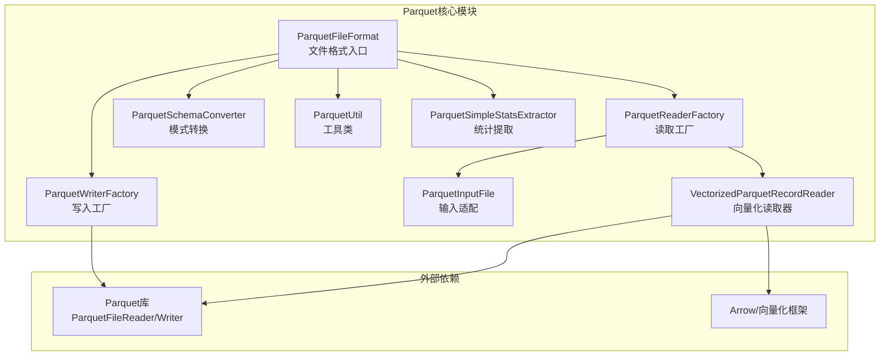
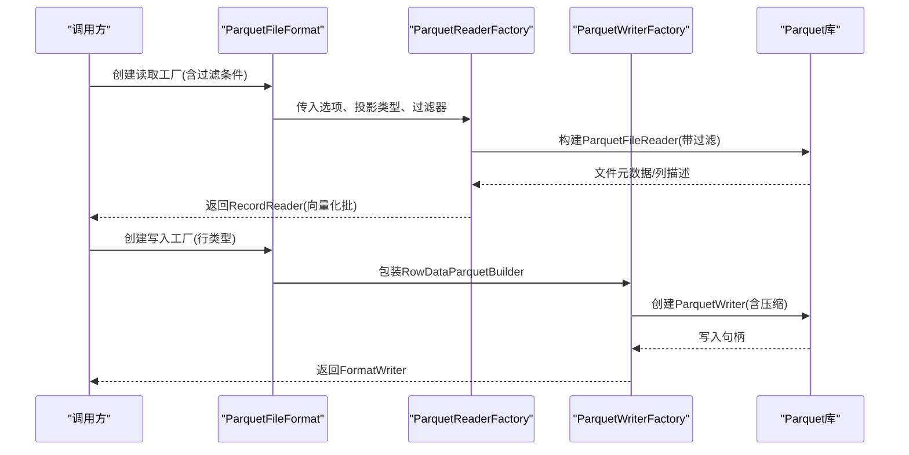
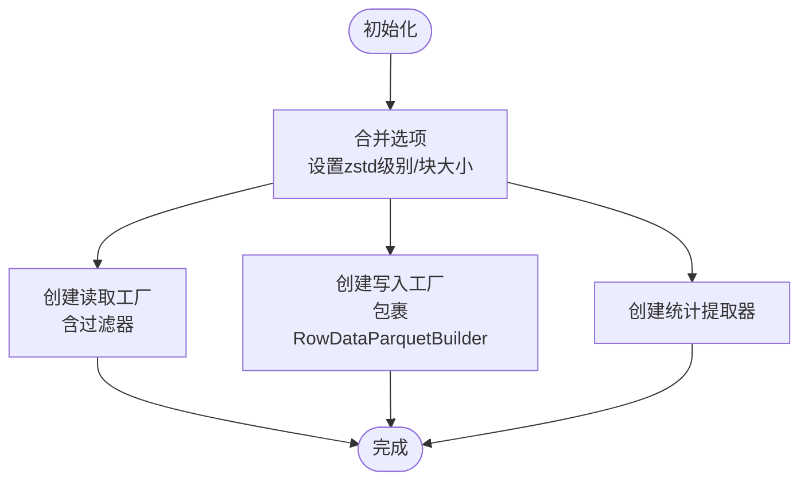
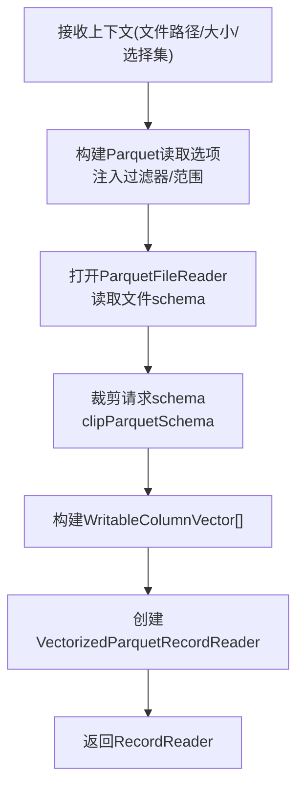
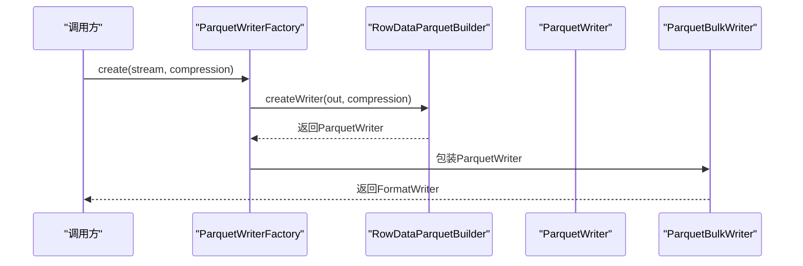
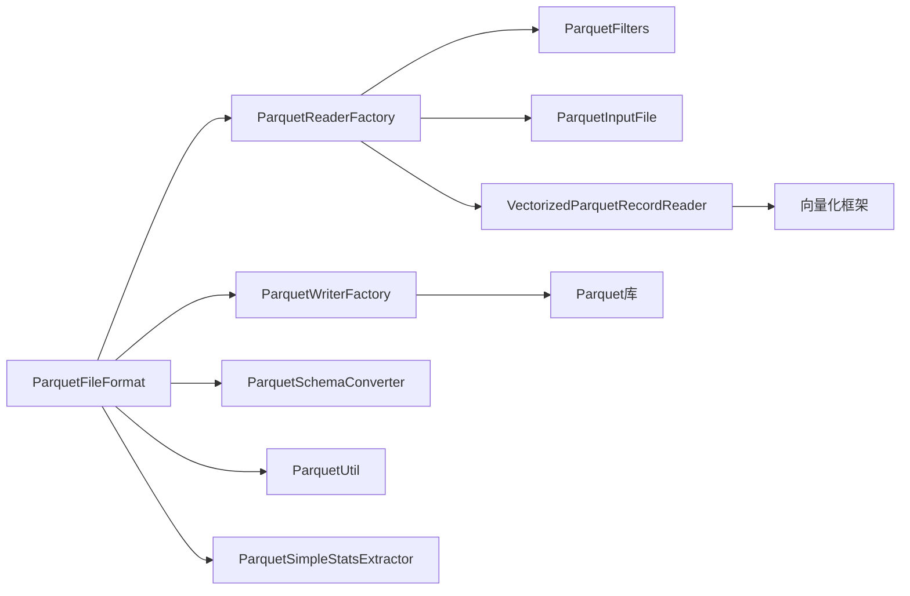

# Parquet列式存储格式

<cite>
**本文引用的文件**
- [ParquetFileFormat.java](file://paimon-format/src/main/java/org/apache/paimon/format/parquet/ParquetFileFormat.java)
- [ParquetFileFormatFactory.java](file://paimon-format/src/main/java/org/apache/paimon/format/parquet/ParquetFileFormatFactory.java)
- [ParquetReaderFactory.java](file://paimon-format/src/main/java/org/apache/paimon/format/parquet/ParquetReaderFactory.java)
- [ParquetWriterFactory.java](file://paimon-format/src/main/java/org/apache/paimon/format/parquet/ParquetWriterFactory.java)
- [ParquetSchemaConverter.java](file://paimon-format/src/main/java/org/apache/paimon/format/parquet/ParquetSchemaConverter.java)
- [ParquetUtil.java](file://paimon-format/src/main/java/org/apache/paimon/format/parquet/ParquetUtil.java)
- [ParquetSimpleStatsExtractor.java](file://paimon-format/src/main/java/org/apache/paimon/format/parquet/ParquetSimpleStatsExtractor.java)
- [ParquetInputFile.java](file://paimon-format/src/main/java/org/apache/paimon/format/parquet/ParquetInputFile.java)
- [VectorizedParquetRecordReader.java](file://paimon-format/src/main/java/org/apache/paimon/format/parquet/reader/VectorizedParquetRecordReader.java)
- [ParquetFilters.java](file://paimon-format/src/main/java/org/apache/parquet/filter2/predicate/ParquetFilters.java)
- [ParquetFileFormatFactory.java](file://paimon-format/src/test/java/org/apache/paimon/format/parquet/ParquetFileFormatFactory.java)
- [ParquetRowDataBuilderForTest.java](file://paimon-format/src/test/java/org/apache/paimon/format/parquet/reader/ParquetRowDataBuilderForTest.java)
- [ParquetReadWriteTest.java](file://paimon-format/src/test/java/org/apache/paimon/format/parquet/ParquetReadWriteTest.java)
- [ParquetFiltersTest.java](file://paimon-format/src/test/java/org/apache/paimon/format/parquet/ParquetFiltersTest.java)
- [RangeBitmapIndexPushDownBenchmark.java](file://paimon-benchmark/paimon-micro-benchmarks/src/test/java/org/apache/paimon/benchmark/bitmap/RangeBitmapIndexPushDownBenchmark.java)
</cite>

## 目录
1. [简介](#简介)
2. [项目结构](#项目结构)
3. [核心组件](#核心组件)
4. [架构总览](#架构总览)
5. [详细组件分析](#详细组件分析)
6. [依赖分析](#依赖分析)
7. [性能考量](#性能考量)
8. [故障排查指南](#故障排查指南)
9. [结论](#结论)
10. [附录](#附录)

## 简介
本文件系统性梳理Paimon中Parquet列式存储格式的实现与使用，重点覆盖以下方面：
- 基于Apache Arrow生态的列式存储定位与优势
- Parquet的元数据与嵌套类型编码策略
- Paimon对Parquet的封装：ParquetFileFormat、ParquetReaderFactory、ParquetWriterFactory
- 数据转换与写入路径：RowDataParquetBuilder
- 读取优化与谓词下推：ParquetFilters
- 压缩与块大小配置：zstd级别、Parquet块大小
- 在Paimon中的应用场景与性能优势

## 项目结构
围绕Parquet的关键模块主要位于paimon-format模块的parquet包内，并辅以测试与基准用例验证功能与性能。

图表来源
- [ParquetFileFormat.java:47-111](file://paimon-format/src/main/java/org/apache/paimon/format/parquet/ParquetFileFormat.java#L47-L111)
- [ParquetReaderFactory.java:77-148](file://paimon-format/src/main/java/org/apache/paimon/format/parquet/ParquetReaderFactory.java#L77-L148)
- [ParquetWriterFactory.java:39-79](file://paimon-format/src/main/java/org/apache/paimon/format/parquet/ParquetWriterFactory.java#L39-L79)
- [ParquetSchemaConverter.java:52-248](file://paimon-format/src/main/java/org/apache/paimon/format/parquet/ParquetSchemaConverter.java#L52-L248)
- [ParquetUtil.java:42-98](file://paimon-format/src/main/java/org/apache/paimon/format/parquet/ParquetUtil.java#L42-L98)
- [ParquetSimpleStatsExtractor.java:56-95](file://paimon-format/src/main/java/org/apache/paimon/format/parquet/ParquetSimpleStatsExtractor.java#L56-L95)
- [ParquetInputFile.java:29-64](file://paimon-format/src/main/java/org/apache/paimon/format/parquet/ParquetInputFile.java#L29-L64)
- [VectorizedParquetRecordReader.java:51-117](file://paimon-format/src/main/java/org/apache/paimon/format/parquet/reader/VectorizedParquetRecordReader.java#L51-L117)

章节来源
- [ParquetFileFormat.java:47-111](file://paimon-format/src/main/java/org/apache/paimon/format/parquet/ParquetFileFormat.java#L47-L111)
- [ParquetReaderFactory.java:77-148](file://paimon-format/src/main/java/org/apache/paimon/format/parquet/ParquetReaderFactory.java#L77-L148)
- [ParquetWriterFactory.java:39-79](file://paimon-format/src/main/java/org/apache/paimon/format/parquet/ParquetWriterFactory.java#L39-L79)
- [ParquetSchemaConverter.java:52-248](file://paimon-format/src/main/java/org/apache/paimon/format/parquet/ParquetSchemaConverter.java#L52-L248)
- [ParquetUtil.java:42-98](file://paimon-format/src/main/java/org/apache/paimon/format/parquet/ParquetUtil.java#L42-L98)
- [ParquetSimpleStatsExtractor.java:56-95](file://paimon-format/src/main/java/org/apache/paimon/format/parquet/ParquetSimpleStatsExtractor.java#L56-L95)
- [ParquetInputFile.java:29-64](file://paimon-format/src/main/java/org/apache/paimon/format/parquet/ParquetInputFile.java#L29-L64)
- [VectorizedParquetRecordReader.java:51-117](file://paimon-format/src/main/java/org/apache/paimon/format/parquet/reader/VectorizedParquetRecordReader.java#L51-L117)

## 核心组件
- ParquetFileFormat：Paimon文件格式入口，负责读写工厂创建、配置合并（zstd级别、块大小）、统计提取器装配等。
- ParquetReaderFactory：读取工厂，构建ParquetFileReader并进行请求模式裁剪、向量化批量读取、谓词下推。
- ParquetWriterFactory：写入工厂，基于RowDataParquetBuilder构造ParquetWriter，支持变体推断与直接写入。
- ParquetSchemaConverter：Paimon类型到Parquet类型的双向转换，处理数组、映射、时间戳、十进制等复杂类型。
- ParquetUtil：读取元数据、统计信息提取、读取选项构建。
- ParquetSimpleStatsExtractor：从Parquet统计信息中提取字段级统计，用于查询优化。
- ParquetInputFile：将Paimon FileIO适配为Parquet InputFile。
- VectorizedParquetRecordReader：向量化读取器，按批加载、组装列向量，支持缺失列与版本兼容。

章节来源
- [ParquetFileFormat.java:47-111](file://paimon-format/src/main/java/org/apache/paimon/format/parquet/ParquetFileFormat.java#L47-L111)
- [ParquetReaderFactory.java:77-148](file://paimon-format/src/main/java/org/apache/paimon/format/parquet/ParquetReaderFactory.java#L77-L148)
- [ParquetWriterFactory.java:39-79](file://paimon-format/src/main/java/org/apache/paimon/format/parquet/ParquetWriterFactory.java#L39-L79)
- [ParquetSchemaConverter.java:52-248](file://paimon-format/src/main/java/org/apache/paimon/format/parquet/ParquetSchemaConverter.java#L52-L248)
- [ParquetUtil.java:42-98](file://paimon-format/src/main/java/org/apache/paimon/format/parquet/ParquetUtil.java#L42-L98)
- [ParquetSimpleStatsExtractor.java:56-95](file://paimon-format/src/main/java/org/apache/paimon/format/parquet/ParquetSimpleStatsExtractor.java#L56-L95)
- [ParquetInputFile.java:29-64](file://paimon-format/src/main/java/org/apache/paimon/format/parquet/ParquetInputFile.java#L29-L64)
- [VectorizedParquetRecordReader.java:51-117](file://paimon-format/src/main/java/org/apache/paimon/format/parquet/reader/VectorizedParquetRecordReader.java#L51-L117)

## 架构总览
下图展示Paimon如何通过ParquetFileFormat协调读写流程，并与Parquet库交互：

图表来源
- [ParquetFileFormat.java:66-82](file://paimon-format/src/main/java/org/apache/paimon/format/parquet/ParquetFileFormat.java#L66-L82)
- [ParquetReaderFactory.java:112-148](file://paimon-format/src/main/java/org/apache/paimon/format/parquet/ParquetReaderFactory.java#L112-L148)
- [ParquetWriterFactory.java:53-62](file://paimon-format/src/main/java/org/apache/paimon/format/parquet/ParquetWriterFactory.java#L53-L62)

## 详细组件分析

### ParquetFileFormat：文件格式入口与配置
- 责任边界
  - 合并Parquet选项（zstd压缩级别、块大小）
  - 创建读取工厂（携带过滤器）
  - 创建写入工厂（包裹RowDataParquetBuilder）
  - 提供统计提取器（SimpleStatsExtractor）
- 关键点
  - zstd级别未显式配置时，回退到FormatContext提供的zstd级别
  - 块大小通过ParquetOutputFormat.BLOCK_SIZE设置
  - 校验数据字段schema合法性

图表来源
- [ParquetFileFormat.java:95-110](file://paimon-format/src/main/java/org/apache/paimon/format/parquet/ParquetFileFormat.java#L95-L110)
- [ParquetFileFormat.java:66-82](file://paimon-format/src/main/java/org/apache/paimon/format/parquet/ParquetFileFormat.java#L66-L82)

章节来源
- [ParquetFileFormat.java:47-111](file://paimon-format/src/main/java/org/apache/paimon/format/parquet/ParquetFileFormat.java#L47-L111)

### ParquetReaderFactory：读取优化与谓词下推
- 责任边界
  - 构建Parquet读取选项（包含过滤器）
  - 请求模式裁剪（clipParquetSchema）：仅读取所需字段，支持数组/映射/行类型裁剪
  - 变体类型裁剪：针对Paimon变体的shredding schema，按访问路径裁剪typed_value子字段
  - 向量化批量读取：创建WritableColumnVector并驱动VectorizedParquetRecordReader
- 性能特性
  - 缓存RequestedSchema，避免重复计算
  - 支持缺失字段填充为null
  - 过滤器通过ParquetFilters转换后注入ParquetFileReader

图表来源
- [ParquetReaderFactory.java:112-148](file://paimon-format/src/main/java/org/apache/paimon/format/parquet/ParquetReaderFactory.java#L112-L148)
- [ParquetReaderFactory.java:150-165](file://paimon-format/src/main/java/org/apache/paimon/format/parquet/ParquetReaderFactory.java#L150-L165)
- [ParquetReaderFactory.java:167-259](file://paimon-format/src/main/java/org/apache/paimon/format/parquet/ParquetReaderFactory.java#L167-L259)
- [ParquetReaderFactory.java:261-311](file://paimon-format/src/main/java/org/apache/paimon/format/parquet/ParquetReaderFactory.java#L261-L311)

章节来源
- [ParquetReaderFactory.java:77-347](file://paimon-format/src/main/java/org/apache/paimon/format/parquet/ParquetReaderFactory.java#L77-L347)

### ParquetWriterFactory：写入流程与变体推断
- 责任边界
  - 基于RowDataParquetBuilder创建ParquetWriter
  - 支持压缩参数（NONE/null）
  - 变体推断：根据推断schema创建带shredding schema的写入器
- 关键点
  - ParquetBulkWriter包装底层ParquetWriter，提供批量写能力
  - 支持直接写入（SupportsDirectWrite）与流写入两种方式

图表来源
- [ParquetWriterFactory.java:53-62](file://paimon-format/src/main/java/org/apache/paimon/format/parquet/ParquetWriterFactory.java#L53-L62)
- [ParquetWriterFactory.java:64-78](file://paimon-format/src/main/java/org/apache/paimon/format/parquet/ParquetWriterFactory.java#L64-L78)

章节来源
- [ParquetWriterFactory.java:39-79](file://paimon-format/src/main/java/org/apache/paimon/format/parquet/ParquetWriterFactory.java#L39-L79)

### RowDataParquetBuilder：数据转换与写入
- 作用
  - 将Paimon InternalRow转换为Parquet记录
  - 配合ParquetSchemaConverter生成Parquet MessageType
- 测试用例
  - 提供ParquetRowDataBuilderForTest演示自定义schema的写入流程

章节来源
- [ParquetRowDataBuilderForTest.java:35-82](file://paimon-format/src/test/java/org/apache/paimon/format/parquet/reader/ParquetRowDataBuilderForTest.java#L35-L82)

### ParquetSchemaConverter：类型映射与嵌套编码
- 功能
  - Paimon RowType → Parquet MessageType
  - 处理数组（LIST）、映射（MAP）、行类型（ROW）、变体（VARIANT）、十进制、时间戳等
  - 反向转换：Parquet Type → Paimon Field/RowType
- 关键点
  - 数组/映射采用Parquet标准的LIST/MAP表示
  - 时间戳精度映射到INT64/MILLIS/MICROS或INT96
  - 十进制根据精度选择INT32/INT64/FIXED_LEN_BYTE_ARRAY

章节来源
- [ParquetSchemaConverter.java:61-248](file://paimon-format/src/main/java/org/apache/paimon/format/parquet/ParquetSchemaConverter.java#L61-L248)
- [ParquetSchemaConverter.java:286-415](file://paimon-format/src/main/java/org/apache/paimon/format/parquet/ParquetSchemaConverter.java#L286-L415)

### ParquetUtil / ParquetSimpleStatsExtractor：统计与元数据
- ParquetUtil
  - 读取Parquet元数据、统计信息聚合
  - 构建ParquetReadOptions
- ParquetSimpleStatsExtractor
  - 从Parquet统计信息中提取字段最小值/最大值/空值计数
  - 对十进制、时间戳等类型进行类型化转换

章节来源
- [ParquetUtil.java:42-98](file://paimon-format/src/main/java/org/apache/paimon/format/parquet/ParquetUtil.java#L42-L98)
- [ParquetSimpleStatsExtractor.java:56-259](file://paimon-format/src/main/java/org/apache/paimon/format/parquet/ParquetSimpleStatsExtractor.java#L56-L259)

### VectorizedParquetRecordReader：向量化读取
- 功能
  - 按批读取Parquet行组，组装列向量
  - 处理缺失列、版本兼容（writerVersion）
  - 逐批输出FileRecordIterator
- 关键流程
  - 初始化列向量与ParquetColumnVector树
  - 每次nextBatch读取页面，组装可迭代的列向量批次

章节来源
- [VectorizedParquetRecordReader.java:51-280](file://paimon-format/src/main/java/org/apache/paimon/format/parquet/reader/VectorizedParquetRecordReader.java#L51-L280)

### 谓词下推：ParquetFilters
- 功能
  - 将Paimon谓词转换为Parquet FilterCompat.Filter
  - 支持and组合、不支持的谓词降级为NOOP
- 使用场景
  - 在ParquetReaderFactory中注入过滤器，减少I/O与解析开销

章节来源
- [ParquetFilters.java:62-85](file://paimon-format/src/main/java/org/apache/parquet/filter2/predicate/ParquetFilters.java#L62-L85)

## 依赖分析
- 组件耦合
  - ParquetFileFormat是中心协调者，依赖ParquetReaderFactory、ParquetWriterFactory、ParquetSchemaConverter、ParquetUtil、ParquetSimpleStatsExtractor
  - ParquetReaderFactory依赖ParquetFilters、ParquetInputFile、VectorizedParquetRecordReader
  - ParquetWriterFactory依赖RowDataParquetBuilder（内部实现）
- 外部依赖
  - Parquet库：ParquetFileReader/Writer、ParquetReadOptions、统计类型
  - Arrow/向量化框架：列向量与批量迭代

图表来源
- [ParquetFileFormat.java:47-111](file://paimon-format/src/main/java/org/apache/paimon/format/parquet/ParquetFileFormat.java#L47-L111)
- [ParquetReaderFactory.java:77-148](file://paimon-format/src/main/java/org/apache/paimon/format/parquet/ParquetReaderFactory.java#L77-L148)
- [ParquetWriterFactory.java:39-79](file://paimon-format/src/main/java/org/apache/paimon/format/parquet/ParquetWriterFactory.java#L39-L79)
- [ParquetFilters.java:62-85](file://paimon-format/src/main/java/org/apache/parquet/filter2/predicate/ParquetFilters.java#L62-L85)
- [ParquetInputFile.java:29-64](file://paimon-format/src/main/java/org/apache/paimon/format/parquet/ParquetInputFile.java#L29-L64)
- [VectorizedParquetRecordReader.java:51-117](file://paimon-format/src/main/java/org/apache/paimon/format/parquet/reader/VectorizedParquetRecordReader.java#L51-L117)

## 性能考量
- 压缩与块大小
  - zstd压缩级别：若未显式配置，自动继承FormatContext的zstd级别
  - 块大小：通过ParquetOutputFormat.BLOCK_SIZE设置，影响行组大小与随机访问性能
- 向量化读取
  - 批量读取（batchSize）降低JVM与GC压力，提升CPU缓存命中率
  - 列裁剪与缺失字段处理减少无效I/O
- 谓词下推
  - 将过滤条件提前至Parquet层，显著减少扫描数据量
- 变体推断
  - 针对JSON变体，按访问路径裁剪typed_value字段，降低存储与读取成本

章节来源
- [ParquetFileFormat.java:95-110](file://paimon-format/src/main/java/org/apache/paimon/format/parquet/ParquetFileFormat.java#L95-L110)
- [ParquetReaderFactory.java:167-311](file://paimon-format/src/main/java/org/apache/paimon/format/parquet/ParquetReaderFactory.java#L167-L311)
- [ParquetFilters.java:62-85](file://paimon-format/src/main/java/org/apache/parquet/filter2/predicate/ParquetFilters.java#L62-L85)

## 故障排查指南
- 缺失列/必需列错误
  - 当必需列在文件中缺失时会抛出异常；可检查schema evolution与字段路径
- 模式不匹配
  - 若列描述不一致（如writer版本导致的delta字节数组），将触发降级或异常
- 统计类型不匹配
  - 不同类型统计信息的期望类不一致时会抛出异常，需确认字段类型与Parquet统计类型对应关系

章节来源
- [VectorizedParquetRecordReader.java:137-162](file://paimon-format/src/main/java/org/apache/paimon/format/parquet/reader/VectorizedParquetRecordReader.java#L137-L162)
- [ParquetSimpleStatsExtractor.java:100-111](file://paimon-format/src/main/java/org/apache/paimon/format/parquet/ParquetSimpleStatsExtractor.java#L100-L111)

## 结论
Paimon对Parquet的封装形成了“格式入口 + 读写工厂 + 类型转换 + 统计与工具”的完整链路。通过向量化读取、列裁剪、谓词下推与zstd压缩配置，实现了高性能的列式存储与查询体验。配合变体推断与统计提取，进一步提升了半结构化数据的存储效率与查询优化能力。

## 附录

### 应用场景与性能优势
- 场景
  - 批处理写入与读取：利用向量化批量读取与列裁剪
  - 查询过滤：通过谓词下推减少扫描数据量
  - 统计优化：利用SimpleStatsExtractor进行分区裁剪与索引选择
- 性能优势
  - 列式压缩与编码降低I/O与内存占用
  - 向量化执行提升CPU利用率
  - 变体shredding按需裁剪，避免全量展开

章节来源
- [ParquetReadWriteTest.java:427-443](file://paimon-format/src/test/java/org/apache/paimon/format/parquet/ParquetReadWriteTest.java#L427-L443)
- [ParquetFiltersTest.java:586-605](file://paimon-format/src/test/java/org/apache/paimon/format/parquet/ParquetFiltersTest.java#L586-L605)
- [RangeBitmapIndexPushDownBenchmark.java:102-168](file://paimon-benchmark/paimon-micro-benchmarks/src/test/java/org/apache/paimon/benchmark/bitmap/RangeBitmapIndexPushDownBenchmark.java#L102-L168)