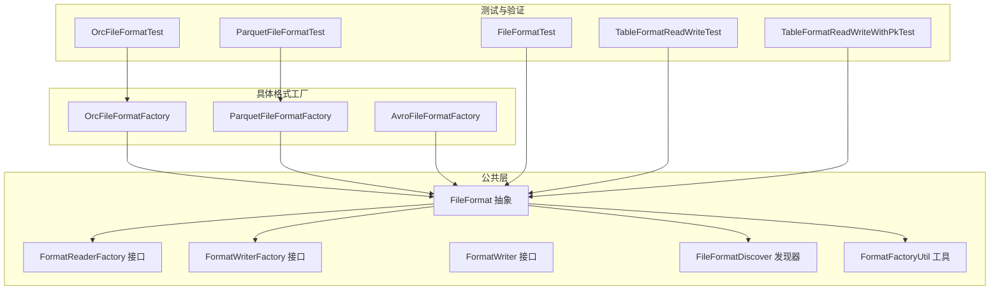
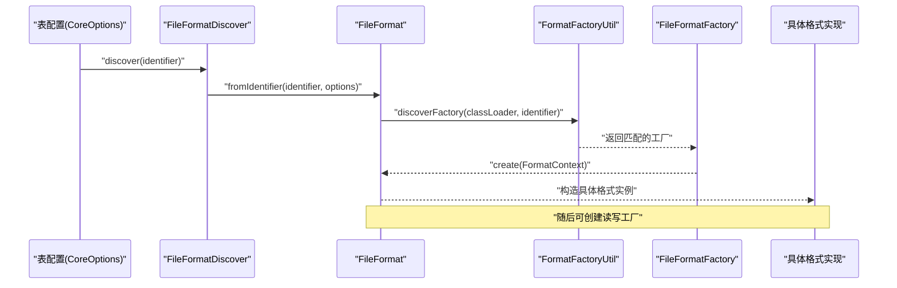
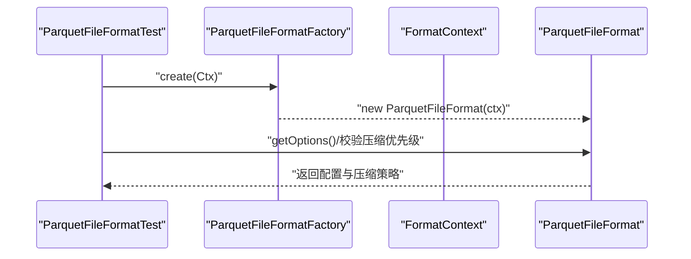
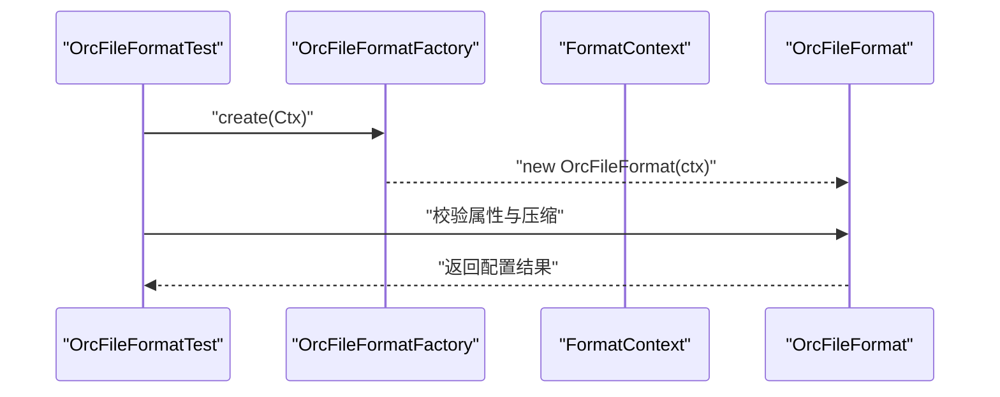
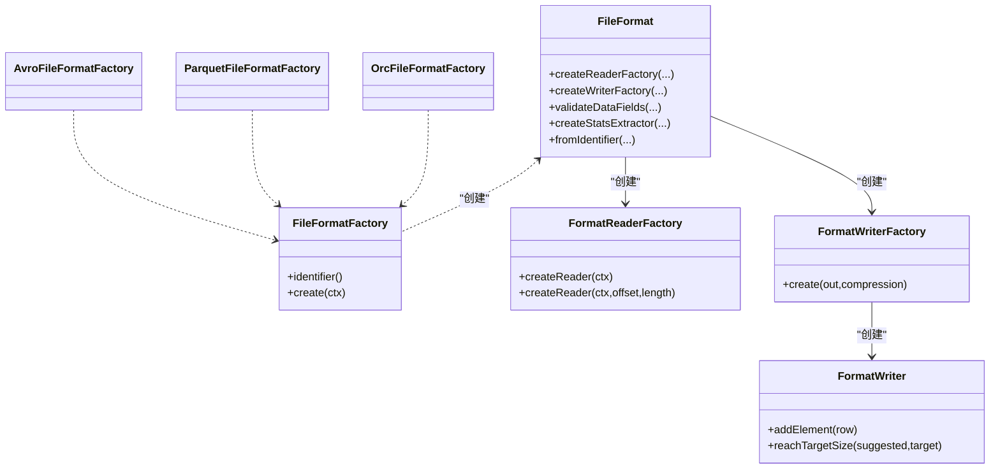
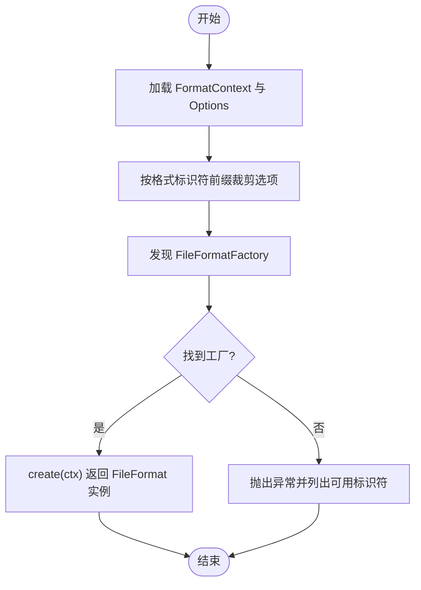

# 文件格式支持

<cite>
**本文引用的文件**
- [paimon-common/src/main/java/org/apache/paimon/format/FileFormat.java](file://paimon-common/src/main/java/org/apache/paimon/format/FileFormat.java)
- [paimon-common/src/main/java/org/apache/paimon/format/FileFormatFactory.java](file://paimon-common/src/main/java/org/apache/paimon/format/FileFormatFactory.java)
- [paimon-common/src/main/java/org/apache/paimon/format/FormatReaderFactory.java](file://paimon-common/src/main/java/org/apache/paimon/format/FormatReaderFactory.java)
- [paimon-common/src/main/java/org/apache/paimon/format/FormatWriterFactory.java](file://paimon-common/src/main/java/org/apache/paimon/format/FormatWriterFactory.java)
- [paimon-common/src/main/java/org/apache/paimon/format/FormatWriter.java](file://paimon-common/src/main/java/org/apache/paimon/format/FormatWriter.java)
- [paimon-common/src/main/java/org/apache/paimon/format/FileFormatDiscover.java](file://paimon-common/src/main/java/org/apache/paimon/format/FileFormatDiscover.java)
- [paimon-common/src/main/java/org/apache/paimon/factories/FormatFactoryUtil.java](file://paimon-common/src/main/java/org/apache/paimon/factories/FormatFactoryUtil.java)
- [paimon-format/src/main/java/org/apache/paimon/format/orc/OrcFileFormatFactory.java](file://paimon-format/src/main/java/org/apache/paimon/format/orc/OrcFileFormatFactory.java)
- [paimon-format/src/main/java/org/apache/paimon/format/parquet/ParquetFileFormatFactory.java](file://paimon-format/src/main/java/org/apache/paimon/format/parquet/ParquetFileFormatFactory.java)
- [paimon-format/src/main/java/org/apache/paimon/format/avro/AvroFileFormatFactory.java](file://paimon-format/src/main/java/org/apache/paimon/format/avro/AvroFileFormatFactory.java)
- [paimon-format/src/test/java/org/apache/paimon/format/parquet/ParquetFileFormatTest.java](file://paimon-format/src/test/java/org/apache/paimon/format/parquet/ParquetFileFormatTest.java)
- [paimon-format/src/test/java/org/apache/paimon/format/orc/OrcFileFormatTest.java](file://paimon-format/src/test/java/org/apache/paimon/format/orc/OrcFileFormatTest.java)
- [paimon-core/src/test/java/org/apache/paimon/FileFormatTest.java](file://paimon-core/src/test/java/org/apache/paimon/FileFormatTest.java)
- [paimon-core/src/test/java/org/apache/paimon/table/TableFormatReadWriteTest.java](file://paimon-core/src/test/java/org/apache/paimon/table/TableFormatReadWriteTest.java)
- [paimon-core/src/test/java/org/apache/paimon/table/TableFormatReadWriteWithPkTest.java](file://paimon-core/src/test/java/org/apache/paimon/table/TableFormatReadWriteWithPkTest.java)
- [docs/content/concepts/spec/fileformat.md](file://docs/content/concepts/spec/fileformat.md)
</cite>

## 目录
1. [引言](#引言)
2. [项目结构](#项目结构)
3. [核心组件](#核心组件)
4. [架构总览](#架构总览)
5. [详细组件分析](#详细组件分析)
6. [依赖分析](#依赖分析)
7. [性能考虑](#性能考虑)
8. [故障排查指南](#故障排查指南)
9. [结论](#结论)
10. [附录](#附录)

## 引言
本文件系统性梳理 Paimon 的文件格式支持，重点覆盖以下列式与行式格式：Parquet（列式存储）、ORC（列式存储）、Avro（行式存储）以及 Arrow 内存格式。内容涵盖各格式的读写实现、压缩选项、统计信息收集、格式工厂模式设计（FormatReaderFactory、FormatWriterFactory），并提供选择指南与性能对比建议。

## 项目结构
围绕“文件格式”主题，代码主要分布在如下模块与包中：
- 公共抽象与工厂接口：paimon-common/src/main/java/org/apache/paimon/format
- 格式发现与工厂工具：paimon-common/src/main/java/org/apache/paimon/factories
- 具体格式工厂实现：paimon-format/src/main/java/org/apache/paimon/format/{orc,parquet,avro}
- 测试用例与端到端验证：paimon-format/src/test、paimon-core/src/test
- 文档说明：docs/content/concepts/spec/fileformat.md

图表来源
- [paimon-common/src/main/java/org/apache/paimon/format/FileFormat.java:43-122](file://paimon-common/src/main/java/org/apache/paimon/format/FileFormat.java#L43-L122)
- [paimon-common/src/main/java/org/apache/paimon/format/FileFormatFactory.java:28-98](file://paimon-common/src/main/java/org/apache/paimon/format/FileFormatFactory.java#L28-L98)
- [paimon-common/src/main/java/org/apache/paimon/format/FormatReaderFactory.java:32-57](file://paimon-common/src/main/java/org/apache/paimon/format/FormatReaderFactory.java#L32-L57)
- [paimon-common/src/main/java/org/apache/paimon/format/FormatWriterFactory.java:25-37](file://paimon-common/src/main/java/org/apache/paimon/format/FormatWriterFactory.java#L25-L37)
- [paimon-common/src/main/java/org/apache/paimon/format/FileFormatDiscover.java:28-47](file://paimon-common/src/main/java/org/apache/paimon/format/FileFormatDiscover.java#L28-L47)
- [paimon-common/src/main/java/org/apache/paimon/factories/FormatFactoryUtil.java:32-66](file://paimon-common/src/main/java/org/apache/paimon/factories/FormatFactoryUtil.java#L32-L66)
- [paimon-format/src/main/java/org/apache/paimon/format/orc/OrcFileFormatFactory.java:24-37](file://paimon-format/src/main/java/org/apache/paimon/format/orc/OrcFileFormatFactory.java#L24-L37)
- [paimon-format/src/main/java/org/apache/paimon/format/parquet/ParquetFileFormatFactory.java:24-37](file://paimon-format/src/main/java/org/apache/paimon/format/parquet/ParquetFileFormatFactory.java#L24-L37)
- [paimon-format/src/main/java/org/apache/paimon/format/avro/AvroFileFormatFactory.java:25-36](file://paimon-format/src/main/java/org/apache/paimon/format/avro/AvroFileFormatFactory.java#L25-L36)

章节来源
- [paimon-common/src/main/java/org/apache/paimon/format/FileFormat.java:43-122](file://paimon-common/src/main/java/org/apache/paimon/format/FileFormat.java#L43-L122)
- [paimon-common/src/main/java/org/apache/paimon/format/FileFormatFactory.java:28-98](file://paimon-common/src/main/java/org/apache/paimon/format/FileFormatFactory.java#L28-L98)
- [paimon-common/src/main/java/org/apache/paimon/format/FileFormatDiscover.java:28-47](file://paimon-common/src/main/java/org/apache/paimon/format/FileFormatDiscover.java#L28-L47)
- [paimon-common/src/main/java/org/apache/paimon/factories/FormatFactoryUtil.java:32-66](file://paimon-common/src/main/java/org/apache/paimon/factories/FormatFactoryUtil.java#L32-L66)
- [paimon-format/src/main/java/org/apache/paimon/format/orc/OrcFileFormatFactory.java:24-37](file://paimon-format/src/main/java/org/apache/paimon/format/orc/OrcFileFormatFactory.java#L24-L37)
- [paimon-format/src/main/java/org/apache/paimon/format/parquet/ParquetFileFormatFactory.java:24-37](file://paimon-format/src/main/java/org/apache/paimon/format/parquet/ParquetFileFormatFactory.java#L24-L37)
- [paimon-format/src/main/java/org/apache/paimon/format/avro/AvroFileFormatFactory.java:25-36](file://paimon-format/src/main/java/org/apache/paimon/format/avro/AvroFileFormatFactory.java#L25-L36)

## 核心组件
- FileFormat 抽象：定义统一的读写工厂创建、字段类型校验、统计提取器创建、基于标识符的工厂发现与配置裁剪等能力。
- FileFormatFactory：格式工厂接口，提供 identifier 与 create(FormatContext)。
- FormatReaderFactory / FormatWriterFactory：分别用于创建读取器与写入器，支持按需扩展偏移/长度读取能力。
- FormatWriter：写入器接口，定义 addElement 与 reachTargetSize 等行为。
- FileFormatDiscover：按标识符发现并缓存 FileFormat 实例。
- FormatFactoryUtil：通过服务发现机制查找并返回匹配的 FileFormatFactory。

章节来源
- [paimon-common/src/main/java/org/apache/paimon/format/FileFormat.java:43-122](file://paimon-common/src/main/java/org/apache/paimon/format/FileFormat.java#L43-L122)
- [paimon-common/src/main/java/org/apache/paimon/format/FileFormatFactory.java:28-98](file://paimon-common/src/main/java/org/apache/paimon/format/FileFormatFactory.java#L28-L98)
- [paimon-common/src/main/java/org/apache/paimon/format/FormatReaderFactory.java:32-57](file://paimon-common/src/main/java/org/apache/paimon/format/FormatReaderFactory.java#L32-L57)
- [paimon-common/src/main/java/org/apache/paimon/format/FormatWriterFactory.java:25-37](file://paimon-common/src/main/java/org/apache/paimon/format/FormatWriterFactory.java#L25-L37)
- [paimon-common/src/main/java/org/apache/paimon/format/FormatWriter.java:26-52](file://paimon-common/src/main/java/org/apache/paimon/format/FormatWriter.java#L26-L52)
- [paimon-common/src/main/java/org/apache/paimon/format/FileFormatDiscover.java:28-47](file://paimon-common/src/main/java/org/apache/paimon/format/FileFormatDiscover.java#L28-L47)
- [paimon-common/src/main/java/org/apache/paimon/factories/FormatFactoryUtil.java:32-66](file://paimon-common/src/main/java/org/apache/paimon/factories/FormatFactoryUtil.java#L32-L66)

## 架构总览
下图展示从“表配置”到“具体格式工厂”的发现与实例化流程，以及读写工厂的创建路径。

图表来源
- [paimon-common/src/main/java/org/apache/paimon/format/FileFormatDiscover.java:30-47](file://paimon-common/src/main/java/org/apache/paimon/format/FileFormatDiscover.java#L30-L47)
- [paimon-common/src/main/java/org/apache/paimon/format/FileFormat.java:76-93](file://paimon-common/src/main/java/org/apache/paimon/format/FileFormat.java#L76-L93)
- [paimon-common/src/main/java/org/apache/paimon/factories/FormatFactoryUtil.java:37-61](file://paimon-common/src/main/java/org/apache/paimon/factories/FormatFactoryUtil.java#L37-L61)

## 详细组件分析

### Parquet 列式存储
- 特点与优势
  - 高压缩比、列式编码、谓词下推友好、分区/分桶友好的分块布局。
  - 支持多种压缩编解码器，测试覆盖了优先级与默认级别。
- 读写实现
  - 通过 ParquetFileFormatFactory 创建格式实例；读写工厂由 FileFormat 抽象派生类提供。
- 压缩选项
  - 支持从表选项中读取并传递给底层构建器；测试验证了“文件级压缩优先于通用设置”的策略。
- 统计信息
  - FileFormat 提供可选的统计提取器扩展点，默认空实现，具体格式可覆盖。

图表来源
- [paimon-format/src/test/java/org/apache/paimon/format/parquet/ParquetFileFormatTest.java:44-72](file://paimon-format/src/test/java/org/apache/paimon/format/parquet/ParquetFileFormatTest.java#L44-L72)
- [paimon-format/src/main/java/org/apache/paimon/format/parquet/ParquetFileFormatFactory.java:24-37](file://paimon-format/src/main/java/org/apache/paimon/format/parquet/ParquetFileFormatFactory.java#L24-L37)
- [paimon-common/src/main/java/org/apache/paimon/format/FileFormat.java:71-74](file://paimon-common/src/main/java/org/apache/paimon/format/FileFormat.java#L71-L74)

章节来源
- [paimon-format/src/test/java/org/apache/paimon/format/parquet/ParquetFileFormatTest.java:44-72](file://paimon-format/src/test/java/org/apache/paimon/format/parquet/ParquetFileFormatTest.java#L44-L72)
- [paimon-format/src/main/java/org/apache/paimon/format/parquet/ParquetFileFormatFactory.java:24-37](file://paimon-format/src/main/java/org/apache/paimon/format/parquet/ParquetFileFormatFactory.java#L24-L37)
- [paimon-common/src/main/java/org/apache/paimon/format/FileFormat.java:71-74](file://paimon-common/src/main/java/org/apache/paimon/format/FileFormat.java#L71-L74)

### ORC 优化列式存储
- 内部结构要点
  - 文档指出 ORC 在映射某些时间戳类型时存在时区偏置行为，属于兼容性限制。
- 读写实现
  - 通过 OrcFileFormatFactory 创建格式实例；测试覆盖了 ORC 属性透传与压缩设置。
- 压缩选项
  - 表选项中以“orc.xxx”前缀传递，工厂会保留并应用到底层实现。
- 统计信息
  - 同样可通过 FileFormat 的统计提取器扩展点进行覆盖。

图表来源
- [paimon-format/src/test/java/org/apache/paimon/format/orc/OrcFileFormatTest.java:38-56](file://paimon-format/src/test/java/org/apache/paimon/format/orc/OrcFileFormatTest.java#L38-L56)
- [paimon-format/src/main/java/org/apache/paimon/format/orc/OrcFileFormatFactory.java:24-37](file://paimon-format/src/main/java/org/apache/paimon/format/orc/OrcFileFormatFactory.java#L24-L37)
- [docs/content/concepts/spec/fileformat.md:368-370](file://docs/content/concepts/spec/fileformat.md#L368-L370)

章节来源
- [paimon-format/src/test/java/org/apache/paimon/format/orc/OrcFileFormatTest.java:38-56](file://paimon-format/src/test/java/org/apache/paimon/format/orc/OrcFileFormatTest.java#L38-L56)
- [paimon-format/src/main/java/org/apache/paimon/format/orc/OrcFileFormatFactory.java:24-37](file://paimon-format/src/main/java/org/apache/paimon/format/orc/OrcFileFormatFactory.java#L24-L37)
- [docs/content/concepts/spec/fileformat.md:368-370](file://docs/content/concepts/spec/fileformat.md#L368-L370)

### Avro 行式存储
- Schema 定义能力
  - Avro 以 JSON Schema 描述数据结构，具备强 Schema 演进能力，适合需要严格模式控制与跨语言互操作的场景。
- 读写实现
  - 通过 AvroFileFormatFactory 创建格式实例；Avro 编解码通常在 Writer/Reader 中完成。
- 压缩选项
  - 可通过表选项设置 avro.codec，影响底层编码器的压缩策略。
- 统计信息
  - 默认不强制提供统计提取器，如需可由具体实现覆盖。

章节来源
- [paimon-format/src/main/java/org/apache/paimon/format/avro/AvroFileFormatFactory.java:25-36](file://paimon-format/src/main/java/org/apache/paimon/format/avro/AvroFileFormatFactory.java#L25-L36)
- [paimon-core/src/test/java/org/apache/paimon/FileFormatTest.java:133-138](file://paimon-core/src/test/java/org/apache/paimon/FileFormatTest.java#L133-L138)

### Arrow 内存数据格式
- 高性能特性
  - Arrow 采用零拷贝内存布局与向量化计算友好结构，适合流式处理与高性能读写。
- 读写实现
  - Arrow 相关类位于 paimon-arrow 模块，包含转换器、读写器、向量与工具类，支撑高性能内存数据处理。
- 压缩与统计
  - 仓库未见 Arrow 专用的压缩选项与统计提取器实现；其性能优势主要来自内存布局与向量化。

章节来源
- [paimon-arrow 模块概览](file://paimon-arrow/src/main/java/org/apache/paimon/arrow/ArrowUtils.java)

### 格式工厂模式与读写工厂
- 工厂接口
  - FileFormatFactory：提供 identifier 与 create(FormatContext)。
  - FormatReaderFactory / FormatWriterFactory：分别创建读取器与写入器；读取器工厂支持按需扩展 offset/length 能力。
- 发现与缓存
  - FileFormatDiscover 将标识符映射为单例 FileFormat 实例，避免重复创建。
  - FormatFactoryUtil 通过服务发现机制定位匹配的 FileFormatFactory 并返回首个匹配项。

图表来源
- [paimon-common/src/main/java/org/apache/paimon/format/FileFormat.java:43-122](file://paimon-common/src/main/java/org/apache/paimon/format/FileFormat.java#L43-L122)
- [paimon-common/src/main/java/org/apache/paimon/format/FileFormatFactory.java:28-98](file://paimon-common/src/main/java/org/apache/paimon/format/FileFormatFactory.java#L28-L98)
- [paimon-common/src/main/java/org/apache/paimon/format/FormatReaderFactory.java:32-57](file://paimon-common/src/main/java/org/apache/paimon/format/FormatReaderFactory.java#L32-L57)
- [paimon-common/src/main/java/org/apache/paimon/format/FormatWriterFactory.java:25-37](file://paimon-common/src/main/java/org/apache/paimon/format/FormatWriterFactory.java#L25-L37)
- [paimon-common/src/main/java/org/apache/paimon/format/FormatWriter.java:26-52](file://paimon-common/src/main/java/org/apache/paimon/format/FormatWriter.java#L26-L52)
- [paimon-format/src/main/java/org/apache/paimon/format/orc/OrcFileFormatFactory.java:24-37](file://paimon-format/src/main/java/org/apache/paimon/format/orc/OrcFileFormatFactory.java#L24-L37)
- [paimon-format/src/main/java/org/apache/paimon/format/parquet/ParquetFileFormatFactory.java:24-37](file://paimon-format/src/main/java/org/apache/paimon/format/parquet/ParquetFileFormatFactory.java#L24-L37)
- [paimon-format/src/main/java/org/apache/paimon/format/avro/AvroFileFormatFactory.java:25-36](file://paimon-format/src/main/java/org/apache/paimon/format/avro/AvroFileFormatFactory.java#L25-L36)

## 依赖分析
- 解析优先级与配置裁剪
  - FileFormat 提供 getIdentifierPrefixOptions，将“格式标识符.键”形式的选项抽取为该格式专属配置，避免污染其他格式。
- 工厂发现与错误提示
  - 当未找到匹配的 FileFormatFactory 时，FormatFactoryUtil 抛出异常并列出可用标识符，便于快速定位问题。

图表来源
- [paimon-common/src/main/java/org/apache/paimon/format/FileFormat.java:95-104](file://paimon-common/src/main/java/org/apache/paimon/format/FileFormat.java#L95-L104)
- [paimon-common/src/main/java/org/apache/paimon/factories/FormatFactoryUtil.java:37-61](file://paimon-common/src/main/java/org/apache/paimon/factories/FormatFactoryUtil.java#L37-L61)

章节来源
- [paimon-common/src/main/java/org/apache/paimon/format/FileFormat.java:95-104](file://paimon-common/src/main/java/org/apache/paimon/format/FileFormat.java#L95-L104)
- [paimon-common/src/main/java/org/apache/paimon/factories/FormatFactoryUtil.java:37-61](file://paimon-common/src/main/java/org/apache/paimon/factories/FormatFactoryUtil.java#L37-L61)

## 性能考虑
- 压缩与块大小
  - 不同格式的压缩编解码器对 CPU 与存储占用影响显著；Parquet/ORC 支持多级压缩参数，应结合数据特征与查询模式调优。
  - 块大小（block size）影响随机访问与扫描局部性，需与读取批大小（read batch size）协同配置。
- 批处理与内存
  - 写入批大小与写入批内存限制影响吞吐与内存占用，建议根据数据行宽与目标文件大小进行权衡。
- 统计信息
  - 统计提取器可提升过滤与裁剪效率，建议在高频过滤列上启用。

[本节为通用指导，无需特定文件来源]

## 故障排查指南
- 无法识别格式标识符
  - 现象：抛出“未找到匹配工厂”的异常。
  - 处理：检查标识符大小写与拼写；确认已引入对应格式模块；查看异常中列出的可用标识符。
- 压缩设置未生效
  - 现象：文件未按预期压缩或压缩级别异常。
  - 处理：确认表选项使用“格式标识符.键”前缀；验证文件级压缩优先级高于通用设置。
- 数据类型不支持
  - 现象：写入阶段报字段类型不支持。
  - 处理：核对格式支持的数据类型范围；必要时调整表 Schema 或切换格式。

章节来源
- [paimon-common/src/main/java/org/apache/paimon/factories/FormatFactoryUtil.java:48-58](file://paimon-common/src/main/java/org/apache/paimon/factories/FormatFactoryUtil.java#L48-L58)
- [paimon-format/src/test/java/org/apache/paimon/format/parquet/ParquetFileFormatTest.java:62-72](file://paimon-format/src/test/java/org/apache/paimon/format/parquet/ParquetFileFormatTest.java#L62-L72)
- [paimon-core/src/test/java/org/apache/paimon/FileFormatTest.java:117-131](file://paimon-core/src/test/java/org/apache/paimon/FileFormatTest.java#L117-L131)

## 结论
Paimon 通过统一的 FileFormat 抽象与工厂模式，实现了对 Parquet、ORC、Avro 等多种文件格式的支持，并提供了灵活的配置裁剪、发现与缓存机制。Arrow 则以内存布局优势服务于高性能场景。在实际选型中，应综合考虑数据特征、查询模式、压缩需求与运行环境，合理配置压缩与批处理参数，以获得最佳的吞吐与存储表现。

[本节为总结，无需特定文件来源]

## 附录

### 不同格式的选择指南
- 列式存储（Parquet/ORC）
  - 适合 OLAP 场景、高压缩比需求、复杂谓词下推与分区/分桶扫描。
  - Parquet 更通用且生态丰富；ORC 在某些大数据生态中具备优势，但需注意时间戳映射的时区偏置限制。
- 行式存储（Avro）
  - 适合需要强 Schema 控制、跨语言互操作与 Schema 演进的场景。
- 内存数据（Arrow）
  - 适合流式处理、向量化计算与低延迟读写。

章节来源
- [docs/content/concepts/spec/fileformat.md:368-370](file://docs/content/concepts/spec/fileformat.md#L368-L370)
- [paimon-format/src/test/java/org/apache/paimon/format/orc/OrcFileFormatTest.java:38-56](file://paimon-format/src/test/java/org/apache/paimon/format/orc/OrcFileFormatTest.java#L38-L56)
- [paimon-format/src/test/java/org/apache/paimon/format/parquet/ParquetFileFormatTest.java:44-72](file://paimon-format/src/test/java/org/apache/paimon/format/parquet/ParquetFileFormatTest.java#L44-L72)

### 端到端读写验证
- 测试覆盖
  - 对 orc、parquet、avro 三种格式进行读写一致性验证，确保基本功能稳定。
- 关键断言
  - 选项透传与压缩优先级、只读/写入模式下的行为一致性。

章节来源
- [paimon-core/src/test/java/org/apache/paimon/table/TableFormatReadWriteTest.java:67-72](file://paimon-core/src/test/java/org/apache/paimon/table/TableFormatReadWriteTest.java#L67-L72)
- [paimon-core/src/test/java/org/apache/paimon/table/TableFormatReadWriteWithPkTest.java:68-73](file://paimon-core/src/test/java/org/apache/paimon/table/TableFormatReadWriteWithPkTest.java#L68-L73)
- [paimon-core/src/test/java/org/apache/paimon/FileFormatTest.java:117-131](file://paimon-core/src/test/java/org/apache/paimon/FileFormatTest.java#L117-L131)