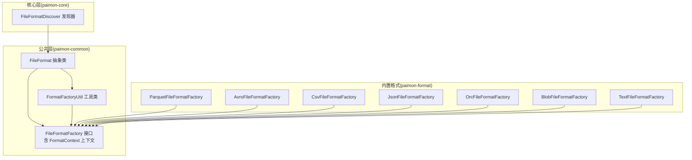
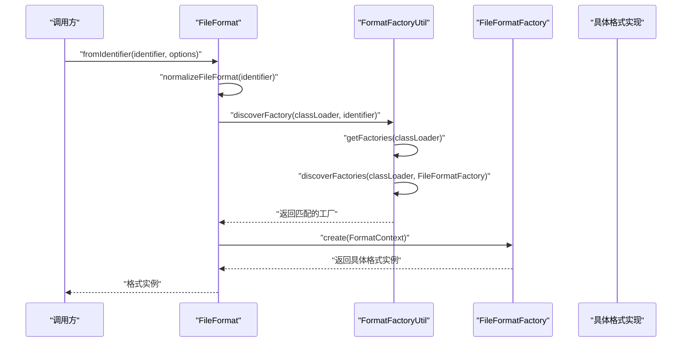
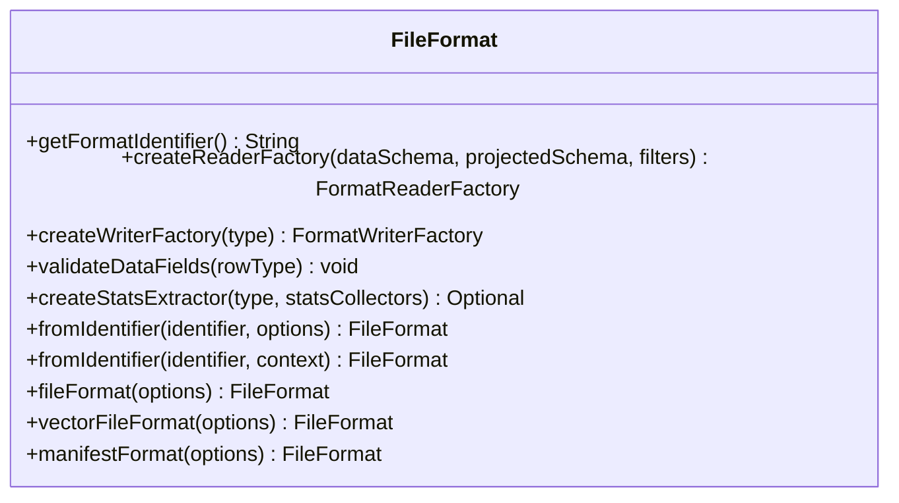
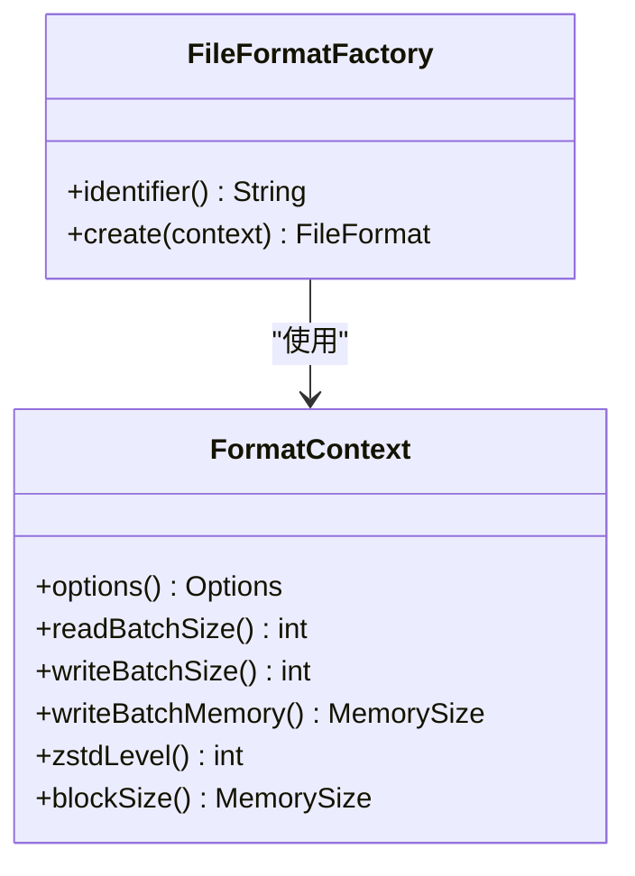
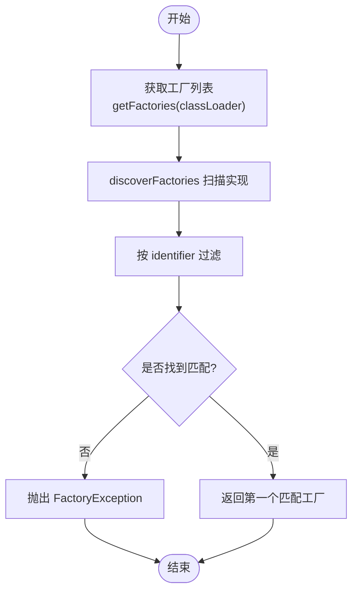
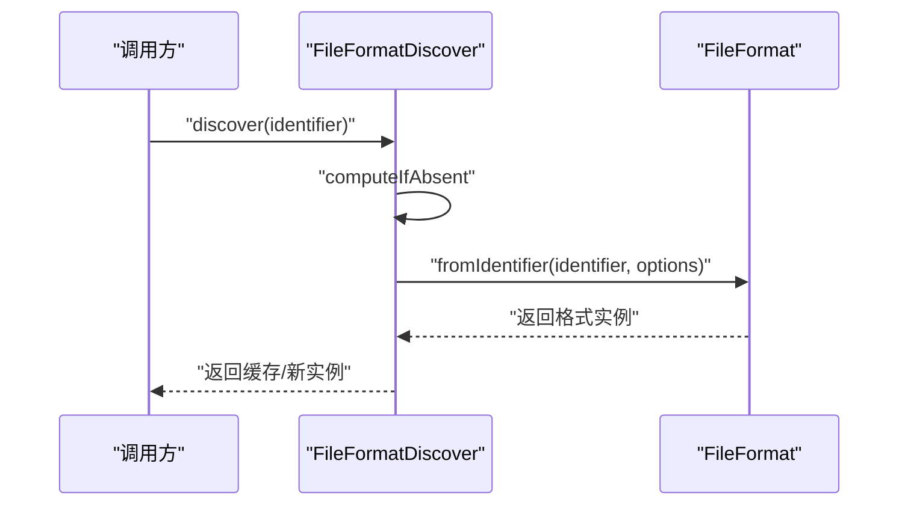

# 格式工厂模式设计

<cite>
**本文引用的文件**
- [FileFormat.java](file://paimon-common/src/main/java/org/apache/paimon/format/FileFormat.java)
- [FileFormatFactory.java](file://paimon-common/src/main/java/org/apache/paimon/format/FileFormatFactory.java)
- [FormatFactoryUtil.java](file://paimon-common/src/main/java/org/apache/paimon/factories/FormatFactoryUtil.java)
- [FileFormatDiscover.java](file://paimon-core/src/main/java/org/apache/paimon/format/FileFormatDiscover.java)
- [ParquetFileFormatFactory.java](file://paimon-format/src/main/java/org/apache/paimon/format/parquet/ParquetFileFormatFactory.java)
- [AvroFileFormatFactory.java](file://paimon-format/src/main/java/org/apache/paimon/format/avro/AvroFileFormatFactory.java)
- [CsvFileFormatFactory.java](file://paimon-format/src/main/java/org/apache/paimon/format/csv/CsvFileFormatFactory.java)
- [JsonFileFormatFactory.java](file://paimon-format/src/main/java/org/apache/paimon/format/json/JsonFileFormatFactory.java)
- [OrcFileFormatFactory.java](file://paimon-format/src/main/java/org/apache/paimon/format/orc/OrcFileFormatFactory.java)
- [BlobFileFormatFactory.java](file://paimon-format/src/main/java/org/apache/paimon/format/blob/BlobFileFormatFactory.java)
- [TextFileFormatFactory.java](file://paimon-format/src/main/java/org/apache/paimon/format/text/TextFileFormatFactory.java)
</cite>

## 目录
1. [引言](#引言)
2. [项目结构](#项目结构)
3. [核心组件](#核心组件)
4. [架构总览](#架构总览)
5. [详细组件分析](#详细组件分析)
6. [依赖分析](#依赖分析)
7. [性能考虑](#性能考虑)
8. [故障排查指南](#故障排查指南)
9. [结论](#结论)
10. [附录：自定义文件格式开发指南与最佳实践](#附录自定义文件格式开发指南与最佳实践)

## 引言
本文件系统性阐述 Paimon 中“文件格式工厂模式”的设计与实现，重点围绕以下目标展开：
- 深入解析 FileFormat 抽象类的设计理念与职责边界
- 详解 FormatReaderFactory 与 FormatWriterFactory 的职责分离与协作方式
- 全面说明 FileFormatFactory 的工厂实现机制与注册/发现流程
- 阐述 FormatContext 上下文的作用与参数传递策略
- 解释 FormatFactoryUtil 工具类在工厂发现与缓存中的关键作用
- 展示如何通过工厂模式实现格式无关的存储抽象与动态加载配置
- 提供自定义文件格式的开发指南与最佳实践

## 项目结构
围绕“文件格式工厂模式”，Paimon 在多个模块中协同工作：
- paimon-common：定义 FileFormat 抽象类、FileFormatFactory 接口、FormatContext 上下文与 FormatFactoryUtil 工具类
- paimon-format：内置多种具体格式（如 parquet、avro、csv、json、orc、blob、text）的工厂实现
- paimon-core：提供 FileFormatDiscover 的便捷发现器，用于按标识符延迟创建并缓存格式实例

图表来源
- [FileFormat.java:38-122](file://paimon-common/src/main/java/org/apache/paimon/format/FileFormat.java#L38-L122)
- [FileFormatFactory.java:27-97](file://paimon-common/src/main/java/org/apache/paimon/format/FileFormatFactory.java#L27-L97)
- [FormatFactoryUtil.java:31-67](file://paimon-common/src/main/java/org/apache/paimon/factories/FormatFactoryUtil.java#L31-L67)
- [FileFormatDiscover.java:28-48](file://paimon-core/src/main/java/org/apache/paimon/format/FileFormatDiscover.java#L28-L48)
- [ParquetFileFormatFactory.java:23-37](file://paimon-format/src/main/java/org/apache/paimon/format/parquet/ParquetFileFormatFactory.java#L23-L37)
- [AvroFileFormatFactory.java:24-36](file://paimon-format/src/main/java/org/apache/paimon/format/avro/AvroFileFormatFactory.java#L24-L36)
- [CsvFileFormatFactory.java:24-38](file://paimon-format/src/main/java/org/apache/paimon/format/csv/CsvFileFormatFactory.java#L24-L38)
- [JsonFileFormatFactory.java:24-38](file://paimon-format/src/main/java/org/apache/paimon/format/json/JsonFileFormatFactory.java#L24-L38)
- [OrcFileFormatFactory.java:23-37](file://paimon-format/src/main/java/org/apache/paimon/format/orc/OrcFileFormatFactory.java#L23-L37)
- [BlobFileFormatFactory.java:25-40](file://paimon-format/src/main/java/org/apache/paimon/format/blob/BlobFileFormatFactory.java#L25-L40)
- [TextFileFormatFactory.java:24-38](file://paimon-format/src/main/java/org/apache/paimon/format/text/TextFileFormatFactory.java#L24-L38)

章节来源
- [FileFormat.java:38-122](file://paimon-common/src/main/java/org/apache/paimon/format/FileFormat.java#L38-L122)
- [FileFormatFactory.java:27-97](file://paimon-common/src/main/java/org/apache/paimon/format/FileFormatFactory.java#L27-L97)
- [FormatFactoryUtil.java:31-67](file://paimon-common/src/main/java/org/apache/paimon/factories/FormatFactoryUtil.java#L31-L67)
- [FileFormatDiscover.java:28-48](file://paimon-core/src/main/java/org/apache/paimon/format/FileFormatDiscover.java#L28-L48)

## 核心组件
- FileFormat 抽象类
  - 定义统一的格式创建入口：createReaderFactory、createWriterFactory、validateDataFields
  - 提供从标识符到具体格式实例的静态构建方法，内部委托给 FormatFactoryUtil 进行工厂发现
  - 支持统计提取器的可选扩展点
  - 提供针对不同用途（普通数据文件、向量文件、清单文件）的便捷工厂方法
- FileFormatFactory 接口
  - 规定工厂必须提供 identifier 与 create(FormatContext) 方法
  - FormatContext 封装了读写批大小、写批内存、压缩级别、块大小等运行时参数
- FormatFactoryUtil 工具类
  - 负责扫描 ClassLoader 下所有 FileFormatFactory 实现
  - 基于标识符进行过滤匹配，并对结果进行异常处理与返回
  - 内部使用缓存以避免重复扫描 ClassLoader
- FileFormatDiscover 发现器
  - 基于 CoreOptions 提供线程安全的按标识符延迟创建与缓存
  - 通过 computeIfAbsent 实现懒加载与去重

章节来源
- [FileFormat.java:38-122](file://paimon-common/src/main/java/org/apache/paimon/format/FileFormat.java#L38-L122)
- [FileFormatFactory.java:27-97](file://paimon-common/src/main/java/org/apache/paimon/format/FileFormatFactory.java#L27-L97)
- [FormatFactoryUtil.java:31-67](file://paimon-common/src/main/java/org/apache/paimon/factories/FormatFactoryUtil.java#L31-L67)
- [FileFormatDiscover.java:28-48](file://paimon-core/src/main/java/org/apache/paimon/format/FileFormatDiscover.java#L28-L48)

## 架构总览
下图展示了“文件格式工厂模式”的整体交互：调用方通过 FileFormat.fromIdentifier 获取格式实例，内部经由 FormatFactoryUtil 发现对应工厂，再由工厂根据 FormatContext 创建具体格式；同时，FileFormatDiscover 提供基于标识符的缓存式发现。

图表来源
- [FileFormat.java:76-93](file://paimon-common/src/main/java/org/apache/paimon/format/FileFormat.java#L76-L93)
- [FormatFactoryUtil.java:37-66](file://paimon-common/src/main/java/org/apache/paimon/factories/FormatFactoryUtil.java#L37-L66)

章节来源
- [FileFormat.java:76-93](file://paimon-common/src/main/java/org/apache/paimon/format/FileFormat.java#L76-L93)
- [FormatFactoryUtil.java:37-66](file://paimon-common/src/main/java/org/apache/paimon/factories/FormatFactoryUtil.java#L37-L66)

## 详细组件分析

### FileFormat 抽象类
- 设计要点
  - 统一对外接口：reader/writer 工厂创建、字段类型校验、可选统计提取器
  - 通过 FormatContext 注入运行时配置，确保格式实现与配置解耦
  - 提供多场景工厂方法：fileFormat、vectorFileFormat、manifestFormat
- 关键行为
  - fromIdentifier：标准化标识符后，构造 FormatContext 并调用工厂发现
  - getIdentifierPrefixOptions：为不同格式提供带前缀的选项隔离
- 线程安全
  - 注释明确要求该类必须是线程安全的，便于多线程共享与复用

图表来源
- [FileFormat.java:38-122](file://paimon-common/src/main/java/org/apache/paimon/format/FileFormat.java#L38-L122)

章节来源
- [FileFormat.java:38-122](file://paimon-common/src/main/java/org/apache/paimon/format/FileFormat.java#L38-L122)

### FileFormatFactory 接口与 FormatContext
- FileFormatFactory
  - identifier：格式唯一标识（如 "parquet"、"avro"）
  - create：依据 FormatContext 创建具体格式实例
- FormatContext
  - options：通用配置对象
  - readBatchSize/writeBatchSize：读写批大小
  - writeBatchMemory：写批内存限制
  - zstdLevel：压缩级别
  - blockSize：块大小（可空）

图表来源
- [FileFormatFactory.java:27-97](file://paimon-common/src/main/java/org/apache/paimon/format/FileFormatFactory.java#L27-L97)

章节来源
- [FileFormatFactory.java:27-97](file://paimon-common/src/main/java/org/apache/paimon/format/FileFormatFactory.java#L27-L97)

### FormatFactoryUtil 工具类
- 职责
  - 扫描并缓存当前 ClassLoader 下所有 FileFormatFactory 实现
  - 根据标识符过滤匹配的工厂，若未找到则抛出 FactoryException
  - 使用 Caffeine 缓存工厂列表，提升重复发现效率
- 关键流程
  - discoverFactory：获取工厂列表、过滤、异常处理、返回首个匹配项
  - getFactories：从缓存或扫描中获取工厂集合

图表来源
- [FormatFactoryUtil.java:37-66](file://paimon-common/src/main/java/org/apache/paimon/factories/FormatFactoryUtil.java#L37-L66)

章节来源
- [FormatFactoryUtil.java:31-67](file://paimon-common/src/main/java/org/apache/paimon/factories/FormatFactoryUtil.java#L31-L67)

### FileFormatDiscover 发现器
- 设计目的
  - 基于 CoreOptions 提供线程安全的按标识符发现与缓存
  - 通过 computeIfAbsent 实现懒加载，避免重复创建相同标识符的格式实例
- 使用场景
  - 多处需要按标识符获取格式实例时，减少重复开销

图表来源
- [FileFormatDiscover.java:32-44](file://paimon-core/src/main/java/org/apache/paimon/format/FileFormatDiscover.java#L32-L44)
- [FileFormat.java:76-93](file://paimon-common/src/main/java/org/apache/paimon/format/FileFormat.java#L76-L93)

章节来源
- [FileFormatDiscover.java:28-48](file://paimon-core/src/main/java/org/apache/paimon/format/FileFormatDiscover.java#L28-L48)

### 内置格式工厂一览
- ParquetFileFormatFactory：标识符 "parquet"
- AvroFileFormatFactory：标识符 "avro"
- CsvFileFormatFactory：标识符 "csv"
- JsonFileFormatFactory：标识符 "json"
- OrcFileFormatFactory：标识符 "orc"
- BlobFileFormatFactory：标识符 "blob"，受 CoreOptions.BLOB_AS_DESCRIPTOR 控制
- TextFileFormatFactory：标识符 "text"

这些工厂均实现 FileFormatFactory 接口，通过 identifier 返回各自格式名，并在 create 中构造对应的 FileFormat 实例。

章节来源
- [ParquetFileFormatFactory.java:23-37](file://paimon-format/src/main/java/org/apache/paimon/format/parquet/ParquetFileFormatFactory.java#L23-L37)
- [AvroFileFormatFactory.java:24-36](file://paimon-format/src/main/java/org/apache/paimon/format/avro/AvroFileFormatFactory.java#L24-L36)
- [CsvFileFormatFactory.java:24-38](file://paimon-format/src/main/java/org/apache/paimon/format/csv/CsvFileFormatFactory.java#L24-L38)
- [JsonFileFormatFactory.java:24-38](file://paimon-format/src/main/java/org/apache/paimon/format/json/JsonFileFormatFactory.java#L24-L38)
- [OrcFileFormatFactory.java:23-37](file://paimon-format/src/main/java/org/apache/paimon/format/orc/OrcFileFormatFactory.java#L23-L37)
- [BlobFileFormatFactory.java:25-40](file://paimon-format/src/main/java/org/apache/paimon/format/blob/BlobFileFormatFactory.java#L25-L40)
- [TextFileFormatFactory.java:24-38](file://paimon-format/src/main/java/org/apache/paimon/format/text/TextFileFormatFactory.java#L24-L38)

## 依赖分析
- 组件内聚与耦合
  - FileFormat 与 FileFormatFactory 之间为“使用”关系，FileFormat 仅依赖工厂接口，不直接依赖具体实现，体现高内聚低耦合
  - FormatFactoryUtil 对工厂发现与缓存负责，避免上层逻辑分散处理
  - FileFormatDiscover 作为外部发现器，进一步降低对 FileFormat 的直接依赖
- 外部依赖
  - Caffeine 缓存用于优化工厂发现性能
  - CoreOptions 提供配置注入（如 BLOB_AS_DESCRIPTOR、文件格式字符串等）

图表来源
- [FileFormat.java:76-93](file://paimon-common/src/main/java/org/apache/paimon/format/FileFormat.java#L76-L93)
- [FormatFactoryUtil.java:37-66](file://paimon-common/src/main/java/org/apache/paimon/factories/FormatFactoryUtil.java#L37-L66)
- [FileFormatDiscover.java:32-44](file://paimon-core/src/main/java/org/apache/paimon/format/FileFormatDiscover.java#L32-L44)

章节来源
- [FileFormat.java:76-93](file://paimon-common/src/main/java/org/apache/paimon/format/FileFormat.java#L76-L93)
- [FormatFactoryUtil.java:37-66](file://paimon-common/src/main/java/org/apache/paimon/factories/FormatFactoryUtil.java#L37-L66)
- [FileFormatDiscover.java:32-44](file://paimon-core/src/main/java/org/apache/paimon/format/FileFormatDiscover.java#L32-L44)

## 性能考虑
- 工厂发现缓存
  - FormatFactoryUtil 使用 Caffeine 缓存工厂列表，避免重复扫描 ClassLoader，显著降低热路径开销
- 懒加载与去重
  - FileFormatDiscover 基于 computeIfAbsent 实现按需创建与缓存，避免重复实例化
- 参数化上下文
  - FormatContext 将读写批大小、内存与压缩等参数集中管理，便于格式实现按需裁剪与优化

[本节为通用性能讨论，无需列出章节来源]

## 故障排查指南
- 无法找到格式工厂
  - 现象：抛出 FactoryException，提示未找到指定标识符的工厂实现
  - 排查：确认依赖中包含对应格式工厂实现，且 META-INF/services 或 SPI 配置正确
  - 参考：FormatFactoryUtil 的 discoverFactory 异常分支
- 格式标识符不匹配
  - 现象：identifier 返回值与调用方传入不一致导致未命中
  - 排查：确保标识符大小写与注册一致；FileFormat 会进行标准化处理
- 配置缺失或错误
  - 现象：格式实现因缺少必要配置而初始化失败
  - 排查：检查 FormatContext 中的 options、批大小、内存与压缩级别等参数

章节来源
- [FormatFactoryUtil.java:48-58](file://paimon-common/src/main/java/org/apache/paimon/factories/FormatFactoryUtil.java#L48-L58)

## 结论
Paimon 的“文件格式工厂模式”通过 FileFormat 抽象类、FileFormatFactory 接口与 FormatContext 上下文，实现了：
- 明确的职责分离：格式选择、工厂发现与实例创建相互独立
- 可扩展的文件格式体系：新增格式只需实现 FileFormatFactory 并注册标识符
- 格式无关的存储抽象：调用方仅依赖 FileFormat 接口，屏蔽底层实现差异
- 动态加载与配置：通过 ClassLoader 发现与 FormatContext 注入，支持灵活部署与运行时调整

[本节为总结性内容，无需列出章节来源]

## 附录：自定义文件格式开发指南与最佳实践

### 开发步骤
- 实现 FileFormatFactory
  - 定义唯一标识符 identifier
  - 在 create 中构造并返回你的 FileFormat 实例
  - 若需要特殊配置，可在 create 中读取 FormatContext.options
- 实现 FileFormat 子类
  - 实现 createReaderFactory 与 createWriterFactory
  - 实现 validateDataFields 以校验字段类型
  - 如需统计提取，覆盖 createStatsExtractor
- 注册与发现
  - 确保工厂实现可通过 SPI（META-INF/services）被 ClassLoader 发现
  - 使用 FileFormat.fromIdentifier(identifier, options) 即可动态加载

### 最佳实践
- 标识符命名规范
  - 使用小写、简洁、语义明确的标识符，避免与内置格式冲突
- 配置隔离
  - 通过 FormatContext.options 传递配置，避免硬编码
- 线程安全
  - FileFormat 必须保证线程安全，以便多线程共享
- 缓存与懒加载
  - 利用 FileFormatDiscover 的缓存特性，减少重复创建
- 错误处理
  - 对缺失配置或非法参数抛出清晰的异常信息，便于定位问题

[本节为通用指导，无需列出章节来源]