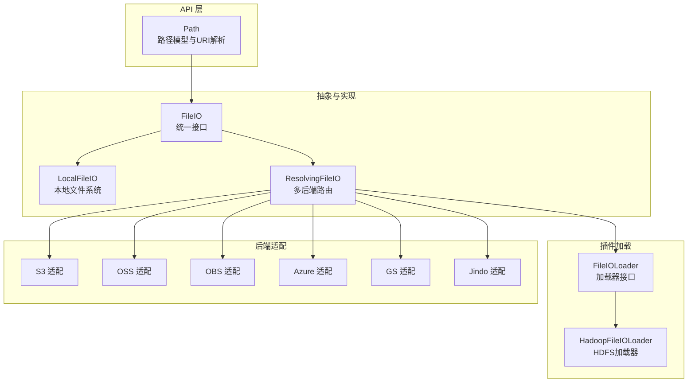
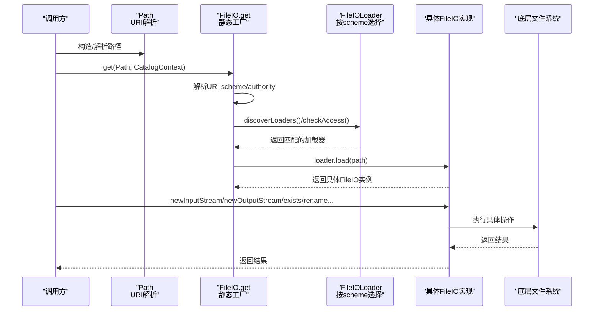
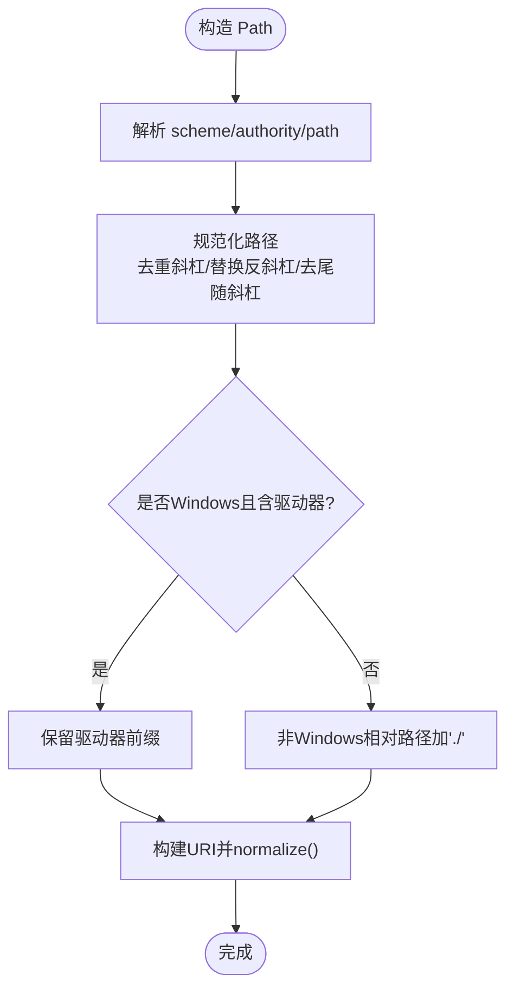
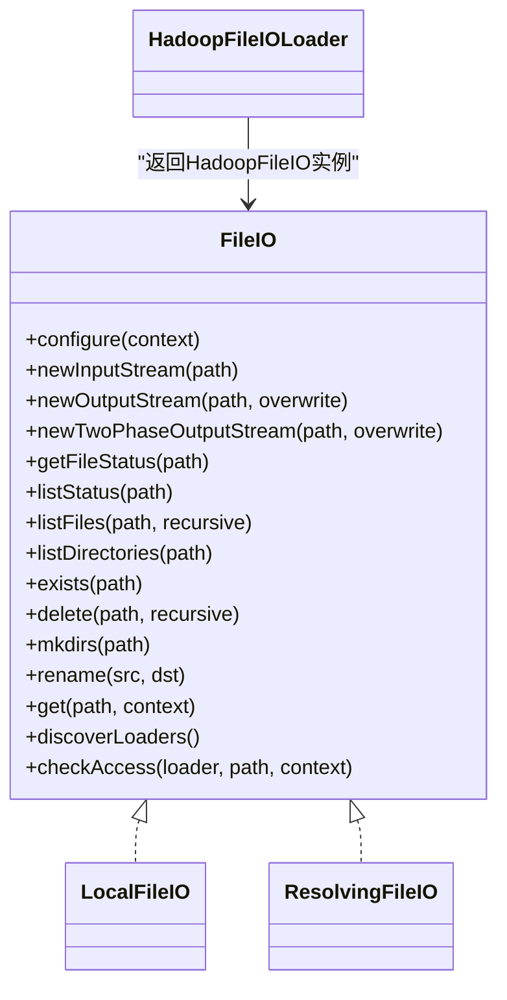
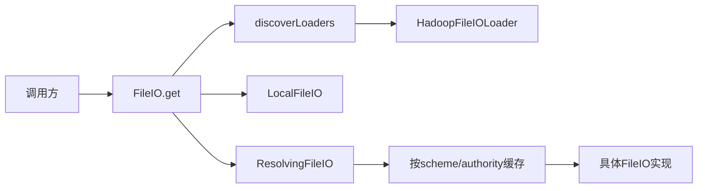

# 文件系统抽象

<cite>
**本文引用的文件**
- [Path.java](file://paimon-api/src/main/java/org/apache/paimon/fs/Path.java)
- [FileIO.java](file://paimon-common/src/main/java/org/apache/paimon/fs/FileIO.java)
- [LocalFileIO.java](file://paimon-common/src/main/java/org/apache/paimon/fs/local/LocalFileIO.java)
- [ResolvingFileIO.java](file://paimon-common/src/main/java/org/apache/paimon/fs/ResolvingFileIO.java)
- [HadoopFileIOLoader.java](file://paimon-common/src/main/java/org/apache/paimon/fs/hadoop/HadoopFileIOLoader.java)
- [filesystems.md](file://docs/content/maintenance/filesystems.md)
- [CatalogOptions.java](file://paimon-api/src/main/java/org/apache/paimon/options/CatalogOptions.java)
- [JindoFileIO.java](file://paimon-filesystems/paimon-jindo/src/main/java/org/apache/paimon/jindo/JindoFileIO.java)
- [OBSFileIO.java](file://paimon-filesystems/paimon-obs-impl/src/main/java/org/apache/paimon/obs/OBSFileIO.java)
- [HadoopCompliantFileIO.java](file://paimon-filesystems/paimon-jindo/src/main/java/org/apache/paimon/jindo/HadoopCompliantFileIO.java)
- [HadoopCompliantFileIO.java（S3）](file://paimon-filesystems/paimon-s3-impl/src/main/java/org/apache/paimon/s3/HadoopCompliantFileIO.java)
- [file_io_test.py](file://paimon-python/pypaimon/tests/file_io_test.py)
</cite>

## 目录
1. [简介](#简介)
2. [项目结构](#项目结构)
3. [核心组件](#核心组件)
4. [架构总览](#架构总览)
5. [详细组件分析](#详细组件分析)
6. [依赖分析](#依赖分析)
7. [性能考虑](#性能考虑)
8. [故障排查指南](#故障排查指南)
9. [结论](#结论)
10. [附录](#附录)

## 简介
本文件系统抽象旨在为 Paimon 提供统一、可扩展且跨引擎一致的文件访问层。它通过 FileIO 接口屏蔽底层文件系统的差异，支持本地文件系统、HDFS、S3、OSS、Azure、OBS、GS 等多种后端；通过 Path 类实现跨平台路径解析与规范化；通过插件化加载器机制实现按 URI scheme 动态选择具体实现；并通过 ResolvingFileIO 实现多后端路由与缓存。

## 项目结构
围绕文件系统抽象的关键模块如下：
- API 层：Path 路径模型与公共接口定义
- 抽象与实现：FileIO 接口、LocalFileIO 本地实现、ResolvingFileIO 多后端路由
- 插件加载：FileIOLoader 接口及 HadoopFileIOLoader 等具体加载器
- 后端适配：S3、OSS、OBS、Azure、GS、Jindo 等文件系统适配实现
- 文档与配置：官方维护的文件系统支持与配置指南

图表来源
- [Path.java:38-384](file://paimon-api/src/main/java/org/apache/paimon/fs/Path.java#L38-L384)
- [FileIO.java:66-641](file://paimon-common/src/main/java/org/apache/paimon/fs/FileIO.java#L66-L641)
- [LocalFileIO.java:53-401](file://paimon-common/src/main/java/org/apache/paimon/fs/local/LocalFileIO.java#L53-L401)
- [ResolvingFileIO.java:38-168](file://paimon-common/src/main/java/org/apache/paimon/fs/ResolvingFileIO.java#L38-L168)
- [HadoopFileIOLoader.java:25-38](file://paimon-common/src/main/java/org/apache/paimon/fs/hadoop/HadoopFileIOLoader.java#L25-L38)

章节来源
- [Path.java:38-384](file://paimon-api/src/main/java/org/apache/paimon/fs/Path.java#L38-L384)
- [FileIO.java:66-641](file://paimon-common/src/main/java/org/apache/paimon/fs/FileIO.java#L66-L641)
- [LocalFileIO.java:53-401](file://paimon-common/src/main/java/org/apache/paimon/fs/local/LocalFileIO.java#L53-L401)
- [ResolvingFileIO.java:38-168](file://paimon-common/src/main/java/org/apache/paimon/fs/ResolvingFileIO.java#L38-L168)
- [HadoopFileIOLoader.java:25-38](file://paimon-common/src/main/java/org/apache/paimon/fs/hadoop/HadoopFileIOLoader.java#L25-L38)

## 核心组件
- FileIO 接口：定义统一的文件读写、状态查询、目录遍历、重命名、原子写入等能力，并提供工具方法与静态工厂用于按 URI 选择具体实现。
- Path 类：对 URI 的解析、规范化、跨平台兼容（Windows 驱动器、反斜杠替换、尾随分隔符处理等），并提供父路径、名称、临时路径等实用方法。
- LocalFileIO：本地文件系统实现，基于 NIO，提供原子重命名、目录递归创建、列表与存在性检查等。
- ResolvingFileIO：多后端路由实现，按 URI scheme 与 authority 缓存并复用 FileIO 实例，动态委派到具体实现。
- FileIOLoader 与 HadoopFileIOLoader：服务发现式加载器，按 scheme 返回对应 FileIO 实例，支持 HDFS。
- 后端适配：S3、OSS、OBS、Azure、GS、Jindo 等通过 Hadoop 兼容或 SDK 方式接入，统一走 Hadoop FileSystem 或自定义适配层。

章节来源
- [FileIO.java:66-641](file://paimon-common/src/main/java/org/apache/paimon/fs/FileIO.java#L66-L641)
- [Path.java:38-384](file://paimon-api/src/main/java/org/apache/paimon/fs/Path.java#L38-L384)
- [LocalFileIO.java:53-401](file://paimon-common/src/main/java/org/apache/paimon/fs/local/LocalFileIO.java#L53-L401)
- [ResolvingFileIO.java:38-168](file://paimon-common/src/main/java/org/apache/paimon/fs/ResolvingFileIO.java#L38-L168)
- [HadoopFileIOLoader.java:25-38](file://paimon-common/src/main/java/org/apache/paimon/fs/hadoop/HadoopFileIOLoader.java#L25-L38)

## 架构总览
下图展示了从上层调用到具体文件系统实现的完整链路：Path 作为输入，FileIO.get 基于 URI scheme 选择加载器，加载器返回具体 FileIO 实例，随后由该实例执行具体操作；ResolvingFileIO 可按 scheme/authority 缓存并复用实例。

图表来源
- [FileIO.java:445-641](file://paimon-common/src/main/java/org/apache/paimon/fs/FileIO.java#L445-L641)
- [HadoopFileIOLoader.java:25-38](file://paimon-common/src/main/java/org/apache/paimon/fs/hadoop/HadoopFileIOLoader.java#L25-L38)
- [ResolvingFileIO.java:110-122](file://paimon-common/src/main/java/org/apache/paimon/fs/ResolvingFileIO.java#L110-L122)

章节来源
- [FileIO.java:445-641](file://paimon-common/src/main/java/org/apache/paimon/fs/FileIO.java#L445-L641)
- [filesystems.md:36-48](file://docs/content/maintenance/filesystems.md#L36-L48)

## 详细组件分析

### Path 类：URI 解析与路径规范化
- URI 解析：支持带/不带 scheme 的字符串、URI 对象、三段式 scheme/authority/path 构造。
- 规范化策略：
  - 去除重复斜杠，统一使用正斜杠。
  - Windows 场景下将反斜杠替换为正斜杠，但保留驱动器前缀。
  - 去除非根目录的尾随斜杠。
  - 相对路径在非 Windows 平台前加 "./"，避免被误判为 scheme。
- 跨平台兼容：自动识别 Windows 驱动器、去除“//”前多余的斜杠、输出时根据需要移除驱动器前导斜杠。
- 实用方法：getName、getParent、createTempPath、toString、compareTo、equals/hashCode。

图表来源
- [Path.java:144-264](file://paimon-api/src/main/java/org/apache/paimon/fs/Path.java#L144-L264)

章节来源
- [Path.java:38-384](file://paimon-api/src/main/java/org/apache/paimon/fs/Path.java#L38-L384)

### FileIO 接口：统一抽象与静态工厂
- 统一能力：
  - 输入输出流：newInputStream、newOutputStream、newTwoPhaseOutputStream（默认回退为重命名两阶段提交）。
  - 状态与遍历：getFileStatus、listStatus、listFiles、listDirectories、listFilesIterative。
  - 目录与删除：exists、delete、mkdirs、rename。
  - 工具方法：deleteQuietly、deleteDirectoryQuietly、getFileSize、isDir、checkOrMkdirs、readFileUtf8、tryToWriteAtomic、overwriteFileUtf8、copyFile、copyFiles、readOverwrittenFileUtf8。
- 静态工厂：
  - get(Path, CatalogContext)：优先使用 ResolvingFileIO（当启用时），否则按 scheme 选择本地或加载器；支持 preferIO/fallbackIO 与 HadoopFileIOLoader 回退；校验所需选项；抛出明确异常。
  - discoverLoaders：通过 ServiceLoader 发现所有 FileIOLoader，按 scheme 建立映射，冲突时报错。
  - checkAccess：尝试 exists 检查以验证可用性。

图表来源
- [FileIO.java:66-641](file://paimon-common/src/main/java/org/apache/paimon/fs/FileIO.java#L66-L641)
- [LocalFileIO.java:53-401](file://paimon-common/src/main/java/org/apache/paimon/fs/local/LocalFileIO.java#L53-L401)
- [ResolvingFileIO.java:38-168](file://paimon-common/src/main/java/org/apache/paimon/fs/ResolvingFileIO.java#L38-L168)
- [HadoopFileIOLoader.java:25-38](file://paimon-common/src/main/java/org/apache/paimon/fs/hadoop/HadoopFileIOLoader.java#L25-L38)

章节来源
- [FileIO.java:66-641](file://paimon-common/src/main/java/org/apache/paimon/fs/FileIO.java#L66-L641)

### LocalFileIO：本地文件系统实现
- 行为特征：
  - isObjectStore 返回 false。
  - newInputStream/newOutputStream 基于 NIO，支持随机读与预读。
  - exists/listStatus 支持文件/目录存在性与列表，忽略并发变化导致的短暂不一致。
  - delete 支持递归删除，非空目录报错；失败场景返回 false。
  - mkdirs 递归创建，幂等；冲突抛出已存在异常。
  - rename 使用原子移动，失败时返回 false；对目标为目录时兼容 Hadoop 语义，将源文件放入目标目录。
  - 工具方法：copyFile、readFileUtf8、overwriteFileUtf8、tryToWriteAtomic（临时文件+重命名）。
- 锁与并发：重命名使用可重入锁保证原子性。

章节来源
- [LocalFileIO.java:53-401](file://paimon-common/src/main/java/org/apache/paimon/fs/local/LocalFileIO.java#L53-L401)

### ResolvingFileIO：多后端路由与缓存
- 设计要点：
  - 按 URI 的 scheme/authority 维度缓存 FileIO 实例，避免重复创建。
  - 在执行操作前后切换线程上下文类加载器，确保在多引擎环境（Flink/Spark/Hive）中正确加载依赖。
  - isObjectStore 基于仓库 URI scheme 判断（非 file/hdfs）。
  - fileIO(Path) 通过 FileIO.get 获取具体实现。
- 并发安全：使用并发映射与延迟初始化，保证多线程安全。

章节来源
- [ResolvingFileIO.java:38-168](file://paimon-common/src/main/java/org/apache/paimon/fs/ResolvingFileIO.java#L38-L168)
- [FileIO.java:445-641](file://paimon-common/src/main/java/org/apache/paimon/fs/FileIO.java#L445-L641)

### 插件机制与扩展点
- FileIOLoader 接口：定义 getScheme 与 load 方法，按 scheme 返回具体 FileIO 实例。
- HadoopFileIOLoader：返回 HadoopFileIO，支持 HDFS。
- ServiceLoader 自动发现：FileIO.discoverLoaders 会扫描 classpath 下所有 FileIOLoader 实现，按 scheme 建立映射，冲突时报错。
- CatalogContext 集成：支持 preferIO/fallbackIO 与运行时 options 注入，实现按需选择与参数传递。

章节来源
- [HadoopFileIOLoader.java:25-38](file://paimon-common/src/main/java/org/apache/paimon/fs/hadoop/HadoopFileIOLoader.java#L25-L38)
- [FileIO.java:606-641](file://paimon-common/src/main/java/org/apache/paimon/fs/FileIO.java#L606-L641)

### 支持的文件系统类型与集成方式
- 本地文件系统：file://，内置支持，LocalFileIO。
- HDFS：hdfs://，内置支持，HadoopFileIOLoader。
- S3：s3://，通过 paimon-s3 或 paimon-s3-impl 集成，使用 Hadoop 兼容适配。
- OSS：oss://，通过 paimon-oss 或 paimon-jindo 集成，支持 Jindo SDK 加速。
- OBS：obs://，通过 paimon-obs-impl 集成。
- Azure：abfs://，通过 paimon-azure 集成。
- GS：gs://，通过 paimon-gs 集成。
- 其他 Hadoop 兼容文件系统：通过 Hadoop 依赖自动支持。

章节来源
- [filesystems.md:36-48](file://docs/content/maintenance/filesystems.md#L36-L48)
- [filesystems.md:198-390](file://docs/content/maintenance/filesystems.md#L198-L390)
- [filesystems.md:392-409](file://docs/content/maintenance/filesystems.md#L392-L409)
- [filesystems.md:420-457](file://docs/content/maintenance/filesystems.md#L420-L457)
- [filesystems.md:458-511](file://docs/content/maintenance/filesystems.md#L458-L511)
- [filesystems.md:513-595](file://docs/content/maintenance/filesystems.md#L513-L595)

### 后端适配示例与关键实现
- S3 适配（Hadoop 兼容）：按 authority 缓存 FileSystem，支持 seekable/positioned IO 包装。
- OSS 适配（Jindo）：isObjectStore 返回 true，支持配置项前缀与缓存开关。
- OBS 适配（Hadoop 兼容）：共享配置，按 URI 初始化 FileSystem。
- Azure/GCS：通过各自插件包提供加载器与适配。

章节来源
- [HadoopCompliantFileIO.java（S3）:139-156](file://paimon-filesystems/paimon-s3-impl/src/main/java/org/apache/paimon/s3/HadoopCompliantFileIO.java#L139-L156)
- [JindoFileIO.java:92-110](file://paimon-filesystems/paimon-jindo/src/main/java/org/apache/paimon/jindo/JindoFileIO.java#L92-L110)
- [OBSFileIO.java:108-133](file://paimon-filesystems/paimon-obs-impl/src/main/java/org/apache/paimon/obs/OBSFileIO.java#L108-L133)
- [HadoopCompliantFileIO.java:207-231](file://paimon-filesystems/paimon-jindo/src/main/java/org/apache/paimon/jindo/HadoopCompliantFileIO.java#L207-L231)

## 依赖分析
- FileIO.get 的选择顺序：
  - 若启用 ResolvingFileIO，则优先使用。
  - 否则：若无 scheme，返回 LocalFileIO；否则通过 discoverLoaders 查找匹配加载器；若未找到，尝试 preferIO/fallbackIO/HadoopFileIOLoader；均失败则抛出异常。
- 依赖关系：
  - FileIO.get 依赖 CatalogContext、FileIOLoader、HadoopFileIOLoader。
  - ResolvingFileIO 依赖 FileIO.get 与 CatalogContext。
  - 各后端适配依赖 Hadoop FileSystem 或 SDK。

图表来源
- [FileIO.java:445-641](file://paimon-common/src/main/java/org/apache/paimon/fs/FileIO.java#L445-L641)
- [ResolvingFileIO.java:110-122](file://paimon-common/src/main/java/org/apache/paimon/fs/ResolvingFileIO.java#L110-L122)
- [HadoopFileIOLoader.java:25-38](file://paimon-common/src/main/java/org/apache/paimon/fs/hadoop/HadoopFileIOLoader.java#L25-L38)

章节来源
- [FileIO.java:445-641](file://paimon-common/src/main/java/org/apache/paimon/fs/FileIO.java#L445-L641)
- [ResolvingFileIO.java:38-168](file://paimon-common/src/main/java/org/apache/paimon/fs/ResolvingFileIO.java#L38-L168)

## 性能考虑
- 缓存策略：
  - ResolvingFileIO 按 scheme/authority 缓存 FileIO 实例，减少重复创建与初始化开销。
  - CatalogOptions 中提供 file-io.allow-cache 控制是否允许静态缓存，避免资源泄漏。
- IO 模型：
  - LocalFileIO 支持随机读与预读，适合小文件随机访问场景。
  - S3/OSS/Jindo 等对象存储建议使用大块顺序写与合适的并发度，避免过多小文件写入。
- HDFS 连接池：
  - S3A 可能出现连接池超时，可通过配置增加最大连接数缓解。
- 跨引擎一致性：
  - ResolvingFileIO 在执行操作前后切换类加载器，确保在 Flink/Spark/Hive 等环境中正确加载依赖，避免类冲突。

章节来源
- [CatalogOptions.java:180-188](file://paimon-api/src/main/java/org/apache/paimon/options/CatalogOptions.java#L180-L188)
- [filesystems.md:410-419](file://docs/content/maintenance/filesystems.md#L410-L419)
- [ResolvingFileIO.java:124-132](file://paimon-common/src/main/java/org/apache/paimon/fs/ResolvingFileIO.java#L124-L132)

## 故障排查指南
- 本地路径包含 authority：
  - 当 URI 含 file:// 且 authority 非空时，会提示修正为 file:/// 形式，避免误解析。
- scheme 未识别：
  - 未找到匹配的 FileIOLoader 且 Hadoop 回退也失败时，抛出 UnsupportedSchemeException，并收集 suppressed 异常信息。
- 权限与存在性：
  - LocalFileIO 在不存在或权限不足时抛出清晰的异常信息。
- 重命名失败：
  - LocalFileIO 在重命名失败时返回 false；Python 测试覆盖了 OSError 捕获与返回值行为。
- HDFS/S3 特定异常：
  - readOverwrittenFileUtf8 对特定异常（如 S3 远端文件变更、HDFS blocklist 变更）进行有限次数重试。

章节来源
- [FileIO.java:462-475](file://paimon-common/src/main/java/org/apache/paimon/fs/FileIO.java#L462-L475)
- [FileIO.java:400-435](file://paimon-common/src/main/java/org/apache/paimon/fs/FileIO.java#L400-L435)
- [LocalFileIO.java:212-241](file://paimon-common/src/main/java/org/apache/paimon/fs/local/LocalFileIO.java#L212-L241)
- [file_io_test.py:275-288](file://paimon-python/pypaimon/tests/file_io_test.py#L275-L288)

## 结论
Paimon 的文件系统抽象通过 FileIO 接口与 Path 类实现了统一的路径建模与跨平台兼容，借助 ResolvingFileIO 与 FileIOLoader 的插件机制，能够灵活地按 URI scheme 选择本地或远端文件系统实现。配合各后端适配（S3、OSS、OBS、Azure、GS、Jindo 等），用户可在不同引擎与部署环境下获得一致的文件访问体验。通过合理的缓存策略与配置项，可在保证稳定性的同时提升性能。

## 附录
- 配置参考（摘自官方文档）：
  - HDFS：设置 HADOOP_HOME/HADOOP_CONF_DIR 或 catalog 中 hadoop-conf-dir，或通过 hadoop.* 前缀注入配置。
  - S3：设置 endpoint、access-key、secret-key；支持路径风格访问 s3.path.style.access。
  - OSS：设置 endpoint、accessKeyId、accessKeySecret；可选 Jindo SDK 加速。
  - OBS/Azure/GCS：分别设置对应 endpoint 与认证参数。
- 性能优化建议：
  - 合理设置 file-io.allow-cache，避免频繁创建实例。
  - 对对象存储采用顺序写与批量合并策略，减少小文件数量。
  - 针对 S3A 调整连接池大小，缓解超时问题。

章节来源
- [filesystems.md:66-197](file://docs/content/maintenance/filesystems.md#L66-L197)
- [filesystems.md:198-390](file://docs/content/maintenance/filesystems.md#L198-L390)
- [filesystems.md:392-409](file://docs/content/maintenance/filesystems.md#L392-L409)
- [filesystems.md:410-419](file://docs/content/maintenance/filesystems.md#L410-L419)
- [filesystems.md:420-595](file://docs/content/maintenance/filesystems.md#L420-L595)