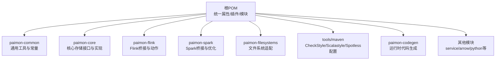
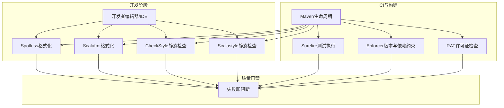
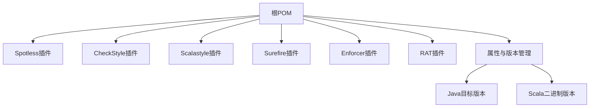

# 代码规范与风格

<cite>
**本文引用的文件**
- [pom.xml](file://pom.xml)
- [checkstyle.xml](file://tools/maven/checkstyle.xml)
- [scalastyle-config.xml](file://tools/maven/scalastyle-config.xml)
- [.scalafmt.conf](file://.scalafmt.conf)
- [suppressions.xml](file://tools/maven/suppressions.xml)
- [README.md](file://README.md)
- [IOUtils.java](file://paimon-common/src/main/java/org/apache/paimon/utils/IOUtils.java)
- [FileStore.java](file://paimon-core/src/main/java/org/apache/paimon/FileStore.java)
</cite>

## 目录
1. [简介](#简介)
2. [项目结构](#项目结构)
3. [核心组件](#核心组件)
4. [架构总览](#架构总览)
5. [详细组件分析](#详细组件分析)
6. [依赖分析](#依赖分析)
7. [性能考量](#性能考量)
8. [故障排查指南](#故障排查指南)
9. [结论](#结论)
10. [附录](#附录)

## 简介
本指南面向Apache Paimon贡献者与维护者，系统阐述Java与Scala代码的编写规范、静态检查与格式化工具配置、代码审查要点、重构最佳实践以及团队协作中的风格一致性策略。内容基于仓库内现有配置与典型实现进行提炼，确保可操作性与一致性。

## 项目结构
Paimon采用多模块Maven工程组织，包含核心引擎、文件系统适配、计算引擎（Flink/Spark）桥接、服务端组件、Python生态等模块。根POM统一管理版本、插件与构建配置；工具目录下提供CheckStyle、Scalastyle与Spotless的配置，用于统一风格与静态检查。

图表来源
- [pom.xml:54-78](file://pom.xml#L54-L78)
- [pom.xml:529-640](file://pom.xml#L529-L640)

章节来源
- [pom.xml:54-78](file://pom.xml#L54-L78)
- [pom.xml:529-640](file://pom.xml#L529-L640)

## 核心组件
- 静态检查与格式化
  - CheckStyle：统一包名、命名、导入顺序、修饰符、空白与换行、长行、布尔表达式简化、空语句、赋值换行位置、括号间距等规则，并对特定非法导入与不合规写法进行拦截。
  - Scalastyle：统一缩进、行长度、类名/对象名/包对象命名、参数数量、行尾换行等规则。
  - Spotless：通过Maven插件统一格式化，结合根POM属性控制执行范围与跳过策略。
  - Scalafmt：Scala格式化器配置，统一最大列宽、对齐、换行、缩进、导入分组与排序、删除冗余括号与尾随逗号等。
- 构建与测试
  - Surefire插件配置了单元与集成测试执行策略、fork参数与系统属性传递。
  - Enforcer插件强制Maven与Java版本、禁止不安全依赖与直接依赖表规划器等。
  - RAT插件用于许可证检查，配置了排除项。
- 文档与贡献
  - README提供构建与格式化命令、IDE建议与订阅社区渠道。

章节来源
- [checkstyle.xml:32-592](file://tools/maven/checkstyle.xml#L32-L592)
- [scalastyle-config.xml:27-147](file://tools/maven/scalastyle-config.xml#L27-L147)
- [.scalafmt.conf:1-71](file://.scalafmt.conf#L1-L71)
- [pom.xml:529-640](file://pom.xml#L529-L640)
- [pom.xml:637-635](file://pom.xml#L637-L635)
- [README.md:69-76](file://README.md#L69-L76)

## 架构总览
从“风格与质量”视角看，Paimon的代码规范体系由以下层次构成：

图表来源
- [pom.xml:529-640](file://pom.xml#L529-L640)
- [checkstyle.xml:32-592](file://tools/maven/checkstyle.xml#L32-L592)
- [scalastyle-config.xml:27-147](file://tools/maven/scalastyle-config.xml#L27-L147)
- [.scalafmt.conf:1-71](file://.scalafmt.conf#L1-L71)

## 详细组件分析

### Java代码规范与示例
- 包与命名
  - 包名采用小写点分，符合CheckStyle的包名校验规则。
  - 类型名采用大驼峰，成员/方法名采用小驼峰，常量全大写，遵循CheckStyle命名规则。
- 导入与顺序
  - Import顺序按组排列：优先org.apache.paimon，其次shade包，再第三方，最后javax/java/scala，静态导入按字母序。
- 注释与文档
  - 公共API需具备受保护级别的Javadoc，允许缺失部分标签以降低噪音。
- 常见风格细节
  - 大括号与空白：if/else/for/while/do等关键字后必须有空格，赋值运算符两端留空格，逗号后空格，类型转换后空格。
  - 行长与换行：默认未启用严格行长限制，但建议遵守团队约定（例如100列）。
  - 修饰符顺序：public/protected/private/abstract/static/final/transient/volatile/synchronized/native/strictfp。
  - 空白分隔：类/接口/枚举间保留空行，方法间保留空行，字段声明允许连续。
  - 长整型字面量：使用大写L结尾。
  - Fallthrough注释：switch漏写break需显式注释豁免。
  - 空语句与多余分号：禁止出现单独分号或多个连续分号。
- 示例参考
  - IO工具类展示了清晰的方法注释、异常处理与日志记录风格，适合学习公共API注释与异常处理规范。
  - 文件存储接口展示了接口设计、注释与参数标注风格。

章节来源
- [checkstyle.xml:337-414](file://tools/maven/checkstyle.xml#L337-L414)
- [checkstyle.xml:219-230](file://tools/maven/checkstyle.xml#L219-L230)
- [checkstyle.xml:300-327](file://tools/maven/checkstyle.xml#L300-L327)
- [checkstyle.xml:455-476](file://tools/maven/checkstyle.xml#L455-L476)
- [checkstyle.xml:513-564](file://tools/maven/checkstyle.xml#L513-L564)
- [IOUtils.java:35-36](file://paimon-common/src/main/java/org/apache/paimon/utils/IOUtils.java#L35-L36)
- [FileStore.java:56-61](file://paimon-core/src/main/java/org/apache/paimon/FileStore.java#L56-L61)

### Scala代码规范与示例
- 缩进与行长度
  - 使用两个空格缩进，行长度建议不超过100列，忽略导入行。
- 命名
  - 类名/对象名采用大驼峰，包对象名采用小驼峰。
- 结构与风格
  - if/else/try/catch/for/while等结构允许单行，但推荐可读性优先。
  - 避免魔法数，鼓励具名常量。
- 格式化
  - Scalafmt统一最大列宽、对齐策略、换行策略、导入分组与排序、删除冗余括号与尾随逗号等。
- 示例参考
  - 可参考paimon-codegen模块中的Scala源码（如异常类、上下文类、代码生成器等），观察命名、注释与结构风格。

章节来源
- [scalastyle-config.xml:59-64](file://tools/maven/scalastyle-config.xml#L59-L64)
- [scalastyle-config.xml:66-75](file://tools/maven/scalastyle-config.xml#L66-L75)
- [scalastyle-config.xml:76-80](file://tools/maven/scalastyle-config.xml#L76-L80)
- [scalastyle-config.xml:122-127](file://tools/maven/scalastyle-config.xml#L122-L127)
- [.scalafmt.conf:7-8](file://.scalafmt.conf#L7-L8)
- [.scalafmt.conf:48-58](file://.scalafmt.conf#L48-L58)
- [.scalafmt.conf:67-71](file://.scalafmt.conf#L67-L71)

### 静态代码分析工具配置与使用
- CheckStyle
  - 启用位置：根POM的maven-checkstyle-plugin绑定到构建生命周期。
  - 关键规则：包名、命名、导入顺序、修饰符、空白、换行、长行、布尔表达式简化、空语句、赋值换行、括号间距、非法导入与类使用限制等。
  - 跳过策略：可通过快照构建profile关闭检查以加速迭代。
- Scalastyle
  - 启用位置：根POM的scalastyle-maven-plugin绑定到构建生命周期。
  - 关键规则：制表符、文件长度、头部匹配、行长度、类名/对象名/包对象名、参数数量、UppercaseL、换行至文件末等。
- Spotless
  - 启用位置：根POM的spotless-maven-plugin绑定到构建生命周期。
  - 快捷命令：mvn spotless:apply一键应用格式化。
  - 跳过策略：fast-build profile可整体跳过格式化检查。
- Scalafmt
  - 启用位置：IDE（IntelliJ）通过scalafmt插件读取根目录配置。
  - 关键设置：最大列宽、对齐、换行、导入分组与排序、删除冗余括号与尾随逗号等。

章节来源
- [pom.xml:550-553](file://pom.xml#L550-L553)
- [pom.xml:637-640](file://pom.xml#L637-L640)
- [pom.xml:518-526](file://pom.xml#L518-L526)
- [checkstyle.xml:32-592](file://tools/maven/checkstyle.xml#L32-L592)
- [scalastyle-config.xml:27-147](file://tools/maven/scalastyle-config.xml#L27-L147)
- [.scalafmt.conf:1-71](file://.scalafmt.conf#L1-L71)
- [README.md:74-74](file://README.md#L74-L74)

### 代码格式化标准与工具
- Java
  - 使用Spotless统一格式化，命令为mvn spotless:apply。
  - CheckStyle与Scalastyle作为门禁规则，确保风格一致。
- Scala
  - 使用Scalafmt统一格式化，IDE需正确加载根目录配置。
  - 导入分组与排序由Scalafmt与Scalastyle共同保障。
- IDE配置建议
  - IntelliJ：安装scalafmt插件并指向根目录配置；将生成源标记为Sources Root。
  - 统一编码为UTF-8，行尾LF，制表符宽度与缩进按配置执行。

章节来源
- [README.md:74-75](file://README.md#L74-L75)
- [.scalafmt.conf:48-58](file://.scalafmt.conf#L48-L58)
- [pom.xml:518-526](file://pom.xml#L518-L526)

### 代码审查标准与关注点
- 代码质量
  - 遵循命名与导入顺序规则，避免非法导入与不合规类使用。
  - 接口与公共API需具备受保护级别的Javadoc，减少缺失标签导致的噪音。
  - 控制参数数量与方法复杂度，避免魔法数与冗余括号。
- 性能考虑
  - I/O路径应避免不必要的缓冲区复制与异常开销，参考IO工具类的实现思路。
  - 对象与集合操作尽量避免中间态拷贝，优先就地处理。
- 安全性
  - 禁止使用不安全依赖与已知漏洞版本，Enforcer会阻止低版本依赖进入生产环境。
  - 许可证合规：RAT检查确保所有文件头符合ASF许可要求。
- 可维护性
  - 保持方法短小、职责单一，注释简洁明确，避免过度注释。
  - 对易变逻辑添加测试覆盖，尤其是边界条件与异常路径。

章节来源
- [checkstyle.xml:300-327](file://tools/maven/checkstyle.xml#L300-L327)
- [checkstyle.xml:236-260](file://tools/maven/checkstyle.xml#L236-L260)
- [pom.xml:706-743](file://pom.xml#L706-L743)
- [pom.xml:558-634](file://pom.xml#L558-L634)
- [IOUtils.java:35-36](file://paimon-common/src/main/java/org/apache/paimon/utils/IOUtils.java#L35-L36)

### 代码重构最佳实践与常见反模式
- 最佳实践
  - 将重复逻辑抽取为工具方法或工具类，保持调用方简洁。
  - 明确异常边界，区分受检异常与非受检异常，避免吞掉异常或仅打印堆栈。
  - 使用final类与不可变数据结构提升并发安全性。
  - 在接口与实现之间建立清晰的契约，避免过度耦合。
- 常见反模式
  - 过度使用静态工厂与全局状态，破坏可测试性与可替换性。
  - 方法过长、参数过多、嵌套过深，违反单一职责。
  - 忽视资源释放与异常收集，导致泄漏或掩盖错误。
  - 使用被禁止的导入或类（如Guava Preconditions的静态导入、旧版Apache Commons Lang等）。

章节来源
- [checkstyle.xml:282-285](file://tools/maven/checkstyle.xml#L282-L285)
- [checkstyle.xml:121-196](file://tools/maven/checkstyle.xml#L121-L196)
- [IOUtils.java:167-216](file://paimon-common/src/main/java/org/apache/paimon/utils/IOUtils.java#L167-L216)

### 团队协作中的风格一致性
- 统一工具链：所有成员使用相同的CheckStyle、Scalastyle、Spotless与Scalafmt配置。
- 提交前自检：本地先执行mvn spotless:apply与静态检查，确保无违规。
- PR审查重点：除功能正确性外，重点检查命名、注释、导入顺序、行长度与异常处理是否符合规范。
- 快速迭代：在fast-build profile下跳过检查以加速开发，但合并前务必恢复完整检查。

章节来源
- [pom.xml:518-526](file://pom.xml#L518-L526)
- [README.md:74-74](file://README.md#L74-L74)

## 依赖分析
- 构建期依赖
  - Spotless、CheckStyle、Scalastyle、Surefire、Enforcer、RAT等插件在根POM中集中配置，保证各模块行为一致。
- 运行期依赖
  - 日志门面统一为SLF4J，测试框架为JUnit 5与AssertJ，日志实现为Log4j 2。
- 版本与兼容性
  - Java目标版本与Scala二进制版本在属性中集中管理，不同模块通过profile切换版本矩阵。

图表来源
- [pom.xml:529-640](file://pom.xml#L529-L640)
- [pom.xml:80-171](file://pom.xml#L80-L171)

章节来源
- [pom.xml:529-640](file://pom.xml#L529-L640)
- [pom.xml:80-171](file://pom.xml#L80-L171)

## 性能考量
- I/O与内存
  - 参考IO工具类的缓冲区大小与流复制策略，避免频繁小块读写。
- 并发与异常
  - 资源关闭与异常收集应避免阻塞主线程，必要时使用异步清理。
- 代码生成
  - 代码生成模块通过编译期优化减少运行时开销，注意生成代码的可读性与调试友好性。

章节来源
- [IOUtils.java:40-91](file://paimon-common/src/main/java/org/apache/paimon/utils/IOUtils.java#L40-L91)
- [pom.xml:529-640](file://pom.xml#L529-L640)

## 故障排查指南
- 检查未通过
  - CheckStyle：根据具体报错定位到对应规则，修正命名、导入顺序或空白问题。
  - Scalastyle：修正行长度、命名或缩进问题。
  - Spotless：执行mvn spotless:apply自动修复格式问题。
- 快速跳过
  - 使用fast-build profile临时跳过检查与格式化，但合并前请恢复。
- 许可证与头部
  - RAT失败时检查文件头是否包含ASF许可声明，或在排除列表中添加例外（谨慎使用）。

章节来源
- [pom.xml:518-526](file://pom.xml#L518-L526)
- [pom.xml:558-634](file://pom.xml#L558-L634)
- [README.md:74-74](file://README.md#L74-L74)

## 结论
通过统一的工具链与规则配置，Paimon在Java与Scala层面实现了风格一致与质量可控。建议贡献者在提交前完成本地格式化与静态检查，PR审查重点关注命名、注释、导入顺序与异常处理，以确保代码可读性、可维护性与安全性。

## 附录
- 快速命令
  - 格式化：mvn spotless:apply
  - 构建：mvn clean install -DskipTests
  - 自检：mvn verify（含CheckStyle/Scalastyle/Spotless/Surefire/RAT）
- 配置文件位置
  - CheckStyle：tools/maven/checkstyle.xml
  - Scalastyle：tools/maven/scalastyle-config.xml
  - Scalafmt：.scalafmt.conf
  - Spotless：根POM中maven插ugin配置
- 规则抑制
  - 特定文件或目录可通过suppressions.xml进行局部放宽，但需审慎评估风险。

章节来源
- [README.md:74-74](file://README.md#L74-L74)
- [suppressions.xml:25-43](file://tools/maven/suppressions.xml#L25-L43)