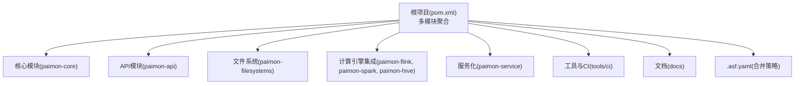
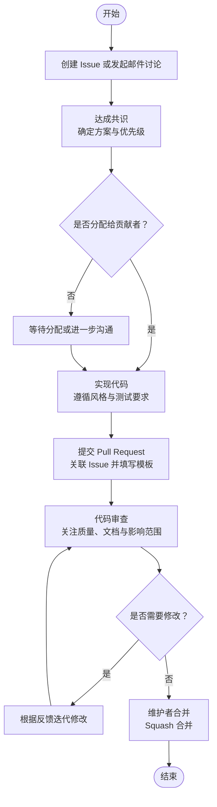
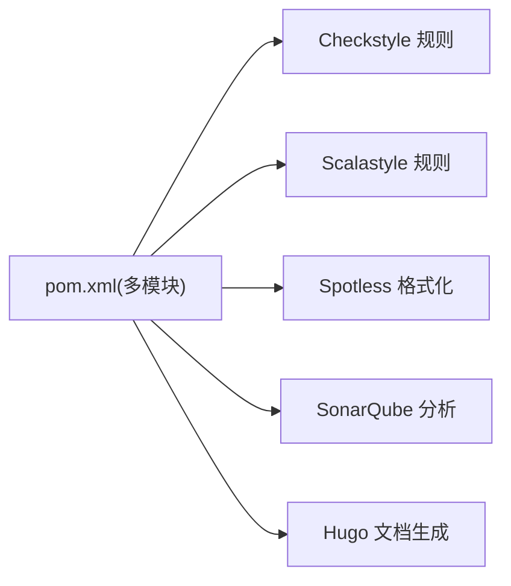

# 代码贡献流程

<cite>
**本文引用的文件**
- [README.md](file://README.md)
- [contributing.md](file://docs/content/project/contributing.md)
- [.asf.yaml](file://.asf.yaml)
- [CODE_OF_CONDUCT.md](file://CODE_OF_CONDUCT.md)
- [PULL_REQUEST_TEMPLATE.md](file://.github/PULL_REQUEST_TEMPLATE.md)
- [bug-report.yml](file://.github/ISSUE_TEMPLATE/bug-report.yml)
- [feature.yml](file://.github/ISSUE_TEMPLATE/feature.yml)
- [checkstyle.xml](file://tools/maven/checkstyle.xml)
- [scalastyle-config.xml](file://tools/maven/scalastyle-config.xml)
- [pom.xml](file://pom.xml)
- [docs.sh](file://tools/ci/docs.sh)
- [sonar_check.sh](file://tools/ci/sonar_check.sh)
</cite>

## 目录
1. [简介](#简介)
2. [项目结构](#项目结构)
3. [核心组件](#核心组件)
4. [架构总览](#架构总览)
5. [详细组件分析](#详细组件分析)
6. [依赖分析](#依赖分析)
7. [性能考虑](#性能考虑)
8. [故障排查指南](#故障排查指南)
9. [结论](#结论)
10. [附录](#附录)

## 简介
本指南面向希望为 Apache Paimon 贡献代码的开发者，系统阐述从 Issue 讨论、需求与设计评审、代码实现、Pull Request 提交到最终合并的完整流程；同时明确代码质量标准、测试与文档要求、ASF 法律合规（含 CLA）、代码风格与最佳实践，以及如何高效处理代码审查反馈与修改意见。

## 项目结构
- 仓库采用多模块 Maven 结构，核心模块覆盖 API、核心引擎、文件系统适配、计算引擎（Flink/Spark/Hive）集成、服务化组件、Arrow 支持、基准测试与文档等。
- 社区协作主要通过 GitHub Issues 和 Pull Requests，邮件列表用于重大讨论与公告。
- 根目录包含 ASF 配置、贡献者行为准则、CI 工具脚本与质量检查配置。

图表来源
- [pom.xml:54-78](file://pom.xml#L54-L78)
- [.asf.yaml:32-36](file://.asf.yaml#L32-L36)

章节来源
- [pom.xml:54-78](file://pom.xml#L54-L78)
- [README.md:15-18](file://README.md#L15-L18)
- [.asf.yaml:32-36](file://.asf.yaml#L32-L36)

## 核心组件
- Issue 模板：提供 Bug 报告与特性请求的标准格式，便于社区快速理解问题背景与期望。
- PR 模板：约束 PR 的目的与测试说明，提升审查效率。
- 质量规则：Checkstyle/Scalastyle 统一 Java/Scala 风格；Spotless 自动格式化；CI 中集成 SonarQube 覆盖率检查。
- 合并策略：GitHub 侧启用 Squash 合并，避免分支历史碎片化。
- 行为准则：遵循 ASF 行为准则，营造包容、专业的社区环境。

章节来源
- [bug-report.yml:19-75](file://.github/ISSUE_TEMPLATE/bug-report.yml#L19-L75)
- [feature.yml:19-60](file://.github/ISSUE_TEMPLATE/feature.yml#L19-L60)
- [PULL_REQUEST_TEMPLATE.md:1-4](file://.github/PULL_REQUEST_TEMPLATE.md#L1-L4)
- [checkstyle.xml:1-592](file://tools/maven/checkstyle.xml#L1-L592)
- [scalastyle-config.xml:1-147](file://tools/maven/scalastyle-config.xml#L1-L147)
- [.asf.yaml:32-36](file://.asf.yaml#L32-L36)
- [CODE_OF_CONDUCT.md:1-4](file://CODE_OF_CONDUCT.md#L1-L4)

## 架构总览
下图展示贡献流程的关键节点与交互关系：Issue → 设计评审 → 实现 → PR → 审查 → 合并。

图表来源
- [contributing.md:155-186](file://docs/content/project/contributing.md#L155-L186)
- [.asf.yaml:32-36](file://.asf.yaml#L32-L36)

## 详细组件分析

### Issue 创建与需求讨论
- 使用标准模板（Bug/特性）描述问题或建议，提供最小可复现步骤、期望结果、版本信息与计算引擎信息。
- 在 GitHub Issues 或开发邮件列表中进行充分讨论，确保达成社区共识后再进入实现阶段。
- 重要提示：仅在获得分配或明确共识后才开始实现，避免重复劳动。

章节来源
- [bug-report.yml:37-61](file://.github/ISSUE_TEMPLATE/bug-report.yml#L37-L61)
- [feature.yml:37-46](file://.github/ISSUE_TEMPLATE/feature.yml#L37-L46)
- [contributing.md:155-157](file://docs/content/project/contributing.md#L155-L157)

### 设计评审与共识
- 对于重大变更，建议先在邮件列表或 Issues 中形成设计草案与影响评估。
- 明确改动范围、兼容性、性能与测试策略，避免后期大规模返工。

章节来源
- [contributing.md:195-202](file://docs/content/project/contributing.md#L195-L202)

### 代码实现与本地验证
- 遵循统一的代码风格（Checkstyle/Scalastyle），使用 Spotless 应用格式化。
- 编写充分的单元测试与必要的端到端测试，确保功能正确性与回归安全。
- 可选：运行文档生成脚本以验证文档构建链路。

章节来源
- [checkstyle.xml:1-592](file://tools/maven/checkstyle.xml#L1-L592)
- [scalastyle-config.xml:1-147](file://tools/maven/scalastyle-config.xml#L1-L147)
- [README.md:73-74](file://README.md#L73-L74)
- [docs.sh:20-37](file://tools/ci/docs.sh#L20-L37)

### Pull Request 提交与模板
- 关联相关 Issue（如 fix #xxx），简要说明目的与测试覆盖范围。
- 确保 PR 不包含无关的格式化改动，保持审查焦点集中。

章节来源
- [PULL_REQUEST_TEMPLATE.md:1-4](file://.github/PULL_REQUEST_TEMPLATE.md#L1-L4)
- [contributing.md:165-166](file://docs/content/project/contributing.md#L165-L166)

### 代码审查要点
审查维度（按建议顺序）：
1) 贡献描述充分性：是否清晰说明目标、方案与差异点。
2) 是否需要特定维护者关注：涉及关键模块或接口变更时。
3) 整体代码质量：正确性、健壮性、可维护性、可测试性与性能敏感点处理。
4) 测试覆盖：是否足够且执行快速，依赖变更是否同步更新 NOTICE。
5) 文档更新：新增功能需补充相应文档。

章节来源
- [contributing.md:189-221](file://docs/content/project/contributing.md#L189-L221)

### 合并与后续
- 维护者检查贡献是否满足要求后进行合并；GitHub 默认启用 Squash 合并，保证主干整洁。
- 合并后关注 CI 状态与潜在回归。

章节来源
- [.asf.yaml:32-36](file://.asf.yaml#L32-L36)

### 代码风格与最佳实践
- Java 风格：Checkstyle 规则涵盖导入顺序、命名约定、修饰符、空白与括号、避免非法导入等。
- Scala 风格：Scalastyle 规则涵盖行长度、类名/包对象命名、参数数量、换行与缩进等。
- 格式化：使用 Maven Spotless 插件统一格式；IDE 需将生成源标记为 Sources Root。
- 注释与 Javadoc：遵循项目对方法与类型注释的要求，保持一致性。

章节来源
- [checkstyle.xml:211-260](file://tools/maven/checkstyle.xml#L211-L260)
- [checkstyle.xml:337-414](file://tools/maven/checkstyle.xml#L337-L414)
- [checkstyle.xml:513-587](file://tools/maven/checkstyle.xml#L513-L587)
- [scalastyle-config.xml:59-80](file://tools/maven/scalastyle-config.xml#L59-L80)
- [README.md:73-75](file://README.md#L73-L75)

### 测试与覆盖率要求
- 单元测试：覆盖核心逻辑与边界条件，优先使用 JUnit 5 与 AssertJ。
- 端到端测试：针对复杂场景与跨模块集成进行验证。
- 覆盖率检查：通过 SonarQube 进行静态分析与覆盖率报告（CI 脚本已配置）。

章节来源
- [pom.xml:173-200](file://pom.xml#L173-L200)
- [sonar_check.sh:21-29](file://tools/ci/sonar_check.sh#L21-L29)

### 文档更新要求
- 新增功能需配套文档更新；文档构建脚本可用于验证生成链路。
- 文档站点基于 Hugo，CI 中会拉取子模块并生成静态内容。

章节来源
- [contributing.md:219-221](file://docs/content/project/contributing.md#L219-L221)
- [docs.sh:20-32](file://tools/ci/docs.sh#L20-L32)

### 处理审查反馈与修改意见
- 逐条响应评论，必要时在 PR 中补充说明或提供测试用例。
- 避免一次性提交大量无关格式化改动，减少审查负担。
- 保持测试通过，确保 CI 正常。

章节来源
- [contributing.md:174-176](file://docs/content/project/contributing.md#L174-L176)

### ASF 法律与社区要求
- 行为准则：严格遵守 ASF 行为准则，营造尊重、包容的社区氛围。
- 邮件列表：重要讨论与决策在 dev@ 列表进行，确保透明与可追溯。
- Slack：加入 ASF Slack 的 Paimon 频道，便于实时沟通。

章节来源
- [CODE_OF_CONDUCT.md:1-4](file://CODE_OF_CONDUCT.md#L1-L4)
- [README.md:19-67](file://README.md#L19-L67)

## 依赖分析
- 质量工具链：Maven 插件 + Spotless + Checkstyle/Scalastyle + SonarQube。
- 构建与测试：多模块聚合，统一版本属性与测试框架；支持不同计算引擎版本矩阵。
- 文档：Hugo 文档生成脚本与子模块管理。

图表来源
- [pom.xml:54-78](file://pom.xml#L54-L78)
- [checkstyle.xml:1-592](file://tools/maven/checkstyle.xml#L1-L592)
- [scalastyle-config.xml:1-147](file://tools/maven/scalastyle-config.xml#L1-L147)
- [docs.sh:20-32](file://tools/ci/docs.sh#L20-L32)
- [sonar_check.sh:21-29](file://tools/ci/sonar_check.sh#L21-L29)

章节来源
- [pom.xml:54-78](file://pom.xml#L54-L78)
- [checkstyle.xml:1-592](file://tools/maven/checkstyle.xml#L1-L592)
- [scalastyle-config.xml:1-147](file://tools/maven/scalastyle-config.xml#L1-L147)
- [docs.sh:20-32](file://tools/ci/docs.sh#L20-L32)
- [sonar_check.sh:21-29](file://tools/ci/sonar_check.sh#L21-L29)

## 性能考虑
- 性能敏感路径需在设计与实现阶段进行性能评估，避免引入不必要的开销。
- 测试应包含性能回归检查，确保关键路径稳定。

## 故障排查指南
- 格式化失败：使用 Maven 命令应用 Spotless 格式化，确保符合 Checkstyle/Scalastyle 规则。
- 文档构建失败：确认 Hugo 版本与子模块初始化，参考文档生成脚本。
- Sonar 报告缺失：检查 CI 环境变量 SONAR_TOKEN 与报告路径配置。

章节来源
- [README.md:73-74](file://README.md#L73-L74)
- [docs.sh:20-37](file://tools/ci/docs.sh#L20-L37)
- [sonar_check.sh:17-29](file://tools/ci/sonar_check.sh#L17-L29)

## 结论
遵循本文流程与规范，可以高效、高质量地完成一次从需求到合并的贡献闭环。请始终以社区共识为先，重视代码质量与文档完整性，并积极回应审查反馈，共同维护 Apache Paimon 的长期健康发展。

## 附录
- 快速链接
  - 贡献指南：[贡献页面](file://docs/content/project/contributing.md)
  - Issue 模板：[Bug 报告](file://.github/ISSUE_TEMPLATE/bug-report.yml)、[特性请求](file://.github/ISSUE_TEMPLATE/feature.yml)
  - PR 模板：[PR 模板](file://.github/PULL_REQUEST_TEMPLATE.md)
  - 质量规则：[Checkstyle](file://tools/maven/checkstyle.xml)、[Scalastyle](file://tools/maven/scalastyle-config.xml)
  - 合并策略：[ASF 配置](file://.asf.yaml)
  - 行为准则：[ASF 行为准则](file://CODE_OF_CONDUCT.md)
  - 构建与测试：[根 POM](file://pom.xml)
  - 文档与 CI：[文档生成脚本](file://tools/ci/docs.sh)、[Sonar 检查脚本](file://tools/ci/sonar_check.sh)