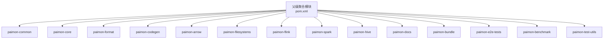
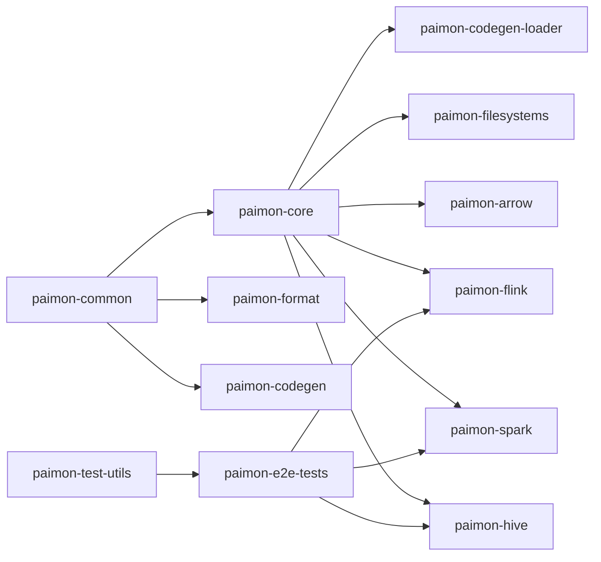
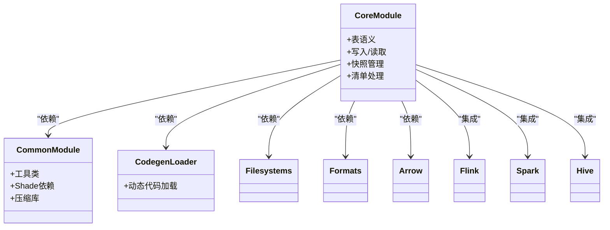
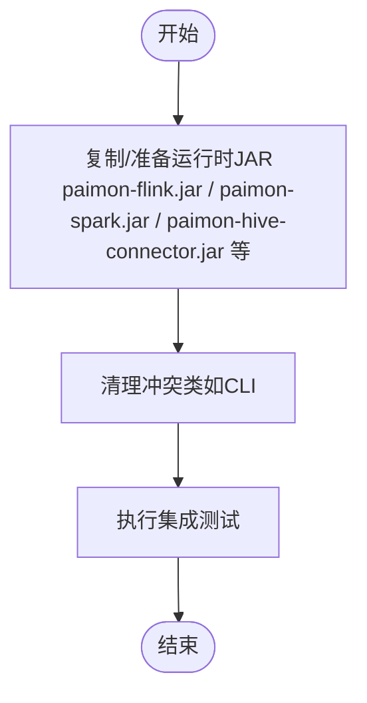
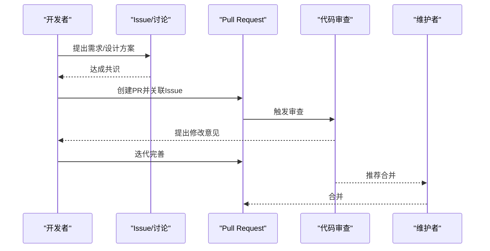
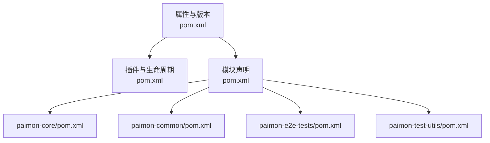

# 开发指南

<cite>
**本文引用的文件**
- [README.md](file://README.md)
- [pom.xml](file://pom.xml)
- [contributing.md](file://docs/content/project/contributing.md)
- [download.md](file://docs/content/project/download.md)
- [checkstyle.xml](file://tools/maven/checkstyle.xml)
- [scalastyle-config.xml](file://tools/maven/scalastyle-config.xml)
- [paimon-common/pom.xml](file://paimon-common/pom.xml)
- [paimon-core/pom.xml](file://paimon-core/pom.xml)
- [paimon-e2e-tests/pom.xml](file://paimon-e2e-tests/pom.xml)
- [paimon-test-utils/pom.xml](file://paimon-test-utils/pom.xml)
- [.github/PULL_REQUEST_TEMPLATE.md](file://.github/PULL_REQUEST_TEMPLATE.md)
- [docs.sh](file://tools/ci/docs.sh)
- [sonar_check.sh](file://tools/ci/sonar_check.sh)
</cite>

## 目录
1. [简介](#简介)
2. [项目结构](#项目结构)
3. [核心组件](#核心组件)
4. [架构总览](#架构总览)
5. [详细组件分析](#详细组件分析)
6. [依赖分析](#依赖分析)
7. [性能考虑](#性能考虑)
8. [故障排查指南](#故障排查指南)
9. [结论](#结论)
10. [附录](#附录)

## 简介
本指南面向Apache Paimon项目的贡献者与维护者，提供从开发环境搭建、IDE配置、依赖与编译构建，到代码结构与架构理解、贡献流程、测试策略、代码规范、调试技巧、发布流程与版本管理、以及常见问题与最佳实践的系统化说明。目标是帮助新贡献者快速上手并高效参与项目。

## 项目结构
Paimon采用多模块Maven聚合工程组织，顶层pom定义了统一的版本、属性、插件与生命周期；各子模块按功能域拆分，如核心引擎、格式层、文件系统适配、Flink/Spark集成、Python API、文档与基准测试等。典型模块包括：
- 核心与通用：paimon-common、paimon-core
- 引擎适配：paimon-flink、paimon-spark、paimon-hive
- 文件系统与云存储：paimon-filesystems（含S3/OSS/GCS等）
- 格式与编码：paimon-format、paimon-codegen、paimon-arrow
- 测试与基准：paimon-e2e-tests、paimon-benchmark、paimon-test-utils
- 文档与打包：paimon-docs、paimon-bundle
- 其他生态：paimon-iceberg、paimon-lance、paimon-lumina 等

图表来源
- [pom.xml:54-78](file://pom.xml#L54-L78)

章节来源
- [pom.xml:54-78](file://pom.xml#L54-L78)

## 核心组件
- paimon-common：提供通用工具、压缩库、Shade依赖、ANTLR词法分析生成等基础能力，被多个模块复用。
- paimon-core：核心引擎实现，依赖common与codegen-loader，提供表语义、写入/读取、快照与清单管理等。
- paimon-format：文件格式抽象与实现，支撑Parquet/ORC/Avro等格式的读写。
- paimon-codegen：代码生成与加载机制，用于动态生成执行计划与优化路径。
- paimon-arrow：Arrow向量转换与读写支持。
- paimon-filesystems：S3、OSS、GS、Azure等云存储适配器与Hadoop兼容层。
- paimon-flink/spark/hive：与Flink/Spark/Hive的桥接与SQL/数据源集成。
- paimon-e2e-tests：端到端集成测试，覆盖Flink/Spark/Hive场景与外部系统。
- paimon-test-utils：统一的测试工具与断言、日志与容器化测试支持。
- paimon-docs/paimon-bundle：文档生成与发行包打包。

章节来源
- [paimon-common/pom.xml:34-259](file://paimon-common/pom.xml#L34-L259)
- [paimon-core/pom.xml:38-287](file://paimon-core/pom.xml#L38-L287)
- [paimon-e2e-tests/pom.xml:41-131](file://paimon-e2e-tests/pom.xml#L41-L131)
- [paimon-test-utils/pom.xml:34-71](file://paimon-test-utils/pom.xml#L34-L71)

## 架构总览
下图展示核心模块间依赖关系与交互：

图表来源
- [paimon-common/pom.xml:34-115](file://paimon-common/pom.xml#L34-L115)
- [paimon-core/pom.xml:38-117](file://paimon-core/pom.xml#L38-L117)
- [paimon-e2e-tests/pom.xml:41-100](file://paimon-e2e-tests/pom.xml#L41-L100)

## 详细组件分析

### 组件A：核心引擎（paimon-core）
- 职责：表语义、写入/读取、快照与清单管理、与文件系统/格式层协作。
- 关键依赖：paimon-common、paimon-codegen-loader、Hadoop客户端、Iceberg测试依赖等。
- 测试：依赖test-utils、Arrow、Hive Storage API、SQLite、OkHttp、Testcontainers等进行端到端与集成测试。

图表来源
- [paimon-core/pom.xml:38-287](file://paimon-core/pom.xml#L38-L287)

章节来源
- [paimon-core/pom.xml:38-287](file://paimon-core/pom.xml#L38-L287)

### 组件B：端到端测试（paimon-e2e-tests）
- 职责：在真实或容器化的环境中验证Flink/Spark/Hive与Paimon的协同工作。
- 关键点：通过maven-antrun与maven-dependency-plugin准备运行时JAR，屏蔽冲突类，支持多版本Flink/Spark配置。

图表来源
- [paimon-e2e-tests/pom.xml:133-281](file://paimon-e2e-tests/pom.xml#L133-L281)

章节来源
- [paimon-e2e-tests/pom.xml:133-281](file://paimon-e2e-tests/pom.xml#L133-L281)

### 组件C：贡献流程（Issue → PR → 审查 → 合并）
- 讨论与共识：在Issue或邮件列表中达成一致，明确需求与方案。
- 实现与PR：基于已分配的Issue创建PR，关联Issue编号，开启仓库Actions。
- 审查要点：遵循代码质量标准、避免无关格式化、确保测试通过、文档更新。
- 合并：由维护者检查后合并。

图表来源
- [contributing.md:151-187](file://docs/content/project/contributing.md#L151-L187)
- [.github/PULL_REQUEST_TEMPLATE.md:1-4](file://.github/PULL_REQUEST_TEMPLATE.md#L1-L4)

章节来源
- [contributing.md:151-187](file://docs/content/project/contributing.md#L151-L187)
- [.github/PULL_REQUEST_TEMPLATE.md:1-4](file://.github/PULL_REQUEST_TEMPLATE.md#L1-L4)

## 依赖分析
- 版本与属性：顶层pom集中管理版本号、Java版本、Scala版本、测试框架、日志与依赖管理。
- 插件与生命周期：统一的Checkstyle、Spotless、Surefire、Enforcer、RAT等插件，保证代码质量与合规。
- 模块间耦合：核心模块对common有强依赖；引擎模块对文件系统与格式层有弱耦合；测试模块对引擎与外部系统有集成依赖。

图表来源
- [pom.xml:80-171](file://pom.xml#L80-L171)
- [pom.xml:529-800](file://pom.xml#L529-L800)

章节来源
- [pom.xml:80-171](file://pom.xml#L80-L171)
- [pom.xml:529-800](file://pom.xml#L529-L800)

## 性能考虑
- 构建性能：启用fast-build Profile可跳过Checkstyle/Spotless/Scalastyle/Enforcer/RAT，加速本地迭代。
- 测试性能：Surefire配置forkCount与reuseForks，合理设置内存参数，减少JVM启动开销。
- 依赖最小化：Shade策略减少传递依赖冲突，提升运行时稳定性。
- 基准测试：使用paimon-benchmark模块进行集群与微基准评估，关注I/O与序列化开销。

章节来源
- [pom.xml:518-526](file://pom.xml#L518-L526)
- [pom.xml:642-701](file://pom.xml#L642-L701)
- [paimon-common/pom.xml:295-370](file://paimon-common/pom.xml#L295-L370)

## 故障排查指南
- 构建失败（许可证/合规）：RAT插件校验未通过时，检查新增文件是否包含许可头，排除无需许可的资源。
- 依赖冲突：Shade重定位与过滤策略需与运行时框架（如Flink/Hadoop）保持一致。
- 集成测试失败：确认/tmp/paimon-e2e-tests-jars中的JAR已正确复制且无冲突类；检查Testcontainers依赖的服务可用性。
- 文档生成失败：确保Hugo二进制可用且子模块已初始化，按docs.sh脚本顺序执行。
- Sonar扫描失败：确保设置SONAR_TOKEN并满足覆盖率报告路径要求。

章节来源
- [pom.xml:555-635](file://pom.xml#L555-L635)
- [paimon-e2e-tests/pom.xml:133-281](file://paimon-e2e-tests/pom.xml#L133-L281)
- [docs.sh:20-37](file://tools/ci/docs.sh#L20-L37)
- [sonar_check.sh:17-29](file://tools/ci/sonar_check.sh#L17-L29)

## 结论
通过本指南，贡献者可以完成从环境搭建到代码贡献、从单元测试到端到端验证、从代码规范到发布流程的全链路开发实践。建议在本地使用fast-build Profile进行快速迭代，在提交前确保Checkstyle/Spotless/测试全部通过，并在PR中清晰描述变更动机与测试覆盖范围。

## 附录

### A. 开发环境搭建与IDE配置
- JDK与Maven：JDK 8/11，Maven ≥3.6.3；推荐IDE标记paimon-common的生成源码根目录为Sources Root。
- 快速构建：mvn clean install -DskipTests；格式化：mvn spotless:apply。
- 参考：[README.md:69-76](file://README.md#L69-L76)

章节来源
- [README.md:69-76](file://README.md#L69-L76)

### B. 代码贡献流程
- 讨论与设计：Issue/邮件列表达成共识，必要时提供POC。
- 实现与PR：基于已分配Issue创建PR，关联Issue编号，开启Actions。
- 审查与合并：遵循审查清单，确保测试通过、文档更新、无无关格式化。

章节来源
- [contributing.md:151-187](file://docs/content/project/contributing.md#L151-L187)
- [.github/PULL_REQUEST_TEMPLATE.md:1-4](file://.github/PULL_REQUEST_TEMPLATE.md#L1-L4)

### C. 测试策略与工具
- 单元测试：JUnit 5 + AssertJ；测试日志默认使用Log4j。
- 集成测试：paimon-e2e-tests，覆盖Flink/Spark/Hive场景，使用Testcontainers与MySQL/Kafka等。
- 基准测试：paimon-benchmark，支持集群与微基准评估。
- 参考：[paimon-e2e-tests/pom.xml:41-131](file://paimon-e2e-tests/pom.xml#L41-L131)，[paimon-test-utils/pom.xml:34-71](file://paimon-test-utils/pom.xml#L34-L71)

章节来源
- [paimon-e2e-tests/pom.xml:41-131](file://paimon-e2e-tests/pom.xml#L41-L131)
- [paimon-test-utils/pom.xml:34-71](file://paimon-test-utils/pom.xml#L34-L71)

### D. 代码规范与风格
- Java：Checkstyle规则，禁止不安全导入与非法注解，强制包/类型命名规范。
- Scala：Scalastyle规则，限制行长、参数数量、类名/对象名命名等。
- 格式化：Spotless统一Java/Scala格式，建议在提交前执行mvn spotless:apply。
- 参考：[checkstyle.xml:32-592](file://tools/maven/checkstyle.xml#L32-L592)，[scalastyle-config.xml:27-147](file://tools/maven/scalastyle-config.xml#L27-L147)，[README.md:74-75](file://README.md#L74-L75)

章节来源
- [checkstyle.xml:32-592](file://tools/maven/checkstyle.xml#L32-L592)
- [scalastyle-config.xml:27-147](file://tools/maven/scalastyle-config.xml#L27-L147)
- [README.md:74-75](file://README.md#L74-L75)

### E. 发布与版本管理
- 版本：当前SNAPSHOT版本为1.5-SNAPSHOT；发布版本见下载页。
- 发布脚本：tools/releasing目录包含创建发布分支、源码发布包、部署Staging Jar等脚本。
- 下载：参考下载页获取各引擎与文件系统的JAR与插件。
- 参考：[download.md:58-83](file://docs/content/project/download.md#L58-L83)

章节来源
- [download.md:58-83](file://docs/content/project/download.md#L58-L83)

### F. 文档生成
- Hugo：docs.sh脚本下载Hugo二进制，初始化子模块并生成静态文档至docs/target。
- 参考：[docs.sh:20-37](file://tools/ci/docs.sh#L20-L37)

章节来源
- [docs.sh:20-37](file://tools/ci/docs.sh#L20-L37)

### G. Sonar质量门禁
- 条件触发：当设置SONAR_TOKEN时，执行Sonar扫描并上传覆盖率报告。
- 参考：[sonar_check.sh:17-29](file://tools/ci/sonar_check.sh#L17-L29)

章节来源
- [sonar_check.sh:17-29](file://tools/ci/sonar_check.sh#L17-L29)