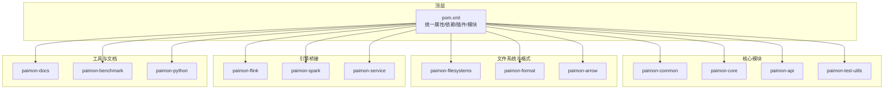
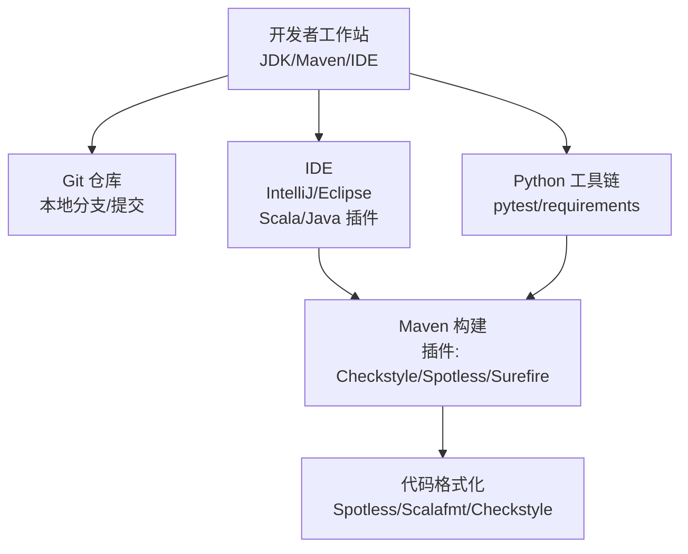
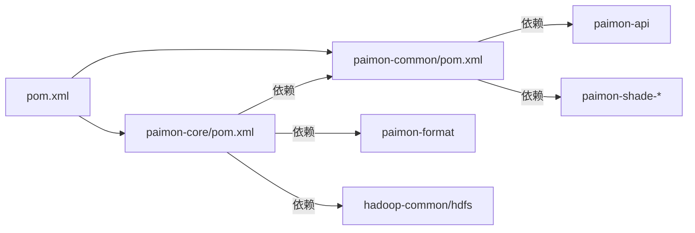

# 开发环境搭建

<cite>
**本文档引用的文件**
- [pom.xml](file://pom.xml)
- [README.md](file://README.md)
- [checkstyle.xml](file://tools/maven/checkstyle.xml)
- [.scalafmt.conf](file://.scalafmt.conf)
- [scalastyle-config.xml](file://tools/maven/scalastyle-config.xml)
- [suppressions.xml](file://tools/maven/suppressions.xml)
- [paimon-common/pom.xml](file://paimon-common/pom.xml)
- [paimon-core/pom.xml](file://paimon-core/pom.xml)
- [auto-check.sh](file://paimon-python/dev/auto-check.sh)
- [run_mixed_tests.sh](file://paimon-python/dev/run_mixed_tests.sh)
</cite>

## 目录
1. [简介](#简介)
2. [项目结构](#项目结构)
3. [核心组件](#核心组件)
4. [架构总览](#架构总览)
5. [详细组件分析](#详细组件分析)
6. [依赖关系分析](#依赖关系分析)
7. [性能考虑](#性能考虑)
8. [故障排除指南](#故障排除指南)
9. [结论](#结论)
10. [附录](#附录)

## 简介
本指南面向希望参与 Apache Paimon 项目的开发者，提供从零开始搭建开发环境的完整流程，涵盖 JDK 版本要求、Maven 配置、IDE 设置（IntelliJ IDEA 或 Eclipse）、项目克隆与导入、必要开发工具与插件（CheckStyle、Spotless、Scala 插件等）、不同操作系统的注意事项、Git 钩子与代码格式化配置，以及常见问题排查。

## 项目结构
Paimon 是一个多模块 Maven 项目，顶层 POM 定义了统一的版本、依赖管理与构建插件，并通过 profiles 控制不同运行时栈（Flink 1.x/2.x、Spark 3.x/4.x、Scala 2.12/2.13）的组合。核心模块包括通用库、核心引擎、文件系统适配器、格式支持、计算引擎桥接（Flink/Spark）、服务端组件、测试工具等。

图表来源
- [pom.xml:54-78](file://pom.xml#L54-L78)

章节来源
- [pom.xml:54-78](file://pom.xml#L54-L78)

## 核心组件
- 构建与版本控制：顶层 POM 统一管理版本号、Java 目标版本、Scala 版本、日志与测试框架等；通过 profiles 切换不同运行时栈。
- 代码质量工具：CheckStyle、Spotless、Scalastyle、Scalafmt 等，确保风格一致与可读性。
- 生成源码：ANTLR 用于语法解析生成，需在 IDE 中标记生成目录为 Sources Root。
- Python 测试与互操作：提供混合语言测试脚本，验证 Java 与 Python 的读写互通。

章节来源
- [pom.xml:80-171](file://pom.xml#L80-L171)
- [README.md:69-76](file://README.md#L69-L76)
- [paimon-common/pom.xml:275-291](file://paimon-common/pom.xml#L275-L291)

## 架构总览
下图展示了开发环境的关键要素与工具链交互：

图表来源
- [pom.xml:529-640](file://pom.xml#L529-L640)
- [.scalafmt.conf:1-71](file://.scalafmt.conf#L1-L71)
- [checkstyle.xml:1-592](file://tools/maven/checkstyle.xml#L1-L592)

## 详细组件分析

### JDK 与 Maven 要求
- JDK：构建要求 JDK 8 或 11（推荐 11），部分模块（如 Spark 4.x、Flink 2.x）默认目标 Java 版本提升至 11 或 17。
- Maven：要求版本 ≥3.6.3。
- 建议：使用 SDKMAN 或 jEnv 管理多版本 JDK，确保与项目 profile 匹配。

章节来源
- [README.md:71-71](file://README.md#L71-L71)
- [pom.xml:718-720](file://pom.xml#L718-L720)

### Maven 配置与 Profile
- 属性与版本：统一管理日志、测试框架、第三方库版本，避免依赖漂移。
- Profile：
  - flink1/flink2：切换 Flink 主版本与 Scala 版本。
  - spark3/spark4：切换 Spark 主版本与 Java/Scala 版本。
  - scala-2.13：切换 Scala 2.13。
  - paimon-iceberg：在 JDK 11 上启用特定模块。
  - fast-build：跳过检查以加速构建。
- 插件：
  - 编译：maven-compiler-plugin（配合 target.java.version）。
  - 检查：maven-checkstyle-plugin、maven-enforcer-plugin。
  - 格式化：com.diffplug.spotless:spotless-maven-plugin。
  - 测试：maven-surefire-plugin（含 fork、reuseForks、argLine 等参数）。

章节来源
- [pom.xml:80-171](file://pom.xml#L80-L171)
- [pom.xml:299-527](file://pom.xml#L299-L527)
- [pom.xml:529-701](file://pom.xml#L529-L701)

### 代码质量与格式化
- Spotless（Java/Scala）：统一代码风格，支持 apply 修复。
- CheckStyle（Java）：严格规则集，覆盖包名、导入顺序、命名、空白、注释等。
- Scalastyle（Scala）：行长度、类名、对象名、括号、换行等规则。
- Scalafmt（Scala）：与 IDE 对齐的格式化策略，最大列宽、import 分组、尾随逗号等。

章节来源
- [pom.xml:637-640](file://pom.xml#L637-L640)
- [checkstyle.xml:1-592](file://tools/maven/checkstyle.xml#L1-L592)
- [scalastyle-config.xml:1-147](file://tools/maven/scalastyle-config.xml#L1-L147)
- [.scalafmt.conf:1-71](file://.scalafmt.conf#L1-L71)

### ANTLR 生成源码与 IDE 标记
- paimon-common 使用 ANTLR 生成代码，输出到 target/generated-sources/antlr4，需在 IDE 中标记为 Sources Root。
- 参考路径：[paimon-common/pom.xml:285-287](file://paimon-common/pom.xml#L285-L287)

章节来源
- [paimon-common/pom.xml:275-291](file://paimon-common/pom.xml#L275-L291)
- [README.md:75-75](file://README.md#L75-L75)

### Python 开发与测试
- Python 工具链：pytest、requirements（位于 paimon-python/dev/requirements*.txt）。
- 自动检查脚本：auto-check.sh 使用 autopep8、autoflake、isort 统一 Python 代码风格。
- 混合语言测试：run_mixed_tests.sh 先执行 Java 写入/读取测试，再执行 Python 读取/写入测试，验证跨语言互操作。

章节来源
- [auto-check.sh:1-28](file://paimon-python/dev/auto-check.sh#L1-L28)
- [run_mixed_tests.sh:1-373](file://paimon-python/dev/run_mixed_tests.sh#L1-L373)

### Git 钩子与提交规范
- 仓库未内置 pre-commit 钩子脚本，建议在本地安装并配置以下工具：
  - Spotless apply（Java/Scala）
  - Checkstyle 扫描（Java）
  - Scalafmt 格式化（Scala）
  - Python 自动检查（auto-check.sh）
- 推荐流程：提交前执行 mvn spotless:apply，确保格式化一致；对 Java 运行 checkstyle:check；对 Scala/Python 执行对应格式化工具。

章节来源
- [pom.xml:637-640](file://pom.xml#L637-L640)
- [checkstyle.xml:1-592](file://tools/maven/checkstyle.xml#L1-L592)
- [.scalafmt.conf:1-71](file://.scalafmt.conf#L1-L71)
- [auto-check.sh:1-28](file://paimon-python/dev/auto-check.sh#L1-L28)

## 依赖关系分析

图表来源
- [pom.xml:54-78](file://pom.xml#L54-L78)
- [paimon-common/pom.xml:34-57](file://paimon-common/pom.xml#L34-L57)
- [paimon-core/pom.xml:38-56](file://paimon-core/pom.xml#L38-L56)

章节来源
- [paimon-common/pom.xml:34-57](file://paimon-common/pom.xml#L34-L57)
- [paimon-core/pom.xml:38-56](file://paimon-core/pom.xml#L38-L56)

## 性能考虑
- 构建性能：使用 fast-build profile 可跳过检查以加速迭代；生产发布时请关闭该 profile。
- 测试性能：Surefire 支持 forkCount 与 reuseForks，合理配置可减少 JVM 启动开销。
- 依赖最小化：Shade 插件对第三方库进行重定位与裁剪，降低运行时冲突风险。

章节来源
- [pom.xml:518-526](file://pom.xml#L518-L526)
- [pom.xml:642-701](file://pom.xml#L642-L701)
- [paimon-common/pom.xml:295-370](file://paimon-common/pom.xml#L295-L370)

## 故障排除指南
- JDK 版本不匹配
  - 现象：编译报错或 enforcer 失败。
  - 处理：确认当前 JDK 与 profile 的 target.java.version 一致；必要时切换 JDK。
  - 参考：[pom.xml:718-720](file://pom.xml#L718-L720)
- Maven 版本过低
  - 现象：构建失败提示需要更高版本。
  - 处理：升级 Maven 至 ≥3.6.3。
  - 参考：[pom.xml:714-717](file://pom.xml#L714-L717)
- ANTLR 生成源码未识别
  - 现象：IDE 报告找不到生成的类。
  - 处理：在 IDE 中将 paimon-common/target/generated-sources/antlr4 标记为 Sources Root。
  - 参考：[README.md:75-75](file://README.md#L75-L75)、[paimon-common/pom.xml:285-287](file://paimon-common/pom.xml#L285-L287)
- Checkstyle/Spotless/Scalafmt 冲突
  - 现象：CI 报告格式错误或本地与 CI 不一致。
  - 处理：先执行 mvn spotless:apply，再运行 checkstyle:check；确保 IDE 使用相同 Scalafmt 规则。
  - 参考：[pom.xml:637-640](file://pom.xml#L637-L640)、[checkstyle.xml:1-592](file://tools/maven/checkstyle.xml#L1-L592)、[scalastyle-config.xml:1-147](file://tools/maven/scalastyle-config.xml#L1-L147)、[.scalafmt.conf:1-71](file://.scalafmt.conf#L1-L71)
- Python 测试失败
  - 现象：run_mixed_tests.sh 执行失败。
  - 处理：检查 Python 依赖是否安装；按脚本顺序逐段运行，定位具体失败阶段；清理临时 warehouse 目录后重试。
  - 参考：[run_mixed_tests.sh:1-373](file://paimon-python/dev/run_mixed_tests.sh#L1-L373)

## 结论
按照本指南完成 JDK/Maven/IDE/工具链配置后，即可顺利克隆、构建与调试 Paimon 项目。建议在提交前统一执行格式化与静态检查，保持代码一致性；在多模块项目中优先使用 Maven 命令驱动构建，避免 IDE 导入差异导致的问题。

## 附录

### 操作系统注意事项
- Windows
  - 注意路径分隔符与大小写敏感性；确保 Maven 与 JDK 路径不含空格。
  - Git 钩子脚本需兼容 Windows Shell；建议使用 Git Bash 或 WSL。
- macOS
  - 使用 Homebrew 安装 Maven 与 Python；注意系统 Java 与自管 JDK 的切换。
  - Scalafmt/Scalastyle 在 IDE 中需与命令行行为一致。
- Linux
  - 使用发行版包管理器安装 Maven；确保 ulimit 与文件句柄数满足测试需求。
  - Docker/容器化测试需正确挂载工作目录与权限。

### IDE 设置（IntelliJ IDEA）
- 导入项目：选择根目录的 pom.xml，勾选“Use plugin registry”与“Import Maven projects automatically”。
- JDK 与 SDK：设置 Project SDK 为 JDK 8 或 11；Module SDK 依 profile 设置。
- 插件：安装 Scala、ANTLR and Grammar Kit、CheckStyle-IDEA、Spotless。
- ANTLR 生成目录：右键 paimon-common/target/generated-sources/antlr4 → “Sources Root”。

### IDE 设置（Eclipse）
- 导入：选择“Existing Maven Projects”，勾选“Resolve Workspace Projects”。
- JDK：在项目属性 → Java Build Path → Libraries 添加 JDK。
- 插件：安装 Xtend、Buildship（Maven 支持）、Checkstyle。

### 快速命令清单
- 清理并安装：mvn clean install -DskipTests
- 应用格式化：mvn spotless:apply
- 运行检查：mvn checkstyle:check
- 运行单元测试：mvn test
- 快速构建（跳过检查）：mvn -Pfast-build clean install