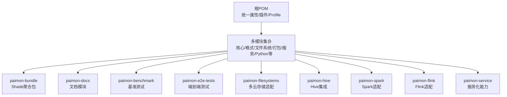
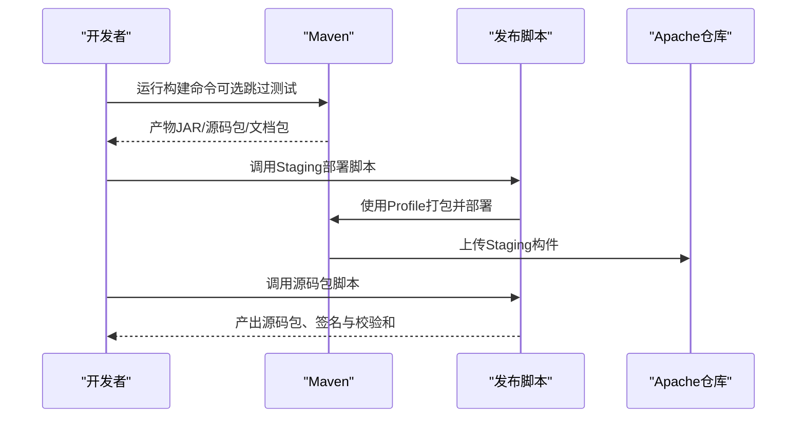
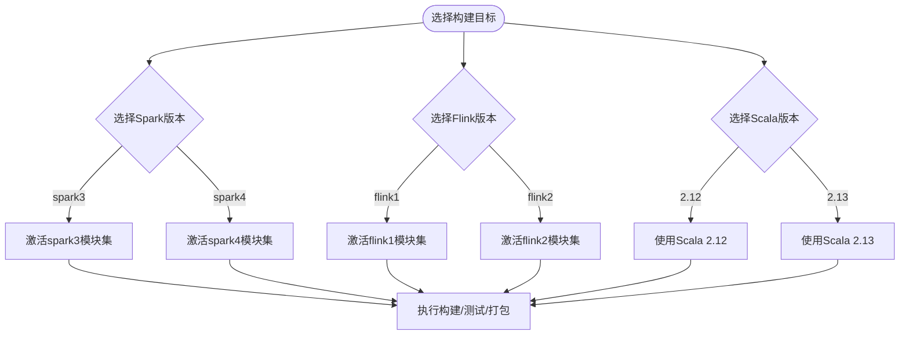
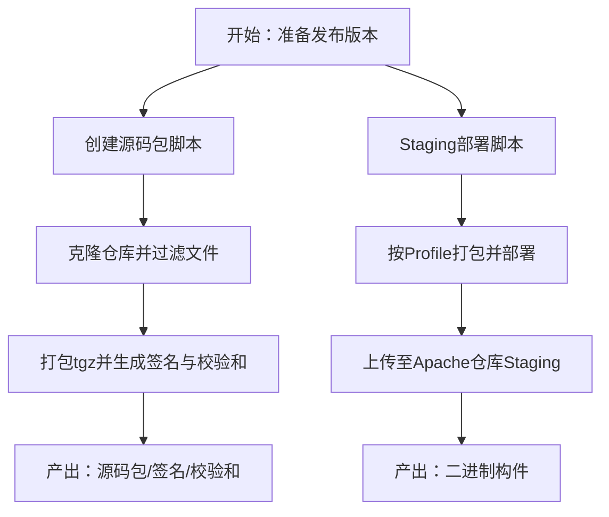
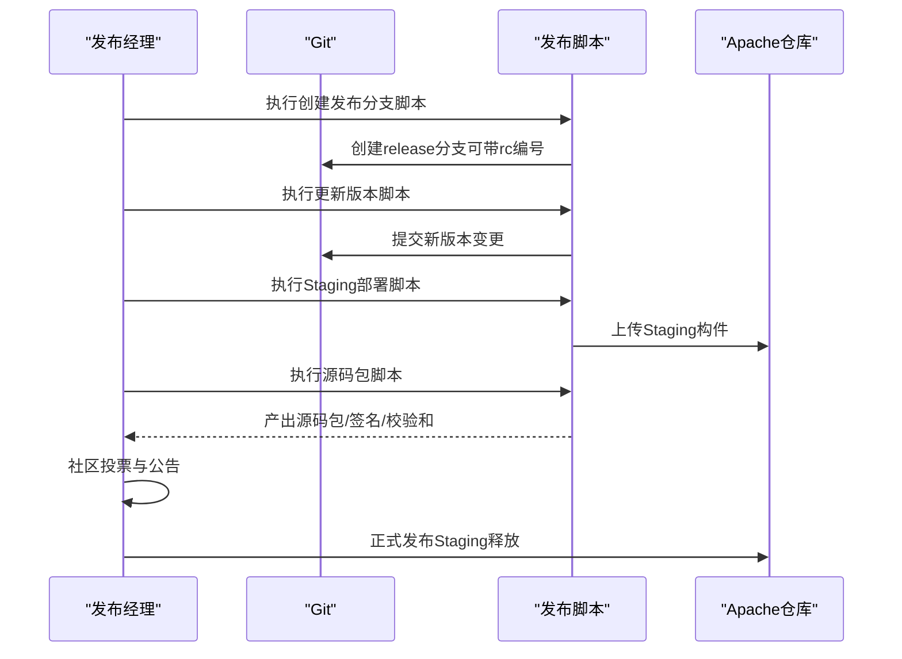
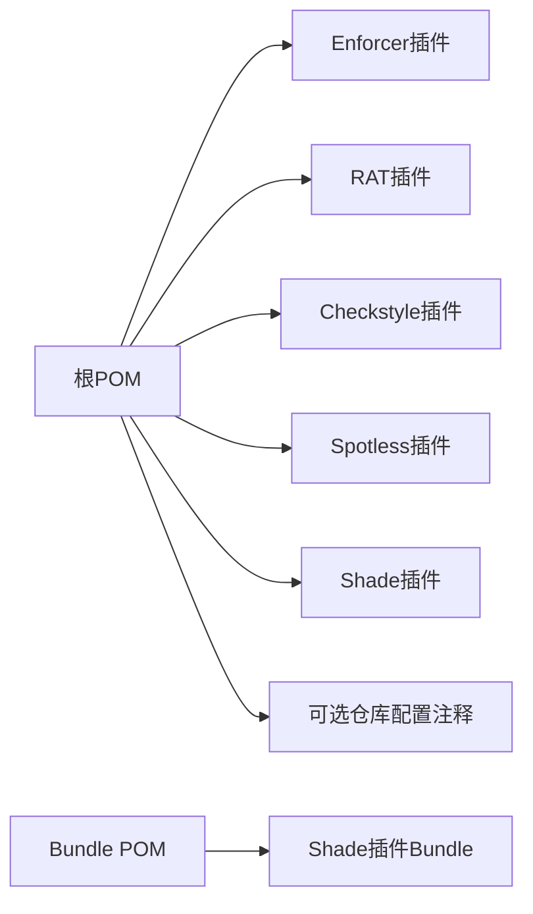

# 构建与部署

<cite>
**本文引用的文件**
- [根POM（pom.xml）](file://pom.xml)
- [源码发布脚本（create_source_release.sh）](file://tools/releasing/create_source_release.sh)
- [Staging发布脚本（deploy_staging_jars.sh）](file://tools/releasing/deploy_staging_jars.sh)
- [创建发布分支脚本（create_release_branch.sh）](file://tools/releasing/create_release_branch.sh)
- [更新分支版本脚本（update_branch_version.sh）](file://tools/releasing/update_branch_version.sh)
- [Bundle装配定义（src-assembly.xml）](file://paimon-bundle/src/assembly/src-assembly.xml)
- [Bundle模块POM（pom.xml）](file://paimon-bundle/pom.xml)
- [CI日志配置（log4j.properties）](file://tools/ci/log4j.properties)
- [ASF仓库配置示例（注释段落）](file://pom.xml)
- [项目自述（README.md）](file://README.md)
- [.asf.yaml配置](file://.asf.yaml)
</cite>

## 目录
1. [简介](#简介)
2. [项目结构](#项目结构)
3. [核心组件](#核心组件)
4. [架构总览](#架构总览)
5. [详细组件分析](#详细组件分析)
6. [依赖分析](#依赖分析)
7. [性能考虑](#性能考虑)
8. [故障排查指南](#故障排查指南)
9. [结论](#结论)
10. [附录](#附录)

## 简介
本指南面向Apache Paimon项目的构建与发布流程，覆盖以下主题：
- 构建流程：Maven命令、构建参数、多模块构建策略
- 打包与发布：源码包、二进制包的生成与校验
- 发布流程：Staging发布、投票流程、正式发布步骤
- CI/CD配置：GitHub Actions、Jenkins等流水线建议
- 环境部署：开发、测试、生产环境的差异化配置
- 构建优化与加速：快速构建、跳过检查、并行执行等

## 项目结构
Paimon采用多模块Maven聚合工程，根POM统一管理版本、插件与构建行为，并通过多个子模块实现功能拆分。关键特性：
- 多版本框架支持：通过Maven Profile切换Spark/Flink版本组合
- 统一代码风格与合规检查：Spotless、Checkstyle、RAT等
- Shade插件用于打包运行时依赖，避免依赖冲突
- 源码包与文档包的独立生成与签名

图表来源
- [根POM（pom.xml）第54-78行:54-78](file://pom.xml#L54-L78)
- [根POM（pom.xml）第299-527行:299-527](file://pom.xml#L299-L527)

章节来源
- [根POM（pom.xml）第54-78行:54-78](file://pom.xml#L54-L78)
- [根POM（pom.xml）第299-527行:299-527](file://pom.xml#L299-L527)

## 核心组件
- 构建与质量控制插件
  - 编译器、Checkstyle、Spotless、Surefire、Enforcer、RAT、Shade等
- Profile与多版本矩阵
  - spark3/spark4、flink1/flink2、scala-2.13等
- 发布与打包工具链
  - 源码包脚本、Staging部署脚本、Bundle装配

章节来源
- [根POM（pom.xml）第529-924行:529-924](file://pom.xml#L529-L924)
- [根POM（pom.xml）第926-1138行:926-1138](file://pom.xml#L926-L1138)

## 架构总览
下图展示从本地构建到Staging发布的整体流程，以及源码包与二进制包的生成路径。

图表来源
- [根POM（pom.xml）第307-331行:307-331](file://pom.xml#L307-L331)
- [根POM（pom.xml）第333-377行:333-377](file://pom.xml#L333-L377)
- [Staging发布脚本（deploy_staging_jars.sh）第45行](file://tools/releasing/deploy_staging_jars.sh#L45)
- [源码发布脚本（create_source_release.sh）第80-83行:80-83](file://tools/releasing/create_source_release.sh#L80-L83)

## 详细组件分析

### 构建命令与参数
- 基础构建
  - 清理安装：使用根POM进行多模块构建，推荐先清理再安装
  - 示例命令：在仓库根目录执行Maven命令
- 跳过测试
  - 在需要快速验证时，可通过参数跳过测试阶段
- 快速构建Profile
  - 启用fast-build以跳过Checkstyle、Spotless、Scalastyle、RAT、Enforcer等检查，显著提升构建速度
- 版本与兼容性
  - JDK 8/11要求；Maven版本≥3.6.3
- 代码格式化
  - 提供格式化命令以统一Java与Scala代码风格

章节来源
- [项目自述（README.md）第69-76行:69-76](file://README.md#L69-L76)
- [根POM（pom.xml）第518-526行:518-526](file://pom.xml#L518-L526)

### 多模块构建与Profile矩阵
- Spark版本矩阵
  - spark3：默认激活，包含Spark 3.2/3.3/3.4/3.5系列模块
  - spark4：可选，包含Spark 4.0系列模块
- Flink版本矩阵
  - flink1：默认激活，包含Flink 1.16/1.17/1.18/1.19/1.20系列模块
  - flink2：可选，包含Flink 2.0/2.1/2.2系列模块
- Scala版本
  - 默认使用Scala 2.12；可通过scala-2.13 Profile切换
- 其他特性Profile
  - paimon-iceberg：在JDK 11下启用Iceberg模块
  - fast-build：跳过多项质量检查

图表来源
- [根POM（pom.xml）第399-447行:399-447](file://pom.xml#L399-L447)
- [根POM（pom.xml）第449-492行:449-492](file://pom.xml#L449-L492)
- [根POM（pom.xml）第494-505行:494-505](file://pom.xml#L494-L505)

章节来源
- [根POM（pom.xml）第399-447行:399-447](file://pom.xml#L399-L447)
- [根POM（pom.xml）第449-492行:449-492](file://pom.xml#L449-L492)
- [根POM（pom.xml）第494-505行:494-505](file://pom.xml#L494-L505)

### 源码包与二进制包
- 源码包
  - 使用专用脚本创建“纯净”源码包，排除非必要文件，生成签名与SHA512校验和
  - 产物位于release目录，命名规范包含版本号
- 二进制包
  - 通过Staging部署脚本，结合多Profile打包并上传至Apache仓库Staging区域
  - Bundle模块可生成Shade聚合包，便于运行时使用

图表来源
- [源码发布脚本（create_source_release.sh）第66-83行:66-83](file://tools/releasing/create_source_release.sh#L66-L83)
- [Staging发布脚本（deploy_staging_jars.sh）第44-45行:44-45](file://tools/releasing/deploy_staging_jars.sh#L44-L45)

章节来源
- [源码发布脚本（create_source_release.sh）第66-83行:66-83](file://tools/releasing/create_source_release.sh#L66-L83)
- [Staging发布脚本（deploy_staging_jars.sh）第44-45行:44-45](file://tools/releasing/deploy_staging_jars.sh#L44-L45)
- [Bundle装配定义（src-assembly.xml）第19-37行:19-37](file://paimon-bundle/src/assembly/src-assembly.xml#L19-L37)
- [Bundle模块POM（pom.xml）第147-211行:147-211](file://paimon-bundle/pom.xml#L147-L211)

### 发布流程（Staging、投票、正式发布）
- 创建发布分支
  - 依据版本号创建release分支，RC候选版本可追加rc编号
- 更新版本
  - 使用版本更新脚本批量修改所有POM中的版本号并提交
- Staging发布
  - 调用Staging部署脚本，使用apache-release、docs-and-source、spark3、flink1等Profile打包并部署
- 源码包生成
  - 使用源码发布脚本生成源码包、签名与校验和
- 投票与正式发布
  - 通过社区投票后，将Staging构件释放至中央仓库

图表来源
- [创建发布分支脚本（create_release_branch.sh）第51-57行:51-57](file://tools/releasing/create_release_branch.sh#L51-L57)
- [更新分支版本脚本（update_branch_version.sh）第53-56行:53-56](file://tools/releasing/update_branch_version.sh#L53-L56)
- [Staging发布脚本（deploy_staging_jars.sh）第44-45行:44-45](file://tools/releasing/deploy_staging_jars.sh#L44-L45)
- [源码发布脚本（create_source_release.sh）第80-83行:80-83](file://tools/releasing/create_source_release.sh#L80-L83)

章节来源
- [创建发布分支脚本（create_release_branch.sh）第51-57行:51-57](file://tools/releasing/create_release_branch.sh#L51-L57)
- [更新分支版本脚本（update_branch_version.sh）第53-56行:53-56](file://tools/releasing/update_branch_version.sh#L53-L56)
- [Staging发布脚本（deploy_staging_jars.sh）第44-45行:44-45](file://tools/releasing/deploy_staging_jars.sh#L44-L45)
- [源码发布脚本（create_source_release.sh）第80-83行:80-83](file://tools/releasing/create_source_release.sh#L80-L83)

### CI/CD配置建议
- GitHub Actions
  - 建议在工作流中复用根POM的Profile与构建参数，确保与本地一致
  - 可设置缓存以加速依赖下载
- Jenkins
  - 使用Maven参数传递Profile与构建选项，结合Staging部署脚本完成发布
- 日志与输出
  - 可参考CI日志配置文件，统一控制台与文件日志输出

章节来源
- [CI日志配置（log4j.properties）第19-44行:19-44](file://tools/ci/log4j.properties#L19-L44)
- [.asf.yaml配置:20-47](file://.asf.yaml#L20-L47)

### 环境部署差异
- 开发环境
  - 本地构建优先使用fast-build Profile以提升效率
  - 配置IDE源根与生成目录，确保编译与测试顺利
- 测试环境
  - 使用标准Profile矩阵进行多版本验证
  - 结合端到端测试模块进行集成验证
- 生产环境
  - 使用Staging部署的稳定构件
  - 通过源码包与校验和进行完整性核验

章节来源
- [根POM（pom.xml）第518-526行:518-526](file://pom.xml#L518-L526)
- [项目自述（README.md）第69-76行:69-76](file://README.md#L69-L76)

## 依赖分析
- 插件与质量控制
  - Enforcer用于强制Maven与Java版本；RAT确保许可证合规；Checkstyle/Spotless保证代码风格
- Shade插件
  - 在根POM与Bundle模块中均使用，用于合并依赖并生成可运行的聚合包
- 仓库与网络
  - 根POM提供了可选的Apache仓库配置注释，便于在需要时下载快照或特定依赖

图表来源
- [根POM（pom.xml）第706-811行:706-811](file://pom.xml#L706-L811)
- [根POM（pom.xml）第813-885行:813-885](file://pom.xml#L813-L885)
- [根POM（pom.xml）第1065-1070行:1065-1070](file://pom.xml#L1065-L1070)
- [Bundle模块POM（pom.xml）第100-144行:100-144](file://paimon-bundle/pom.xml#L100-L144)

章节来源
- [根POM（pom.xml）第706-811行:706-811](file://pom.xml#L706-L811)
- [根POM（pom.xml）第813-885行:813-885](file://pom.xml#L813-L885)
- [根POM（pom.xml）第1065-1070行:1065-1070](file://pom.xml#L1065-L1070)
- [Bundle模块POM（pom.xml）第100-144行:100-144](file://paimon-bundle/pom.xml#L100-L144)

## 性能考虑
- 快速构建
  - 启用fast-build Profile以跳过多项质量检查，显著缩短构建时间
- 并行与重用
  - Surefire插件配置了fork与重用策略，减少JVM启动开销
- 依赖缓存
  - 在CI环境中启用Maven本地与远程缓存，降低依赖下载时间
- 选择性模块
  - 仅构建所需模块，避免不必要的子模块参与

章节来源
- [根POM（pom.xml）第518-526行:518-526](file://pom.xml#L518-L526)
- [根POM（pom.xml）第642-701行:642-701](file://pom.xml#L642-L701)

## 故障排查指南
- 构建失败（许可证/RAT）
  - 确认RAT规则与排除列表符合预期，必要时调整排除范围
- 依赖冲突
  - 使用Shade插件合并依赖，避免META-INF签名与配置冲突
- Java版本不匹配
  - 确保本地JDK满足根POM中的target版本要求
- CI日志定位
  - 使用CI日志配置文件统一输出，便于问题定位与归档

章节来源
- [根POM（pom.xml）第556-635行:556-635](file://pom.xml#L556-L635)
- [根POM（pom.xml）第823-882行:823-882](file://pom.xml#L823-L882)
- [CI日志配置（log4j.properties）第19-44行:19-44](file://tools/ci/log4j.properties#L19-L44)

## 结论
本指南总结了Apache Paimon的构建与发布实践，涵盖多模块构建、Profile矩阵、源码与二进制包生成、Staging发布与投票流程、CI/CD配置建议及环境差异。遵循本文流程与最佳实践，可高效、稳定地完成版本交付。

## 附录
- 关键命令与脚本
  - 源码包：参见源码发布脚本
  - Staging发布：参见Staging部署脚本
  - 分支与版本：参见创建发布分支与更新版本脚本
- 参考配置
  - CI日志配置、ASF仓库配置注释段落

章节来源
- [源码发布脚本（create_source_release.sh）第66-83行:66-83](file://tools/releasing/create_source_release.sh#L66-L83)
- [Staging发布脚本（deploy_staging_jars.sh）第44-45行:44-45](file://tools/releasing/deploy_staging_jars.sh#L44-L45)
- [创建发布分支脚本（create_release_branch.sh）第51-57行:51-57](file://tools/releasing/create_release_branch.sh#L51-L57)
- [更新分支版本脚本（update_branch_version.sh）第53-56行:53-56](file://tools/releasing/update_branch_version.sh#L53-L56)
- [CI日志配置（log4j.properties）第19-44行:19-44](file://tools/ci/log4j.properties#L19-L44)
- [ASF仓库配置示例（注释段落）:1141-1172](file://pom.xml#L1141-L1172)