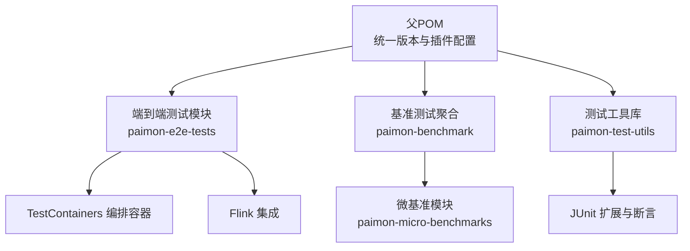
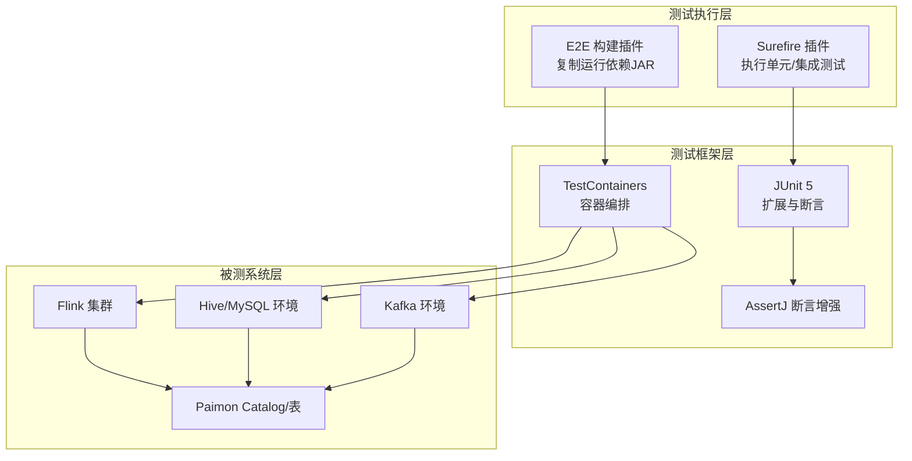
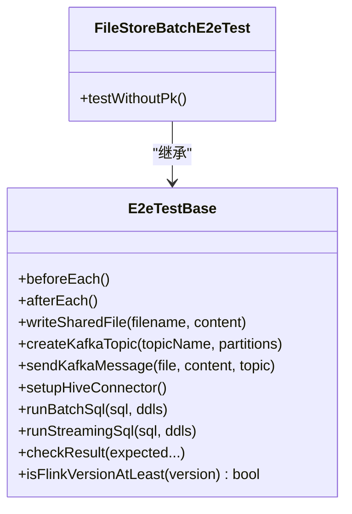
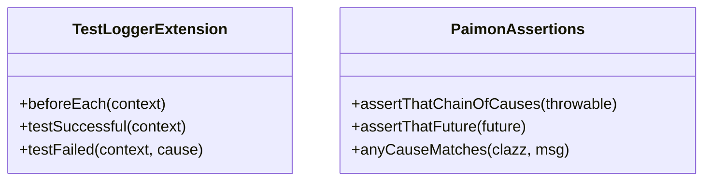
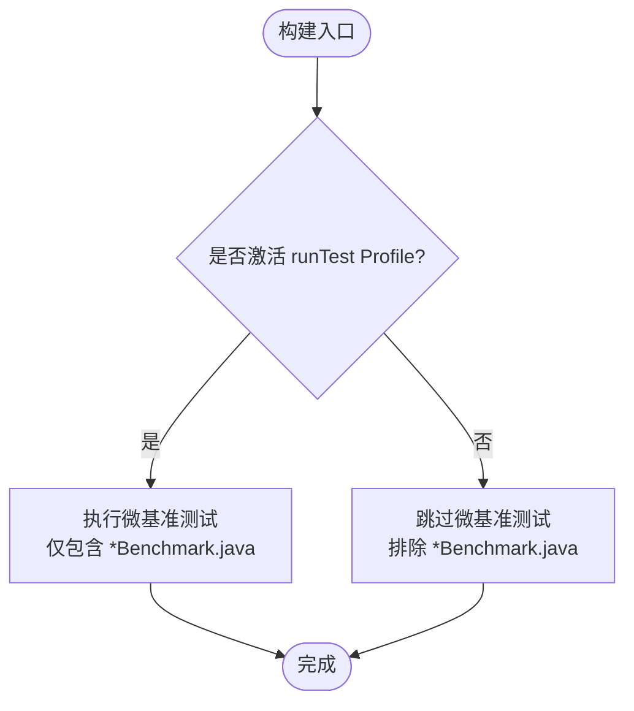
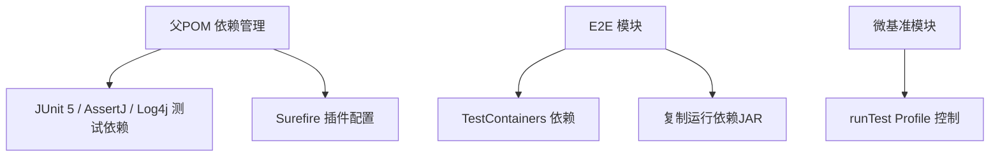

# 测试指南

<cite>
**本文引用的文件**   
- [pom.xml](file://pom.xml)
- [paimon-e2e-tests/pom.xml](file://paimon-e2e-tests/pom.xml)
- [paimon-benchmark/pom.xml](file://paimon-benchmark/pom.xml)
- [paimon-micro-benchmarks/pom.xml](file://paimon-micro-benchmarks/pom.xml)
- [paimon-e2e-tests/src/test/java/org/apache/paimon/tests/E2eTestBase.java](file://paimon-e2e-tests/src/test/java/org/apache/paimon/tests/E2eTestBase.java)
- [paimon-e2e-tests/src/test/java/org/apache/paimon/tests/FileStoreBatchE2eTest.java](file://paimon-e2e-tests/src/test/java/org/apache/paimon/tests/FileStoreBatchE2eTest.java)
- [paimon-test-utils/src/main/java/org/apache/paimon/testutils/junit/TestLoggerExtension.java](file://paimon-test-utils/src/main/java/org/apache/paimon/testutils/junit/TestLoggerExtension.java)
- [paimon-test-utils/src/main/java/org/apache/paimon/testutils/assertj/PaimonAssertions.java](file://paimon-test-utils/src/main/java/org/apache/paimon/testutils/assertj/PaimonAssertions.java)
</cite>

## 目录
1. [引言](#引言)
2. [项目结构](#项目结构)
3. [核心组件](#核心组件)
4. [架构总览](#架构总览)
5. [详细组件分析](#详细组件分析)
6. [依赖分析](#依赖分析)
7. [性能考虑](#性能考虑)
8. [故障排查指南](#故障排查指南)
9. [结论](#结论)
10. [附录](#附录)

## 引言
本测试指南面向Apache Paimon项目，系统阐述测试架构与实践，覆盖单元测试、集成测试与端到端测试（E2E）的组织方式与执行策略；介绍测试工具链（JUnit 5、AssertJ、TestContainers等）的使用；给出测试数据准备与管理、测试用例设计原则与最佳实践；说明单测与批量测试的运行方法，以及在持续集成中的测试执行流程；并提供性能与基准测试方法，涵盖paimon-benchmark模块的使用；最后讨论测试覆盖率要求与提升测试质量的建议。

## 项目结构
Apache Paimon采用多模块Maven工程组织，测试相关的关键模块如下：
- 父POM：统一版本与插件配置，定义测试执行策略（Surefire）
- paimon-e2e-tests：端到端测试模块，基于TestContainers编排Flink、可选Kafka/Hive/Spark环境
- paimon-test-utils：测试工具库，包含JUnit扩展与AssertJ断言增强
- paimon-benchmark：基准测试聚合模块，包含集群基准与微基准
- 各子模块的test目录：单元测试与集成测试

**图表来源**
- [pom.xml:54-78](file://pom.xml#L54-L78)
- [paimon-e2e-tests/pom.xml:1-371](file://paimon-e2e-tests/pom.xml#L1-371)
- [paimon-benchmark/pom.xml:1-51](file://paimon-benchmark/pom.xml#L1-51)
- [paimon-test-utils/pom.xml:1-89](file://paimon-test-utils/pom.xml#L1-89)

**章节来源**
- [pom.xml:54-78](file://pom.xml#L54-L78)
- [paimon-e2e-tests/pom.xml:1-371](file://paimon-e2e-tests/pom.xml#L1-L371)
- [paimon-benchmark/pom.xml:1-51](file://paimon-benchmark/pom.xml#L1-L51)
- [paimon-test-utils/pom.xml:1-89](file://paimon-test-utils/pom.xml#L1-L89)

## 核心组件
- 测试执行器与生命周期
  - 父POM通过Surefire插件定义默认单元测试与集成测试执行阶段与模式，支持Junit 5扩展自动发现
  - E2E模块通过自定义资源与容器编排，提供真实运行时环境
- 断言与日志
  - 使用AssertJ进行可读性更强的断言
  - 提供JUnit 5扩展以记录测试开始/结束与失败堆栈
- 基准测试
  - 聚合模块包含集群基准与微基准，微基准模块通过独立profile控制是否纳入常规构建

**章节来源**
- [pom.xml:642-701](file://pom.xml#L642-L701)
- [paimon-test-utils/src/main/java/org/apache/paimon/testutils/junit/TestLoggerExtension.java:30-84](file://paimon-test-utils/src/main/java/org/apache/paimon/testutils/junit/TestLoggerExtension.java#L30-L84)
- [paimon-test-utils/src/main/java/org/apache/paimon/testutils/assertj/PaimonAssertions.java:32-155](file://paimon-test-utils/src/main/java/org/apache/paimon/testutils/assertj/PaimonAssertions.java#L32-L155)
- [paimon-benchmark/pom.xml:36-39](file://paimon-benchmark/pom.xml#L36-L39)

## 架构总览
下图展示测试体系在不同层次的交互关系与职责划分：

**图表来源**
- [pom.xml:642-701](file://pom.xml#L642-L701)
- [paimon-e2e-tests/pom.xml:133-281](file://paimon-e2e-tests/pom.xml#L133-L281)
- [paimon-test-utils/src/main/java/org/apache/paimon/testutils/junit/TestLoggerExtension.java:30-84](file://paimon-test-utils/src/main/java/org/apache/paimon/testutils/junit/TestLoggerExtension.java#L30-L84)
- [paimon-test-utils/src/main/java/org/apache/paimon/testutils/assertj/PaimonAssertions.java:32-155](file://paimon-test-utils/src/main/java/org/apache/paimon/testutils/assertj/PaimonAssertions.java#L32-L155)

## 详细组件分析

### 组件A：端到端测试基类与示例
- E2eTestBase负责：
  - 基于Compose启动Flink JobManager/TaskManager，并按需启动Kafka/Hive/Spark服务
  - 提供写共享文件、提交SQL、解析结果、版本判断等通用能力
  - 使用TestContainers日志消费与等待策略，确保环境就绪
- 示例测试FileStoreBatchE2eTest展示了：
  - 文件系统源写入Paimon表
  - 分区过滤、值过滤、聚合查询等场景
  - 使用打印结果接收器校验最终输出

**图表来源**
- [paimon-e2e-tests/src/test/java/org/apache/paimon/tests/E2eTestBase.java:54-447](file://paimon-e2e-tests/src/test/java/org/apache/paimon/tests/E2eTestBase.java#L54-L447)
- [paimon-e2e-tests/src/test/java/org/apache/paimon/tests/FileStoreBatchE2eTest.java:31-184](file://paimon-e2e-tests/src/test/java/org/apache/paimon/tests/FileStoreBatchE2eTest.java#L31-L184)

**章节来源**
- [paimon-e2e-tests/src/test/java/org/apache/paimon/tests/E2eTestBase.java:54-447](file://paimon-e2e-tests/src/test/java/org/apache/paimon/tests/E2eTestBase.java#L54-L447)
- [paimon-e2e-tests/src/test/java/org/apache/paimon/tests/FileStoreBatchE2eTest.java:31-184](file://paimon-e2e-tests/src/test/java/org/apache/paimon/tests/FileStoreBatchE2eTest.java#L31-L184)

### 组件B：测试工具库（JUnit扩展与断言）
- TestLoggerExtension：在测试开始前输出测试类/方法信息，在成功/失败时分别记录成功与异常堆栈，便于CI日志定位
- PaimonAssertions：提供链式异常断言、Future断言等，简化复杂异步场景的断言表达

**图表来源**
- [paimon-test-utils/src/main/java/org/apache/paimon/testutils/junit/TestLoggerExtension.java:30-84](file://paimon-test-utils/src/main/java/org/apache/paimon/testutils/junit/TestLoggerExtension.java#L30-L84)
- [paimon-test-utils/src/main/java/org/apache/paimon/testutils/assertj/PaimonAssertions.java:32-155](file://paimon-test-utils/src/main/java/org/apache/paimon/testutils/assertj/PaimonAssertions.java#L32-L155)

**章节来源**
- [paimon-test-utils/src/main/java/org/apache/paimon/testutils/junit/TestLoggerExtension.java:30-84](file://paimon-test-utils/src/main/java/org/apache/paimon/testutils/junit/TestLoggerExtension.java#L30-L84)
- [paimon-test-utils/src/main/java/org/apache/paimon/testutils/assertj/PaimonAssertions.java:32-155](file://paimon-test-utils/src/main/java/org/apache/paimon/testutils/assertj/PaimonAssertions.java#L32-L155)

### 组件C：基准测试模块
- paimon-benchmark聚合模块：包含集群基准与微基准两个子模块
- paimon-micro-benchmarks：
  - 通过独立profile控制是否执行微基准
  - 正常构建时排除*.Benchmark测试，避免干扰常规测试
  - 提供独立的Surefire执行配置，仅运行以Benchmark命名的测试类

**图表来源**
- [paimon-benchmark/pom.xml:36-39](file://paimon-benchmark/pom.xml#L36-L39)
- [paimon-micro-benchmarks/pom.xml:165-191](file://paimon-micro-benchmarks/pom.xml#L165-L191)
- [paimon-micro-benchmarks/pom.xml:203-222](file://paimon-micro-benchmarks/pom.xml#L203-L222)

**章节来源**
- [paimon-benchmark/pom.xml:1-51](file://paimon-benchmark/pom.xml#L1-L51)
- [paimon-micro-benchmarks/pom.xml:165-191](file://paimon-micro-benchmarks/pom.xml#L165-L191)
- [paimon-micro-benchmarks/pom.xml:203-222](file://paimon-micro-benchmarks/pom.xml#L203-L222)

## 依赖分析
- 父POM集中管理测试依赖与插件：
  - JUnit 5、AssertJ、Log4j测试实现等
  - Surefire插件配置区分单元测试与集成测试
- E2E模块依赖：
  - TestContainers、Kafka/MySQL CDC等外部组件
  - 运行期复制各组件JAR至临时目录，供容器内使用
- 微基准模块：
  - 通过独立profile启用，避免影响常规构建

**图表来源**
- [pom.xml:173-228](file://pom.xml#L173-L228)
- [pom.xml:642-701](file://pom.xml#L642-L701)
- [paimon-e2e-tests/pom.xml:133-281](file://paimon-e2e-tests/pom.xml#L133-L281)
- [paimon-micro-benchmarks/pom.xml:165-191](file://paimon-micro-benchmarks/pom.xml#L165-L191)

**章节来源**
- [pom.xml:173-228](file://pom.xml#L173-L228)
- [pom.xml:642-701](file://pom.xml#L642-L701)
- [paimon-e2e-tests/pom.xml:133-281](file://paimon-e2e-tests/pom.xml#L133-L281)
- [paimon-micro-benchmarks/pom.xml:165-191](file://paimon-micro-benchmarks/pom.xml#L165-L191)

## 性能考虑
- 微基准测试
  - 使用独立profile与排除规则，避免常规构建被微基准干扰
  - 通过专用插件执行，保证测试隔离与可重复性
- 端到端测试
  - 通过容器化环境模拟生产级组件，确保跨组件行为一致性
  - 合理设置超时与重试，平衡稳定性与执行效率
- 日志与诊断
  - 使用TestLoggerExtension统一记录测试生命周期日志
  - 利用PaimonAssertions的链式断言快速定位异常根因

**章节来源**
- [paimon-micro-benchmarks/pom.xml:165-191](file://paimon-micro-benchmarks/pom.xml#L165-L191)
- [paimon-micro-benchmarks/pom.xml:203-222](file://paimon-micro-benchmarks/pom.xml#L203-L222)
- [paimon-test-utils/src/main/java/org/apache/paimon/testutils/junit/TestLoggerExtension.java:30-84](file://paimon-test-utils/src/main/java/org/apache/paimon/testutils/junit/TestLoggerExtension.java#L30-L84)
- [paimon-test-utils/src/main/java/org/apache/paimon/testutils/assertj/PaimonAssertions.java:32-155](file://paimon-test-utils/src/main/java/org/apache/paimon/testutils/assertj/PaimonAssertions.java#L32-L155)

## 故障排查指南
- 容器启动与等待
  - 若Flink未注册或TaskManager未注册，检查容器日志与等待策略配置
  - Kafka/Hive/Spark服务启动日志可通过TestContainers日志消费者查看
- SQL提交与结果校验
  - 使用打印结果接收器标识符匹配输出，结合重试机制验证最终一致性
  - 对于版本差异，使用Flink版本判断逻辑选择兼容路径
- 异常根因定位
  - 使用PaimonAssertions提供的链式断言，快速提取异常链并断言期望类型与消息片段
- 日志与调试
  - 启用TestLoggerExtension，确保测试开始/结束与失败堆栈完整输出

**章节来源**
- [paimon-e2e-tests/src/test/java/org/apache/paimon/tests/E2eTestBase.java:91-172](file://paimon-e2e-tests/src/test/java/org/apache/paimon/tests/E2eTestBase.java#L91-L172)
- [paimon-e2e-tests/src/test/java/org/apache/paimon/tests/E2eTestBase.java:250-293](file://paimon-e2e-tests/src/test/java/org/apache/paimon/tests/E2eTestBase.java#L250-L293)
- [paimon-e2e-tests/src/test/java/org/apache/paimon/tests/E2eTestBase.java:316-380](file://paimon-e2e-tests/src/test/java/org/apache/paimon/tests/E2eTestBase.java#L316-L380)
- [paimon-test-utils/src/main/java/org/apache/paimon/testutils/assertj/PaimonAssertions.java:116-128](file://paimon-test-utils/src/main/java/org/apache/paimon/testutils/assertj/PaimonAssertions.java#L116-L128)
- [paimon-test-utils/src/main/java/org/apache/paimon/testutils/junit/TestLoggerExtension.java:34-66](file://paimon-test-utils/src/main/java/org/apache/paimon/testutils/junit/TestLoggerExtension.java#L34-L66)

## 结论
Apache Paimon的测试体系以父POM统一测试策略为核心，配合E2E容器化编排、AssertJ断言增强与JUnit 5扩展，形成从单元到端到端的完整测试闭环。基准测试通过独立模块与profile实现与常规构建解耦。遵循本文的测试组织、工具使用与最佳实践，可在保证质量的同时提升测试效率与可维护性。

## 附录

### A. 测试工具与版本
- JUnit 5：测试引擎与扩展
- AssertJ：可读性强的断言库
- TestContainers：容器化环境编排
- Log4j：测试日志实现

**章节来源**
- [pom.xml:187-228](file://pom.xml#L187-L228)
- [paimon-test-utils/pom.xml:34-71](file://paimon-test-utils/pom.xml#L34-L71)

### B. 运行测试与CI执行
- 单元测试与集成测试
  - 通过父POM的Surefire插件在test与integration-test阶段分别执行
  - 默认包含以Test结尾的类，集成测试排除单元测试模式
- 端到端测试
  - 构建时复制运行依赖JAR至临时目录，供容器内使用
  - 可按需启用Kafka/Hive/Spark服务
- 基准测试
  - 通过runTest profile仅执行微基准测试类

**章节来源**
- [pom.xml:642-701](file://pom.xml#L642-L701)
- [paimon-e2e-tests/pom.xml:133-281](file://paimon-e2e-tests/pom.xml#L133-L281)
- [paimon-micro-benchmarks/pom.xml:165-191](file://paimon-micro-benchmarks/pom.xml#L165-L191)

### C. 测试数据准备与管理
- E2E测试通过共享文件机制向容器写入数据与SQL脚本
- 使用打印结果接收器收集输出，再由测试断言校验
- 对于分区表与过滤条件，建议构造覆盖边界与典型场景的数据集

**章节来源**
- [paimon-e2e-tests/src/test/java/org/apache/paimon/tests/E2eTestBase.java:174-196](file://paimon-e2e-tests/src/test/java/org/apache/paimon/tests/E2eTestBase.java#L174-L196)
- [paimon-e2e-tests/src/test/java/org/apache/paimon/tests/FileStoreBatchE2eTest.java:56-181](file://paimon-e2e-tests/src/test/java/org/apache/paimon/tests/FileStoreBatchE2eTest.java#L56-L181)

### D. 测试用例设计原则与最佳实践
- 单元测试：关注小范围、高内聚功能，优先使用Mock与最小化依赖
- 集成测试：验证模块间接口与协作，尽量减少外部依赖
- 端到端测试：覆盖真实业务流，确保跨组件协同正确性
- 断言：使用AssertJ链式断言，明确错误上下文
- 日志：统一使用TestLoggerExtension记录测试生命周期
- 可重复性：通过固定随机种子与稳定环境配置提升可重复性

**章节来源**
- [paimon-test-utils/src/main/java/org/apache/paimon/testutils/junit/TestLoggerExtension.java:30-84](file://paimon-test-utils/src/main/java/org/apache/paimon/testutils/junit/TestLoggerExtension.java#L30-L84)
- [paimon-test-utils/src/main/java/org/apache/paimon/testutils/assertj/PaimonAssertions.java:32-155](file://paimon-test-utils/src/main/java/org/apache/paimon/testutils/assertj/PaimonAssertions.java#L32-L155)

### E. 性能与基准测试方法
- 微基准：通过runTest profile启用，仅运行以Benchmark命名的测试类
- 集群基准：在集群基准模块中编写与执行
- 建议：在本地与CI中分别运行微基准，对比历史结果评估回归

**章节来源**
- [paimon-benchmark/pom.xml:36-39](file://paimon-benchmark/pom.xml#L36-L39)
- [paimon-micro-benchmarks/pom.xml:165-191](file://paimon-micro-benchmarks/pom.xml#L165-L191)
- [paimon-micro-benchmarks/pom.xml:203-222](file://paimon-micro-benchmarks/pom.xml#L203-L222)