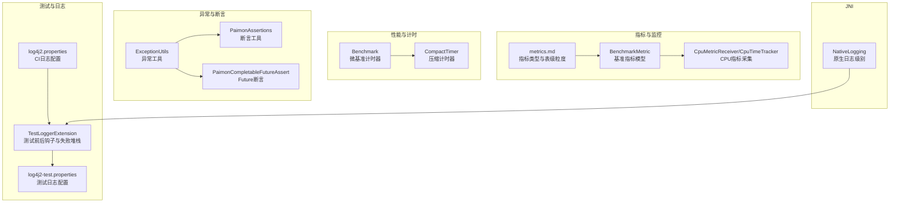
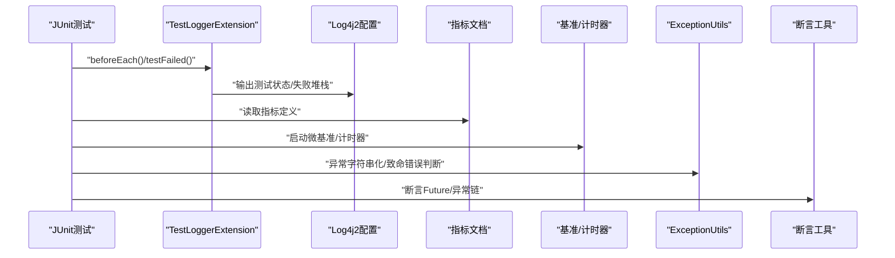
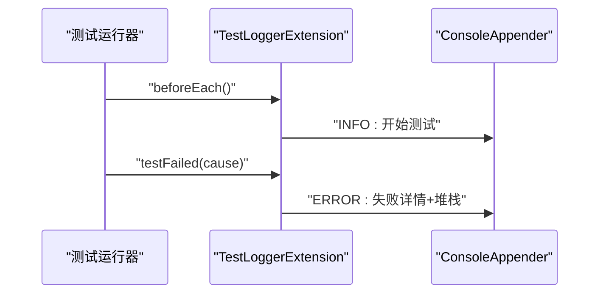
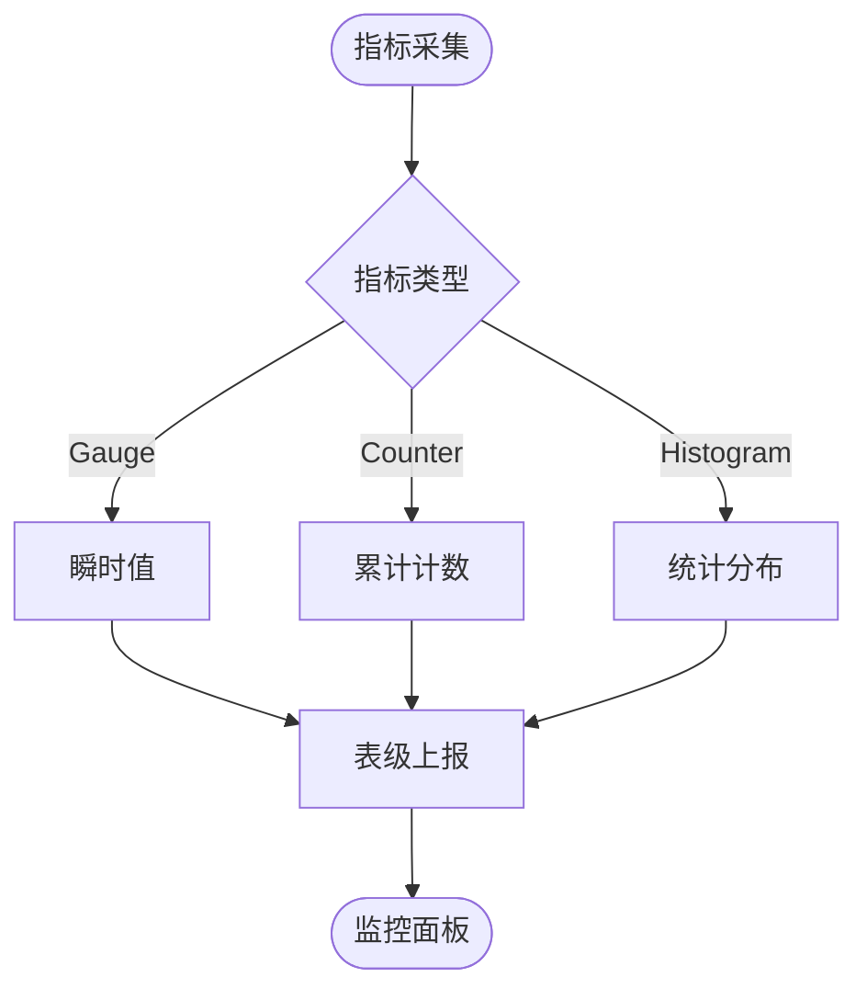
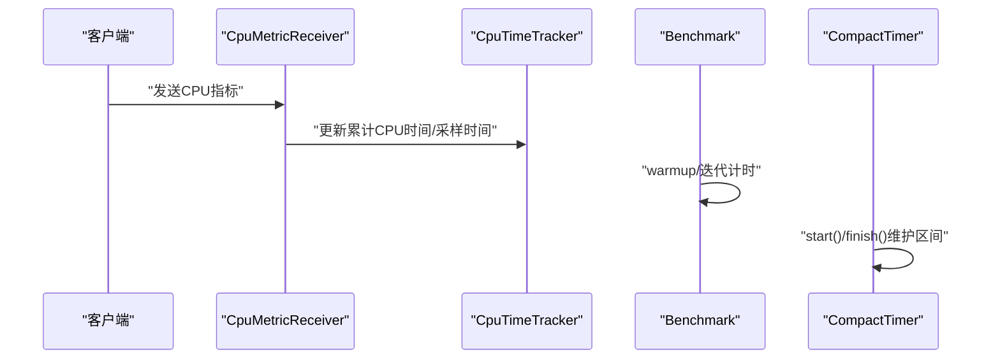
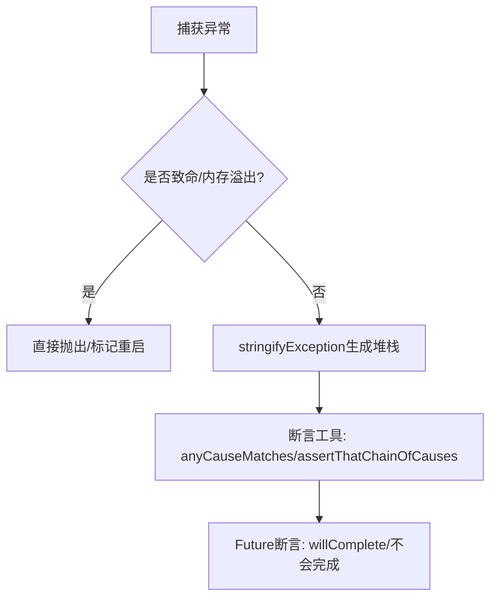
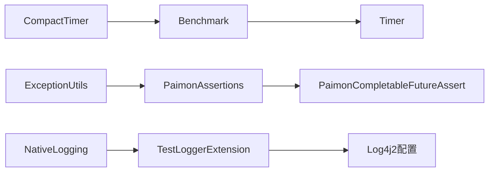

# 调试与故障排除

<cite>
**本文引用的文件**
- [paimon-test-utils/src/main/java/org/apache/paimon/testutils/junit/TestLoggerExtension.java](file://paimon-test-utils/src/main/java/org/apache/paimon/testutils/junit/TestLoggerExtension.java)
- [paimon-e2e-tests/src/test/resources/log4j2-test.properties](file://paimon-e2e-tests/src/test/resources/log4j2-test.properties)
- [tools/ci/paimon-ci-tools/src/main/resources/log4j2.properties](file://tools/ci/paimon-ci-tools/src/main/resources/log4j2.properties)
- [docs/content/maintenance/metrics.md](file://docs/content/maintenance/metrics.md)
- [paimon-benchmark/paimon-cluster-benchmark/src/main/java/org/apache/paimon/benchmark/metric/BenchmarkMetric.java](file://paimon-benchmark/paimon-cluster-benchmark/src/main/java/org/apache/paimon/benchmark/metric/BenchmarkMetric.java)
- [paimon-benchmark/paimon-cluster-benchmark/src/main/java/org/apache/paimon/benchmark/metric/cpu/CpuMetricReceiver.java](file://paimon-benchmark/paimon-cluster-benchmark/src/main/java/org/apache/paimon/benchmark/metric/cpu/CpuMetricReceiver.java)
- [paimon-benchmark/paimon-cluster-benchmark/src/main/java/org/apache/paimon/benchmark/metric/cpu/CpuTimeTracker.java](file://paimon-benchmark/paimon-cluster-benchmark/src/main/java/org/apache/paimon/benchmark/metric/cpu/CpuTimeTracker.java)
- [paimon-benchmark/paimon-micro-benchmarks/src/test/java/org/apache/paimon/benchmark/Benchmark.java](file://paimon-benchmark/paimon-micro-benchmarks/src/test/java/org/apache/paimon/benchmark/Benchmark.java)
- [paimon-core/src/main/java/org/apache/paimon/operation/metrics/CompactTimer.java](file://paimon-core/src/main/java/org/apache/paimon/operation/metrics/CompactTimer.java)
- [paimon-core/src/test/java/org/apache/paimon/operation/metrics/CompactTimerTest.java](file://paimon-core/src/test/java/org/apache/paimon/operation/metrics/CompactTimerTest.java)
- [paimon-common/src/main/java/org/apache/paimon/utils/ExceptionUtils.java](file://paimon-common/src/main/java/org/apache/paimon/utils/ExceptionUtils.java)
- [paimon-test-utils/src/main/java/org/apache/paimon/testutils/assertj/PaimonAssertions.java](file://paimon-test-utils/src/main/java/org/apache/paimon/testutils/assertj/PaimonAssertions.java)
- [paimon-test-utils/src/main/java/org/apache/paimon/testutils/assertj/PaimonCompletableFutureAssert.java](file://paimon-test-utils/src/main/java/org/apache/paimon/testutils/assertj/PaimonCompletableFutureAssert.java)
- [paimon-vortex/paimon-vortex-jni/src/main/java/dev/vortex/jni/NativeLogging.java](file://paimon-vortex/paimon-vortex-jni/src/main/java/dev/vortex/jni/NativeLogging.java)
</cite>

## 目录
1. [简介](#简介)
2. [项目结构](#项目结构)
3. [核心组件](#核心组件)
4. [架构总览](#架构总览)
5. [详细组件分析](#详细组件分析)
6. [依赖分析](#依赖分析)
7. [性能考虑](#性能考虑)
8. [故障排除指南](#故障排除指南)
9. [结论](#结论)
10. [附录](#附录)

## 简介
本指南面向Apache Paimon开发者与使用者，聚焦于开发过程中的调试与故障排除实践。内容涵盖IDE调试器使用、日志分析、性能分析、常见问题诊断、日志系统配置、监控指标定位以及标准排查流程与检查清单。文档以仓库中现有实现为依据，结合测试与基准模块，帮助快速定位并解决问题。

## 项目结构
围绕调试与故障排除相关的关键位置如下：
- 测试日志与扩展：JUnit扩展与测试日志配置
- 日志系统：Log4j2配置示例（CI、测试）
- 指标体系：文档化指标类型与常用指标
- 基准与性能：CPU指标采集、微基准计时器、压缩计时器
- 异常处理：异常字符串化、致命错误识别、链式异常断言
- JNI层日志：原生日志级别控制

**图表来源**
- [paimon-test-utils/src/main/java/org/apache/paimon/testutils/junit/TestLoggerExtension.java:31-82](file://paimon-test-utils/src/main/java/org/apache/paimon/testutils/junit/TestLoggerExtension.java#L31-L82)
- [paimon-e2e-tests/src/test/resources/log4j2-test.properties:19-28](file://paimon-e2e-tests/src/test/resources/log4j2-test.properties#L19-L28)
- [tools/ci/paimon-ci-tools/src/main/resources/log4j2.properties:19-24](file://tools/ci/paimon-ci-tools/src/main/resources/log4j2.properties#L19-L24)
- [docs/content/maintenance/metrics.md:27-36](file://docs/content/maintenance/metrics.md#L27-L36)
- [paimon-benchmark/paimon-cluster-benchmark/src/main/java/org/apache/paimon/benchmark/metric/BenchmarkMetric.java:25-40](file://paimon-benchmark/paimon-cluster-benchmark/src/main/java/org/apache/paimon/benchmark/metric/BenchmarkMetric.java#L25-L40)
- [paimon-benchmark/paimon-cluster-benchmark/src/main/java/org/apache/paimon/benchmark/metric/cpu/CpuMetricReceiver.java:155-163](file://paimon-benchmark/paimon-cluster-benchmark/src/main/java/org/apache/paimon/benchmark/metric/cpu/CpuMetricReceiver.java#L155-L163)
- [paimon-benchmark/paimon-micro-benchmarks/src/test/java/org/apache/paimon/benchmark/Benchmark.java:222-238](file://paimon-benchmark/paimon-micro-benchmarks/src/test/java/org/apache/paimon/benchmark/Benchmark.java#L222-L238)
- [paimon-core/src/main/java/org/apache/paimon/operation/metrics/CompactTimer.java:41-77](file://paimon-core/src/main/java/org/apache/paimon/operation/metrics/CompactTimer.java#L41-L77)
- [paimon-common/src/main/java/org/apache/paimon/utils/ExceptionUtils.java:52-66](file://paimon-common/src/main/java/org/apache/paimon/utils/ExceptionUtils.java#L52-L66)
- [paimon-test-utils/src/main/java/org/apache/paimon/testutils/assertj/PaimonAssertions.java:116-128](file://paimon-test-utils/src/main/java/org/apache/paimon/testutils/assertj/PaimonAssertions.java#L116-L128)
- [paimon-vortex/paimon-vortex-jni/src/main/java/dev/vortex/jni/NativeLogging.java:21-35](file://paimon-vortex/paimon-vortex-jni/src/main/java/dev/vortex/jni/NativeLogging.java#L21-L35)

**章节来源**
- [paimon-test-utils/src/main/java/org/apache/paimon/testutils/junit/TestLoggerExtension.java:31-82](file://paimon-test-utils/src/main/java/org/apache/paimon/testutils/junit/TestLoggerExtension.java#L31-L82)
- [paimon-e2e-tests/src/test/resources/log4j2-test.properties:19-28](file://paimon-e2e-tests/src/test/resources/log4j2-test.properties#L19-L28)
- [tools/ci/paimon-ci-tools/src/main/resources/log4j2.properties:19-24](file://tools/ci/paimon-ci-tools/src/main/resources/log4j2.properties#L19-L24)
- [docs/content/maintenance/metrics.md:27-36](file://docs/content/maintenance/metrics.md#L27-L36)
- [paimon-benchmark/paimon-cluster-benchmark/src/main/java/org/apache/paimon/benchmark/metric/BenchmarkMetric.java:25-40](file://paimon-benchmark/paimon-cluster-benchmark/src/main/java/org/apache/paimon/benchmark/metric/BenchmarkMetric.java#L25-L40)
- [paimon-benchmark/paimon-cluster-benchmark/src/main/java/org/apache/paimon/benchmark/metric/cpu/CpuMetricReceiver.java:155-163](file://paimon-benchmark/paimon-cluster-benchmark/src/main/java/org/apache/paimon/benchmark/metric/cpu/CpuMetricReceiver.java#L155-L163)
- [paimon-benchmark/paimon-micro-benchmarks/src/test/java/org/apache/paimon/benchmark/Benchmark.java:222-238](file://paimon-benchmark/paimon-micro-benchmarks/src/test/java/org/apache/paimon/benchmark/Benchmark.java#L222-L238)
- [paimon-core/src/main/java/org/apache/paimon/operation/metrics/CompactTimer.java:41-77](file://paimon-core/src/main/java/org/apache/paimon/operation/metrics/CompactTimer.java#L41-L77)
- [paimon-common/src/main/java/org/apache/paimon/utils/ExceptionUtils.java:52-66](file://paimon-common/src/main/java/org/apache/paimon/utils/ExceptionUtils.java#L52-L66)
- [paimon-test-utils/src/main/java/org/apache/paimon/testutils/assertj/PaimonAssertions.java:116-128](file://paimon-test-utils/src/main/java/org/apache/paimon/testutils/assertj/PaimonAssertions.java#L116-L128)
- [paimon-vortex/paimon-vortex-jni/src/main/java/dev/vortex/jni/NativeLogging.java:21-35](file://paimon-vortex/paimon-vortex-jni/src/main/java/dev/vortex/jni/NativeLogging.java#L21-L35)

## 核心组件
- 测试日志与扩展：在测试生命周期中输出开始/结束信息与失败堆栈，便于快速定位测试问题。
- 日志系统：提供测试与CI环境下的Log4j2配置模板，支持控制台输出与模式布局。
- 指标体系：文档化指标类型（Gauge/Counter/Histogram）与常见指标（提交、扫描、写入、合并等），支持桥接计算引擎。
- 基准与性能：CPU指标采集服务端、微基准计时器、压缩计时器，用于性能测量与回归分析。
- 异常处理：异常字符串化、致命错误识别、链式异常断言与Future断言，提升排障效率。
- JNI层日志：原生日志级别枚举与初始化接口，便于JNI路径问题定位。

**章节来源**
- [paimon-test-utils/src/main/java/org/apache/paimon/testutils/junit/TestLoggerExtension.java:34-66](file://paimon-test-utils/src/main/java/org/apache/paimon/testutils/junit/TestLoggerExtension.java#L34-L66)
- [paimon-e2e-tests/src/test/resources/log4j2-test.properties:19-28](file://paimon-e2e-tests/src/test/resources/log4j2-test.properties#L19-L28)
- [tools/ci/paimon-ci-tools/src/main/resources/log4j2.properties:19-24](file://tools/ci/paimon-ci-tools/src/main/resources/log4j2.properties#L19-L24)
- [docs/content/maintenance/metrics.md:27-36](file://docs/content/maintenance/metrics.md#L27-L36)
- [paimon-benchmark/paimon-cluster-benchmark/src/main/java/org/apache/paimon/benchmark/metric/cpu/CpuMetricReceiver.java:155-163](file://paimon-benchmark/paimon-cluster-benchmark/src/main/java/org/apache/paimon/benchmark/metric/cpu/CpuMetricReceiver.java#L155-L163)
- [paimon-benchmark/paimon-micro-benchmarks/src/test/java/org/apache/paimon/benchmark/Benchmark.java:222-238](file://paimon-benchmark/paimon-micro-benchmarks/src/test/java/org/apache/paimon/benchmark/Benchmark.java#L222-L238)
- [paimon-core/src/main/java/org/apache/paimon/operation/metrics/CompactTimer.java:41-77](file://paimon-core/src/main/java/org/apache/paimon/operation/metrics/CompactTimer.java#L41-L77)
- [paimon-common/src/main/java/org/apache/paimon/utils/ExceptionUtils.java:52-66](file://paimon-common/src/main/java/org/apache/paimon/utils/ExceptionUtils.java#L52-L66)
- [paimon-test-utils/src/main/java/org/apache/paimon/testutils/assertj/PaimonAssertions.java:116-128](file://paimon-test-utils/src/main/java/org/apache/paimon/testutils/assertj/PaimonAssertions.java#L116-L128)
- [paimon-vortex/paimon-vortex-jni/src/main/java/dev/vortex/jni/NativeLogging.java:21-35](file://paimon-vortex/paimon-vortex-jni/src/main/java/dev/vortex/jni/NativeLogging.java#L21-L35)

## 架构总览
下图展示调试与故障排除相关组件之间的交互关系：测试扩展负责记录测试状态与异常；日志配置决定输出目标与格式；指标文档定义可观测性维度；基准与计时器提供性能数据；异常工具与断言辅助定位根因；JNI日志为底层问题提供入口。

**图表来源**
- [paimon-test-utils/src/main/java/org/apache/paimon/testutils/junit/TestLoggerExtension.java:34-66](file://paimon-test-utils/src/main/java/org/apache/paimon/testutils/junit/TestLoggerExtension.java#L34-L66)
- [paimon-e2e-tests/src/test/resources/log4j2-test.properties:19-28](file://paimon-e2e-tests/src/test/resources/log4j2-test.properties#L19-L28)
- [docs/content/maintenance/metrics.md:27-36](file://docs/content/maintenance/metrics.md#L27-L36)
- [paimon-benchmark/paimon-micro-benchmarks/src/test/java/org/apache/paimon/benchmark/Benchmark.java:222-238](file://paimon-benchmark/paimon-micro-benchmarks/src/test/java/org/apache/paimon/benchmark/Benchmark.java#L222-L238)
- [paimon-common/src/main/java/org/apache/paimon/utils/ExceptionUtils.java:52-66](file://paimon-common/src/main/java/org/apache/paimon/utils/ExceptionUtils.java#L52-L66)
- [paimon-test-utils/src/main/java/org/apache/paimon/testutils/assertj/PaimonAssertions.java:116-128](file://paimon-test-utils/src/main/java/org/apache/paimon/testutils/assertj/PaimonAssertions.java#L116-L128)

## 详细组件分析

### 组件A：测试日志与异常追踪
- TestLoggerExtension在测试前输出测试类、方法与显示名，并在失败时打印堆栈，便于快速定位问题。
- 配合log4j2-test.properties可将输出重定向到控制台并设置模式布局，避免构建日志被刷屏。

**图表来源**
- [paimon-test-utils/src/main/java/org/apache/paimon/testutils/junit/TestLoggerExtension.java:34-66](file://paimon-test-utils/src/main/java/org/apache/paimon/testutils/junit/TestLoggerExtension.java#L34-L66)
- [paimon-e2e-tests/src/test/resources/log4j2-test.properties:19-28](file://paimon-e2e-tests/src/test/resources/log4j2-test.properties#L19-L28)

**章节来源**
- [paimon-test-utils/src/main/java/org/apache/paimon/testutils/junit/TestLoggerExtension.java:34-66](file://paimon-test-utils/src/main/java/org/apache/paimon/testutils/junit/TestLoggerExtension.java#L34-L66)
- [paimon-e2e-tests/src/test/resources/log4j2-test.properties:19-28](file://paimon-e2e-tests/src/test/resources/log4j2-test.properties#L19-L28)

### 组件B：日志系统配置与使用
- 测试环境：通过log4j2-test.properties设置rootLogger级别与控制台输出，便于调试。
- CI环境：通过tools/ci/paimon-ci-tools的log4j2.properties设置控制台输出与时间戳格式，保证流水线可读性。
- 使用建议：在本地开发时将rootLogger.level临时调整为DEBUG或TRACE，配合断点观察上下文。

**章节来源**
- [paimon-e2e-tests/src/test/resources/log4j2-test.properties:19-28](file://paimon-e2e-tests/src/test/resources/log4j2-test.properties#L19-L28)
- [tools/ci/paimon-ci-tools/src/main/resources/log4j2.properties:19-24](file://tools/ci/paimon-ci-tools/src/main/resources/log4j2.properties#L19-L24)

### 组件C：指标体系与监控
- 指标类型：Gauge（瞬时值）、Counter（累计计数）、Histogram（统计分布）。
- 表级粒度：指标更新与上报在表粒度进行，便于按表维度观测读写行为。
- 常见指标：提交耗时、尝试次数、文件增删数量、合并输入/输出大小等，可对接Flink/Spark等引擎。

**图表来源**
- [docs/content/maintenance/metrics.md:27-36](file://docs/content/maintenance/metrics.md#L27-L36)

**章节来源**
- [docs/content/maintenance/metrics.md:27-36](file://docs/content/maintenance/metrics.md#L27-L36)

### 组件D：性能分析与基准
- CPU指标采集：CpuMetricReceiver作为服务端接收CPU指标，CpuTimeTracker维护采样时间与累计CPU时间。
- 微基准计时器：Benchmark提供迭代次数、预热轮次、最佳/平均耗时统计，支持逐轮输出。
- 压缩计时器：CompactTimer维护时间窗口内的区间，用于统计最近一段时间内压缩活动的持续时长。

**图表来源**
- [paimon-benchmark/paimon-cluster-benchmark/src/main/java/org/apache/paimon/benchmark/metric/cpu/CpuMetricReceiver.java:155-163](file://paimon-benchmark/paimon-cluster-benchmark/src/main/java/org/apache/paimon/benchmark/metric/cpu/CpuMetricReceiver.java#L155-L163)
- [paimon-benchmark/paimon-cluster-benchmark/src/main/java/org/apache/paimon/benchmark/metric/cpu/CpuTimeTracker.java:31-112](file://paimon-benchmark/paimon-cluster-benchmark/src/main/java/org/apache/paimon/benchmark/metric/cpu/CpuTimeTracker.java#L31-L112)
- [paimon-benchmark/paimon-micro-benchmarks/src/test/java/org/apache/paimon/benchmark/Benchmark.java:222-238](file://paimon-benchmark/paimon-micro-benchmarks/src/test/java/org/apache/paimon/benchmark/Benchmark.java#L222-L238)
- [paimon-core/src/main/java/org/apache/paimon/operation/metrics/CompactTimer.java:41-77](file://paimon-core/src/main/java/org/apache/paimon/operation/metrics/CompactTimer.java#L41-L77)

**章节来源**
- [paimon-benchmark/paimon-cluster-benchmark/src/main/java/org/apache/paimon/benchmark/metric/cpu/CpuMetricReceiver.java:155-163](file://paimon-benchmark/paimon-cluster-benchmark/src/main/java/org/apache/paimon/benchmark/metric/cpu/CpuMetricReceiver.java#L155-L163)
- [paimon-benchmark/paimon-cluster-benchmark/src/main/java/org/apache/paimon/benchmark/metric/cpu/CpuTimeTracker.java:31-112](file://paimon-benchmark/paimon-cluster-benchmark/src/main/java/org/apache/paimon/benchmark/metric/cpu/CpuTimeTracker.java#L31-L112)
- [paimon-benchmark/paimon-micro-benchmarks/src/test/java/org/apache/paimon/benchmark/Benchmark.java:222-238](file://paimon-benchmark/paimon-micro-benchmarks/src/test/java/org/apache/paimon/benchmark/Benchmark.java#L222-L238)
- [paimon-core/src/main/java/org/apache/paimon/operation/metrics/CompactTimer.java:41-77](file://paimon-core/src/main/java/org/apache/paimon/operation/metrics/CompactTimer.java#L41-L77)

### 组件E：异常处理与断言
- 异常字符串化：ExceptionUtils.stringifyException将异常堆栈转为字符串，避免失败时抛出新异常。
- 致命错误识别：isJvmFatalError/isJvmFatalOrOutOfMemoryError区分JVM致命错误与内存溢出。
- 断言工具：PaimonAssertions提供链式异常断言与Future断言，PaimonCompletableFutureAssert支持超时断言。

**图表来源**
- [paimon-common/src/main/java/org/apache/paimon/utils/ExceptionUtils.java:52-66](file://paimon-common/src/main/java/org/apache/paimon/utils/ExceptionUtils.java#L52-L66)
- [paimon-common/src/main/java/org/apache/paimon/utils/ExceptionUtils.java:82-102](file://paimon-common/src/main/java/org/apache/paimon/utils/ExceptionUtils.java#L82-L102)
- [paimon-test-utils/src/main/java/org/apache/paimon/testutils/assertj/PaimonAssertions.java:116-128](file://paimon-test-utils/src/main/java/org/apache/paimon/testutils/assertj/PaimonAssertions.java#L116-L128)
- [paimon-test-utils/src/main/java/org/apache/paimon/testutils/assertj/PaimonCompletableFutureAssert.java:147-167](file://paimon-test-utils/src/main/java/org/apache/paimon/testutils/assertj/PaimonCompletableFutureAssert.java#L147-L167)

**章节来源**
- [paimon-common/src/main/java/org/apache/paimon/utils/ExceptionUtils.java:52-66](file://paimon-common/src/main/java/org/apache/paimon/utils/ExceptionUtils.java#L52-L66)
- [paimon-common/src/main/java/org/apache/paimon/utils/ExceptionUtils.java:82-102](file://paimon-common/src/main/java/org/apache/paimon/utils/ExceptionUtils.java#L82-L102)
- [paimon-test-utils/src/main/java/org/apache/paimon/testutils/assertj/PaimonAssertions.java:116-128](file://paimon-test-utils/src/main/java/org/apache/paimon/testutils/assertj/PaimonAssertions.java#L116-L128)
- [paimon-test-utils/src/main/java/org/apache/paimon/testutils/assertj/PaimonCompletableFutureAssert.java:147-167](file://paimon-test-utils/src/main/java/org/apache/paimon/testutils/assertj/PaimonCompletableFutureAssert.java#L147-L167)

### 组件F：JNI层日志
- NativeLogging提供原生日志级别枚举与初始化接口，便于在JNI路径问题时调整日志级别。

**章节来源**
- [paimon-vortex/paimon-vortex-jni/src/main/java/dev/vortex/jni/NativeLogging.java:21-35](file://paimon-vortex/paimon-vortex-jni/src/main/java/dev/vortex/jni/NativeLogging.java#L21-L35)

## 依赖分析
- 组件耦合：测试扩展依赖日志配置；基准与计时器相互独立但均可输出到控制台；异常工具与断言工具解耦，便于复用。
- 外部依赖：Log4j2控制台输出、AssertJ断言库、JDK异常模型。
- 潜在循环：当前模块间无明显循环依赖，均为单向使用关系。

**图表来源**
- [paimon-test-utils/src/main/java/org/apache/paimon/testutils/junit/TestLoggerExtension.java:34-66](file://paimon-test-utils/src/main/java/org/apache/paimon/testutils/junit/TestLoggerExtension.java#L34-L66)
- [paimon-benchmark/paimon-micro-benchmarks/src/test/java/org/apache/paimon/benchmark/Benchmark.java:222-238](file://paimon-benchmark/paimon-micro-benchmarks/src/test/java/org/apache/paimon/benchmark/Benchmark.java#L222-L238)
- [paimon-core/src/main/java/org/apache/paimon/operation/metrics/CompactTimer.java:41-77](file://paimon-core/src/main/java/org/apache/paimon/operation/metrics/CompactTimer.java#L41-L77)
- [paimon-common/src/main/java/org/apache/paimon/utils/ExceptionUtils.java:52-66](file://paimon-common/src/main/java/org/apache/paimon/utils/ExceptionUtils.java#L52-L66)
- [paimon-test-utils/src/main/java/org/apache/paimon/testutils/assertj/PaimonAssertions.java:116-128](file://paimon-test-utils/src/main/java/org/apache/paimon/testutils/assertj/PaimonAssertions.java#L116-L128)
- [paimon-vortex/paimon-vortex-jni/src/main/java/dev/vortex/jni/NativeLogging.java:21-35](file://paimon-vortex/paimon-vortex-jni/src/main/java/dev/vortex/jni/NativeLogging.java#L21-L35)

**章节来源**
- [paimon-test-utils/src/main/java/org/apache/paimon/testutils/junit/TestLoggerExtension.java:34-66](file://paimon-test-utils/src/main/java/org/apache/paimon/testutils/junit/TestLoggerExtension.java#L34-L66)
- [paimon-benchmark/paimon-micro-benchmarks/src/test/java/org/apache/paimon/benchmark/Benchmark.java:222-238](file://paimon-benchmark/paimon-micro-benchmarks/src/test/java/org/apache/paimon/benchmark/Benchmark.java#L222-L238)
- [paimon-core/src/main/java/org/apache/paimon/operation/metrics/CompactTimer.java:41-77](file://paimon-core/src/main/java/org/apache/paimon/operation/metrics/CompactTimer.java#L41-L77)
- [paimon-common/src/main/java/org/apache/paimon/utils/ExceptionUtils.java:52-66](file://paimon-common/src/main/java/org/apache/paimon/utils/ExceptionUtils.java#L52-L66)
- [paimon-test-utils/src/main/java/org/apache/paimon/testutils/assertj/PaimonAssertions.java:116-128](file://paimon-test-utils/src/main/java/org/apache/paimon/testutils/assertj/PaimonAssertions.java#L116-L128)
- [paimon-vortex/paimon-vortex-jni/src/main/java/dev/vortex/jni/NativeLogging.java:21-35](file://paimon-vortex/paimon-vortex-jni/src/main/java/dev/vortex/jni/NativeLogging.java#L21-L35)

## 性能考虑
- 计时精度：微基准采用纳秒级计时，注意预热轮次与迭代次数对结果的影响。
- CPU指标：采样间隔需大于系统jiffy长度，避免抖动；累计CPU时间应单调非减。
- 压缩计时：查询窗口长度影响统计范围，需根据场景调整。

[本节为通用指导，不直接分析具体文件]

## 故障排除指南

### 一、IDE调试器使用
- 设置断点：在关键流程（如提交、扫描、写入、合并）入口设置断点，观察参数与局部变量。
- 跟踪变量：关注文件增删数量、分区/桶数量、耗时直方图等指标字段。
- 分析调用栈：结合异常字符串化与链式断言，快速定位根因。

**章节来源**
- [paimon-common/src/main/java/org/apache/paimon/utils/ExceptionUtils.java:52-66](file://paimon-common/src/main/java/org/apache/paimon/utils/ExceptionUtils.java#L52-L66)
- [paimon-test-utils/src/main/java/org/apache/paimon/testutils/assertj/PaimonAssertions.java:116-128](file://paimon-test-utils/src/main/java/org/apache/paimon/testutils/assertj/PaimonAssertions.java#L116-L128)

### 二、日志分析
- 测试日志：使用log4j2-test.properties将rootLogger.level设为DEBUG或TRACE，观察测试执行细节。
- CI日志：确保控制台输出包含时间戳与类名，便于流水线问题定位。
- 输出重定向：必要时将日志输出到文件以便离线分析。

**章节来源**
- [paimon-e2e-tests/src/test/resources/log4j2-test.properties:19-28](file://paimon-e2e-tests/src/test/resources/log4j2-test.properties#L19-L28)
- [tools/ci/paimon-ci-tools/src/main/resources/log4j2.properties:19-24](file://tools/ci/paimon-ci-tools/src/main/resources/log4j2.properties#L19-L24)

### 三、性能问题诊断
- CPU占用：通过CpuMetricReceiver与CpuTimeTracker确认是否存在异常峰值。
- 吞吐与延迟：使用Benchmark统计最佳/平均耗时，结合指标文档中的提交/扫描/合并指标对比。
- 压缩活动：使用CompactTimer观察最近窗口内的压缩持续时长变化。

**章节来源**
- [paimon-benchmark/paimon-cluster-benchmark/src/main/java/org/apache/paimon/benchmark/metric/cpu/CpuMetricReceiver.java:155-163](file://paimon-benchmark/paimon-cluster-benchmark/src/main/java/org/apache/paimon/benchmark/metric/cpu/CpuMetricReceiver.java#L155-L163)
- [paimon-benchmark/paimon-micro-benchmarks/src/test/java/org/apache/paimon/benchmark/Benchmark.java:222-238](file://paimon-benchmark/paimon-micro-benchmarks/src/test/java/org/apache/paimon/benchmark/Benchmark.java#L222-L238)
- [paimon-core/src/main/java/org/apache/paimon/operation/metrics/CompactTimer.java:41-77](file://paimon-core/src/main/java/org/apache/paimon/operation/metrics/CompactTimer.java#L41-L77)

### 四、常见问题与诊断
- 编译错误：检查依赖版本与模块间导入关系，参考基准模块的计时器实现避免重复计时逻辑。
- 运行时异常：优先使用ExceptionUtils识别致命错误与内存溢出，再结合断言工具定位异常链。
- JNI问题：通过NativeLogging调整原生日志级别，配合测试日志定位JNI路径问题。

**章节来源**
- [paimon-common/src/main/java/org/apache/paimon/utils/ExceptionUtils.java:82-102](file://paimon-common/src/main/java/org/apache/paimon/utils/ExceptionUtils.java#L82-L102)
- [paimon-vortex/paimon-vortex-jni/src/main/java/dev/vortex/jni/NativeLogging.java:21-35](file://paimon-vortex/paimon-vortex-jni/src/main/java/dev/vortex/jni/NativeLogging.java#L21-L35)

### 五、监控指标定位
- 提交指标：lastCommitDuration/commitDuration/lastCommitAttempts等，定位写入瓶颈。
- 扫描指标：lastPartitionsWritten/lastBucketsWritten等，定位扫描范围与分区策略问题。
- 合并指标：lastCompactionInputFileSize/lastCompactionOutputFileSize等，定位合并效率。

**章节来源**
- [docs/content/maintenance/metrics.md:83-185](file://docs/content/maintenance/metrics.md#L83-L185)

### 六、标准排查流程与检查清单
- 快速自检
  - 日志级别：是否开启DEBUG/TRACE
  - 输出目标：是否重定向至控制台/文件
  - 指标采集：是否启用表级指标上报
  - 性能基线：是否运行微基准获取吞吐/延迟
- 深入排查
  - 异常链：使用链式断言定位根因
  - 致命错误：识别JVM致命错误与内存溢出
  - JNI问题：调整原生日志级别并复现
- 回归验证
  - 压缩计时：确认窗口内活动趋势
  - CPU指标：确认峰值与持续时间
  - 指标收敛：确认提交/扫描/合并指标稳定

[本节为通用流程，不直接分析具体文件]

## 结论
通过测试日志扩展、日志系统配置、指标体系、基准与计时器、异常处理与断言工具以及JNI日志控制，可以形成一套完整的调试与故障排除闭环。建议在日常开发中固定使用这些工具与流程，以提高问题定位效率与系统稳定性。

[本节为总结，不直接分析具体文件]

## 附录
- 关键实现路径参考
  - 测试日志扩展：[TestLoggerExtension.java:34-66](file://paimon-test-utils/src/main/java/org/apache/paimon/testutils/junit/TestLoggerExtension.java#L34-L66)
  - 测试日志配置：[log4j2-test.properties:19-28](file://paimon-e2e-tests/src/test/resources/log4j2-test.properties#L19-L28)
  - CI日志配置：[log4j2.properties:19-24](file://tools/ci/paimon-ci-tools/src/main/resources/log4j2.properties#L19-L24)
  - 指标文档：[metrics.md:27-36](file://docs/content/maintenance/metrics.md#L27-L36)
  - 基准计时器：[Benchmark.java:222-238](file://paimon-benchmark/paimon-micro-benchmarks/src/test/java/org/apache/paimon/benchmark/Benchmark.java#L222-L238)
  - 压缩计时器：[CompactTimer.java:41-77](file://paimon-core/src/main/java/org/apache/paimon/operation/metrics/CompactTimer.java#L41-L77)
  - 异常工具：[ExceptionUtils.java:52-66](file://paimon-common/src/main/java/org/apache/paimon/utils/ExceptionUtils.java#L52-L66)
  - 断言工具：[PaimonAssertions.java:116-128](file://paimon-test-utils/src/main/java/org/apache/paimon/testutils/assertj/PaimonAssertions.java#L116-L128)
  - JNI日志：[NativeLogging.java:21-35](file://paimon-vortex/paimon-vortex-jni/src/main/java/dev/vortex/jni/NativeLogging.java#L21-L35)

[本节为补充索引，不直接分析具体文件]