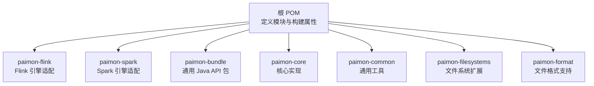
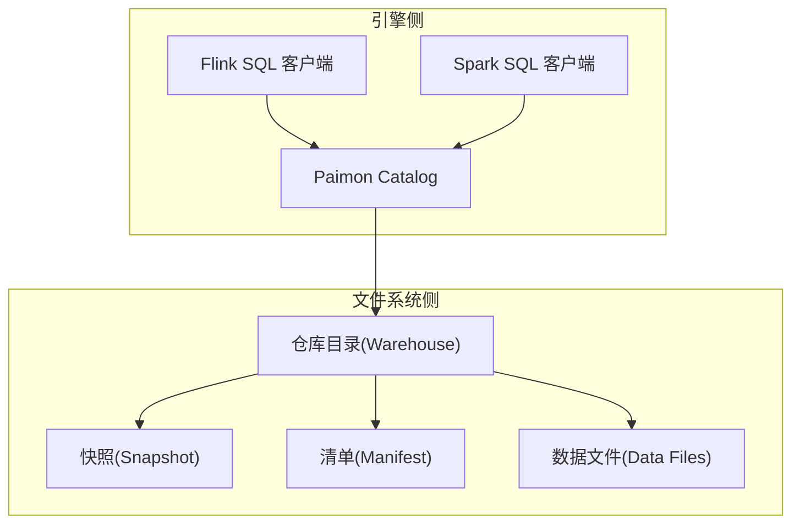
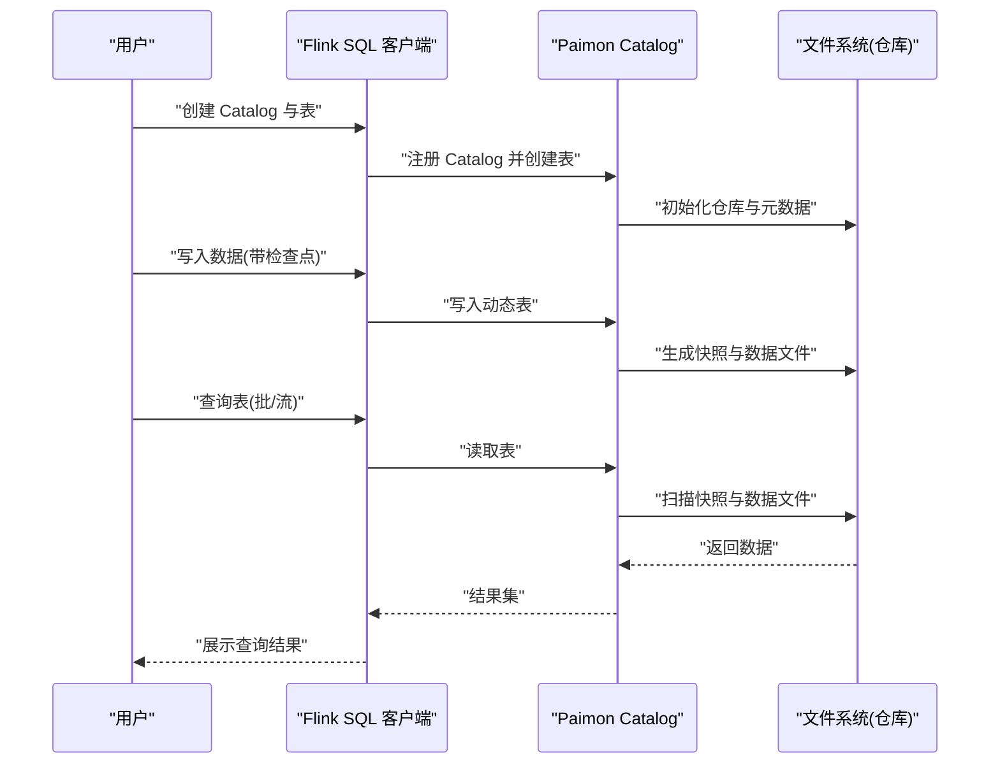
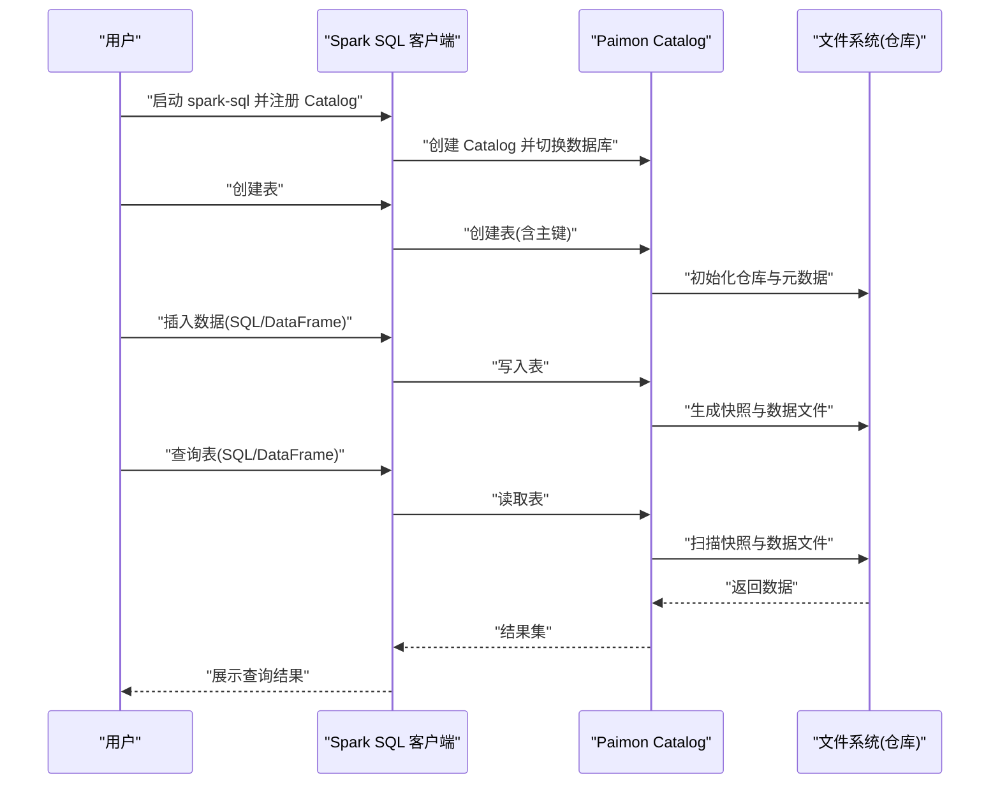
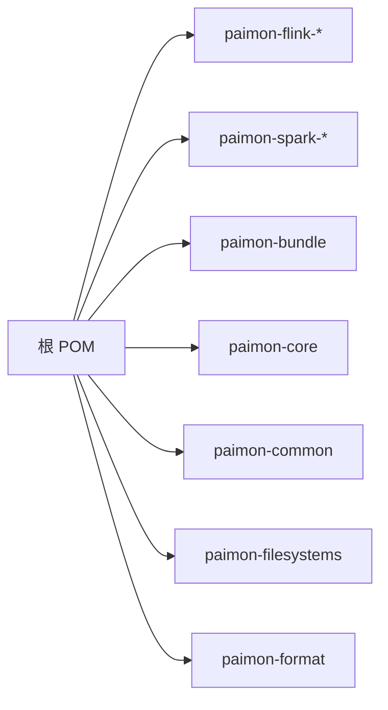

# 快速开始

<cite>
**本文引用的文件**
- [README.md](file://README.md)
- [pom.xml](file://pom.xml)
- [docs/content/project/download.md](file://docs/content/project/download.md)
- [docs/content/flink/quick-start.md](file://docs/content/flink/quick-start.md)
- [docs/content/spark/quick-start.md](file://docs/content/spark/quick-start.md)
- [docs/content/concepts/basic-concepts.md](file://docs/content/concepts/basic-concepts.md)
- [docs/content/program-api/java-api.md](file://docs/content/program-api/java-api.md)
- [docs/content/maintenance/configurations.md](file://docs/content/maintenance/configurations.md)
- [docs/content/learn-paimon/scenario-guide.md](file://docs/content/learn-paimon/scenario-guide.md)
</cite>

## 目录
1. [简介](#简介)
2. [项目结构](#项目结构)
3. [核心组件](#核心组件)
4. [架构总览](#架构总览)
5. [详细组件分析](#详细组件分析)
6. [依赖分析](#依赖分析)
7. [性能考虑](#性能考虑)
8. [故障排除指南](#故障排除指南)
9. [结论](#结论)
10. [附录](#附录)

## 简介
本指南面向首次接触 Apache Paimon 的用户，帮助你在本地与生产环境中快速完成环境准备、安装部署，并通过 Flink SQL 与 Spark SQL 完成“第一个 Paimon 表”的创建、写入与查询。同时提供常见使用场景的快速入门、故障排除与常见问题解答，让你在最短时间内掌握 Paimon 的核心能力。

## 项目结构
Paimon 是一个多模块的仓库，围绕“湖格式 + LSM 结构”的实时湖仓架构设计，支持 Flink 与 Spark 生态，提供多种引擎适配包（如 paimon-flink-*、paimon-spark-*）以及通用的 Java API 包（paimon-bundle）。根 POM 中定义了模块划分、构建属性与测试配置，便于在不同引擎版本下进行编译与打包。

图表来源
- [pom.xml:54-78](file://pom.xml#L54-L78)

章节来源
- [pom.xml:54-78](file://pom.xml#L54-L78)

## 核心组件
- 引擎适配包：根据目标计算引擎选择对应的 paimon-flink-* 或 paimon-spark-* 版本，用于在引擎中注册 Catalog 并执行 SQL 操作。
- 通用 Java API 包：paimon-bundle 提供 Catalog、Table、读写接口等，适合直接以 Java 程序访问 Paimon。
- 文件系统与格式：支持本地文件系统、HDFS、OSS、S3 等；数据文件默认采用 Parquet，亦可选 ORC、AVRO。
- 基础概念：快照（Snapshot）、清单（Manifest）、数据文件、分区（Partition）等，是理解 Paimon 文件布局与一致性保障的基础。

章节来源
- [docs/content/concepts/basic-concepts.md:29-76](file://docs/content/concepts/basic-concepts.md#L29-L76)
- [docs/content/program-api/java-api.md:33-47](file://docs/content/program-api/java-api.md#L33-L47)

## 架构总览
Paimon 在引擎侧通过 Catalog 将 SQL 请求转换为对底层文件系统的读写操作；在文件系统侧，Paimon 以快照、清单与数据文件组织数据，保证原子提交与一致性。

图表来源
- [docs/content/concepts/basic-concepts.md:35-57](file://docs/content/concepts/basic-concepts.md#L35-L57)
- [docs/content/flink/quick-start.md:130-151](file://docs/content/flink/quick-start.md#L130-L151)
- [docs/content/spark/quick-start.md:104-127](file://docs/content/spark/quick-start.md#L104-L127)

## 详细组件分析

### 环境准备与安装
- JDK 与 Maven
  - 构建要求：JDK 8/11，Maven 版本 ≥3.6.3。
  - 参考路径：[README.md:69-76](file://README.md#L69-L76)
- 下载与版本选择
  - Flink：支持 2.2、2.1、2.0、1.20、1.19、1.18、1.17、1.16；推荐使用最新稳定版。
  - Spark：支持 4.0（Java 17 + Scala 2.13）、3.5/3.4/3.3/3.2（Java 8 + Scala 2.12/2.13）。
  - 参考路径：[docs/content/project/download.md:31-83](file://docs/content/project/download.md#L31-L83)
- 本地开发环境
  - Flink：下载对应版本后复制 paimon-flink-*.jar 到 Flink lib 目录，按需复制 Hadoop 预打包 jar；启动本地集群并使用 Flink SQL 客户端。
    - 参考路径：[docs/content/flink/quick-start.md:77-129](file://docs/content/flink/quick-start.md#L77-L129)
  - Spark：通过 --packages 或 --jars 指定 paimon-spark-*.jar，或放入 Spark jars 目录；启动 spark-sql 并注册 Paimon Catalog。
    - 参考路径：[docs/content/spark/quick-start.md:80-103](file://docs/content/spark/quick-start.md#L80-L103)

章节来源
- [README.md:69-76](file://README.md#L69-L76)
- [docs/content/project/download.md:31-83](file://docs/content/project/download.md#L31-L83)
- [docs/content/flink/quick-start.md:77-129](file://docs/content/flink/quick-start.md#L77-L129)
- [docs/content/spark/quick-start.md:80-103](file://docs/content/spark/quick-start.md#L80-L103)

### 创建你的第一个 Paimon 表（Flink SQL）
- 步骤
  - 注册 Catalog：使用 paimon 类型的 Catalog，并设置共享文件系统作为仓库路径（分布式环境建议使用 HDFS/OSS/S3）。
    - 参考路径：[docs/content/flink/quick-start.md:130-151](file://docs/content/flink/quick-start.md#L130-L151)
  - 创建表：定义主键（Primary Key）与字段，例如单词计数表。
    - 参考路径：[docs/content/flink/quick-start.md:146-151](file://docs/content/flink/quick-start.md#L146-L151)
  - 写入数据：使用临时数据生成器表，开启检查点后写入动态表。
    - 参考路径：[docs/content/flink/quick-start.md:189-205](file://docs/content/flink/quick-start.md#L189-L205)
  - 查询数据：切换到批模式或流模式，执行查询。
    - 参考路径：[docs/content/flink/quick-start.md:207-232](file://docs/content/flink/quick-start.md#L207-L232)

图表来源
- [docs/content/flink/quick-start.md:130-232](file://docs/content/flink/quick-start.md#L130-L232)

章节来源
- [docs/content/flink/quick-start.md:130-232](file://docs/content/flink/quick-start.md#L130-L232)

### 创建你的第一个 Paimon 表（Spark SQL）
- 步骤
  - 指定 Paimon Jar：通过 --packages 或 --jars 加载 paimon-spark-*.jar。
    - 参考路径：[docs/content/spark/quick-start.md:88-103](file://docs/content/spark/quick-start.md#L88-L103)
  - 注册 Catalog：使用 org.apache.paimon.spark.SparkCatalog 并设置仓库路径。
    - 参考路径：[docs/content/spark/quick-start.md:104-127](file://docs/content/spark/quick-start.md#L104-L127)
  - 创建表：定义主键与字段。
    - 参考路径：[docs/content/spark/quick-start.md:155-187](file://docs/content/spark/quick-start.md#L155-L187)
  - 写入与查询：支持 SQL 与 DataFrame 方式插入与读取。
    - 参考路径：[docs/content/spark/quick-start.md:189-255](file://docs/content/spark/quick-start.md#L189-L255)

图表来源
- [docs/content/spark/quick-start.md:104-255](file://docs/content/spark/quick-start.md#L104-L255)

章节来源
- [docs/content/spark/quick-start.md:104-255](file://docs/content/spark/quick-start.md#L104-L255)

### 常见使用场景快速入门
- 场景决策树：根据是否需要 upsert/update/delete、是否批量 ETL、是否需要向量检索等，选择 Primary Key Table、Append Table 或多模态能力。
  - 参考路径：[docs/content/learn-paimon/scenario-guide.md:568-601](file://docs/content/learn-paimon/scenario-guide.md#L568-L601)
- 典型场景
  - CDC 实时同步：Primary Key Table + deletion-vectors + changelog-producer。
    - 参考路径：[docs/content/learn-paimon/scenario-guide.md:57-97](file://docs/content/learn-paimon/scenario-guide.md#L57-L97)
  - 多流部分列更新：partial-update 合并引擎。
    - 参考路径：[docs/content/learn-paimon/scenario-guide.md:98-128](file://docs/content/learn-paimon/scenario-guide.md#L98-L128)
  - 流式聚合/指标：aggregation 合并引擎。
    - 参考路径：[docs/content/learn-paimon/scenario-guide.md:129-157](file://docs/content/learn-paimon/scenario-guide.md#L129-L157)
  - 批量 ETL/数仓分层：Append Table（无桶）。
    - 参考路径：[docs/content/learn-paimon/scenario-guide.md:211-247](file://docs/content/learn-paimon/scenario-guide.md#L211-L247)
  - 点查优化：Bucketed Append（bucket-key）。
    - 参考路径：[docs/content/learn-paimon/scenario-guide.md:256-301](file://docs/content/learn-paimon/scenario-guide.md#L256-L301)
  - 向量检索/RAG：VECTOR 类型 + 全局索引（DiskANN）。
    - 参考路径：[docs/content/learn-paimon/scenario-guide.md:405-477](file://docs/content/learn-paimon/scenario-guide.md#L405-L477)

章节来源
- [docs/content/learn-paimon/scenario-guide.md:568-601](file://docs/content/learn-paimon/scenario-guide.md#L568-L601)
- [docs/content/learn-paimon/scenario-guide.md:57-97](file://docs/content/learn-paimon/scenario-guide.md#L57-L97)
- [docs/content/learn-paimon/scenario-guide.md:98-128](file://docs/content/learn-paimon/scenario-guide.md#L98-L128)
- [docs/content/learn-paimon/scenario-guide.md:129-157](file://docs/content/learn-paimon/scenario-guide.md#L129-L157)
- [docs/content/learn-paimon/scenario-guide.md:211-247](file://docs/content/learn-paimon/scenario-guide.md#L211-L247)
- [docs/content/learn-paimon/scenario-guide.md:256-301](file://docs/content/learn-paimon/scenario-guide.md#L256-L301)
- [docs/content/learn-paimon/scenario-guide.md:405-477](file://docs/content/learn-paimon/scenario-guide.md#L405-L477)

### Java API 快速上手
- 依赖与引入：paimon-bundle，或 Maven 依赖方式。
  - 参考路径：[docs/content/program-api/java-api.md:33-47](file://docs/content/program-api/java-api.md#L33-L47)
- 关键步骤
  - 创建 Catalog：文件系统或 Hive。
    - 参考路径：[docs/content/program-api/java-api.md:51-82](file://docs/content/program-api/java-api.md#L51-L82)
  - 创建表：Schema 定义主键、分区与列。
    - 参考路径：[docs/content/program-api/java-api.md:84-116](file://docs/content/program-api/java-api.md#L84-L116)
  - 读写流程：Batch/Stream 读写分为计划分片与执行阶段。
    - 参考路径：[docs/content/program-api/java-api.md:142-390](file://docs/content/program-api/java-api.md#L142-L390)

章节来源
- [docs/content/program-api/java-api.md:33-47](file://docs/content/program-api/java-api.md#L33-L47)
- [docs/content/program-api/java-api.md:51-82](file://docs/content/program-api/java-api.md#L51-L82)
- [docs/content/program-api/java-api.md:84-116](file://docs/content/program-api/java-api.md#L84-L116)
- [docs/content/program-api/java-api.md:142-390](file://docs/content/program-api/java-api.md#L142-L390)

## 依赖分析
- 引擎版本与 Java/Scala 兼容性
  - Flink：1.16~1.20、2.0~2.2（默认 Java 8/11，具体以各版本说明为准）。
  - Spark：3.x（Java 8 + Scala 2.12/2.13）、4.0（Java 17 + Scala 2.13）。
  - 参考路径：[docs/content/flink/quick-start.md:31-52](file://docs/content/flink/quick-start.md#L31-L52)，[docs/content/spark/quick-start.md:29-48](file://docs/content/spark/quick-start.md#L29-L48)
- 构建与测试
  - 根 POM 定义了模块、依赖管理、测试配置与构建属性，确保在不同引擎版本下的兼容性。
  - 参考路径：[pom.xml:54-78](file://pom.xml#L54-L78)，[pom.xml:107-171](file://pom.xml#L107-L171)

图表来源
- [pom.xml:54-78](file://pom.xml#L54-L78)

章节来源
- [docs/content/flink/quick-start.md:31-52](file://docs/content/flink/quick-start.md#L31-L52)
- [docs/content/spark/quick-start.md:29-48](file://docs/content/spark/quick-start.md#L29-L48)
- [pom.xml:54-78](file://pom.xml#L54-L78)
- [pom.xml:107-171](file://pom.xml#L107-L171)

## 性能考虑
- 写入与读取平衡
  - Primary Key Table：默认 MOR，读性能一般；启用 deletion-vectors（MOW）可提升读性能；COW 适合读重场景。
    - 参考路径：[docs/content/learn-paimon/scenario-guide.md:192-199](file://docs/content/learn-paimon/scenario-guide.md#L192-L199)
- 分桶策略
  - Append Table：bucket-key 可显著降低点查代价；固定桶数适合稳定工作负载；动态桶适合自动伸缩。
    - 参考路径：[docs/content/learn-paimon/scenario-guide.md:327-333](file://docs/content/learn-paimon/scenario-guide.md#L327-L333)
- 文件格式与索引
  - 默认 Parquet，亦可选 ORC/AVRO；Append Table 支持增量聚簇与文件索引（布隆/位图/范围位图）加速查询。
    - 参考路径：[docs/content/concepts/basic-concepts.md:55-65](file://docs/content/concepts/basic-concepts.md#L55-L65)，[docs/content/learn-paimon/scenario-guide.md:238-255](file://docs/content/learn-paimon/scenario-guide.md#L238-L255)

章节来源
- [docs/content/learn-paimon/scenario-guide.md:192-199](file://docs/content/learn-paimon/scenario-guide.md#L192-L199)
- [docs/content/learn-paimon/scenario-guide.md:327-333](file://docs/content/learn-paimon/scenario-guide.md#L327-L333)
- [docs/content/concepts/basic-concepts.md:55-65](file://docs/content/concepts/basic-concepts.md#L55-L65)
- [docs/content/learn-paimon/scenario-guide.md:238-255](file://docs/content/learn-paimon/scenario-guide.md#L238-L255)

## 故障排除指南
- 常见问题与定位思路
  - 仓库路径与权限：确保仓库目录对所有节点可读写；分布式环境建议使用 HDFS/OSS/S3。
    - 参考路径：[docs/content/flink/quick-start.md:137-142](file://docs/content/flink/quick-start.md#L137-L142)，[docs/content/spark/quick-start.md:110-116](file://docs/content/spark/quick-start.md#L110-L116)
  - 引擎与 Jar 版本不匹配：严格匹配 Flink/Spark 主版本与 paimon-* 对应版本。
    - 参考路径：[docs/content/project/download.md:31-83](file://docs/content/project/download.md#L31-L83)
  - 写入失败或 OOM：检查写缓冲与内存分配；Flink 可启用受管内存分配器以提升稳定性。
    - 参考路径：[docs/content/flink/quick-start.md:252-269](file://docs/content/flink/quick-start.md#L252-L269)
  - 查询结果异常：确认运行模式（批/流），必要时切换运行模式并重试。
    - 参考路径：[docs/content/flink/quick-start.md:213-232](file://docs/content/flink/quick-start.md#L213-L232)，[docs/content/spark/quick-start.md:217-255](file://docs/content/spark/quick-start.md#L217-L255)
- 参数与配置
  - 动态选项：可通过会话级动态选项覆盖 Catalog/Table 层级配置，便于调试与调优。
    - 参考路径：[docs/content/flink/quick-start.md:271-298](file://docs/content/flink/quick-start.md#L271-L298)
  - 核心配置项：快照时间旅行、合并策略、RocksDB 调优等。
    - 参考路径：[docs/content/maintenance/configurations.md:29-92](file://docs/content/maintenance/configurations.md#L29-L92)

章节来源
- [docs/content/flink/quick-start.md:137-142](file://docs/content/flink/quick-start.md#L137-L142)
- [docs/content/flink/quick-start.md:252-269](file://docs/content/flink/quick-start.md#L252-L269)
- [docs/content/flink/quick-start.md:213-232](file://docs/content/flink/quick-start.md#L213-L232)
- [docs/content/flink/quick-start.md:271-298](file://docs/content/flink/quick-start.md#L271-L298)
- [docs/content/spark/quick-start.md:110-116](file://docs/content/spark/quick-start.md#L110-L116)
- [docs/content/spark/quick-start.md:217-255](file://docs/content/spark/quick-start.md#L217-L255)
- [docs/content/maintenance/configurations.md:29-92](file://docs/content/maintenance/configurations.md#L29-L92)

## 结论
通过本快速开始指南，你已完成了环境准备、安装部署，并成功在 Flink SQL 与 Spark SQL 中创建了第一个 Paimon 表，进行了写入与查询。结合常见使用场景与故障排除建议，你可以进一步探索 Primary Key Table、Append Table 与多模态能力，逐步将 Paimon 应用到 CDC 同步、流式聚合、批处理 ETL、向量检索等实际业务中。

## 附录
- 进一步阅读
  - 基础概念：快照、清单、数据文件、分区与一致性保障。
    - 参考路径：[docs/content/concepts/basic-concepts.md:29-76](file://docs/content/concepts/basic-concepts.md#L29-L76)
  - 场景决策树与配置建议：按需选择表类型与参数。
    - 参考路径：[docs/content/learn-paimon/scenario-guide.md:568-601](file://docs/content/learn-paimon/scenario-guide.md#L568-L601)