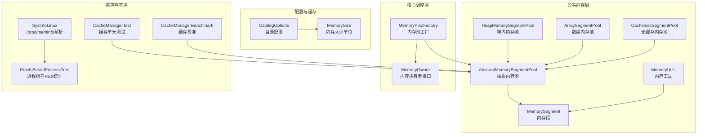
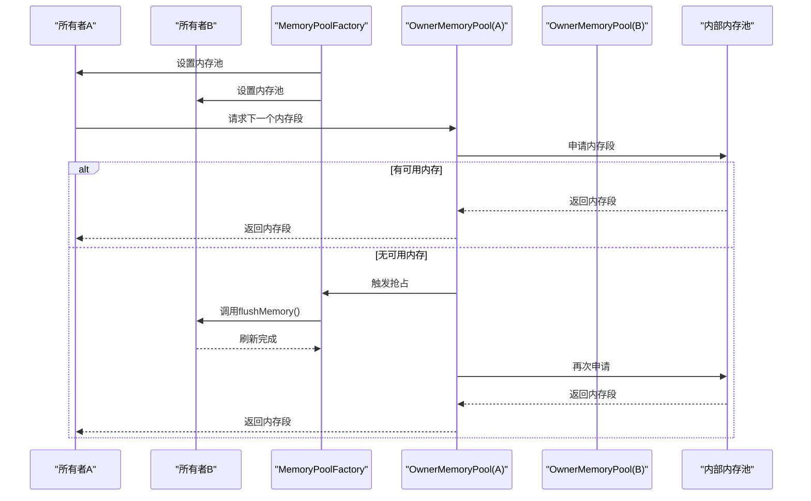
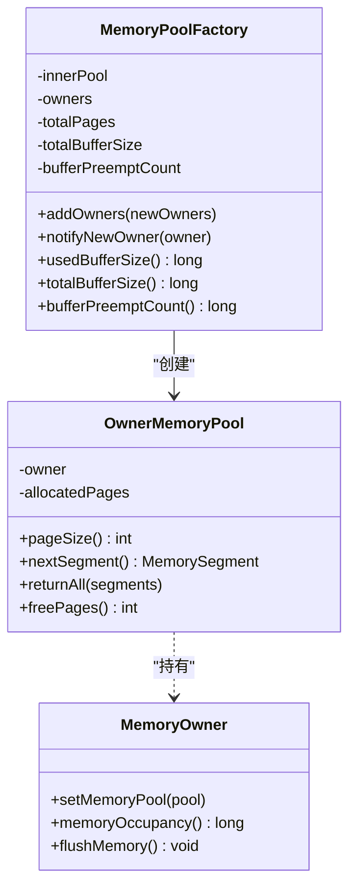
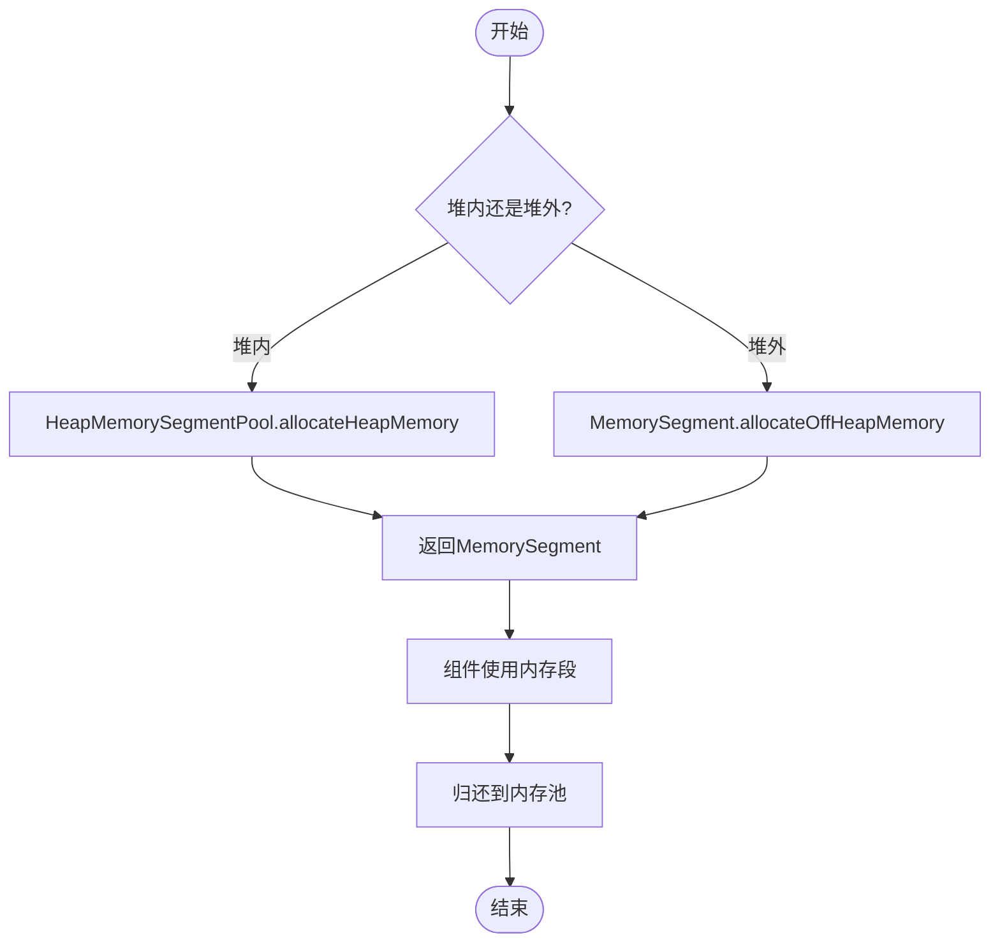
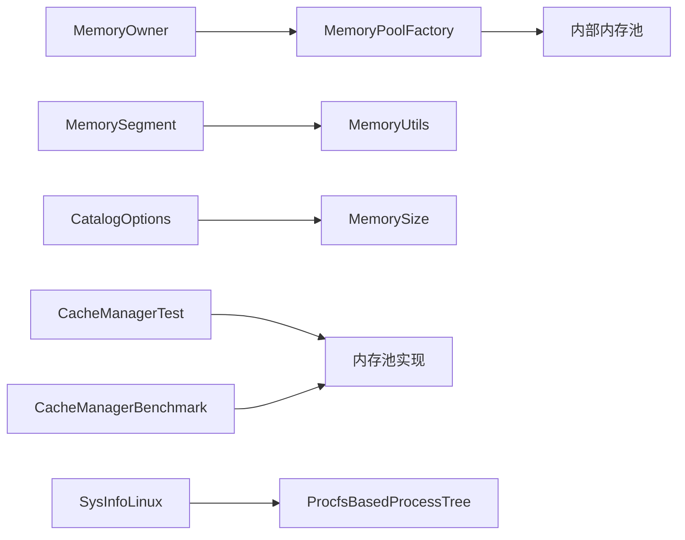

# 内存管理优化

<cite>
**本文引用的文件**
- [MemoryPoolFactory.java](file://paimon-core/src/main/java/org/apache/paimon/memory/MemoryPoolFactory.java)
- [MemoryOwner.java](file://paimon-core/src/main/java/org/apache/paimon/memory/MemoryOwner.java)
- [HeapMemorySegmentPool.java](file://paimon-common/src/main/java/org/apache/paimon/memory/HeapMemorySegmentPool.java)
- [AbstractMemorySegmentPool.java](file://paimon-common/src/main/java/org/apache/paimon/memory/AbstractMemorySegmentPool.java)
- [ArraySegmentPool.java](file://paimon-common/src/main/java/org/apache/paimon/memory/ArraySegmentPool.java)
- [CachelessSegmentPool.java](file://paimon-common/src/main/java/org/apache/paimon/memory/CachelessSegmentPool.java)
- [MemorySegment.java](file://paimon-common/src/main/java/org/apache/paimon/memory/MemorySegment.java)
- [MemoryUtils.java](file://paimon-common/src/main/java/org/apache/paimon/memory/MemoryUtils.java)
- [CatalogOptions.java](file://paimon-api/src/main/java/org/apache/paimon/options/CatalogOptions.java)
- [MemorySize.java](file://paimon-api/src/main/java/org/apache/paimon/options/MemorySize.java)
- [ExceptionUtils.java](file://paimon-common/src/main/java/org/apache/paimon/utils/ExceptionUtils.java)
- [CacheManagerTest.java](file://paimon-common/src/test/java/org/apache/paimon/io/cache/CacheManagerTest.java)
- [CacheManagerBenchmark.java](file://paimon-benchmark/paimon-micro-benchmarks/src/test/java/org/apache/paimon/benchmark/cache/CacheManagerBenchmark.java)
- [SysInfoLinux.java](file://paimon-benchmark/paimon-cluster-benchmark/src/main/java/org/apache/paimon/benchmark/metric/cpu/SysInfoLinux.java)
- [ProcfsBasedProcessTree.java](file://paimon-benchmark/paimon-cluster-benchmark/src/main/java/org/apache/paimon/benchmark/metric/cpu/ProcfsBasedProcessTree.java)
</cite>

## 目录
1. [引言](#引言)
2. [项目结构](#项目结构)
3. [核心组件](#核心组件)
4. [架构总览](#架构总览)
5. [详细组件分析](#详细组件分析)
6. [依赖关系分析](#依赖关系分析)
7. [性能考量](#性能考量)
8. [故障排查指南](#故障排查指南)
9. [结论](#结论)
10. [附录](#附录)

## 引言
本文件面向Apache Paimon的内存管理优化，系统性梳理内存池与内存段（MemorySegment）的实现与使用方式，解释堆内与堆外内存的分配策略，给出缓存系统（文件缓存、元数据缓存）的配置要点与性能影响，并结合监控与诊断工具，提供写入器、读取器、合并器等关键组件的内存优化策略与部署实践建议。同时，提供内存泄漏的预防与排查方法以及可操作的配置示例。

## 项目结构
围绕内存管理的关键模块分布于以下子模块：
- paimon-common：内存段、内存池抽象与实现、缓存管理器、内存工具
- paimon-core：内存池工厂、内存所有者接口、与具体组件交互
- paimon-api：配置项定义（含内存相关配置）
- benchmark：系统内存监控与基准测试（RSS/Virt、缓存性能）

图示来源
- [MemoryPoolFactory.java:1-152](file://paimon-core/src/main/java/org/apache/paimon/memory/MemoryPoolFactory.java#L1-L152)
- [MemoryOwner.java:1-33](file://paimon-core/src/main/java/org/apache/paimon/memory/MemoryOwner.java#L1-L33)
- [HeapMemorySegmentPool.java:1-32](file://paimon-common/src/main/java/org/apache/paimon/memory/HeapMemorySegmentPool.java#L1-L32)
- [AbstractMemorySegmentPool.java:1-67](file://paimon-common/src/main/java/org/apache/paimon/memory/AbstractMemorySegmentPool.java#L1-L67)
- [ArraySegmentPool.java:1-55](file://paimon-common/src/main/java/org/apache/paimon/memory/ArraySegmentPool.java#L1-L55)
- [CachelessSegmentPool.java:1-45](file://paimon-common/src/main/java/org/apache/paimon/memory/CachelessSegmentPool.java#L1-L45)
- [MemorySegment.java:1-605](file://paimon-common/src/main/java/org/apache/paimon/memory/MemorySegment.java#L1-L605)
- [MemoryUtils.java:97-128](file://paimon-common/src/main/java/org/apache/paimon/memory/MemoryUtils.java#L97-L128)
- [CatalogOptions.java:114-137](file://paimon-api/src/main/java/org/apache/paimon/options/CatalogOptions.java#L114-L137)
- [MemorySize.java:356-391](file://paimon-api/src/main/java/org/apache/paimon/options/MemorySize.java#L356-L391)
- [SysInfoLinux.java:202-226](file://paimon-benchmark/paimon-cluster-benchmark/src/main/java/org/apache/paimon/benchmark/metric/cpu/SysInfoLinux.java#L202-L226)
- [ProcfsBasedProcessTree.java:327-378](file://paimon-benchmark/paimon-cluster-benchmark/src/main/java/org/apache/paimon/benchmark/metric/cpu/ProcfsBasedProcessTree.java#L327-L378)
- [CacheManagerTest.java:33-70](file://paimon-common/src/test/java/org/apache/paimon/io/cache/CacheManagerTest.java#L33-L70)
- [CacheManagerBenchmark.java:36-52](file://paimon-benchmark/paimon-micro-benchmarks/src/test/java/org/apache/paimon/benchmark/cache/CacheManagerBenchmark.java#L36-L52)

章节来源
- [MemoryPoolFactory.java:1-152](file://paimon-core/src/main/java/org/apache/paimon/memory/MemoryPoolFactory.java#L1-L152)
- [MemoryOwner.java:1-33](file://paimon-core/src/main/java/org/apache/paimon/memory/MemoryOwner.java#L1-L33)
- [HeapMemorySegmentPool.java:1-32](file://paimon-common/src/main/java/org/apache/paimon/memory/HeapMemorySegmentPool.java#L1-L32)
- [AbstractMemorySegmentPool.java:1-67](file://paimon-common/src/main/java/org/apache/paimon/memory/AbstractMemorySegmentPool.java#L1-L67)
- [ArraySegmentPool.java:1-55](file://paimon-common/src/main/java/org/apache/paimon/memory/ArraySegmentPool.java#L1-L55)
- [CachelessSegmentPool.java:1-45](file://paimon-common/src/main/java/org/apache/paimon/memory/CachelessSegmentPool.java#L1-L45)
- [MemorySegment.java:1-605](file://paimon-common/src/main/java/org/apache/paimon/memory/MemorySegment.java#L1-L605)
- [MemoryUtils.java:97-128](file://paimon-common/src/main/java/org/apache/paimon/memory/MemoryUtils.java#L97-L128)
- [CatalogOptions.java:114-137](file://paimon-api/src/main/java/org/apache/paimon/options/CatalogOptions.java#L114-L137)
- [MemorySize.java:356-391](file://paimon-api/src/main/java/org/apache/paimon/options/MemorySize.java#L356-L391)
- [SysInfoLinux.java:202-226](file://paimon-benchmark/paimon-cluster-benchmark/src/main/java/org/apache/paimon/benchmark/metric/cpu/SysInfoLinux.java#L202-L226)
- [ProcfsBasedProcessTree.java:327-378](file://paimon-benchmark/paimon-cluster-benchmark/src/main/java/org/apache/paimon/benchmark/metric/cpu/ProcfsBasedProcessTree.java#L327-L378)
- [CacheManagerTest.java:33-70](file://paimon-common/src/test/java/org/apache/paimon/io/cache/CacheManagerTest.java#L33-L70)
- [CacheManagerBenchmark.java:36-52](file://paimon-benchmark/paimon-micro-benchmarks/src/test/java/org/apache/paimon/benchmark/cache/CacheManagerBenchmark.java#L36-L52)

## 核心组件
- 内存段（MemorySegment）：统一的内存访问抽象，支持堆内与堆外（Direct ByteBuffer）两种模式，提供高性能的字节级读写与批量复制。
- 抽象内存池（AbstractMemorySegmentPool）：按页（pageSize）分配与回收，维护空闲页数量与上限。
- 堆内内存池（HeapMemorySegmentPool）：基于堆内字节数组的内存段分配。
- 数组内存池（ArraySegmentPool）：从预分配列表中弹出/归还内存段，适合固定容量场景。
- 无缓存内存池（CachelessSegmentPool）：直接按需分配，不复用，避免缓存开销但可能增加分配频率。
- 内存池工厂（MemoryPoolFactory）：为多个内存所有者（MemoryOwner）划分共享内存池，必要时触发“抢占”刷新以释放内存。
- 内存所有者（MemoryOwner）：声明内存占用、设置所属内存池、提供flushMemory能力。
- 内存工具（MemoryUtils）：获取Direct ByteBuffer的原生地址等底层能力。
- 配置（CatalogOptions、MemorySize）：提供缓存内存阈值、最大内存等配置项与单位解析。

章节来源
- [MemorySegment.java:1-605](file://paimon-common/src/main/java/org/apache/paimon/memory/MemorySegment.java#L1-L605)
- [AbstractMemorySegmentPool.java:1-67](file://paimon-common/src/main/java/org/apache/paimon/memory/AbstractMemorySegmentPool.java#L1-L67)
- [HeapMemorySegmentPool.java:1-32](file://paimon-common/src/main/java/org/apache/paimon/memory/HeapMemorySegmentPool.java#L1-L32)
- [ArraySegmentPool.java:1-55](file://paimon-common/src/main/java/org/apache/paimon/memory/ArraySegmentPool.java#L1-L55)
- [CachelessSegmentPool.java:1-45](file://paimon-common/src/main/java/org/apache/paimon/memory/CachelessSegmentPool.java#L1-L45)
- [MemoryPoolFactory.java:1-152](file://paimon-core/src/main/java/org/apache/paimon/memory/MemoryPoolFactory.java#L1-L152)
- [MemoryOwner.java:1-33](file://paimon-core/src/main/java/org/apache/paimon/memory/MemoryOwner.java#L1-L33)
- [MemoryUtils.java:97-128](file://paimon-common/src/main/java/org/apache/paimon/memory/MemoryUtils.java#L97-L128)
- [CatalogOptions.java:114-137](file://paimon-api/src/main/java/org/apache/paimon/options/CatalogOptions.java#L114-L137)
- [MemorySize.java:356-391](file://paimon-api/src/main/java/org/apache/paimon/options/MemorySize.java#L356-L391)

## 架构总览
下图展示内存池工厂如何为多个所有者分配共享内存池，并在不足时触发“抢占式”刷新以释放内存。

图示来源
- [MemoryPoolFactory.java:73-93](file://paimon-core/src/main/java/org/apache/paimon/memory/MemoryPoolFactory.java#L73-L93)
- [MemoryPoolFactory.java:113-151](file://paimon-core/src/main/java/org/apache/paimon/memory/MemoryPoolFactory.java#L113-L151)

章节来源
- [MemoryPoolFactory.java:1-152](file://paimon-core/src/main/java/org/apache/paimon/memory/MemoryPoolFactory.java#L1-L152)

## 详细组件分析

### 内存池工厂与所有者（MemoryPoolFactory 与 MemoryOwner）
- 设计要点
  - 工厂持有内部内存池与总页数，为每个所有者生成子内存池（OwnerMemoryPool），记录各自已分配页数。
  - 当子池请求内存而内部池无可用页时，工厂遍历其他所有者，选择占用最大的非自身所有者调用flushMemory进行释放，再重试。
  - 提供统计接口：usedBufferSize、totalBufferSize、bufferPreemptCount，便于观测内存压力与抢占次数。
- 使用建议
  - 将写入器、读取器、合并器等组件实现MemoryOwner，确保能正确上报占用并触发刷新。
  - 合理设置总内存与页大小，避免频繁抢占；若组件间竞争激烈，考虑拆分独立工厂或增大总内存。

图示来源
- [MemoryPoolFactory.java:33-151](file://paimon-core/src/main/java/org/apache/paimon/memory/MemoryPoolFactory.java#L33-L151)
- [MemoryOwner.java:22-32](file://paimon-core/src/main/java/org/apache/paimon/memory/MemoryOwner.java#L22-L32)

章节来源
- [MemoryPoolFactory.java:1-152](file://paimon-core/src/main/java/org/apache/paimon/memory/MemoryPoolFactory.java#L1-L152)
- [MemoryOwner.java:1-33](file://paimon-core/src/main/java/org/apache/paimon/memory/MemoryOwner.java#L1-L33)

### 内存段与堆内/堆外分配（MemorySegment 与 HeapMemorySegmentPool）
- MemorySegment
  - 支持堆内（byte[]）与堆外（Direct ByteBuffer）两种模式，提供高效的批量复制与跨缓冲区传输。
  - 提供wrap/allocateHeapMemory/allocateOffHeapMemory等构造方法，适配不同场景。
- HeapMemorySegmentPool
  - 基于堆内字节数组分配内存段，适合对延迟敏感且JVM堆空间充足的场景。
- AbstractMemorySegmentPool
  - 维护最大页数与当前页数，按需分配新页，空闲时回收至队列，减少GC压力。
- ArraySegmentPool / CachelessSegmentPool
  - ArraySegmentPool适用于预分配场景，减少运行期分配抖动。
  - CachelessSegmentPool直接分配，无缓存，适合内存极度紧张或临时短生命周期对象。

图示来源
- [MemorySegment.java:83-89](file://paimon-common/src/main/java/org/apache/paimon/memory/MemorySegment.java#L83-L89)
- [HeapMemorySegmentPool.java:24-31](file://paimon-common/src/main/java/org/apache/paimon/memory/HeapMemorySegmentPool.java#L24-L31)
- [AbstractMemorySegmentPool.java:32-49](file://paimon-common/src/main/java/org/apache/paimon/memory/AbstractMemorySegmentPool.java#L32-L49)
- [ArraySegmentPool.java:31-34](file://paimon-common/src/main/java/org/apache/paimon/memory/ArraySegmentPool.java#L31-L34)
- [CachelessSegmentPool.java:31-35](file://paimon-common/src/main/java/org/apache/paimon/memory/CachelessSegmentPool.java#L31-L35)

章节来源
- [MemorySegment.java:1-605](file://paimon-common/src/main/java/org/apache/paimon/memory/MemorySegment.java#L1-L605)
- [HeapMemorySegmentPool.java:1-32](file://paimon-common/src/main/java/org/apache/paimon/memory/HeapMemorySegmentPool.java#L1-L32)
- [AbstractMemorySegmentPool.java:1-67](file://paimon-common/src/main/java/org/apache/paimon/memory/AbstractMemorySegmentPool.java#L1-L67)
- [ArraySegmentPool.java:1-55](file://paimon-common/src/main/java/org/apache/paimon/memory/ArraySegmentPool.java#L1-L55)
- [CachelessSegmentPool.java:1-45](file://paimon-common/src/main/java/org/apache/paimon/memory/CachelessSegmentPool.java#L1-L45)

### 缓存系统（文件缓存、元数据缓存）
- 元数据缓存
  - 目录配置提供manifest小文件缓存内存阈值、最大内存、快照缓存数量等参数，用于控制元数据与清单文件的缓存行为。
- 文件缓存
  - 缓存管理器支持多种缓存类型，可通过配置控制缓存容量与淘汰策略；单元测试与基准测试覆盖了缓存命中与性能验证。
- 性能影响
  - 合理设置阈值与最大内存可显著降低小文件重复读取与序列化开销；过大的缓存会增加内存占用与GC压力。

章节来源
- [CatalogOptions.java:114-137](file://paimon-api/src/main/java/org/apache/paimon/options/CatalogOptions.java#L114-L137)
- [CacheManagerTest.java:33-70](file://paimon-common/src/test/java/org/apache/paimon/io/cache/CacheManagerTest.java#L33-L70)
- [CacheManagerBenchmark.java:36-52](file://paimon-benchmark/paimon-micro-benchmarks/src/test/java/org/apache/paimon/benchmark/cache/CacheManagerBenchmark.java#L36-L52)

### 内存监控与诊断
- 系统级监控
  - SysInfoLinux与ProcfsBasedProcessTree通过解析/proc/meminfo与smaps信息，计算进程RSS与虚拟内存，辅助定位内存泄漏与异常增长。
- 应用级诊断
  - ExceptionUtils对OOM错误进行增强，区分堆、直接内存与元空间溢出，帮助快速定位问题根因。

章节来源
- [SysInfoLinux.java:202-226](file://paimon-benchmark/paimon-cluster-benchmark/src/main/java/org/apache/paimon/benchmark/metric/cpu/SysInfoLinux.java#L202-L226)
- [ProcfsBasedProcessTree.java:327-378](file://paimon-benchmark/paimon-cluster-benchmark/src/main/java/org/apache/paimon/benchmark/metric/cpu/ProcfsBasedProcessTree.java#L327-L378)
- [ExceptionUtils.java:104-223](file://paimon-common/src/main/java/org/apache/paimon/utils/ExceptionUtils.java#L104-L223)

## 依赖关系分析
- 组件耦合
  - MemoryPoolFactory依赖MemoryOwner接口，通过回调触发flushMemory，实现“抢占式”内存回收。
  - MemorySegment与MemoryUtils紧密协作，前者提供统一内存访问，后者提供底层地址访问能力。
  - CatalogOptions与MemorySize共同决定缓存配置的解析与落地。
- 外部依赖
  - 缓存实现（如Caffeine）由缓存管理器封装，基准测试验证其性能表现。

图示来源
- [MemoryPoolFactory.java:1-152](file://paimon-core/src/main/java/org/apache/paimon/memory/MemoryPoolFactory.java#L1-L152)
- [MemoryOwner.java:1-33](file://paimon-core/src/main/java/org/apache/paimon/memory/MemoryOwner.java#L1-L33)
- [MemorySegment.java:1-605](file://paimon-common/src/main/java/org/apache/paimon/memory/MemorySegment.java#L1-L605)
- [MemoryUtils.java:97-128](file://paimon-common/src/main/java/org/apache/paimon/memory/MemoryUtils.java#L97-L128)
- [CatalogOptions.java:114-137](file://paimon-api/src/main/java/org/apache/paimon/options/CatalogOptions.java#L114-L137)
- [MemorySize.java:356-391](file://paimon-api/src/main/java/org/apache/paimon/options/MemorySize.java#L356-L391)
- [CacheManagerTest.java:33-70](file://paimon-common/src/test/java/org/apache/paimon/io/cache/CacheManagerTest.java#L33-L70)
- [CacheManagerBenchmark.java:36-52](file://paimon-benchmark/paimon-micro-benchmarks/src/test/java/org/apache/paimon/benchmark/cache/CacheManagerBenchmark.java#L36-L52)
- [SysInfoLinux.java:202-226](file://paimon-benchmark/paimon-cluster-benchmark/src/main/java/org/apache/paimon/benchmark/metric/cpu/SysInfoLinux.java#L202-L226)
- [ProcfsBasedProcessTree.java:327-378](file://paimon-benchmark/paimon-cluster-benchmark/src/main/java/org/apache/paimon/benchmark/metric/cpu/ProcfsBasedProcessTree.java#L327-L378)

章节来源
- [MemoryPoolFactory.java:1-152](file://paimon-core/src/main/java/org/apache/paimon/memory/MemoryPoolFactory.java#L1-L152)
- [MemoryOwner.java:1-33](file://paimon-core/src/main/java/org/apache/paimon/memory/MemoryOwner.java#L1-L33)
- [MemorySegment.java:1-605](file://paimon-common/src/main/java/org/apache/paimon/memory/MemorySegment.java#L1-L605)
- [MemoryUtils.java:97-128](file://paimon-common/src/main/java/org/apache/paimon/memory/MemoryUtils.java#L97-L128)
- [CatalogOptions.java:114-137](file://paimon-api/src/main/java/org/apache/paimon/options/CatalogOptions.java#L114-L137)
- [MemorySize.java:356-391](file://paimon-api/src/main/java/org/apache/paimon/options/MemorySize.java#L356-L391)
- [CacheManagerTest.java:33-70](file://paimon-common/src/test/java/org/apache/paimon/io/cache/CacheManagerTest.java#L33-L70)
- [CacheManagerBenchmark.java:36-52](file://paimon-benchmark/paimon-micro-benchmarks/src/test/java/org/apache/paimon/benchmark/cache/CacheManagerBenchmark.java#L36-L52)
- [SysInfoLinux.java:202-226](file://paimon-benchmark/paimon-cluster-benchmark/src/main/java/org/apache/paimon/benchmark/metric/cpu/SysInfoLinux.java#L202-L226)
- [ProcfsBasedProcessTree.java:327-378](file://paimon-benchmark/paimon-cluster-benchmark/src/main/java/org/apache/paimon/benchmark/metric/cpu/ProcfsBasedProcessTree.java#L327-L378)

## 性能考量
- 内存池与页大小
  - 选择合适的pageSize可平衡分配次数与碎片；较大的页适合大批量数据处理，较小的页适合低延迟场景。
  - 控制总内存上限，避免频繁触发抢占；通过usedBufferSize/totalBufferSize观察利用率。
- 堆内 vs 堆外
  - 堆内分配简单、GC友好；堆外分配零拷贝优势明显，但需要谨慎管理生命周期，避免泄漏。
  - 对热点路径优先考虑堆外，对临时对象可采用CachelessSegmentPool减少分配。
- 缓存策略
  - 小文件清单与元数据缓存可显著降低IO；合理设置阈值与最大内存，避免缓存膨胀导致GC停顿。
  - 结合基准测试评估缓存命中率与延迟，动态调整缓存容量。
- 监控与采样
  - 定期采集RSS/Virt与OOM日志，结合异常增强信息定位根因；对长时间运行的服务开启周期性内存快照。

[本节为通用指导，无需列出章节来源]

## 故障排查指南
- OOM定位
  - 使用ExceptionUtils增强OOM错误消息，区分堆、直接内存与元空间溢出，快速定位问题类型。
- 泄漏排查
  - 通过SysInfoLinux与ProcfsBasedProcessTree监控RSS变化，识别持续增长的进程映射；结合smaps过滤只读共享映射，估算真实RSS。
- 缓存问题
  - 若出现缓存命中率低或内存占用高，检查CatalogOptions中的缓存阈值与最大内存配置；必要时启用基准测试验证效果。
- 抢占与卡顿
  - 若频繁触发bufferPreemptCount，说明组件间内存竞争严重；应优化各组件的flush策略或提升总内存。

章节来源
- [ExceptionUtils.java:104-223](file://paimon-common/src/main/java/org/apache/paimon/utils/ExceptionUtils.java#L104-L223)
- [SysInfoLinux.java:202-226](file://paimon-benchmark/paimon-cluster-benchmark/src/main/java/org/apache/paimon/benchmark/metric/cpu/SysInfoLinux.java#L202-L226)
- [ProcfsBasedProcessTree.java:327-378](file://paimon-benchmark/paimon-cluster-benchmark/src/main/java/org/apache/paimon/benchmark/metric/cpu/ProcfsBasedProcessTree.java#L327-L378)
- [MemoryPoolFactory.java:95-111](file://paimon-core/src/main/java/org/apache/paimon/memory/MemoryPoolFactory.java#L95-L111)

## 结论
Paimon的内存管理以MemorySegment为核心，通过MemoryPoolFactory实现多组件共享内存池与“抢占式”回收，辅以堆内/堆外分配策略与缓存配置，满足不同场景的性能与稳定性要求。结合系统级监控与应用级诊断，可在生产环境中有效规避内存泄漏与GC风暴，实现稳定高效的流批一体存储。

[本节为总结，无需列出章节来源]

## 附录

### 不同组件的内存需求与优化策略
- 写入器
  - 需要大量短期缓冲进行行/列式编码与排序；建议使用堆外内存池与较大的pageSize，配合定期flush。
- 读取器
  - 面向顺序扫描与随机访问混合；建议启用小文件清单缓存，合理设置阈值与最大内存。
- 合并器
  - 外部排序与归并阶段内存占用峰值较高；建议扩大总内存并适度提高页大小，减少分配次数。

[本节为概念性内容，无需列出章节来源]

### 内存配置示例与调优建议
- 目录缓存相关
  - cache.manifest.small-file-memory：控制小清单文件缓存内存，默认值见配置项定义。
  - cache.manifest.small-file-threshold：小文件阈值，默认值见配置项定义。
  - cache.manifest.max-memory：清单内容最大缓存内存，未默认值，按需设置。
  - cache.snapshot.max-num-per-table：每表快照缓存数量，默认20。
- 内存大小单位
  - 支持b/kb/kib/mb/mib/gb/gib/tb/tib等单位解析，便于直观配置。

章节来源
- [CatalogOptions.java:114-137](file://paimon-api/src/main/java/org/apache/paimon/options/CatalogOptions.java#L114-L137)
- [MemorySize.java:356-391](file://paimon-api/src/main/java/org/apache/paimon/options/MemorySize.java#L356-L391)

### 在不同部署环境下的最佳实践
- 容器/云原生
  - 明确JVM堆与直接内存限制，避免cgroup触发OOM；优先使用堆外内存池以降低GC压力。
- 批处理集群
  - 提升总内存与页大小，减少抢占；启用缓存并设置合理的过期策略。
- 流式/实时
  - 降低单次分配规模，提高回收频率；对热点路径使用堆外与预分配内存池。

[本节为通用指导，无需列出章节来源]