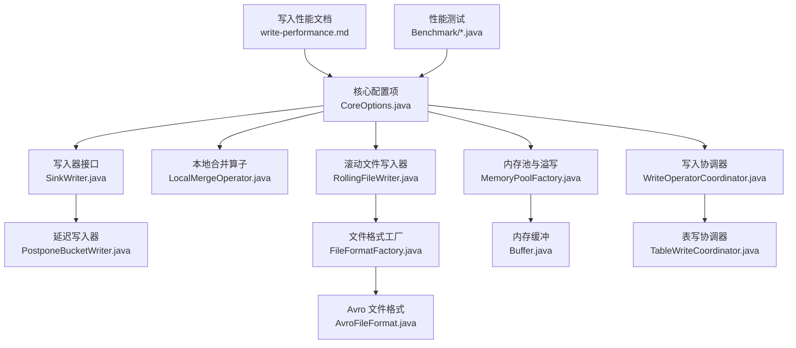
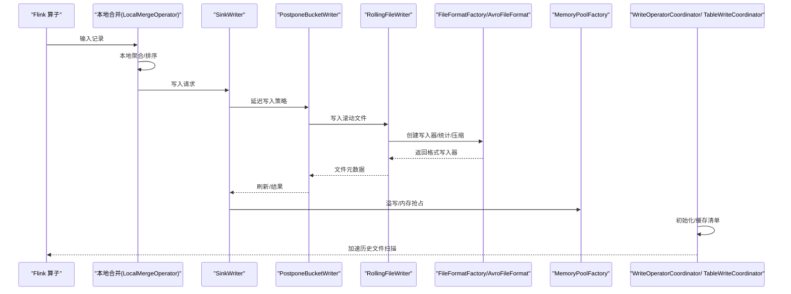
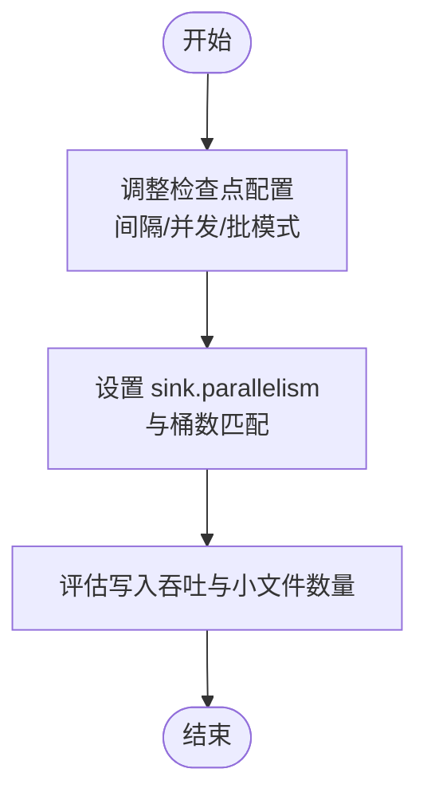
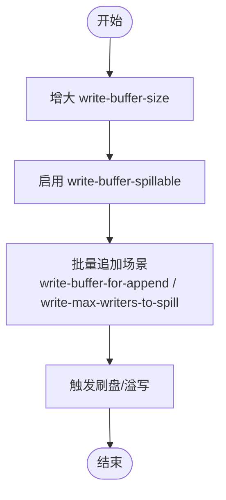
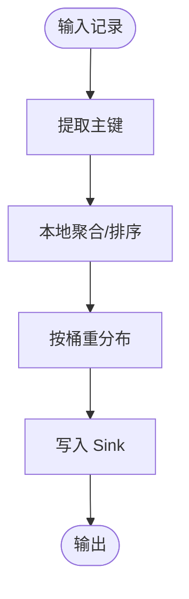
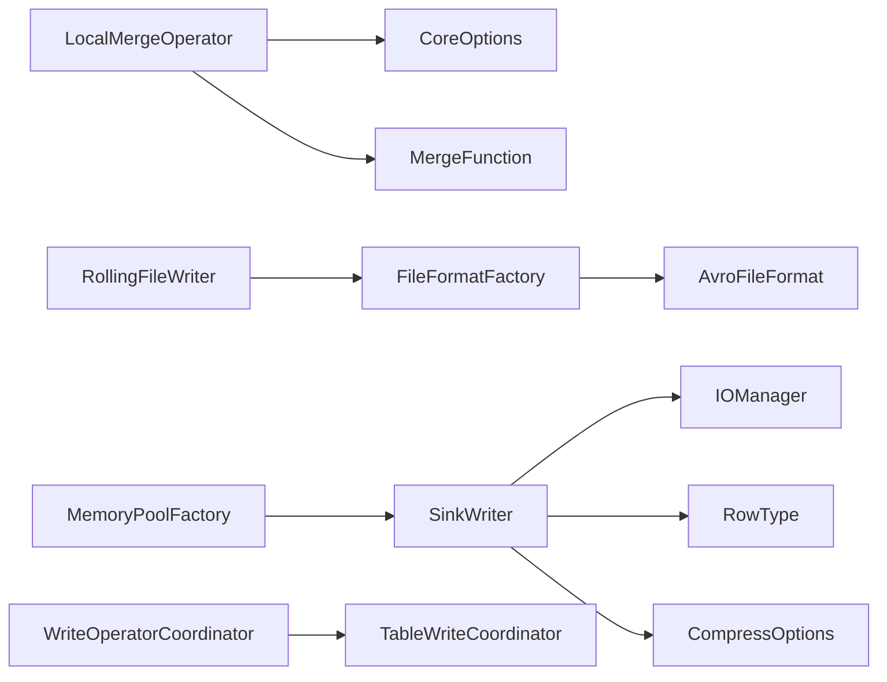

# 写入性能优化

<cite>
**本文引用的文件**
- [write-performance.md](file://docs/content/maintenance/write-performance.md)
- [sql-write.md](file://docs/content/flink/sql-write.md)
- [CoreOptions.java](file://paimon-api/src/main/java/org/apache/paimon/CoreOptions.java)
- [SinkWriter.java](file://paimon-core/src/main/java/org/apache/paimon/utils/SinkWriter.java)
- [PostponeBucketWriter.java](file://paimon-core/src/main/java/org/apache/paimon/postpone/PostponeBucketWriter.java)
- [LocalMergeOperator.java](file://paimon-flink/paimon-flink-common/src/main/java/org/apache/paimon/flink/sink/LocalMergeOperator.java)
- [AvroFileFormat.java](file://paimon-format/src/main/java/org/apache/paimon/format/avro/AvroFileFormat.java)
- [RollingFileWriter.java](file://paimon-core/src/main/java/org/apache/paimon/io/RollingFileWriter.java)
- [FileFormatFactory.java](file://paimon-common/src/main/java/org/apache/paimon/format/FileFormatFactory.java)
- [MemoryPoolFactory.java](file://paimon-common/src/main/java/org/apache/paimon/memory/MemoryPoolFactory.java)
- [MemoryUtils.java](file://paimon-common/src/main/java/org/apache/paimon/memory/MemoryUtils.java)
- [Buffer.java](file://paimon-common/src/main/java/org/apache/paimon/memory/Buffer.java)
- [WriteOperatorCoordinator.java](file://paimon-flink/paimon-flink-common/src/main/java/org/apache/paimon/flink/sink/coordinator/WriteOperatorCoordinator.java)
- [TableWriteCoordinator.java](file://paimon-flink/paimon-flink-common/src/main/java/org/apache/paimon/flink/sink/coordinator/TableWriteCoordinator.java)
- [MemoryFileStoreWrite.java](file://paimon-core/src/main/java/org/apache/paimon/operation/MemoryFileStoreWrite.java)
- [AbstractFileStoreWrite.java](file://paimon-core/src/main/java/org/apache/paimon/operation/AbstractFileStoreWrite.java)
- [OrcFile.java](file://paimon-format/src/main/java/org/apache/orc/OrcFile.java)
- [TableSortInfo.java](file://paimon-flink/paimon-flink-common/src/main/java/org/apache/paimon/flink/sorter/TableSortInfo.java)
- [ReadWriteTableITCase.java](file://paimon-flink/paimon-flink-common/src/test/java/org/apache/paimon/flink/ReadWriteTableITCase.java)
- [PostponeBucketTableITCase.java](file://paimon-flink/paimon-flink-common/src/test/java/org/apache/paimon/flink/PostponeBucketTableITCase.java)
- [LookupWriterBenchmark.java](file://paimon-benchmark/paimon-micro-benchmarks/src/test/java/org/apache/paimon/benchmark/lookup/LookupWriterBenchmark.java)
- [TableWriterBenchmark.java](file://paimon-benchmark/paimon-micro-benchmarks/src/test/java/org/apache/paimon/benchmark/TableWriterBenchmark.java)
- [ArrowWriteBenchmark.java](file://paimon-benchmark/paimon-micro-benchmarks/src/test/java/org/apache/paimon/benchmark/arrow/ArrowWriteBenchmark.java)
- [Benchmark.java](file://paimon-benchmark/paimon-cluster-benchmark/src/main/java/org/apache/paimon/benchmark/Benchmark.java)
</cite>

## 目录
1. [引言](#引言)
2. [项目结构](#项目结构)
3. [核心组件](#核心组件)
4. [架构总览](#架构总览)
5. [详细组件分析](#详细组件分析)
6. [依赖关系分析](#依赖关系分析)
7. [性能考量](#性能考量)
8. [故障排查指南](#故障排查指南)
9. [结论](#结论)
10. [附录](#附录)

## 引言
本技术文档聚焦于 Apache Paimon 的写入性能优化，系统梳理并解释关键影响因素：检查点配置、缓冲区与溢写、并行度与桶数、本地合并（Local Merging）在主键数据倾斜场景下的策略、文件格式选择（尤其是 AVRO 行存储）与压缩算法（ZSTD 级别），以及写入初始化阶段的稳定性保障（Writer Coordinator）。同时给出内存管理策略、稳定性配置与可操作的配置示例及性能测试方法，帮助读者在不同业务负载下获得稳定且高效的写入吞吐。

## 项目结构
围绕写入性能优化，本文涉及以下模块与文件：
- 文档与最佳实践：维护指南中的写入性能文档、Flink SQL 写入文档
- 核心配置项：CoreOptions 中的写入、压缩、文件格式、内存与稳定性相关选项
- 写入执行链路：SinkWriter、PostponeBucketWriter、LocalMergeOperator、RollingFileWriter、FileFormatFactory
- 内存与溢写：MemoryPoolFactory、MemoryUtils、Buffer
- 初始化与协调：WriteOperatorCoordinator、TableWriteCoordinator
- 性能测试：微基准与集群基准

**图表来源**
- [write-performance.md:27-164](file://docs/content/maintenance/write-performance.md#L27-L164)
- [CoreOptions.java:292-330](file://paimon-api/src/main/java/org/apache/paimon/CoreOptions.java#L292-L330)
- [SinkWriter.java:79-124](file://paimon-core/src/main/java/org/apache/paimon/utils/SinkWriter.java#L79-L124)
- [PostponeBucketWriter.java:175-189](file://paimon-core/src/main/java/org/apache/paimon/postpone/PostponeBucketWriter.java#L175-L189)
- [LocalMergeOperator.java:75-149](file://paimon-flink/paimon-flink-common/src/main/java/org/apache/paimon/flink/sink/LocalMergeOperator.java#L75-L149)
- [RollingFileWriter.java:29-57](file://paimon-core/src/main/java/org/apache/paimon/io/RollingFileWriter.java#L29-L57)
- [FileFormatFactory.java:30-71](file://paimon-common/src/main/java/org/apache/paimon/format/FileFormatFactory.java#L30-L71)
- [AvroFileFormat.java:51-86](file://paimon-format/src/main/java/org/apache/paimon/format/avro/AvroFileFormat.java#L51-L86)
- [MemoryPoolFactory.java:69-121](file://paimon-common/src/main/java/org/apache/paimon/memory/MemoryPoolFactory.java#L69-L121)
- [Buffer.java:30-52](file://paimon-common/src/main/java/org/apache/paimon/memory/Buffer.java#L30-L52)
- [WriteOperatorCoordinator.java:52-72](file://paimon-flink/paimon-flink-common/src/main/java/org/apache/paimon/flink/sink/coordinator/WriteOperatorCoordinator.java#L52-L72)
- [TableWriteCoordinator.java:55-64](file://paimon-flink/paimon-flink-common/src/main/java/org/apache/paimon/flink/sink/coordinator/TableWriteCoordinator.java#L55-L64)
- [Benchmark.java:196-240](file://paimon-benchmark/paimon-cluster-benchmark/src/main/java/org/apache/paimon/benchmark/Benchmark.java#L196-L240)

**章节来源**
- [write-performance.md:27-164](file://docs/content/maintenance/write-performance.md#L27-L164)
- [CoreOptions.java:292-330](file://paimon-api/src/main/java/org/apache/paimon/CoreOptions.java#L292-L330)

## 核心组件
- 写入器与滚动写入
  - SinkWriter 抽象了写入与刷新流程，支持缓冲写入与溢写能力开关
  - PostponeBucketWriter 基于延迟写入策略，结合缓冲写入器实现更优的写入与合并时机
  - RollingFileWriter 提供按大小自动翻转的滚动写入能力，并封装统计收集与压缩配置
- 本地合并（Local Merging）
  - LocalMergeOperator 在写入前对主键数据进行本地聚合，缓解热点主键与频繁更新带来的写放大
- 文件格式与压缩
  - AvroFileFormat 支持行存储与压缩配置；FileFormatFactory 汇聚格式上下文与压缩级别
- 内存与溢写
  - MemoryPoolFactory 负责多写入器共享内存池与抢占式溢写；Buffer/BufferFile 提供底层缓冲抽象
- 写入协调与初始化
  - WriteOperatorCoordinator 与 TableWriteCoordinator 在初始化阶段缓存清单以加速历史文件扫描

**章节来源**
- [SinkWriter.java:79-124](file://paimon-core/src/main/java/org/apache/paimon/utils/SinkWriter.java#L79-L124)
- [PostponeBucketWriter.java:175-189](file://paimon-core/src/main/java/org/apache/paimon/postpone/PostponeBucketWriter.java#L175-L189)
- [RollingFileWriter.java:29-57](file://paimon-core/src/main/java/org/apache/paimon/io/RollingFileWriter.java#L29-L57)
- [LocalMergeOperator.java:75-149](file://paimon-flink/paimon-flink-common/src/main/java/org/apache/paimon/flink/sink/LocalMergeOperator.java#L75-L149)
- [AvroFileFormat.java:51-86](file://paimon-format/src/main/java/org/apache/paimon/format/avro/AvroFileFormat.java#L51-L86)
- [FileFormatFactory.java:30-71](file://paimon-common/src/main/java/org/apache/paimon/format/FileFormatFactory.java#L30-L71)
- [MemoryPoolFactory.java:69-121](file://paimon-common/src/main/java/org/apache/paimon/memory/MemoryPoolFactory.java#L69-L121)
- [WriteOperatorCoordinator.java:52-72](file://paimon-flink/paimon-flink-common/src/main/java/org/apache/paimon/flink/sink/coordinator/WriteOperatorCoordinator.java#L52-L72)
- [TableWriteCoordinator.java:55-64](file://paimon-flink/paimon-flink-common/src/main/java/org/apache/paimon/flink/sink/coordinator/TableWriteCoordinator.java#L55-L64)

## 架构总览
下图展示写入路径从算子到文件层的关键交互，涵盖检查点、缓冲、本地合并、文件格式与压缩、内存溢写与协调器初始化。

**图表来源**
- [LocalMergeOperator.java:75-149](file://paimon-flink/paimon-flink-common/src/main/java/org/apache/paimon/flink/sink/LocalMergeOperator.java#L75-L149)
- [SinkWriter.java:79-124](file://paimon-core/src/main/java/org/apache/paimon/utils/SinkWriter.java#L79-L124)
- [PostponeBucketWriter.java:175-189](file://paimon-core/src/main/java/org/apache/paimon/postpone/PostponeBucketWriter.java#L175-L189)
- [RollingFileWriter.java:29-57](file://paimon-core/src/main/java/org/apache/paimon/io/RollingFileWriter.java#L29-L57)
- [FileFormatFactory.java:30-71](file://paimon-common/src/main/java/org/apache/paimon/format/FileFormatFactory.java#L30-L71)
- [AvroFileFormat.java:51-86](file://paimon-format/src/main/java/org/apache/paimon/format/avro/AvroFileFormat.java#L51-L86)
- [MemoryPoolFactory.java:69-121](file://paimon-common/src/main/java/org/apache/paimon/memory/MemoryPoolFactory.java#L69-L121)
- [WriteOperatorCoordinator.java:52-72](file://paimon-flink/paimon-flink-common/src/main/java/org/apache/paimon/flink/sink/coordinator/WriteOperatorCoordinator.java#L52-L72)
- [TableWriteCoordinator.java:55-64](file://paimon-flink/paimon-flink-common/src/main/java/org/apache/paimon/flink/sink/coordinator/TableWriteCoordinator.java#L55-L64)

## 详细组件分析

### 检查点与并行度配置优化
- 检查点间隔与并发
  - 增大检查点间隔、限制并发检查点数量，或在批模式下运行，有助于降低检查点开销，提升写入吞吐
- 并行度与桶数
  - sink.parallelism 建议小于等于桶数，优先等于桶数，避免写入热点与小文件过多
  - 固定桶模式下可动态调整桶数以适配并行度

**图表来源**
- [write-performance.md:29-48](file://docs/content/maintenance/write-performance.md#L29-L48)
- [CoreOptions.java:103-115](file://paimon-api/src/main/java/org/apache/paimon/CoreOptions.java#L103-L115)
- [ReadWriteTableITCase.java:1371-1377](file://paimon-flink/paimon-flink-common/src/test/java/org/apache/paimon/flink/ReadWriteTableITCase.java#L1371-L1377)
- [PostponeBucketTableITCase.java:1090-1119](file://paimon-flink/paimon-flink-common/src/test/java/org/apache/paimon/flink/PostponeBucketTableITCase.java#L1090-L1119)

**章节来源**
- [write-performance.md:29-48](file://docs/content/maintenance/write-performance.md#L29-L48)
- [CoreOptions.java:103-115](file://paimon-api/src/main/java/org/apache/paimon/CoreOptions.java#L103-L115)
- [ReadWriteTableITCase.java:1371-1377](file://paimon-flink/paimon-flink-common/src/test/java/org/apache/paimon/flink/ReadWriteTableITCase.java#L1371-L1377)
- [PostponeBucketTableITCase.java:1090-1119](file://paimon-flink/paimon-flink-common/src/test/java/org/apache/paimon/flink/PostponeBucketTableITCase.java#L1090-L1119)

### 缓冲区与溢写（write-buffer-size 与 write-buffer-spillable）
- 写缓冲大小
  - 增大 write-buffer-size 可减少刷盘频率，提升吞吐；但需关注内存占用
- 溢写能力
  - 启用 write-buffer-spillable 可在内存紧张时将部分缓冲溢写至磁盘，避免频繁小文件与长时间阻塞
- 批量追加场景
  - 对于大批量追加写入，可开启 write-buffer-for-append 或 write-max-writers-to-spill，避免 OOM

**图表来源**
- [write-performance.md:34-36](file://docs/content/maintenance/write-performance.md#L34-L36)
- [CoreOptions.java:664-690](file://paimon-api/src/main/java/org/apache/paimon/CoreOptions.java#L664-L690)
- [MemoryPoolFactory.java:69-121](file://paimon-common/src/main/java/org/apache/paimon/memory/MemoryPoolFactory.java#L69-L121)

**章节来源**
- [write-performance.md:34-36](file://docs/content/maintenance/write-performance.md#L34-L36)
- [CoreOptions.java:664-690](file://paimon-api/src/main/java/org/apache/paimon/CoreOptions.java#L664-L690)
- [MemoryPoolFactory.java:69-121](file://paimon-common/src/main/java/org/apache/paimon/memory/MemoryPoolFactory.java#L69-L121)

### 桶数量调整与固定桶模式
- 固定桶模式
  - 当桶数与并行度一致时，可减少跨桶数据重分布与热点
- 动态/延迟桶模式
  - 在高并发写入初期可采用延迟桶策略，待数据分布稳定后再调整

**章节来源**
- [CoreOptions.java:103-115](file://paimon-api/src/main/java/org/apache/paimon/CoreOptions.java#L103-L115)
- [PostponeBucketTableITCase.java:1090-1119](file://paimon-flink/paimon-flink-common/src/test/java/org/apache/paimon/flink/PostponeBucketTableITCase.java#L1090-L1119)

### 本地合并（Local Merging）机制与主键数据倾斜优化
- 工作原理
  - LocalMergeOperator 在写入前根据主键聚合/排序，减少后续写入与合并压力
  - 针对主键数据倾斜，通过本地缓冲与排序，降低热点主键导致的写放大
- 配置要点
  - 设置 local-merge-buffer-size，建议从 64MB 起步，观察吞吐与背压变化
  - 仅适用于主键表；CDC 场景当前不适用

**图表来源**
- [LocalMergeOperator.java:75-149](file://paimon-flink/paimon-flink-common/src/main/java/org/apache/paimon/flink/sink/LocalMergeOperator.java#L75-L149)
- [write-performance.md:71-83](file://docs/content/maintenance/write-performance.md#L71-L83)

**章节来源**
- [LocalMergeOperator.java:75-149](file://paimon-flink/paimon-flink-common/src/main/java/org/apache/paimon/flink/sink/LocalMergeOperator.java#L75-L149)
- [write-performance.md:71-83](file://docs/content/maintenance/write-performance.md#L71-L83)

### 文件格式选择：AVRO 行存储的权衡
- 优势
  - 写入与合并性能高，适合大规模写入
- 劣势
  - 查询投影受限，列裁剪无效；统计信息收集成本高，压缩效率下降，存储成本上升
- 使用建议
  - 全表或高层级文件采用 AVRO，或通过 per-level 策略仅对特定层级启用
  - 关闭统计信息以进一步降低成本

**章节来源**
- [write-performance.md:85-107](file://docs/content/maintenance/write-performance.md#L85-L107)
- [AvroFileFormat.java:51-86](file://paimon-format/src/main/java/org/apache/paimon/format/avro/AvroFileFormat.java#L51-L86)
- [CoreOptions.java:307-316](file://paimon-api/src/main/java/org/apache/paimon/CoreOptions.java#L307-L316)

### 压缩算法与 ZSTD 级别的权衡
- 默认使用 zstd，建议保持默认级别以平衡读写速度
- 提升压缩比可调高 zstd-level 至 9，但会显著降低读写速度
- 可按层级差异化配置压缩策略

**章节来源**
- [write-performance.md:109-114](file://docs/content/maintenance/write-performance.md#L109-L114)
- [CoreOptions.java:318-330](file://paimon-api/src/main/java/org/apache/paimon/CoreOptions.java#L318-L330)
- [CoreOptions.java:299-306](file://paimon-api/src/main/java/org/apache/paimon/CoreOptions.java#L299-L306)

### 写入初始化阶段的性能优化（Writer Coordinator）
- 场景瓶颈
  - 写入初始化需要读取历史文件清单，分区多或文件多时易成为瓶颈
- 优化手段
  - 启用 sink.writer-coordinator.enabled，由协调器缓存清单，加速初始化
  - 调整 sink.writer-coordinator.cache-memory 控制缓存大小

**章节来源**
- [write-performance.md:126-132](file://docs/content/maintenance/write-performance.md#L126-L132)
- [WriteOperatorCoordinator.java:52-72](file://paimon-flink/paimon-flink-common/src/main/java/org/apache/paimon/flink/sink/coordinator/WriteOperatorCoordinator.java#L52-L72)
- [TableWriteCoordinator.java:55-64](file://paimon-flink/paimon-flink-common/src/main/java/org/apache/paimon/flink/sink/coordinator/TableWriteCoordinator.java#L55-L64)

### 内存管理策略：write-buffer-size 与托管内存分配器
- 写缓冲内存
  - 通过 write-buffer-size 调整；过大可能增加刷盘延迟，过小导致频繁刷盘
- 托管内存分配器
  - 若作业不依赖状态，可降低 TaskManager managed memory，或启用 sink.use-managed-memory-allocator 将写缓冲纳入托管内存，避免 OOM

**章节来源**
- [write-performance.md:133-153](file://docs/content/maintenance/write-performance.md#L133-L153)
- [CoreOptions.java:664-676](file://paimon-api/src/main/java/org/apache/paimon/CoreOptions.java#L664-L676)

### 稳定性保障：检查点超时与资源管理
- 检查点超时
  - 全量/满合并可能导致检查点耗时增加，适当提高 execution.checkpointing.timeout
- Committer 资源
  - 大量写入时，Committer 节点内存占用高，可通过细粒度资源管理单独提升 Committers 的堆内存

**章节来源**
- [write-performance.md:115-125](file://docs/content/maintenance/write-performance.md#L115-L125)
- [write-performance.md:154-164](file://docs/content/maintenance/write-performance.md#L154-L164)

### 实际配置示例与性能测试方法
- 配置示例（基于文档）
  - 文件格式与统计：file.format=avro，metadata.stats-mode=none
  - 层级格式：file.format.per.level=0:avro,1:avro
  - 压缩级别：file.compression=zstd，file.compression.zstd-level=1
  - 写缓冲：write-buffer-size、write-buffer-spillable
  - 并行度：sink.parallelism
  - 协调器：sink.writer-coordinator.enabled、sink.writer-coordinator.cache-memory
- 性能测试
  - 微基准：LookupWriterBenchmark、TableWriterBenchmark、ArrowWriteBenchmark
  - 集群基准：Benchmark 输出 RPS、CPU、数据新鲜度等指标

**章节来源**
- [write-performance.md:96-107](file://docs/content/maintenance/write-performance.md#L96-L107)
- [LookupWriterBenchmark.java:30-89](file://paimon-benchmark/paimon-micro-benchmarks/src/test/java/org/apache/paimon/benchmark/lookup/LookupWriterBenchmark.java#L30-L89)
- [TableWriterBenchmark.java:123-159](file://paimon-benchmark/paimon-micro-benchmarks/src/test/java/org/apache/paimon/benchmark/TableWriterBenchmark.java#L123-L159)
- [ArrowWriteBenchmark.java:30-68](file://paimon-benchmark/paimon-micro-benchmarks/src/test/java/org/apache/paimon/benchmark/arrow/ArrowWriteBenchmark.java#L30-L68)
- [Benchmark.java:196-240](file://paimon-benchmark/paimon-cluster-benchmark/src/main/java/org/apache/paimon/benchmark/Benchmark.java#L196-L240)

## 依赖关系分析
- 写入链路依赖
  - LocalMergeOperator 依赖 CoreOptions 与 MergeFunction，决定是否使用哈希聚合或排序缓冲
  - SinkWriter 依赖 IOManager、RowType、CompressOptions 与缓冲写入器
  - RollingFileWriter 依赖 FileFormatFactory 与统计收集器
- 内存与溢写
  - MemoryPoolFactory 统一管理多个写入器的内存抢占与溢写
- 初始化与协调
  - WriteOperatorCoordinator 与 TableWriteCoordinator 共同负责初始化阶段的清单缓存与一致性

**图表来源**
- [LocalMergeOperator.java:75-149](file://paimon-flink/paimon-flink-common/src/main/java/org/apache/paimon/flink/sink/LocalMergeOperator.java#L75-L149)
- [SinkWriter.java:79-124](file://paimon-core/src/main/java/org/apache/paimon/utils/SinkWriter.java#L79-L124)
- [RollingFileWriter.java:29-57](file://paimon-core/src/main/java/org/apache/paimon/io/RollingFileWriter.java#L29-L57)
- [FileFormatFactory.java:30-71](file://paimon-common/src/main/java/org/apache/paimon/format/FileFormatFactory.java#L30-L71)
- [AvroFileFormat.java:51-86](file://paimon-format/src/main/java/org/apache/paimon/format/avro/AvroFileFormat.java#L51-L86)
- [MemoryPoolFactory.java:69-121](file://paimon-common/src/main/java/org/apache/paimon/memory/MemoryPoolFactory.java#L69-L121)
- [WriteOperatorCoordinator.java:52-72](file://paimon-flink/paimon-flink-common/src/main/java/org/apache/paimon/flink/sink/coordinator/WriteOperatorCoordinator.java#L52-L72)
- [TableWriteCoordinator.java:55-64](file://paimon-flink/paimon-flink-common/src/main/java/org/apache/paimon/flink/sink/coordinator/TableWriteCoordinator.java#L55-L64)

**章节来源**
- [LocalMergeOperator.java:75-149](file://paimon-flink/paimon-flink-common/src/main/java/org/apache/paimon/flink/sink/LocalMergeOperator.java#L75-L149)
- [SinkWriter.java:79-124](file://paimon-core/src/main/java/org/apache/paimon/utils/SinkWriter.java#L79-L124)
- [RollingFileWriter.java:29-57](file://paimon-core/src/main/java/org/apache/paimon/io/RollingFileWriter.java#L29-L57)
- [FileFormatFactory.java:30-71](file://paimon-common/src/main/java/org/apache/paimon/format/FileFormatFactory.java#L30-L71)
- [AvroFileFormat.java:51-86](file://paimon-format/src/main/java/org/apache/paimon/format/avro/AvroFileFormat.java#L51-L86)
- [MemoryPoolFactory.java:69-121](file://paimon-common/src/main/java/org/apache/paimon/memory/MemoryPoolFactory.java#L69-L121)
- [WriteOperatorCoordinator.java:52-72](file://paimon-flink/paimon-flink-common/src/main/java/org/apache/paimon/flink/sink/coordinator/WriteOperatorCoordinator.java#L52-L72)
- [TableWriteCoordinator.java:55-64](file://paimon-flink/paimon-flink-common/src/main/java/org/apache/paimon/flink/sink/coordinator/TableWriteCoordinator.java#L55-L64)

## 性能考量
- 写入吞吐与小文件
  - 增大写缓冲与启用溢写可减少小文件；合理设置并行度与桶数避免热点
- 本地合并
  - 针对主键倾斜与高频更新，本地聚合可显著降低写放大
- 文件格式与压缩
  - AVRO 行存储适合写入与合并场景，但牺牲查询投影与统计开销；ZSTD 默认级别兼顾读写速度
- 初始化阶段
  - 使用 Writer Coordinator 缓存清单，缩短初始化时间
- 内存与稳定性
  - 通过托管内存分配器与合理的写缓冲大小平衡内存占用与吞吐；必要时延长检查点超时与提升 Committers 资源

[本节为通用指导，无需列出具体文件来源]

## 故障排查指南
- 写入背压与不均衡
  - 检查 sink.parallelism 与桶数是否匹配；考虑启用异步合并（文档中提及）观察吞吐变化
- 检查点超时
  - 全量/满合并导致超时，适当提高 checkpointing.timeout
- OOM 风险
  - 降低非必要的托管内存，或启用托管内存分配器；增大 write-buffer-size 并启用溢写
- 初始化缓慢
  - 开启 Writer Coordinator 并调大缓存内存

**章节来源**
- [write-performance.md:42-44](file://docs/content/maintenance/write-performance.md#L42-L44)
- [write-performance.md:115-125](file://docs/content/maintenance/write-performance.md#L115-L125)
- [write-performance.md:133-153](file://docs/content/maintenance/write-performance.md#L133-L153)
- [write-performance.md:126-132](file://docs/content/maintenance/write-performance.md#L126-L132)

## 结论
写入性能优化是一个多维度协同的过程：合理的检查点与并行度配置、恰当的缓冲与溢写策略、针对主键倾斜的本地合并、文件格式与压缩的权衡选择、以及初始化阶段的协调器缓存与稳定性保障，共同决定了整体吞吐与稳定性。建议在生产环境中以文档提供的配置示例为起点，结合微基准与集群基准进行迭代优化，并持续监控检查点与内存使用情况。

[本节为总结性内容，无需列出具体文件来源]

## 附录
- 相关配置项索引
  - 文件格式与层级：file.format、file.format.per.level
  - 压缩与层级：file.compression、file.compression.zstd-level、file.compression.per.level
  - 写缓冲：write-buffer-size、write-buffer-spillable、write-buffer-spill.max-disk-size、write-buffer-for-append、write-max-writers-to-spill
  - 并行度：sink.parallelism
  - 初始化：sink.writer-coordinator.enabled、sink.writer-coordinator.cache-memory
  - 稳定性：execution.checkpointing.timeout、sink.committer-memory、sink.committer-cpu
- 测试参考
  - 微基准：LookupWriterBenchmark、TableWriterBenchmark、ArrowWriteBenchmark
  - 集群基准：Benchmark 输出指标用于对比不同配置组合

**章节来源**
- [CoreOptions.java:292-330](file://paimon-api/src/main/java/org/apache/paimon/CoreOptions.java#L292-L330)
- [CoreOptions.java:307-316](file://paimon-api/src/main/java/org/apache/paimon/CoreOptions.java#L307-L316)
- [CoreOptions.java:318-330](file://paimon-api/src/main/java/org/apache/paimon/CoreOptions.java#L318-L330)
- [CoreOptions.java:664-690](file://paimon-api/src/main/java/org/apache/paimon/CoreOptions.java#L664-L690)
- [write-performance.md:96-107](file://docs/content/maintenance/write-performance.md#L96-L107)
- [Benchmark.java:196-240](file://paimon-benchmark/paimon-cluster-benchmark/src/main/java/org/apache/paimon/benchmark/Benchmark.java#L196-L240)