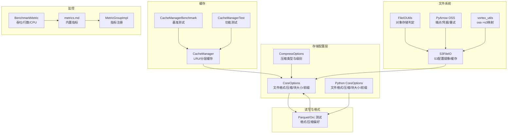
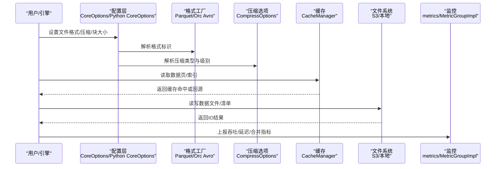
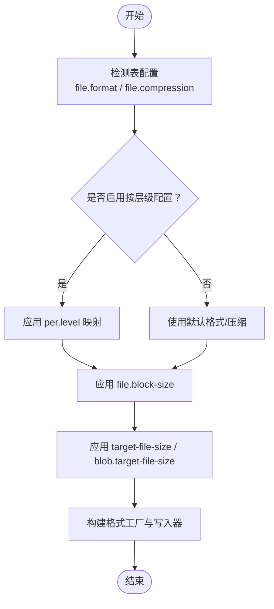
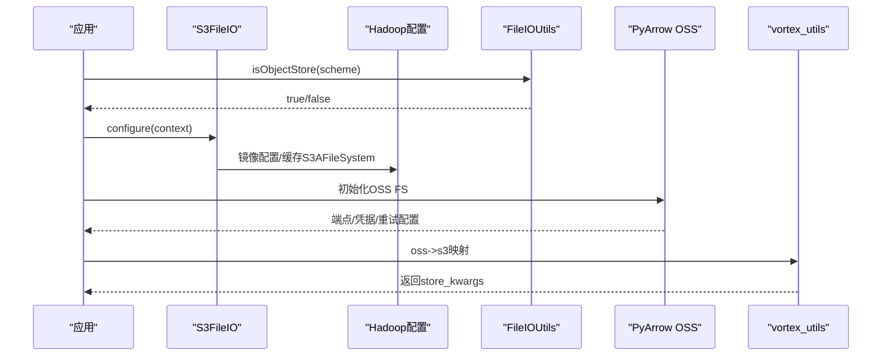
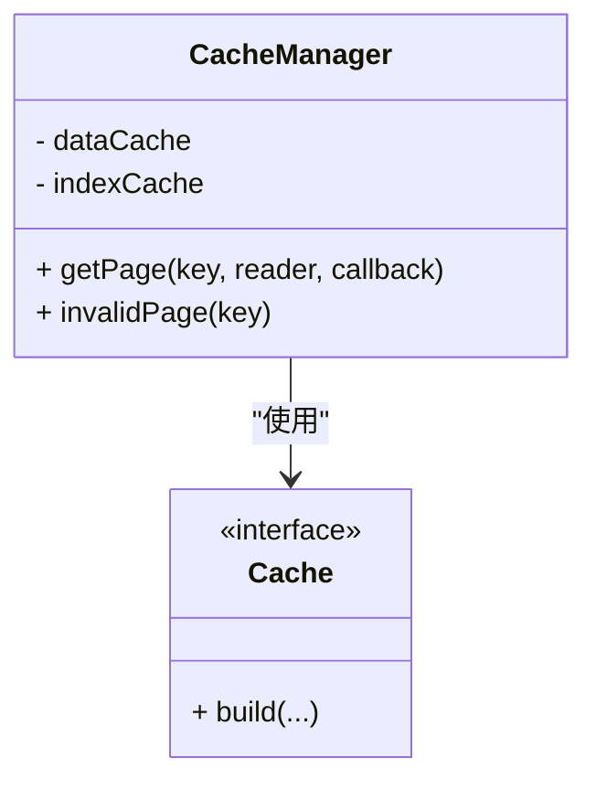
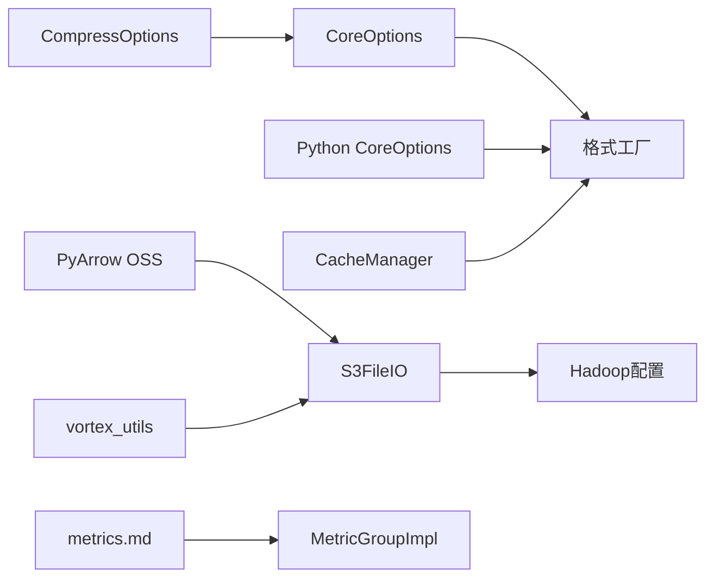

# 存储优化

<cite>
**本文引用的文件**
- [CoreOptions.java](file://paimon-api/src/main/java/org/apache/paimon/CoreOptions.java)
- [CompressOptions.java](file://paimon-api/src/main/java/org/apache/paimon/compression/CompressOptions.java)
- [core_options.py](file://paimon-python/pypaimon/common/options/core_options.py)
- [CacheManager.java](file://paimon-common/src/main/java/org/apache/paimon/io/cache/CacheManager.java)
- [CacheManagerBenchmark.java](file://paimon-benchmark/paimon-micro-benchmarks/src/test/java/org/apache/paimon/benchmark/cache/CacheManagerBenchmark.java)
- [CacheManagerTest.java](file://paimon-common/src/test/java/org/apache/paimon/io/cache/CacheManagerTest.java)
- [FileIOUtils.java](file://paimon-common/src/main/java/org/apache/paimon/utils/FileIOUtils.java)
- [S3FileIO.java](file://paimon-filesystems/paimon-s3-impl/src/main/java/org/apache/paimon/s3/S3FileIO.java)
- [pyarrow_file_io.py](file://paimon-python/pypaimon/filesystem/pyarrow_file_io.py)
- [lance_utils.py](file://paimon-python/pypaimon/read/reader/lance_utils.py)
- [vortex_utils.py](file://paimon-python/pypaimon/read/reader/vortex_utils.py)
- [ParquetFileFormatTest.java](file://paimon-format/src/test/java/org/apache/paimon/format/parquet/ParquetFileFormatTest.java)
- [OrcFileFormatTest.java](file://paimon-format/src/test/java/org/apache/paimon/format/orc/OrcFileFormatTest.java)
- [FileFormatTest.java](file://paimon-core/src/test/java/org/apache/paimon/FileFormatTest.java)
- [metrics.md](file://docs/content/maintenance/metrics.md)
- [MetricGroupImpl.java](file://paimon-core/src/main/java/org/apache/paimon/metrics/MetricGroupImpl.java)
- [BenchmarkMetric.java](file://paimon-benchmark/paimon-cluster-benchmark/src/main/java/org/apache/paimon/benchmark/metric/BenchmarkMetric.java)
</cite>

## 目录
1. [引言](#引言)
2. [项目结构](#项目结构)
3. [核心组件](#核心组件)
4. [架构总览](#架构总览)
5. [详细组件分析](#详细组件分析)
6. [依赖分析](#依赖分析)
7. [性能考量](#性能考量)
8. [故障排查指南](#故障排查指南)
9. [结论](#结论)
10. [附录](#附录)

## 引言
本技术指导面向Apache Paimon在存储层面的优化实践，围绕文件格式与压缩、文件系统与对象存储、缓存策略、数据布局（分区与桶）、成本与性能监控等方面，结合代码库中的实现与配置项，给出可操作的优化建议、配置示例与测试方法，并覆盖不同存储环境的最佳实践。

## 项目结构
与存储优化直接相关的关键模块与文件：
- 文件格式与压缩：CoreOptions、CompressOptions、Python侧CoreOptions、Parquet/Orc测试用例
- 缓存：CacheManager、缓存基准与单元测试
- 文件系统：FileIOUtils、S3FileIO、PyArrow OSS适配、Vortex/OSS互转
- 监控：metrics文档、MetricGroupImpl、BenchmarkMetric

图表来源
- [CoreOptions.java:292-384](file://paimon-api/src/main/java/org/apache/paimon/CoreOptions.java#L292-L384)
- [core_options.py:147-197](file://paimon-python/pypaimon/common/options/core_options.py#L147-L197)
- [CompressOptions.java:24-76](file://paimon-api/src/main/java/org/apache/paimon/compression/CompressOptions.java#L24-L76)
- [ParquetFileFormatTest.java:35-77](file://paimon-format/src/test/java/org/apache/paimon/format/parquet/ParquetFileFormatTest.java#L35-L77)
- [OrcFileFormatTest.java:35-61](file://paimon-format/src/test/java/org/apache/paimon/format/orc/OrcFileFormatTest.java#L35-L61)
- [CacheManager.java:34-134](file://paimon-common/src/main/java/org/apache/paimon/io/cache/CacheManager.java#L34-L134)
- [CacheManagerBenchmark.java:36-82](file://paimon-benchmark/paimon-micro-benchmarks/src/test/java/org/apache/paimon/benchmark/cache/CacheManagerBenchmark.java#L36-L82)
- [CacheManagerTest.java:33-70](file://paimon-common/src/test/java/org/apache/paimon/io/cache/CacheManagerTest.java#L33-L70)
- [FileIOUtils.java:386-408](file://paimon-common/src/main/java/org/apache/paimon/utils/FileIOUtils.java#L386-L408)
- [S3FileIO.java:40-74](file://paimon-filesystems/paimon-s3-impl/src/main/java/org/apache/paimon/s3/S3FileIO.java#L40-L74)
- [pyarrow_file_io.py:131-156](file://paimon-python/pypaimon/filesystem/pyarrow_file_io.py#L131-L156)
- [vortex_utils.py:30-70](file://paimon-python/pypaimon/read/reader/vortex_utils.py#L30-L70)
- [metrics.md:42-318](file://docs/content/maintenance/metrics.md#L42-L318)
- [MetricGroupImpl.java:36-70](file://paimon-core/src/main/java/org/apache/paimon/metrics/MetricGroupImpl.java#L36-L70)
- [BenchmarkMetric.java:1-40](file://paimon-benchmark/paimon-cluster-benchmark/src/main/java/org/apache/paimon/benchmark/metric/BenchmarkMetric.java#L1-L40)

章节来源
- [CoreOptions.java:292-384](file://paimon-api/src/main/java/org/apache/paimon/CoreOptions.java#L292-L384)
- [core_options.py:147-197](file://paimon-python/pypaimon/common/options/core_options.py#L147-L197)
- [FileFormatTest.java:112-139](file://paimon-core/src/test/java/org/apache/paimon/FileFormatTest.java#L112-L139)

## 核心组件
- 文件格式与压缩
  - 默认文件格式、按层级差异化格式与压缩、块大小、目标文件大小、前缀等配置项集中于CoreOptions与Python侧CoreOptions。
  - 压缩选项封装在CompressOptions中，默认zstd低级别以兼顾速度与压缩比。
- 缓存
  - CacheManager提供分层数据/索引缓存，支持高优先级池比例与刷新周期控制，保障热点命中与内存占用平衡。
- 文件系统
  - FileIOUtils用于对象存储判定；S3FileIO镜像关键Hadoop配置并缓存S3AFileSystem；PyArrow OSS适配处理端点、凭据与重试；Vortex/OSS互转逻辑确保远程存储路径正确传递。
- 监控
  - 内置扫描、提交、写入缓冲、合并等指标；通过MetricGroupImpl注册；BenchmarkMetric用于吞吐/行数/CPU等指标采集。

章节来源
- [CoreOptions.java:292-384](file://paimon-api/src/main/java/org/apache/paimon/CoreOptions.java#L292-L384)
- [core_options.py:147-197](file://paimon-python/pypaimon/common/options/core_options.py#L147-L197)
- [CompressOptions.java:24-76](file://paimon-api/src/main/java/org/apache/paimon/compression/CompressOptions.java#L24-L76)
- [CacheManager.java:34-134](file://paimon-common/src/main/java/org/apache/paimon/io/cache/CacheManager.java#L34-L134)
- [FileIOUtils.java:386-408](file://paimon-common/src/main/java/org/apache/paimon/utils/FileIOUtils.java#L386-L408)
- [S3FileIO.java:40-74](file://paimon-filesystems/paimon-s3-impl/src/main/java/org/apache/paimon/s3/S3FileIO.java#L40-L74)
- [pyarrow_file_io.py:131-156](file://paimon-python/pypaimon/filesystem/pyarrow_file_io.py#L131-L156)
- [vortex_utils.py:30-70](file://paimon-python/pypaimon/read/reader/vortex_utils.py#L30-L70)
- [metrics.md:42-318](file://docs/content/maintenance/metrics.md#L42-L318)
- [MetricGroupImpl.java:36-70](file://paimon-core/src/main/java/org/apache/paimon/metrics/MetricGroupImpl.java#L36-L70)
- [BenchmarkMetric.java:1-40](file://paimon-benchmark/paimon-cluster-benchmark/src/main/java/org/apache/paimon/benchmark/metric/BenchmarkMetric.java#L1-L40)

## 架构总览
下图展示从配置到读写的存储优化关键链路：配置层决定格式/压缩/块大小；缓存层提升热点访问；文件系统层对接本地/对象存储；监控层反馈吞吐与延迟。

图表来源
- [CoreOptions.java:292-384](file://paimon-api/src/main/java/org/apache/paimon/CoreOptions.java#L292-L384)
- [core_options.py:147-197](file://paimon-python/pypaimon/common/options/core_options.py#L147-L197)
- [CompressOptions.java:24-76](file://paimon-api/src/main/java/org/apache/paimon/compression/CompressOptions.java#L24-L76)
- [CacheManager.java:34-134](file://paimon-common/src/main/java/org/apache/paimon/io/cache/CacheManager.java#L34-L134)
- [FileIOUtils.java:386-408](file://paimon-common/src/main/java/org/apache/paimon/utils/FileIOUtils.java#L386-L408)
- [metrics.md:42-318](file://docs/content/maintenance/metrics.md#L42-L318)
- [MetricGroupImpl.java:36-70](file://paimon-core/src/main/java/org/apache/paimon/metrics/MetricGroupImpl.java#L36-L70)

## 详细组件分析

### 文件格式与压缩策略
- 支持格式与默认值
  - Java侧默认Parquet，Python侧默认Orc；可通过file.format切换至orc/avro等。
  - 按层级差异化配置：file.format.per.level与file.compression.per.level允许对LSM不同层级设置不同格式与压缩。
- 压缩策略
  - 默认zstd低级别（如1）兼顾速度与压缩比；可通过file.compression与file.compression.zstd-level调整。
  - 单独设置Changelog/Manifest格式与压缩，避免与数据文件混用导致的不一致。
- 块大小与目标文件大小
  - file.block-size影响底层格式的块粒度；target-file-size/blob.target-file-size控制单文件大小，影响扫描与合并开销。
- 配置要点
  - Parquet/Orc测试表明：当显式指定底层压缩时，优先采用上层传入的压缩设置，而非默认推断。
  - 建议：根据查询模式选择格式（列存/行存），根据写入吞吐选择zstd中低级别，避免过度压缩降低写入性能。

图表来源
- [CoreOptions.java:292-384](file://paimon-api/src/main/java/org/apache/paimon/CoreOptions.java#L292-L384)
- [core_options.py:147-197](file://paimon-python/pypaimon/common/options/core_options.py#L147-L197)
- [ParquetFileFormatTest.java:35-77](file://paimon-format/src/test/java/org/apache/paimon/format/parquet/ParquetFileFormatTest.java#L35-L77)
- [OrcFileFormatTest.java:35-61](file://paimon-format/src/test/java/org/apache/paimon/format/orc/OrcFileFormatTest.java#L35-L61)
- [FileFormatTest.java:112-139](file://paimon-core/src/test/java/org/apache/paimon/FileFormatTest.java#L112-L139)

章节来源
- [CoreOptions.java:292-384](file://paimon-api/src/main/java/org/apache/paimon/CoreOptions.java#L292-L384)
- [core_options.py:147-197](file://paimon-python/pypaimon/common/options/core_options.py#L147-L197)
- [ParquetFileFormatTest.java:35-77](file://paimon-format/src/test/java/org/apache/paimon/format/parquet/ParquetFileFormatTest.java#L35-L77)
- [OrcFileFormatTest.java:35-61](file://paimon-format/src/test/java/org/apache/paimon/format/orc/OrcFileFormatTest.java#L35-L61)
- [FileFormatTest.java:112-139](file://paimon-core/src/test/java/org/apache/paimon/FileFormatTest.java#L112-L139)

### 压缩算法选择与配置
- 算法特性与选择原则
  - zstd：默认低级别（如1）兼顾吞吐与压缩率；高压缩比（如9）会显著降低读写速度，适合离线归档。
  - lz4/snappy：追求极致写入/读取吞吐时可选lz4；snappy在压缩比与速度间折中。
- 层级差异化压缩
  - 利用file.compression.per.level为不同LSM层级设置不同压缩，例如较新的level使用更激进的压缩，旧level保持更快读取。
- 配置示例（路径参考）
  - Java侧：file.compression、file.compression.zstd-level、file.compression.per.level
  - Python侧：file.compression、file.compression.zstd-level、file.compression.per.level

章节来源
- [CoreOptions.java:318-331](file://paimon-api/src/main/java/org/apache/paimon/CoreOptions.java#L318-L331)
- [core_options.py:155-180](file://paimon-python/pypaimon/common/options/core_options.py#L155-L180)
- [CompressOptions.java:24-76](file://paimon-api/src/main/java/org/apache/paimon/compression/CompressOptions.java#L24-L76)

### 文件系统选择与配置优化
- 对象存储识别
  - FileIOUtils.isObjectStore基于scheme识别S3/OSS/ABFS/GS等对象存储，便于统一行为与优化。
- S3配置
  - S3FileIO镜像关键Hadoop配置键，缓存S3AFileSystem实例，减少资源泄露风险。
- PyArrow OSS
  - 自动注入AWS_EC2_METADATA_DISABLED避免非AWS环境超时；支持端点覆盖、凭据与重试配置。
- Vortex/OSS互转
  - 将oss://转换为s3://并注入endpoint等参数，保证远程存储路径解析一致。

图表来源
- [FileIOUtils.java:386-408](file://paimon-common/src/main/java/org/apache/paimon/utils/FileIOUtils.java#L386-L408)
- [S3FileIO.java:40-74](file://paimon-filesystems/paimon-s3-impl/src/main/java/org/apache/paimon/s3/S3FileIO.java#L40-L74)
- [pyarrow_file_io.py:131-156](file://paimon-python/pypaimon/filesystem/pyarrow_file_io.py#L131-L156)
- [vortex_utils.py:30-70](file://paimon-python/pypaimon/read/reader/vortex_utils.py#L30-L70)

章节来源
- [FileIOUtils.java:386-408](file://paimon-common/src/main/java/org/apache/paimon/utils/FileIOUtils.java#L386-L408)
- [S3FileIO.java:40-74](file://paimon-filesystems/paimon-s3-impl/src/main/java/org/apache/paimon/s3/S3FileIO.java#L40-L74)
- [pyarrow_file_io.py:131-156](file://paimon-python/pypaimon/filesystem/pyarrow_file_io.py#L131-L156)
- [vortex_utils.py:30-70](file://paimon-python/pypaimon/read/reader/vortex_utils.py#L30-L70)

### 缓存策略配置与使用
- 分层缓存
  - CacheManager将总缓存按高优先级比例切分为索引缓存与数据缓存，热点索引优先驻留，降低随机读放大。
- 刷新策略
  - 每N次访问触发一次LRU刷新，平衡命中率与维护成本。
- 基准与测试
  - 提供CacheManagerBenchmark与CacheManagerTest，验证缓存命中、并发访问与失效行为。

图表来源
- [CacheManager.java:34-134](file://paimon-common/src/main/java/org/apache/paimon/io/cache/CacheManager.java#L34-L134)

章节来源
- [CacheManager.java:34-134](file://paimon-common/src/main/java/org/apache/paimon/io/cache/CacheManager.java#L34-L134)
- [CacheManagerBenchmark.java:36-82](file://paimon-benchmark/paimon-micro-benchmarks/src/test/java/org/apache/paimon/benchmark/cache/CacheManagerBenchmark.java#L36-L82)
- [CacheManagerTest.java:33-70](file://paimon-common/src/test/java/org/apache/paimon/io/cache/CacheManagerTest.java#L33-L70)

### 数据布局与存储结构优化
- 分区与桶
  - 分区键与桶数量/键影响数据局部性与并行度；动态桶模式可根据目标行数自动扩容。
- 全局索引与扫描打包
  - 全局索引扫描会将连续行号范围打包为DataSplit，减少小文件扫描与调度开销。
- 聚簇与排序
  - Spark侧可按聚簇列进行排序，减少合并与扫描代价。

章节来源
- [core_options.py:98-139](file://paimon-python/pypaimon/common/options/core_options.py#L98-L139)
- [BTreeGlobalIndexBuilder.java:413-434](file://paimon-core/src/main/java/org/apache/paimon/globalindex/btree/BTreeGlobalIndexBuilder.java#L413-L434)
- [DefaultGlobalIndexTopoBuilder.java:244-281](file://paimon-spark/paimon-spark-common/src/main/java/org/apache/paimon/spark/globalindex/DefaultGlobalIndexTopoBuilder.java#L244-L281)

### 存储成本优化
- 压缩与格式
  - 合理选择zstd低/中级别与Parquet/Orc等列存格式，降低冷数据存储体积。
- 目标文件大小
  - 适当增大target-file-size/blob.target-file-size，减少小文件数量与元数据开销。
- 清单与变更日志
  - 控制清单格式/压缩与目标大小，避免频繁合并带来的IO放大。

章节来源
- [CoreOptions.java:445-462](file://paimon-api/src/main/java/org/apache/paimon/CoreOptions.java#L445-L462)
- [core_options.py:223-235](file://paimon-python/pypaimon/common/options/core_options.py#L223-L235)

### 性能监控与诊断
- 内置指标
  - 扫描：lastScanDuration、scanDuration、lastScannedManifests等
  - 提交：lastCommitDuration、lastTableFilesAdded/Deleted/Appended/Compacted、lastChangelogFilesAppended/Compacted、lastGeneratedSnapshots、lastDelta/ChangelogRecords等
  - 写入缓冲：numWriters、bufferPreemptCount、usedWriteBufferSizeByte/totalWriteBufferSizeByte
  - 合并：maxLevel0FileCount、avgLevel0FileCount、compactionThreadBusy、avgCompactionTime、compactionCompleted/Queued/TotalCount、max/avgCompactionInput/OutputSize、max/avgSortBufferUsedBytes/utilisationPercent等
- 指标注册与桥接
  - MetricGroupImpl提供Gauge/Counter/Histogram注册；Flink桥接详见metrics文档。
- 基准指标
  - BenchmarkMetric记录每秒行数、总行数、CPU占比与数据新鲜度等。

章节来源
- [metrics.md:42-318](file://docs/content/maintenance/metrics.md#L42-L318)
- [MetricGroupImpl.java:36-70](file://paimon-core/src/main/java/org/apache/paimon/metrics/MetricGroupImpl.java#L36-L70)
- [BenchmarkMetric.java:1-40](file://paimon-benchmark/paimon-cluster-benchmark/src/main/java/org/apache/paimon/benchmark/metric/BenchmarkMetric.java#L1-L40)

## 依赖分析
- 配置依赖
  - CoreOptions与Python CoreOptions共同定义文件格式、压缩、块大小、目标文件大小等，二者在不同运行时生效。
- 缓存依赖
  - CacheManager依赖Guava缓存实现，通过CacheBuilder构建；高优先级池比例控制索引与数据缓存权重。
- 文件系统依赖
  - S3FileIO依赖Hadoop配置镜像；PyArrow OSS依赖AWS端点与凭据；Vortex/OSS互转依赖URL解析与参数映射。
- 监控依赖
  - metrics.md提供指标清单；MetricGroupImpl负责注册；BenchmarkMetric用于基准场景。

图表来源
- [CoreOptions.java:292-384](file://paimon-api/src/main/java/org/apache/paimon/CoreOptions.java#L292-L384)
- [core_options.py:147-197](file://paimon-python/pypaimon/common/options/core_options.py#L147-L197)
- [CompressOptions.java:24-76](file://paimon-api/src/main/java/org/apache/paimon/compression/CompressOptions.java#L24-L76)
- [CacheManager.java:34-134](file://paimon-common/src/main/java/org/apache/paimon/io/cache/CacheManager.java#L34-L134)
- [S3FileIO.java:40-74](file://paimon-filesystems/paimon-s3-impl/src/main/java/org/apache/paimon/s3/S3FileIO.java#L40-L74)
- [pyarrow_file_io.py:131-156](file://paimon-python/pypaimon/filesystem/pyarrow_file_io.py#L131-L156)
- [vortex_utils.py:30-70](file://paimon-python/pypaimon/read/reader/vortex_utils.py#L30-L70)
- [metrics.md:42-318](file://docs/content/maintenance/metrics.md#L42-L318)
- [MetricGroupImpl.java:36-70](file://paimon-core/src/main/java/org/apache/paimon/metrics/MetricGroupImpl.java#L36-L70)

## 性能考量
- 写入吞吐
  - 优先选择zstd低级别或lz4；合理设置file.block-size与target-file-size，避免过多小文件。
- 查询延迟
  - 使用列存格式（Parquet/Orc）与合适的分区/桶设计；利用全局索引与DataSplit打包减少扫描。
- 缓存命中
  - 通过高优先级池比例提升索引缓存占比；结合基准测试调优缓存大小与刷新频率。
- 对象存储
  - S3端点与凭据配置需稳定；避免频繁重建S3AFileSystem；PyArrow OSS禁用EC2 IMDS以减少超时。

## 故障排查指南
- 读写异常
  - 关注提交指标中的lastCommitAttempts、lastTableFilesAdded/Deleted/Appended/Compacted，定位写入失败或重复提交。
  - 观察合并指标中的avgCompactionTime与sort buffer utilisation，判断内存压力与spill风险。
- 缓存问题
  - 使用CacheManagerTest验证多线程/多文件场景下的缓存一致性；通过CacheManagerBenchmark评估不同缓存类型与大小的性能差异。
- 文件系统
  - 若使用S3/OSS，检查端点、凭据与重试配置；确认scheme识别与URL映射正确。

章节来源
- [metrics.md:83-318](file://docs/content/maintenance/metrics.md#L83-L318)
- [CacheManagerTest.java:33-70](file://paimon-common/src/test/java/org/apache/paimon/io/cache/CacheManagerTest.java#L33-L70)
- [CacheManagerBenchmark.java:36-82](file://paimon-benchmark/paimon-micro-benchmarks/src/test/java/org/apache/paimon/benchmark/cache/CacheManagerBenchmark.java#L36-L82)
- [pyarrow_file_io.py:131-156](file://paimon-python/pypaimon/filesystem/pyarrow_file_io.py#L131-L156)
- [vortex_utils.py:30-70](file://paimon-python/pypaimon/read/reader/vortex_utils.py#L30-L70)

## 结论
通过在文件格式与压缩、缓存、文件系统与对象存储、数据布局与成本控制等方面的系统化优化，并结合内置监控与基准测试，可在不同存储环境下获得更优的吞吐、延迟与成本表现。建议以实际负载与查询模式为导向，持续迭代配置并监控关键指标。

## 附录
- 配置示例（路径参考）
  - Java侧：file.format、file.compression、file.compression.zstd-level、file.compression.per.level、file.format.per.level、file.block-size、target-file-size、blob.target-file-size
  - Python侧：file.format、file.compression、file.compression.zstd-level、file.compression.per.level、file.format.per.level、file.block-size、target-file-size、blob.target-file-size
- 性能测试方法（路径参考）
  - 缓存：CacheManagerBenchmark、CacheManagerTest
  - 基准：BenchmarkMetric
- 不同存储环境最佳实践
  - 本地：适度增大file.block-size与target-file-size，启用zstd低级别压缩。
  - S3/OSS：稳定端点与凭据，开启合理的重试与超时；避免频繁重建FS实例；必要时使用更高压缩比但需权衡写入延迟。
  - HDFS：关注小文件数量与元数据开销，适当增大目标文件大小。