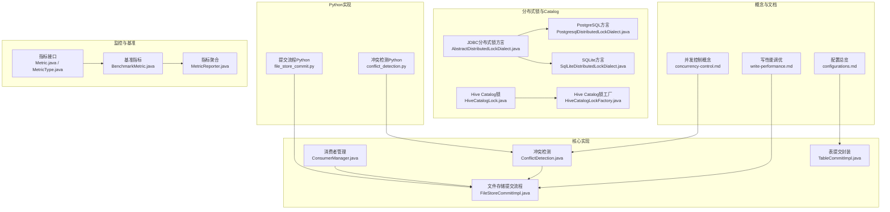
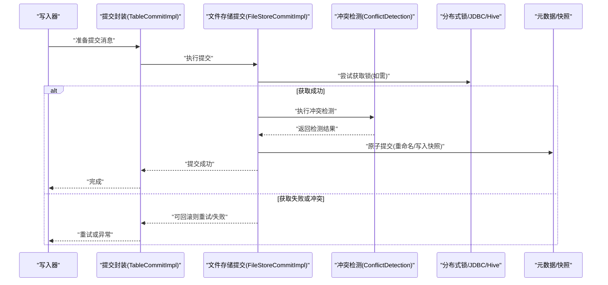
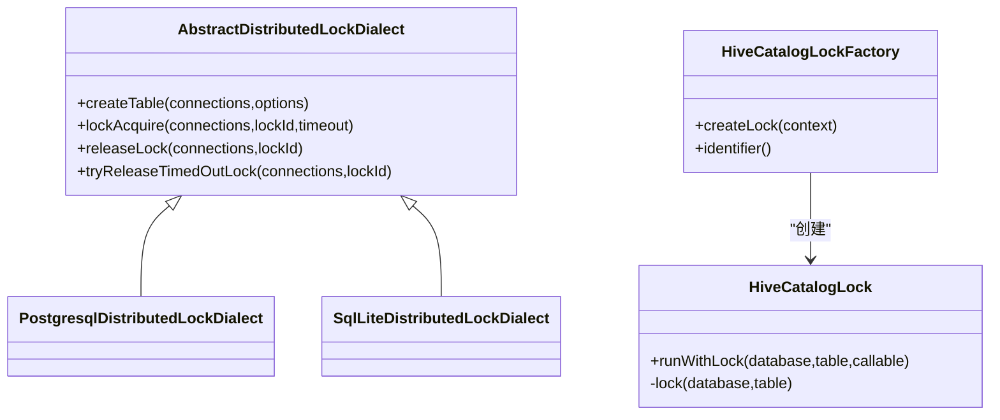
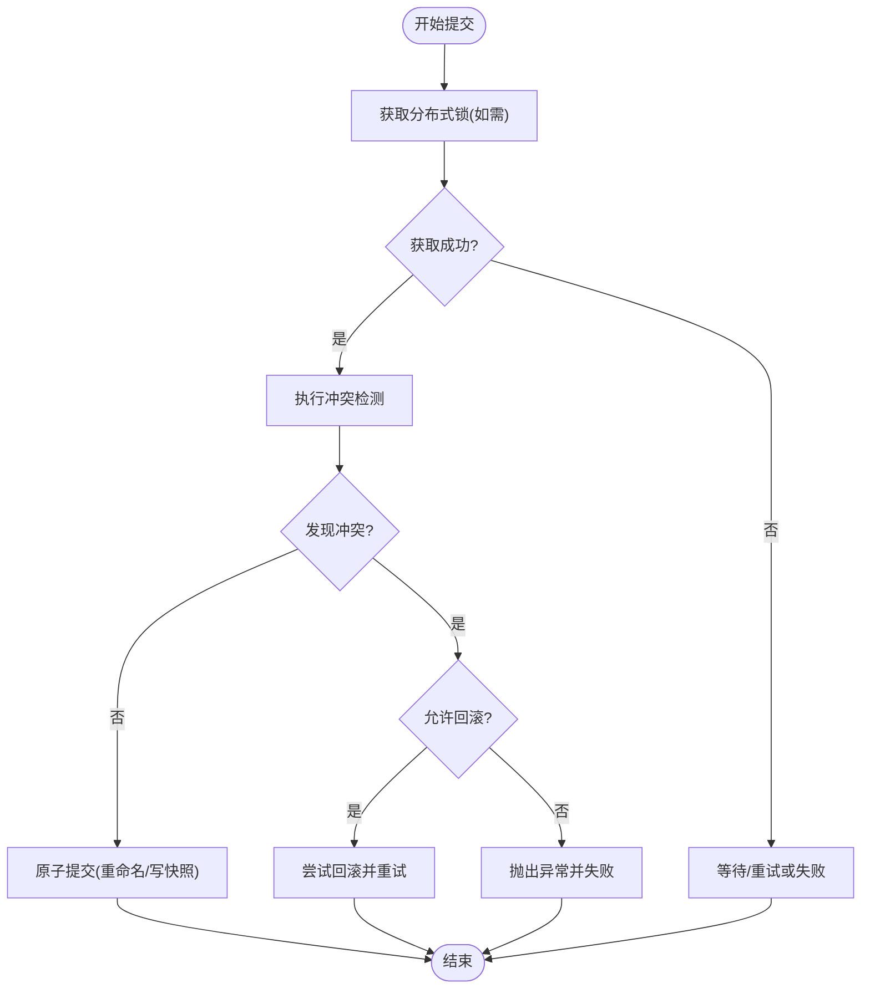
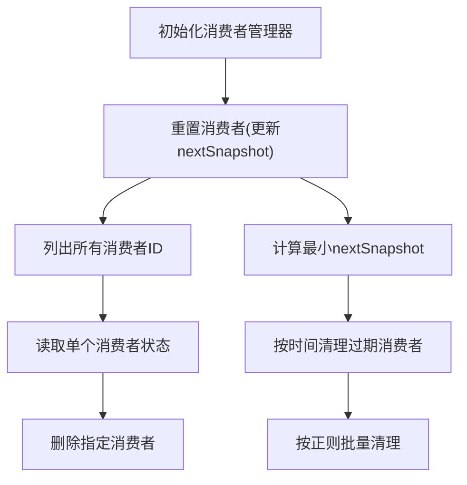
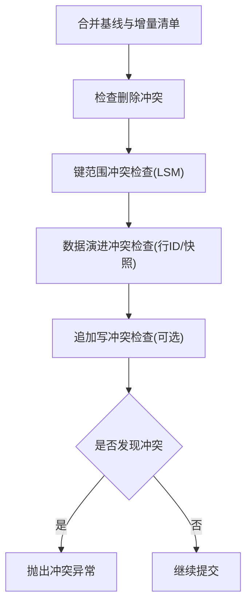
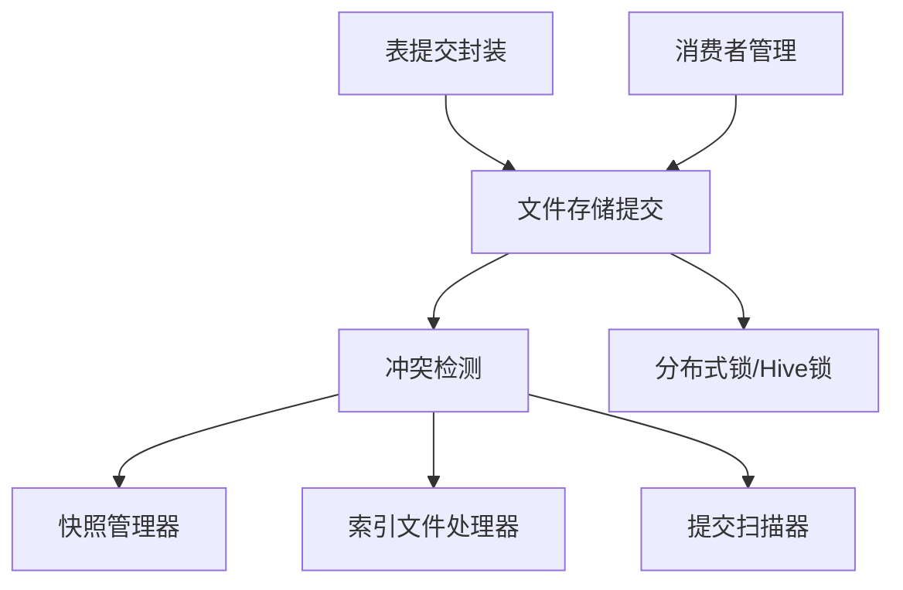

# 并发控制优化

<cite>
**本文引用的文件**   
- [concurrency-control.md](file://docs/content/concepts/concurrency-control.md)
- [write-performance.md](file://docs/content/maintenance/write-performance.md)
- [configurations.md](file://docs/content/maintenance/configurations.md)
- [ConflictDetection.java](file://paimon-core/src/main/java/org/apache/paimon/operation/commit/ConflictDetection.java)
- [FileStoreCommitImpl.java](file://paimon-core/src/main/java/org/apache/paimon/operation/FileStoreCommitImpl.java)
- [ConsumerManager.java](file://paimon-core/src/main/java/org/apache/paimon/consumer/ConsumerManager.java)
- [JdbcDistributedLockDialect.java](file://paimon-core/src/main/java/org/apache/paimon/jdbc/PostgresqlDistributedLockDialect.java)
- [AbstractDistributedLockDialect.java](file://paimon-core/src/main/java/org/apache/paimon/jdbc/AbstractDistributedLockDialect.java)
- [DistributedLockDialectFactory.java](file://paimon-core/src/main/java/org/apache/paimon/jdbc/DistributedLockDialectFactory.java)
- [SqlLiteDistributedLockDialect.java](file://paimon-core/src/main/java/org/apache/paimon/jdbc/SqlLiteDistributedLockDialect.java)
- [HiveCatalogLock.java](file://paimon-hive/paimon-hive-catalog/src/main/java/org/apache/paimon/hive/HiveCatalogLock.java)
- [HiveCatalogLockFactory.java](file://paimon-hive/paimon-hive-catalog/src/main/java/org/apache/paimon/hive/HiveCatalogLockFactory.java)
- [TableCommitImpl.java](file://paimon-core/src/main/java/org/apache/paimon/table/sink/TableCommitImpl.java)
- [file_store_commit.py](file://paimon-python/pypaimon/write/file_store_commit.py)
- [conflict_detection.py](file://paimon-python/pypaimon/write/commit/conflict_detection.py)
- [Metric.java](file://paimon-core/src/main/java/org/apache/paimon/metrics/Metric.java)
- [MetricType.java](file://paimon-core/src/main/java/org/apache/paimon/metrics/MetricType.java)
- [BenchmarkMetric.java](file://paimon-benchmark/paimon-cluster-benchmark/src/main/java/org/apache/paimon/benchmark/metric/BenchmarkMetric.java)
- [MetricReporter.java](file://paimon-benchmark/paimon-cluster-benchmark/src/main/java/org/apache/paimon/benchmark/metric/MetricReporter.java)
- [RESTCatalogTest.java](file://paimon/paimon-core/src/test/java/org/apache/paimon/rest/RESTCatalogTest.java)
- [ConsumerManagerTest.java](file://paimon-core/src/test/java/org/apache/paimon/consumer/ConsumerManagerTest.java)
- [consumer_manager_test.py](file://paimon-python/pypaimon/tests/consumer_manager_test.py)
</cite>

## 目录
1. [简介](#简介)
2. [项目结构](#项目结构)
3. [核心组件](#核心组件)
4. [架构总览](#架构总览)
5. [详细组件分析](#详细组件分析)
6. [依赖分析](#依赖分析)
7. [性能考量](#性能考量)
8. [故障排查指南](#故障排查指南)
9. [结论](#结论)
10. [附录](#附录)

## 简介
本文件面向Apache Paimon在高并发场景下的并发控制与性能优化，系统性梳理锁策略（乐观锁/悲观锁）、事务管理（隔离级别、提交策略）、消费者管理（消费者组、负载均衡）、并发写入协调（冲突检测、并发控制）、读写并发平衡（读写锁）以及高并发性能优化（并发度调优、资源竞争缓解）。同时提供监控与诊断工具使用指南、配置示例与最佳实践。

## 项目结构
围绕并发控制相关的关键模块与文档如下：
- 概念与文档：并发控制概念、写性能调优、配置总览
- 核心实现：冲突检测、提交流程、消费者管理、分布式锁方言
- 连接器与Catalog：Hive Catalog锁、JDBC分布式锁方言
- Python实现：提交与冲突检测的Python侧对应逻辑
- 监控与基准：指标接口、基准指标与聚合

**图表来源**
- [concurrency-control.md:27-67](file://docs/content/concepts/concurrency-control.md#L27-L67)
- [write-performance.md:27-164](file://docs/content/maintenance/write-performance.md#L27-L164)
- [configurations.md:27-92](file://docs/content/maintenance/configurations.md#L27-L92)
- [ConflictDetection.java:70-710](file://paimon-core/src/main/java/org/apache/paimon/operation/commit/ConflictDetection.java#L70-L710)
- [FileStoreCommitImpl.java:849-880](file://paimon-core/src/main/java/org/apache/paimon/operation/FileStoreCommitImpl.java#L849-L880)
- [ConsumerManager.java:43-171](file://paimon-core/src/main/java/org/apache/paimon/consumer/ConsumerManager.java#L43-L171)
- [AbstractDistributedLockDialect.java:28-99](file://paimon-core/src/main/java/org/apache/paimon/jdbc/AbstractDistributedLockDialect.java#L28-L99)
- [PostgresqlDistributedLockDialect.java:21-73](file://paimon-core/src/main/java/org/apache/paimon/jdbc/PostgresqlDistributedLockDialect.java#L21-L73)
- [SqlLiteDistributedLockDialect.java:19-72](file://paimon-core/src/main/java/org/apache/paimon/jdbc/SqlLiteDistributedLockDialect.java#L19-L72)
- [HiveCatalogLock.java:67-103](file://paimon-hive/paimon-hive-catalog/src/main/java/org/apache/paimon/hive/HiveCatalogLock.java#L67-L103)
- [HiveCatalogLockFactory.java:33-53](file://paimon-hive/paimon-hive-catalog/src/main/java/org/apache/paimon/hive/HiveCatalogLockFactory.java#L33-L53)
- [file_store_commit.py:402-423](file://paimon-python/pypaimon/write/file_store_commit.py#L402-L423)
- [conflict_detection.py:34-121](file://paimon-python/pypaimon/write/commit/conflict_detection.py#L34-L121)
- [Metric.java:19-33](file://paimon-core/src/main/java/org/apache/paimon/metrics/Metric.java#L19-L33)
- [MetricType.java:19-33](file://paimon-core/src/main/java/org/apache/paimon/metrics/MetricType.java#L19-L33)
- [BenchmarkMetric.java:21-40](file://paimon-benchmark/paimon-cluster-benchmark/src/main/java/org/apache/paimon/benchmark/metric/BenchmarkMetric.java#L21-L40)
- [MetricReporter.java:106-131](file://paimon-benchmark/paimon-cluster-benchmark/src/main/java/org/apache/paimon/benchmark/metric/MetricReporter.java#L106-L131)

**章节来源**
- [concurrency-control.md:27-67](file://docs/content/concepts/concurrency-control.md#L27-L67)
- [write-performance.md:27-164](file://docs/content/maintenance/write-performance.md#L27-L164)
- [configurations.md:27-92](file://docs/content/maintenance/configurations.md#L27-L92)

## 核心组件
- 冲突检测（ConflictDetection）：负责合并增量与基线清单、检查删除冲突、键范围冲突、数据演进行级冲突、基于快照的行ID一致性检查等，是并发写入安全性的关键。
- 文件存储提交流程（FileStoreCommitImpl）：在提交阶段调用冲突检测，并根据是否允许回滚决定重试或直接失败。
- 消费者管理（ConsumerManager）：维护消费者组状态、最小下一个快照号、过期清理、批量清理与查询。
- 分布式锁（JDBC方言与Hive Catalog锁）：在对象存储等非原子重命名场景下，通过外部元数据存储或Hive进行互斥保护。
- 提交流程封装（TableCommitImpl）：对外暴露提交接口，支持忽略空提交、追加写冲突检查、行ID冲突检查等。
- Python侧实现：与Java侧对应，保障跨语言一致性。

**章节来源**
- [ConflictDetection.java:70-710](file://paimon-core/src/main/java/org/apache/paimon/operation/commit/ConflictDetection.java#L70-L710)
- [FileStoreCommitImpl.java:849-880](file://paimon-core/src/main/java/org/apache/paimon/operation/FileStoreCommitImpl.java#L849-L880)
- [ConsumerManager.java:43-171](file://paimon-core/src/main/java/org/apache/paimon/consumer/ConsumerManager.java#L43-L171)
- [AbstractDistributedLockDialect.java:28-99](file://paimon-core/src/main/java/org/apache/paimon/jdbc/AbstractDistributedLockDialect.java#L28-L99)
- [HiveCatalogLock.java:67-103](file://paimon-hive/paimon-hive-catalog/src/main/java/org/apache/paimon/hive/HiveCatalogLock.java#L67-L103)
- [TableCommitImpl.java:149-194](file://paimon-core/src/main/java/org/apache/paimon/table/sink/TableCommitImpl.java#L149-L194)
- [file_store_commit.py:402-423](file://paimon-python/pypaimon/write/file_store_commit.py#L402-L423)
- [conflict_detection.py:34-121](file://paimon-python/pypaimon/write/commit/conflict_detection.py#L34-L121)

## 架构总览
下图展示从写入到提交、冲突检测与锁保护的整体流程，以及消费者管理在读取侧的作用。

**图表来源**
- [TableCommitImpl.java:180-194](file://paimon-core/src/main/java/org/apache/paimon/table/sink/TableCommitImpl.java#L180-L194)
- [FileStoreCommitImpl.java:849-880](file://paimon-core/src/main/java/org/apache/paimon/operation/FileStoreCommitImpl.java#L849-L880)
- [ConflictDetection.java:146-220](file://paimon-core/src/main/java/org/apache/paimon/operation/commit/ConflictDetection.java#L146-L220)
- [AbstractDistributedLockDialect.java:83-99](file://paimon-core/src/main/java/org/apache/paimon/jdbc/AbstractDistributedLockDialect.java#L83-L99)
- [HiveCatalogLock.java:67-103](file://paimon-hive/paimon-hive-catalog/src/main/java/org/apache/paimon/hive/HiveCatalogLock.java#L67-L103)

## 详细组件分析

### 锁策略设计与优化
- 乐观锁优先：Paimon默认采用乐观并发模型，写入作业各自生成新快照，通过文件系统重命名实现原子提交；在对象存储上，由于“重命名”不具备原子语义，需要启用外部锁（Hive或JDBC）以避免竞态。
- 悲观锁补充：当对象存储不支持原子重命名时，通过JDBC方言或Hive Catalog锁在目录层面互斥，确保同一时刻仅有一个写入者能提交。
- 方言选择：
  - JDBC方言：支持SQLite、MySQL、PostgreSQL等，提供建表、加锁、释放、超时锁清理等SQL能力。
  - Hive Catalog锁：基于Hive客户端的EXCLUSIVE锁，具备等待与超时退避机制。
- 配置要点：
  - 对象存储+无锁：存在快照丢失风险，应开启Hive或JDBC锁。
  - 锁超时与退避：JDBC方言提供超时锁清理；Hive Catalog锁支持最大等待时间与指数退避。

**图表来源**
- [AbstractDistributedLockDialect.java:28-99](file://paimon-core/src/main/java/org/apache/paimon/jdbc/AbstractDistributedLockDialect.java#L28-L99)
- [PostgresqlDistributedLockDialect.java:21-73](file://paimon-core/src/main/java/org/apache/paimon/jdbc/PostgresqlDistributedLockDialect.java#L21-L73)
- [SqlLiteDistributedLockDialect.java:19-72](file://paimon-core/src/main/java/org/apache/paimon/jdbc/SqlLiteDistributedLockDialect.java#L19-L72)
- [HiveCatalogLock.java:67-103](file://paimon-hive/paimon-hive-catalog/src/main/java/org/apache/paimon/hive/HiveCatalogLock.java#L67-L103)
- [HiveCatalogLockFactory.java:33-53](file://paimon-hive/paimon-hive-catalog/src/main/java/org/apache/paimon/hive/HiveCatalogLockFactory.java#L33-L53)

**章节来源**
- [concurrency-control.md:44-67](file://docs/content/concepts/concurrency-control.md#L44-L67)
- [AbstractDistributedLockDialect.java:28-99](file://paimon-core/src/main/java/org/apache/paimon/jdbc/AbstractDistributedLockDialect.java#L28-L99)
- [PostgresqlDistributedLockDialect.java:21-73](file://paimon-core/src/main/java/org/apache/paimon/jdbc/PostgresqlDistributedLockDialect.java#L21-L73)
- [SqlLiteDistributedLockDialect.java:19-72](file://paimon-core/src/main/java/org/apache/paimon/jdbc/SqlLiteDistributedLockDialect.java#L19-L72)
- [HiveCatalogLock.java:67-103](file://paimon-hive/paimon-hive-catalog/src/main/java/org/apache/paimon/hive/HiveCatalogLock.java#L67-L103)
- [HiveCatalogLockFactory.java:33-53](file://paimon-hive/paimon-hive-catalog/src/main/java/org/apache/paimon/hive/HiveCatalogLockFactory.java#L33-L53)

### 事务管理优化
- 隔离级别：Paimon通过快照隔离实现读已提交级别的隔离效果，读取基于最新快照视图，写入通过冲突检测保证一致性。
- 提交策略：
  - 原子提交：文件系统重命名或写入快照文件，确保提交要么全部可见，要么完全不可见。
  - 失败处理：针对快照冲突与文件删除冲突分别处理，必要时触发回滚重试或失败重启。
- Python侧提交：在Python端同样采用原子提交包装与失败重试逻辑，保持一致性。

**图表来源**
- [FileStoreCommitImpl.java:849-880](file://paimon-core/src/main/java/org/apache/paimon/operation/FileStoreCommitImpl.java#L849-L880)
- [ConflictDetection.java:146-220](file://paimon-core/src/main/java/org/apache/paimon/operation/commit/ConflictDetection.java#L146-L220)
- [file_store_commit.py:402-423](file://paimon-python/pypaimon/write/file_store_commit.py#L402-L423)

**章节来源**
- [concurrency-control.md:29-67](file://docs/content/concepts/concurrency-control.md#L29-L67)
- [FileStoreCommitImpl.java:849-880](file://paimon-core/src/main/java/org/apache/paimon/operation/FileStoreCommitImpl.java#L849-L880)
- [file_store_commit.py:402-423](file://paimon-python/pypaimon/write/file_store_commit.py#L402-L423)

### 消费者管理优化
- 消费者组状态：每个消费者记录其“下一个要消费的快照ID”，用于全局进度收敛。
- 最小下一个快照：通过遍历所有消费者，计算全局最小值，作为下游拉取起点，避免重复消费或跳过。
- 过期与清理：按修改时间清理过期消费者文件；支持正则模式批量清理。
- Python侧验证：提供消费者读取、删除、清理等测试用例，保障行为一致。

**图表来源**
- [ConsumerManager.java:43-171](file://paimon-core/src/main/java/org/apache/paimon/consumer/ConsumerManager.java#L43-L171)
- [ConsumerManagerTest.java:79-157](file://paimon-core/src/test/java/org/apache/paimon/consumer/ConsumerManagerTest.java#L79-L157)
- [consumer_manager_test.py:211-247](file://paimon-python/pypaimon/tests/consumer_manager_test.py#L211-L247)

**章节来源**
- [ConsumerManager.java:43-171](file://paimon-core/src/main/java/org/apache/paimon/consumer/ConsumerManager.java#L43-L171)
- [ConsumerManagerTest.java:79-157](file://paimon-core/src/test/java/org/apache/paimon/consumer/ConsumerManagerTest.java#L79-L157)
- [consumer_manager_test.py:211-247](file://paimon-python/pypaimon/tests/consumer_manager_test.py#L211-L247)

### 并发写入协调与冲突检测
- 删除冲突：合并增量与基线后，若发现对不存在文件的删除请求，则判定冲突并终止当前提交。
- LSM键范围冲突：在多级LSM中，禁止同分区/桶/层级文件键范围重叠。
- 数据演进冲突：针对行ID范围与基于快照的行ID一致性检查，避免并发“MERGE INTO/COMPACT”导致的数据覆盖问题。
- 追加写冲突检查：可通过提交封装启用追加写冲突检查，提升一致性。

**图表来源**
- [ConflictDetection.java:146-220](file://paimon-core/src/main/java/org/apache/paimon/operation/commit/ConflictDetection.java#L146-L220)
- [ConflictDetection.java:387-474](file://paimon-core/src/main/java/org/apache/paimon/operation/commit/ConflictDetection.java#L387-L474)
- [TableCommitImpl.java:162-171](file://paimon-core/src/main/java/org/apache/paimon/table/sink/TableCommitImpl.java#L162-L171)

**章节来源**
- [ConflictDetection.java:146-220](file://paimon-core/src/main/java/org/apache/paimon/operation/commit/ConflictDetection.java#L146-L220)
- [ConflictDetection.java:387-474](file://paimon-core/src/main/java/org/apache/paimon/operation/commit/ConflictDetection.java#L387-L474)
- [TableCommitImpl.java:162-171](file://paimon-core/src/main/java/org/apache/paimon/table/sink/TableCommitImpl.java#L162-L171)

### 读写并发平衡与读写锁
- 读写分离：写入通过冲突检测与锁保护，读取基于快照隔离；在高并发下，合理设置写入并行度与快照间隔，降低读写争用。
- 读写锁思想：在对象存储场景下，通过分布式锁实现“写独占”，读取侧天然共享访问；在本地文件系统上，利用文件系统重命名的原子性减少锁粒度。

**章节来源**
- [concurrency-control.md:44-67](file://docs/content/concepts/concurrency-control.md#L44-L67)

### 高并发性能优化
- 写入吞吐优化：增大检查点间隔、并发检查点数、写缓冲大小、启用可溢写缓冲；在主键表中考虑异步Compaction缓解背压。
- 并行度与分桶：Sink并行度建议不超过桶数，固定分桶模式下可动态扩缩容桶数。
- 文件格式与压缩：行存格式（如AVRO）在写入与合并阶段性能更优，但会牺牲列存查询与投影能力；可按层级差异化配置。
- 内存与稳定性：合理配置写缓冲内存、排序运行数量、批大小与字典编码开关，避免OOM；必要时启用细粒度资源管理为Committer单独分配资源。

**章节来源**
- [write-performance.md:29-164](file://docs/content/maintenance/write-performance.md#L29-L164)
- [configurations.md:27-92](file://docs/content/maintenance/configurations.md#L27-L92)

### 监控与诊断工具
- 指标体系：定义指标类型（计数器、仪表盘、直方图），用于观测吞吐、CPU、数据新鲜度等。
- 基准指标：每轮查询收集RPS、总行数、CPU占用、数据新鲜度，聚合得到平均与最大值。
- 使用建议：结合写性能文档中的参数调整，持续观察指标变化，定位瓶颈（如缓冲不足、分桶不均、Compaction阻塞）。

**章节来源**
- [Metric.java:19-33](file://paimon-core/src/main/java/org/apache/paimon/metrics/Metric.java#L19-L33)
- [MetricType.java:19-33](file://paimon-core/src/main/java/org/apache/paimon/metrics/MetricType.java#L19-L33)
- [BenchmarkMetric.java:21-40](file://paimon-benchmark/paimon-cluster-benchmark/src/main/java/org/apache/paimon/benchmark/metric/BenchmarkMetric.java#L21-L40)
- [MetricReporter.java:106-131](file://paimon-benchmark/paimon-cluster-benchmark/src/main/java/org/apache/paimon/benchmark/metric/MetricReporter.java#L106-L131)

## 依赖分析
- 组件耦合：
  - 冲突检测依赖快照管理器、索引文件处理器、提交扫描器等，耦合度较高但职责清晰。
  - 提交流程封装向上提供统一接口，向下委托具体提交实现，解耦良好。
  - 分布式锁方言与Hive Catalog锁分别面向不同外部系统，通过接口抽象解耦。
- 外部依赖：
  - 对象存储：需要配合Hive/JDBC锁以保障原子性。
  - 文件系统：HDFS重命名具备原子性，可减少锁需求。

**图表来源**
- [ConflictDetection.java:84-116](file://paimon-core/src/main/java/org/apache/paimon/operation/commit/ConflictDetection.java#L84-L116)
- [FileStoreCommitImpl.java:849-880](file://paimon-core/src/main/java/org/apache/paimon/operation/FileStoreCommitImpl.java#L849-L880)
- [TableCommitImpl.java:180-194](file://paimon-core/src/main/java/org/apache/paimon/table/sink/TableCommitImpl.java#L180-L194)
- [ConsumerManager.java:43-171](file://paimon-core/src/main/java/org/apache/paimon/consumer/ConsumerManager.java#L43-L171)

**章节来源**
- [ConflictDetection.java:84-116](file://paimon-core/src/main/java/org/apache/paimon/operation/commit/ConflictDetection.java#L84-L116)
- [FileStoreCommitImpl.java:849-880](file://paimon-core/src/main/java/org/apache/paimon/operation/FileStoreCommitImpl.java#L849-L880)
- [TableCommitImpl.java:180-194](file://paimon-core/src/main/java/org/apache/paimon/table/sink/TableCommitImpl.java#L180-L194)
- [ConsumerManager.java:43-171](file://paimon-core/src/main/java/org/apache/paimon/consumer/ConsumerManager.java#L43-L171)

## 性能考量
- 并发度调优：写入并行度与桶数匹配，避免热点分桶；在主键表中启用异步Compaction降低写放大。
- 资源竞争缓解：增大写缓冲、启用可溢写、合理设置检查点间隔；对大字段禁用字典编码或限制批大小。
- 稳定性保障：在大规模全量Compaction场景下适当提高检查点超时时间，避免因长时间合并导致超时。

**章节来源**
- [write-performance.md:29-164](file://docs/content/maintenance/write-performance.md#L29-L164)

## 故障排查指南
- 快照冲突：多个写入同时抢占快照ID，通常可自动重试；若频繁发生，建议拆分写入或引入专用Compaction作业。
- 文件删除冲突：对未添加过的文件发起删除，属于致命冲突，需回滚重试或检查上游数据一致性。
- 数据演进冲突：并发“MERGE INTO/COMPACT”导致行ID范围重叠，需通过禁用并发或基于快照的行ID校验规避。
- 对象存储原子性缺失：启用Hive或JDBC锁；若出现快照丢失，检查锁表/锁客户端配置与超时设置。
- 消费者异常：检查消费者文件是否存在、是否过期、是否被清理；确认最小nextSnapshot计算正确。

**章节来源**
- [concurrency-control.md:29-67](file://docs/content/concepts/concurrency-control.md#L29-L67)
- [ConflictDetection.java:321-336](file://paimon-core/src/main/java/org/apache/paimon/operation/commit/ConflictDetection.java#L321-L336)
- [RESTCatalogTest.java:3806-3829](file://paimon/paimon-core/src/test/java/org/apache/paimon/rest/RESTCatalogTest.java#L3806-L3829)
- [ConsumerManagerTest.java:79-157](file://paimon-core/src/test/java/org/apache/paimon/consumer/ConsumerManagerTest.java#L79-L157)

## 结论
Paimon在高并发场景下以“乐观并发+冲突检测+锁保护”为核心策略，结合消费者管理与指标监控，形成完整的并发控制闭环。通过合理的参数调优与架构设计（如专用Compaction、异步合并、分桶规划），可在保证一致性的同时显著提升吞吐与稳定性。

## 附录
- 配置示例（参考路径）
  - 写性能相关选项：参见“写性能”文档中的表项与说明。
  - Catalog与锁相关选项：参见“配置总览”文档中的各模块生成表格。
- 最佳实践
  - 对象存储环境必须启用Hive或JDBC锁。
  - 主键表建议拆分工写与Compaction，避免写入与删除冲突。
  - 高并发写入时，优先优化分桶与并行度，其次再考虑缓冲与压缩策略。
  - 持续监控RPS、CPU、数据新鲜度，结合写性能文档进行迭代调优。

**章节来源**
- [write-performance.md:29-164](file://docs/content/maintenance/write-performance.md#L29-L164)
- [configurations.md:27-92](file://docs/content/maintenance/configurations.md#L27-L92)