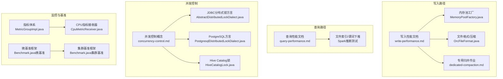
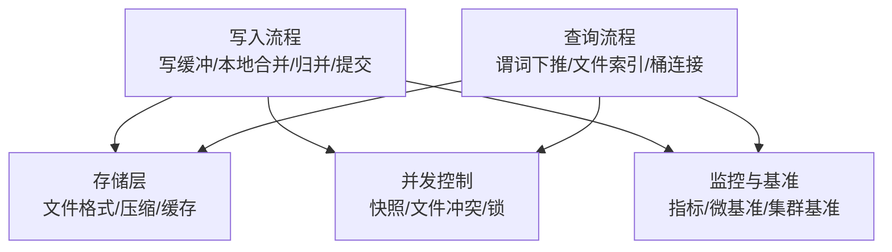
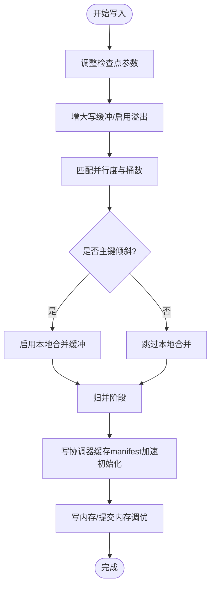
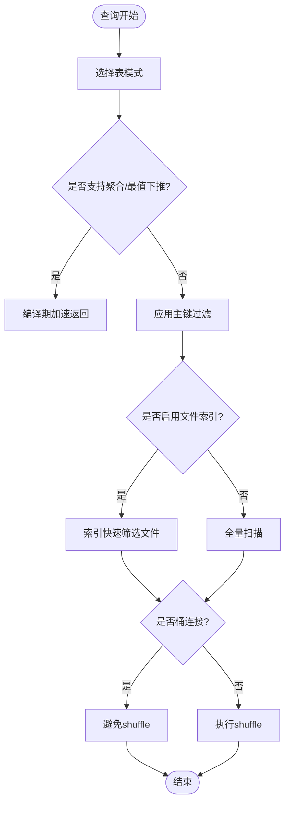
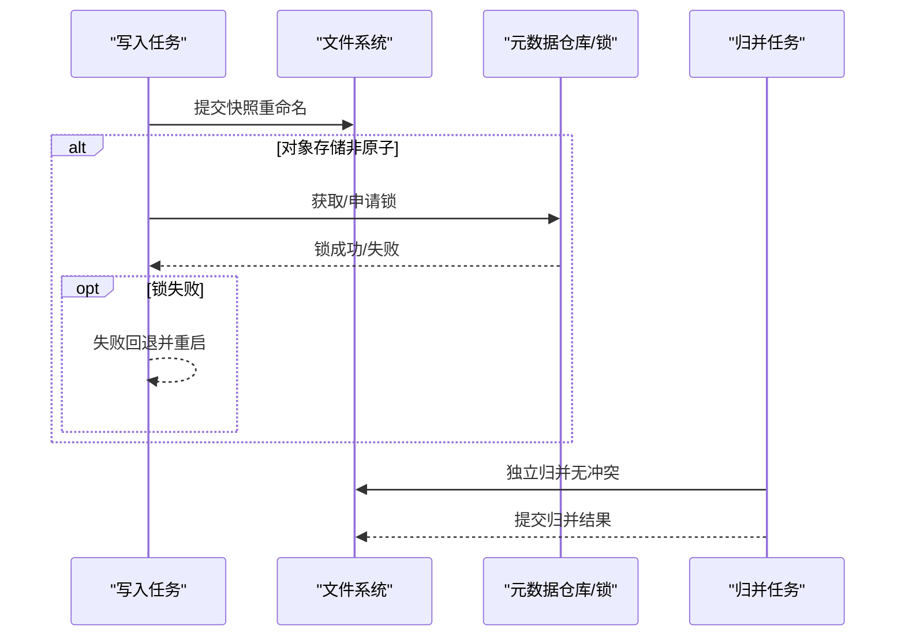
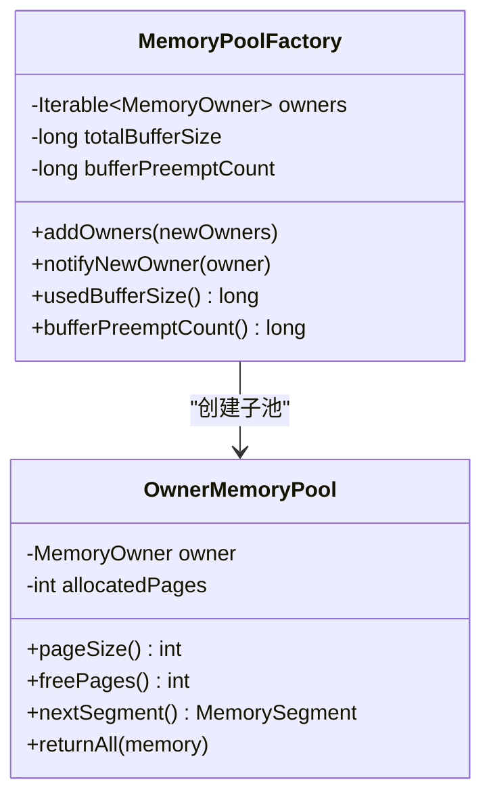
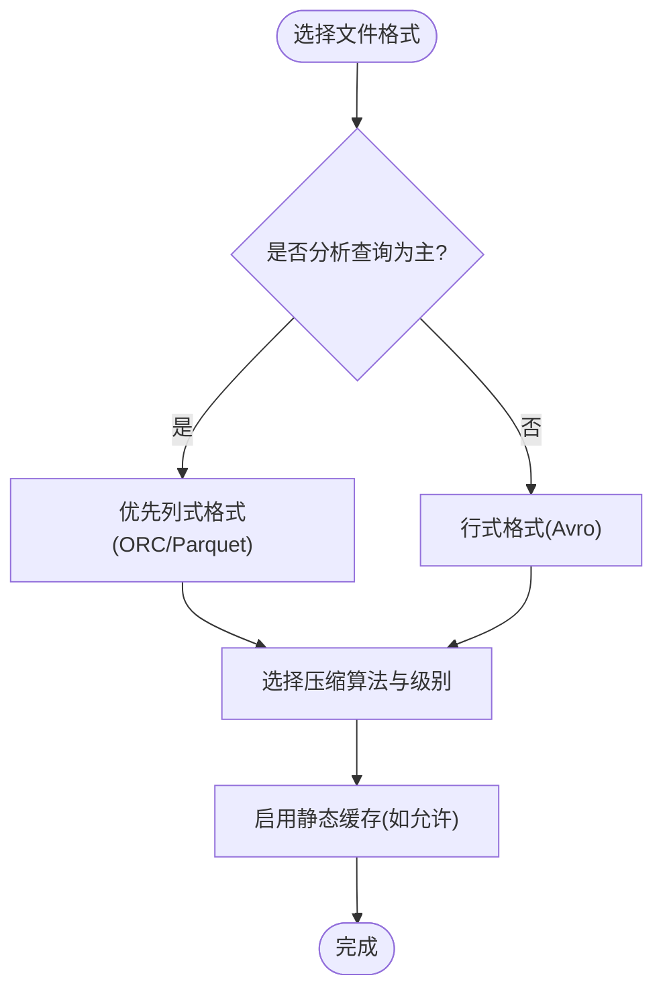
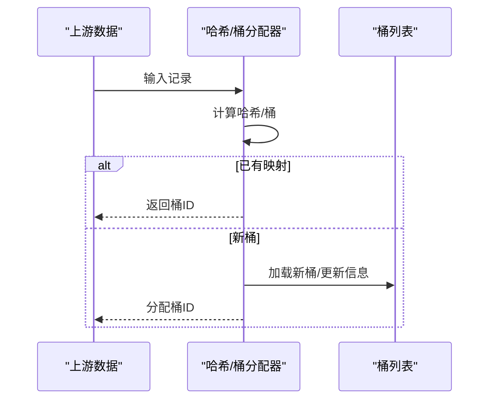
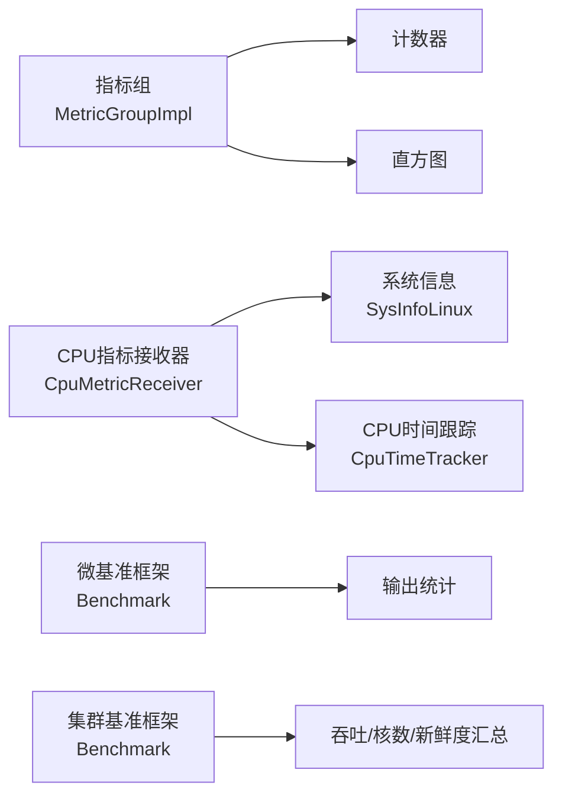
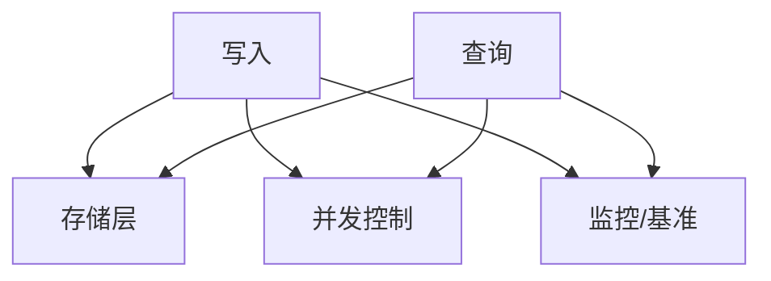

# 性能优化

<cite>
**本文引用的文件**
- [write-performance.md](file://docs/content/maintenance/write-performance.md)
- [query-performance.md](file://docs/content/primary-key-table/query-performance.md)
- [concurrency-control.md](file://docs/content/concepts/concurrency-control.md)
- [dedicated-compaction.md](file://docs/content/maintenance/dedicated-compaction.md)
- [configurations.md](file://docs/content/maintenance/configurations.md)
- [metrics.md](file://docs/content/maintenance/metrics.md)
- [MemoryPoolFactory.java](file://paimon-core/src/main/java/org/apache/paimon/memory/MemoryPoolFactory.java)
- [MemoryPoolFactoryTest.java](file://paimon-core/src/test/java/org/apache/paimon/memory/MemoryPoolFactoryTest.java)
- [CacheManagerTest.java](file://paimon-common/src/test/java/org/apache/paimon/io/cache/CacheManagerTest.java)
- [CacheManagerBenchmark.java](file://paimon-benchmark/paimon-micro-benchmarks/src/test/java/org/apache/paimon/benchmark/cache/CacheManagerBenchmark.java)
- [CpuMetricReceiver.java](file://paimon-benchmark/paimon-cluster-benchmark/src/main/java/org/apache/paimon/benchmark/metric/cpu/CpuMetricReceiver.java)
- [Benchmark.java（微基准）](file://paimon-benchmark/paimon-micro-benchmarks/src/test/java/org/apache/paimon/benchmark/Benchmark.java)
- [Benchmark.java（集群基准）](file://paimon-benchmark/paimon-cluster-benchmark/src/main/java/org/apache/paimon/benchmark/Benchmark.java)
- [CpuTimeTracker.java](file://paimon-benchmark/paimon-cluster-benchmark/src/main/java/org/apache/paimon/benchmark/metric/cpu/CpuTimeTracker.java)
- [SysInfoLinux.java](file://paimon-benchmark/paimon-cluster-benchmark/src/main/java/org/apache/paimon/benchmark/metric/cpu/SysInfoLinux.java)
- [TestingMetricUtils.java](file://paimon-flink/paimon-flink-common/src/test/java/org/apache/paimon/flink/utils/TestingMetricUtils.java)
- [MetricGroupImpl.java](file://paimon-core/src/main/java/org/apache/paimon/metrics/MetricGroupImpl.java)
- [CompactProcedure.java](file://paimon-spark/paimon-spark-common/src/main/java/org/apache/paimon/spark/procedure/CompactProcedure.java)
- [TableTestBase.java](file://paimon-core/src/test/java/org/apache/paimon/table/TableTestBase.java)
- [SimpleHashBucketAssigner.java](file://paimon-core/src/main/java/org/apache/paimon/index/SimpleHashBucketAssigner.java)
- [row_key_extractor.py](file://paimon-python/pypaimon/write/row_key_extractor.py)
- [bucket_mode.py](file://paimon-python/pypaimon/table/bucket_mode.py)
- [PostgresqlDistributedLockDialect.java](file://paimon-core/src/main/java/org/apache/paimon/jdbc/PostgresqlDistributedLockDialect.java)
- [AbstractDistributedLockDialect.java](file://paimon-core/src/main/java/org/apache/paimon/jdbc/AbstractDistributedLockDialect.java)
- [JdbcCatalogLock.java](file://paimon-core/src/main/java/org/apache/paimon/jdbc/JdbcCatalogLock.java)
- [HiveCatalogLock.java](file://paimon-hive/paimon-hive-catalog/src/main/java/org/apache/paimon/hive/HiveCatalogLock.java)
- [HiveCatalogITCaseBase.java](file://paimon-hive/paimon-hive-catalog/src/test/java/org/apache/paimon/hive/HiveCatalogITCaseBase.java)
- [OrcFileFormat.java](file://paimon-format/src/main/java/org/apache/paimon/format/orc/OrcFileFormat.java)
- [OrcFileFormatTest.java](file://paimon-format/src/test/java/org/apache/paimon/format/orc/OrcFileFormatTest.java)
- [FileFormatTest.java](file://paimon-core/src/test/java/org/apache/paimon/FileFormatTest.java)
- [pyarrow_file_io.py](file://paimon-python/pypaimon/filesystem/pyarrow_file_io.py)
- [TableReadBenchmark.java](file://paimon-benchmark/paimon-micro-benchmarks/src/test/java/org/apache/paimon/benchmark/TableReadBenchmark.java)
- [PaimonPushDownTestBase.scala](file://paimon-spark/paimon-spark-ut/src/test/scala/org/apache/paimon/spark/sql/PaimonPushDownTestBase.scala)
- [CatalogOptions.java](file://paimon-api/src/main/java/org/apache/paimon/options/CatalogOptions.java)
- [ExceptionUtils.java](file://paimon-common/src/main/java/org/apache/paimon/utils/ExceptionUtils.java)
- [client.py](file://paimon-python/pypaimon/api/client.py)
- [DefaultErrorHandlerTest.java](file://paimon-core/src/test/java/org/apache/paimon/rest/DefaultErrorHandlerTest.java)
</cite>

## 目录
1. [简介](#简介)
2. [项目结构](#项目结构)
3. [核心组件](#核心组件)
4. [架构总览](#架构总览)
5. [详细组件分析](#详细组件分析)
6. [依赖分析](#依赖分析)
7. [性能考量](#性能考量)
8. [故障排查指南](#故障排查指南)
9. [结论](#结论)
10. [附录](#附录)

## 简介
本指南面向Apache Paimon在生产环境中的性能优化，覆盖写入、查询、内存管理、存储层、并发控制、性能监控与诊断、基准测试以及常见问题排查。内容基于官方文档与源码实现，帮助读者系统性地定位瓶颈并实施针对性优化。

## 项目结构
围绕性能优化的关键模块与文档如下：
- 写入性能：写入参数、缓冲区、压缩、分区与桶、并行度、初始化加速、内存与提交阶段内存
- 查询性能：表模式、聚合下推、主键过滤、文件索引、桶连接
- 并发控制：快照冲突与文件冲突、对象存储锁、专用归并作业
- 存储层：文件格式选择、压缩算法、缓存策略
- 内存管理：内存池工厂、抢占与释放、Flink托管内存
- 监控与诊断：指标体系、CPU/系统资源采集、微基准与集群基准
- 基准测试：微基准与集群基准框架、读取对比
- 故障排查：异常字符串化、REST错误处理

**图表来源**
- [write-performance.md](file://docs/content/maintenance/write-performance.md)
- [dedicated-compaction.md](file://docs/content/maintenance/dedicated-compaction.md)
- [MemoryPoolFactory.java](file://paimon-core/src/main/java/org/apache/paimon/memory/MemoryPoolFactory.java)
- [OrcFileFormat.java](file://paimon-format/src/main/java/org/apache/paimon/format/orc/OrcFileFormat.java)
- [query-performance.md](file://docs/content/primary-key-table/query-performance.md)
- [concurrency-control.md](file://docs/content/concepts/concurrency-control.md)
- [AbstractDistributedLockDialect.java](file://paimon-core/src/main/java/org/apache/paimon/jdbc/AbstractDistributedLockDialect.java)
- [PostgresqlDistributedLockDialect.java](file://paimon-core/src/main/java/org/apache/paimon/jdbc/PostgresqlDistributedLockDialect.java)
- [HiveCatalogLock.java](file://paimon-hive/paimon-hive-catalog/src/main/java/org/apache/paimon/hive/HiveCatalogLock.java)
- [MetricGroupImpl.java](file://paimon-core/src/main/java/org/apache/paimon/metrics/MetricGroupImpl.java)
- [CpuMetricReceiver.java](file://paimon-benchmark/paimon-cluster-benchmark/src/main/java/org/apache/paimon/benchmark/metric/cpu/CpuMetricReceiver.java)
- [Benchmark.java（微基准）](file://paimon-benchmark/paimon-micro-benchmarks/src/test/java/org/apache/paimon/benchmark/Benchmark.java)
- [Benchmark.java（集群基准）](file://paimon-benchmark/paimon-cluster-benchmark/src/main/java/org/apache/paimon/benchmark/Benchmark.java)

**章节来源**
- [write-performance.md](file://docs/content/maintenance/write-performance.md)
- [query-performance.md](file://docs/content/primary-key-table/query-performance.md)
- [concurrency-control.md](file://docs/content/concepts/concurrency-control.md)
- [dedicated-compaction.md](file://docs/content/maintenance/dedicated-compaction.md)
- [configurations.md](file://docs/content/maintenance/configurations.md)
- [metrics.md](file://docs/content/maintenance/metrics.md)

## 核心组件
- 写入性能优化要点
  - 调整检查点间隔、并发检查点数、批模式；增大写缓冲大小与启用可溢出缓冲；按需调整桶数量
  - 在全量同步阶段关闭变更日志生产策略以提升吞吐，增量阶段再开启
  - 避免输入抖动导致背压，可考虑异步归并
  - 并行度建议与桶数匹配或小于等于桶数
  - 局部合并缓冲用于缓解主键数据倾斜
  - 文件格式与压缩：列式格式适合分析查询，行式格式适合高写吞吐但牺牲投影与压缩效率
  - 初始化加速：使用协调器缓存manifest以加速写入初始化
  - 写内存与提交内存：合理设置排序run数量、批大小、字典编码开关、Flink托管内存或细粒度资源管理
- 查询性能优化要点
  - 表模式影响最大：MOW/读优化表无桶限制并发，可利用非主键过滤条件
  - 聚合下推与最小最大统计可加速编译期查询
  - 主键过滤与文件索引（布隆/位图/范围位图）显著减少扫描文件数
  - 桶连接避免shuffle，需两表桶策略一致
- 并发控制要点
  - 快照冲突可重试；文件冲突需失败回退并重启
  - 对象存储需启用锁与元数据仓库存储快照
  - 通过“写入只写”与专用归并作业消除冲突
- 存储层要点
  - 文件格式：ORC/Parquet/Avro；压缩算法：zstd/LZ4/snappy等
  - 缓存策略：静态缓存开关、页缓存命中与替换
- 内存管理要点
  - 内存池工厂支持所有者注册、按需抢占、释放与统计
  - 可结合Flink托管内存与细粒度资源分配降低OOM风险
- 监控与诊断
  - 指标类型：计数器、直方图、仪表盘；CPU/系统资源采集
  - 微基准与集群基准：迭代次数、预热轮次、输出每轮耗时
- 基准测试
  - 读取对比：不同文件格式的读取性能对比
- 故障排查
  - 异常字符串化、REST错误映射、请求ID增强

**章节来源**
- [write-performance.md](file://docs/content/maintenance/write-performance.md)
- [query-performance.md](file://docs/content/primary-key-table/query-performance.md)
- [concurrency-control.md](file://docs/content/concepts/concurrency-control.md)
- [dedicated-compaction.md](file://docs/content/maintenance/dedicated-compaction.md)
- [MemoryPoolFactory.java](file://paimon-core/src/main/java/org/apache/paimon/memory/MemoryPoolFactory.java)
- [OrcFileFormat.java](file://paimon-format/src/main/java/org/apache/paimon/format/orc/OrcFileFormat.java)
- [MetricGroupImpl.java](file://paimon-core/src/main/java/org/apache/paimon/metrics/MetricGroupImpl.java)
- [Benchmark.java（微基准）](file://paimon-benchmark/paimon-micro-benchmarks/src/test/java/org/apache/paimon/benchmark/Benchmark.java)
- [TableReadBenchmark.java](file://paimon-benchmark/paimon-micro-benchmarks/src/test/java/org/apache/paimon/benchmark/TableReadBenchmark.java)
- [ExceptionUtils.java](file://paimon-common/src/main/java/org/apache/paimon/utils/ExceptionUtils.java)
- [client.py](file://paimon-python/pypaimon/api/client.py)

## 架构总览
下图展示写入与查询关键路径的组件交互，以及监控与基准测试的支撑模块。

**图表来源**
- [write-performance.md](file://docs/content/maintenance/write-performance.md)
- [query-performance.md](file://docs/content/primary-key-table/query-performance.md)
- [concurrency-control.md](file://docs/content/concepts/concurrency-control.md)
- [configurations.md](file://docs/content/maintenance/configurations.md)
- [metrics.md](file://docs/content/maintenance/metrics.md)

## 详细组件分析

### 写入性能优化
- 参数与策略
  - 检查点与时序：延长检查点间隔、限制并发检查点数、批模式
  - 写缓冲：增大写缓冲大小、启用可溢出缓冲
  - 桶与并行度：桶数与Sink并行度匹配或小于等于桶数
  - 局部合并：针对主键倾斜场景启用本地合并缓冲
  - 归并策略：全量同步阶段关闭变更日志生产策略，增量阶段恢复
  - 初始化加速：启用写协调器缓存manifest
  - 写内存与提交内存：调整排序run触发数、批大小、字典编码、Flink托管内存或细粒度资源
- 关键实现参考
  - 写入初始化与协调器缓存：[TableTestBase.java](file://paimon-core/src/test/java/org/apache/paimon/table/TableTestBase.java)
  - 批量归并（Spark）：[CompactProcedure.java](file://paimon-spark/paimon-spark-common/src/main/java/org/apache/paimon/spark/procedure/CompactProcedure.java)
  - 文件格式与压缩：[OrcFileFormat.java](file://paimon-format/src/main/java/org/apache/paimon/format/orc/OrcFileFormat.java)、[FileFormatTest.java](file://paimon-core/src/test/java/org/apache/paimon/FileFormatTest.java)
  - Python写入路径（含压缩映射）：[pyarrow_file_io.py](file://paimon-python/pypaimon/filesystem/pyarrow_file_io.py)

**图表来源**
- [write-performance.md](file://docs/content/maintenance/write-performance.md)
- [TableTestBase.java](file://paimon-core/src/test/java/org/apache/paimon/table/TableTestBase.java)
- [CompactProcedure.java](file://paimon-spark/paimon-spark-common/src/main/java/org/apache/paimon/spark/procedure/CompactProcedure.java)
- [OrcFileFormat.java](file://paimon-format/src/main/java/org/apache/paimon/format/orc/OrcFileFormat.java)

**章节来源**
- [write-performance.md](file://docs/content/maintenance/write-performance.md)
- [TableTestBase.java](file://paimon-core/src/test/java/org/apache/paimon/table/TableTestBase.java)
- [CompactProcedure.java](file://paimon-spark/paimon-spark-common/src/main/java/org/apache/paimon/spark/procedure/CompactProcedure.java)
- [OrcFileFormat.java](file://paimon-format/src/main/java/org/apache/paimon/format/orc/OrcFileFormat.java)
- [FileFormatTest.java](file://paimon-core/src/test/java/org/apache/paimon/FileFormatTest.java)
- [pyarrow_file_io.py](file://paimon-python/pypaimon/filesystem/pyarrow_file_io.py)

### 查询性能优化
- 表模式与并发
  - MOW/读优化表无桶并发限制，可利用非主键过滤
- 聚合下推与统计
  - 启用统计模式后可对某些聚合与最值查询进行编译期加速
- 主键过滤与文件索引
  - 主键过滤显著减少文件扫描；文件索引（布隆/位图/范围位图）进一步加速
- 桶连接
  - 两表桶策略一致且桶数相同可避免shuffle

**图表来源**
- [query-performance.md](file://docs/content/primary-key-table/query-performance.md)
- [PaimonPushDownTestBase.scala](file://paimon-spark/paimon-spark-ut/src/test/scala/org/apache/paimon/spark/sql/PaimonPushDownTestBase.scala)

**章节来源**
- [query-performance.md](file://docs/content/primary-key-table/query-performance.md)
- [PaimonPushDownTestBase.scala](file://paimon-spark/paimon-spark-ut/src/test/scala/org/apache/paimon/spark/sql/PaimonPushDownTestBase.scala)

### 并发控制与锁策略
- 快照冲突与文件冲突
  - 快照冲突可重试；文件冲突需失败回退并重启
- 对象存储与锁
  - 对象存储RENAME不具备原子语义，需启用Hive/JDBC元数据仓库存储快照，并开启锁
- 专用归并作业
  - 设置“写入只写”，由独立作业执行归并，避免冲突

**图表来源**
- [concurrency-control.md](file://docs/content/concepts/concurrency-control.md)
- [dedicated-compaction.md](file://docs/content/maintenance/dedicated-compaction.md)
- [PostgresqlDistributedLockDialect.java](file://paimon-core/src/main/java/org/apache/paimon/jdbc/PostgresqlDistributedLockDialect.java)
- [AbstractDistributedLockDialect.java](file://paimon-core/src/main/java/org/apache/paimon/jdbc/AbstractDistributedLockDialect.java)
- [JdbcCatalogLock.java](file://paimon-core/src/main/java/org/apache/paimon/jdbc/JdbcCatalogLock.java)
- [HiveCatalogLock.java](file://paimon-hive/paimon-hive-catalog/src/main/java/org/apache/paimon/hive/HiveCatalogLock.java)
- [HiveCatalogITCaseBase.java](file://paimon-hive/paimon-hive-catalog/src/test/java/org/apache/paimon/hive/HiveCatalogITCaseBase.java)

**章节来源**
- [concurrency-control.md](file://docs/content/concepts/concurrency-control.md)
- [dedicated-compaction.md](file://docs/content/maintenance/dedicated-compaction.md)
- [PostgresqlDistributedLockDialect.java](file://paimon-core/src/main/java/org/apache/paimon/jdbc/PostgresqlDistributedLockDialect.java)
- [AbstractDistributedLockDialect.java](file://paimon-core/src/main/java/org/apache/paimon/jdbc/AbstractDistributedLockDialect.java)
- [JdbcCatalogLock.java](file://paimon-core/src/main/java/org/apache/paimon/jdbc/JdbcCatalogLock.java)
- [HiveCatalogLock.java](file://paimon-hive/paimon-hive-catalog/src/main/java/org/apache/paimon/hive/HiveCatalogLock.java)
- [HiveCatalogITCaseBase.java](file://paimon-hive/paimon-hive-catalog/src/test/java/org/apache/paimon/hive/HiveCatalogITCaseBase.java)

### 内存管理优化
- 内存池工厂
  - 支持所有者注册、按需抢占、释放与统计；记录抢占次数与占用
- Flink托管内存与细粒度资源
  - 可将写缓冲放入Flink托管内存，或通过细粒度资源管理仅提升Committer堆内存

**图表来源**
- [MemoryPoolFactory.java](file://paimon-core/src/main/java/org/apache/paimon/memory/MemoryPoolFactory.java)

**章节来源**
- [MemoryPoolFactory.java](file://paimon-core/src/main/java/org/apache/paimon/memory/MemoryPoolFactory.java)
- [MemoryPoolFactoryTest.java](file://paimon-core/src/test/java/org/apache/paimon/memory/MemoryPoolFactoryTest.java)
- [write-performance.md](file://docs/content/maintenance/write-performance.md)

### 存储层优化
- 文件格式与压缩
  - 列式格式适合分析查询；行式格式适合高写吞吐但投影与压缩效率较低
  - 压缩算法可选zstd/LZ4/snappy等，级别越高压缩比越大但读写速度下降
- 缓存策略
  - 允许静态缓存的文件IO配置项；页缓存命中与替换逻辑

**图表来源**
- [write-performance.md](file://docs/content/maintenance/write-performance.md)
- [configurations.md](file://docs/content/maintenance/configurations.md)
- [OrcFileFormat.java](file://paimon-format/src/main/java/org/apache/paimon/format/orc/OrcFileFormat.java)
- [OrcFileFormatTest.java](file://paimon-format/src/test/java/org/apache/paimon/format/orc/OrcFileFormatTest.java)
- [FileFormatTest.java](file://paimon-core/src/test/java/org/apache/paimon/FileFormatTest.java)
- [pyarrow_file_io.py](file://paimon-python/pypaimon/filesystem/pyarrow_file_io.py)
- [CatalogOptions.java](file://paimon-api/src/main/java/org/apache/paimon/options/CatalogOptions.java)

**章节来源**
- [write-performance.md](file://docs/content/maintenance/write-performance.md)
- [configurations.md](file://docs/content/maintenance/configurations.md)
- [OrcFileFormat.java](file://paimon-format/src/main/java/org/apache/paimon/format/orc/OrcFileFormat.java)
- [OrcFileFormatTest.java](file://paimon-format/src/test/java/org/apache/paimon/format/orc/OrcFileFormatTest.java)
- [FileFormatTest.java](file://paimon-core/src/test/java/org/apache/paimon/FileFormatTest.java)
- [pyarrow_file_io.py](file://paimon-python/pypaimon/filesystem/pyarrow_file_io.py)
- [CatalogOptions.java](file://paimon-api/src/main/java/org/apache/paimon/options/CatalogOptions.java)

### 并发与桶分配
- 分桶与哈希
  - 固定/动态分桶策略；Python侧随机挑选桶与信息维护
  - Java侧简单分区索引维护桶信息与当前桶游标

**图表来源**
- [row_key_extractor.py](file://paimon-python/pypaimon/write/row_key_extractor.py)
- [bucket_mode.py](file://paimon-python/pypaimon/table/bucket_mode.py)
- [SimpleHashBucketAssigner.java](file://paimon-core/src/main/java/org/apache/paimon/index/SimpleHashBucketAssigner.java)

**章节来源**
- [row_key_extractor.py](file://paimon-python/pypaimon/write/row_key_extractor.py)
- [bucket_mode.py](file://paimon-python/pypaimon/table/bucket_mode.py)
- [SimpleHashBucketAssigner.java](file://paimon-core/src/main/java/org/apache/paimon/index/SimpleHashBucketAssigner.java)

### 性能监控与诊断
- 指标体系
  - 计数器、直方图、仪表盘；支持变量注入与注册去重
- CPU/系统资源采集
  - CPU时间跟踪、累计时间、采样时间；系统信息采集（内存、磁盘、网络）
- 微基准与集群基准
  - 迭代次数、预热轮次、每轮耗时输出；集群基准包含吞吐、核数、数据新鲜度等汇总

**图表来源**
- [MetricGroupImpl.java](file://paimon-core/src/main/java/org/apache/paimon/metrics/MetricGroupImpl.java)
- [CpuMetricReceiver.java](file://paimon-benchmark/paimon-cluster-benchmark/src/main/java/org/apache/paimon/benchmark/metric/cpu/CpuMetricReceiver.java)
- [SysInfoLinux.java](file://paimon-benchmark/paimon-cluster-benchmark/src/main/java/org/apache/paimon/benchmark/metric/cpu/SysInfoLinux.java)
- [CpuTimeTracker.java](file://paimon-benchmark/paimon-cluster-benchmark/src/main/java/org/apache/paimon/benchmark/metric/cpu/CpuTimeTracker.java)
- [Benchmark.java（微基准）](file://paimon-benchmark/paimon-micro-benchmarks/src/test/java/org/apache/paimon/benchmark/Benchmark.java)
- [Benchmark.java（集群基准）](file://paimon-benchmark/paimon-cluster-benchmark/src/main/java/org/apache/paimon/benchmark/Benchmark.java)

**章节来源**
- [metrics.md](file://docs/content/maintenance/metrics.md)
- [MetricGroupImpl.java](file://paimon-core/src/main/java/org/apache/paimon/metrics/MetricGroupImpl.java)
- [CpuMetricReceiver.java](file://paimon-benchmark/paimon-cluster-benchmark/src/main/java/org/apache/paimon/benchmark/metric/cpu/CpuMetricReceiver.java)
- [SysInfoLinux.java](file://paimon-benchmark/paimon-cluster-benchmark/src/main/java/org/apache/paimon/benchmark/metric/cpu/SysInfoLinux.java)
- [CpuTimeTracker.java](file://paimon-benchmark/paimon-cluster-benchmark/src/main/java/org/apache/paimon/benchmark/metric/cpu/CpuTimeTracker.java)
- [Benchmark.java（微基准）](file://paimon-benchmark/paimon-micro-benchmarks/src/test/java/org/apache/paimon/benchmark/Benchmark.java)
- [Benchmark.java（集群基准）](file://paimon-benchmark/paimon-cluster-benchmark/src/main/java/org/apache/paimon/benchmark/Benchmark.java)

### 基准测试方法与工具
- 微基准
  - 迭代次数、预热轮次、每轮耗时输出；支持自定义用例
- 集群基准
  - 吞吐（行/秒）、总行数、核数、每核吞吐、数据新鲜度等汇总
- 读取对比
  - 不同文件格式的读取性能对比

**章节来源**
- [Benchmark.java（微基准）](file://paimon-benchmark/paimon-micro-benchmarks/src/test/java/org/apache/paimon/benchmark/Benchmark.java)
- [Benchmark.java（集群基准）](file://paimon-benchmark/paimon-cluster-benchmark/src/main/java/org/apache/paimon/benchmark/Benchmark.java)
- [TableReadBenchmark.java](file://paimon-benchmark/paimon-micro-benchmarks/src/test/java/org/apache/paimon/benchmark/TableReadBenchmark.java)

### 故障排查指南
- 异常处理
  - 异常字符串化便于日志与诊断
- REST错误映射
  - 根据HTTP状态码映射到具体异常类型，附带请求ID增强可追溯性
- 单元测试验证
  - REST错误处理器的多状态码断言

**章节来源**
- [ExceptionUtils.java](file://paimon-common/src/main/java/org/apache/paimon/utils/ExceptionUtils.java)
- [client.py](file://paimon-python/pypaimon/api/client.py)
- [DefaultErrorHandlerTest.java](file://paimon-core/src/test/java/org/apache/paimon/rest/DefaultErrorHandlerTest.java)

## 依赖分析
- 组件耦合
  - 写入路径依赖存储层（文件格式/压缩/缓存），受并发控制约束，受监控与基准测试反馈驱动优化
  - 查询路径依赖文件索引与桶连接策略，受统计与谓词下推加速
- 外部依赖
  - Flink托管内存与细粒度资源管理
  - 对象存储与元数据仓库/锁服务

**图表来源**
- [write-performance.md](file://docs/content/maintenance/write-performance.md)
- [query-performance.md](file://docs/content/primary-key-table/query-performance.md)
- [concurrency-control.md](file://docs/content/concepts/concurrency-control.md)
- [metrics.md](file://docs/content/maintenance/metrics.md)

## 性能考量
- 写入
  - 检查点与缓冲是关键；桶与并行度匹配；必要时启用异步归并
  - 文件格式与压缩权衡写吞吐与查询效率
- 查询
  - 优先列式格式与文件索引；利用主键过滤与桶连接
- 并发
  - 对象存储需锁与元数据仓库存储；写入只写+专用归并
- 内存
  - 合理设置写缓冲与托管内存；按需抢占与释放
- 监控
  - 指标与CPU/系统资源采集；微基准与集群基准持续回归

[本节为通用指导，无需特定文件分析]

## 故障排查指南
- 快照冲突与文件冲突
  - 重试与失败回退；对象存储启用锁与元数据仓库
- OOM与内存不足
  - 减少字典编码、降低批大小、启用托管内存或细粒度资源
- 读取慢
  - 启用文件索引、主键过滤、列式格式、并行度与桶策略优化
- 基准异常
  - 使用异常字符串化与REST错误映射定位问题

**章节来源**
- [concurrency-control.md](file://docs/content/concepts/concurrency-control.md)
- [write-performance.md](file://docs/content/maintenance/write-performance.md)
- [query-performance.md](file://docs/content/primary-key-table/query-performance.md)
- [ExceptionUtils.java](file://paimon-common/src/main/java/org/apache/paimon/utils/ExceptionUtils.java)
- [client.py](file://paimon-python/pypaimon/api/client.py)

## 结论
通过系统性的参数调优、合理的存储层选择、严格的并发控制与完善的监控基准体系，可在不同场景下获得稳定且可预期的性能表现。建议以基准测试为依据持续迭代优化，并结合监控告警与故障排查流程保障生产稳定性。

[本节为总结，无需特定文件分析]

## 附录
- 最佳实践清单
  - 写入：延长检查点间隔、增大写缓冲、匹配并行度与桶数、启用异步归并、按需关闭变更日志生产策略
  - 查询：列式格式优先、启用文件索引与主键过滤、利用桶连接、开启聚合/最值下推
  - 并发：对象存储启用锁与元数据仓库、写入只写+专用归并
  - 存储：根据场景选择文件格式与压缩级别、启用静态缓存
  - 内存：托管内存与细粒度资源、合理字典编码与批大小
  - 监控：指标与CPU/系统资源采集、微基准与集群基准回归

[本节为概览，无需特定文件分析]